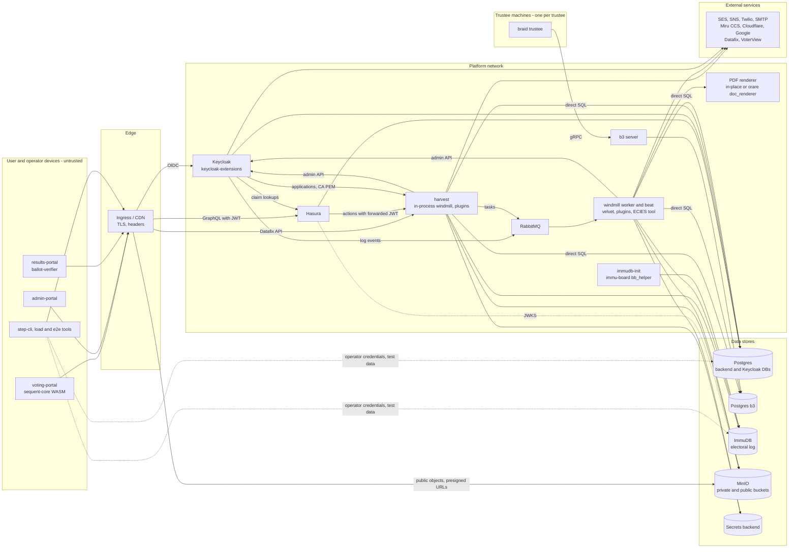

<!--
SPDX-FileCopyrightText: 2026 Sequent Tech Inc <legal@sequentech.io>

SPDX-License-Identifier: AGPL-3.0-only
-->

# Sequent Voting Platform threat model

This is the system threat model for this repository on the `release/10.0` branch. Each package has its own model in `packages/<package>/THREAT_MODEL.md` that covers its assets, entry points, threats, assumptions and review focus. This file covers what no single package owns: the security goals, the actors, the trust boundaries between components, the main data flows, threats that span packages, and the build and deployment surface. Package threat IDs such as `harvest-T3` refer to the package files listed under [Package models](#package-models). The threat model pages under `docs/docusaurus/` are still placeholders, and this file does not replace them yet.

Status values, used here and in the package models: **Mitigated** (a control exists in the code and covers the threat), **Partial** (a control exists but does not cover every path, or depends on deployment), **Not verified** (the control is expected but was not confirmed in this repository), **Accepted** (a known limit of the design), and **Open on release/10.0 (fix in sequentech/step#3522)**.

## Security goals

- **Ballot secrecy**: no party below the trustee threshold can link a voter to the content of a ballot, and plaintext selections never leave the voter's device unencrypted.
- **Integrity and verifiability**: a ballot is cast as intended (Benaloh audit in voting-portal, ballot-verifier), recorded as cast (ballot tracker, ballot locator, electoral log) and counted as recorded (signed board transcript, shuffle and decryption proofs, braid `verify`).
- **Eligibility**: only voters of an election event, area and election can cast, within the voting period, channel and revote limit.
- **Tenant and election-event isolation**: data, realms, boards, log databases, documents and tasks of one tenant or event are not readable or writable from another.
- **Auditability**: administrative, voter and ceremony actions are recorded, attributable and tamper-evident in the electoral log.
- **Availability during the voting period**: login, ballot loading and casting keep working under load and partial failures.
- **Protection of keys and credentials**: trustee shares, protocol-manager keys, the master secret, the ACM signing key, SBEI PKCS#12 bundles, service credentials and voter secrets stay with their owners.

## Actors and trust levels

| Actor | Reaches the system through | Trusted with |
|---|---|---|
| Voter | voting-portal, ballot-verifier, results-portal (authenticated publications), Keycloak event realm, IVR, kiosk | Their own credentials and ballot. Untrusted for everything else |
| Election manager and other admin roles (restricted admins, label-scoped admins, SBEI members) | admin-portal, step-cli, Keycloak tenant realm | The operations their Keycloak roles and permission labels grant within one tenant |
| Trustee | admin-portal trustee screens, step-cli, braid trustee process | One key share and their braid signing key. Fewer than the threshold are assumed to collude |
| Tenant administrator | admin-portal, Keycloak tenant realm admin | Tenant configuration, realm settings and the tenant's admins |
| Sequent operator | Deployment (gitops), secrets backend, object storage (including `plugins/`), databases, CI, test and load tooling | The infrastructure, including secrets with full access to the stores. Trustee keys are outside this trust |
| Auditor / public observer | results-portal, braid `verify`, published artefacts | Nothing. They verify published data independently |
| External services | Outbound calls (SES, SNS, Twilio, SMTP, Miru CCS, Cloudflare, Google, VoterView, AWS Lambda or OpenWhisk renderer); Datafix registry calling `/api/datafix`; Loadero for e2e test runs | Only the data each integration needs. Datafix is authenticated by its own credentials |

## Components and trust boundaries

| Boundary | What crosses it | Check at the boundary |
|---|---|---|
| Device to ingress | HTTPS requests, OIDC redirects, presigned URL fetches | TLS and response headers at the ingress (outside this repository) |
| Ingress to Keycloak | Logins and forwarded headers | Keycloak flows and keycloak-extensions authenticators; the ingress controls forwarded headers (deployment) |
| Ingress to Hasura | GraphQL with a Keycloak bearer JWT, or no token | JWT verified against the JWKS. Role permissions per table. No token means role `unauthorized` |
| Hasura to harvest | Action payloads with the caller's token | Per-action role list in Hasura; permission checks in harvest; network isolation (deployment) |
| Ingress to harvest | `/api/datafix/*` | Datafix credentials |
| Keycloak to platform | Hasura lookups, harvest calls (`/verify-application`, the per-event CA PEM route), electoral-log events on RabbitMQ | Service credentials; the CA PEM route serves public data; network isolation (deployment) |
| Producers to RabbitMQ to windmill | Celery task messages and electoral-log events | Broker credentials; network isolation (deployment) |
| harvest and windmill to Postgres | Direct SQL on the backend, Keycloak and b3 databases | Tenant and event predicates in code; Hasura permissions do not apply |
| harvest and windmill to immudb | Electoral-log and pgaudit reads and writes over gRPC (immudb-rs) | Service credentials; network isolation (deployment) |
| windmill and braid via b3 | Signed board messages (configuration, DKG, ballots, mixes, plaintexts) | Message signatures and proofs; network isolation (deployment) |
| Plugin host to WASM plugin | Route data, caller claims and host calls | wasmtime with a WASI context that has stdio only |
| windmill and velvet to PDF renderer | Report and ballot-image HTML with PII or decoded ballots; PDF back | In-place Chrome inside the caller, or orare `doc_renderer` on Lambda or OpenWhisk; network isolation (deployment) |
| harvest and windmill to child processes | ECIES tool and `openssl` with keys, passwords and PKCS#12 bundles in arguments and temp files | Process boundary only; argument and shell handling Open on release/10.0 (fix in sequentech/step#3522) |
| Platform to object storage | JWKS, published ballots, results, plugins, templates, documents, exports | Bucket policies and presigned URLs |
| Platform to external services | Messages, transmission packages, DNS and WAF changes, registry data | Credentials per integration; TLS |
| Test and load tooling to a deployment | Synthetic voters and ballots, scenario credentials, direct store writes (step-cli, voting-load, loadtesting, e2e) | Operator choice of target and credentials; API calls go through the usual server checks |
| CI to registries to deployment | Images, release tags, dispatches to private repositories | GitHub Actions secrets and registry credentials |

## Key data flows

**Vote casting**
1. voting-portal fetches the ballot style and election public key through presigned URLs from `get_ballot_files_urls` and checks event, election and style IDs against the authorized references.
2. The sequent-core WASM, called through ui-core wrappers, encodes and encrypts each contest (strand ElGamal over Ristretto with a Schnorr proof of knowledge) and computes the ballot tracker.
3. Hasura accepts `insert_cast_vote` for role `user` and forwards it with the voter's token to harvest.
4. harvest checks the voter's authorization and calls windmill in process.
5. windmill validates the ballot and the election state and inserts the row.
6. A database trigger enforces area exclusivity and the revote limit.
7. windmill writes the cast, or the failure, to the electoral log. The voter keeps the ballot ID and can look it up in the ballot locator.
8. Audit instead of cast: voting-portal shows the ballot ID and exports the auditable ballot. In ballot-verifier the voter logs in to the event realm and loads the file; the WASM re-encrypts the plaintext with the recorded randomness, compares the result with the ballot ID and shows the decoded selections.

**Key ceremony**
1. An admin starts the ceremony in admin-portal. harvest checks permissions and windmill creates a protocol-manager key for the board, stores it in the secrets backend and posts the signed configuration to b3.
2. Each braid trustee polls b3 over gRPC, verifies messages against the configuration, runs the Pedersen DKG with share verification, and posts signed channel, share and public-key statements.
3. windmill stores the election public key for the event, and ballot publication embeds it.
4. Each trustee downloads its encrypted share through harvest and proves possession of it (admin-portal or step-cli).

**Tally**
1. An admin creates a tally session. harvest checks permissions and labels; windmill posts the cast ballots, in batches per contest and area, to b3 under the protocol-manager key.
2. The selected trustees mix with strand shuffle proofs, check each other's mixes, and post decryption factors with Chaum-Pedersen proofs and the plaintexts.
3. windmill `execute_tally_session` collects the plaintexts per batch and runs velvet in a per-session directory with the approved tally sheets.
4. velvet decodes ballots through sequent-core, counts, marks winners and renders reports and the SQLite results database. PDFs go to the renderer chosen by `DOC_RENDERER_BACKEND`; ballot-image pages are signed with the ACM key through the ECIES tool. windmill stores results and documents and logs to the electoral log.
5. Auditors can re-check the finished board with braid `verify`.

**Results publication**
1. An admin with `publish-results-write` calls the `publishResultsWebsite` action (harvest `publish_results_website`). harvest checks the permission; the `guard_results_website_policy_update` trigger guards the policy column.
2. windmill builds the publication, uploads public artefacts and `results-index/<event>.json` to the public bucket, and posts the action to the electoral log.
3. results-portal reads the index and artefacts and opens the SQLite results in the browser with sql.js. Their integrity rests on bucket write control and TLS.
4. For `Authenticated` publications the viewer signs in to the event realm (client `results-portal`); the portal calls `resolveResultsPublication` and `fetchResultsArtifact`, and windmill `authorize_results_reader` decides before returning presigned URLs.

**Electoral log**
1. At deployment start, immudb-init (immu-board `bb_helper`) creates the board database. windmill creates each event's log database when the event is created or imported; harvest runs the same code in process when an election or area is added.
2. keycloak-extensions publishes login and account events to the RabbitMQ electoral-log queue. harvest and windmill post their own events, some through the same queue and some directly to immudb.
3. windmill consumes the queue and writes the entries to immudb through electoral-log `BoardClient` and immudb-rs.
4. Each entry carries a sender and a system signature (electoral-log `Message::sign`, strand Ed25519) and is stored in immudb, which is tamper-evident (SYS-T34).
5. Admins read the log through the `listElectoralLog` action; voters look up cast entries in the ballot locator.

**Plugin execution**
1. At startup, windmill and harvest load WASM components from the `plugins/` prefix in object storage into wasmtime with a WASI context that has stdio only. Operators build and upload the binaries. The only plugin is `miru`.
2. Hasura forwards the `call_plugin_route` action to harvest `POST /plugin`, which runs the route synchronously.
3. windmill `execute_plugin_task` runs routes marked as tasks. The host also offers a `transaction` interface with SQL on the Hasura and Keycloak databases, which miru does not call.

**Results transmission (Miru)**
1. windmill builds the per-area transmission package (EML, results, logs) in `services/consolidation`, signs it with the ACM key, encrypts it with a random password and wraps that password with ECIES for the CCS public key from the event configuration (ECIES tool).
2. SBEI members upload their PKCS#12 bundle and password through harvest `/miru/upload-signature` (`MIRU_SIGN`); harvest runs windmill `upload_signature_task` in process, which signs through the ECIES tool.
3. windmill sends the package to each configured CCS server, holding it back while the signature count is below the configured threshold, and records each send in the package's transmission log.

## System threats

| ID | STRIDE | Threat | Packages | Controls | Status |
|---|---|---|---|---|---|
| SYS-T1 | Spoofing | Forged or widened identity claims are accepted by Hasura, harvest or another service | keycloak-extensions, hasura, harvest, windmill, plugins | [keycloak-extensions-T10][keycloak-extensions], [hasura-T1][hasura], [hasura-T13][hasura], [harvest-T1][harvest], [windmill-T11][windmill], [plugins-T1][plugins], [sequent-core-T14][sequent-core] | Not verified |
| SYS-T2 | Elevation of privilege | Tenant or election-event isolation breaks in one layer (GraphQL permissions, services, background tasks, boards, logs, realms, plugins) | hasura, harvest, windmill, b3, electoral-log, immudb-rs, immu-board, plugins, admin-portal | [hasura-T2][hasura], [hasura-T3][hasura], [harvest-T3][harvest], [windmill-T2][windmill], [windmill-T3][windmill], [b3-T13][b3], [electoral-log-T10][electoral-log], [immudb-rs-T6][immudb-rs], [immudb-rs-T13][immudb-rs], [immu-board-T8][immu-board], [plugins-T4][plugins], [admin-portal-T3][admin-portal], [harvest-T14][harvest] | Partial |
| SYS-T3 | Elevation of privilege | An admin performs an operation outside the permissions, labels or step-up it requires | hasura, harvest, admin-portal, plugins | [hasura-T8][hasura], [hasura-T9][hasura], [hasura-T14][hasura], [harvest-T4][harvest], [harvest-T5][harvest], [harvest-T8][harvest], [admin-portal-T4][admin-portal], [admin-portal-T5][admin-portal], [admin-portal-T27][admin-portal], [plugins-T2][plugins], [hasura-T27][hasura] | Partial |
| SYS-T4 | Tampering | A ballot is accepted outside the voter's election, area, period, channel or revote limit, or altered on the cast path | voting-portal, ui-core, sequent-core, strand, harvest, windmill, hasura | [voting-portal-T3][voting-portal], [ui-core-T6][ui-core], [sequent-core-T4][sequent-core], [sequent-core-T6][sequent-core], [strand-T5][strand], [harvest-T22][harvest], [windmill-T4][windmill], [hasura-T6][hasura] | Partial |
| SYS-T5 | Information disclosure | Voters encrypt to an election public key that the trustees did not jointly produce | braid, b3, windmill, hasura, sequent-core, voting-portal, ballot-verifier | [braid-T5][braid], [braid-T18][braid], [b3-T1][b3], [b3-T4][b3], [b3-T7][b3], [sequent-core-T8][sequent-core], [voting-portal-T8][voting-portal], [ballot-verifier-T2][ballot-verifier], [hasura-T9][hasura] | Partial; braid-T5 Open on release/10.0 (fix in sequentech/step#3522) |
| SYS-T6 | Tampering | Published results differ from what the trustees decrypted, or ballots drop out between cast, mix, count and publication | braid, b3, strand, windmill, velvet, sequent-core, results-portal | [braid-T7][braid], [braid-T8][braid], [braid-T16][braid], [braid-T18][braid], [strand-T3][strand], [windmill-T20][windmill], [velvet-T4][velvet], [velvet-T5][velvet], [results-portal-T1][results-portal], [results-portal-T2][results-portal] | Partial |
| SYS-T7 | Information disclosure | Voter-ballot link: a voter is linked to their ballot content through stored data, the protocol manager's role or the voter's device | hasura, braid, strand, sequent-core, voting-portal, ballot-verifier, ui-core | [hasura-T23][hasura], [braid-T13][braid], [strand-T13][strand], [sequent-core-T1][sequent-core], [voting-portal-T6][voting-portal], [voting-portal-T7][voting-portal], [ballot-verifier-T6][ballot-verifier], [ballot-verifier-T7][ballot-verifier], [ui-core-T8][ui-core] | Partial |
| SYS-T8 | Information disclosure | Trustee key shares leave trustee control along the download, export and backup paths | braid, windmill, harvest, admin-portal, step-cli, ui-essentials | [braid-T11][braid], [braid-T12][braid], [harvest-T9][harvest], [harvest-T10][harvest], [windmill-T17][windmill], [admin-portal-T8][admin-portal], [admin-portal-T9][admin-portal], [admin-portal-T19][admin-portal], [step-cli-T5][step-cli], [ui-essentials-T8][ui-essentials] | Partial; admin-portal-T9 Open on release/10.0 (fix in sequentech/step#3522) |
| SYS-T9 | Repudiation | Electoral-log events are lost, forged, mislabelled or unattributable between producers, RabbitMQ and immudb | keycloak-extensions, harvest, windmill, electoral-log, immu-board, hasura, admin-portal | [keycloak-extensions-T14][keycloak-extensions], [windmill-T15][windmill], [harvest-T20][harvest], [hasura-T16][hasura], [admin-portal-T18][admin-portal], [electoral-log-T1][electoral-log], [electoral-log-T3][electoral-log], [electoral-log-T4][electoral-log], [electoral-log-T12][electoral-log], [immu-board-T6][immu-board] | Partial |
| SYS-T10 | Elevation of privilege | A party with broker access runs tasks or writes electoral-log events it is not entitled to | windmill, harvest, keycloak-extensions, electoral-log, plugins | [windmill-T1][windmill], [keycloak-extensions-T14][keycloak-extensions], [electoral-log-T1][electoral-log], [plugins-T1][plugins] | Partial |
| SYS-T11 | Information disclosure | Secrets and PII reach logs, traces, task or process arguments, or error responses | windmill, harvest, sequent-core, keycloak-extensions, ECIESEncryption, velvet, hasura, electoral-log, immudb-rs, immu-board, plugins, wrap-map-err, admin-portal, step-cli | [windmill-T5][windmill], [windmill-T6][windmill], [harvest-T12][harvest], [harvest-T13][harvest], [sequent-core-T12][sequent-core], [sequent-core-T13][sequent-core], [keycloak-extensions-T7][keycloak-extensions], [keycloak-extensions-T8][keycloak-extensions], [ECIESEncryption-T1][ECIESEncryption], [ECIESEncryption-T2][ECIESEncryption], [electoral-log-T8][electoral-log], [immudb-rs-T1][immudb-rs], [immu-board-T2][immu-board], [plugins-T10][plugins], [wrap-map-err-T3][wrap-map-err], [step-cli-T4][step-cli], [velvet-T12][velvet], [hasura-T29][hasura], [admin-portal-T23][admin-portal] | Partial; windmill-T6, harvest-T13, sequent-core-T12, keycloak-extensions-T8, ECIESEncryption-T1, ECIESEncryption-T2, velvet-T12, hasura-T29 and admin-portal-T23 Open on release/10.0 (fix in sequentech/step#3522) |
| SYS-T12 | Elevation of privilege | Content from admins or voters runs as script in server-side rendering or in other users' browsers | sequent-core, windmill, velvet, harvest, orare, ui-core, ui-essentials, voting-portal, results-portal, ballot-verifier, admin-portal | [sequent-core-T15][sequent-core], [sequent-core-T16][sequent-core], [windmill-T13][windmill], [velvet-T9][velvet], [velvet-T10][velvet], [harvest-T16][harvest], [orare-T2][orare], [ui-core-T1][ui-core], [ui-core-T2][ui-core], [ui-essentials-T2][ui-essentials], [ui-essentials-T3][ui-essentials], [voting-portal-T10][voting-portal], [voting-portal-T12][voting-portal], [results-portal-T7][results-portal], [results-portal-T14][results-portal], [ballot-verifier-T14][ballot-verifier], [admin-portal-T11][admin-portal], [admin-portal-T15][admin-portal] | Partial; ui-essentials-T3 (voting-portal-T12, results-portal-T14, ballot-verifier-T14) Open on release/10.0 (fix in sequentech/step#3522) |
| SYS-T13 | Elevation of privilege | Code loaded at runtime from object storage (WASM plugins, IVR emulator) runs with database host functions or in the admin origin | windmill, harvest, sequent-core, admin-portal, plugins | [windmill-T10][windmill], [harvest-T17][harvest], [sequent-core-T20][sequent-core], [plugins-T3][plugins], [plugins-T4][plugins], [plugins-T6][plugins], [plugins-T13][plugins], [admin-portal-T17][admin-portal] | Not verified |
| SYS-T14 | Tampering | Object-storage trust anchors (JWKS, published ballots, results index and artefacts, templates, plugins) replaced by a writer other than windmill or the operator | windmill, hasura, voting-portal, results-portal, plugins, sequent-core | [windmill-T11][windmill], [hasura-T1][hasura], [voting-portal-T8][voting-portal], [results-portal-T1][results-portal], [results-portal-T2][results-portal], [plugins-T3][plugins], [sequent-core-T18][sequent-core] | Not verified |
| SYS-T15 | Spoofing | Internal services, or the headers they trust, are reachable or settable without passing the ingress | keycloak-extensions, harvest, b3, windmill, orare, immudb-rs, immu-board | [keycloak-extensions-T12][keycloak-extensions], [harvest-T1][harvest], [harvest-T21][harvest], [b3-T7][b3], [windmill-T19][windmill], [orare-T1][orare], [immudb-rs-T3][immudb-rs], [immu-board-T1][immu-board], [hasura-T25][hasura] | Not verified |
| SYS-T16 | Spoofing | Voter or admin authentication is weakened in a login, enrollment, recovery or step-up flow, or test settings reach realms that serve real elections | keycloak-extensions, windmill, voting-portal, admin-portal, step-cli, e2e, voting-load | [keycloak-extensions-T1][keycloak-extensions], [keycloak-extensions-T2][keycloak-extensions], [keycloak-extensions-T4][keycloak-extensions], [keycloak-extensions-T5][keycloak-extensions], [keycloak-extensions-T13][keycloak-extensions], [windmill-T8][windmill], [voting-portal-T4][voting-portal], [step-cli-T2][step-cli], [admin-portal-T20][admin-portal], [keycloak-extensions-T17][keycloak-extensions], [keycloak-extensions-T18][keycloak-extensions], [e2e-T4][e2e], [voting-load-T5][voting-load], [admin-portal-T29][admin-portal] | Partial; windmill-T8 and admin-portal-T29 Open on release/10.0 (fix in sequentech/step#3522) |
| SYS-T17 | Information disclosure | Exports, reports and documents that hold keys or PII are exposed in storage, in transit or on the hosts that handle them | windmill, sequent-core, orare, ECIESEncryption, admin-portal, step-cli | [windmill-T12][windmill], [sequent-core-T17][sequent-core], [sequent-core-T18][sequent-core], [orare-T4][orare], [ECIESEncryption-T3][ECIESEncryption], [admin-portal-T12][admin-portal], [admin-portal-T13][admin-portal], [step-cli-T6][step-cli], [step-cli-T7][step-cli] | Partial |
| SYS-T18 | Tampering | A results transmission package is altered, misdirected, signed under the wrong certificate or sent to a server that is not authenticated | windmill, velvet, sequent-core, ECIESEncryption, admin-portal | [windmill-T7][windmill], [windmill-T18][windmill], [velvet-T15][velvet], [sequent-core-T12][sequent-core], [ECIESEncryption-T4][ECIESEncryption], [ECIESEncryption-T5][ECIESEncryption], [admin-portal-T24][admin-portal] | Partial; windmill-T7, sequent-core-T12 and admin-portal-T24 Open on release/10.0 (fix in sequentech/step#3522) |
| SYS-T19 | Denial of service | Voting or tally stops because of load, a slow or failed dependency, or malformed input to a component | hasura, keycloak-extensions, voting-portal, harvest, windmill, braid, sequent-core, velvet, plugins, orare, immudb-rs, ballot-verifier, results-portal, admin-portal | [hasura-T17][hasura], [keycloak-extensions-T15][keycloak-extensions], [voting-portal-T18][voting-portal], [harvest-T18][harvest], [harvest-T19][harvest], [windmill-T9][windmill], [braid-T14][braid], [braid-T17][braid], [braid-T23][braid], [sequent-core-T10][sequent-core], [sequent-core-T11][sequent-core], [velvet-T14][velvet], [plugins-T9][plugins], [orare-T7][orare], [immudb-rs-T8][immudb-rs], [ballot-verifier-T9][ballot-verifier], [results-portal-T12][results-portal], [admin-portal-T10][admin-portal], [hasura-T28][hasura] | Partial; sequent-core-T10, harvest-T18, windmill-T9, plugins-T9, braid-T17, braid-T23, ballot-verifier-T9, admin-portal-T10 and hasura-T28 Open on release/10.0 (fix in sequentech/step#3522) |
| SYS-T20 | Tampering | Shipped code differs from reviewed source (prebuilt artefacts, plugin binaries, images, dependencies, build tooling) | voting-portal, ballot-verifier, results-portal, ui-core, ui-essentials, sequent-core, strand, ECIESEncryption, plugins, orare, wrap-map-err, immu-board, immudb-rs, hasura, admin-portal, all images | [voting-portal-T9][voting-portal], [ballot-verifier-T11][ballot-verifier], [results-portal-T15][results-portal], [ui-core-T7][ui-core], [ui-essentials-T12][ui-essentials], [sequent-core-T23][sequent-core], [strand-T14][strand], [strand-T15][strand], [ECIESEncryption-T8][ECIESEncryption], [plugins-T12][plugins], [orare-T9][orare], [wrap-map-err-T2][wrap-map-err], [immu-board-T11][immu-board], [immudb-rs-T12][immudb-rs], [hasura-T21][hasura], [admin-portal-T21][admin-portal]; [CI section](#cross-cutting-ci-build-and-deployment) | Partial |
| SYS-T21 | Elevation of privilege | Untrusted code runs in CI jobs that hold release or deployment credentials | .github workflows, loadtesting | [loadtesting-T4][loadtesting]; [CI section](#cross-cutting-ci-build-and-deployment) | Partial |
| SYS-T22 | Spoofing | Dev, demo, air-gapped or test defaults (well-known credentials, sample keys, co-located trustees, test doubles) are used with real election data | .devcontainer, scripts, e2e, all services | [e2e-T2][e2e], [e2e-T5][e2e]; [Deployment assumptions](#deployment-and-operational-assumptions) | Partial |
| SYS-T23 | Elevation of privilege | A malicious or compromised election manager uses administrative changes to weaken secrecy or integrity without the trustees' cooperation | hasura, harvest, windmill, admin-portal, braid | [hasura-T7][hasura], [hasura-T9][hasura], [harvest-T5][harvest], [harvest-T8][harvest], [admin-portal-T4][admin-portal], [braid-T13][braid]; end-to-end checks by trustees and auditors | Partial |
| SYS-T24 | Elevation of privilege | A tenant administrator reaches other tenants through configuration, shared platform resources or platform-wide roles | harvest, windmill, keycloak-extensions, hasura, sequent-core, plugins | [harvest-T3][harvest], [harvest-T7][harvest], [hasura-T3][hasura], [sequent-core-T19][sequent-core], [plugins-T2][plugins] | Partial |
| SYS-T25 | Spoofing | Identity configuration that arrives with imported or templated data grants more than intended | windmill, sequent-core, keycloak-extensions, hasura | [sequent-core-T19][sequent-core], [keycloak-extensions-T10][keycloak-extensions], [hasura-T1][hasura] | Not verified |
| SYS-T26 | Spoofing | Hasura's admin secret or token-verification keys are exposed or misused | hasura, windmill, harvest, all services | [hasura-T1][hasura], [hasura-T12][hasura], [windmill-T11][windmill] | Not verified |
| SYS-T27 | Elevation of privilege | Cross-event access within a tenant: data, tasks or credentials of one election event are used on another | hasura, harvest, windmill, b3, electoral-log, keycloak-extensions, results-portal | [hasura-T4][hasura], [harvest-T6][harvest], [windmill-T3][windmill], [b3-T13][b3], [electoral-log-T10][electoral-log], [results-portal-T5][results-portal], [voting-portal-T2][voting-portal] | Partial |
| SYS-T28 | Information disclosure | Trustee collusion and key custody: the threshold is reached by trustees who share an operator, host or administrator, or a trustee's identity, keys or share files are not under that trustee's sole control | braid, windmill, harvest, admin-portal, step-cli | [braid-T10][braid], [braid-T11][braid], [harvest-T10][harvest], [step-cli-T5][step-cli], [admin-portal-T27][admin-portal] | Partial (collusion at or above the threshold is Accepted) |
| SYS-T29 | Information disclosure | Coercion and vote buying: a voter can prove how they voted, or a coercer can watch the vote | voting-portal, sequent-core, windmill, ballot-verifier | Revoting within the revote limit; [voting-portal-T7][voting-portal]; [sequent-core-T5][sequent-core]; [ballot-verifier-T5][ballot-verifier] | Accepted (remote voting gives no coercion resistance beyond revoting) |
| SYS-T30 | Spoofing | Voter impersonation by insiders or through recovery, enrollment or alternative voting channels | keycloak-extensions, harvest, windmill, voting-portal | [keycloak-extensions-T5][keycloak-extensions], [keycloak-extensions-T6][keycloak-extensions], [keycloak-extensions-T13][keycloak-extensions], [voting-portal-T4][voting-portal], [harvest-T20][harvest] | Partial |
| SYS-T31 | Denial of service | Targeted or broad disruption during the voting period: lockout of chosen voters, exhaustion of OTP senders, or load on Keycloak, Hasura or the database | keycloak-extensions, hasura, harvest, windmill, voting-portal | [keycloak-extensions-T6][keycloak-extensions], [keycloak-extensions-T15][keycloak-extensions], [hasura-T17][hasura], [voting-portal-T18][voting-portal] | Partial |
| SYS-T32 | Tampering | Clock or schedule manipulation lets a vote be accepted or refused outside the published period | windmill, harvest, hasura, keycloak-extensions, electoral-log | [windmill-T3][windmill], [harvest-T8][harvest], [harvest-T22][harvest], [hasura-T26][hasura] | Not verified |
| SYS-T33 | Tampering | Ballot copying and replay between voters: one voter submits another voter's ciphertext, or a re-randomized copy, so the tally reveals how the target voted | sequent-core, strand, windmill, braid | [sequent-core-T4][sequent-core], [strand-T5][strand], [braid-T7][braid] | Not verified |
| SYS-T34 | Repudiation | Audit-log completeness: entries are dropped, rolled back or replaced, or a log database is deleted, without detection | electoral-log, immudb-rs, immu-board, windmill, harvest, step-cli | [windmill-T15][windmill], [electoral-log-T5][electoral-log], [electoral-log-T6][electoral-log], [electoral-log-T14][electoral-log], [immudb-rs-T4][immudb-rs], [immudb-rs-T7][immudb-rs], [immu-board-T4][immu-board], [immu-board-T7][immu-board] | Not verified |
| SYS-T35 | Elevation of privilege | Server-side rendering reaches internal services, cloud metadata or the rendering host's credentials | sequent-core, windmill, velvet, harvest, orare | [sequent-core-T16][sequent-core], [velvet-T10][velvet], [velvet-T17][velvet], [harvest-T16][harvest], [orare-T3][orare], [orare-T6][orare] | Not verified |
| SYS-T36 | Information disclosure | Secrets in the process environment or configuration are reachable from code that runs in the same process or container (plugins, renderers, external tools), or are copied into public configuration | windmill, harvest, sequent-core, plugins, orare, ECIESEncryption, admin-portal, voting-portal | [windmill-T16][windmill], [sequent-core-T12][sequent-core], [sequent-core-T20][sequent-core], [plugins-T6][plugins], [orare-T6][orare], [ECIESEncryption-T1][ECIESEncryption], [admin-portal-T21][admin-portal]; [CI section](#cross-cutting-ci-build-and-deployment) | Partial; sequent-core-T12 and ECIESEncryption-T1 Open on release/10.0 (fix in sequentech/step#3522) |
| SYS-T37 | Information disclosure | Backup and restore: backups of the databases, immudb, b3, object storage and the secrets backend, kept together, re-create the voter-ballot link or join encrypted secrets with their key; a restore rolls back cast votes or log entries without detection | all data stores, windmill, braid | [Deployment assumptions](#deployment-and-operational-assumptions) | Not verified |
| SYS-T38 | Information disclosure | Data retention: voter PII, voter-ballot link rows, trustee share data, exports, temporary files, signing keys, realms and personal data in append-only log entries outlive the election event | windmill, hasura, braid, step-cli, keycloak-extensions, electoral-log | [windmill-T12][windmill], [windmill-T16][windmill], [step-cli-T6][step-cli], [electoral-log-T9][electoral-log] | Not verified |
| SYS-T39 | Tampering | Imported data (election event, tenant configuration, voters, tally sheets) carries configuration that the interactive path would refuse | windmill, harvest, admin-portal, sequent-core | [admin-portal-T14][admin-portal], [sequent-core-T19][sequent-core], [sequent-core-T21][sequent-core] | Partial |
| SYS-T40 | Tampering | Test and load tooling reaches a live election event: synthetic voters or ballots, writes outside the API and the electoral log, or production load during voting | step-cli, voting-load, loadtesting, e2e | [step-cli-T8][step-cli], [step-cli-T10][step-cli], [voting-load-T4][voting-load], [loadtesting-T1][loadtesting], [loadtesting-T5][loadtesting], [e2e-T3][e2e] | Partial |
| SYS-T41 | Repudiation | Duplicate audit-log code: reviews and fixes land on the unbuilt board-messages module or on immu-board instead of electoral-log, or a leftover copy is linked again, so the deployed path keeps a weakness | board-messages, immu-board, electoral-log | [board-messages-T1][board-messages], [board-messages-T2][board-messages], [immu-board-T12][immu-board] | Partial |
| SYS-T42 | Spoofing | Independent verification depends on the operator: ballot-verifier and results-portal are served by the operator they are meant to check, or a verifier or look-alike shows a false verdict | ballot-verifier, results-portal, braid, voting-portal | [ballot-verifier-T2][ballot-verifier], [ballot-verifier-T10][ballot-verifier], [ballot-verifier-T11][ballot-verifier], [ballot-verifier-T12][ballot-verifier], [results-portal-T11][results-portal], [braid-T16][braid] | Partial |
| SYS-T43 | Tampering | Manually entered results (tally sheets, tie resolutions, acclamation, recount choices) enter the count or change without independent review | hasura, harvest, windmill, velvet, admin-portal | [velvet-T3][velvet], [velvet-T6][velvet], [hasura-T9][hasura], [hasura-T16][hasura] | Not verified |
| SYS-T44 | Tampering | Configuration that the count, eligibility or encryption depends on changes at a stage of the election when it should be fixed | hasura, harvest, windmill, velvet, admin-portal | [hasura-T9][hasura], [hasura-T26][hasura], [windmill-T3][windmill], [velvet-T19][velvet], [admin-portal-T4][admin-portal] | Not verified |
| SYS-T45 | Tampering | The cast path accepts a ballot that does not match the election's published parameters | windmill, harvest, sequent-core, strand | [windmill-T4][windmill], [sequent-core-T8][sequent-core], [sequent-core-T24][sequent-core], [strand-T5][strand] | Not verified |
| SYS-T46 | Elevation of privilege | Platform service credentials are exposed or usable beyond their intended scope | windmill, sequent-core, keycloak-extensions, hasura | [sequent-core-T26][sequent-core], [windmill-T11][windmill], [hasura-T1][hasura] | Not verified |
| SYS-T47 | Spoofing | Keycloak client configuration grants tokens or logins beyond what the intended flows, channels and login factors allow | keycloak-extensions, sequent-core, windmill, hasura, admin-portal, voting-portal, results-portal | [admin-portal-T7][admin-portal], [voting-portal-T4][voting-portal], [results-portal-T6][results-portal], [keycloak-extensions-T5][keycloak-extensions], [hasura-T1][hasura] | Not verified |
| SYS-T48 | Elevation of privilege | Access outlives revocation: a disabled admin, a trustee who was replaced or a voter taken off the roll keeps using issued access tokens, refresh or offline sessions and the claims in them until they expire | keycloak-extensions, hasura, harvest, step-cli, admin-portal, voting-portal | [sequent-core-T14][sequent-core], [step-cli-T3][step-cli], [admin-portal-T6][admin-portal] | Not verified |
| SYS-T49 | Spoofing | Voters are phished or misled through the platform's own channels: email, SMS or letters sent by an insider or from a tampered template, look-alike login pages, or links in election content that leave the platform | windmill, keycloak-extensions, admin-portal, ui-essentials, voting-portal | [admin-portal-T28][admin-portal], [keycloak-extensions-T16][keycloak-extensions], [ui-essentials-T4][ui-essentials], [voting-portal-T11][voting-portal] | Partial |
| SYS-T50 | Repudiation | One administrator deletes an election event or tenant, and with it ballots and evidence, before the challenge and audit period ends | harvest, windmill, hasura, immu-board, admin-portal | [immu-board-T7][immu-board]; [Deployment assumptions](#deployment-and-operational-assumptions) | Not verified |
| SYS-T51 | Information disclosure | Published results or voter-facing views reveal individual votes or voters, for example results for areas with very few voters | results-portal, windmill, harvest, voting-portal | [results-portal-T9][results-portal], [windmill-T21][windmill], [harvest-T23][harvest], [voting-portal-T15][voting-portal] | Not verified |

## Package models

| Package | Role | Runs in | Threat model |
|---|---|---|---|
| admin-portal | Election manager and trustee SPA | Admin and trustee browsers | [admin-portal] |
| voting-portal | Voter SPA; encrypts ballots with sequent-core WASM | Voter browsers, kiosks | [voting-portal] |
| results-portal | Published results site; sign-in for authenticated publications | Public and voter browsers | [results-portal] |
| ballot-verifier | Cast-as-intended check of audited ballots | Voter browsers (event realm login) | [ballot-verifier] |
| ui-essentials | Shared React component library | Portal bundles | [ui-essentials] |
| ui-core | HTML sanitization, i18n, WASM wrappers and shared utilities | Portal bundles | [ui-core] |
| hasura | GraphQL engine image, permissions, actions, migrations | Server container | [hasura] |
| harvest | Rocket REST API behind Hasura actions; Datafix API | Server container | [harvest] |
| windmill | Celery workers and beat; library linked into harvest | Worker containers, harvest | [windmill] |
| keycloak-extensions | Keycloak SPIs: authenticators, mappers, event listener, theme | Keycloak JVM | [keycloak-extensions] |
| sequent-core | Ballots, crypto glue, reports, PDF, S3, Keycloak, guards | Browsers (WASM), harvest, windmill, velvet | [sequent-core] |
| strand | Cryptographic primitives | Linked into every crypto component | [strand] |
| braid | DKG, mixnet, threshold decryption, universal verifier | Trustee machines, auditor machines | [braid] |
| b3 | Bulletin board message model, gRPC server and clients | b3 container, braid, windmill | [b3] |
| velvet | Tally pipeline and result reports | windmill worker, CLI | [velvet] |
| electoral-log | Signed electoral-log messages and immudb board client | harvest, windmill, step-cli | [electoral-log] |
| immudb-rs | immudb gRPC client | electoral-log, harvest, windmill, step-cli | [immudb-rs] |
| immu-board | Early immudb board library and `bb_helper` | immudb-init container at deployment start | [immu-board] |
| board-messages | Leftover electoral-log module, no crate root | Not built | [board-messages] |
| plugins | Miru WASM plugin | windmill and harvest plugin runtime | [plugins] |
| orare | Lambda runtime macro and `doc_renderer` PDF service | Lambda / OpenWhisk renderer | [orare] |
| ECIESEncryption | Java ECIES and signing tool shipped as a jar | Child process in windmill (with velvet) and harvest containers | [ECIESEncryption] |
| wrap-map-err | Error-wrapping proc macro on every Celery task | windmill and harvest builds | [wrap-map-err] |
| step-cli | Admin, trustee and load-test CLI | Operator and trustee hosts, load images | [step-cli] |
| e2e | Loadero scenario runner and identity-verification mock server | Developer hosts, Loadero, devcontainer `full` profile | [e2e] |
| loadtesting | Nightwatch load-test image with bundled tools | Load-test hosts, devcontainer, manual E2E Tests workflow | [loadtesting] |
| voting-load | k6 and Python load engines used by `step-cli load` | Load-test hosts, Docker, Kubernetes jobs | [voting-load] |

## Cross-cutting: CI, build and deployment

- **Untrusted PR code**: PR workflows use `pull_request`, so fork PRs get no secrets and a read-only token. `cla.yml` uses `pull_request_target` without checking out PR code (Partial).
- **Workflow injection**: `release.yml` passes inputs through `env:` and validates the version with a regex (Partial).
- **Token scope**: some workflows declare least-privilege `permissions:`, and the private `beyond` checkout uses `persist-credentials: false` (Partial).
- **Third-party actions**: referenced by tag or by commit SHA (Partial).
- **Release integrity**: images go to a private registry, and releases dispatch the private gitops deployer (Partial).
- **Dependencies**: lockfiles are committed and git dependencies are pinned to commits (Partial). SonarCloud and REUSE run on PRs.
- **Prebuilt artefacts**: some WASM bundles and jars are committed to the repository, and plugin binaries are built and uploaded by operators (Partial).
- **Images**: multi-stage builds keep source out of runtime images. The Hasura image runs as non-root; the other runtime images run as root. Image builds also download tools and runtimes (Partial). `packages/default.conf` leaves browser security headers to the ingress (Not verified).
- **Configuration**: secrets reach services as environment variables; harvest and windmill also read a `.env` in the working directory. `packages/nginx-entrypoint.sh` copies env vars named like `global-settings.json` keys into a public file, so those names must never carry secrets.

## Deployment and operational assumptions

- Production manifests, ingress, network policy and secrets live in a private gitops repository and are not covered here. The ingress terminates TLS, sets CSP, `frame-ancestors`, HSTS and `nosniff`, rate-limits GraphQL and login, and strips or overwrites the forwarded headers the platform trusts.
- harvest, RabbitMQ, the b3 gRPC listener, the databases, immudb, the PDF renderer and the probe ports are reachable only from the platform network. The PDF renderer holds only the credentials it needs and has limited egress.
- Hasura runs with JWT mode, `unauthorized` role, console and dev mode off, and a unique admin secret. Its Postgres role is not a superuser.
- Only windmill writes the JWKS, published ballots, results and templates in the public bucket; only operators write `plugins/`. The public bucket is not listable.
- The master secret, protocol-manager keys and the ACM key live in a managed secrets backend (`SECRETS_BACKEND` set to Vault or AWS Secrets Manager) with unique values per deployment.
- immudb uses unique per-deployment credentials.
- Trustees run braid on separate machines under separate control, keep share files offline, and never use the sample keys under `scripts/` or `.devcontainer/trustees-data/`.
- Log storage is access-controlled.
- Test and load tooling (step-cli `load`, voting-load, loadtesting, e2e) targets only disposable tenants and events, never holds production store credentials, and is cleaned up afterwards. The e2e `mock_server` is never configured as a real identity-verification provider, and OTP test mode stays off on realms that serve real elections.
- Voters and observers who do not trust the operator use an independently built and hosted ballot verifier and compare published values out of band.
- The dev container (`.devcontainer/`), the remote demo (`docker-compose-remote.yml`) and the air-gapped bundle (`scripts/build-airgapped.sh`, `scripts/airgap-files/`) ship well-known credentials and keys, development modes, open ports and co-located trustees. They are for development and demos only. Every credential and key they ship must be replaced before a deployment handles real data.

## Review priorities

1. Authentication chain from Keycloak through Hasura to the services behind it (SYS-T1, SYS-T15).
2. Tenant, event and label scoping in Hasura permissions, harvest routes, plugins and windmill tasks (SYS-T2, SYS-T3).
3. Bulletin-board integrity and the election public key (SYS-T5, SYS-T6).
4. Checks on the cast path, and binding of cast ballots to the election's published parameters (SYS-T4, SYS-T33, SYS-T45).
5. Trustee share and protocol-manager key lifecycle (SYS-T8, SYS-T7).
6. Secret and PII handling in logs, traces, task and process arguments and error responses (SYS-T11, SYS-T36).
7. Server-side rendering isolation, template escaping and HTML sanitization (SYS-T12).
8. Runtime-loaded code and object-storage write policies (SYS-T13, SYS-T14).
9. Broker trust and electoral-log authenticity (SYS-T9, SYS-T10).
10. Voter and admin authentication flows in keycloak-extensions and realm templates (SYS-T16).
11. Supply chain and CI: actions, tokens, prebuilt artefacts, image provenance (SYS-T20, SYS-T21).
12. Robustness against hostile input, and availability during voting (SYS-T19, SYS-T31).
13. Hasura permissions for every role (SYS-T2, SYS-T27).
14. Insider abuse: which admin roles can change election-critical settings, and with what review and record (SYS-T23, SYS-T27, SYS-T32).
15. Identity configuration in imports and templates, token verification, key lifecycle and admin-secret handling (SYS-T24, SYS-T25, SYS-T26, SYS-T39).
16. Network and credential isolation of every renderer backend (SYS-T35, SYS-T36).
17. Trustee registration, custody and independence (SYS-T28).
18. Audit-log completeness and verification; backup, restore and retention procedures (SYS-T34, SYS-T37, SYS-T38).
19. Voter impersonation and coercion paths (SYS-T29, SYS-T30).
20. Results transmission: SBEI certificate checks, ECIES parameters against the CCS receiver, TLS to CCS servers (SYS-T18).
21. Independent verification with ballot-verifier and results-portal, and hosting that does not depend on the operator (SYS-T42).
22. Guardrails that keep test and load tooling off live events, and retirement of duplicate audit-log code (SYS-T40, SYS-T41).
23. Mutual reliance between components: each assumption one package makes about another is confirmed in the component expected to provide it.
24. Separation of duties for manual results, and which election settings can change at each stage of an election (SYS-T43, SYS-T44).
25. Keycloak client configuration in realm templates, service credentials, token lifetime and revocation of access (SYS-T46, SYS-T47, SYS-T48).
26. Voter communications and destructive administrative operations: who can send to the roll or delete events, boards and logs, with what review and record (SYS-T49, SYS-T50).
27. Disclosure through published results and voter-facing views (SYS-T51).

## Keeping this up to date

- A change that adds or changes an entry point, asset, outbound call, permission, Hasura grant or action, Celery task, Keycloak SPI, plugin host function, board statement kind, electoral-log statement or secret updates the package model in the same PR.
- A change that adds a component, a trust boundary, a cross-package data flow, an external integration, a renderer backend, a subprocess, a test or load tool that reaches a deployment, or a deployment profile, or that changes a system threat's controls or status, also updates this file.
- A security fix moves the affected threats to their new status in the same PR. Unfixed weaknesses are described here only generically; details go to the private tracker.
- Each release branch keeps its own copy; review both files when cutting a release.

[admin-portal]: packages/admin-portal/THREAT_MODEL.md
[voting-portal]: packages/voting-portal/THREAT_MODEL.md
[results-portal]: packages/results-portal/THREAT_MODEL.md
[ballot-verifier]: packages/ballot-verifier/THREAT_MODEL.md
[ui-essentials]: packages/ui-essentials/THREAT_MODEL.md
[ui-core]: packages/ui-core/THREAT_MODEL.md
[hasura]: packages/hasura/THREAT_MODEL.md
[harvest]: packages/harvest/THREAT_MODEL.md
[windmill]: packages/windmill/THREAT_MODEL.md
[keycloak-extensions]: packages/keycloak-extensions/THREAT_MODEL.md
[sequent-core]: packages/sequent-core/THREAT_MODEL.md
[strand]: packages/strand/THREAT_MODEL.md
[braid]: packages/braid/THREAT_MODEL.md
[b3]: packages/b3/THREAT_MODEL.md
[velvet]: packages/velvet/THREAT_MODEL.md
[electoral-log]: packages/electoral-log/THREAT_MODEL.md
[immudb-rs]: packages/immudb-rs/THREAT_MODEL.md
[immu-board]: packages/immu-board/THREAT_MODEL.md
[board-messages]: packages/board-messages/THREAT_MODEL.md
[plugins]: packages/plugins/THREAT_MODEL.md
[orare]: packages/orare/THREAT_MODEL.md
[ECIESEncryption]: packages/ECIESEncryption/THREAT_MODEL.md
[wrap-map-err]: packages/wrap-map-err/THREAT_MODEL.md
[step-cli]: packages/step-cli/THREAT_MODEL.md
[e2e]: packages/e2e/THREAT_MODEL.md
[loadtesting]: packages/loadtesting/THREAT_MODEL.md
[voting-load]: packages/voting-load/THREAT_MODEL.md
