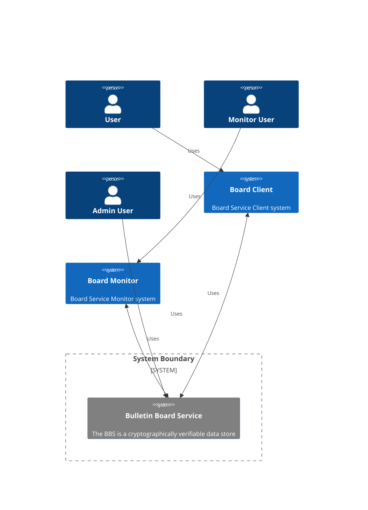
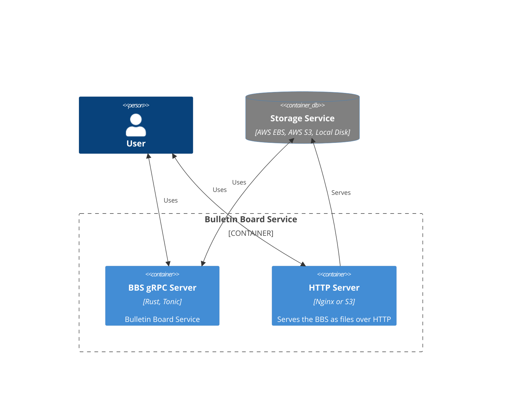

## Purpose and scope

This document provides an architectural overview of Sequent Bulletin Board using
multiple architectural views to depict different aspects of the system.

## About

Sequent Bulletin Board is a cryptographically verifiable, tamper-evident data
store. It is implemented using Rust and pieces of Google's [Trillian].

It's used as the verifiable log of the 2nd generation Sequent Voting Platform,
but also a generic datastore adaptable to other use-cases.

## Diagrams

What follows are the [C4 model] diagrams that provide a visualization of the
Bulletin Board software architecture, along with some explanations of the
elements and relations of the elements depicted.

### Level 1: System context diagram

The bulletin board can be used for storing and retrieving securely information
in a tamper-evident log.

#### Actors

There are different actors involved:
- A **User** can both read and write in a Board.
- A **Monitor User** reads a Board and check that tampering has not
  happened and the log is internally consistent.
- An **Admin User** performs the management of the Bulletin Board Service. 

#### Systems

There are different systems involved in the ecosystem related to Sequent
Bulletin Board with the central one being the **Bulletin Board
Service** (BBS). The other systems connect to it:

- The **Board Client** is the piece of software that connects an **User** with
  the **Bulletin Board Service** to create, read and write Bulletin Boards.
  Since this is your own application, you will be implementing your own custom
  Board Client. We provide some libraries, examples and tutorials to facilitate
  it. Read [Tutorial 1: Creating a Rust Client] to learn more.
- The **Board Monitor** is any application that reads a Board and check that
  tampering has not happened and the log is internally consistent. We don't
  currently yet have implemented a Board Monitor, but we will be implementing a
  reference implementation in the future.
- The **Bulletin Board Service** (BBS) is the backend service that provides an
  API to manage,create,read and write bulletin boards and stores them.

### Level 2: container diagram

Let's zoom in the central piece, the **Bulletin Board Service**. It has 
different container

[Trillian]: https://github.com/google/trillian
[C4 model]: https://c4model.com/
[Tutorial 1: Creating a Rust Client]: ../../tutorials/rust-client