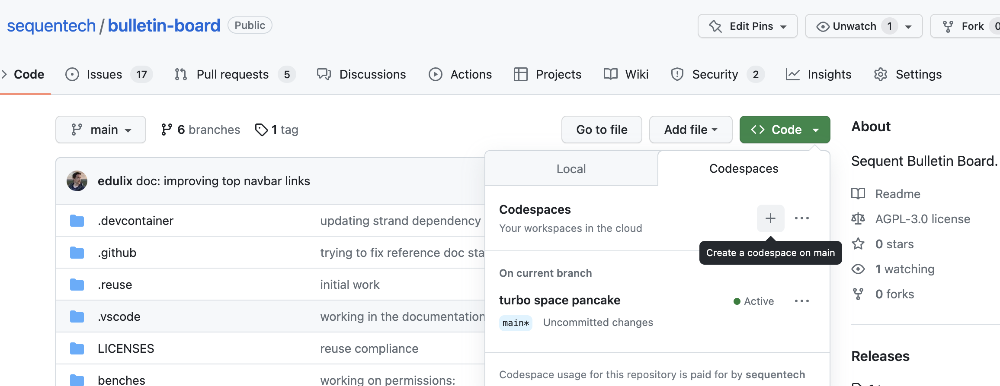
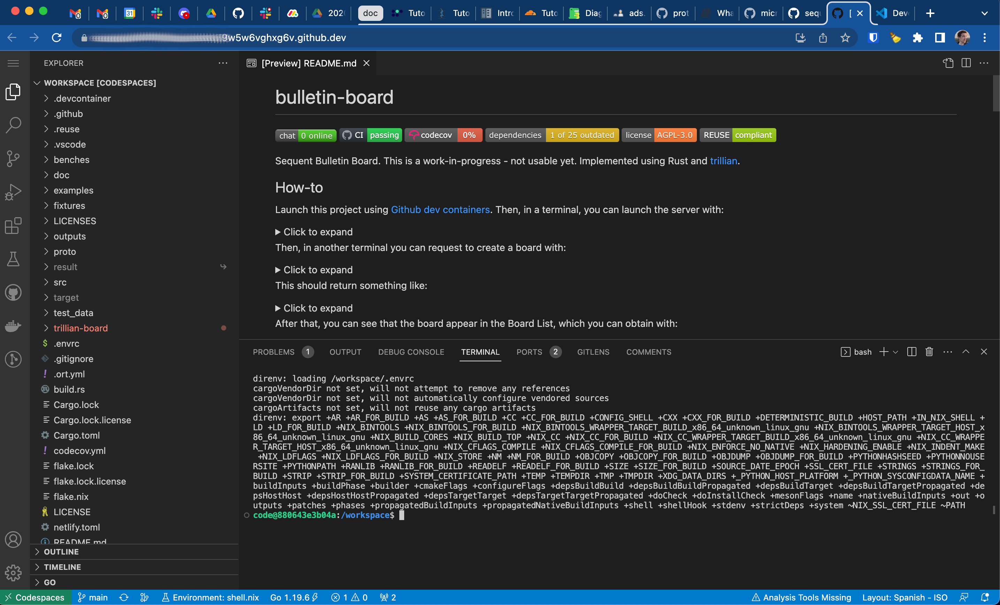

Welcome to Sequent Bulletin Board. In this tutorial we’re going to get things
running so you can create your first bulletin board and add entries manully, 
without writting a line of code and just using tools readily available.

## Introduction

Sequent Bulletin Board is a cryptographically verifiable data store. It is
implemented using Rust and pieces of Google's [trillian]. It's used as the
verifiable log of the 2nd generation Sequent Voting Platform, but also a generic
datastore adaptable to other use-cases.

The Bulletin Board is a backend service that provides a protobuf interface to
list, create and manage bulletin boards. Entries can be added and retrieved to a
bulletin board, thus providing a datastore.

## Step 1: Relax, we’ll help

As you begin the tutorial, pop open [Sequent chat room] in another tab. We
are a nice group of people active in the project and we’ll help you out if you
get stuck.

## Step 2: Launch development environment

If you’re already familiar with using the Bulletin Board and have it installed
on your system you can use your existing installation.

For this tutorial we'll be installing and deploying the Bulletin Board Service
using [Github Codespaces]. This will allow you to follow the tutorial with the
only requirement of having a personal github account and a modern web browser. 

To launch the Bulletin Board service:
1. Make sure you are logged in with your github user.
2. Enter into the [`bulletin-board` github project].
3. Click in the green `Code` button in the top right.
4. Click in the `+` button to create a Codespace on `main` as seen below:



5. This will open a new browser tab with Visual Studio Code running on it and
connected to a deployment launched in Github Codespaces using [Dev Containers]. 



Alternatively, you could follow similar steps by clonning the repository, 
opening it within VS Code and [opening it locally in a container].

## Step 3: Setup the Bulletin Board Service

Whether using VS Code Dev Containers or Github Codespaces, you now have a full
development environment using VS Code. Next, we are going to use a VS Code 
terminal to configure and launch the bulletin board service. 

The first thing we will do is create a temporal storage dir we will use through
out the whole tutorial:

```bash
export STORAGE_DIR=$(mktemp -d)
echo "export STORAGE_DIR=$STORAGE_DIR"
```

This will print something like `export STORAGE_DIR=/tmp/tmp.8J4EbZEejY`. We'll
use that later in other terminal to access common files.

We'll now ensure we execute the commands in debug mode to better understand
what's happening behind curtains:

```bash
`# execute the commands in debug mode
export TRACING_LEVEL=debug
````

We need to generate the bulletin service configuration file. As a user of the
bulletin board, our write-operations will be authenticated and authorised using
the public key signatures. We will generate our public and private keys and
grant it explicit permissions to create and manage bulletin boards in the
bulletin service configuration file.

```bash
# create the client key pair and get the public key into an env var
cargo run --bin create-key > ${STORAGE_DIR}/client-keys.toml
export PUBLIC_KEY=$(tomlq .public_key ${STORAGE_DIR}/client-keys.toml)
```

```toml
# create the service config
cat << EOF > ${STORAGE_DIR}/service-config.toml
storage_path = "${STORAGE_DIR}"
server_url = "127.0.0.1:3000"
[[permissions.users]]
name = "admin"
public_key = ${PUBLIC_KEY}
metadata = {}
[[permissions.roles]]
name = "admins"
permissions = [ "CreateBoard" ]
metadata = {}
[[permissions.user_roles]]
user_name = "admin"
role_names = [ "admins" ]
EOF
```

We have created our pair of public and private keys with the `create-key` tool,
and saved these keys at `${STORAGE_DIR}/client-keys.toml`. 

Also, we have created the bulletin board service config file at
`${STORAGE_DIR}/service-config.toml`. The config file is written in TOML format
and has our public key associated to the `admin` user. We have also declared the
existence of an `admins` role with permission to create boards and we have
assigned this role to the `admin` user.

## Step 4: Launch the bulletin board server

We have everything ready to launch the bulletin board server with the following
command:

```bash
# run the service
CONFIG_PATH=${STORAGE_DIR}/service-config.toml \
cargo run \
   --features="build-server" \
   --bin bulletin-board-server
```

The output will resemble the following:

```bash
warning: Applying cargo:rerun-if-changed=proto/bulletin_board.proto
warning: Applying cargo:rerun-if-changed=trillian-board/storage/fs/fs.go
warning: Applying cargo:rerun-if-changed=trillian-board/main.go
warning: Applying cargo:rerun-if-changed=trillian-board/go.sum
warning: Running command: command=go build -buildmode=c-archive -o /nix/store/24pj4ji8jbw5xxz4yn57gsgxwlbyr28i-nix-shell/libtrillian_board.a main.go
warning: Running command: exit_status=ExitStatus(unix_wait_status(0))
warning: Running command: stdout=
warning: Running command: stderr=
warning: Applying cargo:rustc-link-search=native=/nix/store/24pj4ji8jbw5xxz4yn57gsgxwlbyr28i-nix-shell
warning: Applying cargo:rustc-link-lib=static=trillian_board
    Finished dev [unoptimized + debuginfo] target(s) in 36.71s
     Running `target/debug/bulletin-board-server`
 INFO tracing_level_str="debug"
┐read_config 
├──0ms DEBUG reading config_path, config_path_str="/tmp/tmp.8J4EbZEejY/service-config.toml"
├──┐new service_config=BulletinBoardServiceConfig { storage_path: "/tmp/tmp.8J4EbZEejY", server_url: "127.0.0.1:3000", permissions: Permissions { users: [User { name: "admin", public_key: "jYvwLkGelY7bzaO0Im6Ll7CnImUvDwJtNNrOS3dmsBU", metadata: {} }], roles: [Role { name: "admins", permissions: ["CreateBoard"], metadata: {} }], user_roles: [UserRole { user_name: "admin", role_names: ["admins"] }] } }
├──┘
┘
 INFO Launching the bulletin board server, addr=127.0.0.1:3000
```

We can ignore the compiler warnings for the purposes of this tutorial. The
important part is the last line, indicating us that the bulletin board server is
up and running in port 3000.

## Step 5: Create our first bulletin board

With the Bulletin Board Service (BBS) launched in one terminal, we need to open
a new terminal to connect to it as a client to request the creation of a new
bulletin board.

To open a new terminal in VS Code, you can either:
- Press ```<Control> + <Shift> + <`> ```
- Press ```<Command> + <Shift> + <P> ``` and then write `Terminal: Create New Terminal`
- Click in the `+` button in the terminal panel.

In this new terminal, we need to first set the `STORAGE_DIR` to whatever
path we used before in [step 3]. Review it now. In our case, it was
`/tmp/tmp.8J4EbZEejY`:

```bash
# Change the storage dir to whatever was printed in the other terminal before
export STORAGE_DIR=/tmp/tmp.8J4EbZEejY
```

Then we need to craft request to create a new bulletin board. We will: 

1. Generate the request unsigned in json with:

```bash
# Change the storage dir to whatever was printed in the other terminal before
export STORAGE_DIR=/tmp/tmp.puAxZ7RC6x

# retrieve the public key, to be used in the request
export PUBLIC_KEY=$(tomlq .public_key ${STORAGE_DIR}/client-keys.toml)

# generate the unsigned request
cat << EOF > request.json
{
    "board_uuid": "e04bd3c6-1beb-4ef6-9d65-c411ba7c6d08",
    "board_name": "2023-presidential-election",
    "board_description": "",
    "board_metadata": {},
    "signer_public_key": "",
    "signature": "",
    "permissions": {
        "users": [
            {
                "name": "admin",
                "public_key": ${PUBLIC_KEY},
                "metadata": {}
            }
        ],
        "roles": [
            {
                "name": "admins",
                "permissions": [ "AddEntries" ],
                "metadata": {}
            }
        ],
        "user_roles": [
            {
                "user_name": "admin",
                "role_names": [ "admins" ]
            }
        ]
    }
}
EOF
```

:::tip

During board creation, we assign a bunch of properties to the bulletin board.
Not only we request a specific board uuid and board name, but also we are
assigning a set of permissions that follow the same kind of structure as we saw
in the BBS configuration. We need this because actions executed on the bulletin
board are permissioned and the requests to execute actions need to be signed
with an authorized key for each action.

:::

2. Sign the request with our private key and send the signed request to the BBS
   gRPC API using the `grpcurl` tool, with two connected shell commands
   using shell pipes:

```bash
# sign the request and pipe it into the grpcurl API call
cargo run --bin sign -- \
    -p "${STORAGE_DIR}/client-keys.toml" \
    -k 'create-board-request' \
    -d "$(cat request.json)" | \
grpcurl \
    -emit-defaults \
    -plaintext \
    -import-path ./proto \
    -proto bulletin_board.proto \
    -d '@' \
    '127.0.0.1:3000' \
    bulletin_board.BulletinBoard/CreateBoard
```

This should return something like:

```json
{
  "bulletinBoard": {
    "uuid": "e04bd3c6-1beb-4ef6-9d65-c411ba7c6d08",
    "name": "2023-presidential-election",
    "description": "",
    "isArchived": false,
    "publicKey": "2023-presidential-election+6f8c9f81+Abwac2R0XtmiAzmDA7/BO5kVzTCA/fhhyK6Uu/j3CPr6",
    "metadata": {
      
    },
    "permissions": {
      "users": [
        {
          "name": "admin",
          "publicKey": "gS2o6mE/9PmDYXHqcqKfyfHSVsoKuEip+olBk3YiQCM",
          "metadata": {
            
          }
        }
      ],
      "roles": [
        {
          "name": "admins",
          "permissions": [
            "AddEntries"
          ],
          "metadata": {
            
          }
        }
      ],
      "userRoles": [
        {
          "userName": "admin",
          "roleNames": [
            "admins"
          ]
        }
      ]
    }
  },
  "checkpoint": {
    "origin": "2023-presidential-election",
    "size": "1",
    "hash": "AJP2tEJGBw5830s/0YL863UYlgfmjf52CBwJr8uH+aw="
  }
}
```


:::tip

The returned bulletin board returns a checkpoint. A bulletin board is composed
of entries added to a trillian log. The number of entries is reflected in the
`size`, and the `hash` of the log is the **Signed Tree Head** of trillian log.
Read more about this in [Verifiable Data Structures].

In the BBS there are two types of board entries: `BoardPublicConfig` and
`EntryData`. Even though we didn't add explicitly any entries to the log, the
Board Configuration is always the first entry added to the log, and is of type
`BoardPublicConfig`. This is the reason the log has size `1`. We will see and
retrieve this entry later at step 7.

:::

## Step 6: List bulletin boards

We have created our bulletin board. We can actually check that this is true by
using `grpcurl` to list the bulletin boards available in the BBS:

```bash
grpcurl \
    -emit-defaults \
    -plaintext \
    -import-path ./proto \
    -proto bulletin_board.proto \
    -d '{}' \
    '127.0.0.1:3000' \
    bulletin_board.BulletinBoard/ListBoards
```

Resulting something like:

```json
{
  "boards": [
    {
      "boardLastSequenceId": "0",
      "board": {
        "uuid": "e04bd3c6-1beb-4ef6-9d65-c411ba7c6d08",
        "name": "2023-presidential-election",
        "description": "",
        "isArchived": false,
        "publicKey": "2023-presidential-election+6f8c9f81+Abwac2R0XtmiAzmDA7/BO5kVzTCA/fhhyK6Uu/j3CPr6",
        "metadata": {
          
        },
        "permissions": {
          "users": [
            {
              "name": "admin",
              "publicKey": "gS2o6mE/9PmDYXHqcqKfyfHSVsoKuEip+olBk3YiQCM",
              "metadata": {
                
              }
            }
          ],
          "roles": [
            {
              "name": "admins",
              "permissions": [
                "AddEntries"
              ],
              "metadata": {
                
              }
            }
          ],
          "userRoles": [
            {
              "userName": "admin",
              "roleNames": [
                "admins"
              ]
            }
          ]
        }
      }
    }
  ]
}
```

As you can see, read-only requests like these do not need to be authorized by
signing them. Of course, authorization and authentication of these requests 
could be added using some authentication/authorization layer on top of the
BBS gRPC API.

It's also important to highlight how the `grpcurl` tool works: using the gRPC
API Protobuf contract at `proto/bulletin_board.proto` and allowing us to emit
default values to unused query parameters of the called API function,
`bulletin_board.BulletinBoard/ListBoards` with `-emit-defaults`.

## Step 7: Listing our board entries

Even though we didn't explicitly add any entry to the log, it already contains
the first `PublicBoardConfig` entry as its first entry. We can request its
retrieval with:

```bash
grpcurl \
    -emit-defaults \
    -plaintext \
    -import-path ./proto \
    -proto bulletin_board.proto \
    -d '{"board_uuid": "e04bd3c6-1beb-4ef6-9d65-c411ba7c6d08", "start_sequence_id": 0}' \
    '127.0.0.1:3000' \
    bulletin_board.BulletinBoard/ListEntries
```

:::tip

Note that:
1. The request includes the board uuid. If you only know the board name, you
   can find out the board uuid using the `ListBoards` API call.
2. The request includes the `start_sequence_id`. For example if you are only
   interested in entries starting with id `1`, you can use that parameter to
   filter them out.

:::

Resulting in something like:

```json
{
  "boardLastSequenceId": "0",
  "boardEntries": [
    {
      "sequenceId": "0",
      "board": {
        "uuid": "e04bd3c6-1beb-4ef6-9d65-c411ba7c6d08",
        "name": "2023-presidential-election2",
        "description": "",
        "isArchived": false,
        "publicKey": "2023-presidential-election2+dd65551b+AYxh4fg7bo3DQivAcmKh5ypJ/Si0A1b2AozqWWacINDn",
        "metadata": {
          
        },
        "permissions": {
          "users": [
            {
              "name": "admin",
              "publicKey": "4wGsjyIMJHUsGjqnoIKEGD6m40bY1zhc7Jh3ob277+s",
              "metadata": {
                
              }
            }
          ],
          "roles": [
            {
              "name": "admins",
              "permissions": [
                "AddEntries"
              ],
              "metadata": {
                
              }
            }
          ],
          "userRoles": [
            {
              "userName": "admin",
              "roleNames": [
                "admins"
              ]
            }
          ]
        }
      },
      "metadata": {
        
      },
      "signerPublicKey": "4wGsjyIMJHUsGjqnoIKEGD6m40bY1zhc7Jh3ob277+s",
      "signature": "ts2K23wBzn6lprIuwtdcJ3C4qK4fFbxKa3+1CNRRCxF74aZiOjTldOjgmIUrE4ce/6mwT0cfLQL+Py/GWsKKDw",
      "timestamp": "1677586474371"
    }
  ]
}
```

## Step 7: Adding an entry

Let's add an entry to our board. Entries contain some binary data of arbitrary 
size. For that reason, we will be encoding the `Hello Board!` string with the
`base64` command to encode it into bytes.

First, we will create the unsigned request in the `request.json` file:

```bash
# Generate the unsigned request
cat << EOF > request.json
{
    "board_uuid": "e04bd3c6-1beb-4ef6-9d65-c411ba7c6d08",
    "entries": [
        {
            "data": "$(echo -n 'Hello Board!' | base64)",
            "metadata": {},
            "signer_public_key": "",
            "signature": ""
        }
    ]
}
EOF
```

Then, in a similar manner as we did when creating the board, we will use shell
pipes to sign the request with our private key and send it to the BBS with the
`grpcurl` command: 

```bash
# sign the request and pipe it into the grpcurl API call
cargo run --bin sign -- \
    -p "${STORAGE_DIR}/client-keys.toml" \
    -k 'add-entries-request' \
    -d "$(cat request.json)" | \
grpcurl \
    -emit-defaults \
    -plaintext \
    -import-path ./proto \
    -proto bulletin_board.proto \
    -d '@' \
    '127.0.0.1:3000' \
    bulletin_board.BulletinBoard/AddEntries
```

Resulting in something like:

```json
{
  "entries": [
    {
      "sequenceId": "1",
      "entryData": {
        
      },
      "metadata": {
        
      },
      "signerPublicKey": "4wGsjyIMJHUsGjqnoIKEGD6m40bY1zhc7Jh3ob277+s",
      "signature": "pHUrPXrvPGOmqv8Apc3exoNqnFbgByi5iNyfOlSTOby50mcsUBdrHtIb1PQUtyGv52dZt4s3p+0PPiA7AloZAg",
      "timestamp": "1677586643964"
    }
  ],
  "checkpoint": {
    "origin": "2023-presidential-election2",
    "size": "2",
    "hash": "jyVZBF0Zbkx6gdgvzJKGAlUAGfbLw8A1/TRQSv5+nDI="
  }
}
```

## Step 8: Getting our entry back

Note that after adding the entry in [step 7], the `entryData` is empty in the
response. This is on purpose: it's an optional field and it would be redundant
and inefficient to include it both in the answer and in the response when it can
be a potentially large blob of data.

However, we can always get it back with the `ListEntries` API call that we saw
before. Let's do that:


```bash
grpcurl \
    -emit-defaults \
    -plaintext \
    -import-path ./proto \
    -proto bulletin_board.proto \
    -d '{"board_uuid": "e04bd3c6-1beb-4ef6-9d65-c411ba7c6d08", "start_sequence_id": 0}' \
    '127.0.0.1:3000' \
    bulletin_board.BulletinBoard/ListEntries
```

And certainly, now we get a different response from the BBS that includes the
new entry:

```json
{
  "boardLastSequenceId": "1",
  "boardEntries": [
    {
      "sequenceId": "0",
      "board": {
        "uuid": "e04bd3c6-1beb-4ef6-9d65-c411ba7c6d08",
        "name": "2023-presidential-election2",
        "description": "",
        "isArchived": false,
        "publicKey": "2023-presidential-election2+dd65551b+AYxh4fg7bo3DQivAcmKh5ypJ/Si0A1b2AozqWWacINDn",
        "metadata": {
          
        },
        "permissions": {
          "users": [
            {
              "name": "admin",
              "publicKey": "4wGsjyIMJHUsGjqnoIKEGD6m40bY1zhc7Jh3ob277+s",
              "metadata": {
                
              }
            }
          ],
          "roles": [
            {
              "name": "admins",
              "permissions": [
                "AddEntries"
              ],
              "metadata": {
                
              }
            }
          ],
          "userRoles": [
            {
              "userName": "admin",
              "roleNames": [
                "admins"
              ]
            }
          ]
        }
      },
      "metadata": {
        
      },
      "signerPublicKey": "4wGsjyIMJHUsGjqnoIKEGD6m40bY1zhc7Jh3ob277+s",
      "signature": "ts2K23wBzn6lprIuwtdcJ3C4qK4fFbxKa3+1CNRRCxF74aZiOjTldOjgmIUrE4ce/6mwT0cfLQL+Py/GWsKKDw",
      "timestamp": "1677586474371"
    },
    {
      "sequenceId": "1",
      "entryData": {
        "data": "SGVsbG8gQm9hcmQh"
      },
      "metadata": {
        
      },
      "signerPublicKey": "4wGsjyIMJHUsGjqnoIKEGD6m40bY1zhc7Jh3ob277+s",
      "signature": "pHUrPXrvPGOmqv8Apc3exoNqnFbgByi5iNyfOlSTOby50mcsUBdrHtIb1PQUtyGv52dZt4s3p+0PPiA7AloZAg",
      "timestamp": "1677586643964"
    }
  ]
}
```

Of course, the entry data is encoded in base64, but we can decode it to text
output to obtain the text string it encodes. Running 
`echo -n "SGVsbG8gQm9hcmQh" | base64 -d` will output `Hello Board!` as expected.
Our entry has been correctly included.

We have been able to use the command line to do the most basic operations on the
bulletin baord.

For the next challenge, go to [Tutorial 1: Create a Rust client].

[trillian]: https://github.com/google/trillian
[Sequent chat room]: https://discord.gg/WfvSTmcdY8
[Github Codespaces]: https://github.com/features/codespaces
[`bulletin-board` github project]: https://github.com/sequentech/bulletin-board
[Dev Containers]: https://code.visualstudio.com/docs/devcontainers/containers
[opening it locally in a container]: https://code.visualstudio.com/docs/devcontainers/containers#_quick-start-open-an-existing-folder-in-a-container
[Verifiable Data Structures]: https://transparency.dev/verifiable-data-structures/
[Tutorial 1: Create a Rust client]: ../rust-client
[step 3]: #step-3-setup-the-bulletin-board-service
[step 7]: #step-7-listing-our-board-entries