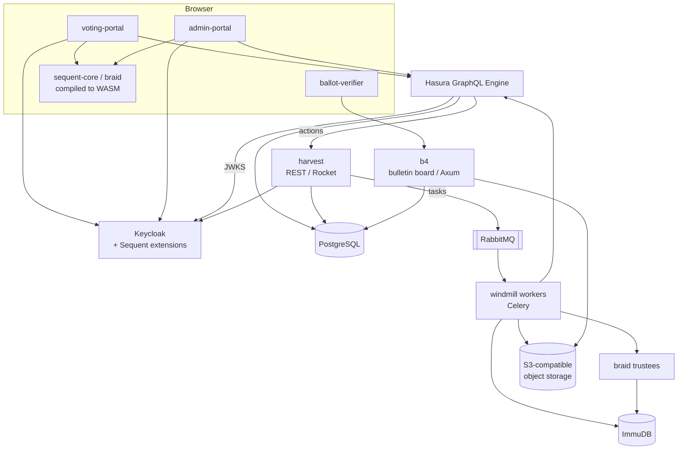

<!--
SPDX-FileCopyrightText: 2026 Sequent Tech Inc <legal@sequentech.io>

SPDX-License-Identifier: AGPL-3.0-only
-->

# Architecture of this repository

This document records the **structural decisions** the Sequent Voting Platform is
built on, as they exist in this repository: which components there are, which
technology each one is, and how they talk to each other.

It exists for one reason. A pull request that changes one of these decisions —
swapping the identity provider, replacing the queue, adding a datastore, moving
a responsibility from one service to another — is not an ordinary change, and it
must not merge as if it were. [`.github/policies/60-architectural-changes.md`](../.github/policies/60-architectural-changes.md)
is the rule; this file is the baseline it compares against.

**If a change makes something here untrue, the change must update this file.**
A stale architecture document is worse than none, because it is trusted.

## What this document covers

The components built in this repository, and the interfaces between them.

It does **not** cover how the platform is deployed — cluster topology, cloud
accounts, environments, per-customer configuration. Those live outside this
repository and are documented where they are configured. This file stops at the
container boundary: it says a component exists, what it is written in, and what
it depends on, not where it runs.

---

## 1. Shape of the system

The platform is a set of containerised services around a GraphQL API, with
cryptographic work split between a Rust backend and the same Rust code compiled
to WebAssembly and run in the voter's browser.

### The load-bearing decisions

Each row is a decision. Changing the **Current choice** column is an
architectural change.

| # | Decision | Current choice | Where it is expressed |
|---|---|---|---|
| A1 | Identity and access management | **Keycloak**, extended with in-house Java providers | `packages/keycloak-extensions/`, `packages/Dockerfile.keycloak` |
| A2 | Tenancy model in the IdP | **One Keycloak realm per tenant, and one per election event** | [`docs/permissions.md`](permissions.md) |
| A3 | API layer | **Hasura GraphQL Engine** over PostgreSQL, with actions calling `harvest` | `hasura/`, `packages/harvest/` |
| A4 | API authorisation | **Keycloak-issued JWT**, validated by Hasura against the realm's JWKS; permissions carried as `x-hasura-*` claims | [`docs/hasura-auth.md`](hasura-auth.md), [`docs/permissions.md`](permissions.md) |
| A5 | Primary datastore | **PostgreSQL** | `hasura/migrations/`, `packages/b4/src/db.rs` |
| A6 | Tamper-evident log | **ImmuDB**, three distinct uses (cryptographic board, electoral log, audit log) | [`docs/immutable-logs.md`](immutable-logs.md), `packages/immu-board/`, `packages/immudb-rs/` |
| A7 | Asynchronous work | **Celery protocol over RabbitMQ**, workers in Rust | `packages/windmill/`, [`docs/task_execution_model.md`](task_execution_model.md) |
| A8 | Object storage | **S3 API** (MinIO in development) | `packages/sequent-core` `s3` feature, `packages/b4/src/s3.rs` |
| A9 | Ballot secrecy | **Verifiable re-encryption mixnet** with independent trustees | `packages/braid/` |
| A10 | Cryptographic primitives | **Curve25519/Ristretto, Ed25519, SHA-2/SHA-3** | `packages/strand/` |
| A11 | Client-side crypto | Rust compiled to **WebAssembly** via `wasm-pack`, shared with the backend | `packages/sequent-core/`, `packages/braid/` |
| A12 | Frontend stack | **React 19 + MUI 7 + Apollo Client** | `packages/voting-portal/`, `packages/admin-portal/` |
| A13 | Backend language | **Rust** (stable 1.96.0), one Cargo workspace | `packages/Cargo.toml`, `rust-toolchain.toml` |
| A14 | IdP extension language | **Java 17** (Maven), packaged into the Keycloak image | `packages/keycloak-extensions/pom.xml` |
| A15 | Licence | **AGPL-3.0-only**, enforced by REUSE on every file | `LICENSE`, `REUSE.toml`, `.github/workflows/license_reuse.yml` |
| A16 | Dependency supply chain | Cargo dependencies **vendored** into `packages/vendor/` | `packages/Cargo.toml` `[source.vendored-sources]` |

---

## 2. Components

### Rust services and libraries

`packages/` is simultaneously a Cargo workspace and a Yarn workspace; that is
what lets the same crates serve the backend and the browser.

| Crate | Kind | Role |
|---|---|---|
| `strand` | library | Cryptographic primitives. Everything else depends on it. |
| `braid` | service + library | Verifiable re-encryption mixnet. Runs as trustee processes. |
| `sequent-core` | library | Shared domain core: ballot structures, crypto operations, report generation, Keycloak integration. Compiles to WASM. |
| `harvest` | service | Election-management REST API (Rocket). The synchronous side of Hasura actions. |
| `windmill` | service | Celery worker. The asynchronous side. Also hosts WASM plugins. |
| `b4` | service | Bulletin board (Axum), backed by PostgreSQL and S3. |
| `immu-board` | library | Cryptographic board protocol over ImmuDB. |
| `immudb-rs` | library | ImmuDB client. |
| `electoral-log` | library | Electoral log records. |
| `velvet` | CLI | PDF and report generation. |
| `orare` | service | Document rendering, deployed as a function. |
| `step-cli` | CLI | Election administration from the command line. |
| `e2e` | harness | End-to-end test framework. |
| `plugins/*` | WASM | Customer-neutral plugin crates loaded by `windmill`. |

### TypeScript packages

| Package | Role |
|---|---|
| `voting-portal` | Voter interface. Authenticates against Keycloak, encrypts the ballot in WASM. |
| `admin-portal` | Election administration. React Admin over the same GraphQL API. |
| `ballot-verifier` | Standalone verification of a cast ballot. |
| `ui-essentials` | Shared component library (MUI, Storybook). |
| `ui-core` | Lower-level shared utilities — sanitisation, i18n. |

### Java

`packages/keycloak-extensions/` holds the Keycloak SPI implementations that make
the IdP fit the voting model: authenticators (OTP by message, security question,
IdP linking, conditional flows), an SES e-mail sender, an event listener, a
voter-enrollment provider, an IVR configuration provider, and the Sequent theme.
They are built with Maven and baked into the Keycloak image.

**These extensions are the reason A1 is expensive to change.** The IdP is not
used off the shelf; the platform's authentication model is implemented inside it.

---

## 3. Interfaces that must not drift

These are the contracts between components. A change to one of them is
architectural even when the diff is small.

| Interface | Contract |
|---|---|
| Browser → API | GraphQL, schema generated from Hasura metadata. Types are code-generated (`yarn generate:*`); the checked-in `packages/graphql.schema.json` is the record. |
| Hasura → `harvest` | Hasura *actions* over HTTP. Adding or removing an action changes the API surface. |
| `harvest` → `windmill` | Celery task messages on RabbitMQ. The task name and payload shape are the contract. |
| Any service → Keycloak | Admin REST API and OIDC. Realm layout (A2) is part of this contract. |
| Any service → ImmuDB | The board protocol in `immu-board`. Records are append-only and verified; the schema is effectively permanent. |
| Backend ↔ browser crypto | `sequent-core` compiled to WASM. The Rust and the JavaScript must agree on serialisation, so a change to a shared type is a change to both. |

### Pinned by decision, not by accident

- `wasm-bindgen` **0.2.104** — pinned deliberately. Do not bump casually.
- `celery` — a **fork** (`Findeton/rusty-celery`), applied through
  `[patch.crates-io]`. Moving off the fork, or changing which fork, is an
  architectural change.
- Rust toolchain **1.96.0**, Node **20.x**, JDK **17**.

---

## 4. Build and release

- **Containers** are built from the `packages/Dockerfile*` family. Each service
  image is produced by CI, not by hand.
- **Releases** are cut from `release/X.Y` branches as `vX.Y.Z` /
  `vX.Y.Z-rc.N` tags, driven by `.github/workflows/release.yml`.
- **Checks** on every pull request: REUSE licensing, lint and format
  (frontend, Hasura, Rust, Java), unit tests, SonarQube, WASM build, and the
  documentation build. What each one actually reaches is written down in
  [`.github/policies/40-changes-must-be-checked.md`](../.github/policies/40-changes-must-be-checked.md).

Adding a component means adding it to those jobs in the same pull request. A
service no CI job builds is not part of the architecture; it is a liability.

---

## 5. Deliberate constraints

Recorded because they are choices, and a pull request that quietly reverses one
should be caught:

- **No customer-specific features.** Anything a customer needs is designed as a
  general capability that every deployment can select. A component or code path
  that only makes sense for one customer is an architectural violation, not a
  feature.
- **Policies are enums, not booleans**, in both Rust and TypeScript. On/off
  options do not survive contact with the second requirement.
- **Verifiability is not optional.** The mixnet, the bulletin board and the
  tamper-evident log exist so that the result can be checked without trusting
  the operator. A change that makes any step unverifiable is the most serious
  kind of architectural change this document covers.
- **The platform is open source.** This repository is AGPL-3.0-only and must
  stay independently buildable — see
  [`.github/policies/10-repository-scope.md`](../.github/policies/10-repository-scope.md).

---

## 6. Changing something in this document

1. Open a `meta` issue describing the decision and why.
2. Make the change and **update this file in the same pull request** — the
   table row, the diagram, and anything that contradicts the new state.
3. Expect `policy:architecture-change` on the pull request and a review request
   for `@sequentech/architects`. That is the process working, not an obstacle.

If you are unsure whether a change qualifies: if a new engineer reading this
document would then be wrong about the system, it qualifies.
