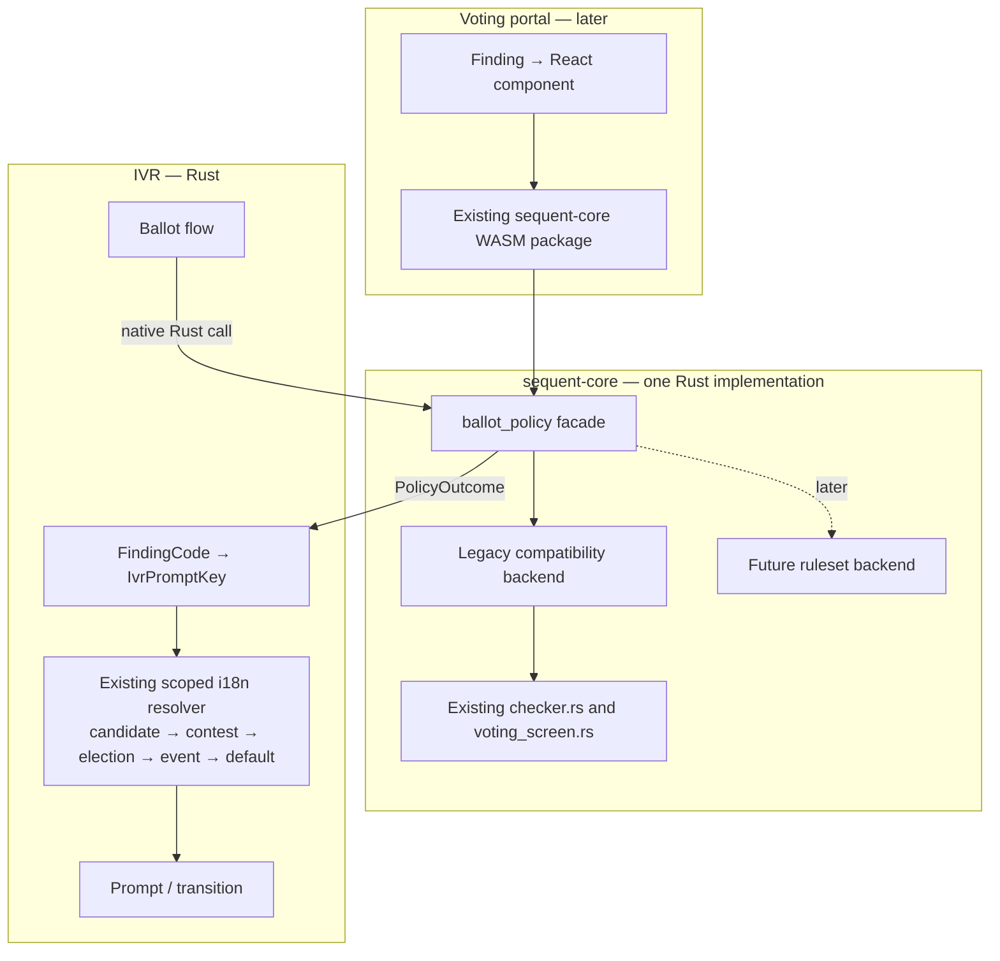
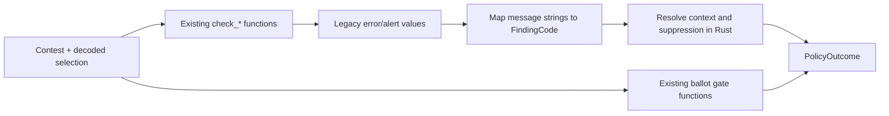
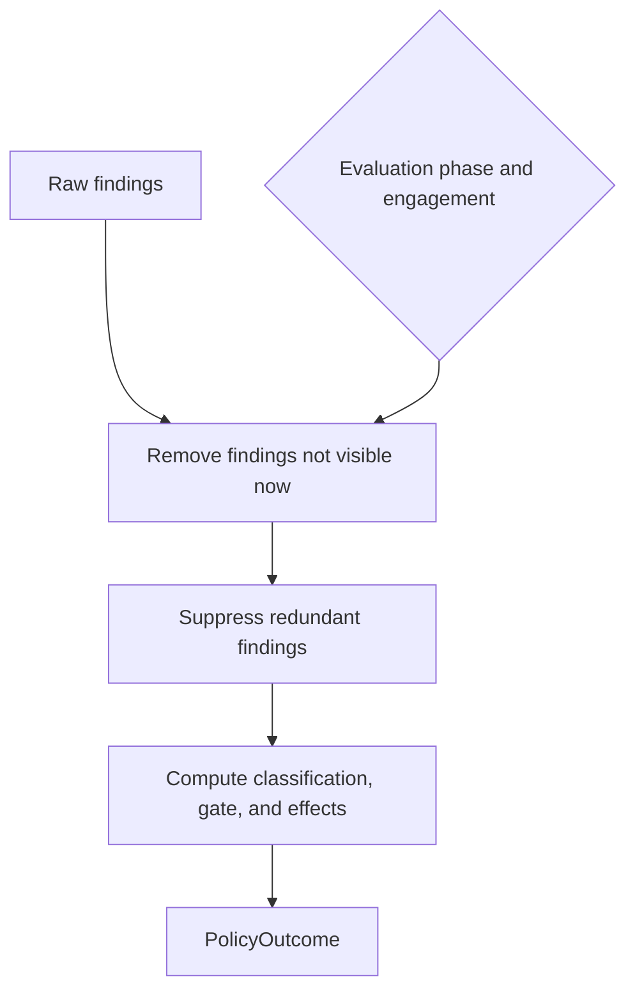
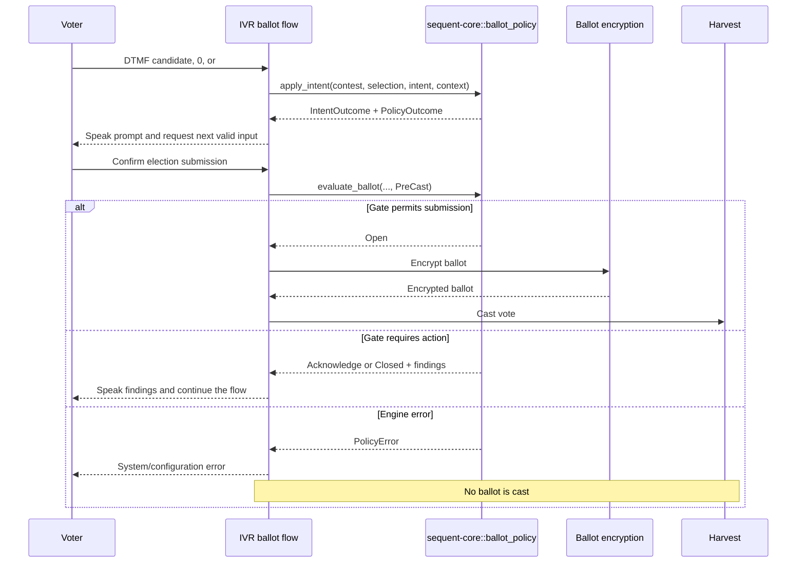
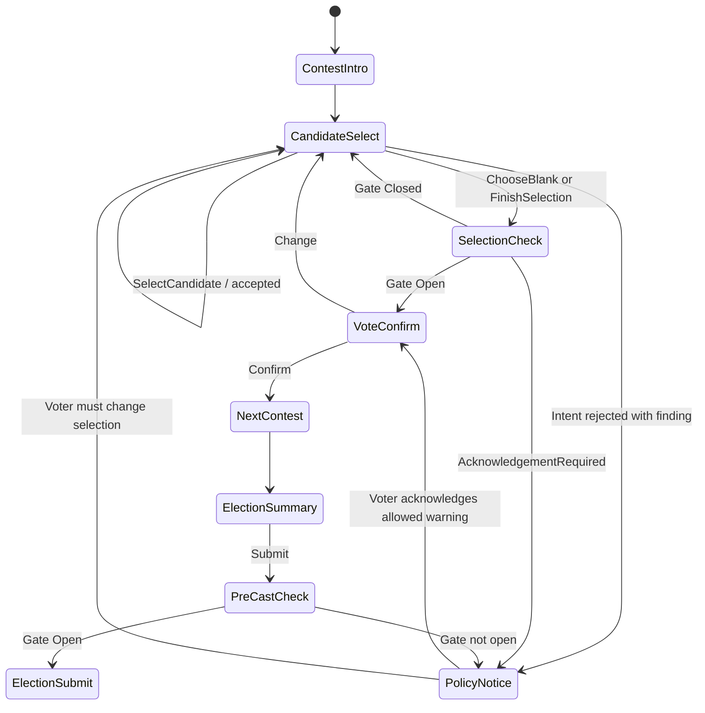
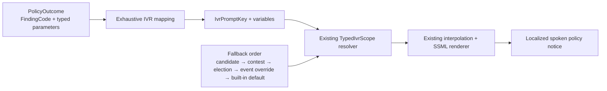
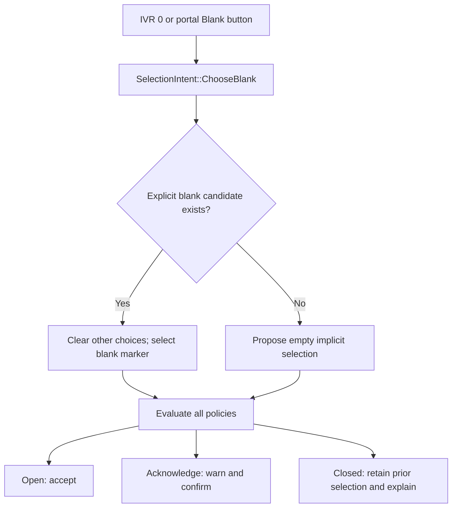
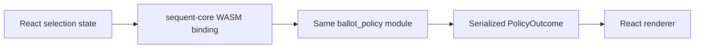
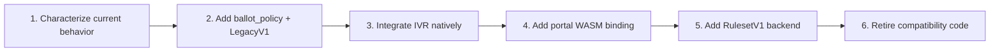

<!--
SPDX-FileCopyrightText: 2025 Sequent Tech Inc <legal@sequentech.io>
SPDX-License-Identifier: AGPL-3.0-only
-->

# Ballot Policy Engine Architecture

|                            |                                                          |
| -------------------------- | -------------------------------------------------------- |
| **Status**                 | Proposed bridge architecture                             |
| **Primary implementation** | `sequent-core` (Rust)                                    |
| **First consumer**         | IVR (native Rust)                                        |
| **Later consumer**         | Voting portal (the existing `sequent-core` WASM package) |

**Related design:** [Ballot Policy Architecture, meta#6557](https://github.com/sequentech/meta/issues/6557)

## 1. Read This First

The ballot policy engine answers one question:

> Given a ballot selection, the election configuration, and where the voter is in the flow, what findings exist and what may the voter do next?

There is one implementation in `sequent-core`:

- The IVR calls it directly as native Rust. **The IVR does not use WASM.**
- The voting portal will later call the same implementation through the existing `sequent-core` WASM build.
- The existing ballot codec and checker functions remain unchanged during the bridge phase.
- A compatibility backend initially converts their current results into the new policy result.
- A full ruleset backend can replace that compatibility backend later without changing IVR or portal integration code.
- IVR policy notices use the existing typed prompt resolver, including event-level translation overrides and built-in fallbacks.

The whole architecture can be remembered as three steps:

1. **Describe the situation** — selection, contest, and evaluation phase.
2. **Ask the engine** — evaluate or apply a semantic voter intent.
3. **Render the answer** — IVR speaks it; the portal displays it.


## 2. Goals and Non-Goals

### Goals

- Give the IVR correct ballot-policy behavior without duplicating portal logic.
- Keep policy decisions in Rust.
- Preserve current election behavior while the full ruleset engine is developed.
- Make IVR and portal behavior comparable using the same inputs and outputs.
- Leave the existing codec/checker path untouched during the first migration phase.
- Make the final ruleset engine replaceable behind a stable API.
- Keep prompts, translations, DTMF, and React outside the policy engine.

### Non-goals for the bridge phase

- No expression language.
- No plugin system.
- No ruleset persistence or admin editor.
- No refactor of `ballot_codec/checker.rs` or `multi_ballot.rs`.
- No removal of existing policy enums.
- No WASM runtime or WASM boundary in the IVR.
- No IVR-specific concepts in `sequent-core`.

This scope is deliberate. The bridge should solve the integration problem without requiring the final policy language first.

## 3. The Mental Model

The easiest way to understand the design is to separate four concepts that are currently mixed together.

| Concept                   | Example                                               | Owned by      |
| ------------------------- | ----------------------------------------------------- | ------------- |
| **Finding**               | “Fewer than the maximum choices were selected”        | Policy engine |
| **Ballot classification** | Countable, implicitly invalid, explicitly invalid     | Policy engine |
| **Interaction gate**      | Proceed, acknowledge, or reject                       | Policy engine |
| **Presentation**          | Spoken prompt, warning box, dialog, disabled checkbox | IVR or portal |

These concepts must remain separate.

For example, a ballot can be implicitly invalid but still be allowed to proceed when `InvalidVotePolicy::ALLOWED`. Therefore this is incorrect:

```text
has error finding → block the voter
```

The correct relationship is:

```text
findings + configured policies + evaluation context → classification and interaction gate
```

The channel only renders the result. It does not recalculate it.

## 4. System Context



### Important boundary

The word “WASM” applies only to how a browser can call Rust. It is not a separate policy implementation and it is not used by IVR.

## 5. What Lives Where

The new code is added inside `sequent-core`, beside the existing code:

```text
packages/sequent-core/src/
├── ballot_codec/
│   ├── checker.rs              existing; unchanged in bridge phase
│   └── multi_ballot.rs         existing; unchanged in bridge phase
├── util/
│   └── voting_screen.rs        existing; unchanged in bridge phase
├── ballot_policy/
│   ├── mod.rs                  stable public facade
│   ├── types.rs                context, findings, gates, effects, intents
│   ├── engine.rs               evaluation orchestration
│   ├── resolver.rs             visibility and suppression
│   ├── selection.rs            semantic selection transitions
│   ├── legacy.rs               adapter over current behavior
│   └── ruleset.rs              future; not required for the bridge
└── wasm/
    └── ballot_policy.rs        future browser bindings only
```

The public facade hides the selected backend:

```rust
pub enum PolicyDefinition<'a> {
    LegacyPresentation,
    RulesetV1(&'a CompiledRuleSetV1),
}

pub struct BallotPolicyEngine<'a> {
    definition: PolicyDefinition<'a>,
}
```

Existing elections have no ruleset, so they use `LegacyPresentation`. A future published ruleset selects `RulesetV1`. This is an enum because the alternatives are policies, not independent boolean flags.

## 6. Public API

The public API should be small. Consumers need to evaluate a state and apply a semantic intent.

```rust
impl BallotPolicyEngine<'_> {
    pub fn evaluate_contest(
        &self,
        contest: &Contest,
        vote: &DecodedVoteContest,
        context: EvaluationContext,
    ) -> Result<PolicyOutcome, PolicyError>;

    pub fn evaluate_ballot(
        &self,
        contests: &[Contest],
        votes: &[DecodedVoteContest],
        context: EvaluationContext,
    ) -> Result<PolicyOutcome, PolicyError>;

    pub fn apply_intent(
        &self,
        contest: &Contest,
        vote: &DecodedVoteContest,
        intent: SelectionIntent,
        context: EvaluationContext,
    ) -> Result<IntentOutcome, PolicyError>;
}
```

This API deliberately reuses `Contest` and `DecodedVoteContest`. No second copy of the ballot domain model is introduced.

The engine treats `invalid_errors` and `invalid_alerts` on an input `DecodedVoteContest` as derived data: it clears and recomputes them. Callers cannot inject trusted findings through those fields.

### 6.1 Evaluation context

Context uses enums rather than overlapping booleans:

```rust
pub struct EvaluationContext {
    pub phase: EvaluationPhase,
    pub engagement: Engagement,
}

pub enum EvaluationPhase {
    InteractiveSelection,
    ContestConfirmation,
    BallotReview,
    PreCast,
    PostDecryption,
    Audit,
}

pub enum Engagement {
    Untouched,
    Touched,
}
```

Examples:

- The portal editing an unanswered contest: `InteractiveSelection + Untouched`.
- IVR after the voter presses `0`: `ContestConfirmation + Touched`.
- IVR election summary: `BallotReview + Touched`.
- The authoritative check before encryption: `PreCast + Touched`.

### 6.2 Semantic intents

Channels send what the voter means, not which control they used:

```rust
pub enum SelectionIntent {
    SelectCandidate { candidate_id: String },
    UnselectCandidate { candidate_id: String },
    ChooseBlank,
    ChooseExplicitInvalid,
    FinishSelection,
    ConfirmSubmission,
}
```

Examples:

| User action                    | Channel event               | Engine intent     |
| ------------------------------ | --------------------------- | ----------------- |
| IVR presses `0`                | DTMF `0`                    | `ChooseBlank`     |
| Portal clicks “Blank”          | Button click                | `ChooseBlank`     |
| IVR presses a candidate number | DTMF mapped to candidate ID | `SelectCandidate` |
| Portal checks a candidate      | Candidate ID                | `SelectCandidate` |

This is how blank-selection behavior gets one implementation instead of one implementation per channel.

### 6.3 Policy outcome

```rust
pub struct PolicyOutcome {
    pub classification: BallotClassification,
    pub gate: InteractionGate,
    pub findings: Vec<PresentedFinding>,
    pub effects: Vec<InteractionEffect>,
}

pub enum BallotClassification {
    Countable,
    ImplicitlyInvalid,
    ExplicitlyInvalid,
    Declined,
    ConfigurationInvalid,
}

pub enum InteractionGate {
    Open,
    AcknowledgementRequired,
    Closed,
}

pub enum InteractionEffect {
    SelectionLimitReached,
    NoAdditionalSelections,
}
```

`findings` contains the findings already selected for the supplied context. The IVR and portal must not run a second visibility or suppression filter.

### 6.4 Findings

Findings contain semantic data, not text:

```rust
pub struct PresentedFinding {
    pub code: FindingCode,
    pub severity: FindingSeverity,
    pub parameters: FindingParameters,
}

pub enum FindingCode {
    InvalidConfiguration,
    MinimumSelectionsNotMet,
    MaximumSelectionsExceeded,
    SelectionLimitReached,
    BlankVote,
    UnderVote,
    ExplicitInvalidVote,
    DuplicateRank,
    PreferenceGap,
}
```

The `ballot_policy` module never contains English, French, Spanish, SSML, React components, or IVR translation keys. It only provides codes and typed interpolation values such as `selected`, `minimum`, and `maximum`.

## 7. The Compatibility Backend

The compatibility backend is the bridge between today’s implementation and the future ruleset engine.



The backend performs these steps:

1. Normalize the selection and discard previously derived errors and alerts.
2. Call the existing `check_*` functions in their current order.
3. Call the existing ballot-level “not allowed next” and “show dialog” functions.
4. Convert legacy message strings into `FindingCode` variants in one private module.
5. Apply touched/review visibility and suppression in Rust.
6. Return a channel-independent `PolicyOutcome`.

Only `legacy.rs` knows strings such as `errors.implicit.underVote`. New consumers never compare message strings.

### Why not copy the rules?

Copying current conditions into new Rust functions would create two Rust implementations before the old one is retired. Delegating to the existing functions gives the bridge a clear compatibility purpose and makes parity testable.

### Compatibility version

The compatibility behavior should be named, for example `LegacyV1`. Tests freeze its behavior, including existing edge cases. Intentional corrections belong in a new ruleset version rather than silently changing already published election behavior.

## 8. Policy Resolution

Raw findings are not yet a user interaction decision. The resolver applies context and relationships between findings.



Examples:

- Do not show an untouched contest’s warnings during interactive selection.
- Show `warn-only-in-review` findings during `BallotReview`, not during candidate entry.
- Suppress `UnderVote` when `BlankVote` already explains the same selection.
- Return `NoAdditionalSelections` instead of the browser-specific instruction “disable checkboxes.”
- Return `AcknowledgementRequired` instead of the browser-specific instruction “show modal.”

The resolver is shared by all backends. The future ruleset backend produces raw typed findings and uses the same resolver.

## 9. IVR Integration

### 9.1 Native call path

The IVR adds an ordinary Cargo dependency on `sequent-core` and calls `sequent_core::ballot_policy` directly. No WASM artifact is built or loaded for IVR.



### 9.2 Ballot-loop changes

The current IVR implementation stores one candidate per contest and has TODOs for blank, multi-selection, and min/max enforcement. Policy integration should happen together with the selection-state correction.

Use a typed IVR state:

```rust
pub enum IvrContestVote {
    Untouched,
    Choices(Vec<CandidateId>),
    ImplicitBlank,
    ExplicitBlank { candidate_id: CandidateId },
    Declined,
}
```

This distinguishes an untouched contest from an affirmative blank choice, which is necessary for review-only and touched behavior.

Candidate metadata must also retain marker meaning:

```rust
pub enum CandidateKind {
    Selectable,
    ExplicitBlank,
    ExplicitInvalid,
    Disabled,
}
```

Only `Selectable` candidates receive DTMF numbers. The explicit-blank candidate ID remains available so `ChooseBlank` can select it.

### 9.3 IVR state machine



### 9.4 Flow-to-context mapping

| IVR flow point                | Context                            | Expected use                                     |
| ----------------------------- | ---------------------------------- | ------------------------------------------------ |
| Contest first opens           | `InteractiveSelection + Untouched` | Do not announce premature warnings               |
| Candidate or blank input      | `InteractiveSelection + Touched`   | Update available actions and immediate findings  |
| Selection check               | `ContestConfirmation + Touched`    | Decide whether to confirm, acknowledge, or retry |
| Election summary              | `BallotReview + Touched`           | Announce review-only findings                    |
| Immediately before encryption | `PreCast + Touched`                | Authoritative final policy gate                  |

### 9.5 Voice rendering

The IVR integration owns an exhaustive mapping from `FindingCode` to the existing typed `IvrPromptKey` system:

```text
FindingCode::UnderVote + FindingParameters { selected, minimum, maximum }
    → IvrPromptKey::PolicyUnderVote + template variables
```

The mapping may select a prompt and transition, but it may not decide whether a finding is visible or whether submission is allowed. Those decisions already exist in `PolicyOutcome`. The mapping belongs to the IVR adapter, not to `ballot_policy`, even when both types live in `sequent-core`.



The resolver uses the call's existing `effective_language()` and the same `TypedIvrScope` chain used by every other IVR prompt. If a narrower scope is not supplied or does not define the key, resolution continues through contest, election, event, and finally the built-in default.

For example, the stable key for `IvrPromptKey::PolicyUnderVote` can be overridden at event level without changing policy code:

```json
{
  "presentation": {
    "i18n": {
      "en": {
        "ivr": {
          "policy_under_vote": "You selected {selected} choices. The minimum is {minimum}."
        }
      }
    }
  }
}
```

This translation data remains part of the frozen ballot publication. Adding a voter-facing `FindingCode` therefore requires all of the following:

1. An exhaustive IVR mapping to a well-known `IvrPromptKey`.
2. A typed variable contract for every placeholder.
3. A built-in default template for each supported language.
4. Resolution through the existing scope chain, so event-level configuration can override the default.
5. Contract tests for fallback order, interpolation, and SSML rendering.

The voting portal can map the same `FindingCode` to its own i18n key later. It does not consume IVR prompt keys or IVR translations.

Voice equivalents are:

| Policy outcome            | IVR behavior                                   |
| ------------------------- | ---------------------------------------------- |
| Finding with open gate    | Speak notice and continue                      |
| `AcknowledgementRequired` | Speak notice and require explicit confirmation |
| `Closed`                  | Speak reason and return to selection           |
| `NoAdditionalSelections`  | Stop offering candidate-selection actions      |
| `BallotReview` finding    | Include it in the election summary             |

## 10. Blank Selection Example

Blank selection is the best example of why semantic intents matter.



The IVR does not implement this decision tree itself. It converts `0` to `ChooseBlank` and follows `IntentOutcome`.

The same applies to the portal’s blank control later.

## 11. Pre-Cast Safety Boundary

Interactive evaluation improves the voter experience. Pre-cast evaluation is the authoritative safety boundary.

The required ordering is:

```text
build decoded selections
    → evaluate_ballot(PreCast)
    → satisfy gate
    → encrypt
    → cast
```

Never:

```text
encrypt
    → discover a blocking policy result
```

Rules for this boundary:

- A policy-engine or configuration error fails closed.
- A `Closed` gate prevents encryption.
- `AcknowledgementRequired` prevents encryption until the acknowledgement is recorded.
- A non-countable ballot may still proceed when the configured policy explicitly permits it.
- The ballot publication/policy version evaluated must be the same version used for encryption.

The last rule prevents a session from selecting under one configuration and encrypting under another. The IVR should pin the ballot-style publication identifier or hash for the election attempt.

## 12. Channel Capabilities

The policy engine describes what policy allows. A channel also has technical capabilities.

For the initial IVR:

- Explicit-invalid selection is not offered.
- Explicit-blank selection is supported through `ChooseBlank`.
- Multi-selection must be implemented before contests with `max_votes > 1` are accepted.
- Unsupported counting algorithms, write-ins, or candidate counts must be rejected during election preflight, not halfway through a call.

Capability validation should return typed reasons and run when the IVR loads the ballot style.

An IVR capability restriction is not silently folded into a ballot rule. For example, if the product requires phone ballots to be countable even when the election permits implicit invalid ballots, that must be a named constraint such as `IvrBallotConstraint::CountableOnly` and documented as a channel difference.

The default recommendation is policy parity with the portal: do not offer explicit invalid in IVR, but let implicit invalidity follow `InvalidVotePolicy`.

## 13. Future Voting Portal Integration

The portal migration adds bindings, not another policy engine.



The TypeScript side may:

- Convert UI state into the binding request.
- Translate `FindingCode` values.
- Render warnings and dialogs.
- Apply semantic effects such as `NoAdditionalSelections`.

It may not:

- Filter findings based on touched/review state.
- Suppress duplicate findings.
- Decide whether a ballot is valid.
- Decide whether progression is allowed.
- Reinterpret a policy enum.

Native Rust and WASM contract tests must return identical serialized outcomes for identical inputs.

## 14. Migration Plan



### Phase 1 — Characterization

Create shared fixtures for:

- Every legacy policy enum variant.
- Selection counts at `0`, `min - 1`, `min`, `max`, and `max + 1`.
- Untouched, touched, contest-confirmation, and review contexts.
- Explicit blank and explicit invalid markers.
- Decline-to-vote.
- Duplicate ranks and preference gaps.
- Single- and multi-contest encodings.

The expected results capture existing Rust findings, ballot gates, and TypeScript visibility behavior.

### Phase 2 — Compatibility engine

- Add `sequent_core::ballot_policy`.
- Implement typed outcomes and `LegacyV1`.
- Keep existing checker, codec, and voting-screen functions unchanged.
- Prove parity with the characterization fixtures.

### Phase 3 — IVR native integration

- Replace the single-candidate vote map with typed multi-selection state.
- Preserve explicit marker metadata.
- Route candidate, blank, and finish actions through `apply_intent`.
- Add `SelectionCheck` and `PolicyNotice` states.
- Add mandatory `PreCast` evaluation before encryption.
- Extend the IVR text-in/text-out replay fixtures.

### Phase 4 — Portal integration

- Add thin WASM bindings to the same public facade.
- Compare outcomes against the current portal behavior in tests or shadow mode.
- Replace TypeScript filtering, gating, and selection-disable decisions with rendering of `PolicyOutcome`.

### Phase 5 — Full ruleset engine

- Add `RulesetV1` behind `PolicyDefinition`.
- Use the same resolver and public output types.
- Migrate policies incrementally.
- Retire `LegacyV1` only after parity and election migration are complete.

## 15. Testing Strategy

The testing pyramid follows the architecture boundaries.

| Layer                          | What it proves                                                   |
| ------------------------------ | ---------------------------------------------------------------- |
| Resolver unit tests            | Context visibility, suppression, gate precedence                 |
| Legacy characterization tests  | Compatibility with current behavior                              |
| Intent transition tests        | Blank, select, unselect, maximum, and rejected transitions       |
| Ballot-level tests             | Contest aggregation and pre-cast gating                          |
| IVR replay tests               | Spoken prompts, acknowledgements, editing, and state transitions |
| IVR translation contract tests | Prompt-key coverage, scope fallback, interpolation, and SSML     |
| Native/WASM contract tests     | Identical outcomes across Rust and browser delivery              |

### Minimum IVR scenarios

- Press `0` before making a selection.
- Press `0` after partially filling a multi-selection contest.
- Choose fewer than `min_votes`.
- Reach `max_votes` under every over-vote policy.
- Hear an immediate warning and continue.
- Hear an acknowledgement-required warning and confirm.
- Hear a review-only warning only at `ElectionSummary`.
- Edit a contest after acknowledging a finding.
- Attempt submission with a closed gate.
- Simulate a policy/configuration error and verify that no encryption or cast occurs.

Do not log candidate IDs or complete voter selections for production comparison. Parity telemetry, if used, should be aggregate and privacy-reviewed.

## 16. Invariants

These rules should be visible in code comments and tested directly:

1. IVR never loads or executes WASM.
2. A channel never decides finding visibility or ballot progression.
3. All policy findings use typed codes; legacy message strings stop at `legacy.rs`.
4. Every voter-facing finding has an exhaustive `IvrPromptKey` mapping and a built-in default.
5. IVR policy prompts use the existing scoped translation resolver and `effective_language()`.
6. Input `invalid_errors` and `invalid_alerts` are never trusted.
7. Pre-cast policy evaluation completes before encryption begins.
8. A policy/configuration error fails closed.
9. The evaluated publication version equals the encrypted publication version.
10. Editing a selection invalidates acknowledgements tied to the old selection.
11. Existing legacy behavior changes only through an explicit versioned policy decision.
12. The full ruleset backend can replace `LegacyV1` without changing IVR flow integration.

## 17. Design Decisions Summary

| Decision                                      | Reason                                                                                             |
| --------------------------------------------- | -------------------------------------------------------------------------------------------------- |
| Engine lives in `sequent-core`                | Both IVR and ballot domain types are Rust; the portal already consumes `sequent-core` through WASM |
| IVR calls native Rust                         | WASM adds no value to a Rust consumer                                                              |
| Existing checker remains during bridge        | Minimizes risk and makes compatibility measurable                                                  |
| One public facade, multiple internal backends | Allows gradual migration to rulesets                                                               |
| Typed findings and gates                      | Prevents string matching and channel-specific policy logic                                         |
| Semantic intents                              | Shares blank and selection behavior between channels                                               |
| Channel-independent effects                   | “No additional selections” works for voice and browser                                             |
| Existing IVR translation resolver             | Preserves scoped and event-level overrides without coupling translations to policy logic           |
| Mandatory pre-cast check                      | Creates one authoritative enforcement boundary                                                     |
| No expression language initially              | Keeps the bridge small and deliverable                                                             |

## 18. References

- [Current checker implementation](../../packages/sequent-core/src/ballot_codec/checker.rs)
- [Current ballot-level portal gates](../../packages/sequent-core/src/util/voting_screen.rs)
- [Current voting-portal finding filter](../../packages/voting-portal/src/components/InvalidErrorsList/InvalidErrorsList.tsx)
- [Current voting-portal selection disabling](../../packages/voting-portal/src/components/Question/Question.tsx)
- [IVR system design](../docusaurus/docs/07-developers/12-ivr/ivr-system-design.md)
- [Ballot Policy Architecture, meta#6557](https://github.com/sequentech/meta/issues/6557)
