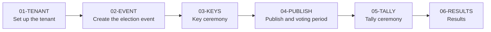

<!--
SPDX-FileCopyrightText: 2026 Sequent Tech Inc <legal@sequentech.io>
SPDX-License-Identifier: AGPL-3.0-only
-->

# 00-START: Before you start

Read this page before you do a procedure. It gives the order of the work, the roles, the terms
and the rules that keep the election secure.

## The order of the work

Do the procedures in this order. You can change the ballot content after the key ceremony,
but you must publish again after each change.

## Roles

| Role | Tasks | Default role in the admin portal |
| --- | --- | --- |
| Sequent | Creates the tenant. Installs the trustee services. Gives you the first administrator account and the admin portal address. | - |
| Tenant administrator | Sets up the tenant. Creates the accounts of the other users. | `admin` |
| Election administrator | Creates and configures the election event. Starts the ceremonies. Publishes the ballot. Opens and closes the voting period. Gets the results. | `admin` |
| Trustee | Keeps one fragment of the election private key. Takes part in the key ceremony and in the tally ceremony. | `trustee` |

One person can have more than one role. A trustee must not be the only person who controls
the other trustees.

:::note
Your organization can change the default roles. If a button or a tab in this manual is not on
your screen, your account does not have the necessary permission. Ask your tenant
administrator.
:::

## Terms

| Term | Meaning |
| --- | --- |
| Tenant | The space of your organization on the platform. It contains your settings, your users and your election events. |
| Election event | The complete election process, from the configuration to the results. It contains one or more elections. |
| Election | One vote inside an election event. It contains one or more contests. |
| Contest | One question or one race on the ballot. It contains the candidates. |
| Candidate | One option that a voter can select in a contest. |
| Area | A group of voters, for example a district. An area tells which contests a voter sees. |
| Voter | A person who can vote in the election event. Each voter belongs to one area. |
| Trustee | A person who keeps one fragment of the election private key. |
| Threshold | The minimum number of trustees that must take part in the tally ceremony. |
| Key ceremony | The procedure that makes the election keys. Voters encrypt their ballots with the public key. |
| Key fragment | The part of the private key that one trustee keeps. In the admin portal it is the **Encrypted Private Key** file. |
| Publication | A version of the ballot that the voting portal shows to voters. |
| Voting channel | A way to vote: **Online** (voting portal), **Kiosk** (voting kiosk), **Early voting** or **Telephone voting**. Each channel has its own voting status. |
| Tally ceremony | The procedure that decrypts and counts the votes. |
| Automatic ceremony | A key ceremony and a tally ceremony without trustee actions. The election event must permit it. |
| Results website | The public website that shows the results that you publish. |
| Sensitive action | An action for which the admin portal asks for your password again. |

## What you need

- A computer with an up-to-date version of Chrome, Firefox, Edge or Safari.
- The address of the admin portal. Sequent gives it to you.
- Your user name and password. The tenant administrator gives them to you.
- For trustees: two storage devices for the backups of the key fragment, for example two USB
  flash drives. Use devices that only you control.

## Sign in to the admin portal

1. Open the admin portal address in the browser.
2. If the **Select Tenant** page opens, type the **Tenant Name** and click **Continue**. Sequent
   gives you the tenant name.
3. Type your user name and your password.
4. Click the sign-in button.
5. If the admin portal asks for a second factor, do the steps on the screen.

**Expected result:** the admin portal opens. The menu on the left shows your tenant and the
items that your role permits:

| Menu item | Use |
| --- | --- |
| Tenant name, with a **+** icon | Shows your tenant. Only Sequent can use the **+** icon. |
| **Election Events** | The list of election events. Click **+** to create or import an election event. Use **Active** and **Archived** to filter the list. |
| **Users and Roles** | The accounts of the administrators and trustees, and the roles. |
| **Settings** | The configuration of the tenant. |
| **Templates** | The templates of the messages and documents. |
| **Help** | Help links. This item shows only if your tenant has help links. |

Under each election event, the menu shows a tree: election event, elections, contests and
candidates. Click the three dots next to an item to see the actions for it.

## Sensitive actions

Some actions need a recent confirmation of your identity, for example to publish the ballot or
to open the voting period. The confirmation is valid for 60 seconds after you sign in. When you do one of these actions, the admin portal shows:
"The action you are about to perform is sensitive and requires confirmation."

1. Click **Confirm**.
2. Type your password on the sign-in page.

**Expected result:** the admin portal opens again and continues the action.

## Safety rules

:::danger WARNING
Keep the key fragments secret and safe. If fewer trustees than the threshold have their key
fragment at the tally ceremony, nobody can decrypt the votes. Nobody, Sequent included, can
make a key fragment again.
:::

- Each trustee keeps their own key fragment. Do not send a key fragment by email or chat.
- Do not give your password to another person. Each person uses their own account.
- Do the procedures from a trusted computer and network.
- Record the date, the time and the persons present at each ceremony. The admin portal also
  records the actions in the **Logs** tab of the election event.

## Conventions in this manual

| Convention | Meaning |
| --- | --- |
| **Bold** | A label on the screen: a button, a tab, a field or a menu item. The text is the same as on the screen. |
| **Election Events** > **Data** | Go to the first item, then to the second. |
| Expected result | What you see when the step is correct. |
| WARNING | A risk to the secrecy, the integrity or the availability of the election. |
| CAUTION | A risk of data loss, or an action that you cannot reverse. |

**Next:** [01-TENANT: Set up the tenant](02-procedures/01-tenant.md).
