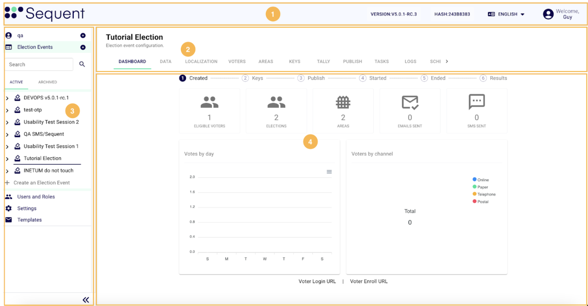

import GoogleVideo from '@site/src/components/GoogleVideo';

<!--
-- SPDX-FileCopyrightText: 2025 Sequent Tech Inc <legal@sequentech.io>
SPDX-License-Identifier: AGPL-3.0-only
-->

# Basic Navigation

<GoogleVideo id="1SRsbPGWiA8woHHrjtmoL9PuwBkJZQY4_" />

The system's user interface (UI) is divided into four main areas, each serving a specific function:

1. **Header (Top Bar)**
2. **Navigation Tabs (Under Election Event Title)**
3. **Side Menu (Left Sidebar)**
4. **Main Content Area (Data Display)**

---

## 1. Header

The header, located at the top of the screen, provides global controls and essential information that are always accessible. This area includes:

- **System Logo, Version Number and Hash**: The logo of the system, along with the current version number and the build hash, is displayed prominently for easy identification.
- **Language Selector**: A dropdown menu that allows users to switch between different languages, ensuring that the system is accessible to a broader audience.
- **Account Icon**: An icon that provides access to user account settings and the option to log out of the system. This is where users can manage their profile information and security settings.

---

## 2. Navigation Tabs

The navigation tabs under the selected entity title let you easily browse different sections, each showing specific information. Each entity has several unique tabs designed for its specific functions and data. This setup makes it easy to find and manage all the details related to each entity.

---

## 3. Side Menu

The side menu, located on the left of the screen, provides access to **Election Events**, **Users and Roles**, **Electoral Log**, **Settings** and **Templates**. A trustee also sees **Trustee Dashboard**. The menu shows **Help** when your tenant has help links. You see only the items that your role permits. This omnipresent menu ensures seamless navigation across all screens, allowing you to quickly access system settings and manage Election Events.

This section of the screen is one of the most critical areas of the system. It contains the **Election Event tree**, where you can access and create **Elections**, **Contests/Questions**, or **Candidates/Answers**.

To facilitate navigation, a **search field** is provided that allows you to search the election event tree for the name or alias of an election event, an election, a contest or a candidate. The search covers the items that the tree has loaded: open an election event to search inside it.

Election Events are categorized into **Active** and **Archived** for better organization. This allows users to archive election events that have been finalized or used for testing purposes, maintaining a clean tree structure with only the events currently in progress.

---

## 4. Main Content Area

The main content area, situated in the center of the screen, displays the currently selected section, whether it is an **Election Event**, **Settings** or **Templates**, among others.

Each section can contain additional tabs that provide more detailed options and settings related to the chosen topic. This layout ensures that users have a comprehensive view and easy access to all relevant functionalities and information.