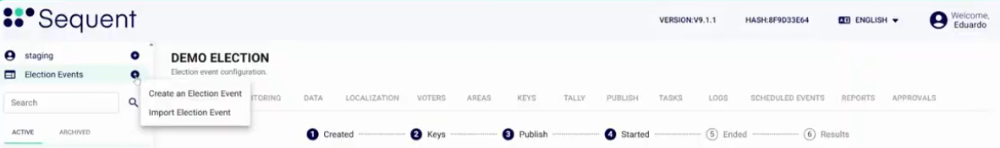
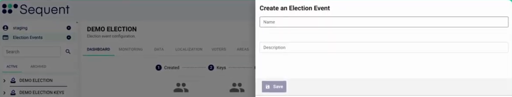
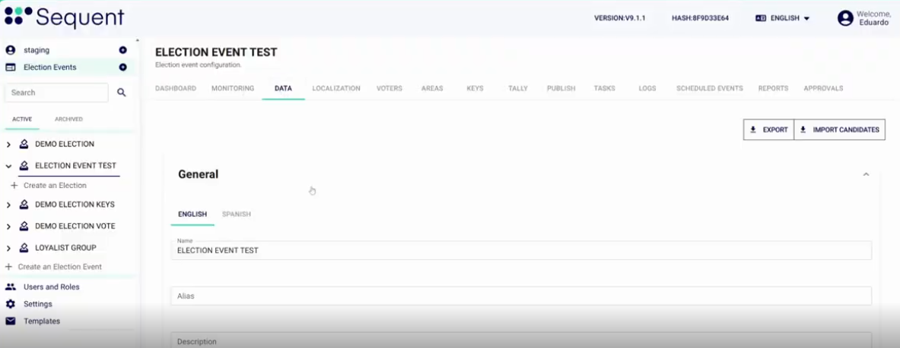
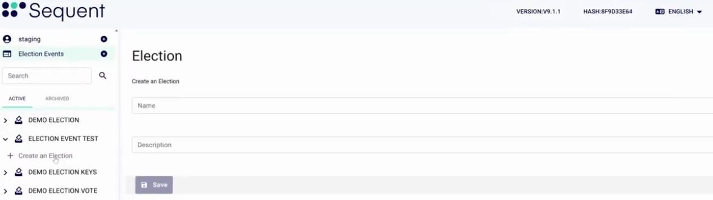
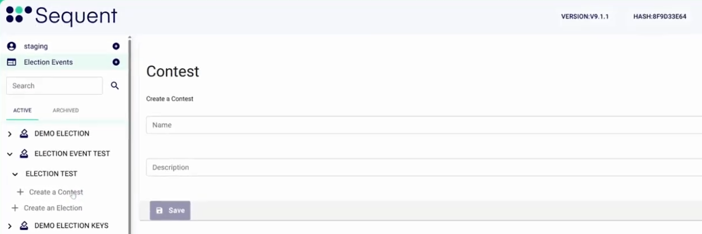
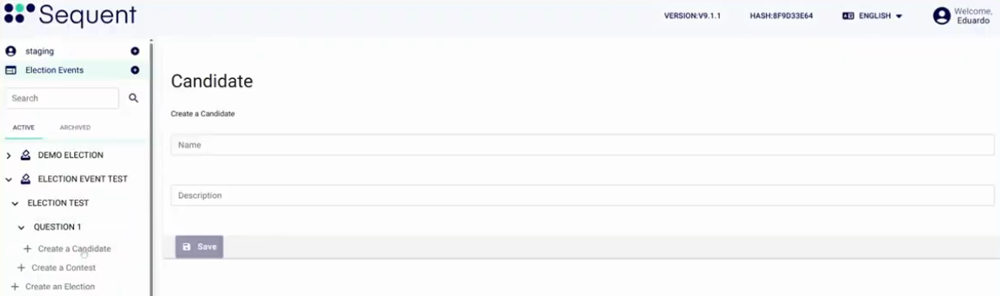

<!--
SPDX-FileCopyrightText: 2025 Sequent Tech <legal@sequentech.io>
SPDX-License-Identifier: AGPL-3.0-only
-->

import GoogleVideo from '@site/src/components/GoogleVideo';

<GoogleVideo id="1-LhcFt6-RG6X0wvkO5EvOJzgT2hL2jpK" />

This tutorial guides you through the process of creating a new election event, setting up specific elections, and adding contests and candidates within the Sequent Admin Portal.

## Step 1: Initiate Election Event Creation

There are several ways to start creating a new election event from the sidebar of the Sequent Admin Portal:

* **Election Events Menu**: Select the `Election Events` menu and then select `Create Election Event`.
* **Election List**: From the election list, click on one of the **three-dot icons** and choose the option to `Create an Election Event`.
* **Direct Sidebar Link**: Click directly on the `+ Create an Election Event` menu in the sidebar.

## Step 2: Configure Event Details

After initiating the process, the system will prompt you for the basic configuration of the event.

1.  Enter the **Name** of the election event.
2.  Provide a **Description**.
3.  Select `Save`.

:::info
**Post-Creation Options**: Once the event is created, you will see different menu options at the election event level, including **Dashboard**, **Monitoring**, **Data**, **Localization**, and **Voters**.
:::

## Step 3: Set Event Data and Preferences

In the **Data** tab, you can manage the core properties of the event.

* **Localization**: View and define names and aliases in different languages, such as English and Spanish.
* **Language Settings**: Set up the default languages for the event.
* **Ballot Design**: Customize visual options for the digital ballot.
* **Advanced Configurations**: Manage specific policies such as the **Countdown** timer or the **Encryption Policy**.

## Step 4: Create a Specific Election

An Election Event acts as a container that can hold one or more specific elections.

1.  In the sidebar under your new event, select `+ Create an Election`.
2.  Enter the **Name** and **Description** for the specific election.
3.  Select `Save`.
4.  (Optional) Continue customizing your election using the various configurations available in the Data tab.

:::tip
**Election Level Dashboards**: Each specific election has its own dashboard to track metrics like eligible voters, actual voters, and voting trends by day or channel.
:::

## Step 5: Add Contests and Candidates

Finally, define the structure of your ballot by adding contests (questions) and their respective candidates.

1.  **Create a Contest**: Select `+ Create a Contest` under the specific election. Enter the name (e.g., "Question 1") and click `Save`.

2.  **Add Candidates**: Under the newly created contest, select `+ Create a Candidate`.
3.  Enter the **Candidate Name** and details, then select `Save`.
4. (Optional) Customize your contest using the various configurations available in the Data tab.

