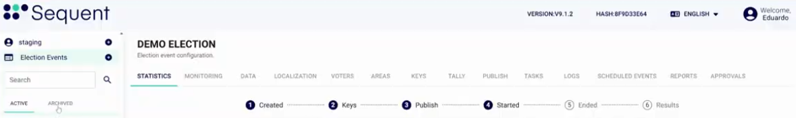
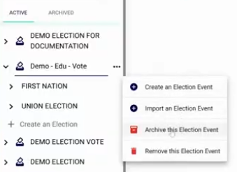
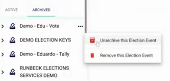

<!--
SPDX-FileCopyrightText: 2025 Sequent Tech <legal@sequentech.io>
SPDX-License-Identifier: AGPL-3.0-only
-->

import GoogleVideo from '@site/src/components/GoogleVideo';

<GoogleVideo id="1nC-EvQ7Xso6eAn5-PU67vKgl6zKTROC9" />

The Sequent Admin Portal allows you to manage the visibility of your electoral events by categorizing them as either Active or Archived. This helps maintain a clean workspace by separating ongoing elections from historical data.

## Understanding Election Statuses

The sidebar contains two primary tabs to help you organize your events:

* **Active:** This tab displays elections that are currently ongoing or are scheduled to open in the near future.
* **Archived:** This tab stores past elections that have concluded but are being retained for records or auditing purposes.

## Archiving an Election

Once an election has ended, you can move it to the Archived list to declutter your active dashboard.

1.  Locate the election in the **Active** tab.
2.  Click the **three-dot icon** next to the election name.
3.  Select `Archive this Election Event`.

## Unarchiving and Restoring Elections

If you need to reactivate an archived election or simply view its data in the active list, you can unarchive it at any time.

1.  Switch to the **Archived** tab in the sidebar.
2.  Locate the desired electoral event.
3.  Click the **three-dot icon** and select `Unarchive this Election Event`.
4.  Confirm the action in the warning prompt. The event will now reappear in the **Active** tab.

:::warning
**Permanent Removal:** Both the Active and Archived menus contain an option to `Remove this Election Event`. Selecting this will permanently delete the event and all associated data from the system.
:::
