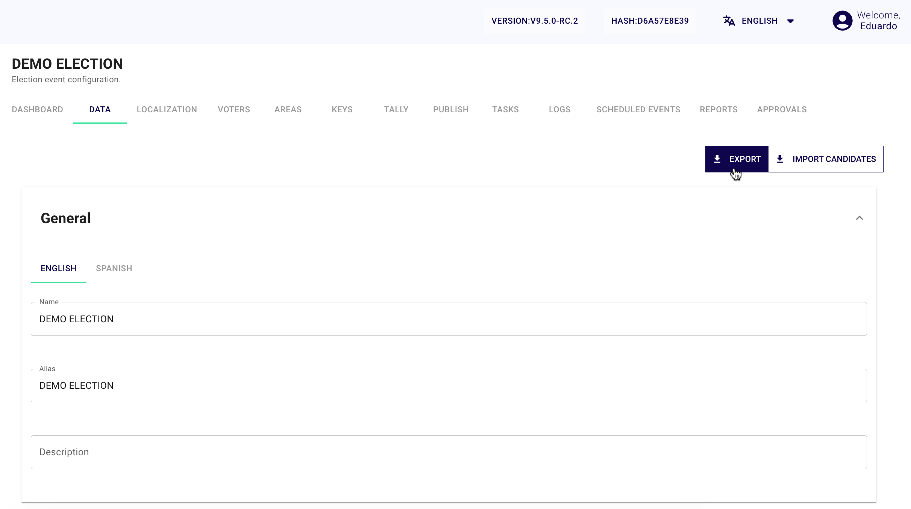
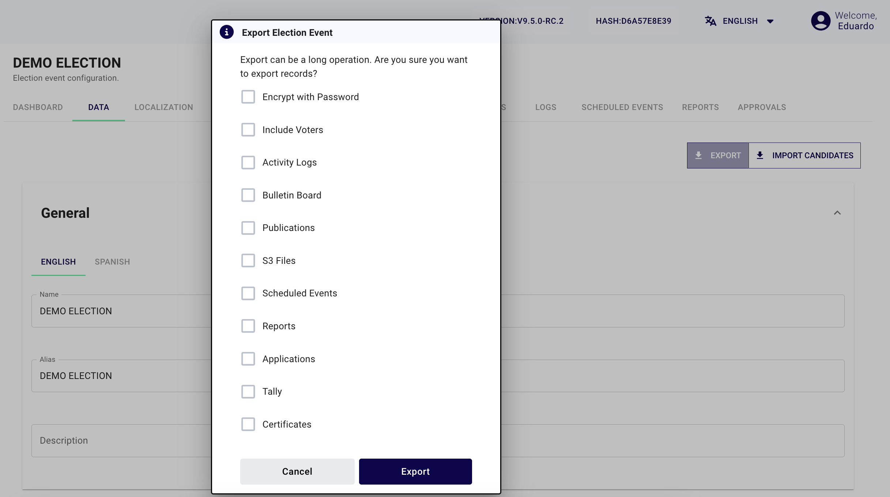
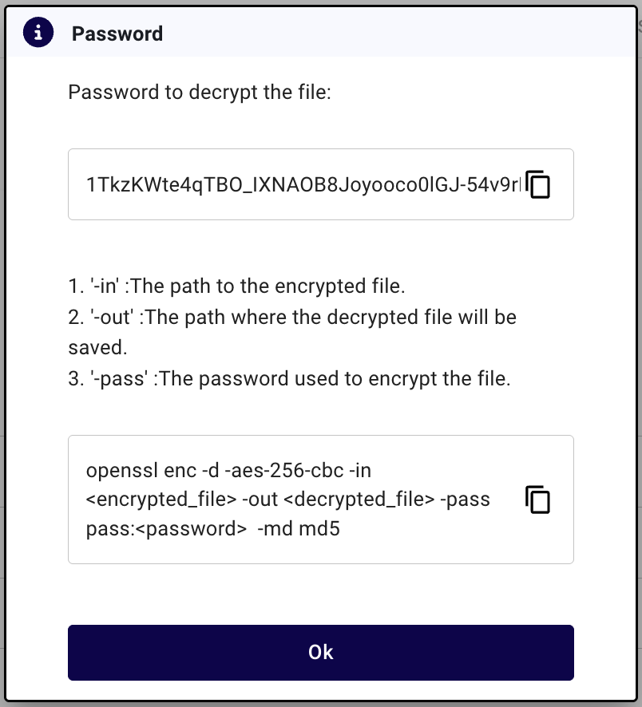
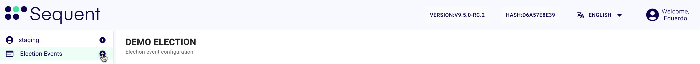
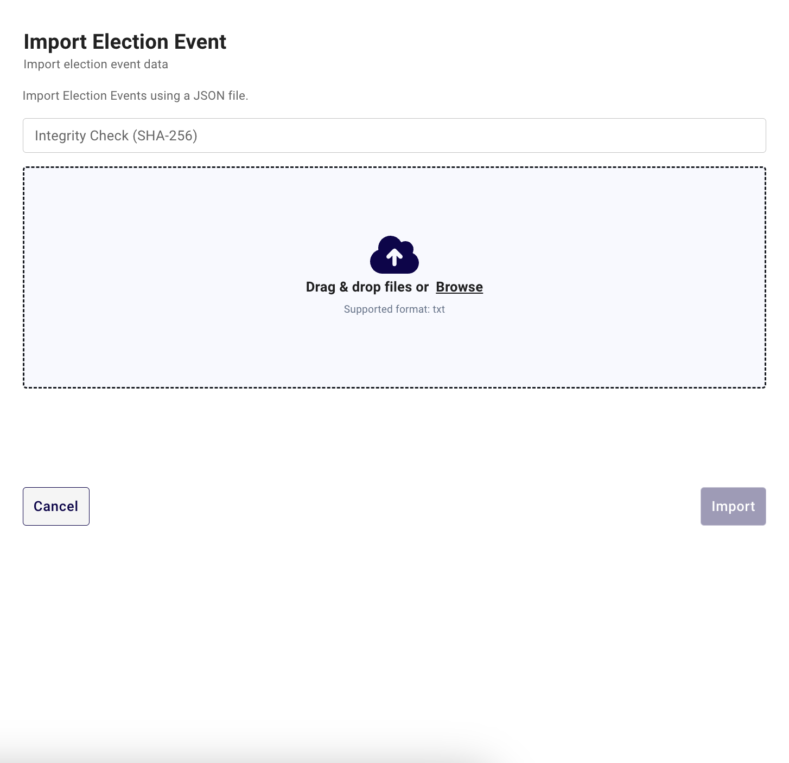

import GoogleVideo from '@site/src/components/GoogleVideo';

<!--
SPDX-FileCopyrightText: 2025 Sequent Tech <legal@sequentech.io>
SPDX-License-Identifier: AGPL-3.0-only
-->
---

<GoogleVideo id="13KrQtqIfsw24sZCCBjO0-f6wM_kcDUI-" />

The Sequent Admin Portal provides tools to export election data for backup or auditing and to import existing election configurations to quickly set up new events.

## Exporting an Election Event

Exporting allows you to save a comprehensive snapshot of your election event.

1.  Navigate to the **Data** menu within your specific Electoral Event.
2.  Select the `Export` button.

3.  Choose the data components you wish to include in the export:
    * **Include Voters:** Exports the registered voter list.
    * **Activity Logs:** Includes a history of administrative actions.
    *  * **Bulletin Board:** Includes the cryptographic state of the Election Event such as key ceremonies.
    *  **Publications:** Includes the publication history for the Election Event.
    *  **S3 Files:** Includes images, support materials or other files that are saved in cloud storage.
    *  **Scheduled Events:** Includes configured Scheduled Events.
    * **Reports:** Includes generated election reports.
    * **Tally:** Includes the final vote counts (if available).

:::info
**Security:** If you select sensitive data like voter lists, the system automatically activates **Password Encryption** for the resulting ZIP file.
:::

1.  Click `Export` to generate an `.ezip` file.
2.  **Save the Password:** A dialog will display a unique decryption password. Copy and store this securely; you will need it to import the file later or to unzip it manually.

## Importing an Election Event

You can import an election event using a previously exported `.ezip` file to recreate an event configuration.

:::info
You can only import election events exported from the same major version, with the same or lower minor version.
For example, assuming you have version **10.1.0** installed, you can only import events from version **10.1.0** or **10.0.0**.
:::

1.  From the sidebar, click the **plus icon** next to "Election Events" or the `+ Create an Election Event` button.
2.  Select `Import Election Event`.

