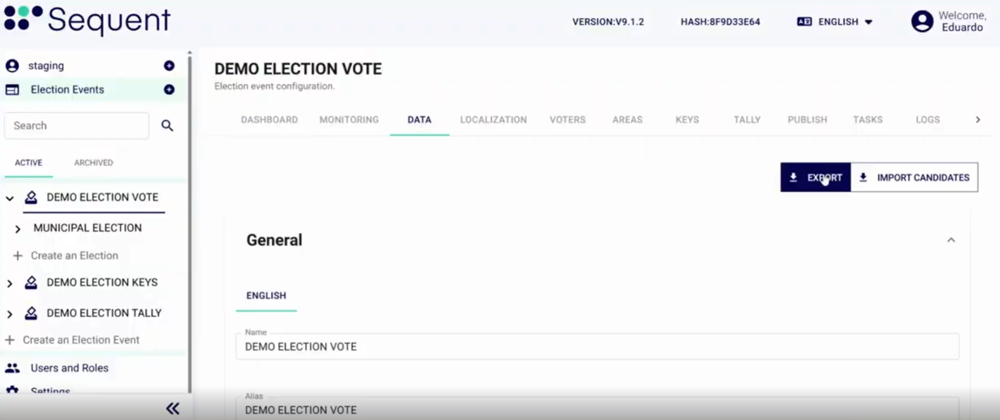
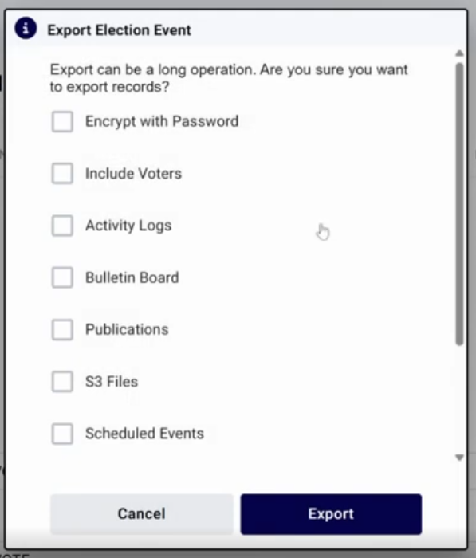
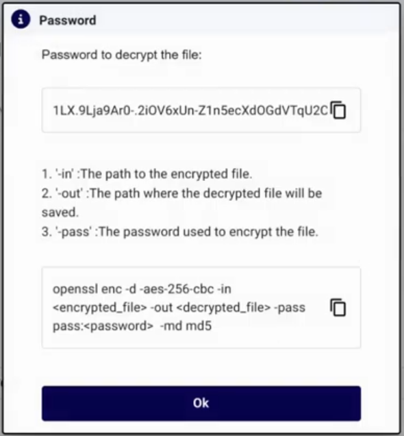
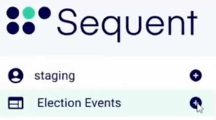

import GoogleVideo from '@site/src/components/GoogleVideo';

<!--
SPDX-FileCopyrightText: 2025 Sequent Tech <legal@sequentech.io>
SPDX-License-Identifier: AGPL-3.0-only
-->

<GoogleVideo id="13KrQtqIfsw24sZCCBjO0-f6wM_kcDUI-" />

The Sequent Admin Portal provides tools to export election data for backup or auditing and to import existing election configurations to quickly set up new events.

## Exporting an Election Event

Exporting allows you to save a comprehensive snapshot of your election event.

1.  Open the **Data** tab of the election event.
2.  Click **Export**.

3.  Choose the data components you wish to include in the export:
    * **Include Voters:** Exports the registered voter list.
    * **Activity Logs:** Includes a history of administrative actions.
    * **Bulletin Board:** Includes the cryptographic state of the Election Event such as key ceremonies.
    * **Publications:** Includes the publication history for the Election Event.
    * **S3 Files:** Includes images, support materials or other files that are saved in cloud storage.
    * **Scheduled Events:** Includes configured Scheduled Events.
    * **Reports:** Includes the configuration of the reports of the election event.
    * **Applications:** Includes the enrollment applications of voters.
    * **Tally:** Includes the final vote counts (if available). This option also selects **Bulletin Board**.
    * **Certificates:** Includes the certificate authorities of the election event.

:::info
**Security:** Select **Encrypt with Password** to protect the file with a password. If you select **Bulletin Board**, **Reports** or **Applications**, the file is always protected with a password. If you also select **Include Voters** or **S3 Files**, **Encrypt with Password** adds the decrypted secret voter fields to the export, when your account has the permission to read them.
:::

1.  Click **Export**. A password-protected export is an `.ezip` file. Another export is a `.zip` file.
2.  **Save the Password:** For a password-protected export, a dialog will display a unique decryption password. Copy and store this securely; you will need it to import the file later or to unzip it manually.

## Importing an Election Event

You can import an election event from a `.json` file, a `.zip` export or a password-protected `.ezip` export. For the full steps, see [Create the Election Event](../03-procedures/02-event.md#import-an-election-event-alternative).

:::info
You can only import election events exported from the same major version, with the same or lower minor version.
For example, assuming you have version **10.1.0** installed, you can only import events from version **10.1.0** or **10.0.0**.
:::

1.  From the sidebar, click the **+** icon next to **Election Events**, or click **Create an Election Event** at the end of the election event tree to open the same menu.
2.  Click **Import Election Event**.

