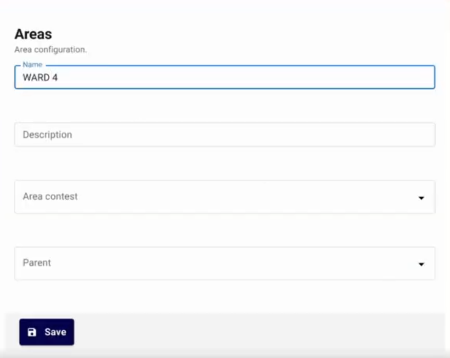
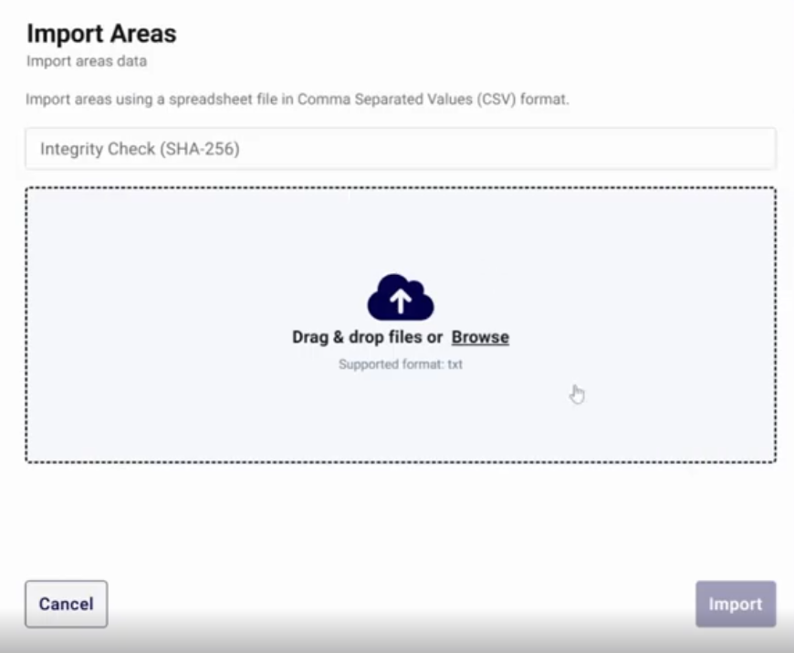

<!--
SPDX-FileCopyrightText: 2025 Sequent Tech <legal@sequentech.io>
SPDX-License-Identifier: AGPL-3.0-only
-->

import GoogleVideo from '@site/src/components/GoogleVideo';

<GoogleVideo id="1mt0vOfcXRwW0cviJMwzawJWe6hC9Mf0L" />

Areas allow you to organize an election into specific geographic or logical divisions, such as wards or districts. This structure enables you to assign specific contests to relevant groups of voters.

## Accessing the Areas Menu

To manage areas, first select your electoral event and then click on the **Areas** menu in the top navigation bar.

From this screen, you can view existing areas, the contests assigned to them, and perform management actions like editing or deleting.

## Creating a New Area

Follow these steps to define a new area within your election:

1. Select the `+ ADD` button.
2. **Name:** Enter a unique name for the area (e.g., "Ward 4").
3. **Description:** Provide an optional description.
4. **Area Contests:** Select one or more contests that should be available to voters in this specific area.

5. **Parent:** If the area is part of a larger hierarchy, you can select a parent area.
6. Select `Save`.

## Managing and Importing Areas

The Areas interface provides several tools for efficient organization and bulk data management.

* **Search:** Quickly find an area by typing its name or description into the search bar.
* **Filters:** Use the `ADD FILTER` button to narrow down the area list by specific criteria.
* **Import:** Select `IMPORT` to upload area data in bulk using a CSV file.

:::info
**Integrity Check:** When importing area data, the system allows you to paste a **SHA-256 hash** to verify the file's authenticity and ensure it hasn't been tampered with.
:::

7. Drag and drop your file or click **Browse** to select your CSV.
8. Select `Import` to finalize the process.
