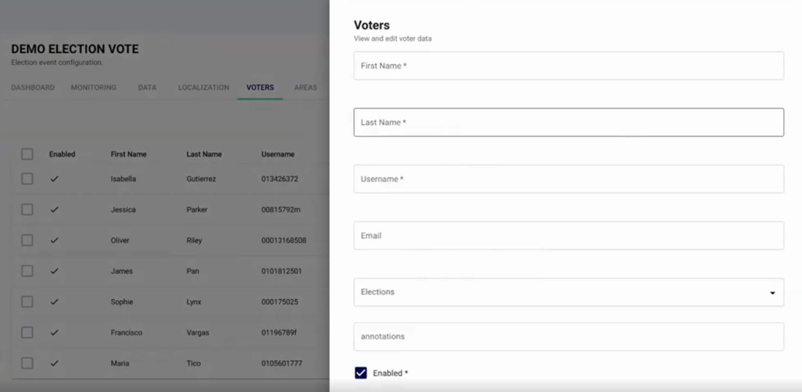
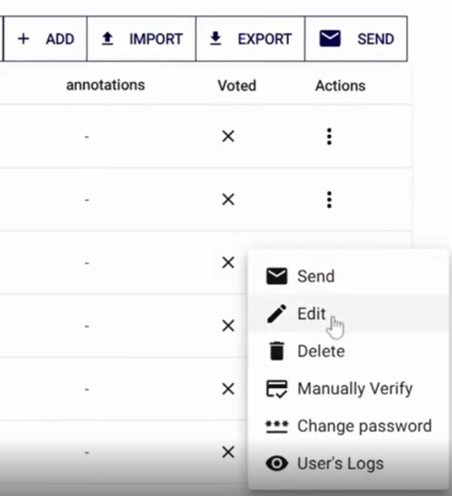
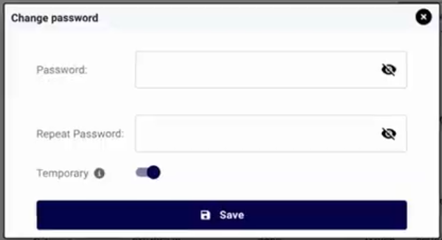

<!--
SPDX-FileCopyrightText: 2025 Sequent Tech <legal@sequentech.io>
SPDX-License-Identifier: AGPL-3.0-only
-->

import GoogleVideo from '@site/src/components/GoogleVideo';

<GoogleVideo id="1jyp8LNfbWkeAs6iocX7gca5jpkOJZOhU" />

Managing your voter registry is a core administrative task. The Sequent Admin Portal allows you to add individual voters, assign them to specific elections and areas, and manage their credentials.

## Adding a New Voter

To add a voter, ensure you are logged in with an administrator account and follow these steps:

1. Select the relevant **Electoral Event** from the sidebar.
2. Navigate to the **Voters** menu to view the current list of registered voters.
3. Click the `+ ADD` button to open the voter configuration panel.

4. Enter the required details:
    * **First and Last Name:** The legal name of the voter.
    * **Username/Email:** The identifier used for system login.
    * **Election:** Assign the voter to a specific election (e.g., Municipal Election).
    * **Area:** Assign the voter to a specific voting area or district (e.g., Dallas).
5. Set a **Password** and repeat it for verification.
6. Select `Save`.

:::tip
**Temporary Passwords:** You can activate the **Temporary** option if you want the voter to be forced to change their password the next time they log in.
:::

## Editing Voter Information

If you need to update a voter's name, assigned election, or area, you can edit their profile directly from the list.

1. Find the voter in the list and click the **three-dot icon** in the **Actions** column.
2. Select `Edit`.
3. Update the necessary fields and click `Save`.

## Managing Voter Credentials and Logs

The **Actions** menu also provides tools for troubleshooting and security:

* **Change Password:** If a voter forgets their credentials, you can manually reset them by selecting this option and typing a new password.

* **User's Logs:** Select this to check the activity records for a specific voter.
* **Delete:** Permanently removes the voter from the registration list.