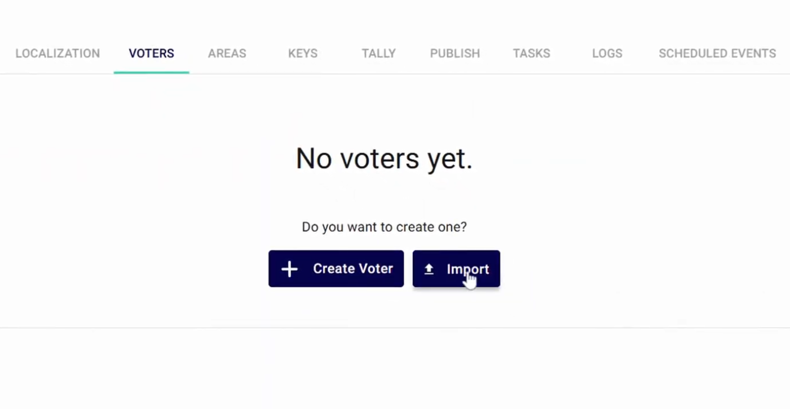
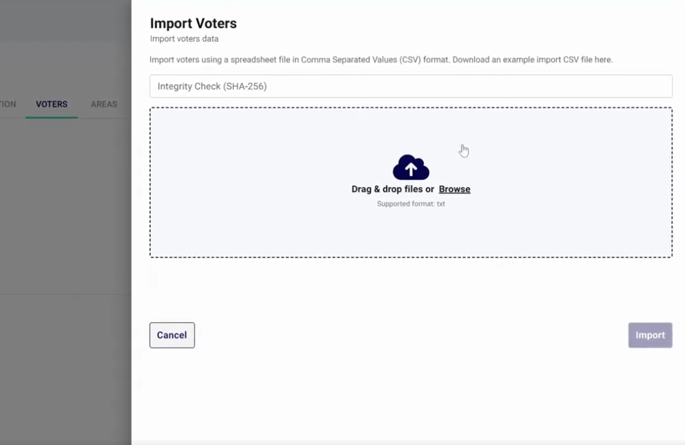

<!--
SPDX-FileCopyrightText: 2025 Sequent Tech <legal@sequentech.io>
SPDX-License-Identifier: AGPL-3.0-only
-->

import GoogleVideo from '@site/src/components/GoogleVideo';

<GoogleVideo id="1jyp8LNfbWkeAs6iocX7gca5jpkOJZOhU" />

The Sequent Admin Portal allows for the bulk import of voter data using CSV files, enabling administrators to register large numbers of participants efficiently.

## Step 1: Access the Voter Import Tool

1. Log in to the **Admin Portal** with an account that has administrator privileges.
2. Select the specific **Electoral Event** where you want to import voters.
3. Navigate to the **Voters** menu in the top navigation bar.
4. Select the `Import` button.

## Step 2: Prepare and Upload the CSV File

The file to be imported must be a **CSV** (comma-separated values) file containing specific headers such as First Name, Last Name, Area, Elections, and Username (e.g., Voter ID). Additional fields like email or phone numbers can be included as needed.

1. Click **Browse** or drag and drop your CSV file into the upload area.

2. **Integrity Check (Optional):** To ensure the file has not been modified since its creation, you can paste its **SHA-256 hash** into the Integrity Check field.
3. Select `Import` (or `Yes, import without Integrity Check` if skipping the hash).

## Step 3: Verify the Import

The system will process the file, which may take several seconds depending on the number of voters.

1. Once complete, a success message will appear in the **notification box**.
2. To see the new list, refresh the **Voters** menu by switching tabs or clicking the menu again.
3. Use the pagination at the bottom to view the total number of imported voters.

:::info
**Post-Import Actions:** From the voter list, you can still export the registry or use the `Import` button again to add more participants. Note that duplicates will not be accepted.
:::
