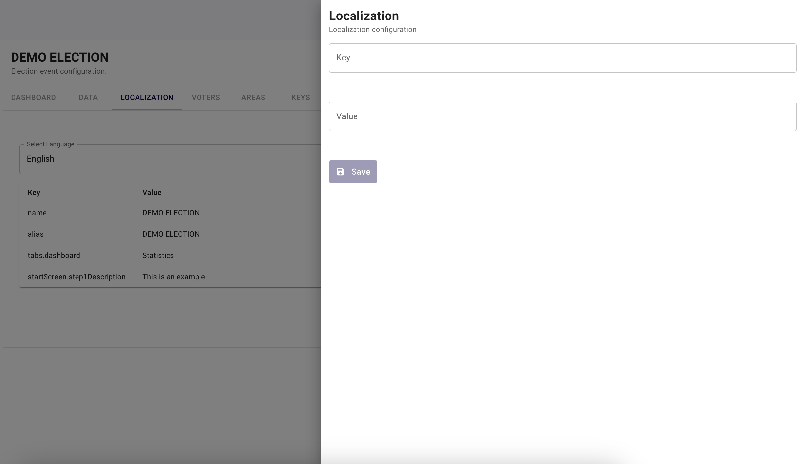
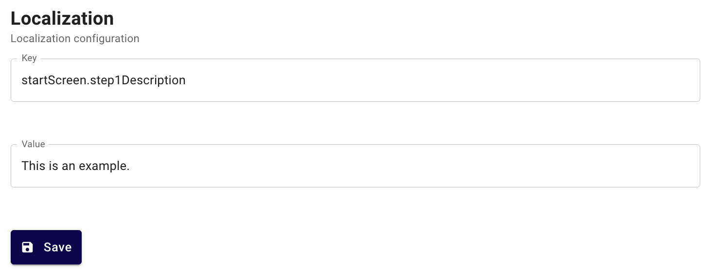

<!--
SPDX-FileCopyrightText: 2025 Sequent Tech <legal@sequentech.io>
SPDX-License-Identifier: AGPL-3.0-only
-->

import GoogleVideo from '@site/src/components/GoogleVideo';

<GoogleVideo id="1v0kyahg1n7SqxOx24lwjj4zIRGO-0YGt" />

The Sequent platform allows administrators to overwrite or customize any text appearing in the Admin Portal or the Voter Portal. This is achieved through the **Localization** feature, which maps specific system "keys" to custom display values in different languages.

## Overwriting Admin Portal Text

You can change the labels of menus and tabs within the Admin Portal to better suit your organization's terminology.

1. Navigate to the **Settings** menu and select the **Localization** tab.
2. Choose the language you wish to modify (e.g., English).
3. Click the `+ ADD` button to create a new localization configuration.

4. Enter the **Key** for the text you want to change (e.g., `electionEventScreen.tabs.dashboard`).
5. Enter the new **Value** you want to display (e.g., "Statistics").
6. Click `Save`.

## Overwriting Voting Portal Text

To customize the experience for voters, you can modify instructions and descriptions within the voting interface.

1. Select the specific **Electoral Event** or **Election** you want to modify.
2. Click on the **Localization** menu in the top navigation bar.
3. Select `+ ADD` to overwrite a specific element of the voter interface.

4. Provide the specific **Key** (e.g., `startScreen.step1Description`) and the new **Value**.
5. Click `Save` to apply the changes to the voter experience.

:::info
**Key Identification:** To successfully overwrite text, you must know the specific system key associated with that screen element. All text across all screens can be modified once the corresponding key is identified.
:::
