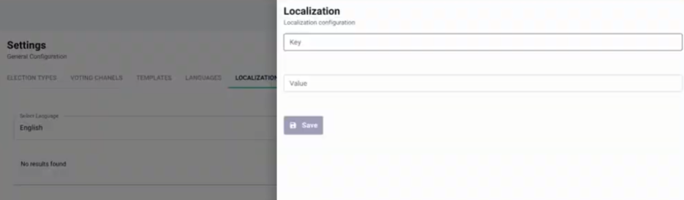
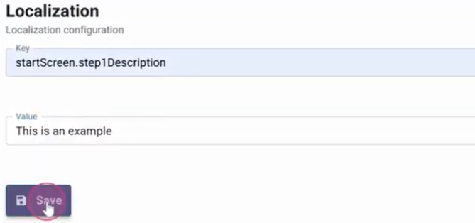

<!--
SPDX-FileCopyrightText: 2025 Sequent Tech <legal@sequentech.io>
SPDX-License-Identifier: AGPL-3.0-only
-->

import GoogleVideo from '@site/src/components/GoogleVideo';

<GoogleVideo id="1v0kyahg1n7SqxOx24lwjj4zIRGO-0YGt" />

The Sequent platform allows administrators to overwrite or customize any text appearing in the Admin Portal or the Voter Portal. This is achieved through the **Localization** feature, which maps specific system "keys" to custom display values in different languages.

## Overwriting Admin Portal Text

You can change the labels of menus and tabs within the Admin Portal to better suit your organization's terminology.

1. In the menu on the left, click **Settings**, then click the **LOCALIZATION** tab.
2. Choose the language you wish to modify (e.g., English).
3. Click **Add** to create a new localization configuration.

4. Select the **Portal scope**, for example **Admin portal**, and enter the **Key** for the text you want to change (e.g., `electionEventScreen.tabs.dashboard`).
5. Enter the new **Value** you want to display (e.g., "Statistics").
6. Click the save button.

## Overwriting Voting Portal Text

To customize the experience for voters, you can modify instructions and descriptions within the voting interface.

1. Open the election event you want to modify. Elections do not have a **Localization** tab.
2. Click the **Localization** tab.
3. Click **Add** to overwrite a specific element of the voter interface.

4. Select the **Portal scope**, for example **Voting portal**. Provide the specific **Key** (e.g., `startScreen.step1Description`) and the new **Value**.
5. Click the save button to apply the changes to the voter experience.

:::info
**Key Identification:** To successfully overwrite text, you must know the specific system key associated with that screen element. All text across all screens can be modified once the corresponding key is identified.
:::
