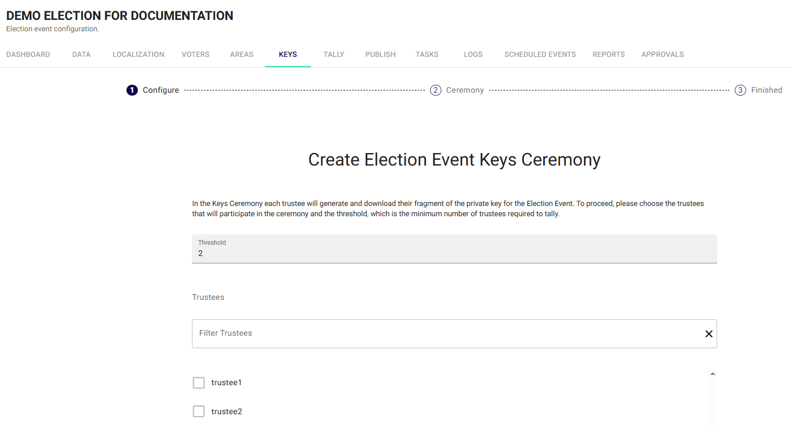
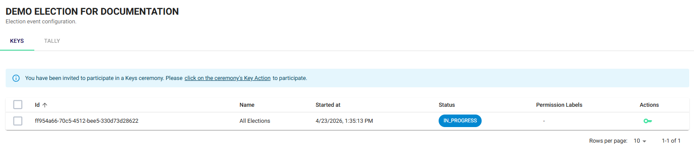
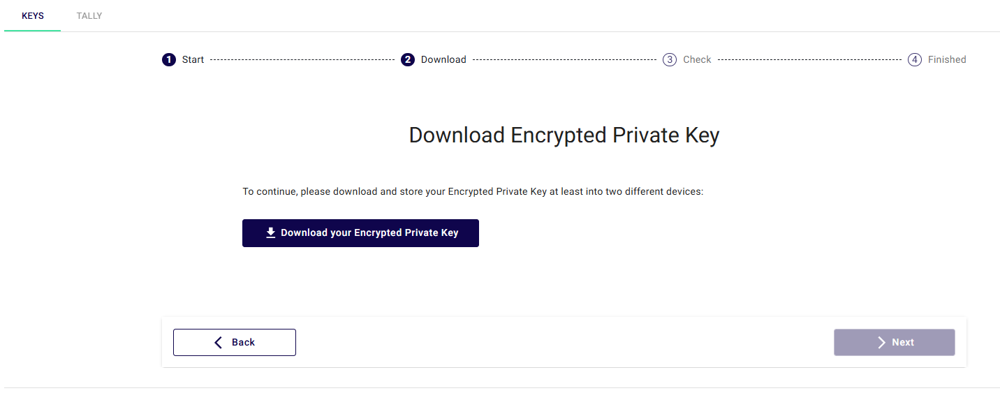
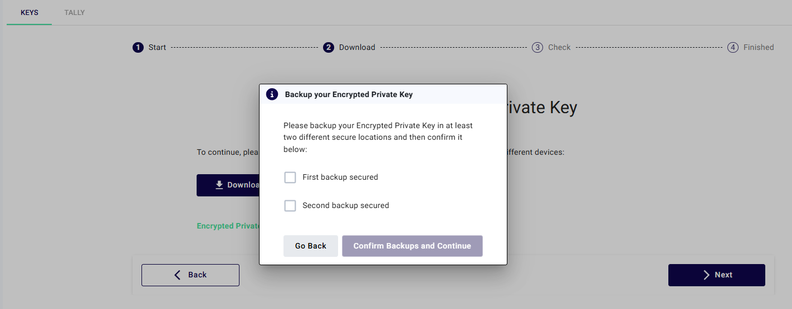
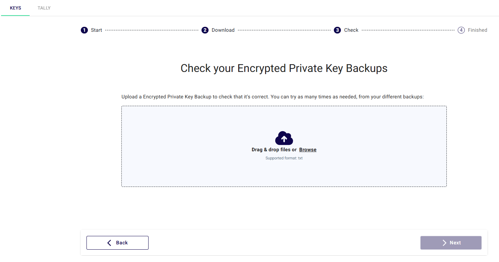
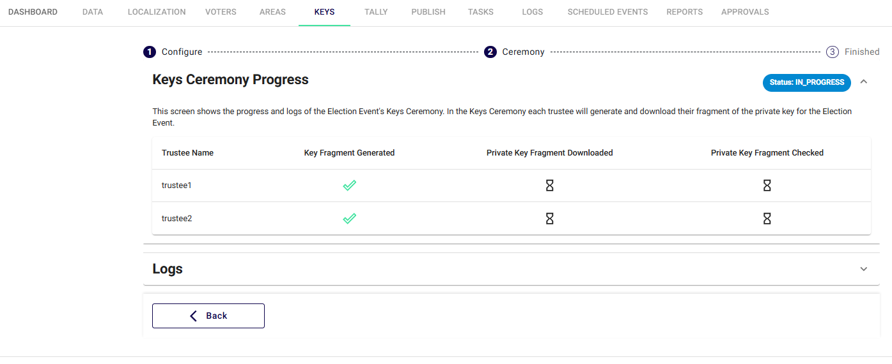

import GoogleVideo from '@site/src/components/GoogleVideo';

<!--
SPDX-FileCopyrightText: 2025 Sequent Tech <legal@sequentech.io>
SPDX-License-Identifier: AGPL-3.0-only
-->

<GoogleVideo id="1F7IVr_xcTzLdUQ3K7CkRtoObeVpakzuV" />

The Key Ceremony is a vital security procedure that ensures the integrity and secrecy of an election. It generates a fragmented cryptographic private key, ensuring that no single individual or organization can decrypt votes or manipulate the tally independently.

## Core Concepts: Threshold Cryptography

The security of the Sequent system relies on **Threshold Decryption**. 

* **Fragmentation**: The private key is never generated as a single file. It is split into multiple fragments, each assigned to a different **Trustee**.
* **The Threshold**: This is the minimum number of Trustees required to combine their fragments and decrypt the results. 
* **Security Guarantee**: A threshold (e.g., 2 out of 3) ensures that even if one fragment is lost or stolen, the election remains secure and recoverable—but only if the remaining Trustees cooperate.

## Step 1: Administrator Initiation

The Platform Administrator acts as the coordinator for the ceremony.

1.  Log in with **Administrator** permissions.
2.  Select the **Electoral Event** and navigate to the **Keys** menu.
3.  Click `+ Create Key Ceremony`.
4.  **Configure the Threshold**: Set the minimum number of members needed to tally. Sequent recommends that the threshold be lower than the total number of Trustees (e.g., a threshold of 2 for 3 Trustees).
5.  **Assign Trustees**: Use the filter to select specific authorized users (usually members of an electoral board).
6.  Select the **Election** scope (one specific election or "All Elections") and confirm.

## Step 2: Trustee Participation

Once the ceremony is created, each assigned Trustee must perform their individual security steps.

1.  **Login**: Each Trustee must log in with their own unique credentials.
2.  **Access Keys**: Navigate to the **Keys** menu of the event. A notification will invite the user to participate. Alternatively, trustees may select the **green key icon**.

3.  **Generate & Download**: Click the  to download the unique private key fragment.

4.  **Secure Backups**: Trustees are required to confirm they have saved the fragment in at least two different secure locations, typically encrypted USB devices.

5.  **Integrity Check**: The Trustee must upload the file back into the "Check" box to verify that the download was successful and the file is valid.

## Step 3: Monitoring and Success

The Administrator can monitor the **Key Ceremony Progress** dashboard to track completions.

* **Green Checkmarks**: Indicate that a Trustee has successfully generated, downloaded, and verified their fragment.
* **Logs**: A detailed activity log at the bottom of the screen records every step of the ceremony for auditing purposes.

Once all Trustees complete their tasks, the status will change to **SUCCESS**.

:::danger **Irrecoverable Data Warning**
If too many Trustees lose their fragments (dropping the total below the set threshold), the election results **cannot be decrypted by anyone**, including Sequent technical support. Secure storage of these fragments is the most critical responsibility of the Trustees.
:::
