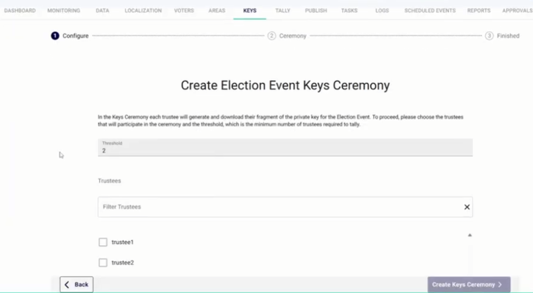
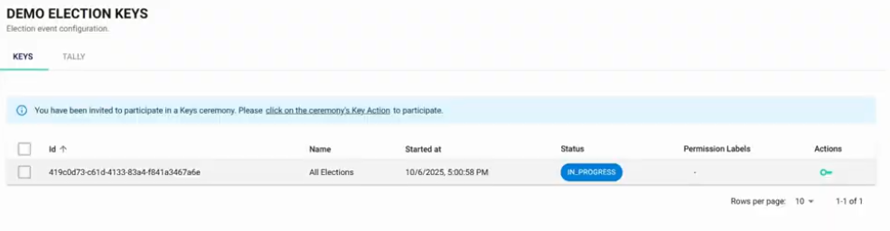
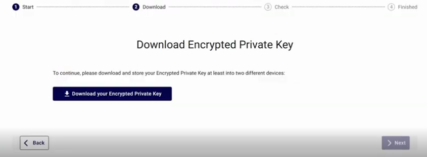
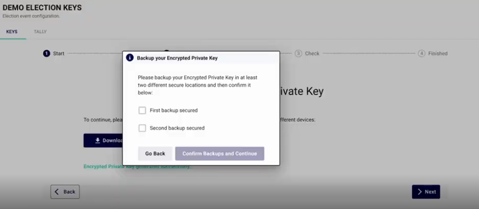
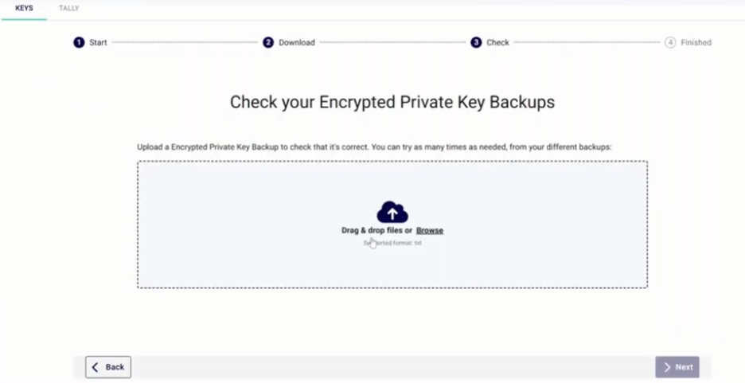
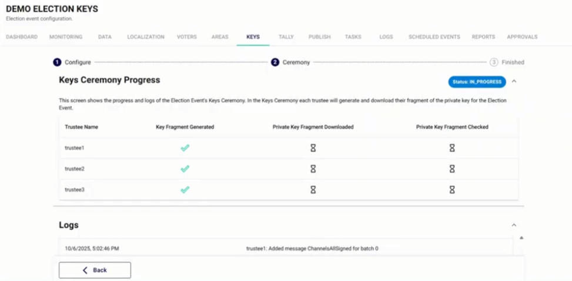

import GoogleVideo from '@site/src/components/GoogleVideo';

<!--
SPDX-FileCopyrightText: 2025 Sequent Tech <legal@sequentech.io>
SPDX-License-Identifier: AGPL-3.0-only
-->

<GoogleVideo id="1F7IVr_xcTzLdUQ3K7CkRtoObeVpakzuV" />

The Key Ceremony is a vital security procedure that ensures the integrity and secrecy of an election. It generates a fragmented cryptographic private key, ensuring that no single individual or organization can decrypt votes or manipulate the tally independently.

## Core Concepts: Threshold Cryptography

The security of the Sequent system relies on **Threshold Decryption**. 

* **Fragmentation**: The private key is never generated as a single file. It is split into multiple fragments, each assigned to a different **Trustee**.
* **The Threshold**: This is the minimum number of Trustees required to combine their fragments and decrypt the results. 
* **Security Guarantee**: A threshold (e.g., 2 out of 3) ensures that even if one fragment is lost or stolen, the election remains secure and recoverable—but only if the remaining Trustees cooperate.

## Step 1: Administrator Initiation

The Platform Administrator acts as the coordinator for the ceremony.

1.  Log in with **Administrator** permissions.
2.  Open the election event and click the **Keys** tab.
3.  Click **Create Key Ceremony**. If the election event already has a key ceremony, click **Add**.
4.  **Configure the Threshold**: In **Threshold**, set the minimum number of members needed to tally. The value is `2` at the start. It must be 2 or more, and not more than the number of trustees of the tenant. Sequent recommends that the threshold be lower than the total number of Trustees (e.g., a threshold of 2 for 3 Trustees).
5.  **Assign Trustees**: In **Trustees**, use **Filter Trustees** to find the authorized users (usually members of an electoral board). Select at least as many trustees as the threshold.
6.  If the election event permits automatic ceremonies, the page shows **Automatic Ceremony**. Leave it off for a ceremony with trustees.
7.  In **Election**, type three or more letters of the name to select one election, or leave the field empty for **All Elections**. The list shows only the elections that have no key ceremony.
8.  Click **Create Key Ceremony**, then click **Yes, Create Key Ceremony** to confirm.

## Step 2: Trustee Participation

Once the ceremony is created, each assigned Trustee must perform their individual security steps.

1.  **Login**: Each Trustee must log in with their own unique credentials.
2.  **Access Keys**: Open the **Keys** tab of the election event. A message invites the trustee to participate. Click the green key icon **Participate in Keys Ceremony** in the **Actions** column of the ceremony.

3.  **Start**: Read the steps on the **Trustee Key Ceremony** page and click **Next**. If the message "Waiting for Keys Generation.." shows, wait until the keys exist.
4.  **Download**: Click **Download your Encrypted Private Key** to download the unique private key fragment.

5.  **Secure Backups**: Click **Next**. In the **Backup your Encrypted Private Key** window, select **First backup secured** and **Second backup secured**, then click **Confirm Backups and Continue**. Trustees are required to confirm they have saved the fragment in at least two different secure locations, typically encrypted USB devices.

6.  **Integrity Check**: On the **Check your Encrypted Private Key Backups** page, the Trustee must upload the file back into the upload area to verify that the download was successful and the file is valid. The message "Backup verified successfully." shows when the file is valid. The Trustee can try again with each backup.

## Step 3: Monitoring and Success

The Administrator can monitor the **Key Ceremony Progress** section to track completions. The page opens after you create the ceremony. To open it later, click the file icon in the **Actions** column of the ceremony.

* **Green Checkmarks**: In the columns **Key Fragment Generated**, **Private Key Fragment Downloaded** and **Private Key Fragment Checked**, a check mark indicates that a Trustee has completed that step. An hourglass indicates that the step is not complete.
* **Logs**: A detailed activity log at the bottom of the screen records every step of the ceremony for auditing purposes.

Once all Trustees complete their tasks, the status will change to `SUCCESS`.

:::danger **Irrecoverable Data Warning**
If too many Trustees lose their fragments (dropping the total below the set threshold), the election results **cannot be decrypted by anyone**, including Sequent technical support. Secure storage of these fragments is the most critical responsibility of the Trustees.
:::
