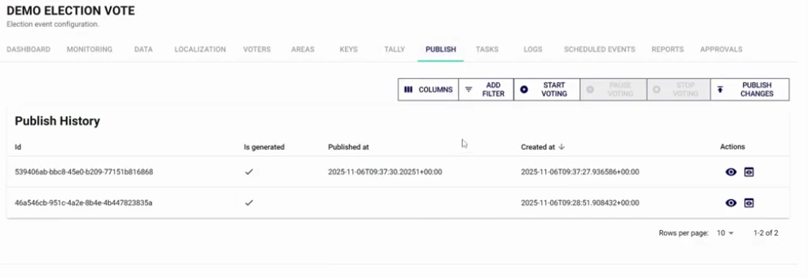
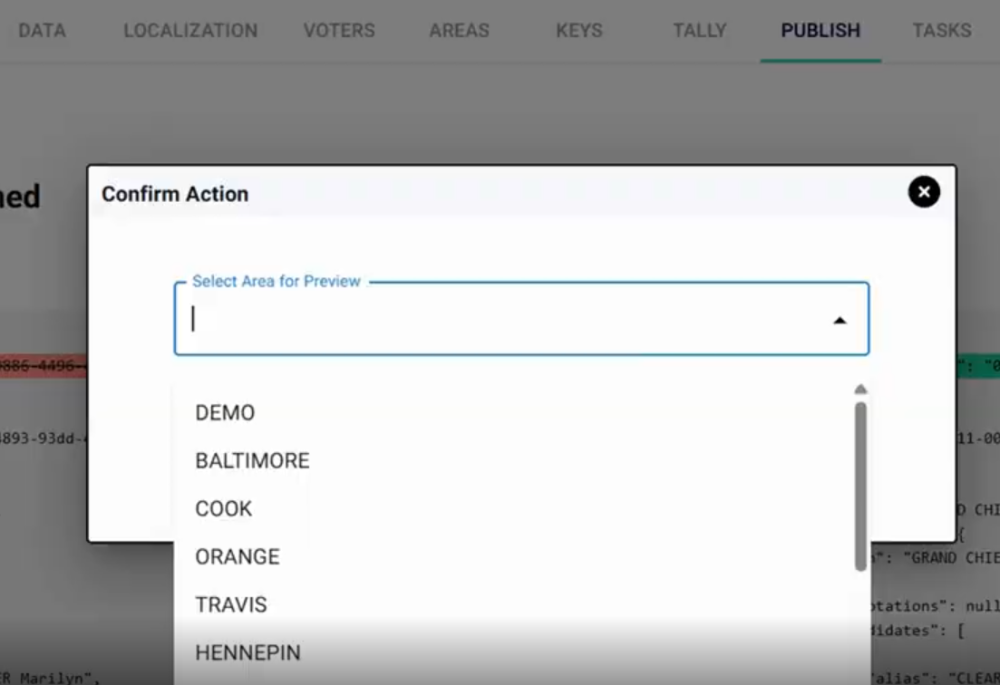
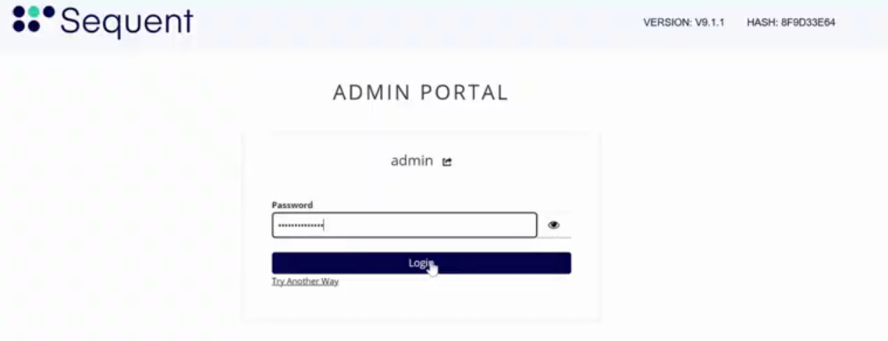
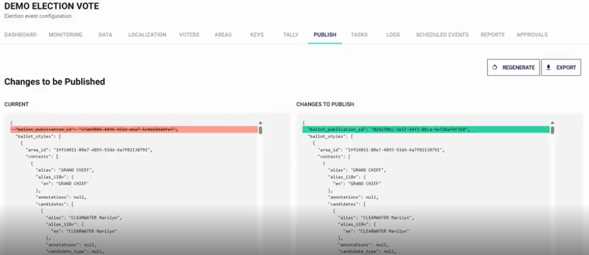

import GoogleVideo from '@site/src/components/GoogleVideo';

<!--
SPDX-FileCopyrightText: 2025 Sequent Tech <legal@sequentech.io>
SPDX-License-Identifier: AGPL-3.0-only
-->

<GoogleVideo id="1RUe2XgKsC36bZiJ8Io1iAVXYn3KDhBht" />

Every time an administrator modifies data at the electoral event, election, contest, or candidate level, those changes must be published to become visible in the **Voter Portal**. This ensures that the voting interface remains accurate and synchronized with the latest administrative configurations.

## Step 1: Access the Publish Menu

1.  Select the **Electoral Event** you wish to update from the sidebar.
2.  Navigate to the **Publish** menu in the top navigation bar.
3.  The **Publish History** screen will display a log of all previous publications, including dates and generation status.

## Step 2: Preview Changes (Optional but Recommended)

Before making changes live for voters, you can use the **Preview** function to verify the digital ballot's appearance.

1.  Click the **eye icon** in the Actions column or the `Preview` button.
2.  Select a specific **Area** to preview, as ballots may vary by location.
3.  The system will open the **Voter Portal** in a demo mode, allowing you to review the user experience without casting real votes.

## Step 3: Publish Changes to the Voter Portal

To synchronize the Admin Portal's state with the live voting environment:

1.  Select the `Publish Changes` button.
2.  **Authentication:** For security and to prevent accidental updates, you must enter your **Administrator Password** to confirm the action.

3.  Review the comparison view. The system highlights changes in **green** (newly added or modified data) compared to the current live state.
4.  Confirm the final prompt. Once the task status reaches **Success**, the updates are live for all voters.

:::tip **When to Publish**
You should perform a publication after:
* Correcting a candidate's name or adding a description.
* Adding or removing a contest from a specific area.
* Updating the overall ballot design or localization strings.
:::
