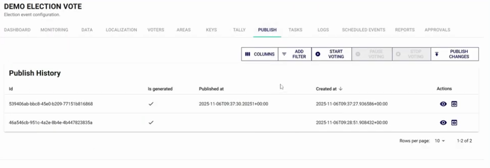
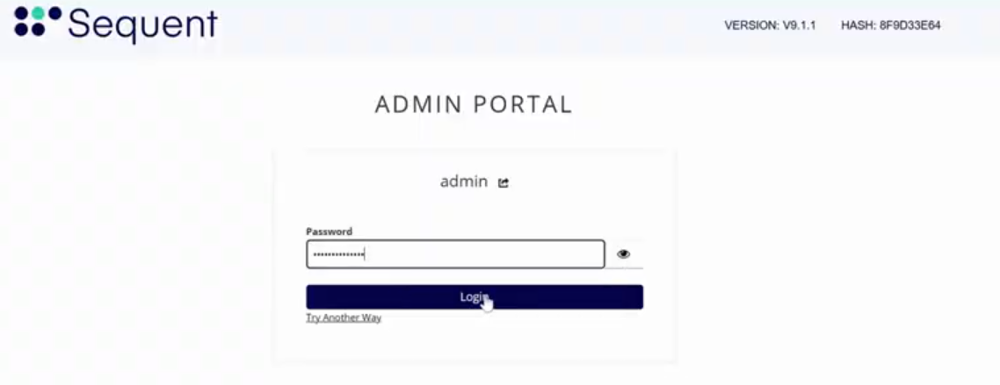
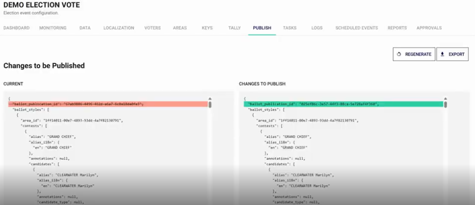
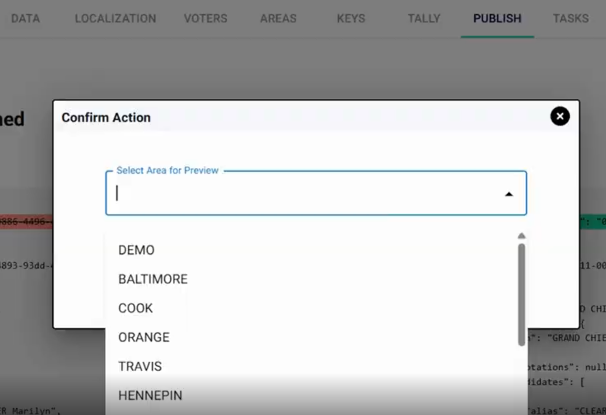

import GoogleVideo from '@site/src/components/GoogleVideo';

<!--
SPDX-FileCopyrightText: 2025 Sequent Tech <legal@sequentech.io>
SPDX-License-Identifier: AGPL-3.0-only
-->

<GoogleVideo id="1RUe2XgKsC36bZiJ8Io1iAVXYn3KDhBht" />

Every time an administrator modifies data at the election event, election, contest, or candidate level, those changes must be published to become visible in the **Voter Portal**. This ensures that the voting interface remains accurate and synchronized with the latest administrative configurations.

The main path is in [Publish and Manage the Voting Period](../03-procedures/05-publish.md).

## Step 1: Open the Publish Tab

1.  Open the election event in the sidebar.
2.  Click the **Publish** tab. Each election also has its own **Publish** tab, for that election only.
3.  The **Publish History** list shows the previous publications. If there is no publication yet, the tab shows "No Publication Yet."

## Step 2: Generate the Publication

1.  Click **Generate Publication**. If a publication exists, click **Publish Changes**.
2.  Click **Confirm**. If you signed in more than 60 seconds ago, the admin portal asks for your password again. See [Sensitive actions](../00-before-you-start.md#sensitive-actions).

3.  Wait for the message "Ballot generated". The **Changes to be Published** page compares the **Current** publication with the **Changes to Publish**.

## Step 3: Preview the Ballot (Optional but Recommended)

1.  On the **Changes to be Published** page, click **Preview**.
2.  In **Select Area for Preview**, select an area, as ballots may vary by area.
3.  Open the preview, or click **Copy link** to share it. The preview shows the ballot of the area in the **Voter Portal**.

## Step 4: Publish the Changes

1.  On the **Changes to be Published** page, click **Publish Changes**. There is no confirmation window.
2.  Wait for the message "Ballot published". The **Publish History** list shows the new publication. Voters see the last publication.

:::tip **When to Publish**
You should perform a publication after:
* Correcting a candidate's name or adding a description.
* Adding or removing a contest from a specific area.
* Updating the overall ballot design or localization strings.
:::
