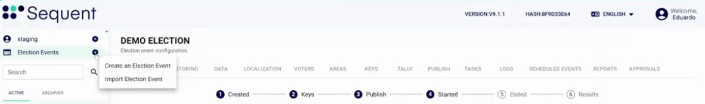
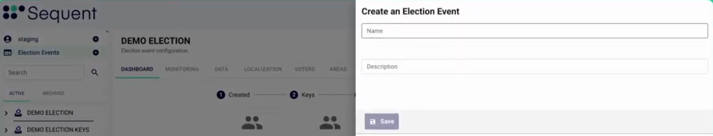
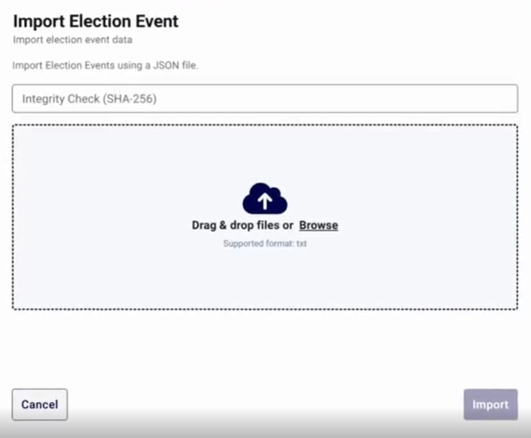
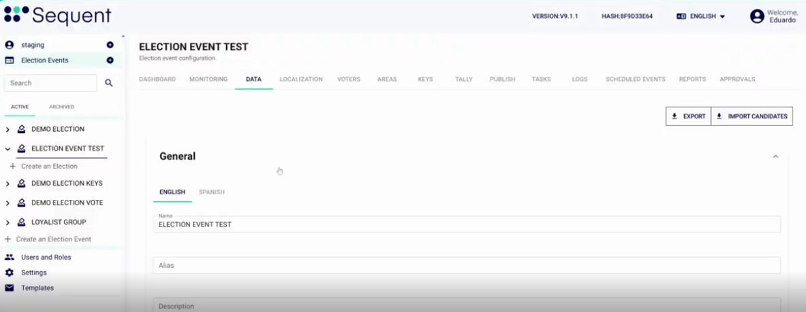
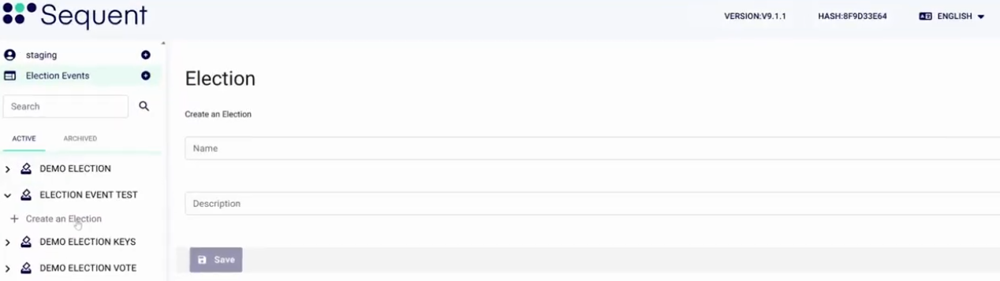
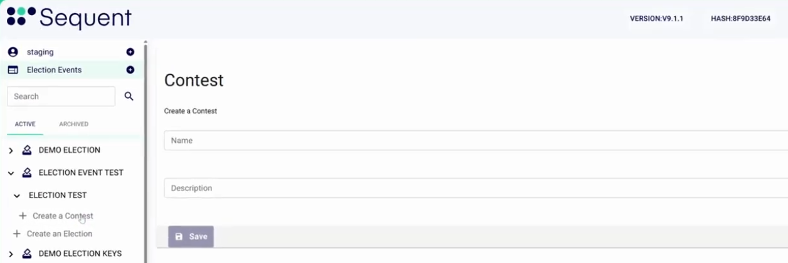
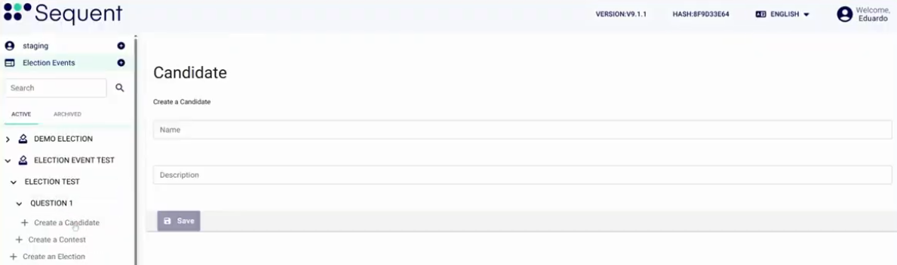
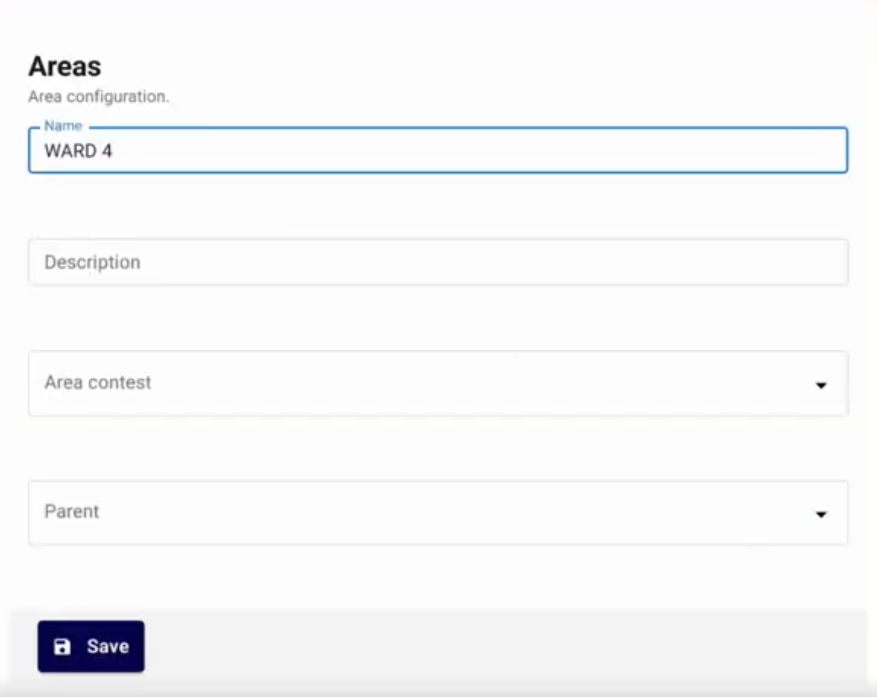
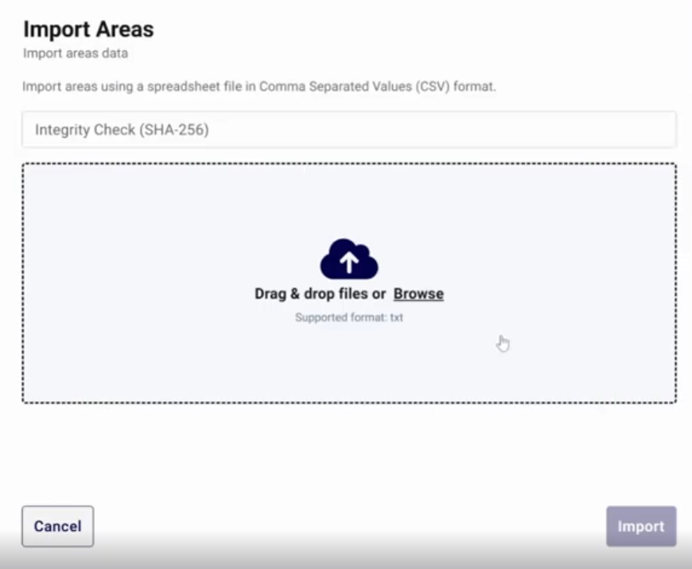

<!--
SPDX-FileCopyrightText: 2026 Sequent Tech Inc <legal@sequentech.io>
SPDX-License-Identifier: AGPL-3.0-only
-->

# Create the Election Event

This procedure creates the election event and its content: the elections, the contests, the
candidates and the areas. The election administrator does this procedure. The voters are in
the next procedure, [Add the Voters](03-voters.md).

## Before you start

- The tenant is ready. See [Set Up the Tenant](01-tenant.md).
- You have the content of the ballot: the elections, the contests and the candidates, in all
  the languages of the election.
- You have the list of areas and the contests of each area.
- If you import an election event: you have the file and its SHA-256 hash.

The order of the steps is important. Create the areas after the contests.

## 1. Create the election event

1. In the menu on the left, click the **+** icon next to **Election Events**.
2. Click **Create an Election Event**.
3. Type the **Name** of the election event.
4. Type the **Description**.
5. Click the save button.

**Expected result:** the message "Election Event created" shows. The admin portal opens the
new election event. The election event shows these tabs. You see only the tabs that your role permits:

| Tab | Use |
| --- | --- |
| **Dashboard** | The numbers of the election event. |
| **Data** | The configuration of the election event. |
| **IVR** | The telephone voting configuration. Only when **Telephone voting** is allowed. |
| **Localization** | The texts of the election event in each language. |
| **Voters** | The voter list. |
| **Areas** | The areas and their contests. |
| **Keys** | The key ceremony. See [Run the Key Ceremony](04-keys.md). |
| **Certificates** | The certificate authorities for voter digital certificates. Only when the election event uses voter certificates. |
| **Tally** | The tally ceremony and the results. See [Run the Tally Ceremony](06-tally.md). |
| **Tally sheet imports** | The import of result files from other voting systems. |
| **Publish** | The publication of the ballot and the voting period. See [Publish and Manage the Voting Period](05-publish.md). |
| **Tasks** | The background tasks, for example imports and exports, with their status. |
| **Logs** | The record of the actions in the election event. |
| **Scheduled Events** | The automatic start and end of the voting period. |
| **Reports** | The reports and their schedule. |
| **Approvals** | The applications of voters who enroll. |

### Import an election event (alternative)

Use this method to make an election event from a file, for example a copy of an earlier
election event.

1. In the menu on the left, click the **+** icon next to **Election Events**.
2. Click **Import Election Event**.
3. Type the hash of the file in **Integrity Check (SHA-256)**.
4. Drop the file in the upload area. The file can be a `.json` file, a `.zip` export or an
   encrypted `.ezip` export.
5. If the file is an `.ezip` file, type the password in **Decryption Password**.
6. Click **Import**.

**Expected result:** the message "Election event imported Successfully" shows.

:::caution CAUTION
If you do not type the hash, the admin portal asks "Import Without Integrity Check?". Click
**Go Back** and type the hash. Without the hash, you cannot know if somebody changed the file.
:::

## 2. Configure the election event

1. Open the election event.
2. Click the **Data** tab.
3. In **General**, type the **Name**, the **Alias** and the **Description** for each language.
4. In **Language**, select the languages of the election event. Select the **Default**
   language.
5. In **Voting Channels Allowed**, turn on the channels of the election event: **Online**,
   **Kiosk**, **Early voting** or **Telephone voting**.
6. In **Ballot Design**, set the logo and the other options of the voting portal.
7. In **Password Policy**, set the password rules for the voters, if voters use a password.
8. In **Advanced Configurations**, make sure that **Lockdown Status** is **Not Locked Down**.
9. In **Advanced Configurations**, set **Keys/Tally Ceremonies Policy**:
   - **Manual Ceremonies**: the trustees take part in the key ceremony and in the tally
     ceremony. This is the default value.
   - **Allow Automatic Ceremonies**: you can make ceremonies without trustee actions.
10. To publish the results on the results website, set **Results Website** to **Enabled**.
    Then set **Results Website Access** and **Results Website Visibility**.
11. Click the save button.

**Expected result:** the admin portal saves the data. The menu shows the new name.

:::note
**Locked Down** hides most tabs of the election event, **Approvals** included, and stops all publications. Use it only
when you must freeze the election event.
:::

:::danger WARNING
In an automatic ceremony, no person keeps a key fragment. The platform can decrypt the votes
without the trustees. Use automatic ceremonies only for tests and for
elections where your rules permit it.
:::

## 3. Create the elections

Do these steps for each election.

1. In the menu on the left, click the arrow next to the election event to show its elections.
2. Under the elections, click **Create an Election**.
3. Type the **Name**.
4. Type the **External ID**. This is the identifier of the election in your other systems.
5. Type the **Description**.
6. Click the save button.
7. Click the **Data** tab of the new election.
8. In **General**, type the name and the description for each language.
9. In **Voting Channels Allowed**, select the voting channels of this election.
10. In **Advanced Configuration**, set **Initialize Report Policy**. Select **Required** if you
    must make an initialization report before the voting period opens.
11. In **Custom filters**, set **Allow Tally**. The table gives the values.
12. Click the save button.

| **Allow Tally** value | Meaning |
| --- | --- |
| **Allowed** | You can start the tally at any time. |
| **Disallowed** | You cannot start the tally. |
| **Requires Voting Period End** | You can start the tally only after all voting channels are closed. |

**Expected result:** the election shows under the election event in the menu. The election has
these tabs: **Dashboard**, **Data**, **Voters**, **Publish**, **Approvals** and **Tally Sheets**.

:::note
You cannot change the **External ID** after you save it.
:::

## 4. Create the contests

Do these steps for each contest.

1. In the menu on the left, click the arrow next to the election to show its contests.
2. Under the contests, click **Create a Contest**.
3. Type the **Name**, the **Description** and the **External ID**.
4. Click the save button.
5. Click the **Data** tab of the new contest.
6. In **Ballot Voting System**, select the counting algorithm:
   - **Plurality at Large**: the voter selects candidates. The candidates with the most votes
     win.
   - **Instant Runoff**: the voter ranks the candidates. Then select the **Tie-Breaking
     Policy**: **Random** or **External Procedure**.
7. In **Ballot Design**, set the number of votes:
   - The minimum number of selections. Type `0` if the voter can leave the contest blank.
   - The maximum number of selections. For **Instant Runoff**, this is the lowest rank that a
     voter can give.
   - The number of winning candidates.
8. In **Policies**, set what the voting portal does when a voter selects too few, too many or
   no candidates. For **Instant Runoff**, also set the policies for duplicated ranks and skipped
   ranks.
9. Click the save button.

**Expected result:** the contest shows under the election in the menu.

:::caution CAUTION
The admin portal does not check that the minimum is lower than the maximum. Check the values
before you save. Make sure that the maximum is not higher than the number of candidates.
:::

## 5. Create the candidates

Do these steps for each candidate.

1. In the menu on the left, click the arrow next to the contest to show its candidates.
2. Under the candidates, click **Create a Candidate**.
3. Type the **Name**, the **Description** and the **External ID**.
4. Click the save button.
5. Click the **Data** tab of the new candidate.
6. In **General**, type the name and the description for each language.
7. In **Image**, add a photo or a logo if necessary.
8. Click the save button.

**Expected result:** the candidate shows under the contest in the menu.

## 6. Create the areas

An area tells which contests its voters see. Each voter belongs to one area.

1. Open the election event.
2. Click the **Areas** tab.
3. Click **Create Area**.
4. Type the **Name** and the **Description**.
5. In **Contests**, type three or more letters of a contest name, then select the contest. Do
   this for each contest of the area.
6. If the area is part of a larger area, select the parent area.
7. If the voters of the area can vote early, turn on **Allow Early Voting**.
8. Click the save button.

**Expected result:** the message "Area created" shows. The area shows in the list.

### Import areas (alternative)

1. On the **Areas** tab, click **Import**.
2. Upload a CSV file without a header row. Each row has six columns in this order:
   identifier, country code, code, area name, delete flag, early voting policy.
3. Use `0` in the delete flag column for each area to import.

:::caution CAUTION
An import links each imported area to **all** the contests of the election event. After the
import, open each area and remove the contests that are not for that area.
:::

## If there is a problem

| Problem | Action |
| --- | --- |
| The **+** icon next to **Election Events** is not there. | Your account does not have the permission to create election events. Ask your tenant administrator. |
| The import shows "Hashes don't match. Integrity check failure." | The file is not the file that you expect. Get the file again from its source. Do not import it without the check. |
| A language is not available in **Language**. | Turn on the language in **Settings** > **LANGUAGES**. See [Set Up the Tenant](01-tenant.md). |
| A contest is not in the list of **Contests** of an area. | Type three or more letters of the contest name. |

## More information

- [Create an election event (with video)](../01-tutorials/02-admin_portal_tutorials_create-election.md)
- [Import an election event](../01-tutorials/04-admin_portal_tutorials_import-elections.md)
- [Archive an election event](../01-tutorials/03-admin_portal_tutorials_archive-elections.md)
- [Create contests and candidates](../01-tutorials/05-admin_portal_tutorials_contests-candidates.md)
- [Define the areas](../01-tutorials/06-admin_portal_tutorials_define-areas.md)
- [Translate the election event](../01-tutorials/09-admin_portal_tutorials_election-localization.md)
- [Election event: Data](../02-reference/02-election-event/03-election_management_election-event_data.md)
- [Election: Data](../02-reference/03-election/03-election_management_election_data.md)
- [Contest: Data](../02-reference/04-contest/01-election_management_contest_data.md)
- [Candidate: Data](../02-reference/05-candidate/01-election_management_candidate_data.md)
- [Areas](../02-reference/02-election-event/06-election_management_election-event_areas.md)

**Next:** [Add the Voters](03-voters.md).
