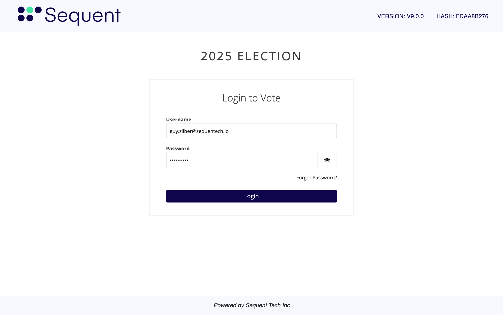
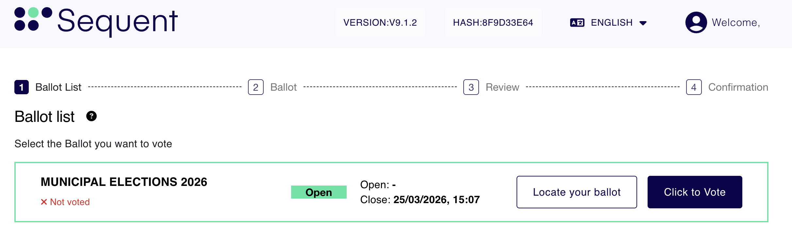
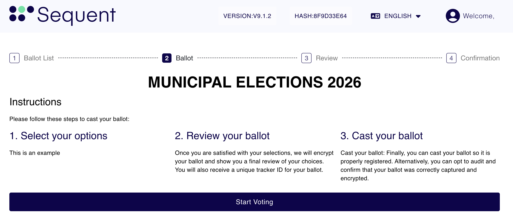
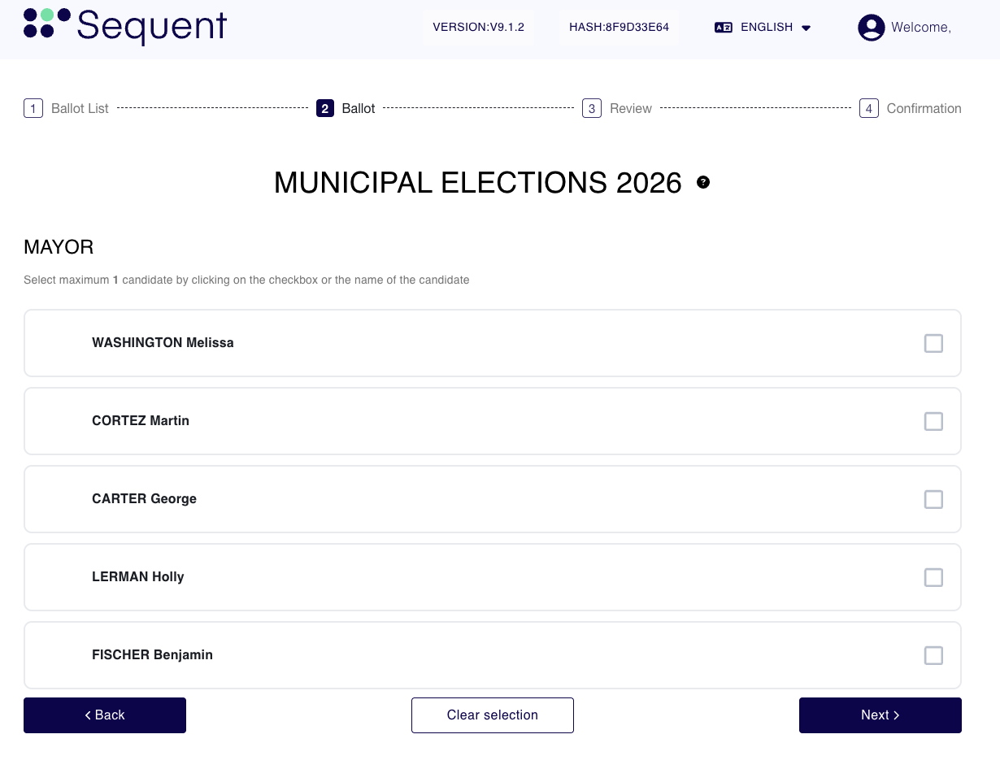
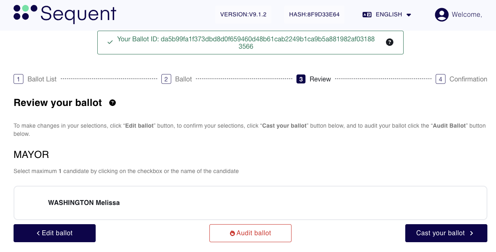

import GoogleVideo from '@site/src/components/GoogleVideo';

<!--
-- SPDX-FileCopyrightText: 2025 Sequent Tech Inc <legal@sequentech.io>
SPDX-License-Identifier: AGPL-3.0-only
-->

<GoogleVideo id="1nLAuC8ho_0QLeX2iuPdGdjb-vpdUvQqm" />

To participate in the election, follow the steps below to authenticate, select your candidates, and securely cast your ballot.

## Step 1: Login to the Voting Portal

1. Enter your login credentials (username and password).
2. Select `Login`.

:::info
**Authentication Method:** The image above shows a standard login, but your specific authentication method may vary. Refer to your specific login instructions for additional information.
:::

## Step 2: Select Your Ballot

From the dashboard, you will see a list of ballots available to you. Note that multiple ballots may appear depending on your eligibility.

1. Locate the ballot you wish to vote on.
2. Select the `Click to Vote` button.

## Step 3: Review Instructions

Before beginning, the system provides simple instructions on how to navigate the digital ballot.

1. Review the provided instructions.
2. Select `Start Voting`.

## Step 4: Mark Your Ballot

This screen is where you choose your candidates and make your selections.

1. Select your preferred candidates.
2. Select `Next` to proceed to the Ballot Review screen or the next available contest.

:::tip
**Optional Actions:**
* `Clear Selection` Select this to remove all currently selected candidates.
* `Back` Select this to return to the ballot selection screen.
:::

## Step 5: Review and Cast Your Vote

This stage allows you to verify your choices before they are permanently recorded.

1. Review your selections one last time.
2. **Note your Ballot ID:** This unique identifier is used for locating or auditing your ballot later.
3. Select `Cast your Ballot`.

:::warning
**Auditing your Ballot:** You may choose to "Audit your Ballot" to ensure selections were correctly encrypted. Please note that **auditing will void the ballot**. Refer to the "Auditing your Ballot" tutorial for more details.
:::

## Step 6: Confirmation and Receipt

Once submitted, the confirmation screen verifies that your vote was successfully cast.

1. **Ballot ID:** A unique ID is displayed to help you track your submission.
2. **QR Code:** When scanned, the QR code takes you directly to the **Ballot Locator** to verify your ballot by ID.
3. Select `Finish` to return to the main election selection screen.

:::tip
**Save Your Receipt:** You can select the `Print` button to download or print a physical copy of your vote receipt.
:::