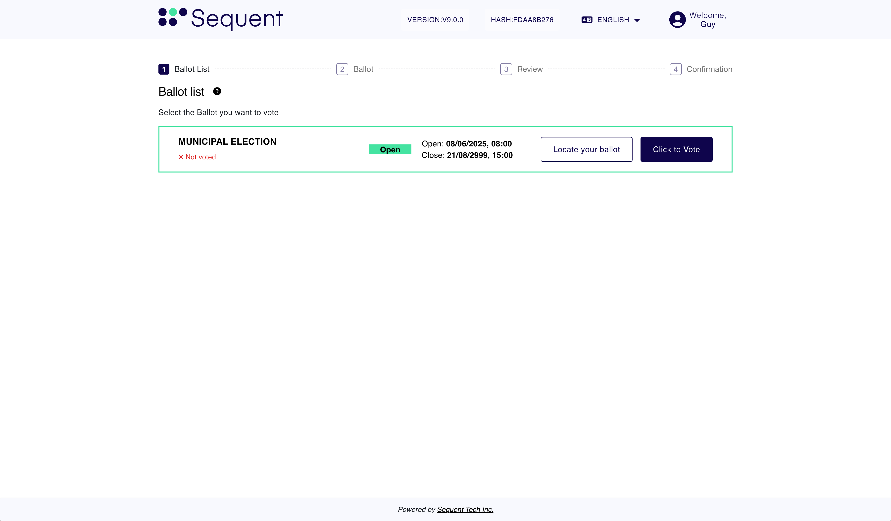
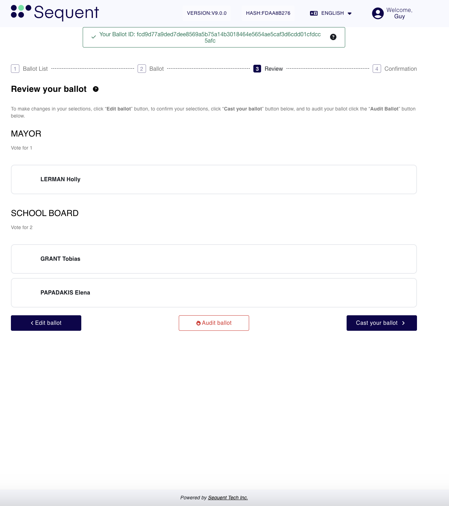
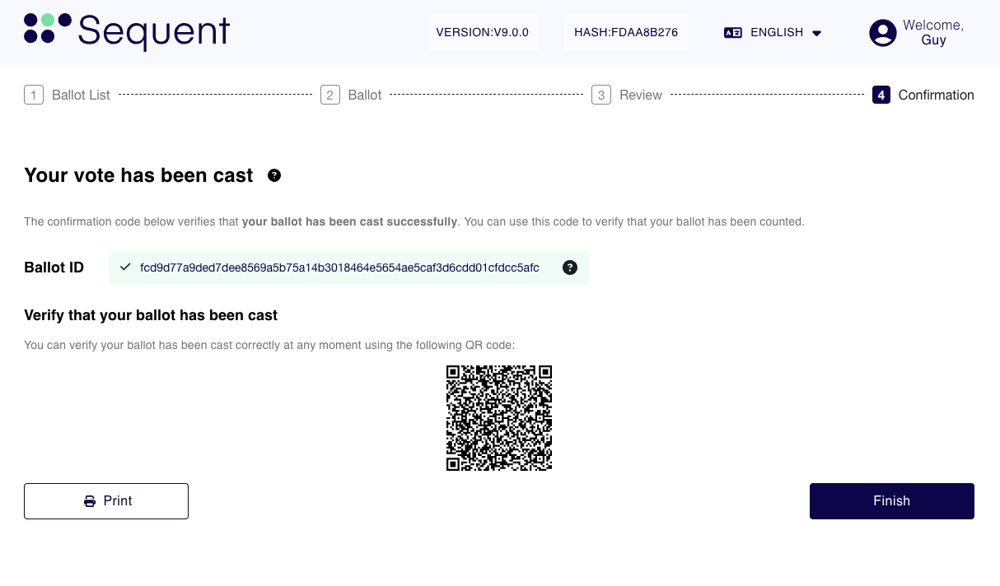

<!--
SPDX-FileCopyrightText: 2025 Sequent Tech <legal@sequentech.io>
SPDX-License-Identifier: AGPL-3.0-only
-->

The image shows a login with a username and password, but your authentication method may be different.

Refer to your specific login instructions for additional information.

1. Enter your login credentials and select Login.

  
  
  

Shows the list of ballots available to you.

2. Select Click to Vote in the ballot you wish to vote on, note that multiple ballots may appear depending on your eligibility.
 
  
  
  

Gives simple instructions on how to vote and navigate the ballot.

3. Review the instructions and select Start Voting

  
  
  

This is where you choose your candidates and make selections.

1. Select your preferred candidates
2. Select Next to proceed to the Ballot Review screen or the next available ballot to mark

**Optional:**
* Select Clear Selection to clear all selected candidates
* Select Back to return to the ballot selection screen

  
  
  

Shows all your selections so you can review them before submitting.

1. Review your selections one last time before casting your vote
2. Note your Ballot ID, used for Locating or Auditing your Ballot
3. Cast your Ballot

**Optional:**
* Go back to Edit your Ballot
* Audit your Ballot, to ensure your selections were correctly encrypted. This will void the ballot (see the Auditing your Ballot section for more information).

  
  
  

Confirms your vote was cast. Shows a unique Ballot ID to help you track it.

* Select Finish to go back to Election selection screen
* When scanned, the QR code takes the voter to the Ballot Locator to verify their ballot by ID.
  
**Optional:**
* Print your vote receipt

