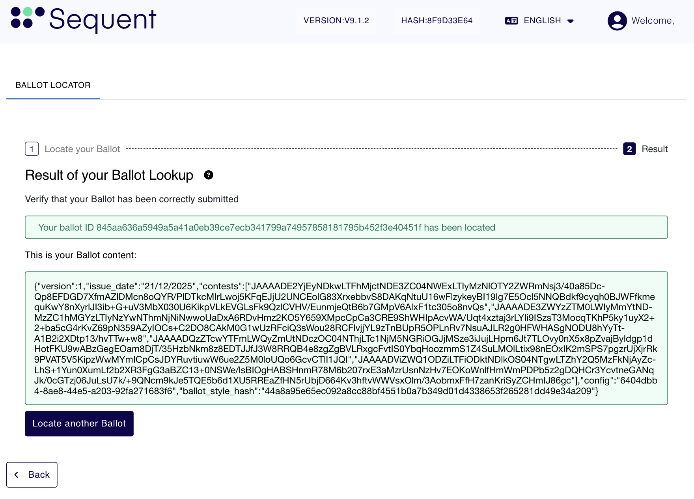
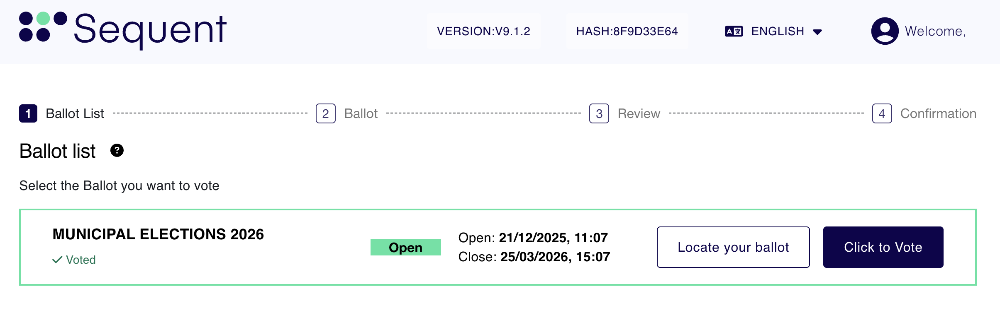
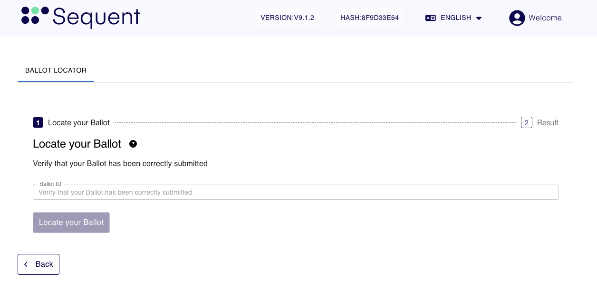

import GoogleVideo from '@site/src/components/GoogleVideo';

<!--
-- SPDX-FileCopyrightText: 2025 Sequent Tech Inc <legal@sequentech.io>
SPDX-License-Identifier: AGPL-3.0-only
-->

<GoogleVideo id="1UawaEBS2MWuXBRAHd1gceEXvn1p19mM_" />

It is possible to verify that your ballot has been correctly submitted.
In the Voting Portal's landing page `/election-chooser` click on the button 
`Locate Your Ballot` to go to `/ballot-locator`.

Once you have finished voting, you can verify that your ballot was successfully recorded in the digital ballot box. There are different ways to access Ballot Locator:

## Option 1: Access from the Confirmation Screen

### Step 1.1: Secure Your Ballot ID

After casting your vote, you will reach the Confirmation Screen:


From this screen, you can directly access the Ballot Locator prefilled to lookup the vote you cast in thre different ways:

<ul type="a" style={{listStyleType: 'upper-alpha'}}>
<li>You can click in the `Ballot ID` appearing highlighted with a green background in the image above.</li>
<li>You can scan with a mobile device the QR Code appearing in the screen.</li>
<li>You can copy the Ballot ID and manually enter it in the Ballot Locator Screen at a later stage. See the explanation for this in Option 2.</li>
</ul>

:::tip
**Alternative:** You can also click in the `Print` button and the same options will be available but originating from the PDF you downloaded instead.
:::

### Step 1.2: Access the Ballot Locator

Once you performed one of the three posible options to access the Ballot Locator explained in the Step before, you will see the following screen:



If the ballot is found, you will see a green confirmation message stating:

```
Your ballot ID [Ballot ID] has been located
```

Below this message, you will see the Ballot Content. This is a JSON-formatted block of data that contains the technical details of your submission, including the timestamp and encrypted contest data, proving your vote is securely in the system.

## Telephone voting ballot locator

When the **Telephone voting** channel is enabled for an election, the IVR reads a short ballot locator after the vote is cast. This locator is the first four hexadecimal characters of the full Ballot ID. Hexadecimal characters can contain the digits `0` through `9` and the letters `a` through `f`.

After logging in to the Voting Portal, enter either the four-character locator provided by the IVR or the full Ballot ID in the Ballot Locator. Short-locator searches are limited to ballots belonging to the authenticated voter in the current election. Enabling telephone voting only at the election-event level is not sufficient; the channel must be enabled for the individual election.

### Collisions

Because a four-character locator is shorter than the full Ballot ID, two or more of the voter's ballots can have the same prefix. If this happens, the Ballot Locator does not select the first, last, or any other matching ballot. It displays an ambiguity message and asks the voter to use the full Ballot ID instead.

:::info
**Ballot Content:** Please note that even though you have access to the content of your ballot, this is encrypted so that it's not possible to obtain the intention of the vote from the Ballot Content. This is a security measure intended to maintain the secrecy of the vote and preventing anyone to prove how they voted.
:::

## Option 2: Lookup the vote using a saved Ballot ID

As explained earlier in [step 1.1](#step-11-secure-your-ballot-id), after casting the vote you can simply save the Ballot ID by copying it and saving it somewhere save. With this, you can then follow the steps below to look it up and ensure that the vote is found using the Ballot Locator.

:::info
**Prerequisites:** The steps below assume you have already logged in as a voter.
:::

### Step 2.1 : Access the Ballot Locator

After logging in as a voter, you will see the Ballot List as depicted below:



Then follow the steps below:

1. Navigate back to your Ballot List (the main election dashboard).

2. Find the relevant election for your ballot.

3. Click the white `Locate your Ballot` button.

### Step 2.2: Search for Your Ballot


Once you are on the Ballot Locator page:

1. Enter your `Ballot ID`

2. Paste the ID you saved from Step 1 into the search field.

3. Submit: Click the button to search the records.

### Step 2.3: Review the Results


If the ballot is found, at the top of the screen you will see a green confirmation message stating:

**"Your ballot ID [ID Number] has been located."**

Below this message, you will see the Ballot Content. This is a JSON-formatted block of data that contains the technical details of your submission, including the timestamp and encrypted contest data, proving your vote is securely in the system.
