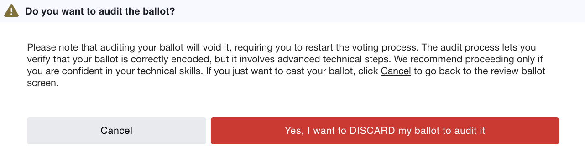
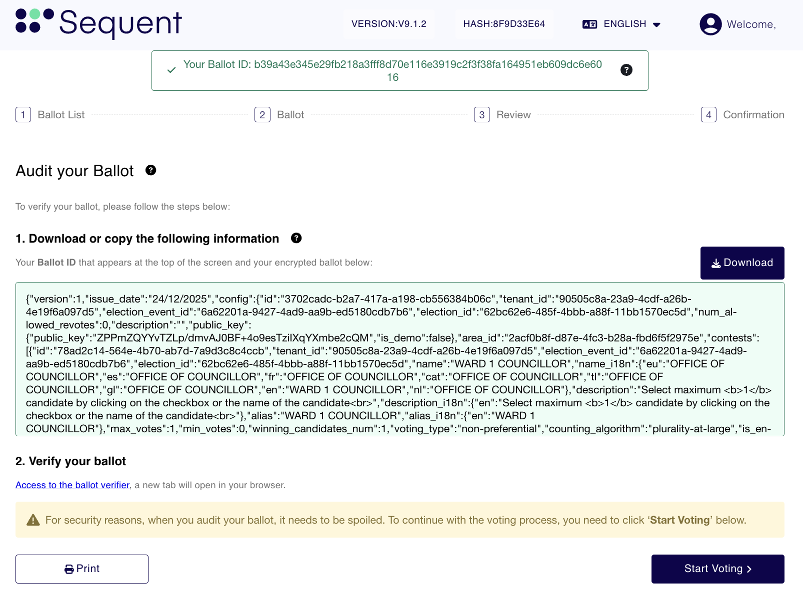
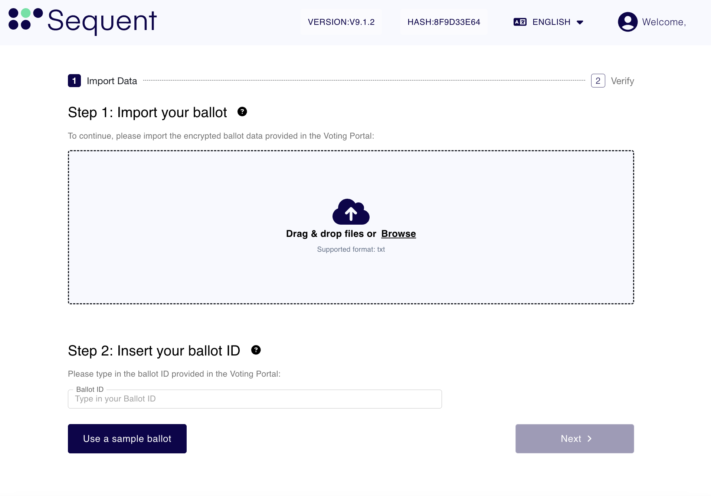
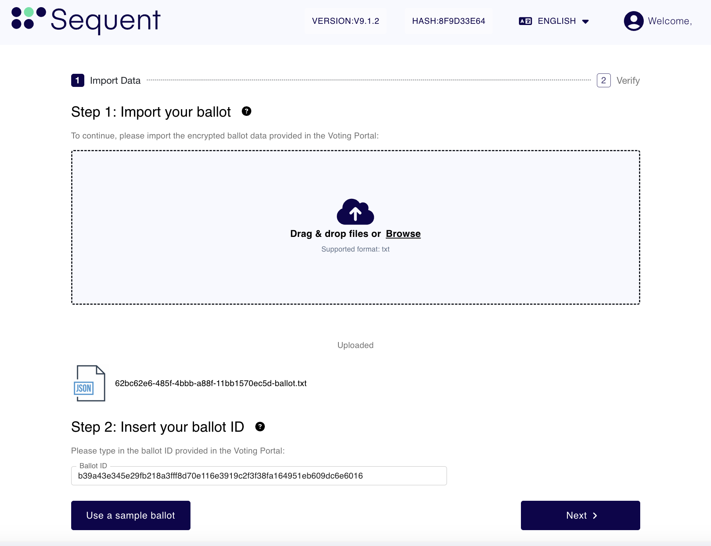

import GoogleVideo from '@site/src/components/GoogleVideo';

<!--
-- SPDX-FileCopyrightText: 2025 Sequent Tech Inc <legal@sequentech.io>
SPDX-License-Identifier: AGPL-3.0-only
-->

<GoogleVideo id="1lh_8MiMxbyFmLkrk-zYCJbYNHh5otryL" />

The audit process allows you to verify that your ballot was correctly encrypted and that your selections match your intent. This process involves "spoiling" the ballot to prove its integrity, which is intended for users with technical confidence.

## Step 1: Initiate the Audit
From the Ballot Review screen, before the final step before casting your vote, you have the option to audit your selections.

### Step 1.1 Note the `Ballot ID` 
Appearing highlighted with a green background in the image above.

### Step 1.2 Begin the Audit
Select the `Audit your Ballot` button.

A warning modal will appear. 

### Step 1.3 Review the information carefully:

**Auditing your ballot will void it**, requiring you to restart the voting process from the beginning.

This process lets you verify that your ballot is correctly encoded by your device and that your selects are encoded as you intended.

### Step 1.4 Confirm the Dialog
Select `Yes, I want to DISCARD my ballot to audit it` to proceed.

## Step 2: Download Audit Data
Once you confirm the audit, the system generates the technical data required for verification.

### Step 2.1 Download Encrypted Data:
Click the `Download` button to save the JSON-formatted ballot data to your device.

### Step 2.2 Open Verifier: 
Click the link `Access to the ballot verifier` to open the audit tool in a new browser tab.

:::warning After downloading your data, you must click `Start Voting` at the bottom of the screen if you wish to return to the election and cast a non-voided ballot.
:::

## Step 3: Import Data to the Verifier
In the new Ballot Verifier tab, you must provide the information you just saved.

### Step 3.1 Import your ballot: 
Drag and drop the file you downloaded into the upload area, or click Browse to select it.

### Step 3.2 Insert your ballot ID: 
Type or paste the `Ballot ID` you noted in the previous step into the input field. 

Once the file is uploaded and the ID is correctly entered (see image below), click `Next`.

## Step 4: Review Audit Results
The Verifier decodes the encrypted file and displays the contents for your inspection.

### Step 4.1 Verify Ballot ID: 
Ensure the Decoded Ballot ID matches the the Ballot ID you provided.

### Step 4.2 Review Selections: 
The system displays the decoded candidates for each contest.

Contests decided by acclamation are also shown so this screen matches the
Voting Portal review. Because an acclaimed contest is not encoded in the
ballot, it has no decoded selection. The verifier obtains it from the ballot
configuration and displays its acclamation notice and all available candidates
as disabled options. This is display-only and does not change the decoded
ballot or the Ballot ID verification.

### Step 4.3 Confirm Intent: 
Ensure these selections match the choices you made in the Voting Portal.
