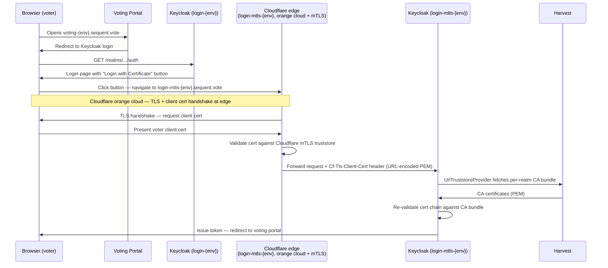
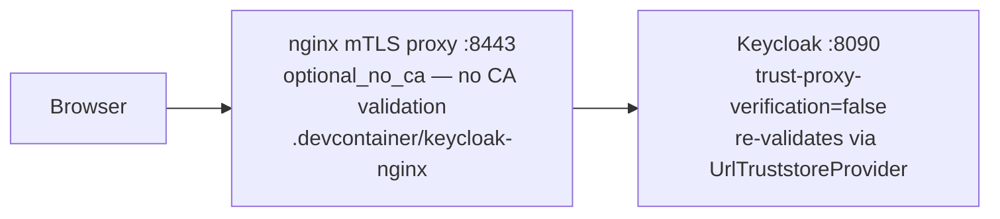
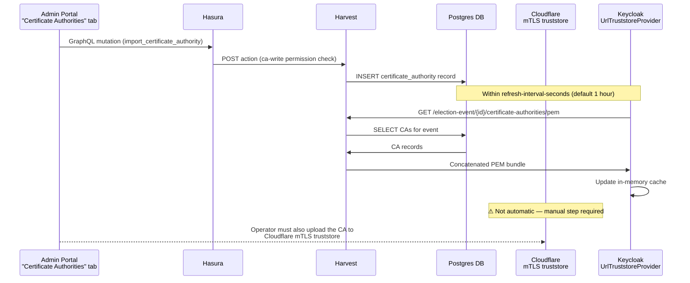

<!--
SPDX-FileCopyrightText: 2025 Sequent Tech Inc <legal@sequentech.io>

SPDX-License-Identifier: AGPL-3.0-only
-->

# X.509 Client Certificate Authentication — Architecture

## Overview

This document describes the architecture for mTLS X.509 client certificate
authentication for voters in the Sequent voting platform. The central design
goal is **fully dynamic certificate management**: a tech admin can add or remove
trusted CA certificates through the admin portal UI without touching gitops or
restarting any service.

CA certificates are stored per election event in the database (Postgres, via
Hasura/Harvest). The `UrlTruststoreProvider` Keycloak SPI fetches them at
session time and caches them in memory.

**See also:** [X.509 Dev Tutorial](../10-tutorials/07-x509-voter-certificate-authentication.md) — dev environment setup, testing, and troubleshooting.

---

## Dev vs Production at a Glance

| | Dev (Codespaces) | Production |
|---|---|---|
| TLS termination | Dedicated nginx container (`.devcontainer/keycloak-nginx/`) | Cloudflare edge (orange cloud, mTLS enabled) |
| Client cert forwarded to Keycloak via | `ssl-client-cert` header | `Cf-Tls-Client-Cert` header |
| CA validation at the proxy layer | None — `optional_no_ca`, nginx passes cert raw | Cloudflare validates against its own mTLS truststore |
| Keycloak `trust-proxy-verification` | `false` — Keycloak always re-validates independently | `false` — Keycloak always re-validates independently |
| When Keycloak truststore (DB) changes | Picked up automatically within refresh cycle | Picked up automatically within refresh cycle |
| When Cloudflare truststore changes | Not applicable | Manual update in Cloudflare dashboard required |

---

## End-to-End Authentication Flow

### Production (Cloudflare mTLS)

The `login-mtls-{env}.sequent.vote` subdomain is set to Cloudflare **orange
cloud** with mTLS enabled. Cloudflare terminates the TLS connection (including
the client certificate handshake), validates the cert against its own mTLS
truststore, and forwards the certificate to Keycloak via the
`Cf-Tls-Client-Cert` header.



Keycloak always re-validates the cert independently via `UrlTruststoreProvider`
(`KC_SPI_X509CERT_LOOKUP_NGINX_TRUST_PROXY_VERIFICATION=false`), regardless of
Cloudflare's result. The Keycloak layer is authoritative.

### Dev environment (Codespaces)

In Codespaces there is no Cloudflare. A dedicated nginx container replicates the
mTLS path: it terminates TLS, optionally requests a client certificate
(`ssl_verify_client optional_no_ca`), and forwards it raw to Keycloak. nginx
does **not** validate the cert against any CA — that is left entirely to
Keycloak via `UrlTruststoreProvider`, matching production behaviour.



The nginx config (`.devcontainer/keycloak-nginx/keycloak-mtls.conf.template`) is
specific to Codespaces and is **not deployed to production**.

---

## Infrastructure Components

### Cloudflare mTLS (production)

The `login-mtls-{env}.sequent.vote` subdomain uses Cloudflare **orange cloud**
with mTLS. Cloudflare:

1. Requests a client certificate during the TLS handshake.
2. Validates the cert against the **Cloudflare mTLS truststore** (configured in
   the Cloudflare dashboard under Access → Service Auth → mTLS).
3. Forwards the cert to the origin as the `Cf-Tls-Client-Cert` header
   (URL-encoded PEM).

> **Operational requirement — Cloudflare truststore sync:**
> The Cloudflare mTLS truststore only contains CAs that have been explicitly
> uploaded there. When a tech admin adds or removes a CA via the admin portal,
> the **Cloudflare mTLS truststore must also be updated manually** — otherwise
> Cloudflare will reject voter certs signed by that CA before they ever reach
> Keycloak.
>
> The Keycloak layer (`UrlTruststoreProvider`) is kept in sync automatically
> through its refresh cycle. The Cloudflare layer requires a separate manual
> gitops / dashboard update.

### Keycloak startup flags — production

```yaml
# Dynamic per-realm CA bundle fetched from Harvest
KC_SPI_TRUSTSTORE_PROVIDER: url
KC_SPI_TRUSTSTORE_URL_REFRESH_INTERVAL_SECONDS: "3600"

# "nginx" provider reads the client cert from a configurable HTTP header.
# The name "nginx" is historical — it works for any reverse proxy.
KC_SPI_X509CERT_LOOKUP_PROVIDER: nginx

# Header set by Cloudflare when forwarding the client certificate
KC_SPI_X509CERT_LOOKUP_NGINX_SSL_CLIENT_CERT: Cf-Tls-Client-Cert

# Keycloak always re-validates the cert chain independently using
# UrlTruststoreProvider. Never trust the proxy's verification result.
KC_SPI_X509CERT_LOOKUP_NGINX_TRUST_PROXY_VERIFICATION: "false"

HARVEST_DOMAIN: "harvest:8400"
```

### nginx mTLS proxy (dev only)

The `.devcontainer/keycloak-nginx/` container is for Codespaces only. It uses
`ssl_verify_client optional_no_ca`, which means:

- The client cert is **never forced** — voters without a cert fall through to
  password auth in Keycloak as normal.
- If a cert is presented, nginx forwards it raw without CA validation.
- No CA bundle is needed in the nginx image.

Keycloak is configured with `trust-proxy-verification=false` in dev, so it
re-validates every cert itself via `UrlTruststoreProvider` — the same path as
production.

### UrlTruststoreProvider (Dynamic CA Bundle)

`UrlTruststoreProvider` (`packages/keycloak-extensions/url-truststore-provider/`)
is a custom Keycloak SPI that replaces Keycloak's built-in `file` truststore
provider. It fetches CA certificates per election event realm from Harvest.

**Per-realm URL:** If the realm name contains `-event-` (format:
`tenant-{UUID}-event-{UUID}`), the provider extracts the election event ID and
fetches:

```
http://<HARVEST_DOMAIN>/election-event/<eventId>/certificate-authorities/pem
```

Results are cached in-memory keyed by realm ID. If the Harvest fetch fails,
Keycloak logs a warning and falls back to the JVM default truststore.

### Harvest CA Bundle Storage

CA certificates are stored in Postgres in the `sequent_backend_certificate_authority`
table, scoped per election event. Harvest exposes:

- `GET /election-event/{id}/certificate-authorities/pem` — concatenated PEM
  bundle (used by `UrlTruststoreProvider`)
- GraphQL actions via Hasura (`import_certificate_authority`,
  `delete_certificate_authority`) for the admin portal

Permissions: `ca-read` (view) and `ca-write` (add/remove), scoped by
`election_event_id`. `election-event-cas-tab` to allow showing the CAs import tab.

When the admin portal updates the CA list, Keycloak picks up the change within
the next refresh cycle (default: 1 hour) without restart. **The Cloudflare
truststore is not updated automatically.**

### "Login with Certificate" Identity Provider

Certificate-based login is exposed through a Keycloak Identity Provider (IDP)
that brokers back to the **same realm** over an mTLS-terminating endpoint. The
IDP acts as a self-referential OIDC broker: the authorization URL points to the
same realm but via a different network path (port 8443 in dev) that sits behind
nginx configured for mutual-TLS client certificate extraction.

In the dev container, port 8443 is handled by nginx, which terminates the client
certificate and forwards it to Keycloak. In production the equivalent endpoint is
the mTLS-enabled ingress for that environment.

The IDP alias **must remain `digital-certificates`** — this value is hardcoded in
three places and must stay in sync:

- **Keycloak realm import** — `alias` field in the IDP entry of the realm JSON
  (e.g. `.devcontainer/keycloak/import/tenant-*-event-*.json`)
- **Theme template** — `social-providers.ftl` (shared by `register.ftl` and both
  portals' `login.ftl`) filters the IDP out of the social-providers list when
  `voter-certificate-policy` is not `enabled`:
  ```
  p.alias != 'digital-certificates'
  ```
- **Rust constant** — `sequent_core::types::keycloak::CERTIFICATES_IDP_ALIAS`
  (`packages/sequent-core/src/types/keycloak.rs`)

The Sequent Keycloak themes render the `digital-certificates` IDP as a
social-provider button only when the realm attribute `voter-certificate-policy`
is set to `enabled`. All other IDPs are always shown. The rule lives in the
shared `social-providers.ftl` macro, so it applies identically on both portals'
login pages and on the registration page in login mode.

### X509CertClassifierAuthenticator

`X509CertClassifierAuthenticator` (`packages/keycloak-extensions/conditional-authenticators/`)
runs first in the X.509 authentication flow. It reads the client certificate
from the configured HTTP header (default: `ssl-client-cert`, URL-encoded PEM),
parses it, and writes one of two auth notes depending on the outcome:

**Happy path — certificate present and parseable:**

| Auth note | Value |
|-----------|-------|
| `cert-type` | Issuer CN extracted from the certificate (e.g. `AC FNMT Usuarios`). Falls back to `none` if the CN cannot be extracted. |

**Error path — certificate absent or unparseable:**

| Auth note | Value |
|-----------|-------|
| `deny-type` | `cert-not-provided` |

The `deny-type` / `cert-not-provided` constants are shared with
`message-otp-authenticator` (`Utils.java`), which defines the full set of deny
codes used across authenticators:

| Constant | Value | Meaning |
|----------|-------|---------|
| `AUTH_NOTE_DENY_TYPE` | `deny-type` | Auth note key written on denial |
| `CERT_NOT_PROVIDED` | `cert-not-provided` | No certificate header, or certificate could not be parsed |
| `USER_NOT_FOUND` | `user-not-found` | Certificate valid but no matching user in the realm |
| `ACCESS_DENIED` | `access-denied` | User found but not authorized |

Downstream conditional sub-flows use `ConditionalAuthNoteAuthenticator` to check
`cert-type` and route to the correct `X509/Validate Username Form` execution for
each CA issuer, enabling multiple certificate types in the same realm.

The authenticators are always configured with `trust-proxy-verification=false`
in both dev and production — Keycloak always re-validates the cert chain
independently via `UrlTruststoreProvider`.

---

## Multi-Tenancy Design

Each election event has its own Keycloak realm (`tenant-{UUID}-event-{UUID}`).
`UrlTruststoreProvider` fetches only the CAs for that event's realm, providing
full isolation:

- Adding a CA for election event A only affects voters in event A.
- Removing a CA from event A does not affect event B.

---

## Dynamic Certificate Management Flow



No Windmill/RabbitMQ task, no Keycloak restart, and no gitops PR are needed for
the Keycloak layer. **A manual Cloudflare mTLS truststore update is required
whenever CAs are added or removed.**
