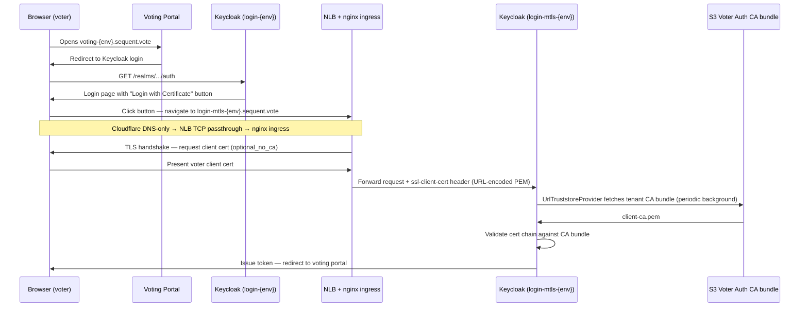
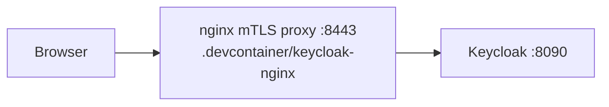
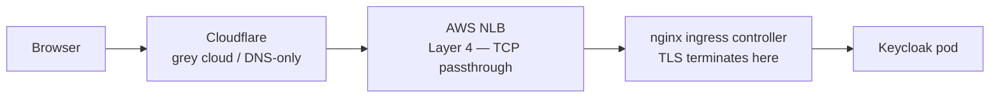
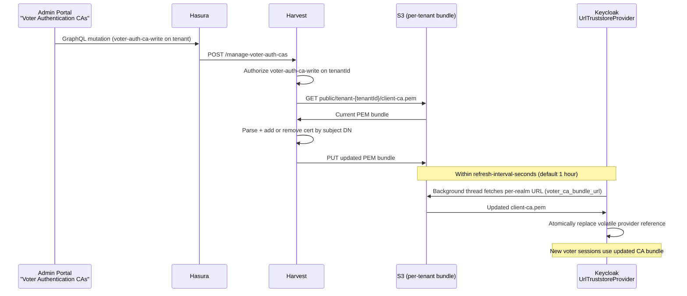

<!--
SPDX-FileCopyrightText: 2025 Sequent Tech Inc <legal@sequentech.io>

SPDX-License-Identifier: AGPL-3.0-only
-->

# X.509 Client Certificate Authentication — Architecture

## Overview

This document describes the architecture for mTLS x509 client certificate
authentication for voters in the Sequent voting platform. The central design
goal is **fully dynamic certificate management**: a tech admin can add or remove
trusted CA certificates through the admin portal UI without touching Cloudflare,
gitops, or restarting any service.

The infrastructure for the mTLS subdomain is configured once per environment
(via gitops), after which cert management is entirely self-service through the
admin portal and the Keycloak realm configuration UI.

This is a multi-tenant system. Certificate trust must be isolated per tenant —
a tenant admin can only manage authentication CAs that affect their own voters.
See the [Multi-Tenancy Design](#multi-tenancy-design) section for details.

**See also:** [X.509 Dev Tutorial](../10-tutorials/07-x509-voter-certificate-authentication) — dev environment setup, testing, and troubleshooting.

---

## End-to-End Authentication Flow

The flow involves two Keycloak subdomains pointing at the same Keycloak backend:

| Subdomain | Purpose | Cloudflare mode | TLS terminates at |
|---|---|---|---|
| `login-{env}.sequent.vote` | Standard login (password) | Orange cloud (proxied) | Cloudflare edge |
| `login-mtls-{env}.sequent.vote` | mTLS certificate login | Grey cloud (DNS-only) | nginx ingress controller inside cluster |

### Production flow



### Dev environment (codespaces)

In codespaces there is no Cloudflare and no nginx ingress controller. The dev
environment replicates the production mTLS path using a dedicated nginx proxy
container (`.devcontainer/keycloak-nginx/`), which runs alongside Keycloak and
performs the same function the nginx ingress controller performs in production.



The dev nginx config (`.devcontainer/keycloak-nginx/keycloak-mtls.conf`) is
specific to codespaces and is **not deployed to production**.

---

## Infrastructure Components

### Why the mTLS subdomain uses Cloudflare grey cloud (DNS-only)

The production networking path is:



The AWS NLB is a Layer 4 (TCP) load balancer — it passes raw TCP connections
through to the nginx ingress controller without inspecting or terminating TLS.

Cloudflare orange cloud (proxied) terminates TLS at the Cloudflare edge, then
establishes a new TLS connection towards the NLB. The browser's client
certificate is exchanged with Cloudflare, not with the nginx ingress controller
— so nginx never sees it.

By setting the mTLS subdomain to **Cloudflare grey cloud (DNS-only)**, the
browser's TLS connection reaches the nginx ingress controller intact, including
the client certificate. This is the approach that works with the existing nginx
x509cert lookup SPI in Keycloak.

This is a **one-time gitops configuration**. Cloudflare is not involved in
client certificate handling and never needs to be changed when voter
authentication CAs are updated.

### nginx ingress controller (production mTLS)

The existing per-environment nginx ingress controller handles mTLS for the
`login-mtls-{env}.sequent.vote` hostname via a dedicated Ingress resource. No
separate nginx proxy pod is deployed in production.

The Ingress for the mTLS subdomain uses these annotations:

```yaml
nginx.ingress.kubernetes.io/auth-tls-verify-client: "optional_no_ca"
nginx.ingress.kubernetes.io/auth-tls-pass-certificate-to-upstream: "true"
nginx.ingress.kubernetes.io/proxy-buffer-size: "128k"
```

- `optional_no_ca` — nginx requests a client cert from the browser but does not
  validate it against any CA. No CA certificate file is needed in nginx. The
  nginx config is entirely static.
- `auth-tls-pass-certificate-to-upstream: true` — nginx passes the raw client
  cert in the `ssl-client-cert` header (URL-encoded PEM) to the upstream
  Keycloak service. This is the exact header format the existing nginx x509cert
  lookup SPI reads.
- The proxy buffer annotation is already present on the existing Keycloak
  ingress and handles the ~2 KB URL-encoded cert in headers.

All CA validation happens in Keycloak, not in nginx. When authentication CAs
change, nginx is unaffected.

### Server TLS certificate for the mTLS subdomain

The `login-mtls-{env}.sequent.vote` subdomain is served using the same
`{env}-tls` Let's Encrypt certificate that covers all other environment
subdomains (`login-{env}`, `admin-{env}`, `voting-{env}`, etc.).

This is automatic: the `client-setup` chart's `certificate.yaml` template
builds the Certificate CRD `dnsNames` from the union of all `nlb.externalDNS.domains`
and `alb.externalDNS.domains` listed in `setup/values.yaml`. Adding the mTLS
subdomain to `nlb.externalDNS.domains` in gitops causes cert-manager to reissue
the certificate with the new SAN included. cert-manager uses the DNS-01
Cloudflare challenge, which works for grey-cloud domains because it uses the
Cloudflare API, not HTTP reachability.

The nginx ingress references this secret:

```yaml
tls:
  - secretName: {env}-tls
    hosts: [login-mtls-{env}.sequent.vote]
```

**Dev environment:** The `.devcontainer/keycloak-nginx/` nginx proxy uses a
self-signed certificate (`nginx-tls.crt` / `nginx-tls.key` in
`.devcontainer/certs/`). This cert is specific to the codespaces environment
(`127.0.0.1`) and has no relation to the production Let's Encrypt cert.

### UrlTruststoreProvider (Dynamic CA Bundle)

`UrlTruststoreProvider` (`packages/keycloak-extensions/url-truststore-provider/`)
is a custom Keycloak SPI that loads trusted CA certificates from a URL and
refreshes them in the background.

For multi-tenant isolation, the provider must be **realm-aware**: it reads the
CA bundle URL from the Keycloak realm attribute `voter_ca_bundle_url` (set per
realm by Windmill during election event realm creation), rather than from a
global instance-level env var. If the realm attribute is not set, it falls back
to the env-var URL (used in dev).

Keycloak startup arguments (added to the environment's `keycloakx/values.yaml`
in gitops):

```yaml
KC_SPI_TRUSTSTORE_PROVIDER: url
# Fallback URL for dev/bootstrap; production realms override via voter_ca_bundle_url
KC_SPI_TRUSTSTORE_URL_URL: ""
KC_SPI_TRUSTSTORE_URL_REFRESH_INTERVAL_SECONDS: "3600"
KC_SPI_X509CERT_LOOKUP_PROVIDER: nginx
KC_SPI_X509CERT_LOOKUP_NGINX_SSL_CLIENT_CERT: ssl-client-cert
KC_SPI_X509CERT_LOOKUP_NGINX_TRUST_PROXY_VERIFICATION: "false"
```

Key implementation details:

- `KC_SPI_X509CERT_LOOKUP_NGINX_TRUST_PROXY_VERIFICATION: false` — Keycloak
  ignores nginx's `ssl-client-verify` header and re-validates the raw cert
  itself using its loaded CA bundle. This is what makes the system dynamic:
  Keycloak owns the validation logic, not nginx.
- The `provider` field in `UrlTruststoreProviderFactory` is `volatile` — the
  background refresh thread atomically replaces the in-memory truststore.
- Each Keycloak session gets the current provider via `create(KeycloakSession)`
  — after a refresh, new sessions immediately use the updated CA bundle.
- If the S3 fetch fails during a refresh, Keycloak logs an error and retains
  the previous CA bundle (no disruption to running elections).

### S3 Authentication CA Bundle

CA certificates are stored per tenant in the per-environment S3 bucket:

```
s3://sequent-{client}-bucket-{region}-{account}/public/tenant-{tenantId}/client-ca.pem
```

The public URL (used in `voter_ca_bundle_url` realm attribute):

```
https://sequent-{client}-bucket-{region}-{account}.s3.amazonaws.com/public/tenant-{tenantId}/client-ca.pem
```

- The bucket already has a public-read policy for the `public/*` prefix — no
  authentication required for Keycloak to fetch the URL.
- PEM format; multiple certs are concatenated in a single file.
- `UrlTruststoreProvider` fetches the realm's URL on session creation and then
  every `refresh-interval-seconds` in the background.
- When the admin portal updates this file, Keycloak picks up the change within
  the next refresh cycle (default: 1 hour).

**External government-issued CAs are fully supported.** The bundle is simply a
list of trusted root and intermediate CAs — it does not matter whether they were
issued internally or by a national PKI. For example, to trust Spanish DNI-e or
FNMT certificates, add the corresponding public root and intermediate CA certs
(downloadable from the FNMT website) to the bundle via the admin portal. No code
or infrastructure change is needed.

### "Login with Certificate" Button in the Keycloak Login Page

The voting portal uses the `sequent.voting-portal` Keycloak theme. A
`login.ftl` exists in `sequent.voting-portal/login/`, overriding the parent
theme's template. In Keycloak's FTL theme system, a file in a child theme
completely replaces the parent's file of the same name (no partial override).
The `login.ftl` is based on the parent's template with one addition: a "Login
with Certificate" button rendered when `mtlsLoginUrl` is configured.

#### How the button works

The button does **not** start a new OIDC authorization request. Instead, it
restarts the current Keycloak auth session from step 1 via the mTLS proxy.
This is critical because the voting portal uses keycloak.js with **PKCE
(S256)**: when keycloak.js calls `keycloak.login()`, it generates a
`code_verifier` / `code_challenge` pair and stores them in session storage.
Starting an independent new auth request from the FTL template would bypass
this PKCE state, causing the token exchange to fail when the code returns.

By using `login-actions/restart`, the existing auth session (including the
PKCE challenge, `state`, and `redirect_uri` that keycloak.js stored) is
preserved. The flow restarts from step 1 through the mTLS proxy, the X.509
authenticator sees the forwarded client certificate and authenticates the voter,
and the code is issued for the same session that keycloak.js is expecting.

```freemarker
<#-- Added to the socialProviders section, after any existing social buttons -->
<#if properties.mtlsLoginUrl?has_content>
    <hr/>
    <#assign sessionCode = url.loginAction?keep_after('session_code=')?keep_before('&')>
    <#assign tabId = url.loginAction?keep_after('tab_id=')>
    <#if tabId?contains('&')><#assign tabId = tabId?keep_before('&')></#if>
    <a id="kc-cert-login"
       class="${properties.kcButtonClass!} ${properties.kcButtonDefaultClass!} ${properties.kcButtonBlockClass!} ${properties.kcButtonLargeClass!}"
       href="${properties.mtlsLoginUrl}/realms/${realm.name}/login-actions/restart?session_code=${sessionCode}&client_id=${client.clientId}&tab_id=${tabId}">
        ${msg("loginWithCertificate")}
    </a>
</#if>
```

The `mtlsLoginUrl` theme property is set from the `KC_MTLS_LOGIN_URL`
environment variable in `theme.properties`:

```properties
mtlsLoginUrl=${env.KC_MTLS_LOGIN_URL}
```

`KC_MTLS_LOGIN_URL` holds the base URL of the mTLS proxy endpoint
(e.g. `https://login-mtls-{env}.sequent.vote` in production,
`https://127.0.0.1:8443` in dev). When unset or empty, the button is not
rendered — existing realms without cert auth continue to work identically.

#### X.509 authenticator user mapping

The X.509 authenticator is configured to map the certificate's CN to a voter
via a custom user attribute:

- **User Identity Source**: `Subject's Common Name` — extracts the CN from the
  cert's Subject DN
- **User Mapping Method**: `Custom Attribute Mapper`
- **Custom Attribute Name**: `usercertificate` — the voter's Keycloak user must
  have this attribute set to a value matching the cert CN

The `usercertificate` attribute must be added to the realm's **User Profile**
(Realm Settings → User Profile → Add attribute) before the authenticator can
use it. This approach decouples the voter's Keycloak username/email from their
certificate identity.

---

## Multi-Tenancy Design

Sequent is a multi-tenant platform. A single environment can serve multiple
tenants, each with their own election events. Authentication CA trust must be
isolated per tenant:

- A Tenant A admin managing voter authentication CAs must only affect Tenant A's voters.
- Adding or removing an authentication CA for Tenant A must not change what
  Keycloak trusts for Tenant B.

### How isolation is achieved

**Per-tenant S3 path:** Each tenant has its own CA bundle at
`public/tenant-{tenantId}/client-ca.pem`. The Harvest endpoint uses the
`tenantId` from the authenticated request to determine which path to read/write.
Tenant-scoped permissions (`voter-auth-ca-read` / `voter-auth-ca-write`) ensure
a user can only manage the CA bundle for tenants they have access to.

**Per-realm `voter_ca_bundle_url` attribute:** The `UrlTruststoreProvider` SPI
must be extended to read the CA bundle URL from the Keycloak realm attribute
`voter_ca_bundle_url` (falling back to the instance-level env var for
dev/bootstrap). When Windmill creates an election event realm, it sets:

```
voter_ca_bundle_url = https://sequent-{client}-bucket-{region}-{account}.s3.amazonaws.com/public/tenant-{tenantId}/client-ca.pem
```

This ensures the Keycloak realm for Tenant A's election event only trusts the
authentication CAs managed by Tenant A admins.

### Permissions

The following permissions must be added to `sequent-core`'s `Permissions` enum
(following the existing naming convention):

```rust
#[strum(serialize = "voter-auth-ca-read")]
VOTER_AUTH_CA_READ,
#[strum(serialize = "voter-auth-ca-write")]
VOTER_AUTH_CA_WRITE,
```

- `voter-auth-ca-read` — required to view the list of trusted authentication
  CAs for a tenant
- `voter-auth-ca-write` — required to add or remove trusted authentication CAs
  for a tenant

These permissions are scoped at the **tenant level**. They should be included in
the default tenant admin role template in `keycloak.ts`.

The Harvest endpoint (`POST /manage-voter-auth-cas`) must require
`voter-auth-ca-write` on the request's tenant. The existing
`ELECTION_EVENT_WRITE` permission should not be reused — authentication CA
management is a separate concern with separate access control requirements.

---

## Dynamic Certificate Management Flow

Once the infrastructure is deployed, the complete cert lifecycle is:



No Windmill/RabbitMQ task is needed — the S3 write is fast and handled
synchronously by Harvest. No Keycloak restart is needed. No gitops PR is needed.
No Cloudflare change is needed.

---

## Implementation Scope

### Designs Required

Two distinct user-facing flows need to be designed before implementation begins:

**1. Voting portal: "Login with Certificate" button (Keycloak FTL)**

The voting portal redirects to the Keycloak login page. To expose the mTLS
login path to voters, a "Login with Certificate" button must be added to the
Keycloak `sequent.voting-portal` theme's `login.ftl`. The button is conditional
on the `mtls_login_url` realm attribute (see code snippet above).

Design decisions needed:
- Button placement (primary vs secondary, above/below the password form)
- Visual treatment relative to social login buttons (shared `kcFormSocialAccountListButtonClass` or distinct)
- i18n message key (`loginWithCertificate`) and translations for all supported locales
- Behaviour when the voter browser has no client certificate installed (the mTLS subdomain will still show the Keycloak login page — username/password fallback)

**2. Admin portal: Voter Authentication CAs management UI**

The admin portal needs a UI section for managing the trusted CA bundle for a
tenant. This is a tenant-level setting (not per-election-event).

Design decisions needed:
- Where in the admin portal tenant settings page to place the "Voter Authentication CAs" section
- List view: columns (Subject DN, issuer, expiry, fingerprint), sort order
- Add cert flow: file upload (PEM/DER/P7B), cert preview before saving, error handling for invalid PEM
- Remove cert flow: confirmation dialog, warning if removing a CA still in use
- Permission guard: show section only if user has `voter-auth-ca-read`; show add/remove only if `voter-auth-ca-write`

### Code to build

| Component | What | Files |
|---|---|---|
| `sequent-core` | Add `VOTER_AUTH_CA_READ`, `VOTER_AUTH_CA_WRITE` to `Permissions` enum | `packages/sequent-core/src/types/permissions.rs` |
| `UrlTruststoreProvider` SPI | Extend to read CA bundle URL from `voter_ca_bundle_url` realm attribute, falling back to env var | `packages/keycloak-extensions/url-truststore-provider/` |
| Harvest | `POST /manage-voter-auth-cas` endpoint — read, modify, write per-tenant S3 CA bundle | `packages/harvest/src/routes/manage_voter_auth_cas.rs` |
| `sequent-core` | S3 read/write helpers for the CA bundle (reuse `packages/sequent-core/src/services/s3.rs` pattern) | `packages/sequent-core/src/services/s3.rs` |
| Hasura | GraphQL action wiring for the new Harvest endpoint; permission check for `voter-auth-ca-write` | Hasura metadata / migration |
| Admin portal | "Voter Authentication CAs" section in tenant settings | `packages/admin-portal/src/` |
| Keycloak theme | `login.ftl` in `sequent.voting-portal` with conditional mTLS button — uses `login-actions/restart` to preserve PKCE session | `packages/keycloak-extensions/sequent-theme/src/main/resources/theme/sequent.voting-portal/login/login.ftl` ✅ implemented |
| Keycloak theme | `loginWithCertificate` message key | `packages/keycloak-extensions/sequent-theme/src/main/resources/theme/sequent.voting-portal/login/messages/messages_en.properties` |
| Windmill | Set `voter_ca_bundle_url` realm attribute when creating election event realm | Windmill task for realm creation |

### Gitops changes (one-time per environment)

| What | Where | Details |
|---|---|---|
| DNS record + server TLS cert SAN | `gitops/unified/client-apps/{cluster}/{client}/setup/values.yaml` | Add `login-mtls-{client}.sequent.vote` to `nlb.externalDNS.domains` — this single entry both creates the Cloudflare DNS-only record AND adds the SAN to the `{client}-tls` Let's Encrypt cert (see below) |
| mTLS Ingress for Keycloak | `gitops/unified/client-apps/{cluster}/{client}/keycloakx/values.yaml` | New ingress host with `auth-tls-verify-client: optional_no_ca` and `auth-tls-pass-certificate-to-upstream: true` annotations; reference the same `{client}-tls` secret |
| Keycloak SPI env vars | `gitops/unified/client-apps/{cluster}/{client}/keycloakx/values.yaml` | `KC_SPI_TRUSTSTORE_PROVIDER`, `KC_SPI_TRUSTSTORE_URL_REFRESH_INTERVAL_SECONDS`, `KC_SPI_X509CERT_LOOKUP_PROVIDER`, `KC_SPI_X509CERT_LOOKUP_NGINX_TRUST_PROXY_VERIFICATION` |

No new Deployment or pod is needed in production. The existing nginx ingress
controller handles mTLS via annotations.

---

## Operations Guide: Gitops Setup (for developers)

This section is for developers doing the one-time infrastructure setup per
environment.

### 1. Add the mTLS domain to `setup/values.yaml`

In `gitops/unified/client-apps/{cluster}/{client}/setup/values.yaml`, add
`login-mtls-{client}.sequent.vote` to `nlb.externalDNS.domains`:

```yaml
nlb:
  externalDNS:
    domains:
      - admin-{client}.sequent.vote
      - login-{client}.sequent.vote
      - login-mtls-{client}.sequent.vote     # new
      - voting-{client}.sequent.vote
      # ...
```

This single entry does two things automatically:

- **DNS record**: external-dns creates a Cloudflare A record pointing to the
  NLB. The record must be **DNS-only (grey cloud)** — see the important note
  below.
- **Server TLS cert SAN**: the `client-setup` chart's `certificate.yaml`
  template builds the Let's Encrypt Certificate CRD from the union of all NLB
  and ALB domains. Adding the domain here extends the existing `{client}-tls`
  secret to cover the new SAN. cert-manager reissues the cert automatically via
  the DNS-01 Cloudflare challenge (which works for grey-cloud domains since it
  uses the Cloudflare API, not HTTP reachability).

> **Important — grey cloud required:** The mTLS hostname must be Cloudflare
> grey cloud (DNS-only, not proxied). With Cloudflare orange cloud, TLS
> terminates at the Cloudflare edge and the client certificate never reaches
> the nginx ingress controller. Check whether your gitops/external-dns setup
> supports per-domain `cloudflareProxied` settings; if not, a separate
> `externalDNS` stanza with `cloudflareProxied: false` may be needed for this
> domain.

### 2. Add the mTLS Ingress to Keycloak

In `gitops/unified/client-apps/{cluster}/{client}/keycloakx/values.yaml`, add
a second ingress host with mTLS annotations. Because `auth-tls-*` annotations
apply to all hosts on the same Ingress resource, create a **separate Ingress**
for the mTLS hostname so the standard login subdomain is unaffected:

```yaml
# Existing ingress — unchanged
ingress:
  enabled: true
  ingressClassName: {client}-nginx
  annotations:
    nginx.ingress.kubernetes.io/proxy-buffer-size: "128k"
    nginx.ingress.kubernetes.io/enable-cors: "true"
    nginx.ingress.kubernetes.io/cors-allow-origin: "*.sequent.vote"
    nginx.ingress.kubernetes.io/app-root: "/auth"
  hosts:
    - host: login-{client}.sequent.vote
      paths: [/]
  tls:
    - secretName: {client}-tls
      hosts: [login-{client}.sequent.vote]

# New separate ingress for the mTLS subdomain
extraIngresses:
  - name: keycloakx-mtls
    ingressClassName: {client}-nginx
    annotations:
      nginx.ingress.kubernetes.io/proxy-buffer-size: "128k"
      nginx.ingress.kubernetes.io/enable-cors: "true"
      nginx.ingress.kubernetes.io/cors-allow-origin: "*.sequent.vote"
      nginx.ingress.kubernetes.io/app-root: "/auth"
      nginx.ingress.kubernetes.io/auth-tls-verify-client: "optional_no_ca"
      nginx.ingress.kubernetes.io/auth-tls-pass-certificate-to-upstream: "true"
    hosts:
      - host: login-mtls-{client}.sequent.vote
        paths: [/]
    tls:
      - secretName: {client}-tls           # same cert, now covers both SANs
        hosts: [login-mtls-{client}.sequent.vote]
```

> Check whether the `kubernetes-app` Helm chart supports `extraIngresses`. If
> not, deploy a separate ArgoCD app for the mTLS ingress using the same chart.

### 3. Configure Keycloak SPI environment variables

In `gitops/unified/client-apps/{cluster}/{client}/keycloakx/values.yaml`:

```yaml
envVars:
  # ... existing vars ...
  KC_SPI_TRUSTSTORE_PROVIDER: url
  KC_SPI_TRUSTSTORE_URL_REFRESH_INTERVAL_SECONDS: "3600"
  KC_SPI_X509CERT_LOOKUP_PROVIDER: nginx
  KC_SPI_X509CERT_LOOKUP_NGINX_SSL_CLIENT_CERT: ssl-client-cert
  KC_SPI_X509CERT_LOOKUP_NGINX_TRUST_PROXY_VERIFICATION: "false"
```

> After applying these changes via ArgoCD, Keycloak will restart once. From
> that point on, no further restarts are needed for authentication CA management.

### 4. Upload an initial CA bundle for each tenant

Before Keycloak can validate any voter cert for a tenant, the per-tenant S3 CA
bundle must exist. Once the admin portal UI is built, upload via the UI. For
initial bootstrap, use the AWS CLI:

```bash
aws s3 cp client-ca.pem \
  s3://sequent-{client}-bucket-{region}-{account}/public/tenant-{tenantId}/client-ca.pem
```

---

## Operations Guide: Keycloak Realm Configuration (for tech admins)

This section is for tech admins configuring a specific election event realm to
use x509 certificate authentication. These steps are performed through the
Keycloak admin UI.

> **Prerequisites:** The gitops setup for the mTLS subdomain must already be
> deployed by a developer. You need Keycloak admin access for the election event
> realm (e.g. `tenant-{UUID}-event-{UUID}`).

### Step 1: Configure the mTLS login URL

The "Login with Certificate" button is shown when the `KC_MTLS_LOGIN_URL`
environment variable is set on the Keycloak instance. In production, set this
to the mTLS subdomain base URL:

```bash
KC_MTLS_LOGIN_URL=https://login-mtls-{client}.sequent.vote
```

This is an instance-level setting (all realms on that Keycloak instance share
it). Setting it to empty hides the button across all realms.

> **Note:** The `voter_ca_bundle_url` realm attribute is set automatically by
> Windmill when the realm is created. It points to the tenant's CA bundle in
> S3. You should not need to set or change it manually.

### Step 1b: Add the `usercertificate` user profile attribute

1. Navigate to the election event realm
2. Go to **Realm Settings** → **User Profile**
3. Click **Add attribute**, name it `usercertificate`
4. Save

This must exist before the X.509 authenticator can map certificate identities
to voters. Set the `usercertificate` attribute on each voter user account to
the value that will appear in the cert's CN field.

### Step 2: Create the x509 authentication flow

The flow supports **multiple certificate types in the same realm**, each with a
different user identity mapping. Keycloak's flow engine tries each ALTERNATIVE
x509 execution in order; if one cannot find a matching user, it falls through to
the next.

1. Go to **Authentication** → **Flows**
2. Click **Create flow**, name it `x509-browser`
3. Add executions in this order:

   | Execution | Requirement | Purpose |
   |---|---|---|
   | X509/Validate Username Form (cert type A) | ALTERNATIVE | First cert type |
   | X509/Validate Username Form (cert type B) | ALTERNATIVE | Second cert type (if needed) |
   | Username Password Form | ALTERNATIVE | Password fallback |

4. Configure each **X509/Validate Username Form** execution independently (click ⚙).

   The standard dev/production configuration uses:
   - **User Identity Source**: `Subject's Common Name`
   - **User Mapping Method**: `Custom Attribute Mapper`
   - **Custom Attribute Name**: `usercertificate`

   The `usercertificate` attribute must be added to the realm's User Profile
   first (see Step 1b). Each voter's Keycloak account must have `usercertificate`
   set to the CN of their certificate.

   **Available User Identity Sources:**

   | Source | Use when |
   |---|---|
   | `Subject's e-mail` | Cert has email in Subject DN (`E=` or `EmailAddress=`) |
   | `Subject's Common Name` | Map by CN field |
   | `Subject's Alternative Name E-mail` | Cert has email in SAN extension |
   | `Subject's Alternative Name otherName (UPN)` | Microsoft UPN in SAN OtherName |
   | `Match SubjectDN using regular expression` | Any field in SubjectDN via regex (most flexible) |
   | `Match IssuerDN using regular expression` | Extract from the issuer DN |
   | `Certificate Serial Number` | Use cert serial (unique per CA, not globally) |
   | `Certificate Serial Number and IssuerDN` | Globally unique identifier |

   **User Identity Mappers** (how the extracted value maps to a Keycloak user):

   | Mapper | Use when |
   |---|---|
   | `Username or Email` | Extracted value matches the voter's username or email in Keycloak |
   | `Custom Attribute Mapper` | Extracted value matches a custom user attribute (e.g. `nif`, `voter_id`) |

   **Other settings:**
   - **Action if no user found**: `Abort authentication` — the flow engine catches this and tries the next ALTERNATIVE automatically
   - **X509 client certificate chain check**: enabled

#### Example: Spanish DNI-e + FNMT in the same realm

DNI-e and FNMT are both issued under the FNMT-RCM root CA, so their CA certs
are the same — both go in the S3 bundle. The difference is how the voter
identity is extracted:

**Execution 1 — DNI-e personal certs:**
- User Identity Source: `Match SubjectDN using regular expression`
- Regular Expression: `SERIALNUMBER=([^,]+)` (captures the NIF/NIE, e.g. `12345678A`)
- User Mapper: `Custom Attribute Mapper`
- Custom Attribute Name: `nif` (must be set on each voter's Keycloak user profile)

**Execution 2 — FNMT organisational/employee certs (if needed):**
- User Identity Source: `Subject's Alternative Name E-mail`
- User Mapper: `Username or Email`

**Execution 3 — Password fallback:**
- Username Password Form → ALTERNATIVE

> **Constraint:** REQUIRED and ALTERNATIVE executions cannot be mixed at the
> same level in a flow — if any execution is REQUIRED, all ALTERNATIVE
> executions at that level are silently ignored. Keep all cert and password
> executions as ALTERNATIVE, or use sub-flows to nest required steps inside an
> alternative branch.

### Step 3: Bind the flow to the realm

1. Go to **Realm Settings** → **Authentication flow bindings**
2. Change **Browser Flow** to `x509-browser`
3. Save

Voters who arrive at `login-mtls-{client}.sequent.vote` will be prompted for a
client certificate. Keycloak tries each x509 execution in order until one
succeeds. If no cert execution matches (cert not trusted, or user not found in
any mapping), the flow falls back to username/password.

### Step 4: Verify the configuration

Navigate to:
```
https://voting-{client}.sequent.vote/tenant/{tenantId}/event/{eventId}/login
```

You should see the login page with a "Login with Certificate" button. Clicking
it should prompt your browser for a client certificate selection.

---

## Operations Guide: Managing Voter Authentication CAs via Admin Portal (for tech admins)

### What is a voter authentication CA?

Voter client certificates are issued by a Certificate Authority (CA). To trust
a voter's certificate, Keycloak needs to trust the CA that signed it. You
manage these trusted CAs through the admin portal under **Voter Authentication
CAs**.

The CA bundle is scoped to the **tenant** — it covers all election events under
that tenant. You do not need to configure cert trust per election event.

### Viewing current trusted CAs

1. Log in to the admin portal at `admin-{client}.sequent.vote`
2. Navigate to the tenant
3. Open the **Voter Authentication CAs** section in tenant settings

You will see each currently trusted CA with its subject DN, expiry date, and
fingerprint. This section is visible to users with the `voter-auth-ca-read`
permission.

### Adding a new trusted CA

Requires the `voter-auth-ca-write` permission.

1. Click **Add CA Certificate**
2. Upload the CA certificate file (PEM format, `.pem` or `.crt`)
3. Confirm the cert details shown in the preview
4. Click **Save**

The S3 bundle is updated immediately. Keycloak picks up the new CA within the
next refresh cycle (at most the configured refresh interval, default 1 hour).
Voters presenting certificates signed by the new CA can authenticate once
Keycloak has refreshed.

> If the change needs to take effect immediately, a developer can restart
> Keycloak or reduce the refresh interval temporarily.

### Removing a trusted CA

Requires the `voter-auth-ca-write` permission.

1. Click **Remove** next to the CA to remove
2. Confirm the action

After the next Keycloak refresh cycle, voters presenting certs signed by the
removed CA will no longer authenticate via certificate. They can still log in
with username/password if that is configured as ALTERNATIVE in the flow.

> **Warning:** Removing a CA invalidates all voter certs signed by it (after
> the next refresh). Only remove a CA if no active voters rely on it, or if you
> are rotating to a new CA (add the new CA first, then remove the old one after
> the transition period).

### When to add a CA

- A new batch of voter smart cards has been issued by a new CA
- A CA is being rotated (add the new CA before the old one expires)
- You are onboarding a new voter group whose certs come from a different CA (e.g.
  adding Spanish DNI-e support: upload the FNMT-RCM root + intermediate CA certs)

---

## Authentication CA Bundle Format Reference

| Property | Value |
|---|---|
| Format | PEM (base64-encoded DER, `-----BEGIN CERTIFICATE-----` / `-----END CERTIFICATE-----`) |
| Multiple certs | Concatenated in one file, no separator needed |
| Encoding | UTF-8 |
| S3 path | `public/tenant-{tenantId}/client-ca.pem` in the per-environment S3 bucket |
| Public URL | `https://sequent-{client}-bucket-{region}-{account}.s3.amazonaws.com/public/tenant-{tenantId}/client-ca.pem` |
| Refresh interval | Configurable via `KC_SPI_TRUSTSTORE_URL_REFRESH_INTERVAL_SECONDS` (default: 3600 s) |
| Max chain depth | 2 (nginx ingress default; adjustable if deeper chains are needed) |

Useful commands:

```bash
# Convert DER to PEM
openssl x509 -inform DER -in ca.crt -out ca.pem

# Inspect a PEM bundle
openssl storeutl -noout -text -certs client-ca.pem

# Verify a voter cert against the bundle
openssl verify -CAfile client-ca.pem voter.pem
```
