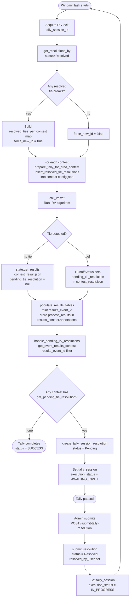

<!--
SPDX-FileCopyrightText: 2026 Sequent Tech Inc <legal@sequentech.io>
SPDX-License-Identifier: AGPL-3.0-only
-->

# IRV Tie-Break Resolution Flow

## Block Diagram

---

## Flow Table

| # | Component | Input | Action | Output / DB write | Code ref |
|---|-----------|-------|--------|-------------------|----------|
| 1 | **Windmill** (Celery task) | `tally_session_id`, `election_event_id`, `tenant_id` ([execute_tally_session.rs:1461](packages/windmill/src/tasks/execute_tally_session.rs#L1461)) | `execute_tally_session` fires; acquires PG lock; calls `get_resolutions_by(…, Some(Resolved))` | [`resolved_ties_per_contest`](packages/windmill/src/tasks/execute_tally_session.rs#L1182) map in memory | [execute_tally_session.rs:1173](packages/windmill/src/tasks/execute_tally_session.rs#L1173) |
| 2 | **Windmill** | [`resolved_ties_per_contest`](packages/windmill/src/tasks/execute_tally_session.rs#L1182) passed to `run_velvet_tally` → forwarded as [`contest_resolved_tie_resolutions`](packages/windmill/src/services/ceremonies/velvet_tally.rs#L128) per contest | Writes per-contest `contest-config.json`; calls `contest.insert_resolved_tie_resolutions(…)` ([ballot.rs:1581](packages/sequent-core/src/ballot.rs#L1581)) to embed the pre-supplied winner under [`RESOLVED_TIE_RESOLUTIONS_KEY`](packages/sequent-core/src/types/ceremonies.rs#L6) [a] | Temp dir: [`input/configs/election__X/contest__Y/contest-config.json`](packages/windmill/src/services/ceremonies/velvet_tally.rs#L212) | [velvet_tally.rs:892](packages/windmill/src/services/ceremonies/velvet_tally.rs#L892), [velvet_tally.rs:229](packages/windmill/src/services/ceremonies/velvet_tally.rs#L229) |
| 3 | **Velvet** (in-process) | `contest-config.json`, `ballots.csv` | Runs IRV algorithm via `RunoffStatus::run()`; tie-breaking policy is `EXTERNAL_PROCEDURE`; no pre-supplied winner → tie detected; sets [`pending_tie_resolution`](packages/velvet/src/pipes/do_tally/counting_algorithm/instant_runoff.rs#L199) on [`RunoffStatus`](packages/velvet/src/pipes/do_tally/counting_algorithm/instant_runoff.rs#L198) | [`process_results`](packages/velvet/src/pipes/do_tally/counting_algorithm/instant_runoff.rs#L667) (= serialised `RunoffStatus`) written into `contest_result.json` [b] | [instant_runoff.rs:443](packages/velvet/src/pipes/do_tally/counting_algorithm/instant_runoff.rs#L443), [do_tally.rs:444](packages/velvet/src/pipes/do_tally/do_tally.rs#L444) |
| 4 | **Windmill** | Velvet [`State`](packages/velvet/src/cli/state.rs#L125) returned by `call_velvet` ([velvet_tally.rs:932](packages/windmill/src/services/ceremonies/velvet_tally.rs#L932)) | `state.get_results()` reads `contest_result.json` from disk | [`Vec<ElectionReportDataComputed>`](packages/velvet/src/cli/state.rs#L141) in memory | [state.rs:125](packages/velvet/src/cli/state.rs#L125) |
| 5 | **Windmill → PG** | [`contest_result.process_results`](packages/windmill/src/services/ceremonies/results.rs#L101) (contains `pending_tie_resolution` under [`PROCESS_RESULTS_KEY`](packages/sequent-core/src/types/results.rs#L16)) | Mints new `results_event_id`; stores `process_results` blob into `annotations[PROCESS_RESULTS_KEY]`; bulk-INSERTs rows | `sequent_backend.results_contest.annotations` — [`pending_tie_resolution`](packages/sequent-core/src/types/ceremonies.rs#L7) preserved as-is | [results.rs:313](packages/windmill/src/services/ceremonies/results.rs#L313), [results_contest.rs:355](packages/windmill/src/postgres/results_contest.rs#L355) |
| 6 | **Windmill → PG** | [`results_event_id`](packages/windmill/src/tasks/execute_tally_session.rs#L1282) from step 5 | `handle_pending_irv_resolutions` calls `get_event_results_contest(…, Some(results_event_id))` ([results_contest.rs:427](packages/windmill/src/postgres/results_contest.rs#L427)); per contest calls `contest_result.get_pending_tie_resolution()` ([results.rs:135](packages/sequent-core/src/types/results.rs#L135)); INSERTs one row per detected tie | `sequent_backend.tally_session_resolution` — [`status = Pending`](packages/windmill/src/postgres/tally_session_resolution.rs#L50) | [tally_resolution.rs:53](packages/windmill/src/services/ceremonies/tally_resolution.rs#L53), [tally_session_resolution.rs:41](packages/windmill/src/postgres/tally_session_resolution.rs#L41) |
| 7 | **Windmill → PG** | [`pending_resolution_ids`](packages/windmill/src/tasks/execute_tally_session.rs#L1278) from step 6 | Inserts `tally_session_execution` record; sets `tally_session.execution_status = AWAITING_INPUT` | `sequent_backend.tally_session.execution_status` updated; electoral log entry posted | [execute_tally_session.rs:1289](packages/windmill/src/tasks/execute_tally_session.rs#L1289) |
| 8 | **Admin UI / step-cli** | `tally_session_id`, `contest_id`, `selected_candidate_id` ([tally_ceremony.rs:351](packages/harvest/src/routes/tally_ceremony.rs#L351)) | Admin views tied candidates; picks winner; calls `POST /submit-tally-resolution` [c] | HTTP request to Harvest API | [tally_ceremony.rs:350](packages/harvest/src/routes/tally_ceremony.rs#L350) |
| 9 | **Harvest → PG** | [`SubmitTallyResolutionInput`](packages/harvest/src/routes/tally_ceremony.rs#L362) with `resolutions[]` | Validates `AWAITING_INPUT` status; calls `submit_resolution` (first time) or `update_resolution` (re-submission); sets `tally_session.execution_status = IN_PROGRESS` | `tally_session_resolution.status = Resolved`, `resolved_by_user`, `resolved_at` written; `tally_session` status updated | [tally_resolution.rs:123](packages/windmill/src/services/ceremonies/tally_resolution.rs#L123), [tally_resolution.rs:290](packages/windmill/src/services/ceremonies/tally_resolution.rs#L290) |
| 10 | **Windmill** (Celery re-trigger) | same `tally_session_id` | `get_resolutions_by(…, Some(Resolved))` returns non-empty → [`has_resolved_tie_break = true`](packages/windmill/src/tasks/execute_tally_session.rs#L1184) → `force_new_id = true` in `generate_results_id_if_necessary` | [`resolved_ties_per_contest`](packages/windmill/src/tasks/execute_tally_session.rs#L1182) map fed into step 2 | [execute_tally_session.rs:1173](packages/windmill/src/tasks/execute_tally_session.rs#L1173), [results.rs:296](packages/windmill/src/services/ceremonies/results.rs#L296) |
| 11 | **Velvet** (in-process, re-run) | `contest-config.json` now contains `pre_resolution` winner (injected at step 2) | IRV applies pre-supplied winner; no tie remains; [`pending_tie_resolution`](packages/velvet/src/pipes/do_tally/counting_algorithm/instant_runoff.rs#L634) set to `None` | `contest_result.json`: `pending_tie_resolution = null`; final winner determined | [instant_runoff.rs:634](packages/velvet/src/pipes/do_tally/counting_algorithm/instant_runoff.rs#L634) |
| 12 | **Windmill → PG** | fresh [`Vec<ElectionReportDataComputed>`](packages/velvet/src/cli/state.rs#L141); [`force_new_id = true`](packages/windmill/src/services/ceremonies/results.rs#L313) | `generate_results_id_if_necessary` bypasses session-count guard; mints new `results_event_id`; writes final `results_contest` rows with no pending tie in annotations | New `results_event_id`; `results_contest.annotations.process_results.pending_tie_resolution = null` | [results.rs:296](packages/windmill/src/services/ceremonies/results.rs#L296), [results.rs:350](packages/windmill/src/services/ceremonies/results.rs#L350) |

---

## Key DB Tables

| Table | Role in this flow |
|-------|-------------------|
| `sequent_backend.tally_session` | Holds `execution_status` (`IN_PROGRESS` / `AWAITING_INPUT` / `SUCCESS`) |
| `sequent_backend.tally_session_resolution` | One row per tie per round; columns: `contest_id`, `status` (`Pending`/`Resolved`), `resolution_data` (JSON: `round_number`, `tied_candidate_ids`, `selected_candidate_id`), `resolved_by_user`, `resolved_at` |
| `sequent_backend.results_contest` | Stores tally results; `annotations.process_results.pending_tie_resolution` carries velvet's tie metadata until re-run clears it |
| `sequent_backend.results_event` | One row per results snapshot; a new `results_event_id` is minted on each run that produces results |

---

## Key Constants

| Constant | Value | Location | Used for |
|----------|-------|----------|----------|
| `RESOLVED_TIE_RESOLUTIONS_KEY` | `"resolved_tie_resolutions"` | [ceremonies.rs:6](packages/sequent-core/src/types/ceremonies.rs#L6) | Key in `contest-config.json` annotations where pre-supplied winner is injected (input to velvet) |
| `PENDING_TIE_RESOLUTION_KEY` | `"pending_tie_resolution"` | [ceremonies.rs:7](packages/sequent-core/src/types/ceremonies.rs#L7) | Key inside `annotations.process_results` of `results_contest` where velvet records an unresolved tie (output from velvet) |
| `PROCESS_RESULTS_KEY` | `"process_results"` | [results.rs:16](packages/sequent-core/src/types/results.rs#L16) | Top-level key in `results_contest.annotations` that wraps the serialised `RunoffStatus` |

---

## Notes

**[a] Injecting the resolution into velvet**
`prepare_tally_for_area_contest` calls `contest.insert_resolved_tie_resolutions(resolutions)` ([ballot.rs:1581](packages/sequent-core/src/ballot.rs#L1581)) before writing `contest-config.json`. This adds a `pre_resolution` field under `RESOLVED_TIE_RESOLUTIONS_KEY` that velvet reads instead of invoking `EXTERNAL_PROCEDURE`. Only applies when `tally_type = ELECTORAL_RESULTS`; initialization reports always use `RANDOM` tie-breaking.

**[b] Where velvet records the tie**
During `do-tally`, `RunoffStatus::run()` sets [`pending_tie_resolution`](packages/velvet/src/pipes/do_tally/counting_algorithm/instant_runoff.rs#L443) on [`RunoffStatus`](packages/velvet/src/pipes/do_tally/counting_algorithm/instant_runoff.rs#L198) when it cannot break a tie deterministically. The entire `RunoffStatus` (including `resolved_tie_resolutions` and `pending_tie_resolution` fields) is serialised into `process_results` and written to `contest_result.json` on disk. Windmill reads it back via `state.get_results()` → `GenerateReports::read_reports()`.

**[c] Two submission paths**
The resolution can be submitted via the Admin Portal UI (calls the Harvest REST endpoint `POST /submit-tally-resolution`) or via `step-cli submit-tally-resolution` (uses a GraphQL mutation). Both converge on [`submit_tally_resolution`](packages/windmill/src/services/ceremonies/tally_resolution.rs#L123) in `tally_resolution.rs`. Re-submitting an already-resolved record is allowed (admin can change their decision) as long as at least one of the submitted contest IDs is still `pending`.
