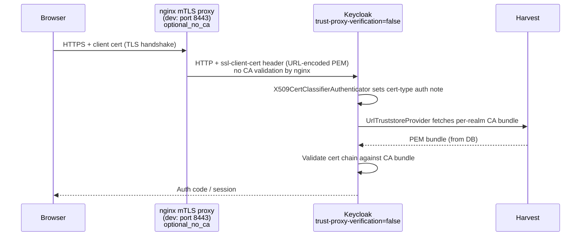
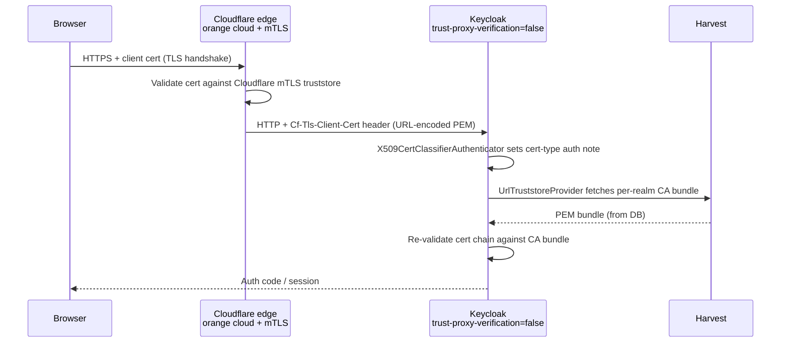

<!--
SPDX-FileCopyrightText: 2025 Sequent Tech Inc <legal@sequentech.io>
SPDX-License-Identifier: AGPL-3.0-only
-->

# X.509 Certificate Voter Authentication

This tutorial explains how Sequent's X.509 certificate-based voter login works, and
how to configure it for local development and production environments.

## Overview

Voters can identify themselves using a client TLS certificate instead of (or in
addition to) a password. The certificate is issued by a trusted CA managed by the
election operator through the admin portal. Certificate presentation is
**optional** — voters without a certificate fall through to password-based
authentication as normal.

**See also:** [X.509 Architecture](../06-keycloak/x509_client_cert_architecture.md) — design, components, and multi-tenancy.

---

## Architecture

### Dev (Codespaces)



### Production



In both environments Keycloak always re-validates the cert independently
(`trust-proxy-verification=false`). The difference is the proxy layer: in dev,
nginx passes the cert through without CA validation; in production, Cloudflare
validates against its own mTLS truststore before forwarding.

### Components

| Component | Role |
|-----------|------|
| `UrlTruststoreProvider` | Custom Keycloak SPI. Fetches the CA bundle per election event realm from Harvest. Results are in-memory cached by realm ID. Configured via `KC_SPI_TRUSTSTORE_PROVIDER=url`. |
| `X509CertClassifierAuthenticator` | Custom SPI. Reads the client cert from the configured HTTP header, extracts issuer CN, sets the `cert-type` auth note. Runs first in the X.509 flow. |
| Keycloak `nginx` x509cert lookup | Reads the client certificate from a configurable HTTP header. Named "nginx" but works for any reverse proxy header. |
| nginx mTLS proxy (dev only) | Terminates TLS in front of Keycloak. Uses `optional_no_ca` — no CA validation at this layer. The cert is forwarded raw to Keycloak. |
| Cloudflare mTLS (production) | Terminates TLS and validates the client cert against the Cloudflare mTLS truststore. Forwards the cert via `Cf-Tls-Client-Cert` header. |
| Election event realm | Each election event has its own Keycloak realm. The X.509 flow uses `X509CertClassifierAuthenticator` + conditional sub-flows, one per cert type (CA issuer). |

---

## 1. Local Development Setup

### 1.1 Prerequisites

The following files must exist before starting the containers:

| File | Purpose |
|------|---------|
| `.devcontainer/certs/nginx-tls.crt` | TLS server certificate for the nginx proxy (self-signed, for `127.0.0.1`) |
| `.devcontainer/certs/nginx-tls.key` | Corresponding private key |

No client CA file is needed in the nginx image — `optional_no_ca` means nginx
forwards any presented cert without validating it. CAs are managed exclusively
through the admin portal and stored in Postgres.

Generate the nginx TLS server certificate (valid for `127.0.0.1`, `localhost`,
and `keycloak-nginx` — the last one is needed for `curl` tests run inside the
dev container):

```bash
openssl req -x509 -newkey rsa:2048 -nodes \
  -keyout .devcontainer/certs/nginx-tls.key \
  -out    .devcontainer/certs/nginx-tls.crt \
  -days 365 \
  -subj "/CN=localhost" \
  -addext "subjectAltName=IP:127.0.0.1,DNS:localhost,DNS:keycloak-nginx"
```

Add REUSE license sidecar files:

```bash
for f in .devcontainer/certs/nginx-tls.crt .devcontainer/certs/nginx-tls.key; do
  cat > "${f}.license" <<'EOF'
SPDX-FileCopyrightText: 2025 Sequent Tech Inc <legal@sequentech.io>

SPDX-License-Identifier: AGPL-3.0-only
EOF
done
```

### 1.2 Environment Variables

`.devcontainer/.env.development` contains the relevant settings:

```bash
# UrlTruststoreProvider — fetches per-realm CA bundles from Harvest.
KC_SPI_TRUSTSTORE_PROVIDER=url
KC_SPI_TRUSTSTORE_URL_REFRESH_INTERVAL_SECONDS=60

# X509 cert header source:
#   "nginx"   — reads cert from ssl-client-cert header (nginx mTLS proxy)
#   "default" — reads cert from TLS connection directly (no proxy; X.509 auth
#               is silently skipped in plain HTTP dev mode)
KC_SPI_X509CERT_LOOKUP_PROVIDER=nginx
```

### 1.3 Docker Compose Services

The `docker-compose.yml` starts a `keycloak-nginx` container alongside Keycloak.
The image is built from `.devcontainer/keycloak-nginx/Dockerfile` and bakes in
only the TLS server cert and config — no CA bundle is required.

Keycloak is configured with:

```yaml
--spi-x509cert-lookup-nginx-trust-proxy-verification=false
```

This means Keycloak re-validates every cert itself via `UrlTruststoreProvider`,
identical to production. nginx only passes the cert through.

### 1.4 Generate a Test Client CA and Voter Certificate

To test X.509 login in dev, create a CA and sign a voter cert with it, then
import the CA into the admin portal.

```bash
# Generate a dev CA (signs voter certs for testing)
openssl req -x509 -newkey rsa:2048 -nodes \
  -keyout .devcontainer/certs/client-ca.key \
  -out    .devcontainer/certs/client-ca.pem \
  -days 3650 \
  -subj "/CN=Sequent Dev CA"

# Generate voter key and CSR
openssl req -newkey rsa:2048 -nodes \
  -keyout .devcontainer/certs/fake-voter.key \
  -out    .devcontainer/certs/fake-voter.csr \
  -subj   "/CN=voter@sequent.test/O=Sequent Test/C=US"

# Sign with the dev CA
openssl x509 -req \
  -in     .devcontainer/certs/fake-voter.csr \
  -CA     .devcontainer/certs/client-ca.pem \
  -CAkey  .devcontainer/certs/client-ca.key \
  -CAcreateserial \
  -out    .devcontainer/certs/fake-voter.crt \
  -days   730

# Bundle into PKCS#12 for browser import
openssl pkcs12 -export \
  -inkey .devcontainer/certs/fake-voter.key \
  -in    .devcontainer/certs/fake-voter.crt \
  -out   .devcontainer/certs/fake-voter.p12 \
  -name  "fake-voter@sequent.test"
```

Import `.devcontainer/certs/fake-voter.p12` into your browser's certificate store.

Then import `.devcontainer/certs/client-ca.pem` into the election event via the
admin portal **Certificate Authorities** tab. This is the only step needed to
make Keycloak trust that CA — no nginx rebuild required.

### 1.5 Voting Portal

The voting portal connects to Keycloak via its normal HTTP URL (port 8090) for
all token operations. The mTLS proxy (port 8443) is only used when the voter
clicks "Login with Certificate". No change to `global-settings.json` is needed.

### 1.6 Keycloak Realm Configuration

Each election event realm needs the X.509 authenticator flow configured.

#### 1.6.1 Create the X.509 authentication flow

> **Tip:** Our default realm's configurartion ships a built-in **"Certificate Browser Flow"** under
> **Authentication → Flows**. You can duplicate and modify it instead of
> creating a flow from scratch — this is the recommended starting point.

1. Go to **Authentication** → **Flows** → **Create flow**, name it `x509-browser`
2. Add these top-level executions:

   | Execution | Requirement |
   |---|---|
   | **X509 Cert Classifier** (`sequent-x509-cert-classifier`) | REQUIRED |
   | Conditional sub-flow for CA type A | CONDITIONAL |
   | Conditional sub-flow for CA type B (if needed) | CONDITIONAL |
   | Username Password Form | ALTERNATIVE |

3. For each conditional sub-flow:
   - Add **Condition - Auth Note** with key `cert-type` = the CA issuer CN
     (e.g. `Sequent Dev CA`).
   - Add **X509/Validate Username Form** inside the sub-flow.
   - Configure the X509 execution (⚙):
     - **User Identity Source**: `Subject's Common Name`
     - **User Mapping Method**: `Custom Attribute Mapper`

4. Bind the flow: **Realm Settings** → **Authentication flow bindings** →
   **Browser Flow** → `x509-browser`

---

## 2. UrlTruststoreProvider Plugin

The `url-truststore-provider` (`packages/keycloak-extensions/url-truststore-provider/`)
replaces Keycloak's built-in `file` truststore provider with a `url` provider that:

1. Constructs a per-realm CA bundle URL from `HARVEST_DOMAIN` and the election
   event ID extracted from the realm name (`tenant-{UUID}-event-{UUID}`).
2. Fetches the PEM bundle from Harvest at first use and caches it by realm ID.
3. Refreshes the cached bundle in the background at a configurable interval
   (`KC_SPI_TRUSTSTORE_URL_REFRESH_INTERVAL_SECONDS`).

---

## 3. Testing

### 3.1 Verify nginx is forwarding the certificate

> **Note:** From inside the dev container, use `keycloak-nginx` (the Docker
> service name) instead of `127.0.0.1`. The TLS cert includes `DNS:keycloak-nginx`
> as a SAN.

```bash
# Inside the dev container
curl -v --cacert .devcontainer/certs/nginx-tls.crt \
  --cert .devcontainer/certs/fake-voter.crt \
  --key  .devcontainer/certs/fake-voter.key \
  "https://keycloak-nginx:8443/realms/<realm>/protocol/openid-connect/auth\
?client_id=voting-portal&response_type=code&scope=openid\
&redirect_uri=http://localhost:3000/callback"
```

A successful response is an HTTP `302` redirect with a `code` query parameter.
Without the client certificate, Keycloak returns HTTP `200` (the login page).

### 3.2 Check Keycloak logs

```bash
docker compose logs -f keycloak | grep -i "x509\|cert\|ssl\|truststore"
```

| Log message | Meaning |
|-------------|---------|
| `X509CertClassifierAuthenticator: setting auth note cert-type=<CN>` | Cert classified successfully |
| `X509CertClassifierAuthenticator: no ssl-client-cert header present` | No cert presented; flow falls through to password |
| `Loading realm-specific truststore for realm <id>` | First fetch for this realm (cold cache) |
| `Using cached realm-specific truststore for realm <id>` | Subsequent fetch served from cache |

---

## 4. Troubleshooting

### Browser does not offer the certificate

- Import the voter certificate into the browser's certificate store for
  `127.0.0.1:8443` in dev.
- Restart the browser after importing.

### nginx image is stale

After editing the nginx config or replacing the TLS server cert, rebuild:

```bash
docker compose build keycloak-nginx
docker compose up -d --no-deps keycloak-nginx
```

### Keycloak uses `default` provider despite env var being set

`docker compose restart` reuses the existing container. Recreate:

```bash
docker compose up -d --no-deps keycloak
```

### Certificate verification fails (Keycloak rejects the cert)

The CA was not imported into the admin portal for this election event. Import
`.devcontainer/certs/client-ca.pem` via the **CERTIFICATES** tab.

### `ssl-client-verify` is `NONE`

The client did not present a certificate. Ensure the voter certificate is
installed in the browser and the browser is connecting to the nginx proxy
(port 8443), not directly to Keycloak (port 8090).

### Voter authenticates but Hasura returns permission error

```json
{"errors": [{"message": "Your requested role is not in allowed roles"}]}
```

The voter account is not in the `voter` group in Keycloak. Add the user to the
`voter` group in their election event realm.

---

## See Also

- [X.509 Architecture](../06-keycloak/x509_client_cert_architecture.md) — end-to-end flow, infrastructure, multi-tenancy
- [X.509 — Adding CA Certificates](./08-x509-adding-ca-certificates.md) — adding external PKI CA certs to the trust bundle
- [Configuring Login and Registration Fields](../../02-election_managers/02-reference/10-user-profile-login-registration-fields.md) — the other settings that shape the login page this button appears on
