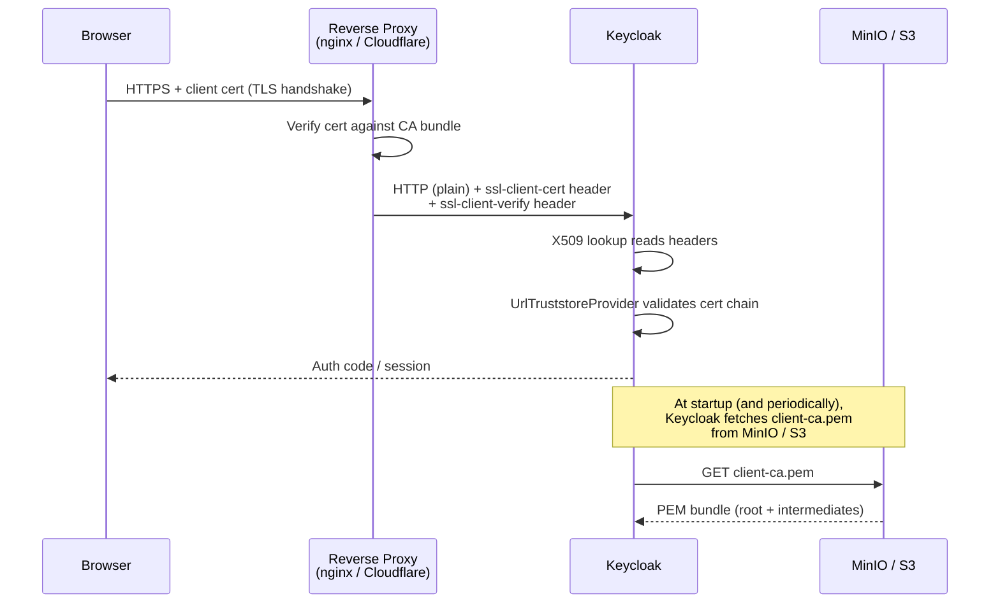

<!--
SPDX-FileCopyrightText: 2025 Sequent Tech Inc <legal@sequentech.io>
SPDX-License-Identifier: AGPL-3.0-only
-->

# X.509 Certificate Voter Authentication

This tutorial explains how Sequent's X.509 certificate-based voter login works, and
how to configure it for local development and production environments.

## Overview

Sequent supports an optional authentication mode where voters identify themselves
using a client TLS certificate instead of (or in addition to) a password. The
certificate is issued by a trusted Certificate Authority (CA) managed by the election
operator, and the voter's certificate is presented in the browser during the HTTPS
handshake.

This approach is used when a high-assurance, hardware-token-based voter identity is
required — for example, when voters hold smartcard credentials issued by a national
identity system.

**Key design points:**

- Certificate presentation is **optional** (`ssl_verify_client optional`). Voters
  without a certificate fall through to password-based authentication in Keycloak as
  normal — no disruption to existing flows.
- The CA bundle that Keycloak trusts is fetched from a URL (S3 / MinIO pre-signed
  URL), not from Keycloak's local filesystem, so it can be managed externally without
  restarting Keycloak.
- TLS termination is done by a reverse proxy (nginx in development, Cloudflare in
  production). Keycloak runs on plain HTTP and receives the client certificate in an
  HTTP header.

---

## Architecture



### Components

| Component | Role |
|-----------|------|
| `UrlTruststoreProvider` | Custom Keycloak SPI. Fetches the CA certificate bundle from a URL at startup (and optionally on a refresh schedule). Replaces Keycloak's built-in `file` truststore provider. |
| Keycloak `nginx` x509cert lookup | Reads the client certificate from the `ssl-client-cert` HTTP header (URL-encoded PEM) and the verification result from `ssl-client-verify`. Configured via `KC_SPI_X509CERT_LOOKUP_PROVIDER=nginx`. |
| Keycloak `rfc9440` x509cert lookup | Reads the client certificate from the `Client-Cert` HTTP header (RFC 9440 format). Used when Cloudflare terminates mTLS. Configured via `KC_SPI_X509CERT_LOOKUP_PROVIDER=rfc9440`. |
| nginx mTLS proxy | Terminates TLS + optional mTLS in front of Keycloak. Used in local development. Configured in `.devcontainer/keycloak-nginx/`. |
| Cloudflare mTLS | Terminates TLS + optional mTLS in production. Cloudflare issues client certificates and forwards them via the `Client-Cert` header. |
| Election event realm | Each election event has its own Keycloak realm. The X.509 authenticator is added as an `ALTERNATIVE` execution in the browser authentication flow, so cert login and password login coexist. |

---

## 1. Local Development Setup

### 1.1 Prerequisites

The following files must exist before starting the containers:

| File | Purpose |
|------|---------|
| `.devcontainer/certs/nginx-tls.crt` | TLS server certificate for the nginx proxy (self-signed, for `127.0.0.1`) |
| `.devcontainer/certs/nginx-tls.key` | Corresponding private key |
| `.devcontainer/minio/public-assets/client-ca.pem` | CA certificate bundle. nginx uses this to verify client certs; Keycloak fetches it from MinIO. |

Generate the nginx TLS server certificate (valid for `127.0.0.1`, `localhost`, and
`keycloak-nginx` — the last one is needed for `curl` tests run inside the dev
container, where the nginx proxy is reached by its Docker service name):

```bash
openssl req -x509 -newkey rsa:2048 -nodes \
  -keyout .devcontainer/certs/nginx-tls.key \
  -out    .devcontainer/certs/nginx-tls.crt \
  -days 365 \
  -subj "/CN=localhost" \
  -addext "subjectAltName=IP:127.0.0.1,DNS:localhost,DNS:keycloak-nginx"
```

Generate the client CA (the CA that signs voter certificates):

```bash
openssl req -x509 -newkey rsa:2048 -nodes \
  -keyout client-ca.key \
  -out    .devcontainer/minio/public-assets/client-ca.pem \
  -days 3650 \
  -subj "/CN=Voter CA"
```

Add REUSE license sidecar files for both certificate files:

```bash
cat > .devcontainer/certs/nginx-tls.crt.license <<'EOF'
SPDX-FileCopyrightText: 2025 Sequent Tech Inc <legal@sequentech.io>

SPDX-License-Identifier: AGPL-3.0-only
EOF

cat > .devcontainer/certs/nginx-tls.key.license <<'EOF'
SPDX-FileCopyrightText: 2025 Sequent Tech Inc <legal@sequentech.io>

SPDX-License-Identifier: AGPL-3.0-only
EOF
```

### 1.2 Environment Variables

`.devcontainer/.env.development` contains the relevant settings:

```bash
# UrlTruststoreProvider — fetches the client CA bundle from MinIO
KC_SPI_TRUSTSTORE_PROVIDER=url
KC_SPI_TRUSTSTORE_URL_URL=http://minio:9000/public/public-assets/client-ca.pem
KC_SPI_TRUSTSTORE_URL_REFRESH_INTERVAL_SECONDS=3600

# X509 cert header source:
#   "default"  — reads cert from TLS connection directly (no proxy; cert is never
#                found when Keycloak runs on plain HTTP, so X.509 auth is silently
#                skipped in that mode — useful for devs who don't need cert login)
#   "nginx"    — reads cert from ssl-client-cert header (nginx mTLS proxy)
#   "rfc9440"  — reads cert from Client-Cert header (Cloudflare mTLS)
KC_SPI_X509CERT_LOOKUP_PROVIDER=nginx
```

To develop without nginx (password-only mode), comment out or remove
`KC_SPI_X509CERT_LOOKUP_PROVIDER=nginx` so it defaults to `default`.

### 1.3 Docker Compose Services

The `docker-compose.yml` starts an nginx container (`keycloak-nginx`) alongside
Keycloak. It is included in the `full` and `base` profiles:

```yaml
keycloak-nginx:
  profiles: ["full", "base"]
  container_name: keycloak-nginx
  build:
    context: .
    dockerfile: keycloak-nginx/Dockerfile
  image: sequentech.local/keycloak-nginx
  ports:
    - "8443:8443"
  depends_on:
    keycloak:
      condition: service_healthy
```

The nginx image is built from `.devcontainer/keycloak-nginx/Dockerfile`, which bakes
the TLS certs and the nginx config into the image (avoiding Docker-in-Docker
bind-mount issues):

```dockerfile
FROM nginx:alpine
COPY keycloak-nginx/keycloak-mtls.conf /etc/nginx/conf.d/keycloak-mtls.conf
COPY certs/nginx-tls.crt               /etc/nginx/certs/nginx-tls.crt
COPY certs/nginx-tls.key               /etc/nginx/certs/nginx-tls.key
COPY minio/public-assets/client-ca.pem /etc/nginx/client-ca/client-ca.pem
```

Keycloak is configured to trust the `X-Forwarded-*` headers from nginx and to use
the nginx x509cert lookup provider:

```yaml
entrypoint: >
  /opt/keycloak/bin/kc.sh start-dev
  --spi-truststore-provider=${KC_SPI_TRUSTSTORE_PROVIDER:-file}
  --spi-x509cert-lookup-provider=${KC_SPI_X509CERT_LOOKUP_PROVIDER:-default}
  --spi-x509cert-lookup-nginx-ssl-client-cert=ssl-client-cert
  --spi-x509cert-lookup-nginx-trust-proxy-verification=true
  ...
environment:
  KC_PROXY_HEADERS: xforwarded
  KC_SPI_TRUSTSTORE_PROVIDER: ${KC_SPI_TRUSTSTORE_PROVIDER:-}
  KC_SPI_TRUSTSTORE_URL_URL: ${KC_SPI_TRUSTSTORE_URL_URL:-}
  KC_SPI_TRUSTSTORE_URL_REFRESH_INTERVAL_SECONDS: ${KC_SPI_TRUSTSTORE_URL_REFRESH_INTERVAL_SECONDS:-0}
```

### 1.4 Voting Portal

The voting portal must point to the nginx proxy (HTTPS on port 8443) instead of
directly to Keycloak (HTTP on port 8090):

```json
// packages/voting-portal/public/global-settings.json
{
  "KEYCLOAK_URL": "https://127.0.0.1:8443/"
}
```

### 1.5 Generate a Test Voter Certificate

Issue a certificate for a voter using the client CA created above. The CN must match
the voter's email address in Keycloak:

```bash
# Generate voter private key and CSR
openssl req -newkey rsa:2048 -nodes \
  -keyout voter.key \
  -out    voter.csr \
  -subj "/CN=voter@sequent.test"

# Sign with the client CA
openssl x509 -req \
  -in     voter.csr \
  -CA     .devcontainer/minio/public-assets/client-ca.pem \
  -CAkey  client-ca.key \
  -CAcreateserial \
  -out    voter.crt \
  -days   365

# Bundle into a PKCS#12 file for browser import
openssl pkcs12 -export \
  -inkey voter.key \
  -in    voter.crt \
  -out   voter.p12 \
  -passout pass:
```

Import `voter.p12` into your browser's certificate store. When navigating to the
voting portal, the browser will offer the certificate for the `127.0.0.1:8443`
origin.

---

## 2. Production Setup (Cloudflare mTLS)

In production, Cloudflare terminates TLS and optional mTLS. It forwards the client
certificate to Keycloak via the `Client-Cert` HTTP header (RFC 9440 format).

### 2.1 Cloudflare mTLS Certificate Issuance

Cloudflare can issue client certificates via its mTLS API, or you can upload your own
CA root to Cloudflare and issue client certificates from it. Configure Cloudflare to
require (or optionally require) client certificates for the Keycloak hostname.

Cloudflare's documentation covers the configuration steps for mTLS. The key output is
a CA certificate (PEM format) that Cloudflare trusts when issuing client certs — this
same CA cert is what Keycloak needs to validate incoming client certificates.

### 2.2 Upload the CA Certificate to S3

Upload the PEM-encoded CA bundle to an S3 bucket (or pre-signed URL) that Keycloak
can reach:

```bash
aws s3 cp client-ca.pem s3://your-bucket/keycloak/client-ca.pem
```

If using a pre-signed URL, generate one with sufficient expiry (or use the
`refresh-interval-seconds` setting to re-fetch before the URL expires).

### 2.3 Keycloak Environment Variables

Set the following environment variables in production:

```bash
KC_SPI_TRUSTSTORE_PROVIDER=url
KC_SPI_TRUSTSTORE_URL_URL=https://your-bucket.s3.amazonaws.com/keycloak/client-ca.pem
KC_SPI_TRUSTSTORE_URL_REFRESH_INTERVAL_SECONDS=3600

KC_SPI_X509CERT_LOOKUP_PROVIDER=rfc9440
KC_PROXY_HEADERS=xforwarded
```

No nginx proxy is needed in production — Cloudflare acts as the reverse proxy.

---

## 3. UrlTruststoreProvider Plugin

The `url-truststore-provider` is a custom Keycloak SPI extension located in
`packages/keycloak-extensions/url-truststore-provider/`.

It replaces Keycloak's built-in `file` truststore provider (SPI id `file`) with a
`url` provider that:

1. Fetches a PEM file from any HTTP/HTTPS URL (including S3 pre-signed URLs) at
   startup.
2. Parses all certificates in the bundle and classifies them as root (self-signed) or
   intermediate.
3. Optionally re-fetches the bundle in the background at a configurable interval
   (`--spi-truststore-url-refresh-interval-seconds`), so the CA bundle can be rotated
   without restarting Keycloak.

### Configuration

| SPI parameter | Env var | Description |
|---------------|---------|-------------|
| `--spi-truststore-provider=url` | `KC_SPI_TRUSTSTORE_PROVIDER=url` | Activate the plugin |
| `--spi-truststore-url-url=<url>` | `KC_SPI_TRUSTSTORE_URL_URL=<url>` | URL to the PEM file |
| `--spi-truststore-url-refresh-interval-seconds=<n>` | `KC_SPI_TRUSTSTORE_URL_REFRESH_INTERVAL_SECONDS=<n>` | Re-fetch interval; `0` = fetch once at startup |

---

## 4. Keycloak Realm Configuration

Each election event has its own Keycloak realm. The X.509 authenticator must be
present in that realm's browser authentication flow as an `ALTERNATIVE` execution.

The realm import template at
`.devcontainer/keycloak/import/tenant-...-event-....json` already includes the X.509
authenticator in the correct position. When Windmill creates a new election event, it
uses this template.

### Voter Group Membership

Voters must belong to the `voter` group in their election event realm. This group
carries the `user` realm role, which is required for Hasura queries. If a voter
successfully authenticates via certificate but Hasura returns:

```json
{"errors": [{"message": "Your requested role is not in allowed roles"}]}
```

check that the voter account is a member of the `voter` group in Keycloak.

---

## 5. Testing

### 5.1 Verify nginx is forwarding the certificate

Test that Keycloak receives an auth code when a valid client certificate is presented.

> **Note on hostname:** From inside the dev container, `127.0.0.1` is the
> container's own loopback — nothing listens there. Use `keycloak-nginx` (the
> Docker service name) instead. The TLS certificate includes `DNS:keycloak-nginx`
> as a SAN so `--cacert` verification still passes.
>
> From your laptop/browser, the VS Code port-forwarding tunnel maps
> `localhost:8443` → `keycloak-nginx:8443`, so `127.0.0.1:8443` works there.

```bash
# Inside the dev container — use the Docker service name, not 127.0.0.1
curl -v --cacert .devcontainer/certs/nginx-tls.crt \
  --cert .devcontainer/certs/voter.pem --key .devcontainer/certs/voter.key \
  "https://keycloak-nginx:8443/realms/<realm>/protocol/openid-connect/auth\
?client_id=voting-portal&response_type=code&scope=openid\
&redirect_uri=http://localhost:3000/callback"
```

A successful response is an HTTP `302` redirect to the `redirect_uri` with a `code`
query parameter. Without the client certificate, Keycloak should return HTTP `200`
(the login page).

### 5.2 Check Keycloak logs

```bash
docker compose logs -f keycloak | grep -i "x509\|cert\|ssl\|truststore"
```

Common messages and their meanings:

| Log message | Meaning |
|-------------|---------|
| `HTTP header "" is empty` | `--spi-x509cert-lookup-nginx-ssl-client-cert` was not set; Keycloak doesn't know which header to read. |
| `nginx could not verify the certificate: ssl-client-verify: null` | nginx is not forwarding `ssl-client-verify`; add `proxy_set_header ssl-client-verify $ssl_client_verify;` to the nginx config. |
| `UrlTruststoreProvider: loaded N certificate(s) from <url>` | Plugin initialised successfully. |
| `UrlTruststoreProvider: refresh failed` | Background fetch failed; the previous bundle is still in use. |

---

## 6. Troubleshooting

### Browser does not offer the certificate

- Ensure the voter certificate was imported into the browser's certificate store for
  the correct origin (`127.0.0.1:8443` in dev, your production domain in production).
- The certificate must be signed by the CA in `client-ca.pem`.
- Restart the browser after importing the certificate.

### Keycloak uses `default` provider despite env var being set

`docker compose restart` reuses the existing container configuration. To pick up
changed env vars, recreate the container:

```bash
docker compose up -d --no-deps keycloak
```

### nginx image is stale

After editing `keycloak-mtls.conf` or replacing the cert files, rebuild and recreate:

```bash
docker compose build keycloak-nginx
docker compose up -d --no-deps keycloak-nginx
```

### Certificate verification fails with `FAILED:...`

- The voter certificate must be signed by the CA whose PEM is in `client-ca.pem`.
- Check the cert chain with:
  ```bash
  openssl verify -CAfile .devcontainer/minio/public-assets/client-ca.pem voter.crt
  ```
- If the CA bundle was recently updated in MinIO, wait for the next refresh interval
  or restart Keycloak to force an immediate re-fetch.

### `ssl-client-verify` is `NONE` instead of `SUCCESS`

This means nginx validated the connection but the client did not present a
certificate. Ensure the voter certificate is correctly installed in the browser and
that the browser is connecting to the nginx proxy (port 8443), not directly to
Keycloak (port 8090).

---

## See Also

- [IdP-Initiated SSO Design](../06-keycloak/idp_initiated_sso_design_implementation) — SAML-based SSO for election events
- [API Authentication with Keycloak](./05-api-authentication) — password-based token flow for CLI and admin tools
