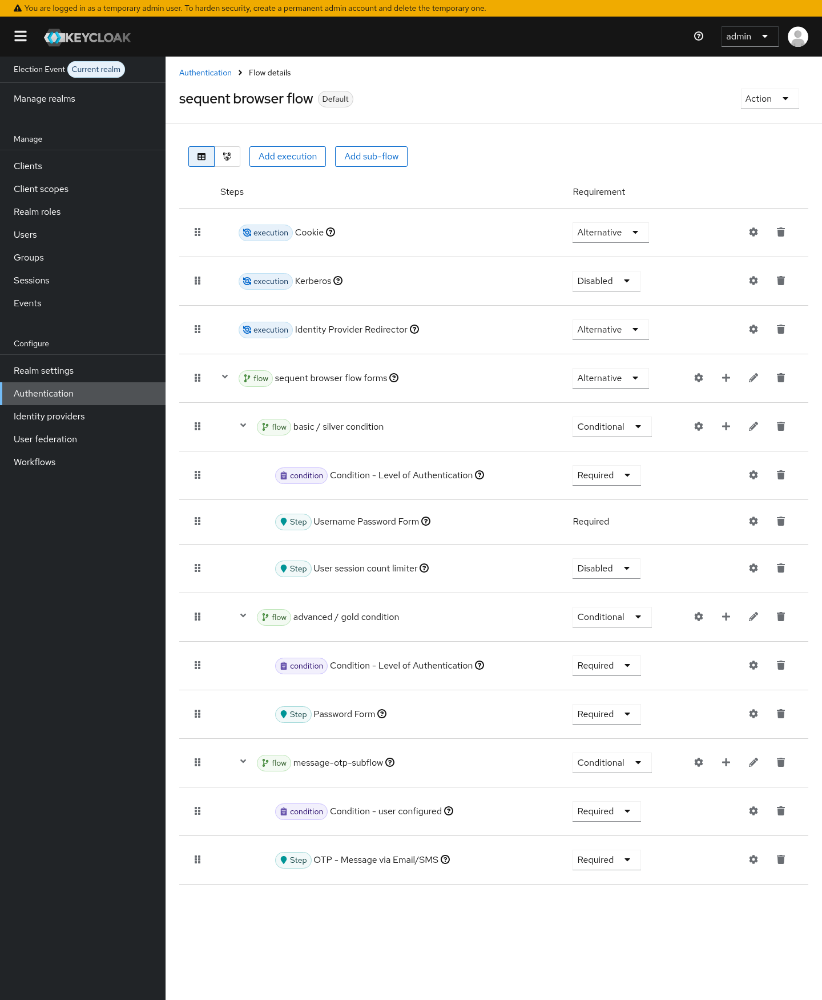
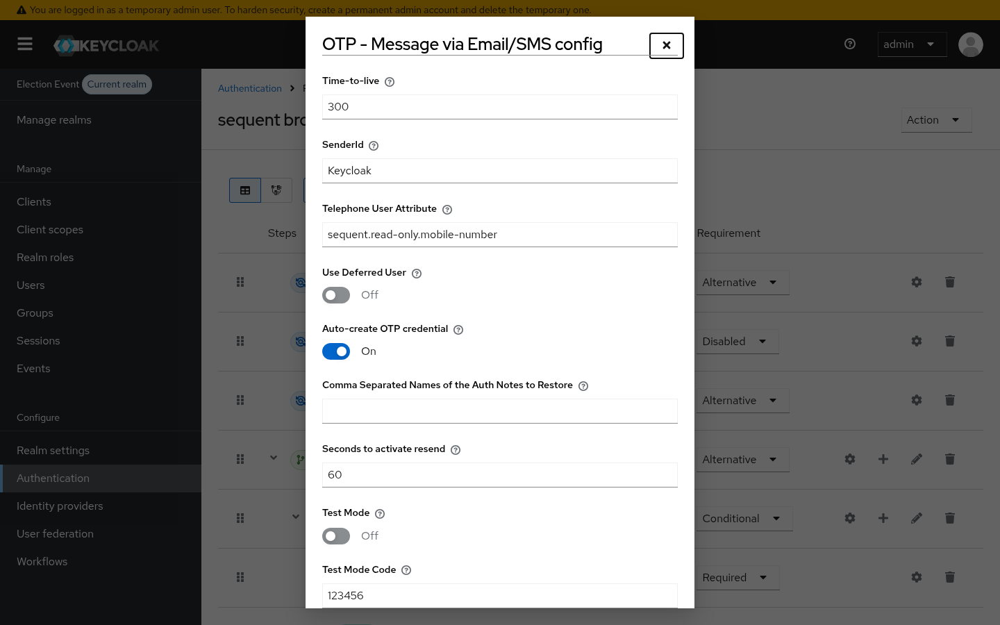
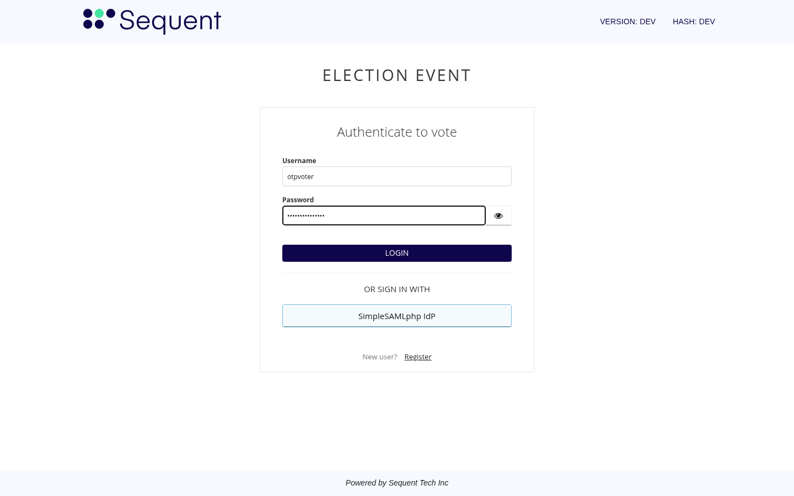
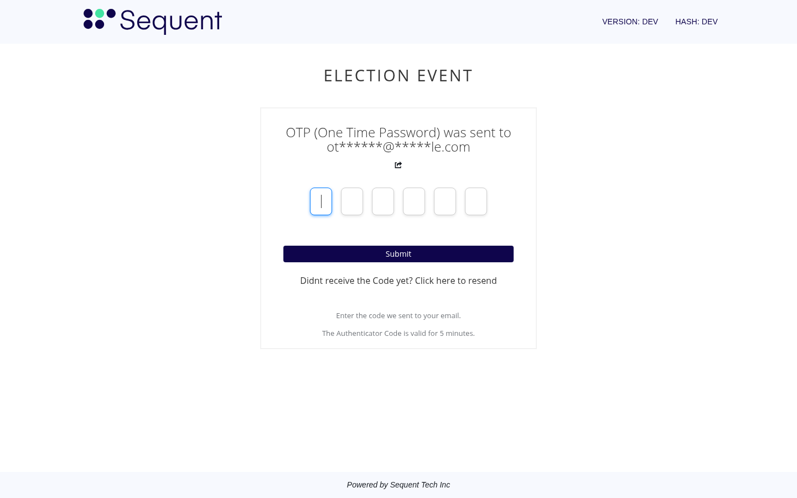
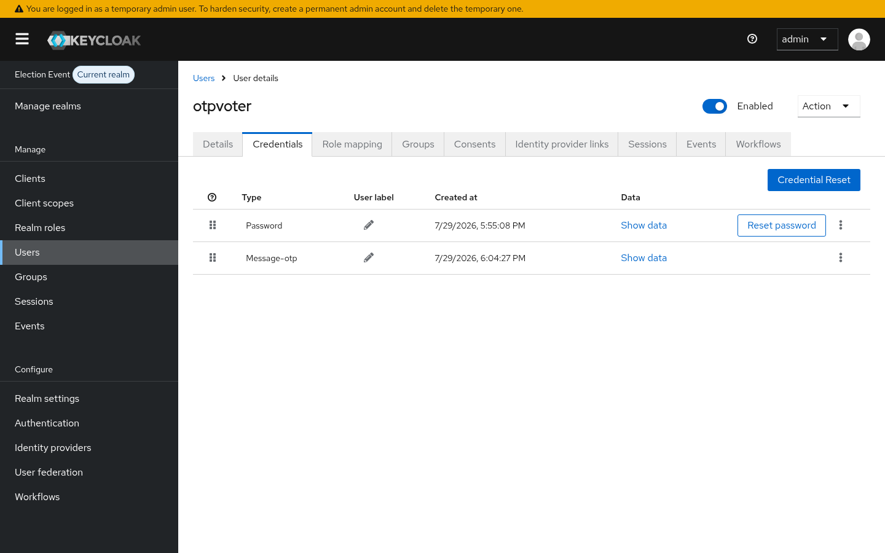

<!--
SPDX-FileCopyrightText: 2026 Sequent Tech Inc <legal@sequentech.io>
SPDX-License-Identifier: AGPL-3.0-only
-->

# Email OTP for Imported Voters

This tutorial explains how to make imported voters receive a one-time password by
email at login, without asking them to enrol anything first. It uses the
**Auto-create OTP credential** option (`autoCreateCredentialAttribute`) of the
`message-otp-authenticator` Keycloak extension.

## Why this option exists

The OTP step is normally guarded by Keycloak's **Condition - user configured**,
which asks the authenticator whether the voter is configured for it. Historically
that answer was `false` unless the voter had a stored `message-otp` credential.

Voters imported or edited through the admin portal get their email and mobile
attributes set, but no `message-otp` credential is ever stored for them. The
result is that the OTP sub-flow is silently skipped: the voter signs in with the
password alone, and no second factor is ever requested. In flows where the OTP is
the only alternative left, the login instead fails with a generic
`invalid_user_credentials` error.

With **Auto-create OTP credential** enabled, the authenticator creates the
`message-otp` credential during login for any non-deferred voter that already has
an email address or a mobile number, so the OTP step runs on the voter's very
first login.

The option is **disabled by default**: enabling it is an explicit decision per
authentication flow.

## Prerequisites

- Voters imported with an **email address** (or a mobile number for SMS).
- A working email sender for the realm. In the development environment the dummy
  sender writes the message to the Keycloak log instead of sending it.
- Access to the Keycloak admin console for the election event realm.

## Step 1: add the OTP sub-flow to the browser flow

In the election event realm, open **Authentication** and select the browser flow
used by the event (`sequent browser flow`). The OTP step lives in a
**Conditional** sub-flow that contains **Condition - user configured** followed by
**OTP - Message via Email/SMS**, both **Required**, placed after the username and
password step:



## Step 2: enable the option on the authenticator

Open the settings (the gear icon) of the **OTP - Message via Email/SMS** step and
set:

- **Message Courier**: `EMAIL` (use `BOTH` or `SMS` if you also deliver by SMS).
- **Auto-create OTP credential**: **On**.
- **Use Deferred User**: **Off**. Deferred voters take their address from the
  authentication session and never need a stored credential, so this option does
  not apply to them.



Save the dialog. No voter re-import or edit is required, and no credential
enrolment required action needs to be assigned.

## Step 3: the voter signs in

The voter signs in with their username and password as usual:



Because the voter has an email address configured, the OTP step now runs on this
first login and the code is emailed to them:



Entering the emailed code completes the login.

In the development environment the message is written to the Keycloak log rather
than sent, so you can read the code with:

```bash
docker logs keycloak --since 2m 2>&1 | grep -A6 "Sending dummy email"
```

## Step 4: verify the credential was created

Open the voter in **Users → Credentials**. The `message-otp` credential now exists
alongside the password, created at the moment of that first login:



The credential is created once. Later logins reuse it, so the OTP step keeps
working even if the option is turned off afterwards.

## Behaviour summary

| Situation | Option off | Option on |
| --- | --- | --- |
| Voter with email or mobile, no stored credential | OTP step skipped | Credential created, OTP sent |
| Voter with a stored `message-otp` credential | OTP sent | OTP sent |
| Voter with neither email nor mobile | OTP step skipped | OTP step skipped |
| Deferred voter (**Use Deferred User** on) | Address taken from the authentication session | Unchanged, no credential stored |

## Notes

- The option only decides whether the voter is *offered* the OTP step. It does not
  weaken the check itself: the emailed code is still generated, delivered, and
  validated exactly as before.
- A voter without an email address and without a mobile number is never considered
  configured, so enabling the option cannot lock anybody into a step they cannot
  complete.
- Because the credential is created during login, turning the option on affects
  voters gradually as they sign in, rather than in one migration.
