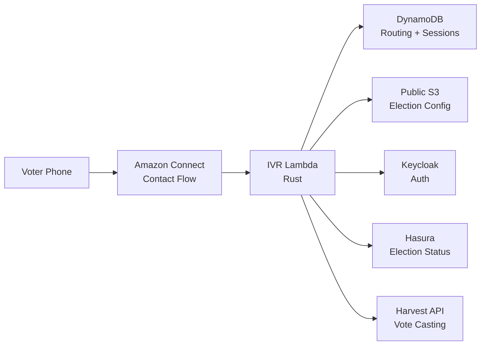
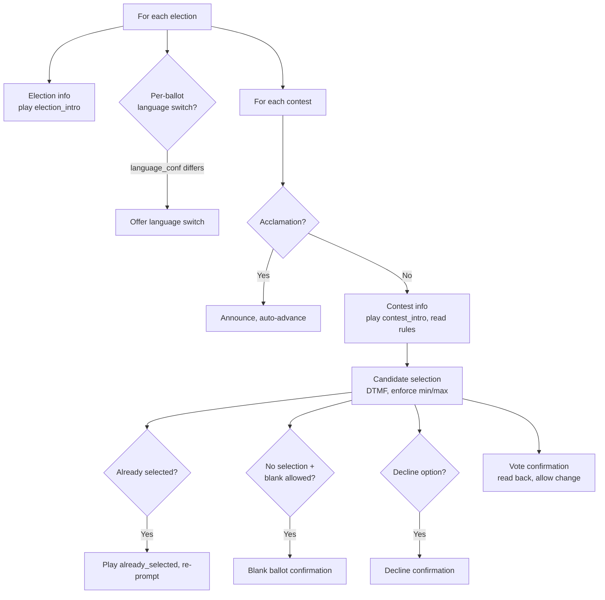
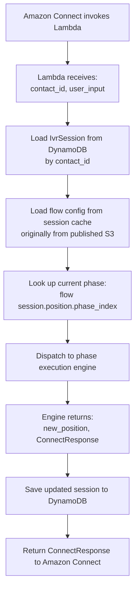
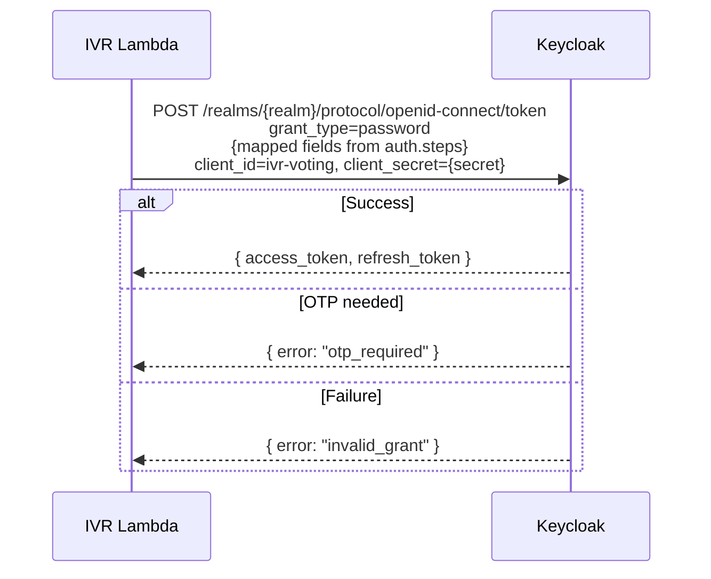
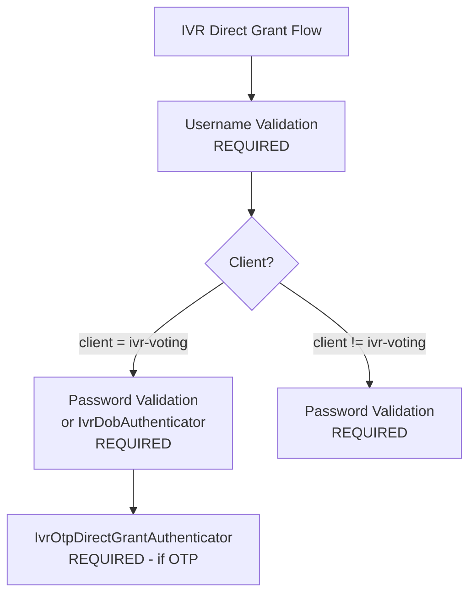
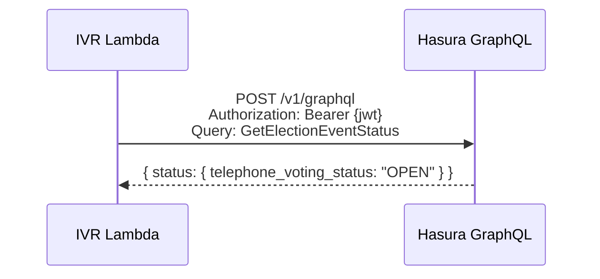
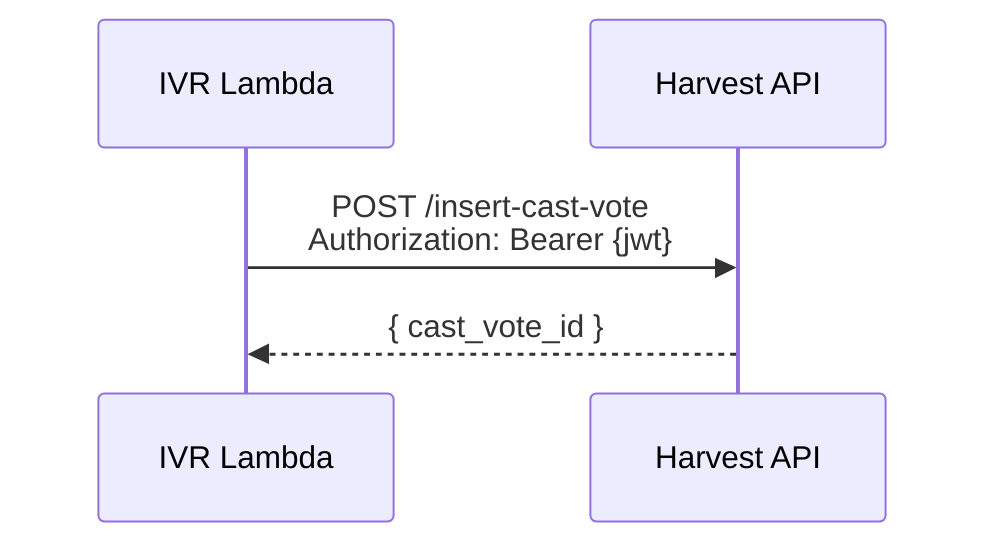
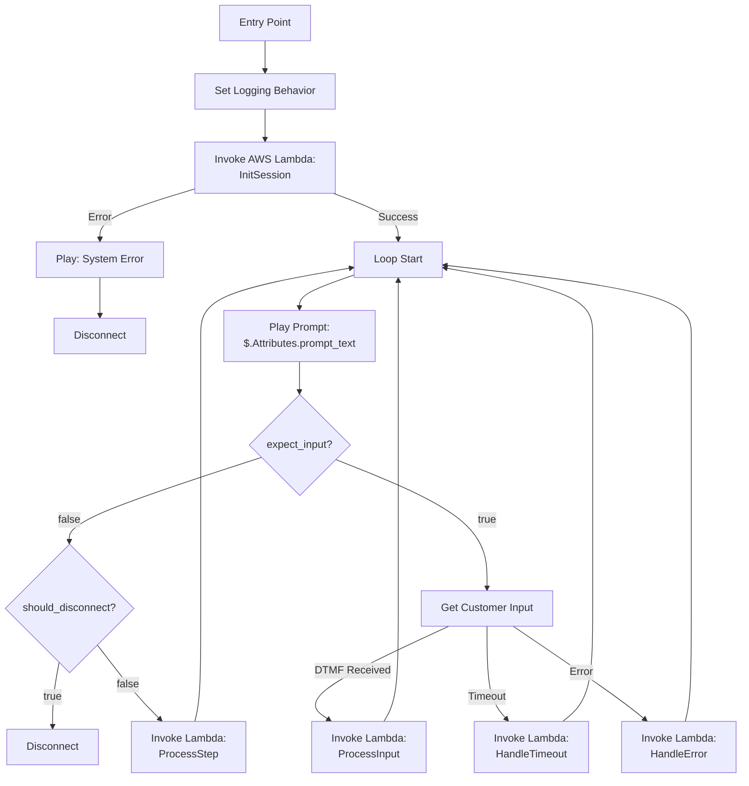
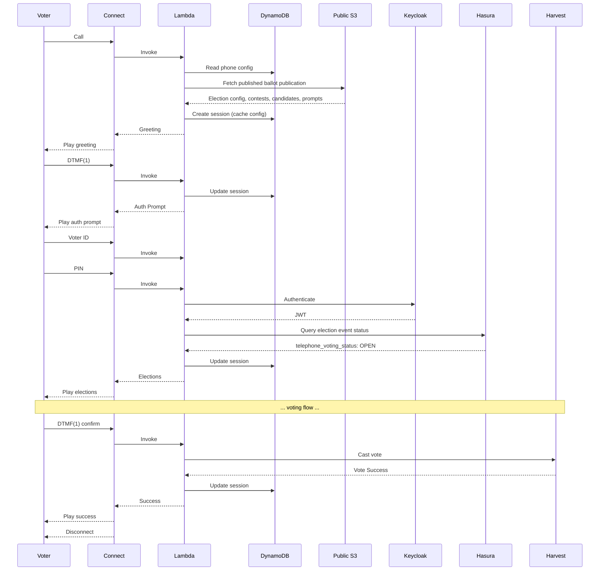

<!--
SPDX-FileCopyrightText: 2025 Sequent Tech Inc <legal@sequentech.io>
SPDX-License-Identifier: AGPL-3.0-only
-->

# IVR Telephone Voting System - Technical Design Document

## 1. Executive Summary

This document outlines the technical design for an IVR (Interactive Voice Response) telephone voting system for the Sequent Voting Platform. The system will be deployed in Canada and will allow voters without internet access to participate in elections via telephone.

### Key Design Decisions
- **Lambda Runtime**: Rust (consistent with existing codebase)
- **IVR Provider**: Amazon Connect with Contact Flows
- **State Management**: DynamoDB for call session state
- **Authentication**: Keycloak OIDC Direct Grant (ROPC) with configurable multi-factor authentication
- **Election Config**: Published ballot publication on public S3 (same data as voting portal)
- **Election Status**: Hasura GraphQL for real-time status checks
- **Vote Casting**: Harvest API for vote submission

---

## 2. Architecture Overview



### 2.1 Component Responsibilities

| Component | Responsibility |
|-----------|----------------|
| **Amazon Connect** | Receive calls, play prompts via Polly, capture DTMF input, route to Lambda |
| **IVR Lambda** | State machine logic, prompt generation, input validation, API orchestration |
| **DynamoDB** | Phone number → cluster/environment/tenant/event routing; ephemeral call session state |
| **Public S3** | Published ballot publication: election structure, ballot styles, contests, candidates, IVR flow config, auth steps, prompts, public keys (same data used by voting portal in preview mode) |
| **Keycloak** | Voter authentication via OIDC Direct Grant (ROPC) with configurable auth factors, JWT issuance |
| **Hasura** | Real-time election event status query (same mechanism as voting portal) |
| **Harvest API** | Cast votes via `/insert-cast-vote` |

---

## 3. Config-Driven Flow Engine

### 3.0 Design Principle

The IVR call flow is **not a hardcoded state machine**. It is a **configurable pipeline of phases** defined in the election event's `presentation.ivr.flow` configuration and published to S3. The Lambda ships with execution engines for a finite set of phase types, but which phases run, in what order, and with what settings is entirely configuration.

This means:
- Adding a declaration step, receipt readback, or phone blacklist check = config change, not code change
- Removing phases for a simpler deployment = config change
- Reordering phases = config change
- Adding a **new phase type** (e.g., ranked-choice input) = code change (new execution engine)

### 3.1 Flow Configuration

The flow is an ordered array of phases stored in `presentation.ivr.flow`:

```json
{
  "ivr": {
    "flow": [
      { "phase": "welcome" },
      { "phase": "language_select" },
      { "phase": "blacklist_check" },
      { "phase": "auth" },
      { "phase": "eligibility_check" },
      { "phase": "declaration", "config": { "accept_key": "2" } },
      { "phase": "pre_voting_statement" },
      { "phase": "ballot_loop" },
      { "phase": "summary" },
      { "phase": "final_confirm" },
      { "phase": "submit" },
      { "phase": "receipt", "config": { "read_confirmation_number": true } },
      { "phase": "goodbye" }
    ]
  }
}
```

A simpler deployment (voter ID + PIN, no frills):

```json
{
  "ivr": {
    "flow": [
      { "phase": "welcome" },
      { "phase": "language_select" },
      { "phase": "auth" },
      { "phase": "ballot_loop" },
      { "phase": "summary" },
      { "phase": "final_confirm" },
      { "phase": "submit" },
      { "phase": "goodbye" }
    ]
  }
}
```

Same Lambda code, different config.

### 3.2 Phase Types

Each phase type has an execution engine in the Lambda. The engine handles prompting, input collection, validation, and API calls for that phase.

| Phase Type | Description | Input | Behavior |
|------------|-------------|-------|----------|
| `welcome` | Play greeting, check system availability | None (auto-advance) | Play `greeting` prompt, advance to next phase |
| `language_select` | Language selection menu | DTMF (1=English, 2=French, etc.) | Set session language from `language_conf.enabled_language_codes`, advance |
| `blacklist_check` | Check caller phone against blacklist | None (auto-advance) | Query backend; if blocked, play `blacklist_message` and disconnect |
| `auth` | Collect credentials via configured steps, authenticate with Keycloak | DTMF per step | Iterate through `ivr.auth.steps`, submit to Keycloak ROPC. On `otp_required` error, collect OTP. On failure, retry up to limit |
| `eligibility_check` | Validate voter eligibility | None (auto-advance) | Play `eligibility_check` prompt, call API; if ineligible, play `not_eligible` and disconnect |
| `declaration` | Play legal declaration, require acceptance | DTMF (configurable `accept_key`) | Play `declaration_text` prompt, wait for acceptance key. Repeat on invalid input |
| `pre_voting_statement` | Play informational statement (e.g., disconnect warning) | None (auto-advance) or DTMF to continue | Play `pre_voting_statement` prompt, advance |
| `ballot_loop` | Iterate through elections and contests | DTMF per contest | The inner voting loop (see 3.3). Reads ballot behavior (blank, decline, acclamation, min/max) from published election/contest data |
| `summary` | Read back all selections | DTMF (1=Continue, 2=Restart) | Play summary of all votes, allow restart |
| `final_confirm` | Final confirmation before submission | DTMF (1=Confirm, 2=Go back) | Play `final_confirm` prompt. May offer decline option if election config allows it |
| `submit` | Encrypt and submit ballot via API | None (auto-advance) | Call Harvest API, handle errors (duplicate, max revotes, etc.) |
| `receipt` | Read back confirmation number | DTMF (*=Repeat) | Play `receipt_info` + confirmation number if config enables it |
| `goodbye` | Farewell message, disconnect | None (disconnect) | Play `goodbye` prompt, disconnect |

### 3.3 Ballot Loop (Inner Flow)

The `ballot_loop` phase is the most complex. It iterates through elections and contests, but its behavior is driven by the **published election/contest data**, not IVR-specific config. The IVR Lambda reads the same ballot structure as the voting portal.

Contest-level behaviors derived from existing election data:
- **Acclamation**: contest has candidates with acclamation flag → announce, skip voting
- **Allow blank ballot**: from contest config → if no selection, prompt for blank confirmation
- **Allow decline**: from election config → offer decline-to-vote option
- **Min/max votes**: from contest config → enforce during candidate selection
- **Per-ballot language switch**: from election `language_conf` → offer language switch if election has different language than current session



### 3.4 Multi-Digit DTMF Input Handling

Amazon Connect supports multi-digit DTMF collection, enabling support for more than 9 options:

**Single-Digit Mode (1-9 options)**:
- Immediate capture after single keypress
- Best UX: "Press 1 for Alice, Press 2 for Bob..."
- Use for: Language selection, most contests

**Multi-Digit Mode (10-99 options)**:
- Collect 2 digits terminated by pound key (#)
- Prompts: "Enter the two-digit candidate number followed by pound"
- Example: "Candidate 01: Alice Smith, Candidate 02: Bob Johnson... Candidate 15: Zoe Martinez"
- Amazon Connect "Get customer input" block configured with "Maximum digits: 2" and terminator: "#"

**Special Codes**:
- `0` or `00#`: Skip/abstain (if allowed)
- `99#`: Repeat instructions (in multi-digit mode)
- `9`: Repeat instructions (in single-digit mode)

**Practical Limits**:
- **1-9 candidates**: Single-digit input (optimal UX)
- **10-30 candidates**: Two-digit input acceptable
- **>30 candidates**: Consider pagination or warn that phone voting may not be suitable
- **>99 candidates**: Not supported via phone (usability limit, not technical)

**Implementation Notes**:
- Lambda detects option count and instructs Connect whether to use single or multi-digit mode
- Prompts adapt based on mode: "Press 1" vs "Enter 0-1 followed by pound"
- Listing >20 candidates takes several minutes; consider pagination or summary mode

### 3.5 Flow Engine Implementation

**Key Concept:** Lambda is **stateless**. Each invocation reads session from DynamoDB (including the flow position), executes the current phase, saves the updated position, and responds.

#### Lambda Invocation Flow



#### Flow Engine

```rust
pub struct FlowEngine {
    flow_config: Vec<FlowPhase>,
    prompts: IvrPromptResolver,
    // API clients, election data, etc.
}

impl FlowEngine {
    pub fn execute(
        &self,
        session: &mut IvrSession,
        input: Option<&str>,
    ) -> Result<ConnectResponse, IvrError> {
        let phase = &self.flow_config[session.position.phase_index];

        match phase.phase_type.as_str() {
            "welcome" => self.exec_welcome(session),
            "language_select" => self.exec_language_select(session, input),
            "blacklist_check" => self.exec_blacklist_check(session),
            "auth" => self.exec_auth(session, input),
            "eligibility_check" => self.exec_eligibility_check(session),
            "declaration" => self.exec_declaration(session, input, &phase.config),
            "pre_voting_statement" => self.exec_statement(session, &phase.config),
            "ballot_loop" => self.exec_ballot_loop(session, input),
            "summary" => self.exec_summary(session, input),
            "final_confirm" => self.exec_final_confirm(session, input),
            "submit" => self.exec_submit(session),
            "receipt" => self.exec_receipt(session, input, &phase.config),
            "goodbye" => self.exec_goodbye(session),
            unknown => Err(IvrError::UnknownPhaseType(unknown.to_string())),
        }
    }

    fn advance_phase(&self, session: &mut IvrSession) {
        session.position.phase_index += 1;
        session.position.phase_state = PhaseState::Entry;
    }
}
```

#### Main Lambda Handler

```rust
async fn handler(event: ConnectEvent) -> Result<ConnectResponse, LambdaError> {
    let contact_id = event.Details.ContactData.ContactId;
    let user_input = event.Details.Parameters.get("user_input");

    // Load or create session from DynamoDB
    let mut session = match session_repo.get_session(&contact_id).await? {
        Some(s) => s,
        None => {
            // New call: read phone config, fetch published election data from S3
            let phone_config = phone_config_repo.get(&caller_phone).await?;
            let election_data = s3_client.get_published_ivr_config(&phone_config).await?;
            session_repo.create_session(&contact_id, &phone_config, &election_data).await?
        }
    };

    // Create flow engine from session's cached config
    let engine = FlowEngine::new(&session.flow_config, &session.election_data);

    // Execute current phase
    let response = engine.execute(&mut session, user_input.as_deref())?;

    // Save session back to DynamoDB
    session_repo.update_session(&session).await?;

    Ok(response)
}
```

#### Why This Pattern Works

1. **Config-driven** - Flow composition is data, not code. Adding/removing phases = config change
2. **Stateless Lambda** - Each invocation is independent, scalable
3. **Persistent State** - DynamoDB session survives Lambda cold starts and call interruptions
4. **Testable** - Each phase engine is independently testable with mock config
5. **Extensible** - New phase types are isolated code additions, existing phases are unaffected
6. **Ballot behavior from source of truth** - Contest rules (blank, decline, acclamation, min/max) read from published election data, same as voting portal

#### Channel-Specific Voting Periods

Phone voting can have independent start/stop times from online voting, following the same pattern as KIOSK and EARLY_VOTING channels:

```rust
pub struct ElectionEventStatus {
    pub voting_status: VotingStatus,
    pub kiosk_voting_status: VotingStatus,
    pub early_voting_status: VotingStatus,
    pub telephone_voting_status: VotingStatus,  // NEW

    pub voting_period_dates: PeriodDates,
    pub kiosk_voting_period_dates: PeriodDates,
    pub early_voting_period_dates: PeriodDates,
    pub telephone_voting_period_dates: PeriodDates,  // NEW
}
```

This allows administrators to configure phone voting hours independently (e.g., phone voting 9am-5pm, online voting 24/7).

---

## 4. Data Models

### 4.1 DynamoDB Session State Table

**Table Name**: `ivr-voting-sessions`

**Primary Key**: `contact_id` (Amazon Connect Contact ID)

```rust
#[derive(Serialize, Deserialize)]
pub struct IvrSession {
    // Primary key
    pub contact_id: String,

    // Call metadata
    pub caller_phone: String,
    pub call_start_time: DateTime<Utc>,
    pub tenant_id: Uuid,

    // Authentication
    pub voter_id: Option<String>,
    pub access_token: Option<String>,
    pub refresh_token: Option<String>,
    pub access_token_expires_at: Option<i64>,  // Unix timestamp, from token `exp` claim
    pub session_started_at: Option<i64>,
    pub area_id: Option<Uuid>,
    pub auth_attempts: u8,

    // Language
    pub language: String,  // language code, e.g., "en", "fr"

    // Election context
    pub election_event_id: Option<Uuid>,
    pub elections: Vec<ElectionContext>,

    // Votes in progress
    pub votes: HashMap<Uuid, ContestVote>, // contest_id -> vote

    // Flow engine position (replaces hardcoded IvrState)
    pub position: FlowPosition,
    pub retry_count: u8,

    // Cached config (loaded from S3 at session init)
    pub flow_config: Vec<FlowPhase>,
    pub auth_config: AuthConfig,
    pub prompts: HashMap<String, HashMap<String, String>>, // lang -> key -> text

    // TTL for DynamoDB cleanup
    pub ttl: i64,
}

/// Flow position: cursor into the phase pipeline
#[derive(Serialize, Deserialize, Clone)]
pub struct FlowPosition {
    pub phase_index: usize,          // index into flow[] array
    pub phase_state: PhaseState,     // phase-internal state
}

/// Phase-internal state — each phase type uses the variant it needs
#[derive(Serialize, Deserialize, Clone)]
pub enum PhaseState {
    Entry,                           // first invocation of this phase
    WaitingForInput,                 // prompted, waiting for DTMF

    // Auth-specific
    AuthCollecting { step_index: usize },
    AuthOtpWait,

    // Ballot loop
    BallotLoop {
        election_index: usize,
        contest_index: usize,
        contest_phase: ContestPhase,
    },

    Done,
}

#[derive(Serialize, Deserialize, Clone)]
pub enum ContestPhase {
    LanguageSwitch,     // per-ballot language switch offer
    Acclamation,        // announce acclamation, auto-advance
    Info,               // read contest name/rules
    CandidateSelect,    // present candidates, capture votes
    BlankBallotConfirm, // confirm blank ballot intent
    DeclineConfirm,     // confirm decline-to-vote
    VoteConfirm,        // read back selection, allow change
}

/// Single phase in the flow pipeline
#[derive(Serialize, Deserialize, Clone)]
pub struct FlowPhase {
    pub phase_type: String,                      // "welcome", "auth", "ballot_loop", etc.
    pub config: Option<HashMap<String, Value>>,  // phase-specific config (optional)
}

#[derive(Serialize, Deserialize)]
pub struct ElectionContext {
    pub election_id: Uuid,
    pub election_name: String,
    pub contests: Vec<ContestContext>,
}

#[derive(Serialize, Deserialize)]
pub struct ContestContext {
    pub contest_id: Uuid,
    pub contest_name: String,
    pub max_votes: u8,
    pub min_votes: u8,
    pub candidates: Vec<CandidateContext>,
    // Ballot behavior from published election data (not IVR config)
    pub is_acclamation: bool,
    pub allow_blank: bool,
}

#[derive(Serialize, Deserialize)]
pub struct CandidateContext {
    pub candidate_id: Uuid,
    pub candidate_name: String,
    pub dtmf_option: String,  // "1" through "99"
}

#[derive(Serialize, Deserialize)]
pub struct ContestVote {
    pub contest_id: Uuid,
    pub selected_candidate_ids: Vec<Uuid>,
    pub is_blank: bool,
    pub is_declined: bool,
}
```

### 4.2 Lambda Request/Response Models

```rust
// Amazon Connect invokes Lambda with this structure
#[derive(Deserialize)]
pub struct ConnectEvent {
    pub Details: ContactDetails,
}

#[derive(Deserialize)]
pub struct ContactDetails {
    pub ContactData: ContactData,
    pub Parameters: HashMap<String, String>,
}

#[derive(Deserialize)]
pub struct ContactData {
    pub ContactId: String,
    pub CustomerEndpoint: Endpoint,
    pub Attributes: HashMap<String, String>,
}

#[derive(Deserialize)]
pub struct Endpoint {
    pub Address: String, // Phone number
    pub Type: String,    // "TELEPHONE_NUMBER"
}

// Lambda returns this to Amazon Connect
#[derive(Serialize)]
pub struct ConnectResponse {
    // Text-to-speech prompt to play
    pub prompt_text: String,

    // SSML for better pronunciation (optional)
    pub prompt_ssml: Option<String>,

    // Should the flow capture DTMF input?
    pub expect_input: bool,

    // Valid DTMF options for input validation
    pub valid_inputs: String, // e.g., "123456789"

    // Timeout in seconds for input
    pub input_timeout: u8,

    // Should disconnect after prompt?
    pub should_disconnect: bool,

    // Current state for debugging/logging
    pub current_state: String,

    // Error flag
    pub has_error: bool,
    pub error_message: Option<String>,
}
```

---

## 5. API Integration

### 5.1 Authentication Flow

Authentication uses **standard OIDC Direct Grant (ROPC)** via Keycloak's token endpoint. The Lambda does not know what authentication factors are required — it simply collects credentials as described by the `ivr.auth` config, submits them to Keycloak, and handles the response.

#### 5.1.1 How It Works

1. Lambda reads `ivr.auth.steps` from the published config (loaded at session init from S3)
2. For each step, Lambda prompts for DTMF input using the step's `prompt_key`
3. Lambda maps collected fields to ROPC form parameters and POSTs to Keycloak token endpoint
4. If Keycloak returns `otp_required` error and `otp_enabled` is true, Lambda collects OTP via DTMF and resubmits with `otp` parameter
5. On success, Lambda stores the JWT and proceeds to the next flow phase



The Lambda doesn't know whether it's collecting a PIN, DoB, or any other credential. It just iterates the config steps, collects digits, and maps them to ROPC parameters. The Keycloak flow validates them.

#### 5.1.2 Auth Config (part of `presentation.ivr`)

```json
{
  "ivr": {
    "auth": {
      "steps": [
        {
          "field": "voter_id",
          "prompt_key": "auth_enter_voter_id",
          "max_digits": 8,
          "terminator": "#",
          "maps_to": "username"
        },
        {
          "field": "dob",
          "prompt_key": "auth_enter_dob",
          "max_digits": 8,
          "terminator": "#",
          "maps_to": "password"
        }
      ],
      "otp_enabled": true
    }
  }
}
```

The `maps_to` field determines the ROPC parameter name: `username`, `password`, or any custom form parameter (e.g., `dob`, `pin`). This is how the Lambda stays generic — it doesn't interpret what the credentials mean.

#### 5.1.3 OTP Flow (Two ROPC Calls)

When `otp_enabled` is true and Keycloak returns `otp_required` after the first ROPC call:

1. Lambda transitions to `AuthOtpWait` phase state
2. Plays `auth_otp_sent` prompt, collects OTP code via DTMF
3. Resubmits all original credentials + `otp={code}` to the same token endpoint
4. On success → JWT issued. On failure → retry or disconnect

This follows the same pattern Keycloak uses for TOTP in direct grants — an additional form parameter. The `IvrOtpDirectGrantAuthenticator` (see Appendix C.8.1) handles the server side.

#### 5.1.4 Keycloak Direct Grant Flow Configuration

The realm's Direct Grant flow uses `ConditionalClientAuthenticator` (already in `packages/keycloak-extensions/conditional-authenticators/`) to branch by client ID:



The same realm handles both web portal and IVR authentication. The Keycloak admin configures which authenticators are active for the `ivr-voting` client — this is Keycloak configuration, not Lambda code. The Lambda's auth config steps must match what Keycloak expects (e.g., if Keycloak expects `dob` in the `password` field, the config step should have `maps_to: "password"`).

#### 5.1.5 Custom Keycloak Authenticators

| Authenticator | When Needed | Complexity | Description |
|---|---|---|---|
| `IvrDobAuthenticator` | DoB as custom form param (not password) | ~80 lines Java | Reads `dob` from form params, validates against user's `date_of_birth` attribute |
| `IvrOtpDirectGrantAuthenticator` | OTP required | ~150 lines Java | If `otp` absent: generate/send/store code, return error. If `otp` present: validate, clear, succeed |

The OTP authenticator reuses existing infrastructure from `packages/keycloak-extensions/message-otp-authenticator/`:
- Code generation: `SecretGenerator` (from `Utils`)
- SMS: `SmsSenderProvider` SPI (`AwsSmsSenderProvider`, `TwilioVerifySenderProvider`, `DummySmsSenderProvider`)
- Email: `EmailTemplateProvider` + `AwsSesEmailSenderProvider`
- Validation: `Utils.constantTimeIsEqual()`

If the election uses simple voter ID + PIN (where PIN = Keycloak password), no custom authenticators are needed at all.

#### 5.1.6 IVR Config Discovery via Public S3

All election config is loaded from the **published ballot publication** on the **public S3 bucket**. This is the same file the voting portal uses in preview mode, generated by `prepare_publication_preview` in Windmill and uploaded via `upload_and_return_document()` in `packages/windmill/src/services/documents.rs` with `is_public: true`.

**Published ballot publication structure** (`tenant-{tenantId}/document-{documentId}/{publicationId}.json`):
```json
{
  "ballot_styles": [
    // Ballot EML: contests, candidates, public keys, presentation config
  ],
  "elections": [
    // Election metadata, presentation, voting channels
    // Note: voting_status is always "OPEN" in published data (static snapshot)
  ],
  "election_event": {
    // Full event: presentation (including IVR flow, auth steps),
    // i18n (including IVR prompts), language_conf, voting_channels
  },
  "support_materials": [...],
  "documents": [...]
}
```

**What the IVR Lambda reads from published S3 data:**
- `election_event.presentation.ivr.flow` — phase pipeline
- `election_event.presentation.ivr.auth` — authentication steps
- `election_event.presentation.i18n[lang]["ivr"]` — prompts
- `election_event.presentation.language_conf` — enabled languages
- `ballot_styles[].ballot_eml` — contests, candidates, min/max votes, public keys
- `elections[].presentation` — per-election presentation and prompts
- `elections[].voting_channels` — which channels are enabled

**What is NOT available from S3 (requires Harvest API):**
- Real-time voting status (S3 always shows `voting_status: "OPEN"`)
- Vote submission

**Publication flow:**
1. Admin configures IVR settings (flow, auth steps, prompts) in admin portal
2. Settings stored in `presentation.ivr` and `presentation.i18n[lang]["ivr"]` in PostgreSQL
3. Ballot publication task generates the publication JSON and uploads to public S3
4. Published data is publicly accessible — no authentication needed

**Lambda session initialization:**
1. Call arrives → Lambda reads DynamoDB `ivr-phone-config` → gets S3 base URL + tenant_id + election_event_id
2. Lambda fetches published ballot publication JSON from public S3
3. All config (IVR flow, prompts, election structure, candidates, public keys) extracted and cached in DynamoDB session
4. Flow engine begins executing the configured phase pipeline

**Keycloak Realm**: `tenant-{tenantId}-event-{eventId}`

**Required Keycloak Configuration**:
- Create `ivr-voting` client with `direct-access-grants` enabled (see Appendix C.8)
- Configure Direct Grant flow with conditional branching for `ivr-voting` client
- Configure voters with voter ID as username
- Credential storage matches `ivr.auth.steps` config (e.g., DoB as password, or via custom authenticator)
- If OTP: deploy `IvrOtpDirectGrantAuthenticator` and add to Direct Grant flow
- JWT claims include `area_id` and `authorized_election_ids` (via existing `AuthorizedElectionsUserAttributeMapper`)

#### 5.1.7 Token Expiry Handling (Critical)

**The Problem**:
JWT tokens have limited lifetimes. From the current Keycloak configuration:
- `accessTokenLifespan`: 300 seconds (5 minutes)
- `ssoSessionIdleTimeout`: 1800 seconds (30 minutes) - refresh token idle timeout
- `ssoSessionMaxLifespan`: 36000 seconds (10 hours) - max session duration
- `refreshTokenMaxReuse`: 0 (single-use refresh tokens)

Phone calls can easily exceed 5 minutes, especially for:
- Voters needing to repeat instructions
- Elections with multiple contests
- Elderly voters or those with accessibility needs

**Risk**: If access token expires mid-call and we can't refresh, the voter completes all selections but vote submission fails with 401.

**Token Lifecycle Constraints**:
1. **Access token** (5 min): Can be refreshed using refresh token
2. **Refresh token**: Valid while SSO session is active
   - Idle timeout: 30 min of inactivity invalidates it
   - Max lifespan: 10 hours absolute limit
   - Single-use: Each refresh returns a new refresh token
3. **SSO Session**: The underlying session that backs the refresh token

**Proposed Solution - Proactive Token Refresh**:

```rust
pub struct TokenManager {
    access_token: String,
    refresh_token: String,
    access_token_expires_at: Instant,
    // We don't know exact refresh token expiry, but we track last activity
    last_refresh_at: Instant,
}

impl TokenManager {
    const ACCESS_TOKEN_REFRESH_THRESHOLD: Duration = Duration::from_secs(60); // Refresh 1 min before expiry

    pub fn access_token_needs_refresh(&self) -> bool {
        Instant::now() + Self::ACCESS_TOKEN_REFRESH_THRESHOLD >= self.access_token_expires_at
    }

    pub async fn ensure_valid_token(&mut self, keycloak: &KeycloakClient) -> Result<&str, AuthError> {
        if self.access_token_needs_refresh() {
            self.refresh_with_retry(keycloak).await?;
        }
        Ok(&self.access_token)
    }

    async fn refresh_with_retry(&mut self, keycloak: &KeycloakClient) -> Result<(), AuthError> {
        const MAX_RETRIES: u32 = 2;
        const RETRY_DELAY_MS: u64 = 500;

        for attempt in 1..=MAX_RETRIES {
            match keycloak.refresh_token(&self.refresh_token).await {
                Ok(tokens) => {
                    self.access_token = tokens.access_token;
                    self.refresh_token = tokens.refresh_token; // New refresh token (single-use)
                    self.access_token_expires_at = Instant::now()
                        + Duration::from_secs(tokens.expires_in);
                    self.last_refresh_at = Instant::now();
                    return Ok(());
                }
                Err(e) => {
                    // Classify the error
                    match self.classify_refresh_error(&e) {
                        RefreshErrorType::Transient if attempt < MAX_RETRIES => {
                            // Retry on network errors
                            tokio::time::sleep(Duration::from_millis(RETRY_DELAY_MS * attempt as u64)).await;
                            continue;
                        }
                        RefreshErrorType::Transient => {
                            // Max retries exceeded on transient error
                            return Err(AuthError::KeycloakUnavailable);
                        }
                        RefreshErrorType::TokenExpired => {
                            return Err(AuthError::SessionExpired);
                        }
                        RefreshErrorType::Unauthorized => {
                            return Err(AuthError::ConfigurationError);
                        }
                    }
                }
            }
        }
        Err(AuthError::KeycloakUnavailable)
    }

    fn classify_refresh_error(&self, error: &reqwest::Error) -> RefreshErrorType {
        if error.is_timeout() || error.is_connect() {
            RefreshErrorType::Transient
        } else if let Some(status) = error.status() {
            match status.as_u16() {
                400 | 401 => RefreshErrorType::TokenExpired,
                403 => RefreshErrorType::Unauthorized,
                500..=599 => RefreshErrorType::Transient,
                _ => RefreshErrorType::TokenExpired,
            }
        } else {
            RefreshErrorType::Transient
        }
    }
}

enum RefreshErrorType {
    Transient,      // Network issues, Keycloak temporarily down
    TokenExpired,   // Refresh token invalid/expired
    Unauthorized,   // Client misconfigured or disabled
}
```

**Session State in DynamoDB**: Token management fields are part of `IvrSession` (see Section 4.1): `access_token`, `refresh_token`, `access_token_expires_at`, `session_started_at`.

**When to Refresh**:
1. **Before vote submission** (critical path): Always refresh if within threshold
2. **On each Lambda invocation**: Check and refresh proactively
3. **After authentication**: Store both tokens and expiry

**Refresh Failure Handling Strategy**:

| Error Type | Cause | Detection | Retry? | User Message |
|------------|-------|-----------|--------|--------------|
| **Transient** | Network issue, Keycloak restart, load spike | Connection timeout, DNS failure, 5xx errors | Yes (2 retries, 500ms delay) | "We're experiencing technical difficulties. Please try again later." |
| **TokenExpired** | Idle timeout (>30 min) or max lifespan (>10 hrs) | 400/401 from Keycloak | No | "Your session has expired. Please call back to vote again." |
| **Unauthorized** | IVR client disabled, realm misconfigured | 403 from Keycloak | No | "The voting system is temporarily unavailable. Please try again later." |

**Error Response Codes**:
```rust
pub enum AuthError {
    SessionExpired,          // 400/401 - refresh token invalid
    KeycloakUnavailable,     // Transient errors after retries
    ConfigurationError,      // 403 - client issue
}
```

**Critical Path - Vote Submission with Failure Handling**:

```rust
async fn submit_vote(&self, session: &mut IvrSession) -> Result<VoteResult, IvrError> {
    // ALWAYS refresh before submitting vote
    match self.token_manager.ensure_valid_token(&self.keycloak).await {
        Ok(token) => {
            // Update session with potentially new tokens
            session.access_token = self.token_manager.access_token().to_string();
            session.refresh_token = self.token_manager.refresh_token().to_string();
            session.access_token_expires_at = self.token_manager.expires_at_unix();

            // Now safe to submit vote
            self.harvest_client.cast_vote(token, &session.area_id, &ballot).await
        }
        Err(AuthError::SessionExpired) => {
            // Voter session expired - cannot recover
            Err(IvrError::SessionExpired {
                prompt_key: "session_expired",
                should_disconnect: true,
            })
        }
        Err(AuthError::KeycloakUnavailable) => {
            // Keycloak is down - critical system error
            // Log alert for operations team
            self.emit_critical_alert("keycloak_unavailable_during_vote");

            Err(IvrError::SystemTemporarilyUnavailable {
                prompt_key: "system_unavailable",
                should_disconnect: true,
                is_critical: true,
            })
        }
        Err(AuthError::ConfigurationError) => {
            // IVR client misconfigured - critical config error
            self.emit_critical_alert("ivr_client_unauthorized");

            Err(IvrError::SystemConfigurationError {
                prompt_key: "system_unavailable",
                should_disconnect: true,
            })
        }
    }
}
```

**Graceful Degradation for Non-Critical Paths**:

For operations that are NOT vote submission (e.g., checking election status), we can be more lenient:

```rust
async fn check_election_status(&self, session: &IvrSession) -> Result<VotingStatus, IvrError> {
    // Try to refresh token, but if it fails, try with existing token first
    let token = match self.token_manager.ensure_valid_token(&self.keycloak).await {
        Ok(t) => t,
        Err(AuthError::KeycloakUnavailable) => {
            // Keycloak down but maybe existing token still valid
            // Log warning but proceed
            tracing::warn!("Keycloak unavailable, using existing token");
            &session.access_token
        }
        Err(e) => return Err(e.into()),
    };

    // Query Hasura for real-time election event status
    match self.hasura_client.get_election_event_status(token, &session.election_event_id).await {
        Ok(status) => Ok(status.telephone_voting_status),
        Err(api_err) if api_err.is_unauthorized() => {
            // Token was indeed expired and we couldn't refresh
            Err(IvrError::SessionExpired {
                prompt_key: "session_expired",
                should_disconnect: true,
            })
        }
        Err(api_err) => Err(api_err.into()),
    }
}
```

**Operational Monitoring**:

Critical metrics to track:
- `ivr.token.refresh.success` - counter
- `ivr.token.refresh.failure.transient` - counter (alerts if spike)
- `ivr.token.refresh.failure.expired` - counter (expected, monitor trends)
- `ivr.token.refresh.failure.unauthorized` - counter (ALERT immediately)
- `ivr.vote.submission.failed.token_error` - counter (CRITICAL alert)

**Alerting Rules**:
1. **CRITICAL**: `ivr.vote.submission.failed.token_error` > 0 in 5 minutes
   - Action: Page on-call engineer immediately
   - Reason: Voters completing calls but can't submit votes

2. **HIGH**: `ivr.token.refresh.failure.unauthorized` > 5 in 1 minute
   - Action: Alert ops team
   - Reason: IVR client misconfigured or disabled

3. **MEDIUM**: `ivr.token.refresh.failure.transient` > 20% of attempts
   - Action: Alert ops team
   - Reason: Keycloak connectivity issues

**Keycloak Configuration Recommendations for IVR**:
Consider adjusting IVR client-specific settings (can be per-client in Keycloak):
- `accessTokenLifespan`: Could increase to 15-30 min for IVR client
- `ssoSessionIdleTimeout`: 60 min for IVR (calls can have pauses)
- `ssoSessionMaxLifespan`: Keep at 10 hours (reasonable max call duration)

**Implementation Notes**:
- Store `refresh_token` securely in DynamoDB (encrypted at rest)
- Always use the new refresh token after each refresh (single-use policy)
- Log token refresh events (without token values) for debugging
- Monitor refresh failure rate as operational metric

### 5.2 Check Election Status via Hasura GraphQL

Election structure, contests, and candidates are loaded from the published S3 data (see 5.1.6). However, the published S3 data is a **static snapshot** where `voting_status` is always `"OPEN"`. The IVR Lambda needs to query Hasura to check the **real-time** status of telephone voting before proceeding. This is the same mechanism the voting portal uses (`GET_ELECTION_EVENT` query).



**Endpoint:** `POST https://{HASURA_DOMAIN}/v1/graphql`

**GraphQL Query:**
```graphql
query GetElectionEventStatus($eventId: uuid!) {
  sequent_backend_election_event_by_pk(id: $eventId) {
    status
  }
}
```

The `status` field is a JSON object containing per-channel statuses:
```json
{
  "voting_status": "OPEN",
  "kiosk_voting_status": "CLOSED",
  "early_voting_status": "CLOSED",
  "telephone_voting_status": "OPEN"
}
```

**Purpose**: Verify that telephone voting is currently open. The Lambda checks the `telephone_voting_status` field:
- `OPEN` → proceed with voting
- `CLOSED` / `NOT_STARTED` → play `election_closed` prompt and disconnect

**When called**: After authentication (JWT required), before entering the ballot loop.

**Note**: This is a UX optimization to fail early with a clear message. The backend also validates channel status during `insert_cast_vote` via `status_by_channel(voting_channel)`, so a vote submitted to a closed telephone channel would be rejected regardless.

### 5.3 Cast Vote via Harvest API

IVR Lambda calls the **Harvest API** directly to submit encrypted ballots.



**Endpoint:** `POST https://{HARVEST_DOMAIN}/insert-cast-vote`

**Input Structure**:
```json
{
  "ballot_id": "...",
  "election_id": "...",
  "content": "{encrypted_ballot}"
}
```

**Headers:**
- `Authorization: Bearer {jwt}`
- JWT must have `azp: "ivr-voting"` to identify TELEPHONE channel
- Harvest extracts `area_id` from JWT claims

### 5.4 Backend Error Handling for Vote Submission

**Overview:**
Backend (Harvest) validates all vote submission rules including revotes, eligibility, and duplicate votes. IVR Lambda simply handles error responses gracefully.

**Backend Validation:**
- Duplicate vote detection
- Maximum revotes enforcement (per election configuration)
- Voter eligibility checks
- Voting period validation

**Error Handling:**

```rust
match harvest_client.cast_vote(&input).await {
    Ok(response) => {
        // Success
        Ok(VoteSubmitted { cast_vote_id: response.cast_vote_id })
    }
    Err(ApiError::BackendRejection { error_code, message }) => {
        // Backend rejected vote (duplicate, max revotes, not eligible, etc.)
        let prompt_key = match error_code.as_str() {
            "DUPLICATE_VOTE" => "duplicate_vote",
            "MAX_REVOTES_EXCEEDED" => "max_revotes_exceeded",
            "NOT_ELIGIBLE" => "not_eligible",
            _ => "vote_failed"
        };

        Err(IvrError::VoteRejected {
            prompt_key,
            should_disconnect: true,
        })
    }
    Err(ApiError::Timeout) => {
        Err(IvrError::ApiTimeout {
            prompt_key: "system_error",
            should_disconnect: true,
        })
    }
    // ... other error handling
}
```

**Error Prompts:**

Backend errors use prompt keys from `i18n[lang]["ivr"]`:
- `duplicate_vote`: "You have already voted in this election."
- `max_revotes_exceeded`: "You have reached the maximum number of allowed votes for this election."
- `not_eligible`: "You are not eligible to vote in this election."
- `vote_failed`: "We were unable to record your vote. Please try again later."

**Simplicity:**
- No frontend filtering needed
- Backend is source of truth
- IVR just translates backend errors to user-friendly messages

---

## 6. Multi-Tenancy & Municipality Discrimination

### 6.1 Phone Number to Tenant Mapping

Since a single phone number may serve multiple municipalities, we need a way to determine which tenant/election event a caller should access.

**Option A: Dedicated Phone Numbers per Municipality** (Recommended for Canada)
- Each municipality gets a dedicated Amazon Connect phone number
- Lambda maps phone number → tenant_id + election_event_id
- Configuration stored in DynamoDB or Parameter Store

**Option B: Single Phone Number with Municipality Selection**
- Caller dials single number
- IVR asks: "For Municipality A, press 1. For Municipality B, press 2..."
- More complex UX but lower cost

### 6.2 Phone Number Configuration Table

**Table Name**: `ivr-phone-config`

This DynamoDB table serves as a **routing table** — it maps phone numbers to the correct cluster, environment, and election event. It intentionally does NOT store election configuration (auth steps, prompts, etc.), which lives in PostgreSQL and is published to public S3.

```rust
#[derive(Serialize, Deserialize)]
pub struct PhoneConfig {
    pub phone_number: String,        // E.164 format: +1234567890
    pub tenant_id: Uuid,
    pub election_event_id: Uuid,

    // Cluster + environment routing
    pub cluster: String,             // e.g., "prod1-euw1", "testing-euw1"
    pub environment: String,         // e.g., "qa", "dev", "staging", "cixug"
    pub keycloak_url: String,        // https://keycloak.{environment}.{cluster}.sequentech.io
    pub harvest_url: String,         // https://harvest.{environment}.{cluster}.sequentech.io
    pub hasura_url: String,          // https://hasura.{environment}.{cluster}.sequentech.io
    pub s3_public_base_url: String,  // https://{public-bucket}.s3.amazonaws.com

    pub default_language: Language,
    pub enabled: bool,
}
```

**Multi-Environment Support**:

The IVR system can serve multiple clusters and environments. Clusters are infrastructure groups (e.g., `prod1-euw1`, `prod2-use1`, `testing-euw1`). Environments are tenants/deployments within a cluster (e.g., `qa`, `dev`, `staging`, `cixug`). Two deployment approaches:

**Approach 1: Shared Lambda with Dynamic Routing (Configuration-based)**
- Single IVR Lambda deployment
- Phone number lookup in `ivr-phone-config` determines cluster + environment URLs
- Lambda routes API calls to the correct cluster/environment endpoints
- Whitelisting: Only phone numbers in DynamoDB table with `enabled: true` can access the system

**Approach 2: Per-Cluster Lambda Deployment (Recommended)**
- Deploy separate IVR Lambda per cluster (e.g., `ivr-lambda-prod1-euw1`, `ivr-lambda-testing-euw1`)
- Each Lambda has cluster-level URLs in environment variables (simpler config)
- Amazon Connect routing profiles direct phone numbers to correct Lambda
- `ivr-phone-config` still stores environment + tenant + event mapping within the cluster
- Cleaner separation, easier version management across clusters

**Isolation**:
- Cluster-level: Per-cluster Lambda deployment naturally isolates clusters
- Environment-level: Keycloak realms provide tenant isolation (`tenant-{id}-event-{id}`), URLs are environment-scoped
- Phone-level: Only enabled entries in `ivr-phone-config` table work

---

## 7. Internationalization (i18n) & IVR Prompts

### 7.1 Leveraging Existing Infrastructure

The platform already supports:
- **`telephone` channel** in `VotingChannels` struct (`packages/sequent-core/src/types/hasura/core.rs:207`)
- **i18n pattern** via `presentation.i18n` with nested structure `{lang: {key: value}}`
- **Per-election presentation** via `ElectionPresentation` (`packages/sequent-core/src/ballot.rs:1218`)
- **Per-event presentation** via `ElectionEventPresentation` (`packages/sequent-core/src/ballot.rs:963`)
- **Channel-based authorization** via JWT `azp` claim (`packages/sequent-core/src/services/authorization.rs:110`)

### 7.2 IVR Prompt Storage - Inside Existing i18n Structure

**Key Decision:** IVR prompts are stored **inside** the existing `presentation.i18n` object under an `"ivr"` key. This keeps all translations in one place and follows Felix's recommendation.

#### Structure Overview

No changes needed to `ElectionEventPresentation` or `ElectionPresentation` structs. IVR prompts use the existing:
```rust
pub struct ElectionEventPresentation {
    pub i18n: Option<I18nContent<I18nContent<Option<String>>>>,
    // ... existing fields ...
    // NO separate ivr_prompts field needed
}
```

#### Storage Pattern

IVR prompts are nested inside `i18n` under the `"ivr"` key:

```
presentation.i18n = {
  "en": {
    "name": "Election Name",
    "alias": "Election Alias",
    "ivr": {  // ← IVR prompts stored here
      "greeting": "Welcome...",
      "auth_enter_voter_id": "Please enter...",
      ...
    }
  },
  "fr": {
    "name": "Nom de l'élection",
    "ivr": {
      "greeting": "Bienvenue...",
      ...
    }
  }
}
```

#### Rust Type: Dynamic Prompt Map

IVR prompts are deserialized as `HashMap<String, String>`, not fixed structs. This means adding new prompt keys (e.g., `declaration_text`, `receipt_info`, `blank_ballot_confirm`) never requires code changes:

```rust
/// IVR prompts: HashMap<prompt_key, prompt_text>
/// Deserialized from presentation.i18n[lang]["ivr"]
type IvrPrompts = HashMap<String, String>;

fn get_ivr_prompts(i18n: &I18nContent, lang: &str) -> IvrPrompts {
    i18n.get(lang)
        .and_then(|lang_content| lang_content.get("ivr"))
        .and_then(|ivr_value| serde_json::from_value(ivr_value.clone()).ok())
        .unwrap_or_default()
}
```

#### Benefits of This Approach

1. **All translations in one place** - no separate `ivr_prompts` field
2. **Backward compatible** - missing `"ivr"` key means no IVR prompts (use defaults)
3. **Follows existing pattern** - same structure as `"name"`, `"alias"`, etc.
4. **Fully extensible** - any prompt key can be added in config without code changes
5. **Admin portal simplicity** - edit within existing i18n editor

### 7.3 Example: Barrie-Style Full Configuration

**ElectionEvent presentation (complex Barrie-style deployment with declaration, receipt, etc.):**
```json
{
  "presentation": {
    "ivr": {
      "flow": [
        { "phase": "welcome" },
        { "phase": "language_select" },
        { "phase": "blacklist_check" },
        { "phase": "auth" },
        { "phase": "eligibility_check" },
        { "phase": "declaration", "config": { "accept_key": "2" } },
        { "phase": "pre_voting_statement" },
        { "phase": "ballot_loop" },
        { "phase": "summary" },
        { "phase": "final_confirm" },
        { "phase": "submit" },
        { "phase": "receipt", "config": { "read_confirmation_number": true } },
        { "phase": "goodbye" }
      ],
      "auth": {
        "steps": [
          { "field": "voter_id", "prompt_key": "auth_enter_voter_id", "max_digits": 8, "terminator": "#", "maps_to": "username" },
          { "field": "dob", "prompt_key": "auth_enter_dob", "max_digits": 8, "terminator": "#", "maps_to": "password" }
        ],
        "otp_enabled": false
      },
      "retry_limits": { "auth": 3, "input": 3, "timeout": 3 },
      "assistance_phone": "1-800-555-0199"
    },
    "i18n": {
      "en": {
        "name": "City of Barrie 2025 Municipal Election",
        "ivr": {
          "greeting": "Welcome to the phone voting service for the City of Barrie 2025 Municipal Election.",
          "language_select": "For English, press 1. Pour le français, appuyez sur 2.",
          "auth_enter_voter_id": "Using your touch-tone phone, please enter your voter ID followed by the number sign key.",
          "auth_enter_dob": "Using your touch-tone phone, please enter your date of birth using two digits for the month and day, and four digits for the year. Please press the number sign key following your date of birth entry.",
          "auth_failed": "Your voting credentials are not valid. Please refer to your voting instructions for the correct voter credentials and try again.",
          "auth_max_attempts": "You seem to be having trouble. Please contact the Voter Assistance Line if you need assistance at {assistance_phone}.",
          "blacklist_message": "Your telephone number is blocked. Please refer to your voting instructions and contact the Voter Assistance Line if you need assistance. Goodbye.",
          "eligibility_check": "The system will now validate your eligibility to vote. One moment please.",
          "not_eligible": "You are not authorized to vote in this election. Please refer to your voting instructions and contact the Voter Assistance Line if you need assistance. Goodbye.",
          "not_active": "Your voting credentials have been deactivated. Please refer to your voting instructions and contact the Voter Assistance Line if you need assistance. Goodbye.",
          "declaration_text": "In accordance with the Municipal Elections Act you are eligible to vote... [full legal declaration text]. Please press 2 to agree with the terms.",
          "pre_voting_statement": "If you get disconnected or leave the phone voting process before you submit your ballot, you will need to hang up and call the phone voting system again. Your vote will only be cast once you confirmed all your selections AND submitted your ballot.",
          "already_selected": "You have already selected this option. Please enter your next selection now.",
          "blank_ballot_confirm": "You have not made a selection therefore your ballot will be cast as blank. To confirm your intent to cast a blank ballot, press the number sign key now. To repeat the list of options press the star key now.",
          "decline_confirm": "By selecting 'Decline to vote' you will not vote for any candidate in this election. To submit your declined ballot, press the number sign key now. To not decline and start your selection, press zero key now.",
          "receipt_info": "You are about to be given a confirmation number. You may choose to write it down for your reference.",
          "receipt_number": "Your confirmation number is {confirmation_number}. To repeat your confirmation number, please press the star key.",
          "acclamation": "{candidate_name} is elected by acclamation.",
          "system_error": "We're experiencing technical difficulties. Please try your call again later.",
          "invalid_input": "That is an invalid input. Please re-enter your selection.",
          "timeout": "We have not detected any input or the number sign key.",
          "goodbye": "Thank you for your participation. Goodbye."
        }
      },
      "fr": {
        "name": "Élections municipales de Barrie 2025",
        "ivr": {
          "greeting": "Bienvenue au service de vote téléphonique des élections municipales 2025 de Barrie.",
          "auth_enter_voter_id": "Veuillez entrer votre numéro d'électeur suivi de la touche carré.",
          "auth_enter_dob": "Veuillez entrer votre date de naissance en utilisant deux chiffres pour le mois et le jour, et quatre chiffres pour l'année. Appuyez sur la touche carré après votre saisie.",
          "auth_failed": "Vos informations de vote ne sont pas valides. Veuillez vous référer à vos instructions de vote et réessayer.",
          "goodbye": "Merci de votre participation. Au revoir."
        }
      }
    },
    "language_conf": {
      "default_language_code": "en",
      "enabled_language_codes": ["en", "fr"]
    }
  }
}
```

**Simple deployment (voter ID + PIN, no declaration/receipt):**
```json
{
  "presentation": {
    "ivr": {
      "flow": [
        { "phase": "welcome" },
        { "phase": "language_select" },
        { "phase": "auth" },
        { "phase": "ballot_loop" },
        { "phase": "summary" },
        { "phase": "final_confirm" },
        { "phase": "submit" },
        { "phase": "goodbye" }
      ],
      "auth": {
        "steps": [
          { "field": "voter_id", "prompt_key": "auth_enter_voter_id", "max_digits": 8, "terminator": "#", "maps_to": "username" },
          { "field": "pin", "prompt_key": "auth_enter_pin", "max_digits": 4, "terminator": "#", "maps_to": "password" }
        ],
        "otp_enabled": false
      }
    },
    "i18n": {
      "en": {
        "name": "City of Toronto 2025 Elections",
        "ivr": {
          "greeting": "Welcome to the City of Toronto telephone voting system.",
          "auth_enter_voter_id": "Please enter your 8-digit voter ID followed by the pound key.",
          "auth_enter_pin": "Please enter your 4-digit PIN followed by the pound key.",
          "auth_failed": "The voter ID or PIN you entered is incorrect.",
          "goodbye": "Thank you for using the telephone voting system. Goodbye."
        }
      }
    }
  }
}
```

Same Lambda code handles both configurations. The Barrie deployment has declaration, receipt, blacklist, eligibility check — all through config.

### 7.4 Admin Portal Integration

When `telephone` channel is enabled in `voting_channels`:

**ElectionEvent settings** → new "IVR Prompts" tab:
- Text fields for event-level prompts
- Language tabs from `language_conf.enabled_language_codes`
- Preview button (plays via Polly)

**Election settings** → new "IVR Prompts" section:
- Text fields for election-specific prompts
- Inherits languages from parent event

### 7.5 Lambda Prompt Resolution (Fallback Chain)

Since prompts are `HashMap<String, String>`, resolution is a simple key lookup with fallback:

```rust
impl IvrPromptResolver {
    /// Resolve a prompt key with fallback: election → event → defaults
    pub fn get_prompt(
        &self,
        key: &str,
        lang: &str,
        election_prompts: Option<&IvrPrompts>,
        event_prompts: &IvrPrompts,
        vars: &HashMap<String, String>,
    ) -> String {
        let template = election_prompts
            .and_then(|p| p.get(key))
            .or_else(|| event_prompts.get(key))
            .or_else(|| self.defaults.get(key))
            .cloned()
            .unwrap_or_else(|| format!("[missing prompt: {}]", key));

        self.interpolate(&template, vars)
    }

    fn interpolate(&self, template: &str, vars: &HashMap<String, String>) -> String {
        let mut result = template.to_string();
        for (key, value) in vars {
            result = result.replace(&format!("{{{}}}", key), value);
        }
        result
    }
}
```

No match arms, no fixed struct fields. Any prompt key added to the i18n config is automatically available.

### 7.6 Using Existing i18n for Dynamic Content

Election/contest names use existing helpers from `packages/sequent-core/src/services/translations.rs`:

```rust
use sequent_core::services::translations::Name;

let election_name = election.get_name(&language);  // From presentation.i18n
let contest_name = contest.get_name(&language);    // From contest.name_i18n
```

Template variables and well-known prompt keys are listed in Appendix D.

---

## 8. Error Handling

### 8.1 Retry Logic

| Error Type | Max Retries | Action on Exceed |
|------------|-------------|------------------|
| Invalid DTMF input | 3 | Disconnect with message |
| Input timeout | 3 | Disconnect with message |
| Authentication failure | 3 | Disconnect with message |
| API timeout | 2 | Retry then error message |
| API error | 1 | Error message, disconnect |

### 8.2 Error States

```rust
pub enum IvrError {
    AuthenticationFailed,
    NoOpenElections,
    ElectionClosed,
    DuplicateVote,
    VoterNotEligible,
    ApiTimeout,
    ApiError(String),
    InvalidInput,
    MaxRetriesExceeded,
    SessionExpired,
    SystemError,
}
```

---

## 9. Security Considerations

### 9.1 Network Security
- Lambda deployed in VPC with access to Keycloak, Hasura, and Harvest API
- Lambda IP whitelisted in Keycloak, Hasura, and Harvest (as noted in CTO notes)
- All API calls over HTTPS
- No sensitive data in CloudWatch logs (PINs, full phone numbers)

### 9.2 Data Protection
- PIN never stored in DynamoDB session
- JWT access tokens have short TTL (determined from `exp` claim after login; configurable in Keycloak, default 5 min); proactive refresh via `TokenManager` (see 5.1.7)
- Session data TTL: 1 hour (auto-cleanup)
- Phone numbers hashed in logs

### 9.3 Vote Integrity
- Votes only submitted after explicit confirmation
- Dropped calls do not result in partial votes
- All vote attempts logged to electoral log
- Duplicate vote prevention via platform API

---

## 10. Monitoring & Logging

### 10.1 CloudWatch Metrics

| Metric | Description |
|--------|-------------|
| `ivr.calls.total` | Total calls received |
| `ivr.calls.completed` | Calls that completed voting |
| `ivr.calls.abandoned` | Calls dropped before completion |
| `ivr.auth.success` | Successful authentications |
| `ivr.auth.failure` | Failed authentications |
| `ivr.votes.cast` | Votes successfully cast |
| `ivr.votes.duplicate` | Duplicate vote attempts |
| `ivr.errors.api` | API errors |
| `ivr.latency.auth` | Authentication latency |
| `ivr.latency.vote` | Vote submission latency |

### 10.2 Structured Logging

```rust
#[derive(Serialize)]
pub struct IvrLogEntry {
    pub timestamp: DateTime<Utc>,
    pub contact_id: String,
    pub caller_phone_hash: String, // SHA-256 hash
    pub event: IvrLogEvent,
    pub phase: String,        // current phase type
    pub phase_state: String,  // phase-internal state
    pub tenant_id: Uuid,
    pub election_event_id: Option<Uuid>,
    pub election_id: Option<Uuid>,
    pub latency_ms: Option<u64>,
    pub error: Option<String>,
}

pub enum IvrLogEvent {
    CallStarted,
    LanguageSelected,
    AuthAttempt,
    AuthSuccess,
    AuthFailed,
    ElectionSelected,
    VoteRecorded,
    VoteSubmitted,
    VoteRejected,
    CallCompleted,
    CallAbandoned,
    Error,
}
```

---

## 11. AWS Infrastructure

### 11.1 Required Resources

| Resource | Purpose |
|----------|---------|
| **Amazon Connect Instance** | IVR platform |
| **Connect Contact Flow** | Call routing and DTMF capture |
| **Connect Phone Number(s)** | Inbound calling |
| **Lambda Function** | IVR logic (Rust) |
| **DynamoDB Table** | Session state (ephemeral, per-call) |
| **DynamoDB Table** | Phone number → cluster/environment/tenant/event routing |
| **IAM Role** | Lambda execution role |
| **VPC** | Network isolation |
| **NAT Gateway** | Outbound API access |
| **CloudWatch Log Group** | Lambda logs |
| **CloudWatch Alarms** | Error alerting |
| **Secrets Manager** | API credentials |

### 11.2 Lambda Configuration

```yaml
Runtime: provided.al2023 (custom runtime for Rust)
Architecture: arm64
Memory: 256 MB
Timeout: 30 seconds
VPC: Yes (for API access)
Environment Variables:
  - DYNAMODB_SESSION_TABLE
  - DYNAMODB_PHONE_CONFIG_TABLE
  - LOG_LEVEL
```

---

## 12. Amazon Connect Contact Flow Design

### 12.1 Flow Structure



### 12.2 Contact Flow Attributes

| Attribute | Description |
|-----------|-------------|
| `prompt_text` | Text-to-speech content |
| `prompt_ssml` | SSML for pronunciation |
| `expect_input` | Whether to capture DTMF |
| `valid_inputs` | Valid DTMF digits |
| `input_timeout` | Seconds to wait |
| `should_disconnect` | End call flag |
| `current_state` | State machine state |
| `user_input` | Captured DTMF input |

---

## 13. Ballot Encryption

**Design Decision**: The IVR Lambda behaves as a voter from the platform's perspective.

The IVR will:
1. Construct the ballot from voter selections (DTMF input)
2. Encrypt the ballot using existing `sequent-core` encryption logic (same as voting-portal)
3. Submit encrypted ballot via the existing `/insert-cast-vote` API endpoint
4. Include JWT with `azp: "ivr-voting"` to identify the channel as TELEPHONE

**Implementation**:
- Lambda includes `sequent-core` as dependency (already written in Rust)
- Use election's public key from election data (fetched during setup)
- Ballot construction follows same structure as online voting
- Encryption is identical to voting-portal - no special handling needed

**Security Benefits**:
- Vote secrecy maintained end-to-end
- No plaintext votes in API calls
- Consistent security model across all voting channels
- Existing audit mechanisms work unchanged

---

## 14. Admin Portal Integration

### 14.1 New Election Event Configuration

Add to Election Event settings:
- **Phone Voting Enabled**: Boolean toggle
- **Phone Numbers**: List of assigned phone numbers
- **Phone Voting Start/End**: Optional separate voting period
- **Default Language**: For greeting before language selection

### 14.2 New Admin Views

- **Phone Voting Dashboard**: Real-time call statistics
- **Call Logs**: Searchable call history (without PINs)
- **Phone Number Management**: Assign/unassign numbers

---

## 15. Testing Strategy

### 15.1 Unit Tests
- State machine transitions
- Prompt generation
- Input validation
- Error handling

### 15.2 Integration Tests
- Keycloak authentication flow
- Harvest API integration
- DynamoDB operations

### 15.3 End-to-End Tests
- Full voting flow simulation
- Multi-language paths
- Error scenarios
- Timeout handling

### 15.4 Load Testing
- Concurrent call simulation
- API latency under load
- DynamoDB throughput

---

## 16. Deployment Strategy

### 16.1 Phased Rollout

**Phase 1: Development**
- Local testing with mocked Amazon Connect
- Integration with dev Keycloak/Harvest

**Phase 2: Staging**
- Full Amazon Connect setup in staging
- Test phone number provisioned
- End-to-end testing

**Phase 3: Production Pilot**
- Single municipality deployment
- Limited voter pool
- Close monitoring

**Phase 4: Full Rollout**
- All municipalities enabled
- Automated provisioning
- Operational runbooks

---

## 17. Cost Considerations

### 17.1 Per-Call Costs
- Amazon Connect: ~$0.018/minute
- Lambda: ~$0.0000001/ms (256MB)
- DynamoDB: ~$0.00025/request
- Polly: ~$4/1M characters

### 17.2 Fixed Costs
- Phone numbers: $1-6/month each (Canadian numbers)
- NAT Gateway: ~$32/month + data transfer

### 17.3 Cost Optimization
- Use reserved capacity for DynamoDB if high volume
- Cache election data in Lambda (short TTL)
- Minimize prompt text length

---

## 18. Open Questions / Decisions Needed

1. **Scheduled Closing**: Should phone voting auto-close independently? (CTO mentioned this)
   - **Likely yes** — the `telephone_voting_status` / `telephone_voting_period_dates` fields support this
2. **Blacklist Storage**: Where should phone number blacklists be stored?
   - Option A: DynamoDB table (fast lookup, managed by admin portal)
   - Option B: PostgreSQL via Harvest API (consistent with other data, but requires auth)
   - Option C: Part of published election config in S3 (simple, but not real-time updatable)
3. **Audio File Support**: Should the IVR support pre-recorded audio files in addition to TTS?
   - Barrie specs reference `.mp3`/`.wav` files for all prompts
   - Amazon Connect supports both Polly TTS and S3-hosted audio
   - Could extend prompt values to support `{"type": "audio", "url": "s3://..."}` vs `{"type": "tts", "text": "..."}`

---

## Appendix A: Sequence Diagrams

### A.1 Complete Voting Flow



---

## Appendix B: Glossary

| Term | Definition |
|------|------------|
| **DTMF** | Dual-Tone Multi-Frequency - touch-tone phone signals |
| **IVR** | Interactive Voice Response |
| **Contact Flow** | Amazon Connect's visual call routing builder |
| **Polly** | AWS text-to-speech service |
| **EML** | Election Markup Language - ballot definition format |
| **Hasura** | GraphQL engine over PostgreSQL |
| **Harvest** | Backend API for vote casting |
| **Keycloak** | Identity and access management platform |

---

## Appendix C: Required Code Changes for TELEPHONE Channel

To support scheduled phone voting with independent start/stop times, the following code changes are required:

### C.1 Add TELEPHONE to VotingStatusChannel Enum

**File:** `packages/sequent-core/src/ballot.rs:1882`

```rust
#[allow(non_camel_case_types)]
#[derive(
    Serialize,
    Deserialize,
    Debug,
    PartialEq,
    Eq,
    Clone,
    Copy,
    EnumString,
    JsonSchema,
    IntoStaticStr,
)]
pub enum VotingStatusChannel {
    ONLINE,
    KIOSK,
    EARLY_VOTING,
    TELEPHONE,  // ADD THIS
}
```

### C.2 Update channel_from() Method

**File:** `packages/sequent-core/src/ballot.rs:1888`

```rust
impl VotingStatusChannel {
    pub fn channel_from(
        &self,
        channels: &core::VotingChannels,
    ) -> Option<bool> {
        match self {
            &VotingStatusChannel::ONLINE => channels.online.clone(),
            &VotingStatusChannel::KIOSK => channels.kiosk.clone(),
            &VotingStatusChannel::EARLY_VOTING => channels.early_voting.clone(),
            &VotingStatusChannel::TELEPHONE => channels.telephone.clone(),  // ADD THIS
        }
    }
}
```

### C.3 Add telephone_voting_status to ElectionEventStatus

**File:** `packages/sequent-core/src/ballot.rs:1683`

```rust
#[derive(
    BorshSerialize,
    BorshDeserialize,
    Serialize,
    Deserialize,
    JsonSchema,
    PartialEq,
    Eq,
    Debug,
    Clone,
    Default,
)]
pub struct ElectionEventStatus {
    pub voting_status: VotingStatus,
    pub kiosk_voting_status: VotingStatus,
    pub early_voting_status: VotingStatus,
    pub telephone_voting_status: VotingStatus,  // ADD THIS

    pub voting_period_dates: PeriodDates,
    pub kiosk_voting_period_dates: PeriodDates,
    pub early_voting_period_dates: PeriodDates,
    pub telephone_voting_period_dates: PeriodDates,  // ADD THIS
}
```

### C.4 Update ElectionEventStatus Methods

**File:** `packages/sequent-core/src/ballot.rs`

Update `status_by_channel()`:
```rust
impl ElectionEventStatus {
    pub fn status_by_channel(
        &self,
        channel: VotingStatusChannel,
    ) -> VotingStatus {
        match channel {
            VotingStatusChannel::ONLINE => self.voting_status.clone(),
            VotingStatusChannel::KIOSK => self.kiosk_voting_status.clone(),
            VotingStatusChannel::EARLY_VOTING => self.early_voting_status.clone(),
            VotingStatusChannel::TELEPHONE => self.telephone_voting_status.clone(),  // ADD THIS
        }
    }
}
```

Update `set_status_by_channel()`:
```rust
impl ElectionEventStatus {
    pub fn set_status_by_channel(
        &mut self,
        channel: VotingStatusChannel,
        new_status: VotingStatus,
    ) {
        let mut period_dates = match channel {
            VotingStatusChannel::ONLINE => {
                self.voting_status = new_status.clone();
                &mut self.voting_period_dates
            }
            VotingStatusChannel::KIOSK => {
                self.kiosk_voting_status = new_status.clone();
                &mut self.kiosk_voting_period_dates
            }
            VotingStatusChannel::EARLY_VOTING => {
                self.early_voting_status = new_status.clone();
                &mut self.early_voting_period_dates
            }
            VotingStatusChannel::TELEPHONE => {  // ADD THIS
                self.telephone_voting_status = new_status.clone();
                &mut self.telephone_voting_period_dates
            }
        };
        period_dates.update_period_dates(&new_status);
    }
}
```

### C.5 Add telephone_voting_status to ElectionStatus

**File:** `packages/sequent-core/src/ballot.rs:2162`

```rust
#[derive(
    BorshSerialize,
    BorshDeserialize,
    Serialize,
    Deserialize,
    JsonSchema,
    PartialEq,
    Eq,
    Debug,
    Clone,
)]
pub struct ElectionStatus {
    pub voting_status: VotingStatus,
    pub kiosk_voting_status: VotingStatus,
    pub early_voting_status: VotingStatus,
    pub telephone_voting_status: VotingStatus,  // ADD THIS

    pub voting_period_dates: PeriodDates,
    pub kiosk_voting_period_dates: PeriodDates,
    pub early_voting_period_dates: PeriodDates,
    pub telephone_voting_period_dates: PeriodDates,  // ADD THIS
    pub allow_tally: Option<bool>,
}
```

### C.6 Update ElectionStatus Methods

Similar to ElectionEventStatus, update:
- `status_by_channel()`
- `dates_by_channel()`
- `set_status_by_channel()`

To include `VotingStatusChannel::TELEPHONE` cases.

### C.7 Update Authorization for IVR Client

**File:** `packages/sequent-core/src/services/authorization.rs:110`

```rust
pub fn authorize_voter_election(
    claims: &JwtClaims,
    permissions: Vec<VoterPermissions>,
    election_id: &String,
) -> Result<(String, VotingStatusChannel), (Status, String)> {
    // ... existing validation ...

    match claims.azp.as_str() {
        "voting-portal" => Ok((area_id, VotingStatusChannel::ONLINE)),
        "voting-portal-kiosk" => Ok((area_id, VotingStatusChannel::KIOSK)),
        "ivr-voting" => Ok((area_id, VotingStatusChannel::TELEPHONE)),  // ADD THIS
        _ => Err((Status::Unauthorized, "Unknown Client".into())),
    }
}
```

### C.8 Create Keycloak IVR Client

Create a new Keycloak client with:
- **Client ID:** `ivr-voting`
- **Access Type:** Confidential
- **Direct Access Grants:** Enabled
- **Valid Redirect URIs:** N/A (no browser flow)
- **Service Accounts Enabled:** Optional (if using client credentials)
- **Direct Grant Flow Override:** Set to a custom flow that uses `ConditionalClientAuthenticator` to branch IVR-specific authentication (DoB validation, OTP) away from the standard password flow used by web clients

### C.8.1 Custom Keycloak Authenticators for IVR

The following authenticators may be needed depending on the election event's authentication requirements:

**`IvrDobAuthenticator`** (optional — only if DoB is NOT stored as the password):
- Implements `Authenticator` for the Direct Grant flow
- Reads `dob` from `context.getHttpRequest().getDecodedFormParameters().getFirst("dob")`
- Validates against the user's `date_of_birth` attribute
- ~80 lines of Java, following the same pattern as existing authenticators in `packages/keycloak-extensions/`

**`IvrOtpDirectGrantAuthenticator`** (required if OTP is used):
- Implements `Authenticator` for the Direct Grant flow
- On invocation, checks if `otp` parameter is present in the request form params
- **If `otp` absent:** generates code via `SecretGenerator`, stores hash on user as a temporary credential or attribute with timestamp, sends via existing `SmsSenderProvider` (AWS SNS / Twilio) and/or `EmailTemplateProvider` (AWS SES), returns `context.failure()` with identifiable error
- **If `otp` present:** reads stored hash from user, validates with `Utils.constantTimeIsEqual()`, clears stored code, returns `context.success()`
- Reuses all existing OTP infrastructure from `packages/keycloak-extensions/message-otp-authenticator/`
- ~150 lines of Java
- Configurable: code length, TTL, message courier (SMS/email/both), sender ID — same config properties as `MessageOTPAuthenticatorFactory`

**Direct Grant Flow configuration per realm:**


This ensures web portal authentication (via `voting-portal` client) is unaffected.

### C.9 Update Default Values

**File:** `packages/sequent-core/src/ballot.rs`

Update `Default` implementations:
```rust
impl Default for ElectionEventStatus {
    fn default() -> Self {
        Self {
            voting_status: Default::default(),
            kiosk_voting_status: Default::default(),
            early_voting_status: Default::default(),
            telephone_voting_status: Default::default(),  // ADD THIS
            voting_period_dates: Default::default(),
            kiosk_voting_period_dates: Default::default(),
            early_voting_period_dates: Default::default(),
            telephone_voting_period_dates: Default::default(),  // ADD THIS
        }
    }
}
```

---

## Appendix D: IVR Prompt Keys Reference

Prompt keys are **dynamic** — they are `HashMap<String, String>` entries, not fixed struct fields. Any key can be added to the i18n config without code changes. The tables below list **well-known keys** that the built-in phase engines reference, but deployments can add custom keys as needed.

### Event-Level Prompts

Stored in `ElectionEvent.presentation.i18n[lang]["ivr"]`

**Core prompts (used by most deployments):**

| Key | Phase | Description |
|-----|-------|-------------|
| `greeting` | `welcome` | Welcome message |
| `language_select` | `language_select` | Language menu |
| `auth_enter_voter_id` | `auth` | Voter ID collection prompt |
| `auth_enter_pin` | `auth` | PIN collection prompt |
| `auth_enter_dob` | `auth` | Date of birth collection prompt |
| `auth_otp_sent` | `auth` | OTP sent notification |
| `auth_otp_invalid` | `auth` | OTP validation failed |
| `auth_failed` | `auth` | Authentication failed |
| `auth_max_attempts` | `auth` | Max auth retries exceeded |
| `system_error` | (any) | System error |
| `invalid_input` | (any) | Invalid DTMF input |
| `timeout` | (any) | Input timeout |
| `repeat_instruction` | (any) | Repeat reminder |
| `goodbye` | `goodbye` | Farewell message |

**Extended prompts (Barrie-style deployments):**

| Key | Phase | Description |
|-----|-------|-------------|
| `blacklist_message` | `blacklist_check` | Phone number blocked |
| `eligibility_check` | `eligibility_check` | Eligibility validation in progress |
| `not_eligible` | `eligibility_check` | Not authorized to vote |
| `not_active` | `eligibility_check` | Credentials deactivated |
| `election_closed` | `ballot_loop` | Telephone voting not open (played when `telephone_voting_status` is not `OPEN`) |
| `declaration_text` | `declaration` | Legal declaration text |
| `pre_voting_statement` | `pre_voting_statement` | Disconnect warning / info |
| `receipt_info` | `receipt` | About to read confirmation number |
| `receipt_number` | `receipt` | Confirmation number readback (uses `{confirmation_number}`) |
| `session_expired` | (any) | Session timeout |

### Election-Level Prompts

Stored in `Election.presentation.i18n[lang]["ivr"]`

| Key | Phase | Template Variables | Description |
|-----|-------|-------------------|-------------|
| `election_intro` | `ballot_loop` | `{election_name}` | Election introduction |
| `contest_intro` | `ballot_loop` | `{contest_name}`, `{max_votes}` | Contest introduction |
| `candidate_option` | `ballot_loop` | `{number}`, `{candidate_name}` | Candidate option |
| `vote_confirm` | `ballot_loop` | `{candidate_name}`, `{contest_name}` | Vote confirmation |
| `already_selected` | `ballot_loop` | - | Duplicate selection |
| `blank_ballot_confirm` | `ballot_loop` | - | Blank ballot confirmation |
| `decline_confirm` | `ballot_loop` | - | Decline-to-vote confirmation |
| `acclamation` | `ballot_loop` | `{candidate_name}` | Acclamation announcement |
| `summary_intro` | `summary` | - | Summary introduction |
| `summary_item` | `summary` | `{contest_name}`, `{candidate_name}` | Summary line item |
| `final_confirm` | `final_confirm` | - | Final confirmation |
| `vote_success` | `submit` | - | Vote submitted |
| `vote_failed` | `submit` | - | Vote submission failed |
| `duplicate_vote` | `submit` | - | Already voted |
| `max_revotes_exceeded` | `submit` | - | Max revotes exceeded |

### Template Variables

| Variable | Source | Example |
|----------|--------|---------|
| `{election_name}` | `election.get_name(lang)` | "Municipal Council" |
| `{contest_name}` | `contest.get_name(lang)` | "Mayor" |
| `{candidate_name}` | candidate.name | "Jane Smith" |
| `{number}` | DTMF mapping | "1" |
| `{max_votes}` | contest.max_votes | "3" |
| `{min_votes}` | contest.min_votes | "1" |
| `{confirmation_number}` | API response | "ABC123" |
| `{assistance_phone}` | `ivr.assistance_phone` config | "1-800-555-0199" |

