<!--
SPDX-FileCopyrightText: 2025 Sequent Tech Inc <legal@sequentech.io>
SPDX-License-Identifier: AGPL-3.0-only
-->

# IVR Telephone Voting System - Technical Design Document

## 1. Executive Summary

This document outlines the technical design for an IVR (Interactive Voice Response) telephone voting system for the Sequent Voting Platform. The system will be deployed in Canada and will allow voters without internet access to participate in elections via telephone.

### Key Design Decisions
- **Lambda Runtime**: Rust (consistent with existing codebase)
- **IVR Provider**: Amazon Connect with Contact Flows
- **State Management**: DynamoDB for call session state
- **Authentication**: Keycloak OIDC Direct Grant (ROPC) with configurable multi-factor authentication
- **Election Config**: Published ballot publication on public S3 (same data as voting portal)
- **Election Status**: Hasura GraphQL for real-time status checks
- **Vote Casting**: Harvest API for vote submission

---

## 2. Architecture Overview

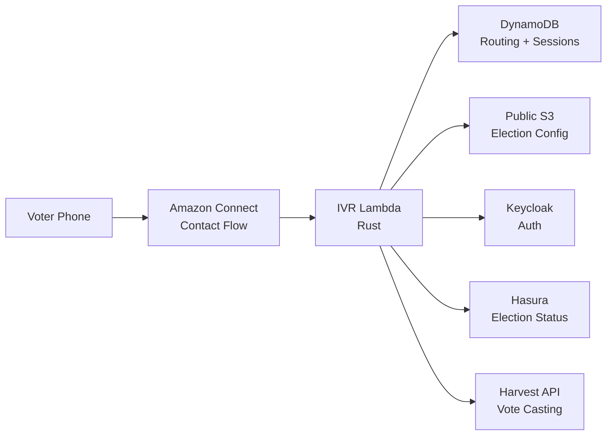

### 2.1 Component Responsibilities

| Component | Responsibility |
|-----------|----------------|
| **Amazon Connect** | Receive calls, play prompts via Polly, capture DTMF input, route to Lambda |
| **IVR Lambda** | State machine logic, prompt generation, input validation, API orchestration |
| **DynamoDB** | Phone number → cluster/environment/tenant/event routing; ephemeral call session state |
| **Public S3** | Published ballot publication: election structure, ballot styles, contests, candidates, IVR flow config, prompts, IVR-only spoken-text overrides, public keys (same data used by voting portal in preview mode) |
| **Keycloak** | Voter authentication via OIDC Direct Grant (ROPC) with configurable auth factors, JWT issuance |
| **Hasura** | Real-time election event status query (same mechanism as voting portal) |
| **Harvest API** | Cast votes via `/insert-cast-vote` |

---

## 3. Config-Driven Flow Engine

### 3.0 Design Principle

The IVR call flow is **not a hardcoded state machine**. It is a **configurable pipeline of phases** defined in the election event's `presentation.ivr.flow` configuration and published to S3. The Lambda ships with execution engines for a finite set of phase types, but which phases run, in what order, and with what settings is entirely configuration.

This means:
- Adding a declaration step, receipt readback, or phone blacklist check = config change, not code change
- Removing phases for a simpler deployment = config change
- Reordering phases = config change
- Adding a **new phase type** (e.g., ranked-choice input) = code change (new execution engine)

### 3.1 Flow Configuration

The flow is an ordered array of phases stored in `presentation.ivr.flow`:

```json
{
  "ivr": {
    "flow": [
      { "phase": "blacklist_check" },
      { "phase": "language_select" },
      { "phase": "announcement", "name": "welcome", "prompt_key": "greeting" },
      { "phase": "auth" },
      { "phase": "eligibility_check" },
      { "phase": "announcement", "name": "declaration", "prompt_key": "declaration_text", "accept_key": "2" },
      { "phase": "announcement", "name": "pre_voting_statement", "prompt_key": "pre_voting_statement" },
      { "phase": "ballot_loop", "receipt_format": "phonetic_hex_4" },
      { "phase": "goodbye" }
    ]
  }
}
```

A simpler deployment (voter ID + PIN, no frills):

```json
{
  "ivr": {
    "flow": [
      { "phase": "language_select" },
      { "phase": "announcement", "name": "welcome", "prompt_key": "greeting" },
      { "phase": "auth" },
      { "phase": "ballot_loop" },
      { "phase": "goodbye" }
    ]
  }
}
```

Same Lambda code, different config.

### 3.2 Phase Types

Each phase type has an execution engine in the Lambda. The engine handles prompting, input collection, validation, and API calls for that phase.

| Phase Type | Description | Input | Behavior |
|------------|-------------|-------|----------|
| `announcement` | Play a prompt, optionally wait for an acceptance key | None (auto-advance) or DTMF if `accept_key` set | Play the configured `prompt_key`. If `accept_key` is set, wait for that DTMF and retry on invalid input up to `max_retries`. If not, auto-advance. Used for greeting, declaration, pre-voting statement, and any other play-and-continue or play-and-confirm prompts — one engine, different config |
| `language_select` | Language selection menu | DTMF if more than 1 enabled language | If `language_conf.enabled_language_codes` contains exactly 1 language, set it automatically and advance without prompting. Otherwise collect DTMF (1=English, 2=French, etc.), set session language, advance |
| `blacklist_check` | Check caller phone against blacklist | None (auto-advance) | Query Hasura (see §6.3) for a blacklist entry matching the caller phone number; if present, play `blacklist_message` and disconnect. Because this phase runs before language selection, the message should be authored to work before the caller has chosen a language, typically by making it bilingual |
| `auth` | Collect credentials, authenticate with Keycloak | DTMF per step | Iterate through auth steps discovered via Keycloak's `/realms/\{realm\}/ivr-config` endpoint (see §5.1), submit to Keycloak ROPC. On `otp_required` error, collect OTP and resubmit. On failure, retry up to limit |
| `eligibility_check` | Validate voter eligibility and election status | None (auto-advance) | Play `eligibility_check` prompt. Check voter eligibility via API; if ineligible, play `not_eligible` and disconnect. Also query Hasura for `telephone_voting_status` (see §5.2); if not `OPEN`, play `election_closed` and disconnect |
| `ballot_loop` | Per-election voting cycle: select → confirm → submit → receipt | DTMF | The inner voting loop (see 3.3). For each election: vote all contests, read back summary, confirm, encrypt and submit ballot via Harvest API, read a ballot locator derived from the first 4 hex characters of `ballot_id` using phonetic spelling (`a3f2` → "alpha three foxtrot two"). Then advance to next election or finish. All behavior driven by published election/contest data |
| `goodbye` | Farewell message, disconnect | None (disconnect) | Play `goodbye` prompt, disconnect |

**Note on the `announcement` phase.** Three previously-separate phase types (`welcome`, `declaration`, `pre_voting_statement`) are all the same pattern: play a prompt, optionally wait for a key, advance. Collapsing them into one engine saves three execution paths, three test surfaces, and three config schemas. Each instance in the flow carries a `name` field so logs and metrics remain distinguishable (`name: "welcome"`, `name: "declaration"`, etc.).

#### Overall Phase Flow

The following diagram shows the complete end-to-end IVR call flow through all configured phases. Each box corresponds to a phase type from the table above. Diamond nodes represent phases where the call may terminate early.


#### Per-Election Submission Cycle (inside ballot_loop)

After all contests in one election are voted, the ballot loop enters the per-election submission sub-phases: `ElectionSummary` → `ElectionSubmit` → `ElectionReceipt`. Only after the ballot for the current election is submitted does the voter proceed to the next election or finish.

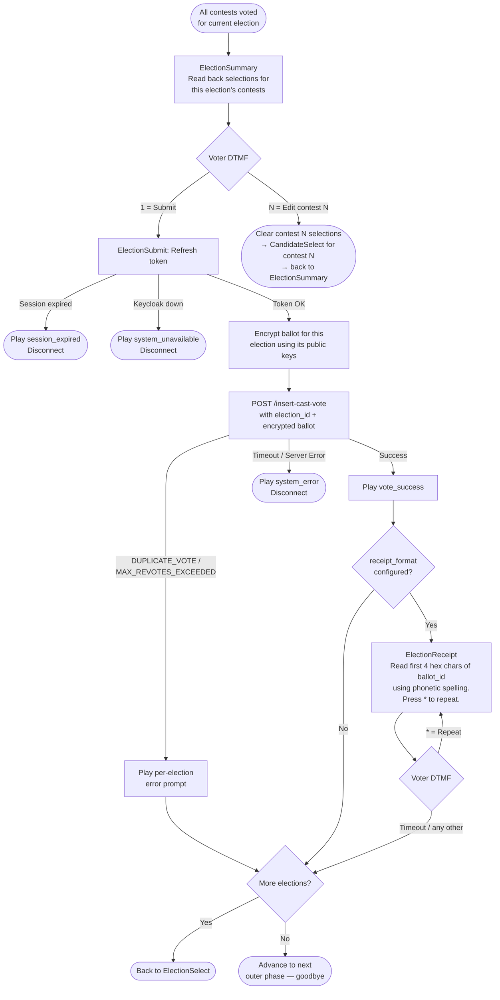

### 3.3 Ballot Loop (Inner Flow)

The `ballot_loop` phase is the most complex. Rather than implementing it as a single monolith, it is decomposed into **sub-phases** — each one a small, testable unit. The outer `ballot_loop` phase engine advances through sub-phases like a mini flow engine within the main flow.

All behavior is driven by the **published election/contest data** — the same structures the voting portal reads. The IVR Lambda honors the same config fields:

#### 3.3.1 Config Fields Consumed by the Ballot Loop

| Config Field | Source | IVR Behavior |
|---|---|---|
| `skip_election_list` | `ElectionEventPresentation` | If `true` and only 1 election: skip election selection, enter contest loop directly (same as voting portal behavior) |
| `elections_order` | `ElectionEventPresentation` | Sort elections before presenting: `alphabetical` (by alias/name), `custom` (by `sort_order`), `random` (shuffled once at session init) |
| `contests_order` | `ElectionPresentation` | Sort contests within an election: `alphabetical`, `custom`, `random` |
| `candidates_order` | `ContestPresentation` | Sort candidates within a contest: `alphabetical`, `custom`, `random`. Determines DTMF assignment order |
| `blank_vote_policy` | `ContestPresentation` | `allowed`: offer blank ballot confirmation. `warn`/`warn_only_in_review`: play warning then allow. `not_allowed`: require at least one selection |
| `under_vote_policy` | `ContestPresentation` | `allowed`: accept silently. `warn`/`warn_and_alert`: play warning before confirming. `warn_only_in_review`: warn during summary only |
| `language_conf` | `ElectionPresentation` | If the election's enabled/default language differs from the session language, offer a per-ballot language switch. If exactly 1 language is enabled for the election, select it automatically without prompting |
| `min_votes` / `max_votes` | Contest | Enforce selection count. `max_votes=1` → stop after 1 selection. `min_votes>0` + `blank_vote_policy=not_allowed` → force selection |
| `is_explicit_invalid` | `CandidatePresentation` | Skip candidates marked as explicit invalid vote options (not applicable to IVR) |
| `is_explicit_blank` | `CandidatePresentation` | Skip candidates marked as explicit blank (IVR uses dedicated blank/decline sub-phase instead) |

**Current scope note:** acclaimed contests are out of scope for the initial IVR release. If any contest has `is_acclaimed=true`, telephone voting should be rejected at publication/validation time until a dedicated acclaimed-contest flow is designed.

#### 3.3.2 Ballot Loop Sub-Phases

The ballot loop is a **nested state machine** with three levels: election → contest → candidate selection. After all contests in an election are voted, the voter reviews, confirms, and submits the ballot for that election before moving to the next one. Each level has its own sub-phases:

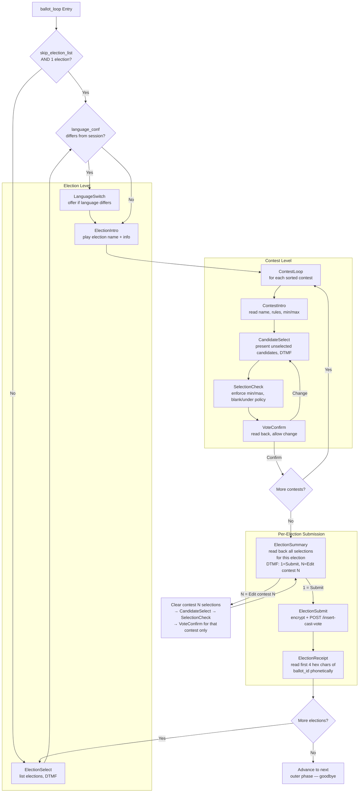

#### 3.3.3 Sub-Phase Descriptions

| Sub-Phase | Input | Behavior |
|---|---|---|
| `ElectionSelect` | DTMF | Present sorted elections (by `elections_order`). Single-digit if ≤9, multi-digit otherwise. **Skipped** if `skip_election_list=true` and only 1 election |
| `LanguageSwitch` | DTMF (1=keep, 2=switch) if multiple languages are available | Offer only if the election's `language_conf` differs from the session language. If the election exposes exactly 1 enabled language, switch automatically without prompting. Switch affects prompts for this election only. Runs **before** `ElectionIntro` so the intro is read in the correct language. **Invariant:** an election's `language_conf.enabled_language_codes` is always a subset of the election event's; additionally an election may override the `default_language_code`, so "different from session language" means either the session language is not in the election's enabled set, or the election's default differs from the currently-selected session language. Both cases trigger the offer; otherwise skip |
| `ElectionIntro` | None (auto-advance) | Play `election_intro` prompt with `\{election_name\}`, announce contest count (in the language selected by `LanguageSwitch` if applicable) |
| `ContestIntro` | None (auto-advance) or DTMF to repeat | Play `contest_intro` with `\{contest_name\}`, `\{max_votes\}`, `\{min_votes\}`. Explain rules: "Select up to \{max_votes\} candidates" |
| `CandidateSelect` | DTMF per candidate | Present only **unselected** candidates sorted by `candidates_order`. Single-digit (1-9) or multi-digit (01-99#) based on remaining count. Accumulate selections until voter signals done (`#` or `0`) or `max_votes` reached. Already-selected candidates are omitted from the list (DTMF numbers are reassigned to remaining candidates) |
| `SelectionCheck` | DTMF (confirm/restart) | Validate selections against `min_votes`/`max_votes`. Apply `blank_vote_policy`: if no selections and `allowed`→`blank_ballot_confirm`; if `not_allowed`→re-prompt. Apply `under_vote_policy`: if under minimum and `warn`→play warning then confirm |
| `VoteConfirm` | DTMF (1=confirm, 2=change) | Read back selected candidates. "You selected \{candidate_name\} for \{contest_name\}. Press 1 to confirm, 2 to change your selection" |
| `ElectionSummary` | DTMF (1=submit, N=edit contest) | Read back all selections for the current election, numbering each contest. "For contest 1, \{contest_name\}: you selected \{candidate_name\}. For contest 2, …" Press 1 to submit this election's ballot, or press a contest number to edit that contest's selection. Editing a contest clears its selections and re-enters `CandidateSelect` for that contest only — afterwards returns directly to `ElectionSummary` (not to the next contest). **Note:** summary is its own explicit confirmation — there is no separate `ElectionConfirm` step before submission |
| `ElectionSubmit` | None (auto-advance) | Refresh access token if needed, encrypt ballot with election public keys, POST `/insert-cast-vote` with `election_id`. On success → play `vote_success`, advance to `ElectionReceipt`. On per-election error (duplicate, max revotes) → play error prompt, advance to next election. On fatal error (timeout, session expired) → disconnect |
| `ElectionReceipt` | DTMF (*=repeat) | Read a ballot locator derived from the first 4 hex characters of `ballot_id`, rendered phonetically (`a3f2` → "alpha three foxtrot two"). "Your ballot locator for \{election_name\} is \{confirmation_number\}. Press * to repeat." Skipped if `receipt_format` is not configured. **Portal dependency:** the voting portal ballot locator lookup must be scoped to the authenticated voter and current election, so uniqueness only needs to hold within that smaller set |

#### 3.3.4 BallotLoopState (Session Cursor)

The ballot loop's position is tracked in `PhaseState::BallotLoop`, which acts as a cursor into the nested election→contest→sub-phase structure:

```rust
#[derive(Serialize, Deserialize, Clone)]
pub struct BallotLoopState {
    pub election_index: usize,
    pub contest_index: usize,
    pub sub_phase: BallotSubPhase,
    /// Sorted election IDs (computed once at entry using elections_order)
    pub sorted_election_ids: Vec<Uuid>,
    /// Sorted contest IDs for current election (recomputed on election change)
    pub sorted_contest_ids: Vec<Uuid>,
    /// Sorted candidate IDs for current contest (recomputed on contest change).
    /// Stays stable for the whole contest — `CandidateSelect` skips already-selected
    /// candidates when reading the list, but the underlying sort order and DTMF
    /// mapping do not change.
    pub sorted_candidate_ids: Vec<Uuid>,
    /// Accumulator for multi-selection contests
    pub pending_selections: Vec<Uuid>,
    /// Whether election selection was skipped (skip_election_list)
    pub election_list_skipped: bool,
    /// Set when the voter entered a contest via `ElectionSummary` "edit contest N".
    /// If `Some(idx)`, the contest-level flow returns to `ElectionSummary` after
    /// `VoteConfirm` instead of advancing to the next contest. Cleared on return.
    pub edit_target_contest: Option<usize>,
}

#[derive(Serialize, Deserialize, Clone)]
pub enum BallotSubPhase {
    // Election level
    ElectionSelect,
    LanguageSwitch,
    ElectionIntro,
    // Contest level
    ContestIntro,
    CandidateSelect,
    SelectionCheck,
    VoteConfirm,
    // Per-election submission
    ElectionSummary,
    ElectionSubmit,
    ElectionReceipt,
}
```

When the voter enters "edit contest N" from `ElectionSummary`, the handler sets `edit_target_contest = Some(n)`, clears `pending_selections` and the corresponding `votes[contest_id]` entry, and transitions to `CandidateSelect`. The `VoteConfirm` sub-phase checks `edit_target_contest` on exit: if set, it clears the field and transitions directly to `ElectionSummary`; otherwise it advances to the next contest as normal.

#### 3.3.5 Candidate Selection Detail

Candidate presentation follows the same ordering as the voting portal (`candidates_order`), then assigns DTMF mappings:

```rust
fn assign_dtmf_mappings(
    candidates: &[CandidateContext],
) -> Vec<(CandidateContext, String)> {
    let use_multi_digit = candidates.len() > 9;
    candidates.iter().enumerate().map(|(i, c)| {
        let dtmf = if use_multi_digit {
            format!("{:02}", i + 1)  // "01", "02", ..., "99"
        } else {
            format!("{}", i + 1)     // "1", "2", ..., "9"
        };
        (c.clone(), dtmf)
    }).collect()
}
```

Candidates with `is_explicit_invalid: true` or `is_explicit_blank: true` in `CandidatePresentation` are **excluded** from the IVR candidate list — the IVR handles blank/decline through dedicated sub-phases instead of special candidate entries.

#### 3.3.6 Shared `LanguageSelector` Component

The outer `LanguageSelect` phase (event-level) and the inner `LanguageSwitch` sub-phase (per-election override) share the same logic: if only 1 language is enabled, select it automatically; otherwise offer the enabled set, collect a DTMF digit, update `session.language`, advance. They are implemented on top of a single `LanguageSelector` helper parameterized by scope:

```rust
pub enum LanguageScope {
    Event,
    Election { election_id: Uuid },
}

pub fn run_language_selector(
    session: &mut IvrSession,
    input: Option<&str>,
    scope: LanguageScope,
    enabled_codes: &[String],
    default_code: &str,
    prompts: &IvrPromptResolver,
) -> Result<ConnectResponse, IvrError> { /* ... */ }
```

Both the outer phase engine and the ballot-loop sub-phase dispatch to this helper. One implementation, one set of tests, two call sites.

### 3.4 Multi-Digit DTMF Input Handling

Amazon Connect supports multi-digit DTMF collection, enabling support for more than 9 options:

**Single-Digit Mode (1-9 options)**:
- Immediate capture after single keypress
- Best UX: "Press 1 for Alice, Press 2 for Bob..."
- Use for: Language selection, most contests

**Multi-Digit Mode (10-99 options)**:
- Collect 2 digits terminated by pound key (#)
- Prompts: "Enter the two-digit candidate number followed by pound"
- Example: "Candidate 01: Alice Smith, Candidate 02: Bob Johnson... Candidate 15: Zoe Martinez"
- Amazon Connect "Get customer input" block configured with "Maximum digits: 2" and terminator: "#"

**Special Codes**:
- `0` or `00#`: Skip/abstain (if allowed)
- `99#`: Repeat instructions (in multi-digit mode)
- `9`: Repeat instructions (in single-digit mode)

**Practical Limits**:
- **1-9 candidates**: Single-digit input (optimal UX)
- **10-30 candidates**: Two-digit input acceptable
- **>30 candidates**: Consider pagination or warn that phone voting may not be suitable
- **>99 candidates**: Not supported via phone (usability limit, not technical)

**Implementation Notes**:
- Lambda detects option count and instructs Connect whether to use single or multi-digit mode
- Prompts adapt based on mode: "Press 1" vs "Enter 0-1 followed by pound"
- Listing >20 candidates takes several minutes; consider pagination or summary mode

### 3.5 Hexagonal Architecture & Flow Engine

The IVR Lambda follows **hexagonal architecture** (ports & adapters). The domain logic (flow engine, phase engines, ballot loop) has zero knowledge of AWS, DynamoDB, S3, or HTTP. All external dependencies are behind **port traits**, with concrete **adapters** injected at startup.

#### 3.5.1 Architecture Overview

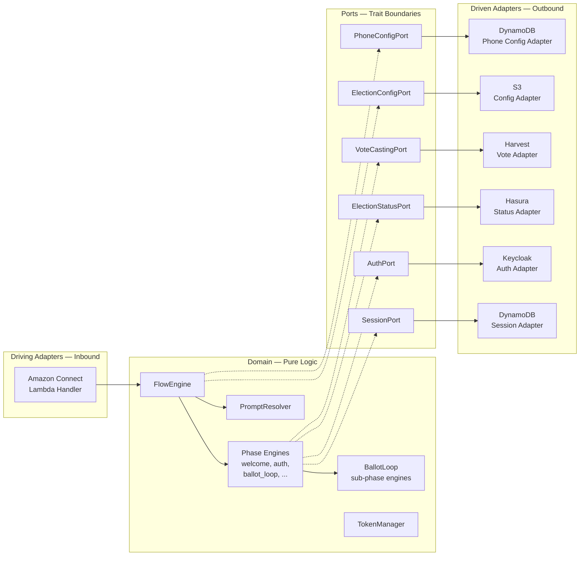

#### 3.5.2 Port Traits

```rust
/// --- Outbound Ports (driven side) ---

#[async_trait]
pub trait SessionPort: Send + Sync {
    async fn get_session(&self, contact_id: &str) -> Result<Option<IvrSession>, IvrError>;
    async fn save_session(&self, session: &IvrSession) -> Result<(), IvrError>;
    async fn delete_session(&self, contact_id: &str) -> Result<(), IvrError>;
}

#[async_trait]
pub trait AuthPort: Send + Sync {
    async fn authenticate(&self, realm: &str, credentials: &AuthCredentials) -> Result<TokenPair, AuthError>;
    async fn refresh_token(&self, realm: &str, refresh_token: &str) -> Result<TokenPair, AuthError>;
}

#[async_trait]
pub trait ElectionConfigPort: Send + Sync {
    /// Adapter resolves the S3 path internally (e.g., via well-known key convention
    /// or by listing the publication directory for the event).
    async fn get_published_config(
        &self,
        base_url: &str,
        tenant_id: &Uuid,
        election_event_id: &Uuid,
    ) -> Result<PublishedBallotPublication, IvrError>;
}

#[async_trait]
pub trait ElectionStatusPort: Send + Sync {
    async fn get_election_event_status(
        &self,
        base_url: &str,
        jwt: &str,
        event_id: &Uuid,
    ) -> Result<ElectionEventStatus, IvrError>;
}

#[async_trait]
pub trait VoteCastingPort: Send + Sync {
    async fn cast_vote(
        &self,
        base_url: &str,
        jwt: &str,
        ballot: &EncryptedBallot,
    ) -> Result<CastVoteResponse, IvrError>;
}

#[async_trait]
pub trait PhoneConfigPort: Send + Sync {
    async fn get_config(&self, phone_number: &str) -> Result<Option<PhoneConfig>, IvrError>;
}
```

#### 3.5.3 Domain: Flow Engine

**Key Concept:** Lambda is **stateless**. Each invocation reads session from DynamoDB (including the flow position), executes the current phase, saves the updated position, and responds.

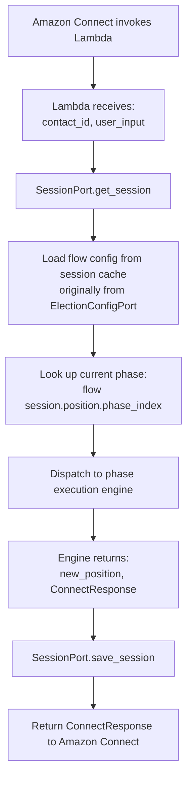

```rust
/// Domain service — no AWS/HTTP/DB dependencies.
///
/// Note that `FlowEngine` does not *own* the flow pipeline or prompts; it
/// borrows them from the cached published config for the current call. The
/// engine itself is zero-sized and stateless.
pub struct FlowEngine<'a> {
    flow_config: &'a [FlowPhase],
    prompts: &'a IvrPromptResolver,
}

impl FlowEngine<'_> {
    pub fn execute(
        &self,
        session: &mut IvrSession,
        input: Option<&str>,
        ports: &dyn PhasePorts,  // trait object combining needed ports
    ) -> Result<ConnectResponse, IvrError> {
        let phase = self
            .flow_config
            .get(session.position.phase_index)
            .ok_or(IvrError::InvalidPhaseIndex(session.position.phase_index))?;

        // Typed exhaustive match — compiler verifies all variants are handled.
        // No UnknownPhaseType error variant needed, because deserialization
        // would have failed on an unknown `phase` tag.
        match phase {
            FlowPhase::Announcement(cfg) =>
                AnnouncementPhase::execute(session, input, self.prompts, cfg),
            FlowPhase::LanguageSelect =>
                LanguageSelectPhase::execute(session, input, self.prompts),
            FlowPhase::BlacklistCheck =>
                BlacklistCheckPhase::execute(session, input, self.prompts, ports),
            FlowPhase::Auth =>
                AuthPhase::execute(session, input, self.prompts, ports.auth()),
            FlowPhase::EligibilityCheck =>
                EligibilityCheckPhase::execute(session, input, self.prompts, ports),
            FlowPhase::BallotLoop(cfg) =>
                BallotLoopPhase::execute(session, input, self.prompts, ports, cfg),
            FlowPhase::Goodbye =>
                GoodbyePhase::execute(session, input, self.prompts),
        }
    }
}

/// Trait that groups the ports a phase might need (subset injection)
pub trait PhasePorts: Send + Sync {
    fn auth(&self) -> &dyn AuthPort;
    fn election_status(&self) -> &dyn ElectionStatusPort;
    fn vote_casting(&self) -> &dyn VoteCastingPort;
}

/// Each phase implements this trait
pub trait PhaseEngine {
    fn execute(
        &self,
        session: &mut IvrSession,
        input: Option<&str>,
        prompts: &IvrPromptResolver,
    ) -> Result<ConnectResponse, IvrError>;
}
```

#### 3.5.4 Domain: Ballot Loop Phase (Sub-Phase Dispatch)

The `BallotLoopPhase` delegates to sub-phase engines based on the `BallotSubPhase` cursor in session state:

```rust
pub struct BallotLoopPhase;

impl BallotLoopPhase {
    pub fn execute(
        session: &mut IvrSession,
        input: Option<&str>,
        prompts: &IvrPromptResolver,
        ports: &dyn PhasePorts,  // available if sub-phases need election status
    ) -> Result<ConnectResponse, IvrError> {
        // Initialize on first entry
        let ballot_state = match &session.position.phase_state {
            PhaseState::BallotLoop(state) => state.clone(),
            PhaseState::Entry => {
                let state = Self::init_ballot_loop(session)?;
                session.position.phase_state = PhaseState::BallotLoop(state.clone());
                state
            }
            _ => return Err(IvrError::InvalidState),
        };

        // Dispatch to current sub-phase
        match ballot_state.sub_phase {
            // Election level
            BallotSubPhase::ElectionSelect =>
                ElectionSelectSubPhase::execute(session, input, prompts),
            BallotSubPhase::LanguageSwitch =>
                LanguageSwitchSubPhase::execute(session, input, prompts),
            BallotSubPhase::ElectionIntro =>
                ElectionIntroSubPhase::execute(session, input, prompts),
            // Contest level
            BallotSubPhase::ContestIntro =>
                ContestIntroSubPhase::execute(session, input, prompts),
            BallotSubPhase::CandidateSelect =>
                CandidateSelectSubPhase::execute(session, input, prompts),
            BallotSubPhase::SelectionCheck =>
                SelectionCheckSubPhase::execute(session, input, prompts),
            BallotSubPhase::VoteConfirm =>
                VoteConfirmSubPhase::execute(session, input, prompts),
            // Per-election submission
            BallotSubPhase::ElectionSummary =>
                ElectionSummarySubPhase::execute(session, input, prompts),
            BallotSubPhase::ElectionSubmit =>
                ElectionSubmitSubPhase::execute(session, input, prompts, ports),
            BallotSubPhase::ElectionReceipt =>
                ElectionReceiptSubPhase::execute(session, input, prompts),
        }
    }

    fn init_ballot_loop(
        session: &IvrSession,
        published: &PublishedBallotPublication,
    ) -> Result<BallotLoopState, IvrError> {
        // Sort elections using the same logic as voting portal
        let sorted_election_ids = sort_elections(
            &published.elections,
            published.event_presentation.elections_order.as_ref(),
        );

        // `skip_election_list` is a presentation policy that lives in the
        // published ballot publication — not a separate session field.
        let skip = published.event_presentation.skip_election_list.unwrap_or(false)
            && sorted_election_ids.len() == 1;

        let initial_sub_phase = if skip {
            BallotSubPhase::LanguageSwitch
        } else {
            BallotSubPhase::ElectionSelect
        };

        Ok(BallotLoopState {
            election_index: 0,
            contest_index: 0,
            sub_phase: initial_sub_phase,
            sorted_election_ids,
            sorted_contest_ids: vec![],
            sorted_candidate_ids: vec![],
            pending_selections: vec![],
            election_list_skipped: skip,
            edit_target_contest: None,
        })
    }
}
```

#### 3.5.5 Driving Adapter: Lambda Handler

The handler is a thin adapter — it wires ports together and delegates to the domain:

```rust
async fn handler(event: ConnectEvent) -> Result<ConnectResponse, LambdaError> {
    let contact_id = &event.Details.ContactData.ContactId;
    let user_input = event.Details.Parameters.get("user_input");

    // Adapters (created once, reused across invocations via Lambda runtime)
    let session_port: &dyn SessionPort = &dynamo_session_adapter;
    let phone_config_port: &dyn PhoneConfigPort = &dynamo_phone_adapter;
    let config_port: &dyn ElectionConfigPort = &s3_config_adapter;
    let ports: &dyn PhasePorts = &live_ports;  // groups auth, status, vote casting

    // Load or create session
    let mut session = match session_port.get_session(contact_id).await? {
        Some(s) => s,
        None => {
            let caller_phone = &event.Details.ContactData.CustomerEndpoint.Address;
            let phone_config = phone_config_port.get_config(caller_phone).await?
                .ok_or(IvrError::UnknownPhoneNumber)?;
            IvrSession::new(contact_id, &phone_config)
        }
    };

    // Fetch the published config for this session. The adapter is
    // responsible for caching at the Lambda process level keyed by
    // (tenant_id, election_event_id, publication_id) — a warm container
    // serves concurrent calls from a single shared copy. Session state
    // stores only `publication_id`, not the config itself, to keep
    // DynamoDB items well under the 400 KB per-item limit.
    let published = config_port.get_published_config(
        &session.tenant_id,
        &session.election_event_id,
        session.publication_id.as_deref(),
    ).await?;

    // Domain logic — pure, testable, no AWS dependencies
    let engine = FlowEngine {
        flow_config: &published.ivr_flow,
        prompts: &published.prompts,
    };
    let response = engine.execute(&mut session, user_input.as_deref(), ports)?;

    session_port.save_session(&session).await?;
    Ok(response)
}
```

#### 3.5.6 Testing Strategy

Hexagonal architecture makes every layer independently testable:

```rust
// Unit test: domain logic with mock ports
#[test]
fn ballot_loop_skips_election_select_when_single_election() {
    let mut session = test_session_with_one_election();
    session.election_event_presentation.skip_election_list = Some(true);

    let mock_ports = TestPorts::default();
    let result = BallotLoopPhase::execute(&mut session, None, &test_prompts(), &mock_ports);

    // Should jump straight to LanguageSwitch (then ElectionIntro), not ElectionSelect
    match &session.position.phase_state {
        PhaseState::BallotLoop(state) => {
            assert!(state.election_list_skipped);
            assert_eq!(state.sub_phase, BallotSubPhase::LanguageSwitch);
        }
        _ => panic!("Expected BallotLoop state"),
    }
}

#[tokio::test]
async fn election_submit_refreshes_token_before_casting() {
    let mock_auth = MockAuthPort::new()
        .expect_refresh_token()
        .returning(|_, _| Ok(fresh_token_pair()));
    let mock_vote = MockVoteCastingPort::new()
        .expect_cast_vote()
        .returning(|_, _, _| Ok(cast_vote_response()));
    let ports = TestPorts::new(mock_auth, mock_vote);

    let mut session = test_session_authenticated();
    let result = ElectionSubmitSubPhase::execute(&mut session, None, &test_prompts(), &ports);
    assert!(result.is_ok());
}
```

#### 3.5.7 Why Hexagonal Architecture

1. **Testable** — Domain logic tested with mock ports; no DynamoDB/S3/HTTP in unit tests
2. **Portable** — Same domain could run in a different runtime (e.g., local CLI for testing) by swapping adapters
3. **Isolated changes** — Switching from DynamoDB to Redis = new adapter, zero domain changes. Adding a new external service = new port + adapter
4. **Phase engines are pure** — Given session state + input, produce new state + response. No side effects except through ports
5. **Config-driven** — Flow composition is data, not code. Adding/removing phases = config change
6. **Ballot behavior from source of truth** — Contest rules (blank, decline, min/max, ordering) read from published election data, same as voting portal

### 3.6 Channel-Specific Voting Periods

Phone voting can have independent start/stop times from online voting, following the same pattern as KIOSK and EARLY_VOTING channels:

```rust
pub struct ElectionEventStatus {
    pub voting_status: VotingStatus,
    pub kiosk_voting_status: VotingStatus,
    pub early_voting_status: VotingStatus,
    pub telephone_voting_status: VotingStatus,  // NEW

    pub voting_period_dates: PeriodDates,
    pub kiosk_voting_period_dates: PeriodDates,
    pub early_voting_period_dates: PeriodDates,
    pub telephone_voting_period_dates: PeriodDates,  // NEW
}
```

This allows administrators to configure phone voting hours independently (e.g., phone voting 9am-5pm, online voting 24/7).

---

## 4. Data Models

### 4.1 DynamoDB Session State Table

**Table Name**: `ivr-voting-sessions`

**Primary Key**: `contact_id` (Amazon Connect Contact ID)

```rust
/// Per-call session state stored in DynamoDB.
///
/// **Design note — what is NOT here.** The published ballot publication
/// (`flow_config`, `prompts`, `elections`, `auth_steps`, `election_event_presentation`)
/// is *not* duplicated in the session. It is fetched from public S3 and cached
/// at the Lambda process level, keyed by `(tenant_id, election_event_id,
/// publication_id)`, so all concurrent calls in a warm Lambda container share
/// a single copy. This matters: DynamoDB items are capped at **400 KB** per
/// row, and a large municipality (dozens of contests × hundreds of candidates
/// × multiple languages of prompts) can blow past that if the config is cached
/// per-session. See §5.1.8 for the publication-discovery flow.
#[derive(Serialize, Deserialize)]
pub struct IvrSession {
    // Primary key
    pub contact_id: String,

    // Call metadata
    pub caller_phone: String,
    pub call_start_time: DateTime<Utc>,
    pub tenant_id: Uuid,
    pub election_event_id: Uuid,
    /// Publication identifier — used as the key into the process-level
    /// published-config cache. Resolving this once at session init pins the
    /// call to a consistent snapshot even if a new publication lands mid-call.
    pub publication_id: String,

    // Authentication
    pub voter_id: Option<String>,
    pub access_token: Option<String>,
    pub refresh_token: Option<String>,
    pub access_token_expires_at: Option<i64>,  // Unix timestamp, from token `exp` claim
    pub session_started_at: Option<i64>,
    pub area_id: Option<Uuid>,

    // Language
    pub language: String,  // language code, e.g., "en", "fr"

    // Votes in progress (accumulated during ballot_loop)
    pub votes: HashMap<Uuid, ContestVote>, // contest_id -> vote

    // Submission results (populated during ElectionSubmit sub-phase, one per election)
    pub submission_results: Vec<ElectionSubmissionResult>,

    // Flow engine position — cursor + phase-local state
    pub position: FlowPosition,

    /// Per-error-class retry counters. Reset semantics differ per counter —
    /// see `RetryCounters` below and §8.1
    pub retries: RetryCounters,

    // TTL for DynamoDB cleanup
    pub ttl: i64,
}

/// Separate retry counters by error class. A single counter would mix up
/// unrelated kinds of failure — e.g. "3rd invalid DTMF while picking a
/// candidate" would cross-contaminate "3rd auth attempt". Each counter has
/// its own reset semantics:
///
/// - `auth` — cleared on successful authentication.
/// - `invalid_input` — cleared on any phase or sub-phase transition (so each
///   sub-phase gets a fresh budget of retries, mirroring Barrie's model).
/// - `timeout` — cleared on any successful DTMF capture.
///
/// Maximums are configurable per flow via `ivr.retry_limits` (see §7.3), which
/// is edited in the admin portal's "IVR Flow" tab.
#[derive(Serialize, Deserialize, Clone, Default)]
pub struct RetryCounters {
    pub auth: u8,
    pub invalid_input: u8,
    pub timeout: u8,
}

/// Flow position: cursor into the phase pipeline plus per-phase state.
///
/// The state enum mirrors the `FlowPhase` enum: the variant at `state` must
/// correspond to the variant of `flow_config[phase_index]`. Each phase carries
/// its own state shape, so there is no generic "entry / waiting / done" state
/// that every phase has to interpret.
#[derive(Serialize, Deserialize, Clone)]
pub struct FlowPosition {
    pub phase_index: usize,
    pub state: PhaseState,
}

/// Phase-internal state — one variant per `FlowPhase` variant.
#[derive(Serialize, Deserialize, Clone)]
pub enum PhaseState {
    Announcement(AnnouncementState),
    LanguageSelect(SimpleState),
    BlacklistCheck(SimpleState),
    Auth(AuthState),
    EligibilityCheck(SimpleState),
    BallotLoop(BallotLoopState),
    Goodbye(SimpleState),
}

/// Fallback state for phases whose execution collapses to "play, optionally
/// wait for input, advance." Every phase engine starts in `Entry` on first
/// invocation and moves to `WaitingForInput` when it has asked for DTMF.
#[derive(Serialize, Deserialize, Clone)]
pub enum SimpleState {
    Entry,
    WaitingForInput,
}

#[derive(Serialize, Deserialize, Clone)]
pub struct AnnouncementState {
    pub simple: SimpleState,
}

#[derive(Serialize, Deserialize, Clone)]
pub struct AuthState {
    /// Which auth step (from the list discovered via /ivr-config) the Lambda
    /// is currently collecting.
    pub step_index: usize,
    /// True once the Lambda has submitted credentials and Keycloak returned
    /// `otp_required` — it is now collecting an OTP before resubmitting.
    pub waiting_for_otp: bool,
}

/// The flow pipeline — a typed enum instead of a `{ phase: String, config:
/// HashMap<String, Value> }` pair. This is a direct application of the
/// CLAUDE.md rule "policies use enums, not booleans / magic strings." The
/// dispatcher match in `FlowEngine::execute` becomes exhaustive (compiler-
/// verified coverage), the admin portal's IVR Flow editor can render form
/// fields from the variant shape, and a typo in a config key is caught at
/// deserialization time instead of mid-call.
#[derive(Serialize, Deserialize, Clone)]
#[serde(tag = "phase", rename_all = "snake_case")]
pub enum FlowPhase {
    /// Play a prompt, optionally wait for an acceptance key. Covers the
    /// former `welcome` / `declaration` / `pre_voting_statement` phases.
    Announcement(AnnouncementConfig),
    LanguageSelect,
    BlacklistCheck,
    Auth,
    EligibilityCheck,
    BallotLoop(BallotLoopConfig),
    Goodbye,
}

#[derive(Serialize, Deserialize, Clone)]
pub struct AnnouncementConfig {
    /// Non-semantic label used for logs, metrics, and admin-portal rendering.
    /// Examples: "welcome", "declaration", "pre_voting_statement".
    pub name: String,
    /// Prompt key looked up in the i18n bundle for the current language.
    pub prompt_key: String,
    /// If `Some("2")`, the voter must press `2` to advance (Barrie declaration
    /// style). If `None`, the engine auto-advances after playing the prompt.
    pub accept_key: Option<String>,
}

#[derive(Serialize, Deserialize, Clone, Default)]
pub struct BallotLoopConfig {
    /// A 4-character ballot locator read back phonetically, or none at all.
    pub receipt_format: Option<ReceiptFormat>,
}

#[derive(Serialize, Deserialize, Clone)]
#[serde(rename_all = "snake_case")]
pub enum ReceiptFormat {
    PhoneticHex4,
}

/// One auth step — retrieved from Keycloak's /ivr-config endpoint, NOT from S3.
/// The list of steps reflects the realm's Direct Grant flow execution order.
#[derive(Serialize, Deserialize, Clone)]
pub struct AuthStep {
    pub field: String,           // Semantic name, e.g. "voter_id", "pin", "dob"
    pub max_digits: u8,          // DTMF input max length
    pub terminator: String,      // "#", "*", or ""
    pub maps_to: String,         // ROPC form param: "username", "password", "dob", etc.
    pub prompt_key: Option<String>, // Override; if None, derive from maps_to (see §5.1.3)
}

/// The subset of `ElectionEventPresentation` relevant to the IVR flow. Lives
/// in the process-level cached publication, NOT in the DynamoDB session.
#[derive(Serialize, Deserialize, Clone)]
pub struct IvrEventPresentation {
    pub elections_order: Option<ElectionsOrder>,
    pub language_conf: Option<ElectionEventLanguageConf>,
    pub skip_election_list: Option<bool>,
}

#[derive(Serialize, Deserialize)]
pub struct ElectionContext {
    pub election_id: Uuid,
    pub election_name: String,
    pub contests: Vec<ContestContext>,
    // Ordering & presentation (from ElectionPresentation)
    pub sort_order: Option<i64>,
    pub contests_order: Option<ContestsOrder>,
    pub language_conf: Option<ElectionEventLanguageConf>,
}

#[derive(Serialize, Deserialize)]
pub struct ContestContext {
    pub contest_id: Uuid,
    pub contest_name: String,
    pub max_votes: u8,
    pub min_votes: u8,
    pub candidates: Vec<CandidateContext>,
    // Ordering & presentation (from ContestPresentation)
    pub sort_order: Option<i64>,
    pub candidates_order: Option<CandidatesOrder>,
    pub blank_vote_policy: Option<EBlankVotePolicy>,
    pub under_vote_policy: Option<EUnderVotePolicy>,
    // Read during validation so IVR can reject currently-unsupported acclaimed contests.
    pub is_acclamation: bool,
}

#[derive(Serialize, Deserialize)]
pub struct CandidateContext {
    pub candidate_id: Uuid,
    pub candidate_name: String,
    pub sort_order: Option<i64>,
    pub dtmf_option: String,  // assigned at session init based on candidates_order
}

#[derive(Serialize, Deserialize)]
pub struct ContestVote {
    pub contest_id: Uuid,
    pub selected_candidate_ids: Vec<Uuid>,
    pub is_blank: bool,
    pub is_declined: bool,
}

/// Result of submitting one election's ballot during the ElectionSubmit sub-phase
#[derive(Serialize, Deserialize)]
pub struct ElectionSubmissionResult {
    pub election_id: Uuid,
    pub status: SubmissionStatus,
    /// Ballot hash — used to derive the spoken ballot locator in ElectionReceipt.
    /// Current format: first 4 hex characters, read back phonetically.
    pub ballot_hash: Option<String>,
}

#[derive(Serialize, Deserialize)]
pub enum SubmissionStatus {
    Success,
    DuplicateVote,
    MaxRevotesExceeded,
    NotEligible,
    Failed { error: String },
}
```

### 4.2 Lambda Request/Response Models

```rust
// Amazon Connect invokes Lambda with this structure
#[derive(Deserialize)]
pub struct ConnectEvent {
    pub Details: ContactDetails,
}

#[derive(Deserialize)]
pub struct ContactDetails {
    pub ContactData: ContactData,
    pub Parameters: HashMap<String, String>,
}

#[derive(Deserialize)]
pub struct ContactData {
    pub ContactId: String,
    pub CustomerEndpoint: Endpoint,
    pub Attributes: HashMap<String, String>,
}

#[derive(Deserialize)]
pub struct Endpoint {
    pub Address: String, // Phone number
    pub Type: String,    // "TELEPHONE_NUMBER"
}

// Lambda returns this to Amazon Connect.
//
// Minimum viable shape — no SSML, no debug state, no error flags. Errors are
// just prompts that set `should_disconnect = true`; the contact flow does not
// need to know whether a given response is an "error" response. Internal
// phase-state debugging belongs in CloudWatch structured logs (§10.2), not in
// the Connect attribute bag.
#[derive(Serialize)]
pub struct ConnectResponse {
    /// Text-to-speech prompt to play via Polly.
    pub prompt_text: String,
    /// Whether the contact flow should capture DTMF after the prompt.
    pub expect_input: bool,
    /// Valid DTMF digits (e.g. "123456789"). Empty if `expect_input = false`.
    pub valid_inputs: String,
    /// Seconds to wait for DTMF before timing out.
    pub input_timeout: u8,
    /// If true, contact flow disconnects after the prompt plays.
    pub should_disconnect: bool,
}
```

---

## 5. API Integration

### 5.1 Authentication Flow

Authentication uses **standard OIDC Direct Grant (ROPC)** via Keycloak's token endpoint. The Lambda does not know what authentication factors are required — it discovers them at runtime by asking Keycloak, collects credentials accordingly, and submits them to the token endpoint.

**Design principle: Keycloak is the single source of truth for auth configuration.** The realm's Direct Grant flow already defines which credentials are required; duplicating that into `presentation.ivr.auth` in S3 would create drift between the two. Instead, the Lambda queries a small custom Keycloak REST endpoint that derives the auth step list from the realm's flow executions.

#### 5.1.1 How It Works

1. **At session init**, Lambda calls `GET {KEYCLOAK_URL}/realms/\{realm\}/ivr-config` — a custom Keycloak REST extension that walks the realm's Direct Grant flow and returns an ordered list of auth steps
2. Lambda caches the response in the DynamoDB session record (same cache used for S3 election config)
3. For each step, Lambda prompts for DTMF input using a **well-known prompt key** derived from the step's `maps_to` field (see 5.1.3)
4. Lambda maps collected fields to ROPC form parameters and POSTs to Keycloak's token endpoint
5. If Keycloak returns `otp_required` error, Lambda dynamically collects OTP via DTMF and resubmits with `otp` parameter — no pre-configuration needed
6. On success, Lambda stores the JWT and proceeds to the next flow phase

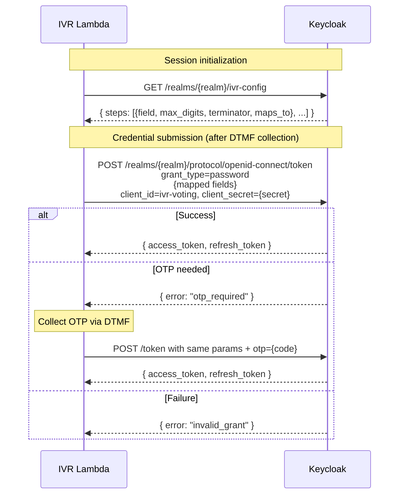

The Lambda doesn't know whether it's collecting a PIN, DoB, or any other credential — it just iterates the discovered steps, collects digits, and maps them to ROPC parameters. Keycloak validates them using the authenticators configured on the realm's Direct Grant flow.

#### 5.1.2 The `ivr-config` Keycloak Endpoint

A new Keycloak REST extension (`ivr-config-resource`, see Appendix C.8.2) exposes a single endpoint:

```
GET /realms/{realm}/ivr-config
```

**Response:**
```json
{
  "steps": [
    { "field": "voter_id", "max_digits": 8, "terminator": "#", "maps_to": "username" },
    { "field": "dob",      "max_digits": 8, "terminator": "#", "maps_to": "password" }
  ]
}
```

**How the endpoint builds the response** (~100 lines of Java — see Appendix C.8.2 for full implementation notes):

1. Look up the effective Direct Grant flow for the `ivr-voting` client (client-level override if present, else realm default)
2. Walk the flow's executions in order, filtering to `ENABLED` / `REQUIRED`
3. For each execution, produce a step from one of two sources:
   - **Stock Keycloak authenticators** — a small static lookup table baked into the extension:
     - `direct-grant-validate-username` → `{ field: "voter_id", max_digits: 8, terminator: "#", maps_to: "username" }`
     - `direct-grant-validate-password` → `{ field: "pin", max_digits: 8, terminator: "#", maps_to: "password" }`
   - **Custom IVR authenticators** (`IvrDobAuthenticator`, etc.) — read the execution's `AuthenticatorConfig`, which the admin configures in the Keycloak admin UI. Each custom authenticator declares these keys in its `getConfigProperties()`: `field_name`, `max_digits`, `terminator`, `maps_to`
4. Skip `IvrOtpDirectGrantAuthenticator` — OTP is discovered dynamically via the `otp_required` error response, not declared up front
5. Return the list as JSON

The endpoint is public (no auth required). The shape of auth steps is not sensitive — voters already know what to enter — and making it public avoids needing an admin or client-credentials token for every IVR session.

**If the admin adds a non-IVR-aware authenticator** to the flow, the endpoint returns `500 Internal Server Error` with a clear message identifying the unknown authenticator ID, so misconfigurations surface at deployment time instead of mid-call.

#### 5.1.3 Prompt Keys — Well-Known by `maps_to`

The Lambda uses a **fixed, well-known mapping** from ROPC parameter name to prompt key. This keeps the config minimal — since auth fields are essentially just "username", "password", and a few standard custom fields, admins only need to provide translations for a handful of prompt keys that never vary per election.

| `maps_to` value | Prompt key | Typical content |
|---|---|---|
| `username` | `auth_enter_username` | "Please enter your voter ID followed by the number sign key." |
| `password` | `auth_enter_password` | "Please enter your PIN (or date of birth) followed by the number sign key." |
| `dob` (custom) | `auth_enter_dob` | "Please enter your date of birth as MMDDYYYY followed by the number sign key." |
| `otp` (dynamic) | `auth_otp_sent` + `auth_enter_otp` | "A code has been sent to your phone. Please enter it followed by the number sign key." |

These keys live in `presentation.i18n[lang].ivr`, the same namespace used for all IVR prompts and IVR-only spoken-text overrides. The admin provides translations in the admin portal's IVR Prompts editor. The Lambda ships sensible English/French defaults for each well-known key as a fallback.

**If a custom authenticator uses a new `maps_to` value** that isn't in the table, the admin can override the prompt key via the authenticator's `AuthenticatorConfig` (`prompt_key` property). The endpoint passes it through in the step response:

```json
{ "field": "birth_year", "max_digits": 4, "terminator": "#", "maps_to": "birth_year", "prompt_key": "auth_enter_birth_year" }
```

Lambda precedence: step's explicit `prompt_key` (if present) > well-known mapping by `maps_to` > error.

#### 5.1.4 OTP Flow (Discovered Dynamically)

OTP is **not declared** in the config. The Lambda reacts to Keycloak's response:

1. Lambda submits the first ROPC call with collected credentials
2. Keycloak runs its Direct Grant flow. If `IvrOtpDirectGrantAuthenticator` is in the flow and no `otp` form param was supplied, it generates/sends a code and returns `{ error: "otp_required" }`
3. Lambda transitions to `AuthOtpWait` phase state, plays `auth_otp_sent` prompt, collects the OTP code via DTMF
4. Resubmits all original credentials + `otp={code}` to the same token endpoint
5. On success → JWT issued. On failure → retry or disconnect

This is the same pattern Keycloak uses for TOTP in direct grants. No IVR-side config is needed — whether OTP runs is purely a Keycloak flow decision. The `IvrOtpDirectGrantAuthenticator` (see Appendix C.8.1) handles the server side.

#### 5.1.5 Keycloak Direct Grant Flow Configuration

The realm's Direct Grant flow uses `ConditionalClientAuthenticator` (already in `packages/keycloak-extensions/conditional-authenticators/`) to branch by client ID:

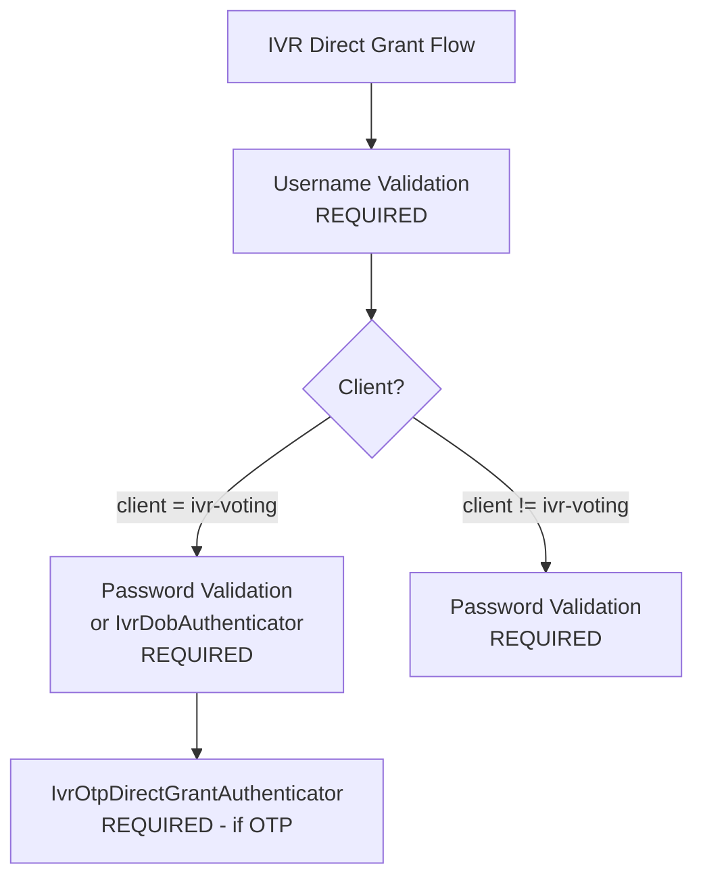

The same realm handles both web portal and IVR authentication. The Keycloak admin configures which authenticators are active for the `ivr-voting` client in the Keycloak admin UI — **this is the one and only place** auth is configured. The IVR Lambda learns about it automatically via `/ivr-config`.

#### 5.1.6 Custom Keycloak Authenticators & Extensions

| Component | When Needed | Complexity | Description |
|---|---|---|---|
| `ivr-config-resource` | **Always** (replaces S3 auth config) | ~100 lines Java | `RealmResourceProvider` exposing `GET /realms/\{realm\}/ivr-config`. Walks the Direct Grant flow and returns auth steps |
| `IvrDobAuthenticator` | Optional — only if DoB is NOT stored as password | ~80 lines Java | Reads `dob` from form params, validates against user's `date_of_birth` attribute. Declares `field_name`/`max_digits`/`terminator`/`maps_to` as config properties |
| `IvrOtpDirectGrantAuthenticator` | Required if OTP is used | ~150 lines Java | If `otp` absent: generate/send/store code, return error. If `otp` present: validate, clear, succeed |

Custom authenticators must declare the IVR metadata fields in their `getConfigProperties()` so the `ivr-config-resource` can read them back:

```java
public static final List<ProviderConfigProperty> CONFIG_PROPERTIES = ProviderConfigurationBuilder.create()
    .property().name("field_name").type(STRING_TYPE).label("IVR field name").add()
    .property().name("max_digits").type(STRING_TYPE).label("IVR max DTMF digits").add()
    .property().name("terminator").type(STRING_TYPE).label("IVR terminator key").defaultValue("#").add()
    .property().name("maps_to").type(STRING_TYPE).label("ROPC form parameter").add()
    .property().name("prompt_key").type(STRING_TYPE).label("IVR prompt key override (optional)").add()
    .build();
```

The OTP authenticator reuses existing infrastructure from `packages/keycloak-extensions/message-otp-authenticator/`:
- Code generation: `SecretGenerator` (from `Utils`)
- SMS: `SmsSenderProvider` SPI (`AwsSmsSenderProvider`, `TwilioVerifySenderProvider`, `DummySmsSenderProvider`)
- Email: `EmailTemplateProvider` + `AwsSesEmailSenderProvider`
- Validation: `Utils.constantTimeIsEqual()`

If the election uses simple voter ID + PIN (where PIN = Keycloak password), no custom authenticators are needed — only `ivr-config-resource` needs to be deployed.

#### 5.1.7 Caching & Invalidation

The Lambda caches the `/ivr-config` response per-realm in DynamoDB with a **5-minute TTL**. This bounds the blast radius of stale config after an admin change while keeping per-call overhead near zero.

- Calls in flight when the admin updates the flow finish using the cached config (safe — the auth step list is forward-compatible with ROPC)
- New calls pick up the change within 5 minutes
- Ops can flush the cache manually (DynamoDB delete) for emergency rollout

#### 5.1.8 IVR Config Discovery — S3 + Keycloak

IVR session config comes from **two sources**:

1. **Public S3 (published ballot publication)** — election structure, prompts, flow pipeline, presentation
2. **Keycloak `/ivr-config` endpoint** — authentication step list (see 5.1.2)

**The IVR flow, prompts, and IVR-only spoken-text overrides are part of the frozen ballot publication.** Once a publication is cut, its `ivr.flow` + `i18n[lang].ivr` data is immutable — admin edits in the portal only take effect after a new publication is produced. This is a deliberate choice: the ballot publication is an attested, signed artifact used by the voting portal in preview mode, and pulling IVR presentation out of it would fragment the source of truth. Admins who need to change IVR prompts or spoken overrides after ballot freeze run a new publication, same as any other presentation edit. (The blacklist is the one exception — it changes too frequently to live in the publication; see §6.3.)

**Published ballot publication structure** (`tenant-\{tenantId\}/document-\{documentId\}/\{publicationId\}.json`):
```json
{
  "ballot_styles": [
    // Ballot EML: contests, candidates, public keys, presentation config
  ],
  "elections": [
    // Election metadata, presentation, voting channels
    // Note: voting_status is always "OPEN" in published data (static snapshot)
  ],
  "election_event": {
    // Full event: presentation (IVR flow + prompts, NOT auth steps),
    // i18n (including IVR prompts and spoken-text overrides), language_conf, voting_channels
  },
  "support_materials": [...],
  "documents": [...]
}
```

**What the IVR Lambda reads from published S3 data:**
- `election_event.presentation.ivr.flow` — phase pipeline
- `election_event.presentation.i18n[lang]["ivr"]` — event-level prompts and spoken-text overrides (including the well-known auth prompt keys)
- `election_event.presentation.language_conf` — enabled languages
- `ballot_styles[].ballot_eml` — contests, candidates, min/max votes, public keys
- `elections[].presentation.i18n[lang]["ivr"]` — election-level prompts and spoken-text overrides
- `contests[].presentation.i18n[lang]["ivr"]` / `candidates[].presentation.i18n[lang]["ivr"]` — contest/candidate spoken-text overrides used only by IVR
- `elections[].voting_channels` — which channels are enabled

**What the IVR Lambda reads from Keycloak `/ivr-config`:**
- The ordered list of auth steps (field, max_digits, terminator, maps_to, optional prompt_key override)

**What is NOT available from S3 (requires Harvest API):**
- Real-time voting status (S3 always shows `voting_status: "OPEN"`)
- Vote submission

**Publication flow:**
1. Admin configures IVR flow + prompts/overrides in admin portal (**not** auth steps — those live in Keycloak)
2. Settings stored in `presentation.ivr.flow` and `presentation.i18n[lang]["ivr"]` in PostgreSQL
3. Ballot publication task generates the publication JSON and uploads to public S3
4. Auth flow is configured separately by the admin in the Keycloak admin UI (realm's Direct Grant flow)
5. Published data is publicly accessible — no authentication needed

**Lambda session initialization:**
1. Call arrives → Lambda reads DynamoDB `ivr-phone-config` → gets S3 base URL + tenant_id + election_event_id + keycloak realm
2. Lambda fetches published ballot publication JSON from public S3
3. Lambda fetches auth step list from `{KEYCLOAK_URL}/realms/\{realm\}/ivr-config` (cached 5 min)
4. Both sets cached in DynamoDB session
5. Flow engine begins executing the configured phase pipeline

**Keycloak Realm**: `tenant-\{tenantId\}-event-\{eventId\}`

**Required Keycloak Configuration**:
- Deploy `ivr-config-resource` extension (see Appendix C.8.2)
- Create `ivr-voting` client with `direct-access-grants` enabled (see Appendix C.8)
- Configure Direct Grant flow with conditional branching for `ivr-voting` client — **this is now the only place auth is configured**
- Configure voters with voter ID as username
- Credential storage matches the Direct Grant flow (e.g., password credential for PIN, or user attribute + `IvrDobAuthenticator` for DoB)
- For custom authenticators (`IvrDobAuthenticator`, etc.): fill in their `AuthenticatorConfig` (`field_name`, `max_digits`, `terminator`, `maps_to`) so the `/ivr-config` endpoint can return them
- If OTP: deploy `IvrOtpDirectGrantAuthenticator` and add to Direct Grant flow
- JWT claims include `area_id` and `authorized_election_ids` (via existing `AuthorizedElectionsUserAttributeMapper`)

#### 5.1.9 Token Expiry Handling (Critical)

**The Problem**:
JWT tokens have limited lifetimes. From the current Keycloak configuration:
- `accessTokenLifespan`: 300 seconds (5 minutes)
- `ssoSessionIdleTimeout`: 1800 seconds (30 minutes) - refresh token idle timeout
- `ssoSessionMaxLifespan`: 36000 seconds (10 hours) - max session duration
- `refreshTokenMaxReuse`: 0 (single-use refresh tokens)

Phone calls can easily exceed 5 minutes, especially for:
- Voters needing to repeat instructions
- Elections with multiple contests
- Elderly voters or those with accessibility needs

**Risk**: If access token expires mid-call and we can't refresh, the voter completes all selections but vote submission fails with 401.

**Token Lifecycle Constraints**:
1. **Access token** (5 min): Can be refreshed using refresh token
2. **Refresh token**: Valid while SSO session is active
   - Idle timeout: 30 min of inactivity invalidates it
   - Max lifespan: 10 hours absolute limit
   - Single-use: Each refresh returns a new refresh token
3. **SSO Session**: The underlying session that backs the refresh token

**Proposed Solution - Proactive Token Refresh**:

```rust
pub struct TokenManager {
    access_token: String,
    refresh_token: String,
    access_token_expires_at: Instant,
    // We don't know exact refresh token expiry, but we track last activity
    last_refresh_at: Instant,
}

impl TokenManager {
    const ACCESS_TOKEN_REFRESH_THRESHOLD: Duration = Duration::from_secs(60); // Refresh 1 min before expiry

    pub fn access_token_needs_refresh(&self) -> bool {
        Instant::now() + Self::ACCESS_TOKEN_REFRESH_THRESHOLD >= self.access_token_expires_at
    }

    pub async fn ensure_valid_token(&mut self, keycloak: &KeycloakClient) -> Result<&str, AuthError> {
        if self.access_token_needs_refresh() {
            self.refresh_with_retry(keycloak).await?;
        }
        Ok(&self.access_token)
    }

    async fn refresh_with_retry(&mut self, keycloak: &KeycloakClient) -> Result<(), AuthError> {
        const MAX_RETRIES: u32 = 2;
        const RETRY_DELAY_MS: u64 = 500;

        for attempt in 1..=MAX_RETRIES {
            match keycloak.refresh_token(&self.refresh_token).await {
                Ok(tokens) => {
                    self.access_token = tokens.access_token;
                    self.refresh_token = tokens.refresh_token; // New refresh token (single-use)
                    self.access_token_expires_at = Instant::now()
                        + Duration::from_secs(tokens.expires_in);
                    self.last_refresh_at = Instant::now();
                    return Ok(());
                }
                Err(e) => {
                    // Classify the error
                    match self.classify_refresh_error(&e) {
                        RefreshErrorType::Transient if attempt < MAX_RETRIES => {
                            // Retry on network errors
                            tokio::time::sleep(Duration::from_millis(RETRY_DELAY_MS * attempt as u64)).await;
                            continue;
                        }
                        RefreshErrorType::Transient => {
                            // Max retries exceeded on transient error
                            return Err(AuthError::KeycloakUnavailable);
                        }
                        RefreshErrorType::TokenExpired => {
                            return Err(AuthError::SessionExpired);
                        }
                        RefreshErrorType::Unauthorized => {
                            return Err(AuthError::ConfigurationError);
                        }
                    }
                }
            }
        }
        Err(AuthError::KeycloakUnavailable)
    }

    fn classify_refresh_error(&self, error: &reqwest::Error) -> RefreshErrorType {
        if error.is_timeout() || error.is_connect() {
            RefreshErrorType::Transient
        } else if let Some(status) = error.status() {
            match status.as_u16() {
                400 | 401 => RefreshErrorType::TokenExpired,
                403 => RefreshErrorType::Unauthorized,
                500..=599 => RefreshErrorType::Transient,
                _ => RefreshErrorType::TokenExpired,
            }
        } else {
            RefreshErrorType::Transient
        }
    }
}

enum RefreshErrorType {
    Transient,      // Network issues, Keycloak temporarily down
    TokenExpired,   // Refresh token invalid/expired
    Unauthorized,   // Client misconfigured or disabled
}
```

**Session State in DynamoDB**: Token management fields are part of `IvrSession` (see Section 4.1): `access_token`, `refresh_token`, `access_token_expires_at`, `session_started_at`.

**When to Refresh**:
1. **Before vote submission** (critical path): Always refresh if within threshold
2. **On each Lambda invocation**: Check and refresh proactively
3. **After authentication**: Store both tokens and expiry

**Refresh Failure Handling Strategy**:

| Error Type | Cause | Detection | Retry? | User Message |
|------------|-------|-----------|--------|--------------|
| **Transient** | Network issue, Keycloak restart, load spike | Connection timeout, DNS failure, 5xx errors | Yes (2 retries, 500ms delay) | "We're experiencing technical difficulties. Please try again later." |
| **TokenExpired** | Idle timeout (>30 min) or max lifespan (>10 hrs) | 400/401 from Keycloak | No | "Your session has expired. Please call back to vote again." |
| **Unauthorized** | IVR client disabled, realm misconfigured | 403 from Keycloak | No | "The voting system is temporarily unavailable. Please try again later." |

**Error Response Codes**:
```rust
pub enum AuthError {
    SessionExpired,          // 400/401 - refresh token invalid
    KeycloakUnavailable,     // Transient errors after retries
    ConfigurationError,      // 403 - client issue
}
```

**Critical Path - Vote Submission with Failure Handling**:

```rust
async fn submit_vote(
    session: &mut IvrSession,
    auth: &dyn AuthPort,
    vote_casting: &dyn VoteCastingPort,
) -> Result<VoteResult, IvrError> {
    // Proactively refresh token before the critical vote submission path
    let refresh_token = session.refresh_token.as_deref()
        .ok_or(IvrError::SessionExpired { prompt_key: "session_expired", should_disconnect: true })?;
    let realm = &session.keycloak_realm();

    match auth.refresh_token(realm, refresh_token).await {
        Ok(tokens) => {
            // Update session with new tokens
            session.access_token = Some(tokens.access_token.clone());
            session.refresh_token = Some(tokens.refresh_token);
            session.access_token_expires_at = Some(tokens.expires_at);

            let area_id = session.area_id
                .ok_or(IvrError::InvalidState)?;

            // Submit via port trait — no knowledge of Harvest/HTTP
            vote_casting.cast_vote(
                &session.harvest_url(),
                &tokens.access_token,
                &ballot,
            ).await
        }
        Err(AuthError::SessionExpired) => {
            // Voter session expired - cannot recover
            Err(IvrError::SessionExpired {
                prompt_key: "session_expired",
                should_disconnect: true,
            })
        }
        Err(AuthError::KeycloakUnavailable) => {
            // Keycloak is down - critical system error
            // Log alert for operations team
            self.emit_critical_alert("keycloak_unavailable_during_vote");

            Err(IvrError::SystemTemporarilyUnavailable {
                prompt_key: "system_unavailable",
                should_disconnect: true,
                is_critical: true,
            })
        }
        Err(AuthError::ConfigurationError) => {
            // IVR client misconfigured - critical config error
            self.emit_critical_alert("ivr_client_unauthorized");

            Err(IvrError::SystemConfigurationError {
                prompt_key: "system_unavailable",
                should_disconnect: true,
            })
        }
    }
}
```

**Graceful Degradation for Non-Critical Paths**:

For operations that are NOT vote submission (e.g., checking election status), we can be more lenient:

```rust
async fn check_election_status(
    session: &IvrSession,
    auth: &dyn AuthPort,
    election_status: &dyn ElectionStatusPort,
) -> Result<VotingStatus, IvrError> {
    let access_token = session.access_token.as_deref()
        .ok_or(IvrError::SessionExpired { prompt_key: "session_expired", should_disconnect: true })?;
    let event_id = session.election_event_id
        .ok_or(IvrError::InvalidState)?;

    // Try with current token first; if expired, attempt refresh then retry
    match election_status.get_election_event_status(
        &session.hasura_url(), access_token, &event_id,
    ).await {
        Ok(status) => Ok(status.telephone_voting_status),
        Err(api_err) if api_err.is_unauthorized() => {
            // Token expired — try refresh via auth port
            let refresh_token = session.refresh_token.as_deref()
                .ok_or(IvrError::SessionExpired { prompt_key: "session_expired", should_disconnect: true })?;
            let tokens = auth.refresh_token(&session.keycloak_realm(), refresh_token).await
                .map_err(|_| IvrError::SessionExpired { prompt_key: "session_expired", should_disconnect: true })?;

            // Retry with fresh token
            match election_status.get_election_event_status(
                &session.hasura_url(), &tokens.access_token, &event_id,
            ).await {
                Ok(status) => Ok(status.telephone_voting_status),
                Err(e) => Err(e.into()),
            }
        }
        Err(api_err) => Err(api_err.into()),
    }
}
```

**Operational Monitoring**:

Critical metrics to track:
- `ivr.token.refresh.success` - counter
- `ivr.token.refresh.failure.transient` - counter (alerts if spike)
- `ivr.token.refresh.failure.expired` - counter (expected, monitor trends)
- `ivr.token.refresh.failure.unauthorized` - counter (ALERT immediately)
- `ivr.vote.submission.failed.token_error` - counter (CRITICAL alert)

**Alerting Rules**:
1. **CRITICAL**: `ivr.vote.submission.failed.token_error` > 0 in 5 minutes
   - Action: Page on-call engineer immediately
   - Reason: Voters completing calls but can't submit votes

2. **HIGH**: `ivr.token.refresh.failure.unauthorized` > 5 in 1 minute
   - Action: Alert ops team
   - Reason: IVR client misconfigured or disabled

3. **MEDIUM**: `ivr.token.refresh.failure.transient` > 20% of attempts
   - Action: Alert ops team
   - Reason: Keycloak connectivity issues

**Keycloak Configuration Recommendations for IVR**:
Consider adjusting IVR client-specific settings (can be per-client in Keycloak):
- `accessTokenLifespan`: Could increase to 15-30 min for IVR client
- `ssoSessionIdleTimeout`: 60 min for IVR (calls can have pauses)
- `ssoSessionMaxLifespan`: Keep at 10 hours (reasonable max call duration)

**Implementation Notes**:
- Store `refresh_token` securely in DynamoDB (encrypted at rest)
- Always use the new refresh token after each refresh (single-use policy)
- Log token refresh events (without token values) for debugging
- Monitor refresh failure rate as operational metric

### 5.2 Check Election Status via Hasura GraphQL

Election structure, contests, and candidates are loaded from the published S3 data (see 5.1.8). However, the published S3 data is a **static snapshot** where `voting_status` is always `"OPEN"`. The IVR Lambda needs to query Hasura to check the **real-time** status of telephone voting before proceeding. This is the same mechanism the voting portal uses (`GET_ELECTION_EVENT` query).

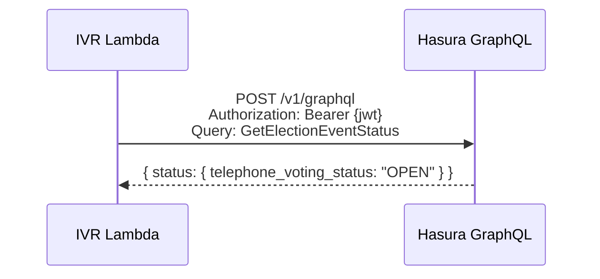

**Endpoint:** `POST https://\{HASURA_DOMAIN\}/v1/graphql`

**GraphQL Query:**
```graphql
query GetElectionEventStatus($eventId: uuid!) {
  sequent_backend_election_event_by_pk(id: $eventId) {
    status
  }
}
```

The `status` field is a JSON object containing per-channel statuses:
```json
{
  "voting_status": "OPEN",
  "kiosk_voting_status": "CLOSED",
  "early_voting_status": "CLOSED",
  "telephone_voting_status": "OPEN"
}
```

**Purpose**: Verify that telephone voting is currently open. The Lambda checks the `telephone_voting_status` field:
- `OPEN` → proceed with voting
- `CLOSED` / `NOT_STARTED` → play `election_closed` prompt and disconnect

**When called**: After authentication (JWT required), before entering the ballot loop.

**Note**: This is a UX optimization to fail early with a clear message. The backend also validates channel status during `insert_cast_vote` via `status_by_channel(voting_channel)`, so a vote submitted to a closed telephone channel would be rejected regardless.

### 5.3 Cast Vote via Harvest API

IVR Lambda calls the **Harvest API** directly to submit encrypted ballots.

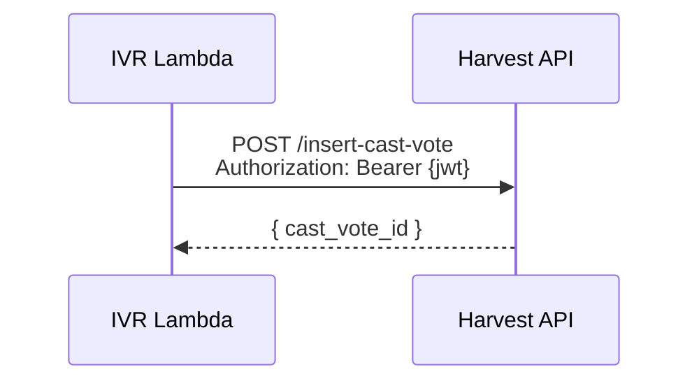

**Endpoint:** `POST https://\{HARVEST_DOMAIN\}/insert-cast-vote`

**Input Structure**:
```json
{
  "ballot_id": "...",
  "election_id": "...",
  "content": "{encrypted_ballot}"
}
```

**Headers:**
- `Authorization: Bearer \{jwt\}`
- JWT must have `azp: "ivr-voting"` to identify TELEPHONE channel
- Harvest extracts `area_id` from JWT claims

### 5.4 Backend Error Handling for Vote Submission

**Overview:**
Backend (Harvest) validates all vote submission rules including revotes, eligibility, and duplicate votes. IVR Lambda simply handles error responses gracefully.

**Backend Validation:**
- Duplicate vote detection
- Maximum revotes enforcement (per election configuration)
- Voter eligibility checks
- Voting period validation

**Error Handling:**

```rust
match harvest_client.cast_vote(&input).await {
    Ok(response) => {
        // Success
        Ok(VoteSubmitted { cast_vote_id: response.cast_vote_id })
    }
    Err(ApiError::BackendRejection { error_code, message }) => {
        // Per-election rejection — play error prompt but continue to next election
        let prompt_key = match error_code.as_str() {
            "DUPLICATE_VOTE" => "duplicate_vote",
            "MAX_REVOTES_EXCEEDED" => "max_revotes_exceeded",
            "NOT_ELIGIBLE" => "not_eligible",
            _ => "vote_failed"
        };

        // Don't disconnect — record the per-election error and continue
        // submitting remaining elections. Only disconnect after all
        // elections have been attempted.
        Err(IvrError::VoteRejected {
            prompt_key,
            should_disconnect: false,
        })
    }
    Err(ApiError::Timeout) => {
        // Fatal: system-level error, disconnect immediately
        Err(IvrError::ApiTimeout {
            prompt_key: "system_error",
            should_disconnect: true,
        })
    }
    // ... other error handling
}
```

**Error Prompts:**

Backend errors use prompt keys from `i18n[lang]["ivr"]`. Per-election errors are announced but do not end the call — the `ElectionSubmit` sub-phase reports the error and the ballot loop advances to the next election:
- `duplicate_vote`: "You have already voted in this election." (continue to next election)
- `max_revotes_exceeded`: "You have reached the maximum number of allowed votes for this election." (continue to next election)
- `not_eligible`: "You are not eligible to vote in this election." (continue to next election)
- `vote_failed`: "We were unable to record your vote. Please try again later." (continue to next election)

Fatal errors (network timeout, session expired, Keycloak unavailable) disconnect immediately since they affect all elections.

**Simplicity:**
- No frontend filtering needed
- Backend is source of truth — Harvest validates per-election
- IVR translates backend errors to user-friendly messages
- Each election is submitted independently; one failure does not block others

---

## 6. Multi-Tenancy & Municipality Discrimination

### 6.1 Phone Number to Tenant Mapping

Since a single phone number may serve multiple municipalities, we need a way to determine which tenant/election event a caller should access.

**Option A: Dedicated Phone Numbers per Municipality** (Recommended for Canada)
- Each municipality gets a dedicated Amazon Connect phone number
- Lambda maps phone number → tenant_id + election_event_id
- Configuration stored in DynamoDB or Parameter Store

**Option B: Single Phone Number with Municipality Selection**
- Caller dials single number
- IVR asks: "For Municipality A, press 1. For Municipality B, press 2..."
- More complex UX but lower cost

### 6.2 Phone Number Configuration Table

**Table Name**: `ivr-phone-config`

This DynamoDB table serves as a **routing table** — it maps phone numbers to the correct cluster, environment, and election event. It intentionally does NOT store election configuration (auth steps, prompts, etc.), which lives in PostgreSQL and is published to public S3.

```rust
#[derive(Serialize, Deserialize)]
pub struct PhoneConfig {
    pub phone_number: String,        // E.164 format: +1234567890
    pub tenant_id: Uuid,
    pub election_event_id: Uuid,

    // Cluster + environment routing
    pub cluster: String,             // e.g., "prod1-euw1", "testing-euw1"
    pub environment: String,         // e.g., "qa", "dev", "staging", "cixug"
    pub keycloak_url: String,        // https://keycloak.{environment}.{cluster}.sequentech.io
    pub harvest_url: String,         // https://harvest.{environment}.{cluster}.sequentech.io
    pub hasura_url: String,          // https://hasura.{environment}.{cluster}.sequentech.io
    pub s3_public_base_url: String,  // https://{public-bucket}.s3.amazonaws.com

    pub default_language: Language,
    pub enabled: bool,
}
```

**Multi-Environment Support**:

The IVR system can serve multiple clusters and environments. Clusters are infrastructure groups (e.g., `prod1-euw1`, `prod2-use1`, `testing-euw1`). Environments are tenants/deployments within a cluster (e.g., `qa`, `dev`, `staging`, `cixug`). Two deployment approaches:

**Approach 1: Shared Lambda with Dynamic Routing (Configuration-based)**
- Single IVR Lambda deployment
- Phone number lookup in `ivr-phone-config` determines cluster + environment URLs
- Lambda routes API calls to the correct cluster/environment endpoints
- Whitelisting: Only phone numbers in DynamoDB table with `enabled: true` can access the system

**Approach 2: Per-Cluster Lambda Deployment (Recommended)**
- Deploy separate IVR Lambda per cluster (e.g., `ivr-lambda-prod1-euw1`, `ivr-lambda-testing-euw1`)
- Each Lambda has cluster-level URLs in environment variables (simpler config)
- Amazon Connect routing profiles direct phone numbers to correct Lambda
- `ivr-phone-config` still stores environment + tenant + event mapping within the cluster
- Cleaner separation, easier version management across clusters

**Isolation**:
- Cluster-level: Per-cluster Lambda deployment naturally isolates clusters
- Environment-level: Keycloak realms provide tenant isolation (`tenant-\{id\}-event-\{id\}`), URLs are environment-scoped
- Phone-level: Only enabled entries in `ivr-phone-config` table work

### 6.3 Phone Blacklist (Hasura-Backed)

The `blacklist_check` phase consults a **Hasura table**, not DynamoDB. The blacklist is domain data — it is managed alongside the rest of the election event by the same admin users who manage voters, and it benefits from Hasura's row-level authorization, audit trails, and migration tooling rather than being a sidecar AWS table owned by the IVR.

**What needs to be built:**

1. **Hasura table** `sequent_backend.ivr_phone_blacklist` with columns:
   - `phone_number` (E.164, primary key or unique per tenant)
   - `tenant_id` (FK)
   - `election_event_id` (nullable — blacklist can be scoped to an event or tenant-wide)
   - `reason` (optional free text)
   - `created_at`, `created_by`
2. **Hasura permissions** — a new permission (e.g. `can_manage_phone_blacklist`) granted to admin roles that should be able to CRUD blacklist entries. Scoped to their tenant.
3. **Harvest endpoints** to create, list, and delete blacklist entries (these wrap the Hasura mutations with the existing permission-check middleware). The IVR Lambda reads the blacklist via an authenticated Hasura GraphQL query during the `blacklist_check` phase — but the Lambda runs `blacklist_check` pre-auth, so either (a) Harvest exposes an anonymous read endpoint that only returns "blocked yes/no" for a given phone number, or (b) the Lambda uses a service account JWT for this query. Option (a) is simpler and surfaces less.
4. **Admin-portal UI** — a "Phone Blacklist" management view under the Election Event settings, with list + add + remove actions, tied to the new Hasura permission.

**Why not DynamoDB?** Same reason auth config went to Keycloak: it belongs to the domain. Putting it in DynamoDB would duplicate responsibilities, bypass Hasura's permission/migration/audit pipeline, and force the admin portal to talk to two different backends for data that is logically part of the election event. One source of truth wins.

**Why not part of the published ballot publication (S3)?** Because blacklists change more often than ballots are published, and an admin needs to be able to block a phone mid-election without re-running the ballot publication pipeline. Keep the publication immutable and artifact-like; keep the blacklist mutable and operational.

---

## 7. Internationalization (i18n) & IVR Prompts

### 7.1 Leveraging Existing Infrastructure

The platform already supports:
- **`telephone` channel** in `VotingChannels` struct (`packages/sequent-core/src/types/hasura/core.rs:207`)
- **i18n pattern** via `presentation.i18n` with nested structure `\{lang: \{key: value\}\}`
- **Per-election presentation** via `ElectionPresentation` (`packages/sequent-core/src/ballot.rs:1218`)
- **Per-event presentation** via `ElectionEventPresentation` (`packages/sequent-core/src/ballot.rs:963`)
- **Channel-based authorization** via JWT `azp` claim (`packages/sequent-core/src/services/authorization.rs:110`)

### 7.2 IVR Prompt Storage - Inside Existing i18n Structure

**Key Decision:** IVR prompts and IVR-only spoken-text overrides are stored **inside** the existing `presentation.i18n` object under an `"ivr"` key. This keeps all translations in one place and follows Felix's recommendation.

#### Structure Overview

No changes are needed to the existing presentation structs. `ElectionEventPresentation`, `ElectionPresentation`, `ContestPresentation`, and `CandidatePresentation` already expose the nested `i18n` shape that IVR can reuse for both prompt keys and spoken-text overrides:
```rust
pub struct ElectionEventPresentation {
    pub i18n: Option<I18nContent<I18nContent<Option<String>>>>,
    // ... existing fields ...
    // NO separate ivr_prompts field needed
}
```

#### Storage Pattern

IVR strings are nested inside `i18n` under the `"ivr"` key:

```
presentation.i18n = {
  "en": {
    "name": "Election Name",
    "description": "Portal-facing description",
    "alias": "Election Alias",
    "ivr": {  // ← IVR prompts + IVR-only spoken-text overrides
      "name": "Election name optimized for telephone readback",
      "description": "Telephone version of the election description",
      "greeting": "Welcome...",
      "auth_enter_username": "Please enter your voter ID...",
      "auth_enter_password": "Please enter your PIN...",
      ...
    }
  },
  "fr": {
    "name": "Nom de l'élection",
    "ivr": {
      "greeting": "Bienvenue...",
      ...
    }
  }
}
```

At contest and candidate scope, the same pattern lives under `presentation.i18n[lang]["ivr"]`, leaving the existing `name_i18n` / `description_i18n` fields untouched for the voting portal while giving IVR an override path when the spoken version needs to differ.

#### IVR-Only Spoken Text Overrides

The `ivr` namespace is an **override system**, not a second full copy of the translation tree. If an IVR-only value is absent, the Lambda falls back to the normal portal text.

Typical keys:
- `name`
- `alias`
- `description`

Example candidate override:

```json
{
  "presentation": {
    "i18n": {
      "en": {
        "ivr": {
          "name": "<lang xml:lang=\"fr-CA\">Jean-François Côté</lang>"
        }
      }
    }
  }
}
```

In that example, the voting portal can continue showing the regular English or bilingual candidate name, while IVR gets a spoken-only override tailored for text-to-speech.

#### Mixed-Language Readback with SSML

Amazon Polly supports SSML `<lang xml:lang="...">` tags, and Amazon Connect supports passing SSML prompts through to Polly. That makes it reasonable to allow SSML fragments directly inside IVR overrides and prompt templates for short mixed-language phrases such as:

```xml
<speak>You selected <lang xml:lang="fr-CA">Jean-François Côté</lang> for Mayor.</speak>
```

Design note:
- IVR overrides and prompt templates may contain SSML fragments such as `<lang>`, `<phoneme>`, or `<say-as>`
- If any resolved string contains SSML markup, the final rendered prompt should be sent to Polly as SSML and wrapped once in `<speak>...</speak>`
- This is best suited to names and short phrases; Polly's `lang` tag changes pronunciation rules, but many voices will still sound accented rather than fully native unless a bilingual voice is used

Official references:
- [Amazon Polly: Using the `lang` tag](https://docs.aws.amazon.com/polly/latest/dg/lang-tag.html)
- [Amazon Connect: Supported SSML tags](https://docs.aws.amazon.com/connect/latest/adminguide/supported-ssml-tags.html)

#### Rust Type: Dynamic IVR String Map

IVR strings are deserialized as `HashMap<String, String>`, not fixed structs. This means adding new prompt keys or spoken-text overrides (e.g., `declaration_text`, `receipt_info`, `blank_ballot_confirm`, `name`) never requires code changes:

```rust
/// IVR strings: HashMap<key, value>
/// Deserialized from presentation.i18n[lang]["ivr"]
type IvrStrings = HashMap<String, String>;

fn get_ivr_strings(i18n: &I18nContent, lang: &str) -> IvrStrings {
    i18n.get(lang)
        .and_then(|lang_content| lang_content.get("ivr"))
        .and_then(|ivr_value| serde_json::from_value(ivr_value.clone()).ok())
        .unwrap_or_default()
}
```

#### Benefits of This Approach

1. **All IVR strings in one place** - no separate `ivr_prompts` or `ivr_overrides` field
2. **Backward compatible** - missing `"ivr"` key means no IVR prompts (use defaults)
3. **Follows existing pattern** - same structure as `"name"`, `"alias"`, etc.
4. **Override-based** - only spoken differences need to be entered; everything else falls back to portal text
5. **Fully extensible** - any prompt key can be added in config without code changes
6. **Admin portal simplicity** - edit within existing i18n editor

### 7.3 Example: Barrie-Style Full Configuration

**ElectionEvent presentation (complex Barrie-style deployment with declaration, receipt, etc.):**
```json
{
  "presentation": {
    "ivr": {
      "flow": [
        { "phase": "blacklist_check" },
        { "phase": "language_select" },
        { "phase": "announcement", "name": "welcome", "prompt_key": "greeting" },
        { "phase": "auth" },
        { "phase": "eligibility_check" },
        { "phase": "announcement", "name": "declaration", "prompt_key": "declaration_text", "accept_key": "2" },
        { "phase": "announcement", "name": "pre_voting_statement", "prompt_key": "pre_voting_statement" },
        { "phase": "ballot_loop", "receipt_format": "phonetic_hex_4" },
        { "phase": "goodbye" }
      ],
      "retry_limits": { "auth": 3, "invalid_input": 3, "timeout": 3 },
      "assistance_phone": "1-800-555-0199"
    },
    "i18n": {
      "en": {
        "name": "City of Barrie 2025 Municipal Election",
        "ivr": {
          "greeting": "Welcome to the phone voting service for the City of Barrie 2025 Municipal Election.",
          "language_select": "For English, press 1. Pour le français, appuyez sur 2.",
          "auth_enter_username": "Using your touch-tone phone, please enter your voter ID followed by the number sign key.",
          "auth_enter_password": "Using your touch-tone phone, please enter your date of birth using two digits for the month and day, and four digits for the year. Please press the number sign key following your date of birth entry.",
          "auth_failed": "Your voting credentials are not valid. Please refer to your voting instructions for the correct voter credentials and try again.",
          "auth_max_attempts": "You seem to be having trouble. Please contact the Voter Assistance Line if you need assistance at {assistance_phone}.",
          "blacklist_message": "Your telephone number is blocked. For English, please contact the Voter Assistance Line. Pour le français, veuillez communiquer avec la ligne d'assistance aux électeurs. Goodbye.",
          "eligibility_check": "The system will now validate your eligibility to vote. One moment please.",
          "not_eligible": "You are not authorized to vote in this election. Please refer to your voting instructions and contact the Voter Assistance Line if you need assistance. Goodbye.",
          "not_active": "Your voting credentials have been deactivated. Please refer to your voting instructions and contact the Voter Assistance Line if you need assistance. Goodbye.",
          "declaration_text": "In accordance with the Municipal Elections Act you are eligible to vote... [full legal declaration text]. Please press 2 to agree with the terms.",
          "pre_voting_statement": "If you get disconnected or leave the phone voting process before you submit your ballot, you will need to hang up and call the phone voting system again. Your vote will only be cast once you confirmed all your selections AND submitted your ballot.",
          "already_selected": "You have already selected this option. Please enter your next selection now.",
          "blank_ballot_confirm": "You have not made a selection therefore your ballot will be cast as blank. To confirm your intent to cast a blank ballot, press the number sign key now. To repeat the list of options press the star key now.",
          "decline_confirm": "By selecting 'Decline to vote' you will not vote for any candidate in this election. To submit your declined ballot, press the number sign key now. To not decline and start your selection, press zero key now.",
          "summary_intro": "Here is a summary of your selections for {election_name}.",
          "summary_item": "For contest {contest_number}, {contest_name}: you selected {candidate_name}.",
          "summary_edit_prompt": "Press 1 to continue to submission, or press a contest number to change your selection for that contest.",
          "summary_edit_restart": "Changing your selection for {contest_name}. Your previous selections for this contest have been cleared.",
          "receipt_info": "You are about to be given a 4-character ballot locator for each election. You may choose to write it down for your reference.",
          "receipt_number": "Your ballot locator for {election_name} is {confirmation_number}. To repeat, please press the star key.",
          "system_error": "We're experiencing technical difficulties. Please try your call again later.",
          "invalid_input": "That is an invalid input. Please re-enter your selection.",
          "timeout": "We have not detected any input or the number sign key.",
          "goodbye": "Thank you for your participation. Goodbye."
        }
      },
      "fr": {
        "name": "Élections municipales de Barrie 2025",
        "ivr": {
          "greeting": "Bienvenue au service de vote téléphonique des élections municipales 2025 de Barrie.",
          "auth_enter_username": "Veuillez entrer votre numéro d'électeur suivi de la touche carré.",
          "auth_enter_password": "Veuillez entrer votre date de naissance en utilisant deux chiffres pour le mois et le jour, et quatre chiffres pour l'année. Appuyez sur la touche carré après votre saisie.",
          "auth_failed": "Vos informations de vote ne sont pas valides. Veuillez vous référer à vos instructions de vote et réessayer.",
          "goodbye": "Merci de votre participation. Au revoir."
        }
      }
    },
    "language_conf": {
      "default_language_code": "en",
      "enabled_language_codes": ["en", "fr"]
    }
  }
}
```

**Simple deployment (voter ID + PIN, no declaration/receipt):**
```json
{
  "presentation": {
    "ivr": {
      "flow": [
        { "phase": "language_select" },
        { "phase": "announcement", "name": "welcome", "prompt_key": "greeting" },
        { "phase": "auth" },
        { "phase": "ballot_loop" },
        { "phase": "goodbye" }
      ]
    },
    "i18n": {
      "en": {
        "name": "City of Toronto 2025 Elections",
        "ivr": {
          "greeting": "Welcome to the City of Toronto telephone voting system.",
          "auth_enter_username": "Please enter your 8-digit voter ID followed by the pound key.",
          "auth_enter_password": "Please enter your 4-digit PIN followed by the pound key.",
          "auth_failed": "The voter ID or PIN you entered is incorrect.",
          "goodbye": "Thank you for using the telephone voting system. Goodbye."
        }
      }
    }
  }
}
```

Note that neither example contains an `ivr.auth` section — the auth step list is no longer part of S3 config. It is fetched at session init from Keycloak's `/realms/\{realm\}/ivr-config` endpoint (see §5.1). The only auth-related data in S3 is the i18n for the well-known prompt keys (`auth_enter_username`, `auth_enter_password`, `auth_enter_otp`, etc. — see §5.1.3).

Same Lambda code handles both configurations. The Barrie deployment has declaration, blacklist, eligibility check, and a 4-character phonetic ballot locator receipt — all through config. The per-election summary/confirm/submit/receipt cycle is always part of `ballot_loop` and runs for every election. Which credentials are collected (voter ID + DoB for Barrie, voter ID + PIN for Toronto) is determined entirely by each realm's Direct Grant flow in Keycloak — **not** by the S3 config.

### 7.4 Admin Portal Integration

When `telephone` channel is enabled in `voting_channels`:

**ElectionEvent settings** → new "IVR Prompts" tab:
- Text fields for event-level prompts and optional spoken-text overrides — including the well-known auth prompt keys (`auth_enter_username`, `auth_enter_password`, `auth_enter_otp`, etc. — see §5.1.3)
- Language tabs from `language_conf.enabled_language_codes`
- SSML-aware preview button (plays via Polly)

**ElectionEvent settings** → "IVR Flow" tab:
- Configure the flow pipeline (`presentation.ivr.flow`) — which phases run and in what order
- Retry limits — three separate numeric inputs for `auth`, `invalid_input`, `timeout` (stored under `ivr.retry_limits`, see §8.1)
- Assistance phone number and other non-auth settings

**Election settings** → new "IVR Prompts" section:
- Text fields for election-specific prompts and optional IVR-only `name` / `alias` / `description` overrides
- Inherits languages from parent event

**Contest and candidate editors**:
- Optional IVR-only `name` / `alias` / `description` override inputs beside the standard portal text
- Empty override fields mean "reuse the portal translation"

**Phone Blacklist management view** — separate admin portal section (not per-election-event) where operators with the `can_manage_phone_blacklist` Keycloak permission can add/remove/annotate blacklisted E.164 numbers backed by the `sequent_backend.ivr_phone_blacklist` Hasura table. See §6.3 for the full data model, Harvest endpoints, and rationale for why the blacklist lives in Hasura rather than in the frozen ballot publication.

**What is NOT configured in the admin portal — auth steps.** The authentication flow (which credentials to collect, in what order, validated against what) is configured in the **Keycloak admin UI** for the election event's realm, under *Authentication → Flows → IVR Direct Grant Flow*. The admin portal intentionally does not duplicate this — there is only one source of truth for auth, and it is Keycloak.

For the common case, the admin portal can link directly to the Keycloak admin URL for the realm's Direct Grant flow to simplify the workflow.

### 7.5 Lambda Prompt Resolution (Fallback Chain)

Since prompts and spoken-text overrides are `HashMap<String, String>`, resolution is a simple key lookup with fallback:

```rust
impl IvrPromptResolver {
    /// Resolve a prompt key with fallback: election → event → defaults
    pub fn get_prompt(
        &self,
        key: &str,
        lang: &str,
        election_strings: Option<&IvrStrings>,
        event_strings: &IvrStrings,
        vars: &HashMap<String, String>,
    ) -> String {
        let template = election_strings
            .and_then(|p| p.get(key))
            .or_else(|| event_strings.get(key))
            .or_else(|| self.defaults.get(key))
            .cloned()
            .unwrap_or_else(|| format!("[missing prompt: {}]", key));

        self.interpolate(&template, vars)
    }

    fn interpolate(&self, template: &str, vars: &HashMap<String, String>) -> String {
        let mut result = template.to_string();
        for (key, value) in vars {
            result = result.replace(&format!("{{{}}}", key), value);
        }
        result
    }
}
```

Prompt/template fallback is:
- election `presentation.i18n[lang]["ivr"][key]`
- event `presentation.i18n[lang]["ivr"][key]`
- built-in default prompt

Spoken dynamic-text fallback is:
- entity `presentation.i18n[lang]["ivr"][field]`
- normal portal translation for that field
- default-language translation
- base non-i18n field

If the resolved value contains SSML markup, the renderer should preserve it and emit the final prompt as SSML rather than escaping the tags.

### 7.6 Using Existing i18n for Dynamic Content

Election/contest names use existing helpers from `packages/sequent-core/src/services/translations.rs`:

```rust
use sequent_core::services::translations::Name;

let election_name = election.get_name(&language);  // From presentation.i18n
let contest_name = contest.get_name(&language);    // From contest.name_i18n
```

For IVR, these existing helpers become the **fallback path** after first checking optional `presentation.i18n[lang]["ivr"].name` / `alias` / `description` overrides on the relevant event, election, contest, or candidate.

Template variables and well-known prompt keys are listed in Appendix D.

---

## 8. Error Handling

### 8.1 Retry Logic

Retry budgets are configured per flow in `ivr.retry_limits` (editable in the
admin portal's **IVR Flow** tab) and tracked at runtime in
`IvrSession.retries: RetryCounters` (see §4.1). Each class of retry has its
own counter and its own reset semantics.

| Error Class | Counter | Reset on | Default max | Action on exceed |
|---|---|---|---|---|
| Invalid DTMF input | `retries.invalid_input` | Any phase or sub-phase transition | 3 | Play `invalid_input_final` and disconnect |
| Input timeout | `retries.timeout` | Any successful DTMF capture | 3 | Play `timeout_final` and disconnect |
| Authentication failure | `retries.auth` | Successful authentication | 3 | Play `auth_max_attempts` and disconnect |
| API timeout (internal) | — | — | 2 retries | After retries, return `IvrError::ApiTimeout` → disconnect |
| API error (internal) | — | — | 1 retry | Return `IvrError::ApiError` → disconnect |

Keeping the counters separate means "3rd invalid DTMF while picking a
candidate" can never cross-contaminate "3rd auth attempt," and each sub-phase
gets its own fresh `invalid_input` budget. Timeout resets on *any* successful
DTMF (not just per-phase) so a voter who is pausing thoughtfully but still
pressing keys does not run down their timeout budget unfairly.

### 8.2 Error States

Every `IvrError` variant carries a `prompt_key: &'static str` (resolved to an
i18n message at the adapter boundary) and a `should_disconnect: bool`. This
forces every error path through a uniform presentation contract — there is
nowhere in the domain layer that has to decide how to turn an error into a
prompt, and there is no variant with a free-form `String` payload that leaks
internal detail to voters.

```rust
pub enum IvrError {
    // --- Presented-to-voter errors ---
    // All variants carry the same shape so the adapter can turn them into a
    // ConnectResponse uniformly.
    AuthenticationFailed       { prompt_key: &'static str, should_disconnect: bool },
    VoterNotEligible           { prompt_key: &'static str, should_disconnect: bool },
    ElectionClosed             { prompt_key: &'static str, should_disconnect: bool },
    InvalidInput               { prompt_key: &'static str, should_disconnect: bool },
    MaxRetriesExceeded         { prompt_key: &'static str, should_disconnect: bool },
    SessionExpired             { prompt_key: &'static str, should_disconnect: bool },
    VoteRejected               { prompt_key: &'static str, should_disconnect: bool },
    ApiTimeout                 { prompt_key: &'static str, should_disconnect: bool },
    SystemTemporarilyUnavailable { prompt_key: &'static str, should_disconnect: bool, is_critical: bool },
    SystemConfigurationError   { prompt_key: &'static str, should_disconnect: bool },

    // --- Internal / system errors (never reach the voter verbatim) ---
    // Logged and converted to a generic `system_error` prompt at the
    // handler boundary.
    UnknownPhoneNumber,
    InvalidState,
    InvalidPhaseIndex(usize),
    ApiError(ApiErrorKind),
}

#[derive(Debug, Clone)]
pub enum ApiErrorKind {
    Keycloak(String),
    Hasura(String),
    Harvest(String),
    S3(String),
    Dynamo(String),
}
```

Note the absence of `UnknownPhaseType(String)` — with the typed `FlowPhase`
enum (§4.1), unknown phase strings fail at JSON deserialization time (i.e. at
publication load), never at runtime mid-call.

---

## 9. Security Considerations

### 9.1 Network Security
- Lambda deployed in VPC with access to Keycloak, Hasura, and Harvest API
- Lambda IP whitelisted in Keycloak, Hasura, and Harvest (as noted in CTO notes)
- All API calls over HTTPS
- No sensitive data in CloudWatch logs (PINs, full phone numbers)

### 9.2 Data Protection
- PIN never stored in DynamoDB session
- JWT access tokens have short TTL (determined from `exp` claim after login; configurable in Keycloak, default 5 min); proactive refresh via `TokenManager` (see 5.1.9)
- Session data TTL: 1 hour (auto-cleanup)
- Phone numbers hashed in logs

### 9.3 Vote Integrity
- Votes only submitted after explicit confirmation
- Dropped calls do not result in partial votes
- All vote attempts logged to electoral log
- Duplicate vote prevention via platform API

---

## 10. Monitoring & Logging

### 10.1 CloudWatch Metrics

| Metric | Description |
|--------|-------------|
| `ivr.calls.total` | Total calls received |
| `ivr.calls.completed` | Calls that completed voting |
| `ivr.calls.abandoned` | Calls dropped before completion |
| `ivr.auth.success` | Successful authentications |
| `ivr.auth.failure` | Failed authentications |
| `ivr.votes.cast` | Votes successfully cast |
| `ivr.votes.duplicate` | Duplicate vote attempts |
| `ivr.errors.api` | API errors |
| `ivr.latency.auth` | Authentication latency |
| `ivr.latency.vote` | Vote submission latency |

### 10.2 Structured Logging

```rust
#[derive(Serialize)]
pub struct IvrLogEntry {
    pub timestamp: DateTime<Utc>,
    pub contact_id: String,
    pub caller_phone_hash: String, // SHA-256 hash
    pub event: IvrLogEvent,
    pub phase: String,        // current phase type
    pub phase_state: String,  // phase-internal state
    pub tenant_id: Uuid,
    pub election_event_id: Option<Uuid>,
    pub election_id: Option<Uuid>,
    pub latency_ms: Option<u64>,
    pub error: Option<String>,
}

pub enum IvrLogEvent {
    CallStarted,
    LanguageSelected,
    AuthAttempt,
    AuthSuccess,
    AuthFailed,
    ElectionSelected,
    VoteRecorded,
    VoteSubmitted,
    VoteRejected,
    CallCompleted,
    CallAbandoned,
    Error,
}
```

---

## 11. AWS Infrastructure

### 11.1 Required Resources

| Resource | Purpose |
|----------|---------|
| **Amazon Connect Instance** | IVR platform |
| **Connect Contact Flow** | Call routing and DTMF capture |
| **Connect Phone Number(s)** | Inbound calling |
| **Lambda Function** | IVR logic (Rust) |
| **DynamoDB Table** | Session state (ephemeral, per-call) |
| **DynamoDB Table** | Phone number → cluster/environment/tenant/event routing |
| **IAM Role** | Lambda execution role |
| **VPC** | Network isolation |
| **NAT Gateway** | Outbound API access |
| **CloudWatch Log Group** | Lambda logs |
| **CloudWatch Alarms** | Error alerting |
| **Secrets Manager** | API credentials |

### 11.2 Lambda Configuration

```yaml
Runtime: provided.al2023 (custom runtime for Rust)
Architecture: arm64
Memory: 256 MB
Timeout: 30 seconds
VPC: Yes (for API access)
Environment Variables:
  - DYNAMODB_SESSION_TABLE
  - DYNAMODB_PHONE_CONFIG_TABLE
  - LOG_LEVEL
```

---

## 12. Amazon Connect Contact Flow Design

### 12.1 Flow Structure

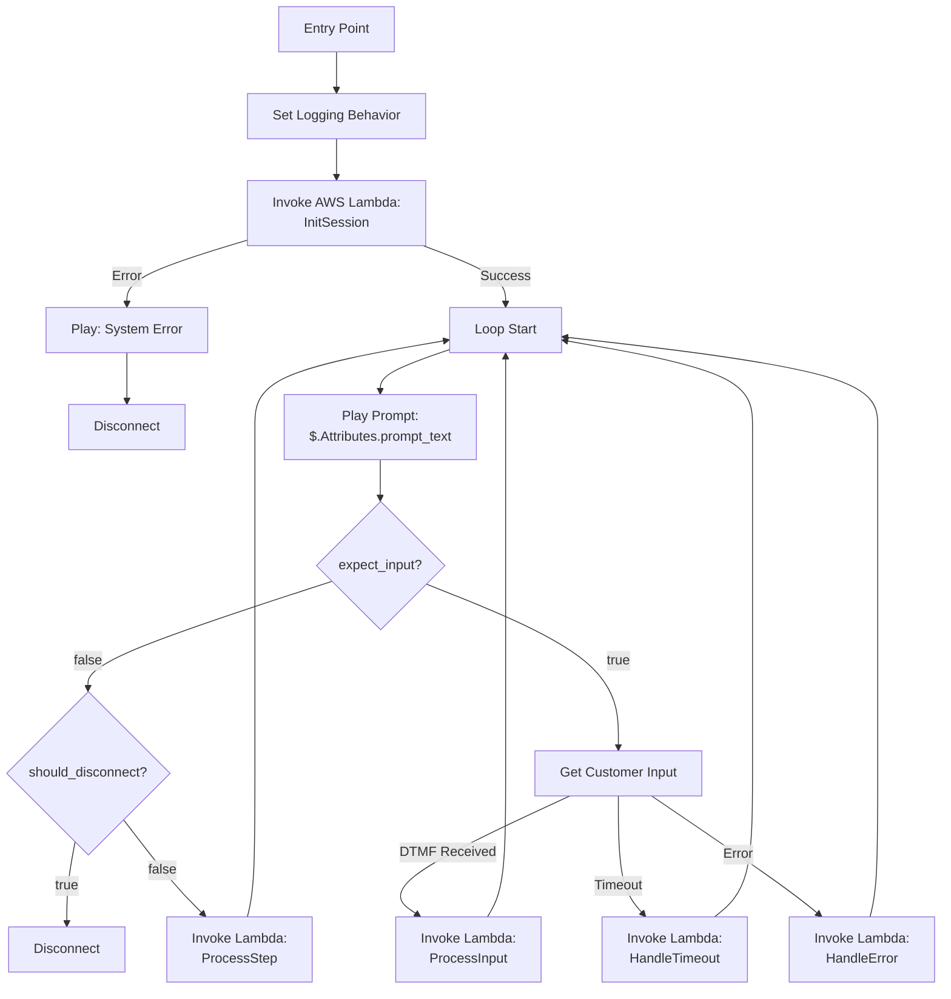

### 12.2 Contact Flow Attributes

| Attribute | Description |
|-----------|-------------|
| `prompt_text` | Text-to-speech content |
| `expect_input` | Whether to capture DTMF |
| `valid_inputs` | Valid DTMF digits |
| `input_timeout` | Seconds to wait |
| `should_disconnect` | End call flag |
| `user_input` | Captured DTMF input (inbound, set by Connect) |

---

## 13. Ballot Encryption

**Design Decision**: The IVR Lambda behaves as a voter from the platform's perspective.

The IVR will:
1. Construct the ballot from voter selections (DTMF input)
2. Encrypt the ballot using existing `sequent-core` encryption logic (same as voting-portal)
3. Submit encrypted ballot via the existing `/insert-cast-vote` API endpoint
4. Include JWT with `azp: "ivr-voting"` to identify the channel as TELEPHONE

**Implementation**:
- Lambda includes `sequent-core` as dependency (already written in Rust)
- Use election's public key from election data (fetched during setup)
- Ballot construction follows same structure as online voting
- Encryption is identical to voting-portal - no special handling needed

**Security Benefits**:
- Vote secrecy maintained end-to-end
- No plaintext votes in API calls
- Consistent security model across all voting channels
- Existing audit mechanisms work unchanged

---

## 14. Admin Portal Integration

### 14.1 New Election Event Configuration

Add to Election Event settings:
- **Phone Voting Enabled**: Boolean toggle
- **Phone Numbers**: List of assigned phone numbers
- **Phone Voting Start/End**: Optional separate voting period
- **Default Language**: For greeting before language selection

### 14.2 New Admin Views

- **Phone Voting Dashboard**: Real-time call statistics
- **Call Logs**: Searchable call history (without PINs)
- **Phone Number Management**: Assign/unassign numbers
- **IVR Flow / IVR Prompts tabs** (per election event): flow pipeline editing plus `ivr.retry_limits` (`auth`, `invalid_input`, `timeout`) configuration — see §7.4
- **Phone Blacklist**: manage the Hasura-backed `sequent_backend.ivr_phone_blacklist` table (add/remove/annotate E.164 numbers, optionally scoped to a specific election event). Gated by the `can_manage_phone_blacklist` Keycloak permission. See §6.3 for the data model and Harvest endpoints

---

## 15. Testing Strategy

### 15.1 Unit Tests
- Each phase and sub-phase engine tested in isolation with mock ports (see §3.5.6)
- Every `FlowPhase` / `BallotSubPhase` transition covered, including error paths
- Prompt resolution / i18n fallback chain
- Input validation per phase
- `RetryCounters` reset semantics per phase transition

### 15.2 Record-and-Replay Session Tests
Since the engine is a pure function of `(session state, input) → (session state, response)`, the most valuable integration layer is a record-and-replay harness: a test file is a sequence of `(input, expected_prompt_key, expected_expect_input, expected_disconnect)` tuples driven through a fake `PhasePorts` implementation. Client IVR specs (e.g. Barrie) are encoded directly as replay fixtures, so regressions against a known-good script fail loudly at CI time.

### 15.3 Integration Tests
- Keycloak authentication via ROPC against a test realm
- **Contract test** between the `ivr-config-resource` Keycloak extension and the Lambda: spin up Keycloak with a representative Direct Grant flow configuration and assert the `/ivr-config` response shape matches what the Lambda expects. This is the only way to catch auth-discovery drift between the two sides
- Harvest API `/insert-cast-vote`
- DynamoDB session round-trip

### 15.4 End-to-End Tests
- Full voting flow simulation via Amazon Connect test calls
- Multi-language paths
- Error scenarios
- Timeout handling

### 15.5 Load Testing
- Concurrent call simulation
- API latency under load
- DynamoDB throughput

---

## 16. Deployment Strategy

### 16.1 Phased Rollout

**Phase 1: Development**
- Local testing with mocked Amazon Connect
- Integration with dev Keycloak/Harvest

**Phase 2: Staging**
- Full Amazon Connect setup in staging
- Test phone number provisioned
- End-to-end testing

**Phase 3: Production Pilot**
- Single municipality deployment
- Limited voter pool
- Close monitoring

**Phase 4: Full Rollout**
- All municipalities enabled
- Automated provisioning
- Operational runbooks

---

## 17. Cost Considerations

### 17.1 Per-Call Costs
- Amazon Connect: ~$0.018/minute
- Lambda: ~$0.0000001/ms (256MB)
- DynamoDB: ~$0.00025/request
- Polly: ~$4/1M characters

### 17.2 Fixed Costs
- Phone numbers: $1-6/month each (Canadian numbers)
- NAT Gateway: ~$32/month + data transfer

### 17.3 Cost Optimization
- Use reserved capacity for DynamoDB if high volume
- Cache election data in Lambda (short TTL)
- Minimize prompt text length

---

## 18. Open Questions / Decisions Needed

1. **Scheduled Closing**: Should phone voting auto-close independently? (CTO mentioned this)
   - **Likely yes** — the `telephone_voting_status` / `telephone_voting_period_dates` fields support this
2. **Audio File Support**: Should the IVR support pre-recorded audio files in addition to TTS?
   - Barrie specs reference `.mp3`/`.wav` files for all prompts
   - Amazon Connect supports both Polly TTS and S3-hosted audio
   - Could extend prompt values to support `{"type": "audio", "url": "s3://..."}` vs `{"type": "tts", "text": "..."}`

---

## Appendix A: Sequence Diagrams

### A.1 Complete Voting Flow

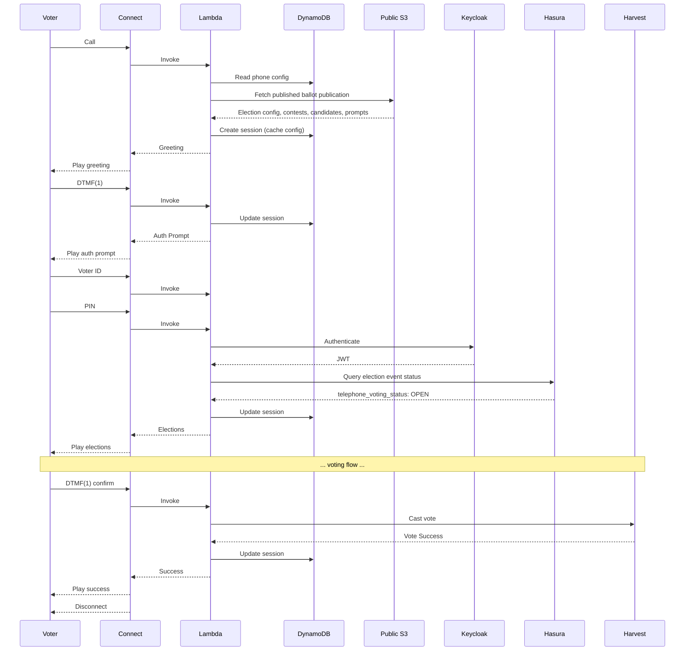

---

## Appendix B: Glossary

| Term | Definition |
|------|------------|
| **DTMF** | Dual-Tone Multi-Frequency - touch-tone phone signals |
| **IVR** | Interactive Voice Response |
| **Contact Flow** | Amazon Connect's visual call routing builder |
| **Polly** | AWS text-to-speech service |
| **EML** | Election Markup Language - ballot definition format |
| **Hasura** | GraphQL engine over PostgreSQL |
| **Harvest** | Backend API for vote casting |
| **Keycloak** | Identity and access management platform |

---

## Appendix C: Required Code Changes for TELEPHONE Channel

To support scheduled phone voting with independent start/stop times, the following code changes are required:

### C.1 Add TELEPHONE to VotingStatusChannel Enum

**File:** `packages/sequent-core/src/ballot.rs:1882`

```rust
#[allow(non_camel_case_types)]
#[derive(
    Serialize,
    Deserialize,
    Debug,
    PartialEq,
    Eq,
    Clone,
    Copy,
    EnumString,
    JsonSchema,
    IntoStaticStr,
)]
pub enum VotingStatusChannel {
    ONLINE,
    KIOSK,
    EARLY_VOTING,
    TELEPHONE,  // ADD THIS
}
```

### C.2 Update channel_from() Method

**File:** `packages/sequent-core/src/ballot.rs:1888`

```rust
impl VotingStatusChannel {
    pub fn channel_from(
        &self,
        channels: &core::VotingChannels,
    ) -> Option<bool> {
        match self {
            &VotingStatusChannel::ONLINE => channels.online.clone(),
            &VotingStatusChannel::KIOSK => channels.kiosk.clone(),
            &VotingStatusChannel::EARLY_VOTING => channels.early_voting.clone(),
            &VotingStatusChannel::TELEPHONE => channels.telephone.clone(),  // ADD THIS
        }
    }
}
```

### C.3 Add telephone_voting_status to ElectionEventStatus

**File:** `packages/sequent-core/src/ballot.rs:1683`

```rust
#[derive(
    BorshSerialize,
    BorshDeserialize,
    Serialize,
    Deserialize,
    JsonSchema,
    PartialEq,
    Eq,
    Debug,
    Clone,
    Default,
)]
pub struct ElectionEventStatus {
    pub voting_status: VotingStatus,
    pub kiosk_voting_status: VotingStatus,
    pub early_voting_status: VotingStatus,
    pub telephone_voting_status: VotingStatus,  // ADD THIS

    pub voting_period_dates: PeriodDates,
    pub kiosk_voting_period_dates: PeriodDates,
    pub early_voting_period_dates: PeriodDates,
    pub telephone_voting_period_dates: PeriodDates,  // ADD THIS
}
```

### C.4 Update ElectionEventStatus Methods

**File:** `packages/sequent-core/src/ballot.rs`

Update `status_by_channel()`:
```rust
impl ElectionEventStatus {
    pub fn status_by_channel(
        &self,
        channel: VotingStatusChannel,
    ) -> VotingStatus {
        match channel {
            VotingStatusChannel::ONLINE => self.voting_status.clone(),
            VotingStatusChannel::KIOSK => self.kiosk_voting_status.clone(),
            VotingStatusChannel::EARLY_VOTING => self.early_voting_status.clone(),
            VotingStatusChannel::TELEPHONE => self.telephone_voting_status.clone(),  // ADD THIS
        }
    }
}
```

Update `set_status_by_channel()`:
```rust
impl ElectionEventStatus {
    pub fn set_status_by_channel(
        &mut self,
        channel: VotingStatusChannel,
        new_status: VotingStatus,
    ) {
        let mut period_dates = match channel {
            VotingStatusChannel::ONLINE => {
                self.voting_status = new_status.clone();
                &mut self.voting_period_dates
            }
            VotingStatusChannel::KIOSK => {
                self.kiosk_voting_status = new_status.clone();
                &mut self.kiosk_voting_period_dates
            }
            VotingStatusChannel::EARLY_VOTING => {
                self.early_voting_status = new_status.clone();
                &mut self.early_voting_period_dates
            }
            VotingStatusChannel::TELEPHONE => {  // ADD THIS
                self.telephone_voting_status = new_status.clone();
                &mut self.telephone_voting_period_dates
            }
        };
        period_dates.update_period_dates(&new_status);
    }
}
```

### C.5 Add telephone_voting_status to ElectionStatus

**File:** `packages/sequent-core/src/ballot.rs:2162`

```rust
#[derive(
    BorshSerialize,
    BorshDeserialize,
    Serialize,
    Deserialize,
    JsonSchema,
    PartialEq,
    Eq,
    Debug,
    Clone,
)]
pub struct ElectionStatus {
    pub voting_status: VotingStatus,
    pub kiosk_voting_status: VotingStatus,
    pub early_voting_status: VotingStatus,
    pub telephone_voting_status: VotingStatus,  // ADD THIS

    pub voting_period_dates: PeriodDates,
    pub kiosk_voting_period_dates: PeriodDates,
    pub early_voting_period_dates: PeriodDates,
    pub telephone_voting_period_dates: PeriodDates,  // ADD THIS
    pub allow_tally: Option<bool>,
}
```

### C.6 Update ElectionStatus Methods

Similar to ElectionEventStatus, update:
- `status_by_channel()`
- `dates_by_channel()`
- `set_status_by_channel()`

To include `VotingStatusChannel::TELEPHONE` cases.

### C.7 Update Authorization for IVR Client

**File:** `packages/sequent-core/src/services/authorization.rs:110`

```rust
pub fn authorize_voter_election(
    claims: &JwtClaims,
    permissions: Vec<VoterPermissions>,
    election_id: &String,
) -> Result<(String, VotingStatusChannel), (Status, String)> {
    // ... existing validation ...

    match claims.azp.as_str() {
        "voting-portal" => Ok((area_id, VotingStatusChannel::ONLINE)),
        "voting-portal-kiosk" => Ok((area_id, VotingStatusChannel::KIOSK)),
        "ivr-voting" => Ok((area_id, VotingStatusChannel::TELEPHONE)),  // ADD THIS
        _ => Err((Status::Unauthorized, "Unknown Client".into())),
    }
}
```

### C.8 Create Keycloak IVR Client

Create a new Keycloak client with:
- **Client ID:** `ivr-voting`
- **Access Type:** Confidential
- **Direct Access Grants:** Enabled
- **Valid Redirect URIs:** N/A (no browser flow)
- **Service Accounts Enabled:** Optional (if using client credentials)
- **Direct Grant Flow Override:** Set to a custom flow that uses `ConditionalClientAuthenticator` to branch IVR-specific authentication (DoB validation, OTP) away from the standard password flow used by web clients

### C.8.1 Custom Keycloak Authenticators for IVR

The following authenticators may be needed depending on the election event's authentication requirements:

**`IvrDobAuthenticator`** (optional — only if DoB is NOT stored as the password):
- Implements `Authenticator` for the Direct Grant flow
- Reads `dob` from `context.getHttpRequest().getDecodedFormParameters().getFirst("dob")`
- Validates against the user's `date_of_birth` attribute
- `getConfigProperties()` returns the IVR metadata properties (`field_name`, `max_digits`, `terminator`, `maps_to`, optional `prompt_key`) so the `ivr-config-resource` endpoint can read them back
- ~80 lines of Java, following the same pattern as existing authenticators in `packages/keycloak-extensions/`

**`IvrOtpDirectGrantAuthenticator`** (required if OTP is used):
- Implements `Authenticator` for the Direct Grant flow
- On invocation, checks if `otp` parameter is present in the request form params
- **If `otp` absent:** generates code via `SecretGenerator`, stores hash on user as a temporary credential or attribute with timestamp, sends via existing `SmsSenderProvider` (AWS SNS / Twilio) and/or `EmailTemplateProvider` (AWS SES), returns `context.failure()` with identifiable error
- **If `otp` present:** reads stored hash from user, validates with `Utils.constantTimeIsEqual()`, clears stored code, returns `context.success()`
- Reuses all existing OTP infrastructure from `packages/keycloak-extensions/message-otp-authenticator/`
- ~150 lines of Java
- Configurable: code length, TTL, message courier (SMS/email/both), sender ID — same config properties as `MessageOTPAuthenticatorFactory`

**Direct Grant Flow configuration per realm:**


This ensures web portal authentication (via `voting-portal` client) is unaffected.

### C.8.2 `ivr-config-resource` Keycloak Extension (required)

**Location:** `packages/keycloak-extensions/ivr-config-resource/`

This is a **new, always-required** Keycloak extension. It exposes a single REST endpoint that the IVR Lambda calls at session init to discover the auth step list for the realm, replacing the old `presentation.ivr.auth` S3 config.

**Endpoint:**
```
GET /realms/{realm}/ivr-config
```

**Response:**
```json
{
  "steps": [
    { "field": "voter_id", "max_digits": 8, "terminator": "#", "maps_to": "username" },
    { "field": "pin",      "max_digits": 4, "terminator": "#", "maps_to": "password" }
  ]
}
```

**Implementation** (~100 lines of Java):

```java
public class IvrConfigResourceProvider implements RealmResourceProvider {
    private final KeycloakSession session;

    // Well-known mapping for stock Keycloak authenticators
    private static final Map<String, AuthStep> STOCK_AUTHENTICATORS = Map.of(
        "direct-grant-validate-username",
            new AuthStep("voter_id", 8, "#", "username", null),
        "direct-grant-validate-password",
            new AuthStep("pin",      8, "#", "password", null)
    );

    private static final Set<String> SKIPPED_AUTHENTICATORS = Set.of(
        "ivr-otp-direct-grant"  // OTP is discovered dynamically via otp_required error
    );

    @GET
    @Path("/")
    @Produces(MediaType.APPLICATION_JSON)
    public Response getIvrConfig() {
        RealmModel realm = session.getContext().getRealm();

        // 1. Find effective Direct Grant flow for ivr-voting client
        ClientModel ivrClient = realm.getClientByClientId("ivr-voting");
        AuthenticationFlowModel flow = (ivrClient != null && ivrClient.getAuthenticationFlowBindingOverride("direct_grant") != null)
            ? realm.getAuthenticationFlowById(ivrClient.getAuthenticationFlowBindingOverride("direct_grant"))
            : realm.getDirectGrantFlow();

        // 2. Walk executions in order, filter to ENABLED/REQUIRED
        List<AuthStep> steps = new ArrayList<>();
        realm.getAuthenticationExecutionsStream(flow.getId())
            .filter(e -> e.getRequirement() == REQUIRED || e.getRequirement() == CONDITIONAL)
            .filter(e -> !SKIPPED_AUTHENTICATORS.contains(e.getAuthenticator()))
            .forEachOrdered(e -> steps.add(buildStep(realm, e)));

        return Response.ok(Map.of("steps", steps)).build();
    }

    private AuthStep buildStep(RealmModel realm, AuthenticationExecutionModel exec) {
        // 3a. Stock authenticator — use static lookup
        if (STOCK_AUTHENTICATORS.containsKey(exec.getAuthenticator())) {
            return STOCK_AUTHENTICATORS.get(exec.getAuthenticator());
        }
        // 3b. Custom authenticator — read AuthenticatorConfig
        AuthenticatorConfigModel cfg = realm.getAuthenticatorConfigById(exec.getAuthenticatorConfig());
        if (cfg == null) {
            throw new WebApplicationException(
                "Unknown IVR authenticator '" + exec.getAuthenticator() +
                "' has no AuthenticatorConfig — cannot derive IVR auth step",
                Response.Status.INTERNAL_SERVER_ERROR);
        }
        Map<String, String> c = cfg.getConfig();
        return new AuthStep(
            c.get("field_name"),
            Integer.parseInt(c.getOrDefault("max_digits", "10")),
            c.getOrDefault("terminator", "#"),
            c.get("maps_to"),
            c.get("prompt_key")  // optional override
        );
    }

    @Override public void close() {}
}
```

**Factory** (`IvrConfigResourceProviderFactory implements RealmResourceProviderFactory`, ~20 lines) registers the provider under `/realms/{realm}/ivr-config`.

**Key design points:**
- **No authentication required** on the endpoint — returns non-sensitive metadata about auth shape. Voters already know what to enter.
- **Stock authenticator lookup is hardcoded** in the extension. If Keycloak renames `direct-grant-validate-username` in a major upgrade, the extension must be updated — covered by a startup integration test that calls the endpoint against a well-known realm configuration.
- **Skipped authenticators list** explicitly excludes `ivr-otp-direct-grant` because OTP is handled reactively by the Lambda (via the `otp_required` error response), not declared up front.
- **Unknown authenticators fail loudly** with HTTP 500 — misconfigurations surface at deployment time (first call after deploy) instead of silently producing a broken auth flow mid-election.
- **Custom authenticator config properties** (`field_name`, `max_digits`, `terminator`, `maps_to`, `prompt_key`) are declared by each custom authenticator's `getConfigProperties()` — Keycloak renders them as fields in the admin UI.

**Build integration:** add a new Maven module under `packages/keycloak-extensions/ivr-config-resource/` and include it in the Keycloak image alongside `conditional-authenticators` and `message-otp-authenticator`.

### C.9 Update Default Values

**File:** `packages/sequent-core/src/ballot.rs`

Update `Default` implementations:
```rust
impl Default for ElectionEventStatus {
    fn default() -> Self {
        Self {
            voting_status: Default::default(),
            kiosk_voting_status: Default::default(),
            early_voting_status: Default::default(),
            telephone_voting_status: Default::default(),  // ADD THIS
            voting_period_dates: Default::default(),
            kiosk_voting_period_dates: Default::default(),
            early_voting_period_dates: Default::default(),
            telephone_voting_period_dates: Default::default(),  // ADD THIS
        }
    }
}
```

---

## Appendix D: IVR Prompt Keys Reference

The `ivr` namespace is **dynamic** — it is a `HashMap<String, String>`, not a fixed struct. It can hold both prompt keys and spoken-text override keys without code changes. The tables below list **well-known keys** that the built-in phase engines reference, but deployments can add custom keys as needed.

### Event-Level Prompts

Stored in `ElectionEvent.presentation.i18n[lang]["ivr"]`

**Core prompts (used by most deployments):**

| Key | Phase | Description |
|-----|-------|-------------|
| `greeting` | `announcement: welcome` | Welcome message |
| `language_select` | `language_select` | Language menu |
| `auth_enter_username` | `auth` | Played for the step whose `maps_to` is `username` (typically voter ID) |
| `auth_enter_password` | `auth` | Played for the step whose `maps_to` is `password` (typically PIN or DoB) |
| `auth_enter_dob` | `auth` | Played for custom DoB step (`maps_to: dob`) if `IvrDobAuthenticator` is in the flow |
| `auth_enter_otp` | `auth` | Played when collecting OTP after Keycloak returns `otp_required` |
| `auth_otp_sent` | `auth` | Played before OTP collection (e.g., "A code has been sent to your phone") |
| `auth_otp_invalid` | `auth` | OTP validation failed |
| `auth_failed` | `auth` | Authentication failed |
| `auth_max_attempts` | `auth` | Max auth retries exceeded |
| `system_error` | (any) | System error |
| `invalid_input` | (any) | Invalid DTMF input |
| `timeout` | (any) | Input timeout |
| `repeat_instruction` | (any) | Repeat reminder |
| `goodbye` | `goodbye` | Farewell message |

**Extended prompts (Barrie-style deployments):**

| Key | Phase | Description |
|-----|-------|-------------|
| `blacklist_message` | `blacklist_check` | Phone number blocked. Since blacklist runs before language selection, this prompt should work before the caller has chosen a language |
| `eligibility_check` | `eligibility_check` | Eligibility validation in progress |
| `not_eligible` | `eligibility_check` | Not authorized to vote |
| `not_active` | `eligibility_check` | Credentials deactivated |
| `election_closed` | `ballot_loop` | Telephone voting not open (played when `telephone_voting_status` is not `OPEN`) |
| `declaration_text` | `announcement: declaration` | Legal declaration text |
| `pre_voting_statement` | `announcement: pre_voting_statement` | Disconnect warning / info |
| `receipt_info` | `ballot_loop` (`ElectionReceipt`) | About to read the ballot locator for this election |
| `receipt_number` | `ballot_loop` (`ElectionReceipt`) | Per-election ballot locator readback — first 4 hex characters of `ballot_id`, spoken phonetically (uses `\{confirmation_number\}`, `\{election_name\}`) |
| `session_expired` | (any) | Session timeout |

### IVR-Only Spoken Text Overrides

Stored in `*.presentation.i18n[lang]["ivr"]` at event, election, contest, and candidate scope

| Key | Typical Scope | Fallback |
|-----|---------------|----------|
| `name` | Event, election, contest, candidate | Portal `name` / `name_i18n` |
| `alias` | Event, election, contest, candidate | Portal `alias` / `alias_i18n` |
| `description` | Event, election, contest, candidate | Portal `description` / `description_i18n` |

### Election-Level Prompts

Stored in `Election.presentation.i18n[lang]["ivr"]`

| Key | Phase | Template Variables | Description |
|-----|-------|-------------------|-------------|
| `election_intro` | `ballot_loop` | `\{election_name\}` | Election introduction |
| `contest_intro` | `ballot_loop` | `\{contest_name\}`, `\{max_votes\}` | Contest introduction |
| `candidate_option` | `ballot_loop` | `\{number\}`, `\{candidate_name\}` | Candidate option |
| `vote_confirm` | `ballot_loop` | `\{candidate_name\}`, `\{contest_name\}` | Vote confirmation |
| `already_selected` | `ballot_loop` | - | Duplicate selection (only reachable via race condition; normally unselected candidates are omitted from list) |
| `blank_ballot_confirm` | `ballot_loop` | - | Blank ballot confirmation |
| `decline_confirm` | `ballot_loop` | - | Decline-to-vote confirmation |
| `summary_intro` | `ballot_loop` (`ElectionSummary`) | - | Per-election summary introduction |
| `summary_item` | `ballot_loop` (`ElectionSummary`) | `\{contest_name\}`, `\{candidate_name\}`, `\{contest_number\}` | Summary line item per contest — includes contest number for edit selection |
| `summary_edit_prompt` | `ballot_loop` (`ElectionSummary`) | - | "Press 1 to continue to submission, or press a contest number to change your selection for that contest" |
| `summary_edit_restart` | `ballot_loop` (`ElectionSummary`) | `\{contest_name\}` | "Changing your selection for \{contest_name\}. Your previous selections for this contest have been cleared." |
| `vote_success` | `ballot_loop` (`ElectionSubmit`) | `\{election_name\}` | Ballot submitted for this election |
| `vote_failed` | `ballot_loop` (`ElectionSubmit`) | - | Vote submission failed |
| `duplicate_vote` | `ballot_loop` (`ElectionSubmit`) | - | Already voted in this election |
| `max_revotes_exceeded` | `ballot_loop` (`ElectionSubmit`) | - | Max revotes exceeded for this election |

### Template Variables

| Variable | Source | Example |
|----------|--------|---------|
| `\{election_name\}` | IVR `name` override if present, else `election.get_name(lang)` | "Municipal Council" |
| `\{contest_name\}` | IVR `name` override if present, else `contest.get_name(lang)` | "Mayor" |
| `\{candidate_name\}` | IVR `name` override if present, else candidate `name` / `name_i18n` | `<lang xml:lang="fr-CA">Jean-François Côté</lang>` |
| `\{number\}` | DTMF mapping | "1" |
| `\{max_votes\}` | contest.max_votes | "3" |
| `\{min_votes\}` | contest.min_votes | "1" |
| `\{confirmation_number\}` | First 4 hex characters of `ballot_id`, formatted phonetically per `ballot_loop.config.receipt_format` | "alpha three foxtrot two" |
| `\{assistance_phone\}` | `ivr.assistance_phone` config | "1-800-555-0199" |
