<!--
SPDX-FileCopyrightText: 2025 Sequent Tech Inc <legal@sequentech.io>
SPDX-License-Identifier: AGPL-3.0-only
-->

# IVR Telephone Voting System - Technical Design Document

## 1. Executive Summary

This document outlines the technical design for an IVR (Interactive Voice Response) telephone voting system for the Sequent Voting Platform. The system will be deployed in Canada and will allow voters without internet access to participate in elections via telephone.

### Key Design Decisions
- **Lambda Runtime**: Rust (consistent with existing codebase)
- **IVR Provider**: Amazon Connect with Contact Flows
- **State Management**: DynamoDB for ephemeral call session state; phone-number routing in a versioned S3 file (§6.2)
- **Authentication**: Keycloak OIDC Direct Grant (ROPC) with configurable multi-factor authentication
- **Election Config**: Published ballot publication on public S3 (same data as voting portal)
- **Election Status**: Hasura GraphQL for real-time status checks
- **Vote Casting**: Harvest API for vote submission

---

## 2. Architecture Overview

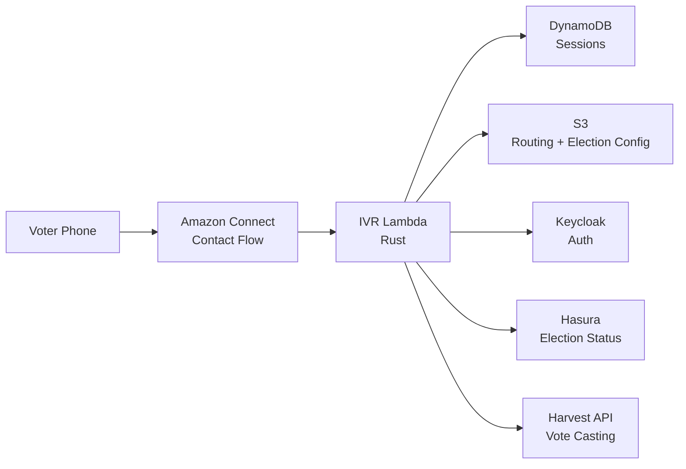

### 2.1 Component Responsibilities

| Component | Responsibility |
|-----------|----------------|
| **Amazon Connect** | Receive calls, play prompts via Polly, capture DTMF input, route to Lambda |
| **IVR Lambda** | State machine logic, prompt generation, input validation, API orchestration |
| **DynamoDB** | Ephemeral call session state, keyed by `contact_id`; read-write with conditional-write guards (§4.1) |
| **S3 (versioned, private)** | Phone number → cluster/environment/tenant/event routing file (§6.2). Read-only from the Lambda; written only by gitops CI |
| **Public S3** | Published ballot publication: election structure, ballot styles, contests, candidates, IVR flow config, prompts, IVR-only spoken-text overrides, public keys (same data used by voting portal in preview mode) |
| **Keycloak** | Voter authentication via OIDC Direct Grant (ROPC) with configurable auth factors, JWT issuance |
| **Hasura** | Real-time election event status query, plus the voter's already-cast-ballot listing for re-entry after a dropped call (both use the same GraphQL surface and row-level permissions as the voting portal) |
| **Harvest API** | Cast votes via `/insert-cast-vote` |

---

## 3. Config-Driven Flow Engine

### 3.0 Design Principle

The IVR call flow is **not a hardcoded state machine**. It is a **configurable pipeline of phases** defined in the election event's `presentation.ivr.flow` configuration and published to S3. The Lambda ships with execution engines for a finite set of phase types, but which phases run, in what order, and with what settings is entirely configuration.

This means:
- Adding a declaration step, receipt readback, or phone blacklist check = config change, not code change
- Removing phases for a simpler deployment = config change
- Reordering phases = config change
- Adding a **new phase type** (e.g., ranked-choice input) = code change (new execution engine)

### 3.1 Flow Configuration

The flow is an ordered array of phases stored in `presentation.ivr.flow`:

```json
{
  "ivr": {
    "flow": [
      { "phase": "blacklist_check" },
      { "phase": "language_select" },
      { "phase": "announcement", "name": "welcome", "prompt_key": "greeting" },
      { "phase": "auth" },
      { "phase": "eligibility_check" },
      { "phase": "announcement", "name": "declaration", "prompt_key": "declaration_text", "accept_key": "2" },
      { "phase": "announcement", "name": "pre_voting_statement", "prompt_key": "pre_voting_statement" },
      { "phase": "ballot_loop", "receipt_format": "phonetic_hex_4" },
      { "phase": "goodbye" }
    ]
  }
}
```

A simpler deployment (voter ID + PIN, no frills):

```json
{
  "ivr": {
    "flow": [
      { "phase": "language_select" },
      { "phase": "announcement", "name": "welcome", "prompt_key": "greeting" },
      { "phase": "auth" },
      { "phase": "ballot_loop" },
      { "phase": "goodbye" }
    ]
  }
}
```

Same Lambda code, different config.

### 3.2 Phase Types

Each phase type has an execution engine in the Lambda. The engine handles prompting, input collection, validation, and API calls for that phase.

| Phase Type | Description | Input | Behavior |
|------------|-------------|-------|----------|
| `announcement` | Play a prompt, optionally wait for an acceptance key | None (auto-advance) or DTMF if `accept_key` set | Play the configured `prompt_key`. If `accept_key` is set, wait for that DTMF and retry on invalid input up to `max_retries`. If not, auto-advance. Used for greeting, declaration, pre-voting statement, and any other play-and-continue or play-and-confirm prompts — one engine, different config. The executor only considers `accept_key` matches; `*` never reaches it because the dispatcher replays the last prompt before dispatch (§3.5.3, §3.4) |
| `language_select` | Language selection menu | DTMF if more than 1 enabled language | If `language_conf.enabled_language_codes` contains exactly 1 language, set it automatically and advance without prompting. Otherwise collect DTMF (1=English, 2=French, etc.), set session language, advance |
| `blacklist_check` | Check caller phone against blacklist | None (auto-advance) | Query Hasura (see §6.3) for a blacklist entry matching the caller phone number; if present, play `blacklist_message` and disconnect. Because this phase runs before language selection, the message should be authored to work before the caller has chosen a language, typically by making it bilingual |
| `auth` | Collect credentials, authenticate with Keycloak | DTMF per step | Iterate through auth steps discovered via Keycloak's `/realms/\{realm\}/ivr-config` endpoint (see §5.1), submit to Keycloak ROPC. On failure, retry up to limit. (OTP over IVR is a possible future extension — see §5.1.4.) |
| `eligibility_check` | Validate voter eligibility and election status | None (auto-advance) | Play `eligibility_check` prompt. Check voter eligibility via API; if ineligible, play `not_eligible` and disconnect. Also query Hasura for `telephone_voting_status` (see §5.2); if not `OPEN`, play `election_closed` and disconnect |
| `ballot_loop` | Per-election voting cycle: select → confirm → submit → receipt | DTMF | The inner voting loop (see 3.3). For each election: vote all contests, read back summary, confirm, encrypt and submit ballot via Harvest API, read a ballot locator derived from the first 4 hex characters of `ballot_id` using phonetic spelling (`a3f2` → "alpha three foxtrot two"). Then advance to next election or finish. All behavior driven by published election/contest data |
| `goodbye` | Farewell message, disconnect | None (disconnect) | Play `goodbye` prompt, disconnect |

**Note on the `announcement` phase.** Three previously-separate phase types (`welcome`, `declaration`, `pre_voting_statement`) are all the same pattern: play a prompt, optionally wait for a key, advance. Collapsing them into one engine saves three execution paths, three test surfaces, and three config schemas. Each instance in the flow carries a `name` field so logs and metrics remain distinguishable (`name: "welcome"`, `name: "declaration"`, etc.).

#### Overall Phase Flow

The following diagram shows the complete end-to-end IVR call flow through all configured phases. Each box corresponds to a phase type from the table above. Diamond nodes represent phases where the call may terminate early.

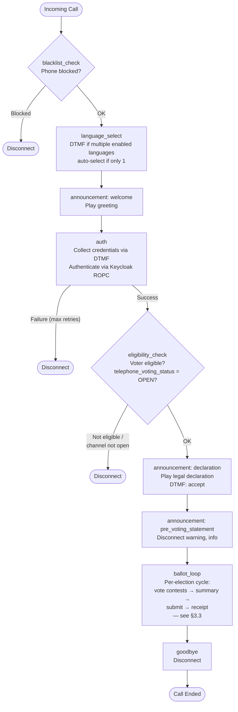

#### Per-Election Submission Cycle (inside ballot_loop)

After all contests in one election are voted, the ballot loop enters the per-election submission sub-phases: `ElectionSummary` → `ElectionSubmit` → `ElectionReceipt`. Only after the ballot for the current election is submitted does the voter proceed to the next election or finish.

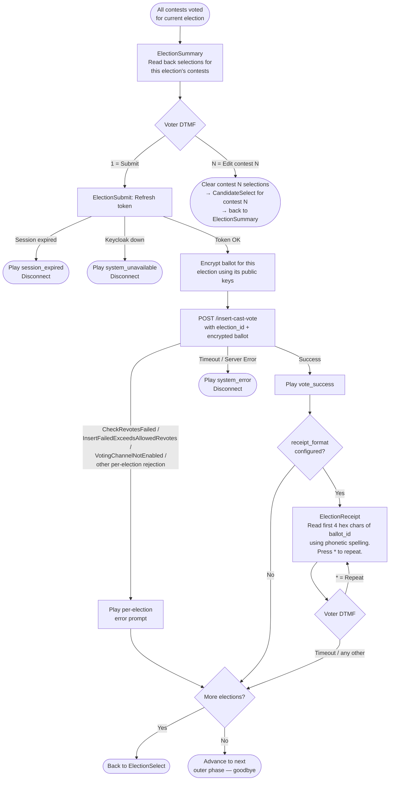

### 3.3 Ballot Loop (Inner Flow)

The `ballot_loop` phase is the most complex. Rather than implementing it as a single monolith, it is decomposed into **sub-phases** — each one a small, testable unit. The outer `ballot_loop` phase engine advances through sub-phases like a mini flow engine within the main flow.

All behavior is driven by the **published election/contest data** — the same structures the voting portal reads. The IVR Lambda honors the same config fields:

#### 3.3.1 Config Fields Consumed by the Ballot Loop

| Config Field | Source | IVR Behavior |
|---|---|---|
| `skip_election_list` | `ElectionEventPresentation` | If `true`, only 1 election, **and that election is still selectable for this voter** (not already cast with `num_allowed_revotes = 0` — see §9.3): skip the election-selection sub-phase and go straight into that election's language check / intro / contest loop. If the single election is not selectable at ballot-loop entry (typically a re-entry after a prior submission), the skip is **not applied** — `ElectionSelect` runs so the voter hears the "already voted" announcement and can exit via `0` instead of being dropped into a ballot loop for a closed election. Same voting portal behavior when the election is selectable |
| `elections_order` | `ElectionEventPresentation` | Sort elections before presenting: `alphabetical` (by alias/name), `custom` (by `sort_order`), `random` (shuffled once at session init) |
| `contests_order` | `ElectionPresentation` | Sort contests within an election: `alphabetical`, `custom`, `random` |
| `candidates_order` | `ContestPresentation` | Sort candidates within a contest: `alphabetical`, `custom`, `random`. Determines DTMF assignment order |
| `blank_vote_policy` | `ContestPresentation` | `allowed`: offer blank ballot confirmation. `warn`/`warn-only-in-review`: play warning then allow. `not-allowed`: require at least one selection |
| `under_vote_policy` | `ContestPresentation` | `allowed`: accept silently. `warn`/`warn-and-alert`: play warning before confirming. `warn-only-in-review`: warn during summary only |
| `language_conf` | `ElectionPresentation` | If the election's enabled/default language differs from the session language, offer a per-ballot language switch. If exactly 1 language is enabled for the election, select it automatically without prompting |
| `min_votes` / `max_votes` | Contest | Enforce selection count. `max_votes=1` → stop after 1 selection. `min_votes>0` + `blank_vote_policy=not_allowed` → force selection |
| `is_explicit_invalid` | `CandidatePresentation` | Excluded from the numbered DTMF list (IVR has no "invalid vote" affordance — invalid ballots cannot be cast via phone by design) |
| `is_explicit_blank` | `CandidatePresentation` | Excluded from the numbered DTMF list, but **reachable through the reserved `0` key** when the voter wants to cast blank for the contest. See §3.3.5 for the `0`-key decision tree (explicit-blank selection vs. implicit blank via `min_votes = 0` vs. rejection) |

#### 3.3.2 Ballot Loop Sub-Phases

The ballot loop is a **nested state machine** with three levels: election → contest → candidate selection. After all contests in an election are voted, the voter reviews, confirms, and submits the ballot for that election before moving to the next one. Each level has its own sub-phases:

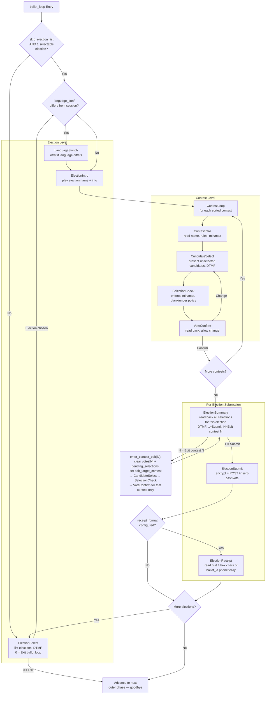

#### 3.3.3 Sub-Phase Descriptions

| Sub-Phase | Input | Behavior |
|---|---|---|
| `ElectionSelect` | DTMF (election index, or `0` = exit ballot loop) | Present sorted elections (by `elections_order`) with each election annotated as either "already voted" or selectable, based on the voter's cast-vote history read through `CastVoteHistoryPort` (§3.5.2, §9.3). Already-voted elections are announced but not selectable when `num_allowed_revotes = 0`. Single-digit if ≤9, multi-digit otherwise. **Pressing `0` exits the ballot loop** and advances to the next outer phase (typically `goodbye`) — the escape hatch for voters whose elections are all already voted or not currently open. **Skipped at entry** only if `skip_election_list=true`, only 1 election, *and* that election is selectable; otherwise `ElectionSelect` runs so the voter can see the state and exit cleanly (§3.3.1, §9.3) |
| `LanguageSwitch` | DTMF (1=keep, 2=switch) if multiple languages are available | Offer only if the election's `language_conf` differs from the current `effective_language()` (§3.3.4). If the election exposes exactly 1 enabled language, switch automatically without prompting. **Scope — per election by construction:** `LanguageSwitch` writes to `BallotLoopState.election_language_override`, not to `session.language`; the override is read via `effective_language() = override.unwrap_or(session.language)` and is cleared automatically by `advance_to_election` (§3.3.6) on the next election-boundary transition. So if election A is bilingual and the voter switches to French on A, the override is dropped the moment the loop advances to election B, and `effective_language()` falls back to the event-level `session.language`; B's own `LanguageSwitch` then decides independently. Runs **before** `ElectionIntro` so the intro is read in the correct language. **Invariant:** an election's `language_conf.enabled_language_codes` is always a subset of the election event's; additionally an election may override the `default_language_code`, so "differs from current `effective_language()`" means either the effective language is not in the election's enabled set, or the election's default differs from the current effective language. Both cases trigger the offer; otherwise skip |
| `ElectionIntro` | None (auto-advance) | Play `election_intro` prompt with `\{election_name\}`, announce contest count. Rendered in `effective_language()` (§3.3.4), so it picks up an override from the preceding `LanguageSwitch` automatically and falls back to `session.language` otherwise |
| `ContestIntro` | None (auto-advance) or DTMF to repeat | Play `contest_intro` with `\{contest_name\}`, `\{max_votes\}`, `\{min_votes\}`. Explain rules: "Select up to \{max_votes\} candidates" |
| `CandidateSelect` | DTMF per candidate | Present only **unselected** candidates sorted by `candidates_order`. Single-digit (1-9) or multi-digit (01-99#) based on remaining count. Accumulate selections until `max_votes` is reached or the voter signals done with `#` (the Connect terminator). `0` means "skip/abstain" from this contest — never "end multi-select". Its interaction with `pending_selections` is fully specified in §3.3.5 and matches the voting-portal behavior. Already-selected candidates are omitted from the list (DTMF numbers are reassigned to remaining candidates) |
| `SelectionCheck` | DTMF (confirm/restart) | Validate selections against `min_votes`/`max_votes`. Apply `blank_vote_policy`: if no selections and `allowed`→`blank_ballot_confirm`; if `not_allowed`→re-prompt. Apply `under_vote_policy`: if under minimum and `warn`→play warning then confirm |
| `VoteConfirm` | DTMF (1=confirm, 2=change) | Read back selected candidates. "You selected \{candidate_name\} for \{contest_name\}. Press 1 to confirm, 2 to change your selection" |
| `ElectionSummary` | DTMF (`00#` = submit, `NN#` = edit contest N) | Read back all selections for the current election, numbering each contest. "For contest 1, \{contest_name\}: you selected \{candidate_name\}. For contest 2, …" Press `00#` to submit this election's ballot, or press a contest number followed by `#` to edit that contest's selection. Editing a contest goes through `enter_contest_edit` (§3.3.4), which atomically clears the prior `votes[contest_id]`, clears `pending_selections`, and marks the edit target, then re-enters `CandidateSelect` for that contest only — afterwards returns directly to `ElectionSummary` (not to the next contest). This matters for `max_votes > 1`: the voter re-makes **all** selections for that contest; no pre-edit selections carry over. **Note:** summary is its own explicit confirmation — there is no separate `ElectionConfirm` step before submission. The summary uniformly uses multi-digit input regardless of contest count — contest indices always take the form `01#`–`NN#`, and `00#` is the unambiguous submit code (contest numbering starts at 1, so `00` cannot collide) |
| `ElectionSubmit` | None (auto-advance) | Refresh access token if needed, encrypt ballot with election public keys, POST `/insert-cast-vote` with `election_id`. On success → play `vote_success`, advance to `ElectionReceipt`. On per-election rejection from Harvest (revote limit reached, channel closed, etc. — see §5.4 for the full variant list) → play the matching error prompt, advance to next election. On fatal error (timeout, session expired) → disconnect |
| `ElectionReceipt` | DTMF (`*`=repeat) | Read a ballot locator derived from the first 4 hex characters of `ballot_id`, rendered phonetically (`a3f2` → "alpha three foxtrot two"). "Your ballot locator for \{election_name\} is \{confirmation_number\}. Press star to repeat." Skipped if `receipt_format` is not configured. **Portal dependency:** telephone voting must be enabled for the individual election, and the voting portal ballot locator lookup must be scoped to the authenticated voter and current election. If multiple ballots belonging to that voter share the same four-character prefix, the portal must not select an arbitrary match; it reports the collision and requires the full Ballot ID |

#### 3.3.4 BallotLoopState (Session Cursor)

The ballot loop's position is tracked in `PhaseState::BallotLoop`, which acts as a cursor into the nested election→contest→sub-phase structure:

The ballot-loop cursor carries:

- **Position** — current election index, current contest index, and the current sub-phase (typed enum — see the sub-phase list in §3.3.2; a typed enum gives the dispatcher exhaustive coverage).
- **Sorted ID snapshots** — sorted election IDs (computed once on entry using `elections_order`), sorted contest IDs for the current election (refreshed on election change), sorted candidate IDs for the current contest (refreshed on contest change). The candidate sort stays stable for the whole contest; `CandidateSelect` just skips already-selected IDs when reading the list — the underlying order and DTMF mapping do not change.
- **Pending selections** — an accumulator used by multi-selection contests (`max_votes > 1`).
- **`election_list_skipped`** — records whether `ElectionSelect` was bypassed via `skip_election_list`; `VoteConfirm` / `ElectionSummary` consult this to decide whether to offer navigation back to the election list.
- **`edit_target_contest: Option<usize>`** — set when the voter enters a contest via `ElectionSummary` "edit contest N". When present, `VoteConfirm` returns to `ElectionSummary` instead of advancing to the next contest, and clears the field.
- **`election_language_override: Option<Language>`** — scoped override for the current election frame, set by the inner `LanguageSwitch` sub-phase (or auto-set when the election exposes exactly one enabled language that differs from `session.language`). **Read path:** every prompt lookup inside the ballot loop goes through `effective_language() = election_language_override.unwrap_or(session.language)` — ballot-loop sub-phases never read `session.language` directly. **Write path:** `session.language` is the event-level choice and is never mutated by `LanguageSwitch`; only the override is written. **Reset:** the override is cleared as part of the single `advance_to_election(state, next_index)` helper that also refreshes the sorted contest IDs and zeroes the contest cursor on an election-boundary transition — see §3.3.6. This makes the §3.3.3 promise ("switch affects prompts for this election only") true by construction: when the loop moves to election B, `effective_language()` naturally falls back to `session.language`, and election B's own `LanguageSwitch` then decides whether to set a new override.

**Edit-entry invariant.** Every transition from `ElectionSummary` into `CandidateSelect` for editing contest N MUST atomically (a) remove the prior `votes[contest_id]` entry for that contest, (b) clear `pending_selections`, and (c) set `edit_target_contest = Some(N)`. This is especially important for `max_votes > 1` contests, where a forgotten reset would let pre-edit selections silently merge with new ones — the voter hears the edit prompt, makes fewer selections than before, and the ballot ends up with a union of the two sets instead of only the new one.

The invariant is enforced by a single helper — `enter_contest_edit(state: &mut BallotLoopState, contest_index: usize)` — that owns all three mutations. **No other code path may construct the edit transition by mutating these fields individually.** The sub-phase dispatcher calls this helper on every `NN#` branch out of `ElectionSummary`; no other caller should exist. A unit test asserts that after `enter_contest_edit(_, N)`, all three post-conditions hold, so the first forgetful refactor that open-codes the transition fails the test before it reaches review.

#### 3.3.5 Candidate Selection Detail

Candidate presentation follows the same ordering as the voting portal (`candidates_order`), then assigns DTMF mappings. The rule is simple: if the contest has ≤ 9 candidates, each gets a single-digit code `1`–`9`; if there are more, all candidates get zero-padded two-digit codes (`01`, `02`, … `99`). The choice is per-contest, not global — a short contest with 5 candidates keeps the fast single-digit UX even when the next contest has 20. `0` is never a candidate code — it is reserved for "skip/abstain" — and `*` is never a candidate code — it is reserved for "repeat instructions". See §3.4 for the full reserved-key table.

Candidates flagged `is_explicit_invalid` or `is_explicit_blank` in `CandidatePresentation` are **excluded from the numbered DTMF list** — no single-digit or `NN#` code is assigned to them, so a voter can never select them by candidate number. They are still present in the underlying `candidates` array, and the explicit-blank candidate (if any) is reachable only through the reserved `0` key.

**`0` semantics in `CandidateSelect` (voting-portal parity).** In a `max_votes > 1` contest the voter may already have accumulated some selections in `pending_selections` before pressing `0`. The behavior mirrors the voting portal's current contest-selection rules exactly — one decision tree, three branches, evaluated in order:

1. **Explicit-blank candidate exists in the contest** (any candidate with `is_explicit_blank = true`). Pressing `0` clears `pending_selections`, records that single explicit-blank candidate as the sole selection for the contest, and advances to `SelectionCheck`. This matches how the portal "Select None / Blank" button works when the ballot defines an explicit blank option: selecting blank replaces whatever the voter had picked, it does not co-exist with other selections.
2. **No explicit-blank candidate, and `min_votes = 0`** (implicit blank is allowed). Pressing `0` clears `pending_selections` and advances to `SelectionCheck` with zero selections — which `SelectionCheck` then routes through `blank_vote_policy` (§3.3.3): `allowed` → `blank_ballot_confirm`, `warn` → warning then confirm, `not_allowed` → reject back to `CandidateSelect`.
3. **No explicit-blank candidate, and `min_votes > 0`.** Pressing `0` is rejected inline — replay the candidate prompt with a short "you must select at least \{min_votes\} candidates" preamble, without modifying `pending_selections`. The voter keeps whatever they had already picked.

The reason for the order: branch 1 is a hard contest-level decision (the ballot author declared that an explicit-blank slot exists; picking it is an affirmative choice, not an omission) and must take priority over any per-voter policy interpretation in branch 2. Branch 3 exists because pressing `0` in a contest that requires selections is almost always a keypad slip — rejecting inline lets the voter continue rather than forcing them to re-enter from the top.

**Forward reference — Ballot Policy Engine.** The three-branch decision above is authored as a short, self-contained block in the `CandidateSelect` executor today. Longer-term it is meant to be expressed through the Ballot Policy Engine described in [meta#6557](https://github.com/sequentech/meta/issues/6557), which will centralize contest-level validation and selection-transform rules across the voting portal, IVR, and admin portal so that "what does `0` do" has exactly one implementation rather than one-per-client. When the BPE lands, the IVR executor's branch 1/2/3 dispatch collapses into a single BPE call with a `BlankIntent` input; the user-visible behavior is unchanged. Until then, the IVR implementation matches the portal's current behavior literally to avoid a divergence that the BPE migration would later have to reconcile.

#### 3.3.6 Shared `LanguageSelector` Component

The outer `LanguageSelect` phase (event-level) and the inner `LanguageSwitch` sub-phase (per-election override) share the same selection logic: if only one language is enabled, select it automatically; otherwise offer the enabled set and collect a DTMF digit. What differs is **where the result is written** — and that is the point of keeping a single shared component with a scope argument:

- **Event scope** (outer `LanguageSelect`) — reads the event's `language_conf`, writes `session.language`. Runs exactly once per call.
- **Election scope** (inner `LanguageSwitch`) — reads the election's `language_conf`, writes `BallotLoopState.election_language_override`. Runs once per election iteration of the ballot loop. **Never writes `session.language`.**

Implement once as a helper parameterized by scope and have both the outer phase engine and the ballot-loop sub-phase dispatch to it. One implementation, one set of tests, two call sites.

**Election-boundary reset — `advance_to_election`.** A single helper owns every election-boundary transition inside the ballot loop: on entering the ballot loop for the first time, and whenever `ElectionSelect` picks a different election (or the loop auto-advances after submit). The helper sets the new election index, refreshes the sorted contest IDs, zeroes the contest cursor, clears `pending_selections` and `edit_target_contest`, and **clears `election_language_override`**. The language reset sits here alongside the other per-election cursor fields for the same reason `enter_contest_edit` owns the per-contest reset (§3.3.4) — one place, one invariant, one unit test. The dispatcher must not open-code election transitions; a forgetful refactor that mutated the index directly would leak the prior election's language override into the next one, silently re-introducing the exact leak this section was written to prevent.

### 3.4 Multi-Digit DTMF Input Handling

Amazon Connect supports multi-digit DTMF collection, enabling support for more than 9 options:

**Single-Digit Mode (1-9 options)**:
- Immediate capture after single keypress
- Best UX: "Press 1 for Alice, Press 2 for Bob..."
- Use for: Language selection, most contests

**Multi-Digit Mode (10-99 options)**:
- Collect 2 digits terminated by pound key (#)
- Prompts: "Enter the two-digit candidate number followed by pound"
- Example: "Candidate 01: Alice Smith, Candidate 02: Bob Johnson... Candidate 15: Zoe Martinez"
- Amazon Connect "Get customer input" block configured with "Maximum digits: 2" and terminator: "#"

**Reserved keys (uniform across every phase and sub-phase).** Each reserved
key has exactly one meaning everywhere it appears — there are no
context-dependent overloads:

| Key | Meaning | Notes |
|---|---|---|
| `*` | Repeat instructions | **Intercepted by the flow-engine dispatcher** (§3.5.3) before any phase executor is invoked: the dispatcher replays `session.last_response` (§4.1) and returns without advancing the cursor. Phase executors never see `*` and must not handle it themselves — this is the mechanism that makes "uniform across every phase" enforceable rather than a per-phase convention. Never a candidate number, never a contest number, never a terminator. Safe on every phone keypad |
| `0` | Skip/abstain the current item | In a contest: skip/abstain, gated by `EBlankVotePolicy` and rejected if `not_allowed`. Interaction with in-progress selections in a `max_votes > 1` contest is defined in §3.3.5 (voting-portal-parity: select the explicit-blank candidate if one exists, else clear selections when `min_votes = 0`, else reject). On `ElectionSelect`: skip the election-selection entirely — exits the ballot loop and advances to the next outer phase. In both cases the semantic is "I don't want to make a selection here"; the behavior is context-appropriate but the meaning is uniform. Never doubles as "end of multi-select" |
| `#` | Terminator for multi-digit input | Matches the Connect "Get customer input" block terminator. Also ends accumulation in a multi-select contest once `max_votes` selections have been made or the voter has entered fewer than `max_votes` and wants to stop |
| `00#` | Submit on `ElectionSummary` | Unambiguous because contest numbering starts at `1`, so `00` cannot collide with a contest index |
| `01#`–`NN#` | Edit contest N on `ElectionSummary` | Always multi-digit on summary, regardless of contest count — one rule, no edge cases |

Single digits `1`–`9` are always candidate numbers (in single-digit mode)
or are rejected (in multi-digit mode, where only two-digit entries are
valid). Under this convention there are no collisions between candidate
selection, contest editing, submit, skip, and repeat.

**Practical Limits**:
- **1-9 candidates**: Single-digit input (optimal UX)
- **10-30 candidates**: Two-digit input acceptable
- **>30 candidates**: Consider pagination or warn that phone voting may not be suitable
- **>99 candidates**: Not supported via phone (usability limit, not technical)

**Implementation Notes**:
- Lambda detects option count and instructs Connect whether to use single or multi-digit mode
- Prompts adapt based on mode: "Press 1" vs "Enter 0-1 followed by pound"
- Listing >20 candidates takes several minutes; consider pagination or summary mode

### 3.5 Hexagonal Architecture & Flow Engine

The IVR Lambda follows **hexagonal architecture** (ports & adapters). The domain logic (flow engine, phase engines, ballot loop) has zero knowledge of AWS, DynamoDB, S3, or HTTP. All external dependencies are behind **port traits**, with concrete **adapters** injected at startup.

#### 3.5.1 Architecture Overview

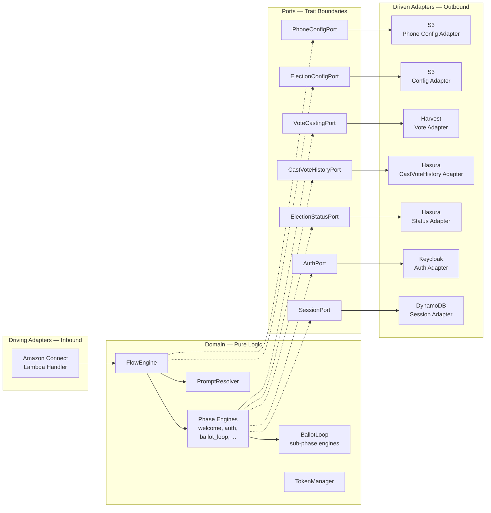

#### 3.5.2 Ports

Ports are the seams between domain logic and the outside world. Each port has **one** external dependency behind it and a narrow responsibility. The exact trait signatures and method shapes are an implementation decision — below is *what each port is for* and *what guarantees it must preserve*, not a prescription for how to spell it in Rust.

| Port | Backed by | Responsibility | Must preserve |
|---|---|---|---|
| **Session** | DynamoDB | Load, save, delete per-call session state keyed by `contact_id` | Conditional writes on **every** path (see §4.1): `attribute_not_exists(contact_id)` on create, `version = :expected` on update. One mechanism, applied uniformly — no read-then-write TOCTOU inside the adapter |
| **Auth** | Keycloak | Exchange collected credentials for tokens; refresh tokens | Never persist credentials in the port; tokens carry an absolute expiry, not a relative `expires_in` |
| **ElectionConfig** | Public S3 | Fetch the published ballot publication pinned to a specific `publication_id` | Process-level cache keyed by `(tenant_id, event_id, publication_id)` so concurrent calls share one copy |
| **ElectionStatus** | Hasura | Query real-time per-channel voting status | Requires a voter JWT (same auth model as the portal) |
| **CastVoteHistory** | Hasura | List ballots already cast by the authenticated voter in the current event; list the per-election `num_allowed_revotes` needed to decide whether re-entry is possible | Row-level scoping via JWT voter claims — mirrors the portal's [`GetCastVotes`](../../../../packages/voting-portal/src/queries/GetCastVotes.ts) / [`GetElections`](../../../../packages/voting-portal/src/queries/GetElections.ts) so the IVR sees exactly what the portal would show the same voter. Distinct from `ElectionStatus` because the question ("what has this voter cast?") and the callers (ballot-loop entry vs. eligibility check) are different — shared Hasura adapter wiring, separate port trait |
| **VoteCasting** | Harvest | Submit an encrypted ballot | Must carry a deterministic idempotency key so retries can't double-submit (§4.1 blockquote) |
| **PhoneConfig** | S3 object (versioned bucket) | Map `caller_phone → tenant/event/URLs` | Read-only from the Lambda — the IAM execution role has `s3:GetObject` on this one object and nothing else on this bucket; no `PutObject`, no `DeleteObject`. Lookups resolve against a process-cached copy of the file (§6.2) |
| **Blacklist** | Hasura (+ service-account JWT via Keycloak `client_credentials`, see §6.3) | Yes/no answer for a phone number before auth | Authenticated query — not an anonymous endpoint. Service token comes from the **platform IVR service client** (shared `client_id` / `client_secret` installed identically in every IVR-enabled realm; secret in Secrets Manager), fetched through a `TokenManager::get_service_token(realm)` path that is **separate** from the voter ROPC path (§5.1.9) |
| **PhoneHasher** | AWS Secrets Manager | Produce `(hash, salt_gen)` for a raw E.164 phone number scoped to a `tenant_id`, for CloudWatch logging | Signature is `hash(tenant_id, e164) -> (hash, salt_gen)` — salt is **per-tenant** so rotation can align with each tenant's election calendar (§9.2.1). Per-container `HashMap<TenantId, (Salt, SaltGen)>` cache, no TTL; a new salt takes effect on cold start. Lambda must never log the raw E.164 — raw values live only in the in-flight DynamoDB session and the Hasura blacklist table |

**Ports are separate; shared backends share one adapter.** Three of the ports above route to Hasura — `ElectionStatus`, `CastVoteHistory`, and `Blacklist` — and they are distinct *ports* because their access patterns diverge (different query set, different JWT principal, different call timing: pre-auth for `Blacklist`, post-auth for the other two). But underneath, all three adapter implementations share a **single `HasuraClient`** per Lambda container — one `reqwest::Client`, one connection pool, one retry/backoff config, one circuit-breaker and metric surface. The port traits stay unaware of each other; the adapter *structs* each hold an `Arc<HasuraClient>` and differ only in which GraphQL document they send and which `TokenManager` they pull the JWT from (voter ROPC for `ElectionStatus` / `CastVoteHistory`, `get_service_token(realm)` for `Blacklist`).

This is called out explicitly because the naive reading of "one port, one adapter" leads to three separate HTTP clients — which would mean 3× connection pools to Hasura, three independent retry budgets firing in parallel when Hasura hiccups, and three places to keep TLS / timeout / tracing config in sync. One shared `HasuraClient` avoids all of that without compromising the port separation that makes the code testable. The same pattern applies to any future port that reaches Hasura: add a new trait, reuse the client.

Three domain types are referenced by the ports but **deliberately left abstract** in this document because the right definition depends on what the implementer chooses to reuse from `sequent-core`:

- **Published ballot publication.** The subset of the S3 publication JSON the IVR reads — event, sorted elections/contests/candidates, crypto config. Start from the portal's existing published-ballot types in `packages/sequent-core` rather than inventing a new one.
- **Encrypted ballot.** The in-memory representation the Lambda builds before calling `/insert-cast-vote`. Must match the portal's ciphertext + proof layout so server-side acceptance rules do not diverge — mirror `sequent-core::ballot`.
- **Auth credentials.** What the Lambda hands to the Auth port. Should be a narrow tagged type (one case per step kind: voter-id, password/PIN, DoB, …), not a `HashMap<String, String>` — the port signature then documents the contract. New step kinds (e.g. OTP, if ever added — see §5.1.4) show up as new cases.

Adapter implementations are free to add methods (batch queries, streaming, etc.) as long as the responsibility above stays intact. Tests substitute in-memory adapters; the handler wires the live ones.

#### 3.5.3 Domain: Flow Engine

**Key concept — the Lambda is stateless.** Every invocation loads the session from DynamoDB (including the cursor into the flow pipeline), executes exactly one phase, saves the updated session, and responds. There is no in-memory state that survives between invocations other than the process-level publication cache.

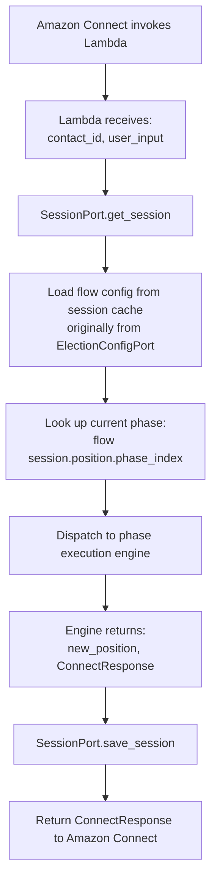

The flow engine's job is small:

1. **Intercept the reserved `*` = repeat key** before dispatch. If the incoming `LambdaInput` is `Dtmf("*")` and the session has a cached `last_response` (§4.1), return that cached response unchanged — the phase executor is **not** invoked, the cursor is not advanced, and no session fields are mutated other than `version`. This makes the §3.4 reserved-key promise ("`*` repeats instructions uniformly across every phase and sub-phase") true by construction: no phase executor sees `*`, so no phase executor can forget to honor it. If there is no cached response (e.g., `*` arrives on the very first turn before any input-expecting prompt has been rendered), fall through to normal dispatch — the phase executor may treat it as an invalid input per its own rules.
2. **Look up the current phase** from the pipeline using the cursor in session state.
3. **Dispatch to the right phase executor.** A typed (tagged-enum-style) pipeline makes the dispatch exhaustive — unknown phase tags fail at deserialization time, never mid-call.
4. **Cache the response, then return it unchanged** from the phase executor. If the returned response has `expect_input = true`, it is stored in `session.last_response` so the next turn's `*` interception has something to replay. Auto-advancing responses (`expect_input = false`) are not cached — there is nothing to repeat yet, and the next input-expecting turn will overwrite the slot.

The engine itself owns no state. It borrows the flow pipeline, the prompt resolver, and the published ballot publication for the duration of the invocation. Phase executors are pure functions of `(session, input, ports) → (new session, response)`; all external effects happen through ports. Phase executors **must not** list `*` in their own per-phase `valid_inputs` handling or treat `*` as invalid input — the dispatcher owns it before the executor is called; adding `*` to `valid_inputs` on the outgoing response is the dispatcher's responsibility too, so every input-expecting prompt accepts `*` automatically.

**Phase context — `PhaseCtx<'a>`.** A struct of `&'a dyn Port` references (one field per port) plus non-port environment (`publication`, `prompts`, `clock`). Every phase executor has the same signature `fn(&mut IvrSession, &LambdaInput, &PhaseCtx<'_>) -> PhaseResult`; dispatch is a mechanical `match` on the phase enum. Rejected alternatives: a generic `PhaseCtx<S, A, …>` (9+ type parameters for unmeasurable perf, against I/O-bound code) and a single "god trait" (collapses the one-port-one-responsibility rule from §3.5.2). Constraint: every port trait MUST be object-safe — no generic methods, `&self` receivers, async via `async_trait` — which is how they want to be written anyway. Test doubles are hand-rolled fakes behind `dyn Port`.

#### 3.5.4 Domain: Ballot Loop Phase (Sub-Phase Dispatch)

The ballot-loop phase is itself a tiny flow engine one level down: it holds a sub-phase cursor (which sub-phase of the loop is active) and dispatches to the matching sub-phase executor. On first entry — when the previous outer phase has just transitioned into the loop — it initializes the cursor: computes the sorted election IDs using `elections_order`, decides whether to skip `ElectionSelect` (per §3.3.1 `skip_election_list`), reads the voter's cast-vote history through `CastVoteHistoryPort` so subsequent sub-phases can distinguish already-voted elections from eligible ones (§9.3), and seeds sub-phase state.

Sub-phase executors follow the same pure-function shape as outer phases. Most of them only need the session, the input, prompts, and the published publication. `ElectionSelect` additionally reads from the `CastVoteHistoryPort` (to annotate already-voted elections), and `ElectionSubmit` is the only one that reaches the Auth and VoteCasting ports.

Sub-phase transitions (what advances to what, when the loop goes back to `ElectionSummary` vs. forward to the next contest, how `edit_target_contest` interacts with `VoteConfirm`, and how the `enter_contest_edit` helper is the single owner of the edit-entry invariant in §3.3.4) are fully specified in §3.3; the dispatch code itself is mechanical.

**Two dispatchers by design, not by accident.** The outer dispatcher (§3.5.3) and this one are *not* unified into a single generic dispatcher, even though both take the shape `(cursor, input) → (new_cursor, response)`. They dispatch different kinds of flow: the outer flow is a **configurable linear pipeline** (admin-editable at publication time, cursor is `phase_index: usize`, reserved-key interception for `*` lives at this level); the ballot-loop flow is a **closed state machine** (fixed sub-phase set modelling "cast one ballot", non-linear transitions, never sees `*` because the outer dispatcher has already consumed it). A unified dispatcher would need generics over cursor shape, transition kind, and port-context width — machinery that hides the difference rather than expressing it. The sub-phase set is not a configuration surface, so adding new outer phase types does not reopen this design.

#### 3.5.5 Driving Adapter: Lambda Handler

The handler is thin — it does not contain business logic, it wires things together:

1. Read `contact_id` and the optional `user_input` DTMF from the Connect event.
2. Load or create the session via the Session port. Create uses `ConditionExpression: attribute_not_exists(contact_id)` — symmetric with the `version = :expected` guard on the update path (§4.1); a concurrent creator surfaces as `SessionRaced` and is handled by the same reload-and-decide policy. On create, look up the caller phone in the phone-config file (S3, §6.2) and snapshot the URLs/realm into the session so later phases don't re-read the routing config.
3. Fetch the published publication via the ElectionConfig port, pinned to the session's `publication_id` (§5.1.8).
4. Construct the flow engine from the publication and invoke it.
5. Save the session through the Session port (with optimistic concurrency, see §4.1) and return the response to Connect.

Errors bubble up through `IvrError`; the handler's only job with them is turning the "presented-to-voter" errors (§8.2) into a response whose prompt + `should_disconnect` match the error's intent, and logging the internal errors.

#### 3.5.6 Testing Strategy

The pure-function shape of phase executors is the lever — every interesting scenario can be driven as `(session_in, input) → (session_out, response)`:

- **Phase / sub-phase unit tests.** Construct a session, call the executor with in-memory adapters, assert on the resulting session cursor and response prompt key. No DynamoDB, S3, or HTTP.
- **Record-and-replay session tests.** Because every turn is deterministic, a full call is a list of `(input, expected_prompt_key, expected_expect_input, expected_disconnect)` tuples. Client IVR specs (Barrie-style) become replay fixtures checked in alongside the code — regressions fail at CI time against a known-good script. (See §15.2.)
- **Text-in / text-out harness.** The same pure-function shape lets the engine run without Amazon Connect at all — stdin/stdout (CLI), a fixture file, or a hosted endpoint — substituting only the Connect adapter. Used for automated scenarios and the `step-ivr` CLI for manual walkthroughs and reproducing production issues. (See §15.2.1.) The admin portal is deliberately *not* a consumer of this harness in the initial release (§7.4); it remains a text-only editor.
- **Contract tests at port boundaries.** The `/ivr-config` response shape (§5.1.2) is verified by running a real Keycloak with a representative flow and asserting the JSON matches the Lambda's parser. (See §15.3.)
- **End-to-end tests** exercise the Connect contact flow, Polly, and the live Harvest/Hasura/Keycloak stack.

The developer picks the concrete mock / trait-double style (`mockall`, hand-rolled fakes, `wiremock` for HTTP-level fakes, etc.) per port.

#### 3.5.7 Why Hexagonal Architecture

1. **Testable** — Domain logic tested with mock ports; no DynamoDB/S3/HTTP in unit tests
2. **Portable** — Same domain could run in a different runtime (e.g., local CLI for testing) by swapping adapters
3. **Isolated changes** — Switching from DynamoDB to Redis = new adapter, zero domain changes. Adding a new external service = new port + adapter
4. **Phase engines are pure** — Given session state + input, produce new state + response. No side effects except through ports
5. **Config-driven** — Flow composition is data, not code. Adding/removing phases = config change
6. **Ballot behavior from source of truth** — Contest rules (blank, decline, min/max, ordering) read from published election data, same as voting portal

### 3.6 Channel-Specific Voting Periods

Phone voting can have independent start/stop times from online voting, following the same pattern as KIOSK and EARLY_VOTING channels.

**What must exist.** `ElectionEventStatus` in `sequent-core` already carries per-channel status + period pairs for `voting` (online), `kiosk`, and `early_voting`. The IVR feature adds a fourth channel — `telephone` — using the same shape: a `VotingStatus` field plus a `PeriodDates` field. Hasura permissions, admin-portal UI, and any code that iterates over channels must be updated to treat the new channel uniformly with the others; there is nothing IVR-specific about the status/period representation itself.

This allows administrators to configure phone voting hours independently (e.g., phone voting 9am–5pm, online voting 24/7). TELEPHONE is selected at the authorization layer directly from the JWT `azp` claim (`ivr-voting`); the full `AzpClient` → `VotingStatusChannel` mapping — kiosk straight from `azp`, portal clients fanning out into ONLINE vs EARLY_VOTING via the area's early-voting window — lives in Appendix C.7. See also §5.2 and [`sequent_core::services::authorization::authorize_voter_election`](../../../../packages/sequent-core/src/services/authorization.rs).

---

## 4. Data Models

### 4.1 DynamoDB Session State Table

**Table Name**: `ivr-voting-sessions`

**Primary Key**: `contact_id` (Amazon Connect Contact ID)

**Design principle.** The session is per-contact and stays well under DynamoDB's 400 KB limit — anything large (prompts, elections, candidates, auth steps, event presentation) lives in the process-level publication cache keyed by `(tenant_id, election_event_id, publication_id)`. A large municipality (dozens of contests × hundreds of candidates × multiple language bundles) can exceed 400 KB on its own, so duplicating the publication per call would be both wasteful and fragile. See §5.1.8 for the publication-discovery flow.

**Concurrency & idempotency.** A given contact moves through its Connect flow strictly sequentially — Connect does not issue overlapping Lambda invocations for the same `contact_id`, and it does not auto-retry a synchronous `Invoke Lambda` block (unlike async `Event`-type invocations, Connect's sync calls fail over to the Error branch rather than being retried). The races that matter are therefore not Lambda-vs-Lambda *inside one call*; they are Lambda-vs-its-backends and Lambda-vs-other-callers:

- **Harvest partial completion.** The handler encrypts and submits a ballot, Harvest writes it and commits, then the response is lost — the Lambda times out mid-flight, the socket drops, or the process is OOM-killed. Connect follows the Error branch, `HandleError` runs on the next turn, and, absent a defense, it might resubmit — silently recording a second ballot for the voter. This is the common-case race, and it is a property of *any* non-idempotent HTTP backend, not of Connect.
- **External invokers of a live session row.** The `step-ivr` CLI (§3.5.6), the text-in/text-out replay harness, and diagnostic replays during incident response can all re-enter the handler against a `contact_id` that also has a live Connect call. They must fail safely instead of clobbering state.
- **Defense in depth against Connect edges we don't model.** Transfers, holds, and future Connect features could introduce interleavings the current design does not anticipate. A cheap conditional-write guard is durable against "something we didn't think of."

A naive `get_session → mutate → save_session` in any of those scenarios would let the later write silently clobber the earlier one — potentially dropping a selection, double-submitting a vote already accepted by Harvest, or advancing the phase cursor to a position the voter never reached. Three layers prevent that:

1. **Conditional writes on every `SessionPort` mutation.** `IvrSession` carries a `version: u64` (see struct below) bumped on every update, and the DynamoDB `PutItem` is guarded by `ConditionExpression: version = :expected`. The **create** path is guarded by the same mechanism, using a different precondition: `ConditionExpression: attribute_not_exists(contact_id)`. One write model — "put succeeds only if the precondition holds" — applied uniformly to create and update, with no read-then-write window inside the adapter where a concurrent creator or updater could slip through unnoticed.

   The create-path guard is belt-and-suspenders. A given `contact_id` should not see two concurrent cold-starts in production: Connect runs the contact flow strictly sequentially for one contact and does not auto-retry the synchronous `Invoke Lambda` block. The guard exists to protect against the same class of scenarios that motivates the update-path guard — external invokers against a live `contact_id` (the `step-ivr` CLI, replay harnesses, diagnostic re-runs), contact-flow authoring mistakes that fork two Invoke-Lambda branches before init completes, and the general "something we didn't model" category. Costs nothing at runtime (it's a single DynamoDB condition), stays consistent with the update-path pattern, and removes an otherwise-silent race class from the adapter contract.

   Both guards surface a lost race internally as `IvrError::SessionRaced`, which **is never presented to the voter as a user-facing prompt** — the scenarios these guards defend against are not voter-caused, so "please try again" would be both confusing and pointless. Instead, the handler applies a reload-and-decide policy:

   - On `SessionRaced`, re-`get_session` to see what the winning writer committed.
   - If the reloaded `position` has already advanced past this invocation's starting cursor, the other writer did our work for us — **drop silently and return a no-op response**, logging the conflict with full context (who the winning writer was, if derivable). This is option *(c)* — ignore and log — from the finding's list, and it is the correct answer for every race this defends against.
   - If the reloaded session is still at our starting version but something else changed under us, retry the write exactly once against the fresh version. A second `SessionRaced` on the same turn indicates a degenerate situation that should not occur in production: log at `error` level with full context and return the generic `system_error` prompt with disconnect.

   The result: `SessionRaced` has no voter-visible prompt, and the voter never hears a "please try again" for something they did not cause. The only voter-visible error that can come out of this path is `system_error` on the second-failure arm, which is already generic, already disconnects, and already covers arbitrary internal faults (§8.2).
2. **Encrypt-once, resubmit-same for vote idempotency.** This is the defense against the Harvest partial-completion race, and it is load-bearing. `ballot_id` is the SHA-256 of the encrypted ballot content — Harvest recomputes it and rejects `BallotIdMismatch`, so the Lambda cannot simply pick a deterministic ID. Instead, the Lambda encrypts each election's ballot **exactly once per session** and caches the encrypted payload + its `ballot_id` in the session (a per-election slot on `IvrSession`). An `ElectionSubmit` retry after a timeout resubmits the cached payload verbatim: same ciphertext → same hash → same `ballot_id` → Harvest's existing revote check (`CheckRevotesFailed` / `InsertFailedExceedsAllowedRevotes` when `max_revotes = 1`, see §5.4) rejects the second attempt rather than recording a second ballot. Re-encrypting on retry would produce a new `ballot_id` (fresh ElGamal randomness) and defeat the de-dup, so the "encrypt once, store, resubmit" rule is a load-bearing invariant.
3. **Connect-side input-replay contract.** Although Connect does not auto-retry `Invoke Lambda`, the contact flow itself must be authored so it doesn't *manually* reintroduce a retry loop. On the "Invoke Lambda" block's failure branch, the flow plays `system_error` and disconnects — it does not wire the Error branch back into the same "Get customer input" block. This makes each `(contact_id, turn)` pair at-most-once by construction. The contract is asserted in the contact-flow fixture tests (§15) so a flow edit that reintroduces a retry loop fails CI.

```rust
/// Per-call session state stored in DynamoDB. The ballot publication is
/// NOT here — it is cached at the Lambda process level (see design note
/// above and §5.1.8).
#[derive(Serialize, Deserialize)]
pub struct IvrSession {
    // Identity — pins the call to one publication snapshot
    pub contact_id: String,
    pub caller_phone: String,
    pub call_start_time: DateTime<Utc>,
    pub tenant_id: Uuid,
    pub election_event_id: Uuid,
    /// Process-level publication cache key. Resolved once at session init
    /// so a mid-call republish cannot change the ballot under the voter.
    pub publication_id: String,

    // URL snapshot — copied once from PhoneConfig at session init
    pub keycloak_url: String,
    pub harvest_url: String,
    pub hasura_url: String,
    pub s3_public_base_url: String,
    pub keycloak_realm: String,

    // Authentication
    pub voter_id: Option<String>,
    pub access_token: Option<String>,
    pub refresh_token: Option<String>,
    /// Absolute Unix timestamp from the JWT `exp` claim — not a relative
    /// `expires_in`, so it round-trips through DynamoDB without rebasing.
    pub access_token_expires_at: Option<i64>,
    pub session_started_at: Option<i64>,
    pub area_id: Option<Uuid>,
    /// Auth step list pinned at session init from Keycloak's /ivr-config
    /// (§5.1.7). Read once; every subsequent turn reads from here, not
    /// from Keycloak — a mid-call admin edit to the Direct Grant flow
    /// cannot change what credentials this call collects.
    pub auth_steps: Vec<AuthStep>,

    // Event-level language — chosen once in the outer `LanguageSelect`
    // phase and fixed for the rest of the call. Per-election overrides
    // live on `BallotLoopState.election_language_override` (§3.3.4) and
    // are read via `effective_language()`; this field is never mutated
    // by the inner `LanguageSwitch` sub-phase.
    pub language: Language,

    // Votes in progress — accumulated during ballot loop, consumed by ElectionSubmit
    pub votes: HashMap<Uuid, ContestVote>,

    /// Per-election encrypted-ballot cache, populated the first time
    /// `ElectionSubmit` is attempted for that election and reused on any
    /// subsequent retry. Guarantees that an `ElectionSubmit` retry after a
    /// timeout hashes to the same `ballot_id` (which is the SHA-256 of the
    /// encrypted content — see §9.3), so Harvest rejects the resubmission
    /// as a duplicate rather than recording a second ballot.
    pub encrypted_ballots: HashMap<Uuid, EncryptedBallotCacheEntry>,

    // Submission results — drives ElectionReceipt and the end-of-call summary
    pub submission_results: Vec<ElectionSubmissionResult>,

    // Flow engine cursor + phase-local state
    pub position: FlowPosition,

    /// Cached response from the previous turn, used by the dispatcher-level
    /// `*` = repeat short-circuit (§3.5.3, §3.4). Overwritten on every turn
    /// that produces a response with `expect_input = true`; not written on
    /// auto-advancing turns (there is nothing to repeat yet). On `*` input,
    /// the dispatcher returns this unchanged — the phase executor is not
    /// invoked, so `*` cannot accidentally advance or mutate state. Kept
    /// on the session rather than re-rendered on demand because phase
    /// executors may auto-advance on `NoInput`; a dedicated "render-only"
    /// mode would have to thread through every executor, and persisting
    /// the response is cheaper.
    pub last_response: Option<ConnectResponse>,

    /// Per-error-class retry counters. Distinct reset semantics — see
    /// `RetryCounters` below and §8.1.
    pub retries: RetryCounters,

    /// Optimistic-concurrency guard for the update path. Bumped on every
    /// write; the DynamoDB `PutItem` is guarded by
    /// `ConditionExpression: version = :expected`. The create path uses
    /// `ConditionExpression: attribute_not_exists(contact_id)` instead —
    /// same "put only if the precondition holds" model, different
    /// precondition. Lost races (either guard) surface internally as
    /// `IvrError::SessionRaced` and are handled via the reload-and-decide
    /// policy described in §4.1 — never surfaced to the voter as a prompt.
    pub version: u64,

    /// DynamoDB TTL — sliding idle window (default 1 h) capped at a
    /// hard ceiling of `session_started_at + ssoSessionMaxLifespan`, so
    /// long calls don't lapse mid-flight but a looping contact flow
    /// can't keep a row alive forever. See §9.2.1.
    pub ttl: i64,
}

/// Separate retry counters by error class. A single counter would mix up
/// unrelated kinds of failure — "3rd invalid DTMF while picking a candidate"
/// must not cross-contaminate "3rd auth attempt". Reset semantics:
///
/// - `auth` — cleared on successful authentication.
/// - `invalid_input` — cleared on any phase or sub-phase transition.
/// - `timeout` — cleared on any successful DTMF capture.
///
/// Maximums are configurable per event via `presentation.ivr.retry_limits`
/// (§7.3). Default 3 for each counter; missing values fall back to this.
#[derive(Serialize, Deserialize, Clone, Default)]
pub struct RetryCounters {
    pub auth: u8,
    pub invalid_input: u8,
    pub timeout: u8,
}

/// Flow position: cursor into the phase pipeline plus per-phase state.
/// The `state` variant must correspond to the `FlowPhase` variant at
/// `flow_config[phase_index]`. Enforced by construction, not by runtime
/// checks alone — see **Invariant: positional variant alignment** below.
#[derive(Serialize, Deserialize, Clone)]
pub struct FlowPosition {
    pub(crate) phase_index: usize,
    pub(crate) state: PhaseState,
}

/// Phase-internal state — one variant per `FlowPhase` variant. Each phase
/// carries its own state shape; no generic "entry / waiting / done" state
/// every phase has to interpret.
#[derive(Serialize, Deserialize, Clone)]
pub enum PhaseState {
    Announcement(AnnouncementState),
    LanguageSelect(SimpleState),
    BlacklistCheck(SimpleState),
    Auth(AuthState),
    EligibilityCheck(SimpleState),
    BallotLoop(BallotLoopState),
    Goodbye(SimpleState),
}

/// Fallback state for phases that collapse to "play, optionally wait for
/// input, advance."
#[derive(Serialize, Deserialize, Clone)]
pub enum SimpleState {
    Entry,
    WaitingForInput,
}

#[derive(Serialize, Deserialize, Clone)]
pub struct AnnouncementState {
    pub simple: SimpleState,
}

#[derive(Serialize, Deserialize, Clone)]
pub struct AuthState {
    /// Current index into the auth step list discovered via /ivr-config.
    pub step_index: usize,
}
```

**Flow phases (typed dispatch).** The flow is a list of typed phases, not
a list of `{ phase: String, config: HashMap<String, Value> }` pairs —
per CLAUDE.md's "policies use enums, not magic strings" rule. An
exhaustive match in the dispatcher gives compile-time coverage, and the
admin portal can render form fields from each variant's shape. A typo in
a config key fails at deserialization time, not mid-call.

```rust
#[derive(Serialize, Deserialize, Clone)]
#[serde(tag = "phase", rename_all = "snake_case")]
pub enum FlowPhase {
    /// Play a prompt, optionally wait for an acceptance key. Covers
    /// welcome / declaration / pre-voting statement.
    Announcement(AnnouncementConfig),
    LanguageSelect,
    BlacklistCheck,
    Auth,
    EligibilityCheck,
    BallotLoop(BallotLoopConfig),
    Goodbye,
}

#[derive(Serialize, Deserialize, Clone)]
pub struct AnnouncementConfig {
    /// Non-semantic label used for logs, metrics, and admin-portal
    /// rendering. Examples: "welcome", "declaration", "pre_voting_statement".
    pub name: String,
    /// Prompt key looked up in the i18n bundle for the current language.
    pub prompt_key: String,
    /// If `Some("2")`, the voter must press `2` to advance (Barrie
    /// declaration style). If `None`, the engine auto-advances.
    pub accept_key: Option<String>,
}

#[derive(Serialize, Deserialize, Clone, Default)]
pub struct BallotLoopConfig {
    /// A 4-character ballot locator read back phonetically, or none.
    pub receipt_format: Option<ReceiptFormat>,
}

#[derive(Serialize, Deserialize, Clone)]
#[serde(rename_all = "snake_case")]
pub enum ReceiptFormat {
    PhoneticHex4,
}

/// One auth step — retrieved from Keycloak's /ivr-config endpoint,
/// NOT from S3. The list reflects the realm's Direct Grant flow
/// execution order.
#[derive(Serialize, Deserialize, Clone)]
pub struct AuthStep {
    /// Semantic name, e.g. "voter_id", "pin", "dob".
    pub field: String,
    pub max_digits: u8,
    /// "#", "*", or "".
    pub terminator: String,
    /// ROPC form param: "username", "password", "dob", etc.
    pub maps_to: String,
    /// Override; if `None`, derive from `maps_to` (see §5.1.3).
    pub prompt_key: Option<String>,
}
```

**Invariant: positional variant alignment.** `FlowPhase` and `PhaseState` are parallel enums whose variants must stay positionally matched (`FlowPhase::Auth` pairs with `PhaseState::Auth`, etc.). Enforced by construction, not by a single runtime assertion:

1. **`FlowPhase::initial_state()`** is the single mapping between the two enums — one exhaustive match. Adding a `FlowPhase` variant without its `PhaseState` peer fails to compile.
2. **`FlowPosition::new(flow)` and `FlowPosition::advance(flow)`** are the **only** paths that construct or move a position; both go through `initial_state()`. Fields are crate-private so no call site can hand-build a mismatched pair.
3. **Dispatch co-matches** on `(phase, state)` exhaustively; a surviving `_` arm returns `IvrError::PhaseStateMismatch` — a last-line-of-defence, logged, treated the same way as `SessionRaced` (reload and decide, §4.1).
4. A unit test iterates both enums and asserts the matching is total.

**Why not bundle config and state into one enum** (`Announcement(AnnouncementConfig, AnnouncementState)`, etc.)? Full compile-time enforcement would require this, but it conflates **immutable flow config** (from S3, cached at process level, shared across sessions — §5.1.8) with **mutable per-turn session state** (serialized to DynamoDB every invocation). That would either write the whole pipeline back to DynamoDB per turn or require custom serde that strips config on write and rebinds on read — in both cases adding more machinery than it saves. The (1)–(4) combination above shrinks the engineer-error surface to zero for practical purposes, which is the actual payoff; the residual runtime check exists only for defence in depth.

**Ballot loop context.** Rendering and validation need access to election / contest / candidate data from the publication (name, ordering, per-contest `max_votes` / `min_votes`, blank-vote policy, under-vote policy, the DTMF option assigned to each candidate at session init). Reuse the existing `sequent-core` types (`EBlankVotePolicy`, `EUnderVotePolicy`, `VoteBehavior`, candidate/contest/election models) rather than redeclaring them. Per-contest voter choices and per-election submission outcomes round-trip through DynamoDB:

```rust
#[derive(Serialize, Deserialize)]
pub struct ContestVote {
    pub contest_id: Uuid,
    pub selected_candidate_ids: Vec<Uuid>,
    pub is_blank: bool,
    pub is_declined: bool,
}

/// Cached encrypted ballot for one election. Populated once when
/// `ElectionSubmit` first runs for that election; reused verbatim on
/// any retry so `ballot_id` (= SHA-256 of `content`) stays stable and
/// Harvest's duplicate check catches the retry. See §9.3.
#[derive(Serialize, Deserialize)]
pub struct EncryptedBallotCacheEntry {
    /// Serialized `SignedHashableBallot` — the exact bytes POSTed to
    /// Harvest `/insert-cast-vote`.
    pub content: String,
    /// Hex-encoded SHA-256 of `content`; matches the `ballot_id`
    /// Harvest will recompute and validate.
    pub ballot_id: String,
}

/// Result of submitting one election's ballot during ElectionSubmit.
/// Extend at the enum, not with booleans.
#[derive(Serialize, Deserialize)]
pub struct ElectionSubmissionResult {
    pub election_id: Uuid,
    pub status: SubmissionStatus,
    /// Ballot hash — used to derive the spoken ballot locator in
    /// ElectionReceipt. Current format: first 4 hex characters read
    /// phonetically.
    pub ballot_hash: Option<String>,
}

#[derive(Serialize, Deserialize)]
pub enum SubmissionStatus {
    Success,
    /// Per-election rejection from Harvest — the adapter has already
    /// classified the `CastVoteError` variant into a prompt-ready shape.
    /// See §5.4 for the rejection taxonomy and the raw-variant mapping.
    Rejected(CastVoteRejection),
    /// Transport-level failure (timeout, 5xx, malformed body) — played
    /// as `vote_failed`; the ballot loop advances to the next election.
    Failed { error: String },
}
```

### 4.2 Lambda Request/Response Models

**Request from Amazon Connect.** Connect's invocation payload shape is a fixed AWS contract — prefer the AWS Lambda Rust runtime's published types over redefining them. The Lambda reads only the fields the handler needs: `ContactId`, the E.164 `Address` from `CustomerEndpoint`, any DTMF captured in the previous turn from `Parameters`, and any attributes set by earlier contact-flow blocks.

```rust
#[derive(Deserialize)]
pub struct ConnectEvent {
    pub Details: ContactDetails,
}

#[derive(Deserialize)]
pub struct ContactDetails {
    pub ContactData: ContactData,
    /// Bag of `{ String: String }` set by the contact flow's "Invoke
    /// Lambda" block — carries the DTMF captured on the previous turn.
    pub Parameters: HashMap<String, String>,
}

#[derive(Deserialize)]
pub struct ContactData {
    pub ContactId: String,
    pub CustomerEndpoint: Endpoint,
    pub Attributes: HashMap<String, String>,
}

#[derive(Deserialize)]
pub struct Endpoint {
    /// E.164 caller phone.
    pub Address: String,
    /// "TELEPHONE_NUMBER".
    pub Type: String,
}
```

**Response to Amazon Connect.** Deliberately minimal — just enough for the contact flow to play a prompt and optionally capture input. No SSML flag, no error flag, no debug dump. An "error" is just a prompt with `should_disconnect = true`; the contact flow does not need to know. Internal phase-state debugging belongs in CloudWatch structured logs (§10.2), not in the Connect attribute bag.

```rust
#[derive(Serialize)]
pub struct ConnectResponse {
    /// Text (plain or SSML) played via Polly. SSML is allowed; see §7.2
    /// for language-tag usage and the required sanitizer.
    pub prompt_text: String,
    /// Whether the contact flow should capture DTMF after the prompt.
    pub expect_input: bool,
    /// Characters allowed on this turn — digits `0`–`9`, `*`, `#`, or
    /// multi-digit sequences like `00#`, `01#`, …. Empty when
    /// `expect_input = false`. Enforced by the Lambda on the next turn;
    /// the contact flow's input block does not filter. See §3.4 for the
    /// reserved-key convention.
    pub valid_inputs: String,
    /// Seconds to wait for DTMF before timing out.
    pub input_timeout: u8,
    /// If `true`, the contact flow plays the prompt and disconnects.
    pub should_disconnect: bool,
}
```

---

## 5. API Integration

### 5.1 Authentication Flow

Authentication uses **standard OIDC Direct Grant (ROPC)** via Keycloak's token endpoint. The Lambda does not know what authentication factors are required — it discovers them at runtime by asking Keycloak, collects credentials accordingly, and submits them to the token endpoint.

**Design principle: Keycloak is the single source of truth for auth configuration.** The realm's Direct Grant flow already defines which credentials are required; duplicating that into `presentation.ivr.auth` in S3 would create drift between the two. Instead, the Lambda queries a small custom Keycloak REST endpoint that derives the auth step list from the realm's flow executions.

#### 5.1.1 How It Works

1. **At session init**, Lambda calls `GET {KEYCLOAK_URL}/realms/\{realm\}/ivr-config` — a custom Keycloak REST extension that walks the realm's Direct Grant flow and returns an ordered list of auth steps. The call carries the `ivr-service` client_credentials bearer token (the same service JWT reused for the pre-auth blacklist read in the same turn, §6.3); the Lambda fetches it via `TokenManager::get_service_token(realm)` (§5.1.9) and the per-realm token cache is normally already warm from the blacklist call
2. Lambda caches the response in the DynamoDB session record (same cache used for S3 election config)
3. For each step, Lambda prompts for DTMF input using a **well-known prompt key** derived from the step's `maps_to` field (see 5.1.3)
4. Lambda maps collected fields to ROPC form parameters and POSTs to Keycloak's token endpoint
5. On success, Lambda stores the JWT and proceeds to the next flow phase

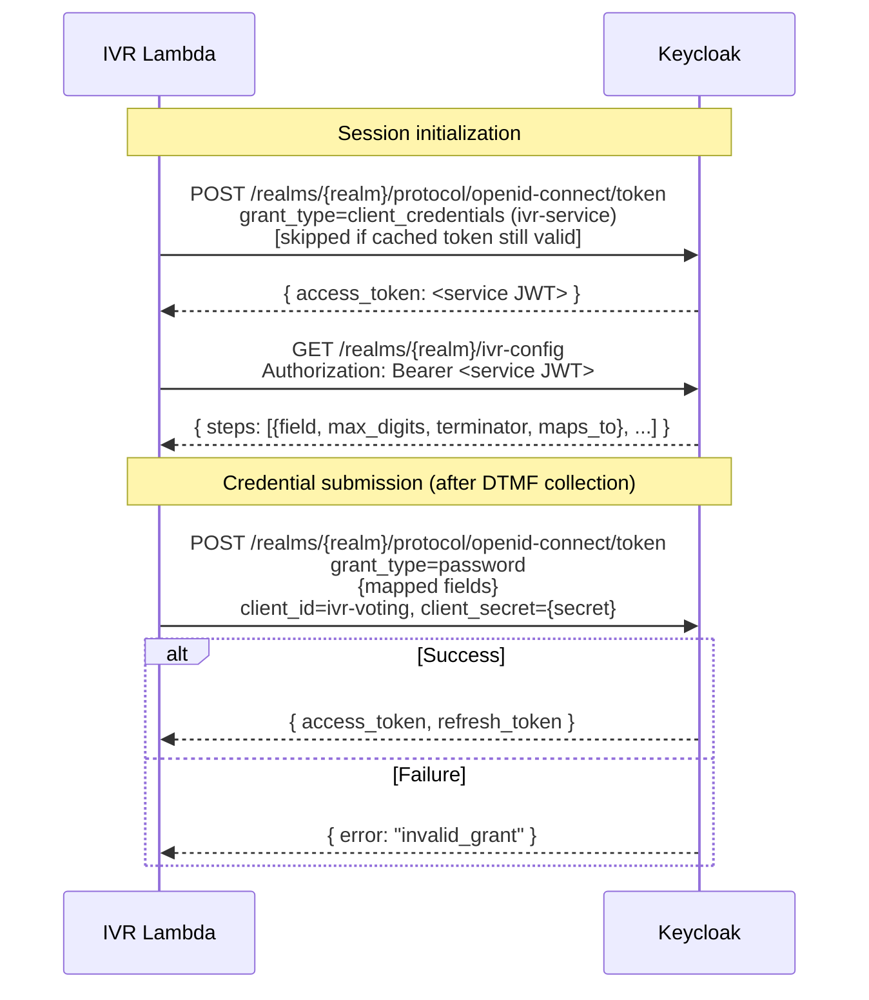

The Lambda doesn't know whether it's collecting a PIN, DoB, or any other credential — it just iterates the discovered steps, collects digits, and maps them to ROPC parameters. Keycloak validates them using the authenticators configured on the realm's Direct Grant flow.

#### 5.1.2 The `ivr-config` Keycloak Endpoint

A new Keycloak REST extension (`ivr-config-resource`, see Appendix C.8.2) exposes a single endpoint:

```
GET /realms/{realm}/ivr-config
```

**Response (voter_id + PIN deployment, both from stock authenticators):**
```json
{
  "steps": [
    { "field": "voter_id", "max_digits": 8, "terminator": "#", "maps_to": "username" },
    { "field": "pin",      "max_digits": 8, "terminator": "#", "maps_to": "password" }
  ]
}
```

**Response (voter_id + DoB deployment, DoB coming from the custom `IvrDobAuthenticator`):**
```json
{
  "steps": [
    { "field": "voter_id", "max_digits": 8, "terminator": "#", "maps_to": "username" },
    { "field": "dob",      "max_digits": 8, "terminator": "#", "maps_to": "dob" }
  ]
}
```

**How the endpoint builds the response** (~100 lines of Java — see Appendix C.8.2 for full implementation notes):

1. Look up the effective Direct Grant flow for the `ivr-voting` client (client-level override if present, else realm default)
2. Walk the flow's executions in order, filtering to `REQUIRED` / `CONDITIONAL` (matches the Java filter in Appendix C.8.2; `ALTERNATIVE` and `DISABLED` executions are ignored)
3. For each execution, produce a step from one of two sources:
   - **Stock Keycloak authenticators** — a small static lookup table baked into the extension:
     - `direct-grant-validate-username` → `{ field: "voter_id", max_digits: 8, terminator: "#", maps_to: "username" }`
     - `direct-grant-validate-password` → `{ field: "pin", max_digits: 8, terminator: "#", maps_to: "password" }`
   - **Custom IVR authenticators** (`IvrDobAuthenticator`, etc.) — read the execution's `AuthenticatorConfig`, which the admin configures in the Keycloak admin UI. Each custom authenticator declares these keys in its `getConfigProperties()`: `field_name`, `max_digits`, `terminator`, `maps_to`
4. Return the list as JSON

**The endpoint requires the `ivr-service` client_credentials bearer token** — the same service JWT the Lambda already obtains for the pre-auth blacklist read (§6.3, §C.8.b), fetched through `TokenManager::get_service_token(realm)` (§5.1.9). Authorization is gated by the same service-account role mapping (`can_read_phone_blacklist` — the role also carries `/ivr-config` read rights; see §C.8.b). Rationale: although individual fields (`max_digits`, `terminator`, `maps_to`) are low-sensitivity, the *shape* of the list (how many factors, whether DoB or PIN is active, whether a custom authenticator is configured) is a meaningful fingerprint of a realm's auth posture, and there is no reason to leave it anonymously enumerable per-realm. The marginal engineering cost is near-zero because the service-auth path already exists for the blacklist read earlier in the same turn: the Lambda simply attaches the cached service token to the outbound HTTP call. No new secret, no new client, no new cache.

**If the admin adds a non-IVR-aware authenticator** to the flow, the endpoint returns `500 Internal Server Error` with a clear message identifying the unknown authenticator ID, so misconfigurations surface at deployment time instead of mid-call.

#### 5.1.3 Prompt Keys — Well-Known by `maps_to`

The Lambda uses a **fixed, well-known mapping** from ROPC parameter name to prompt key. This keeps the config minimal — since auth fields are essentially just "username", "password", and a few standard custom fields, admins only need to provide translations for a handful of prompt keys that never vary per election.

| `maps_to` value | Prompt key | Typical content |
|---|---|---|
| `username` | `auth_enter_username` | "Please enter your voter ID followed by the number sign key." |
| `password` | `auth_enter_password` | "Please enter your PIN (or date of birth) followed by the number sign key." |
| `dob` (custom) | `auth_enter_dob` | "Please enter your date of birth as MMDDYYYY followed by the number sign key." |

These keys live in `presentation.i18n[lang].ivr`, the same namespace used for all IVR prompts and IVR-only spoken-text overrides. The admin provides translations in the admin portal's IVR Prompts editor. The Lambda ships sensible English/French defaults for each well-known key as a fallback.

**If a custom authenticator uses a new `maps_to` value** that isn't in the table, the admin can override the prompt key via the authenticator's `AuthenticatorConfig` (`prompt_key` property). The endpoint passes it through in the step response:

```json
{ "field": "birth_year", "max_digits": 4, "terminator": "#", "maps_to": "birth_year", "prompt_key": "auth_enter_birth_year" }
```

Lambda precedence: step's explicit `prompt_key` (if present) > well-known mapping by `maps_to` > error.

#### 5.1.4 OTP Flow — Possible Future Extension (Not In Scope)

**OTP over IVR is not planned for the initial release.** None of the deployments currently on the roadmap require a second factor delivered over the phone channel — voter-ID + PIN (or voter-ID + DoB) is sufficient. This section documents the shape a future extension could take so the current architecture doesn't foreclose it, not a feature to build now.

**If it is ever added,** the natural shape — which this design deliberately leaves room for — is:

1. Lambda submits the first ROPC call with the collected credentials (unchanged).
2. Keycloak's Direct Grant flow can return an `otp_required` error the same way it does for TOTP today. No IVR-side config would be needed; whether OTP runs would be purely a Keycloak flow decision.
3. On `otp_required`, the Lambda collects an OTP code via DTMF (new phase-internal state) and resubmits all original credentials plus `otp={code}` to the same token endpoint.
4. On success → JWT issued. On failure → retry or disconnect.

This fits cleanly because: (a) the auth credentials port (§3.5.2) is a tagged type that can grow a new `Otp` case, (b) the `/ivr-config` endpoint does not need to declare OTP — it would be discovered reactively, and (c) the well-known prompt-key table (§5.1.3) can grow new keys (`auth_otp_sent`, `auth_enter_otp`, `auth_otp_invalid`) without schema changes.

**What the initial implementation should NOT do:** build the `IvrOtpDirectGrantAuthenticator` Keycloak extension, add OTP prompt keys to the default i18n bundle, or reserve DynamoDB session fields for OTP state. All of that can be added when a deployment actually needs it.

#### 5.1.5 Keycloak Direct Grant Flow Configuration

The realm's Direct Grant flow uses `ConditionalClientAuthenticator` (already in `packages/keycloak-extensions/conditional-authenticators/`) to branch by client ID:

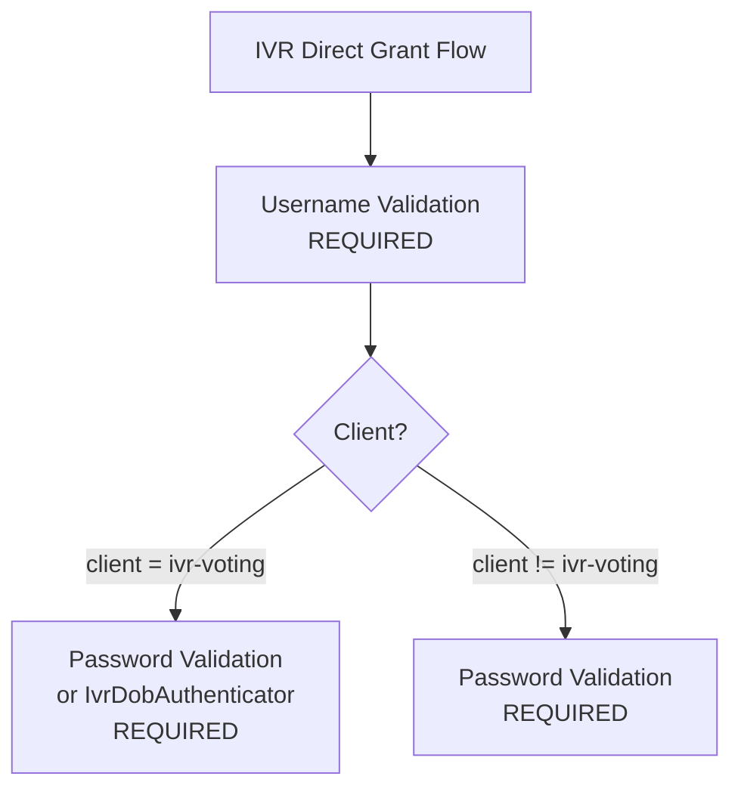

The same realm handles both web portal and IVR authentication. The Keycloak admin configures which authenticators are active for the `ivr-voting` client in the Keycloak admin UI — **this is the one and only place** auth is configured. The IVR Lambda learns about it automatically via `/ivr-config`.

#### 5.1.6 Custom Keycloak Authenticators & Extensions

| Component | When Needed | Complexity | Description |
|---|---|---|---|
| `ivr-config-resource` | **Always** (replaces S3 auth config) | ~100 lines Java | `RealmResourceProvider` exposing `GET /realms/\{realm\}/ivr-config`. Walks the Direct Grant flow and returns auth steps |
| `IvrDobAuthenticator` | Optional — only if DoB is NOT stored as password | ~80 lines Java | Reads `dob` from form params, validates against user's `date_of_birth` attribute. Declares `field_name`/`max_digits`/`terminator`/`maps_to` as config properties |
| `IvrOtpDirectGrantAuthenticator` | **Not in initial scope** — see §5.1.4 | — | Deferred. Would follow the same pattern as `message-otp-authenticator`, triggering the Direct Grant `otp_required` flow |

Custom authenticators must declare the IVR metadata fields in their `getConfigProperties()` so the `ivr-config-resource` can read them back:

```java
public static final List<ProviderConfigProperty> CONFIG_PROPERTIES = ProviderConfigurationBuilder.create()
    .property().name("field_name").type(STRING_TYPE).label("IVR field name").add()
    .property().name("max_digits").type(STRING_TYPE).label("IVR max DTMF digits").add()
    .property().name("terminator").type(STRING_TYPE).label("IVR terminator key").defaultValue("#").add()
    .property().name("maps_to").type(STRING_TYPE).label("ROPC form parameter").add()
    .property().name("prompt_key").type(STRING_TYPE).label("IVR prompt key override (optional)").add()
    .build();
```

If OTP is ever added as described in §5.1.4, the authenticator would reuse existing infrastructure from [`packages/keycloak-extensions/message-otp-authenticator/`](../../../../packages/keycloak-extensions/message-otp-authenticator/) (code generation, SMS/email couriers, constant-time validation) — it is not being built as part of the initial IVR release.

If the election uses simple voter ID + PIN (where PIN = Keycloak password), no custom authenticators are needed — only `ivr-config-resource` needs to be deployed.

#### 5.1.7 Pinning & Caching

**Per-session pinning (required).** The resolved `Vec<AuthStep>` is read from `/ivr-config` exactly once, at session init, and stored on `IvrSession` (see §4.1). Every subsequent turn of the same call reads the auth step list from the session row, never from `/ivr-config`. This is symmetric with how the ballot publication is pinned per-session (§5.1.8) and guarantees a single call cannot observe two different auth-step lists — e.g. step 1 collecting PIN under the old flow, then step 2 being asked for a newly-added DoB after an admin edit.

To make this a compile-time invariant rather than a convention, `IvrSession.auth_steps: Vec<AuthStep>` is populated during session construction and the `Auth` phase engine reads only from the session — it has no port to call `/ivr-config` mid-call.

**Per-realm cache (optimization for new sessions only).** New sessions hitting the same realm within a short window share a cached `/ivr-config` response to avoid hammering Keycloak during a call spike. The cache lives in DynamoDB, keyed by realm, with a TTL controlled by the Lambda env var **`IVR_CONFIG_CACHE_TTL_SECONDS`** (default `300`, i.e. 5 minutes). Setting it to `0` disables the cache entirely (every new session hits Keycloak).

- Sessions already in flight are unaffected by cache expiry or invalidation — they read from their pinned session row.
- New sessions pick up admin changes within `IVR_CONFIG_CACHE_TTL_SECONDS`.
- Ops can flush the cache manually (DynamoDB delete) for emergency rollout, or drop the TTL to `0` during an incident.

The cache is strictly an optimization: removing it (or setting TTL to `0`) only increases Keycloak load, never affects correctness, because pinning is the source of truth for any given call.

#### 5.1.8 IVR Config Discovery — S3 + Keycloak

IVR session config comes from **two sources**:

1. **Public S3 (published ballot publication)** — election structure, prompts, flow pipeline, presentation
2. **Keycloak `/ivr-config` endpoint** — authentication step list (see 5.1.2)

**The IVR flow, prompts, and IVR-only spoken-text overrides are part of the frozen ballot publication.** Once a publication is cut, its `ivr.flow` + `i18n[lang].ivr` data is immutable — admin edits in the portal only take effect after a new publication is produced. This is a deliberate choice: the ballot publication is an attested, signed artifact used by the voting portal in preview mode, and pulling IVR presentation out of it would fragment the source of truth. Admins who need to change IVR prompts or spoken overrides after ballot freeze run a new publication, same as any other presentation edit. (The blacklist is the one exception — it changes too frequently to live in the publication; see §6.3.)

**Published ballot publication structure** (`tenant-\{tenantId\}/document-\{documentId\}/\{publicationId\}.json`):
```json
{
  "ballot_styles": [
    // Ballot EML: contests, candidates, public keys, presentation config
  ],
  "elections": [
    // Election metadata, presentation, voting channels
    // Note: voting_status is always "OPEN" in published data (static snapshot)
  ],
  "election_event": {
    // Full event: presentation (IVR flow + prompts, NOT auth steps),
    // i18n (including IVR prompts and spoken-text overrides), language_conf, voting_channels
  },
  "support_materials": [...],
  "documents": [...]
}
```

**What the IVR Lambda reads from published S3 data:**
- `election_event.presentation.ivr.flow` — phase pipeline
- `election_event.presentation.i18n[lang]["ivr"]` — event-level prompts and spoken-text overrides (including the well-known auth prompt keys)
- `election_event.presentation.language_conf` — enabled languages
- `ballot_styles[].ballot_eml` — contests, candidates, min/max votes, public keys
- `elections[].presentation.i18n[lang]["ivr"]` — election-level prompts and spoken-text overrides
- `contests[].presentation.i18n[lang]["ivr"]` / `candidates[].presentation.i18n[lang]["ivr"]` — contest/candidate spoken-text overrides used only by IVR
- `elections[].voting_channels` — which channels are enabled

**What the IVR Lambda reads from Keycloak `/ivr-config`:**
- The ordered list of auth steps (field, max_digits, terminator, maps_to, optional prompt_key override)

**What is NOT available from S3 (requires Harvest API):**
- Real-time voting status (S3 always shows `voting_status: "OPEN"`)
- Vote submission

**Publication flow:**
1. Admin configures IVR flow + prompts/overrides in admin portal (**not** auth steps — those live in Keycloak)
2. Settings stored in `presentation.ivr.flow` and `presentation.i18n[lang]["ivr"]` in PostgreSQL
3. Ballot publication task generates the publication JSON and uploads to public S3
4. Auth flow is configured separately by the admin in the Keycloak admin UI (realm's Direct Grant flow)
5. Published data is publicly accessible — no authentication needed

**Lambda session initialization:**
1. Call arrives → Lambda reads the `ivr-phone-config.json` object from S3 (process-cached, see §6.2) → resolves the dialled number to S3 base URL + tenant_id + election_event_id + keycloak realm
2. Lambda fetches published ballot publication JSON from public S3
3. Lambda fetches auth step list from `{KEYCLOAK_URL}/realms/\{realm\}/ivr-config` (cached 5 min)
4. Both sets cached in DynamoDB session
5. Flow engine begins executing the configured phase pipeline

**Keycloak Realm**: `tenant-\{tenantId\}-event-\{eventId\}`

**Required Keycloak Configuration**:
- Deploy `ivr-config-resource` extension (see Appendix C.8.2)
- Create `ivr-voting` client with `direct-access-grants` enabled (see Appendix C.8.a)
- Create `ivr-service` client with `service-accounts` enabled and a service-account role mapping for `can_read_phone_blacklist` (see Appendix C.8.b) — installed identically in every IVR-enabled realm; secret in AWS Secrets Manager. This same role also gates the authenticated `/ivr-config` read (§5.1.2, §C.8.2); the Lambda reuses the cached token across both pre-auth reads per turn
- Configure Direct Grant flow with conditional branching for `ivr-voting` client — **this is now the only place voter auth is configured**
- Configure voters with voter ID as username
- Credential storage matches the Direct Grant flow (e.g., password credential for PIN, or user attribute + `IvrDobAuthenticator` for DoB)
- For custom authenticators (`IvrDobAuthenticator`, etc.): fill in their `AuthenticatorConfig` (`field_name`, `max_digits`, `terminator`, `maps_to`) so the `/ivr-config` endpoint can return them
- JWT claims include `area_id` and `authorized_election_ids` (via existing `AuthorizedElectionsUserAttributeMapper`)

#### 5.1.9 Token Expiry Handling (Critical)

**The Problem**:
JWT tokens have limited lifetimes. From the current Keycloak configuration:
- `accessTokenLifespan`: 300 seconds (5 minutes)
- `ssoSessionIdleTimeout`: 1800 seconds (30 minutes) - refresh token idle timeout
- `ssoSessionMaxLifespan`: 36000 seconds (10 hours) - max session duration
- `refreshTokenMaxReuse`: 0 (single-use refresh tokens)

Phone calls can easily exceed 5 minutes, especially for:
- Voters needing to repeat instructions
- Elections with multiple contests
- Elderly voters or those with accessibility needs

**Risk**: If access token expires mid-call and we can't refresh, the voter completes all selections but vote submission fails with 401.

**Token Lifecycle Constraints**:
1. **Access token** (5 min): Can be refreshed using refresh token
2. **Refresh token**: Valid while SSO session is active
   - Idle timeout: 30 min of inactivity invalidates it
   - Max lifespan: 10 hours absolute limit
   - Single-use: Each refresh returns a new refresh token
3. **SSO Session**: The underlying session that backs the refresh token

**Proposed Solution - Proactive Token Refresh**:

`TokenManager` is reconstructed on each invocation from the serialized session
fields (Lambda is stateless, so we can't keep an in-memory `Instant`). All time
bookkeeping uses absolute Unix seconds so it round-trips through DynamoDB
cleanly.

**Contract.** A token manager — reconstructed on each invocation from the session's token fields, because Lambda is stateless — must:

- Track access-token expiry as an **absolute Unix timestamp** (from the JWT `exp` claim), not a relative `expires_in`, so it round-trips through DynamoDB without rebasing.
- Expose a `needs_refresh(now)` check with a **safety margin** (default 60 s) so a token about to expire during the current turn gets refreshed first.
- Always persist the **new** refresh token returned by Keycloak — refresh tokens are single-use under `refreshTokenMaxReuse: 0`.
- Retry on transient failures (network / 5xx) with short backoff; fail fast on `400/401` (refresh token dead) and `403` (client misconfigured).

**Error classification.** The refresh path collapses HTTP and network outcomes into three categories, each with a different policy:

| Category | Cause | Retry? | Maps to |
|---|---|---|---|
| Transient | Connection timeout, DNS, 5xx | Yes (≤2 retries, short backoff) | `KeycloakUnavailable` after budget |
| TokenExpired | 400 / 401 — refresh token invalid or SSO session timed out | No | `SessionExpired` |
| Unauthorized | 403 — IVR client disabled / realm misconfigured | No | `ConfigurationError` |

**Session State in DynamoDB**: Token management fields are part of `IvrSession` (see Section 4.1): `access_token`, `refresh_token`, `access_token_expires_at`, `session_started_at`.

**When to Refresh**:
1. **Before vote submission** (critical path): Always refresh if within threshold
2. **On each Lambda invocation**: Check and refresh proactively
3. **After authentication**: Store both tokens and expiry

**Refresh Failure Handling Strategy**:

| Error Type | Cause | Detection | Retry? | User Message |
|------------|-------|-----------|--------|--------------|
| **Transient** | Network issue, Keycloak restart, load spike | Connection timeout, DNS failure, 5xx errors | Yes (2 retries, 500ms delay) | "We're experiencing technical difficulties. Please try again later." |
| **TokenExpired** | Idle timeout (>30 min) or max lifespan (>10 hrs) | 400/401 from Keycloak | No | "Your session has expired. Please call back to vote again." |
| **Unauthorized** | IVR client disabled, realm misconfigured | 403 from Keycloak | No | "The voting system is temporarily unavailable. Please try again later." |

**Auth error enum.** Mapped from the categories above. Keep as an enum; don't collapse into strings or booleans.

```rust
pub enum AuthError {
    /// 400 / 401 — refresh token invalid or SSO session timed out.
    SessionExpired,
    /// Transient network / 5xx after retry budget.
    KeycloakUnavailable,
    /// 403 — IVR client disabled or realm misconfigured.
    ConfigurationError,
}
```

**Critical vs. non-critical refresh policy.**

- **Vote submission (critical).** Proactively refresh immediately before calling Harvest. Any refresh failure is fatal for the call: `SessionExpired` → "your session has expired, please call back"; `KeycloakUnavailable` / `ConfigurationError` → emit a critical ops alert (see monitoring below) and play the generic "system unavailable" prompt with `should_disconnect = true`. Never submit a ballot with a stale token — a 401 from Harvest mid-submit is harder to recover from than a clean refusal up front.
- **Non-critical reads (e.g. election-status check).** Be lenient: try the current token, and on `401` attempt one refresh-then-retry. If the retry also fails, map to `SessionExpired` and disconnect.

Both paths share the `refresh_token` port call and the `AuthError` classification — the difference is only in how aggressively refresh is attempted and how a failure is surfaced to the voter.

**Operational Monitoring**:

Critical metrics to track:
- `ivr.token.refresh.success` - counter
- `ivr.token.refresh.failure.transient` - counter (alerts if spike)
- `ivr.token.refresh.failure.expired` - counter (expected, monitor trends)
- `ivr.token.refresh.failure.unauthorized` - counter (ALERT immediately)
- `ivr.vote.submission.failed.token_error` - counter (CRITICAL alert)

**Alerting Rules**:
1. **CRITICAL**: `ivr.vote.submission.failed.token_error` > 0 in 5 minutes
   - Action: Page on-call engineer immediately
   - Reason: Voters completing calls but can't submit votes

2. **HIGH**: `ivr.token.refresh.failure.unauthorized` > 5 in 1 minute
   - Action: Alert ops team
   - Reason: IVR client misconfigured or disabled

3. **MEDIUM**: `ivr.token.refresh.failure.transient` > 20% of attempts
   - Action: Alert ops team
   - Reason: Keycloak connectivity issues

**Keycloak Configuration Recommendations for IVR**:
Consider adjusting IVR client-specific settings (can be per-client in Keycloak):
- `accessTokenLifespan`: Could increase to 15-30 min for IVR client
- `ssoSessionIdleTimeout`: 60 min for IVR (calls can have pauses)
- `ssoSessionMaxLifespan`: Keep at 10 hours (reasonable max call duration)

**Implementation Notes**:
- Store `refresh_token` securely in DynamoDB (encrypted at rest)
- Always use the new refresh token after each refresh (single-use policy)
- Log token refresh events (without token values) for debugging
- Monitor refresh failure rate as operational metric

**Scope of this section.** Everything above describes the **voter token lifecycle** — tokens issued to the calling voter via the Direct Grant (ROPC) flow against the `ivr-voting` client. The Lambda also needs **service-auth tokens** for its two pre-authentication reads against the realm — the blacklist query (§6.3) and the `/ivr-config` auth-discovery call (§5.1.2). These service tokens belong to no voter and are obtained via Keycloak's `client_credentials` grant against a separate **platform IVR service client** (`ivr-service`, §C.8.b). That path is a distinct `TokenManager::get_service_token(realm)` method with a narrower signature — no refresh tokens, no session fields, no DynamoDB persistence — cached per-realm and reused across both pre-auth reads in the same turn. The path is specified in §6.3. Keeping the voter and service paths in separate methods (and reusing only the `AuthError` taxonomy) prevents service credentials from accidentally flowing through the voter code path, and vice versa.

### 5.2 Check Election Status via Hasura GraphQL

Election structure, contests, and candidates are loaded from the published S3 data (see 5.1.8). However, the published S3 data is a **static snapshot** where `voting_status` is always `"OPEN"`. The IVR Lambda needs to query Hasura to check the **real-time** status of telephone voting before proceeding. This is the same mechanism the voting portal uses (`GET_ELECTION_EVENT` query).

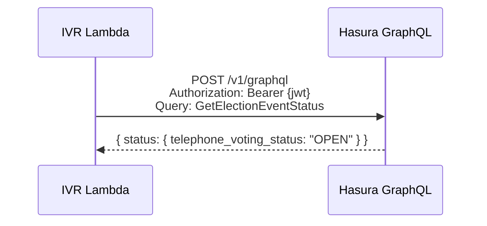

**Endpoint:** `POST https://\{HASURA_DOMAIN\}/v1/graphql`

**GraphQL Query:**
```graphql
query GetElectionEventStatus($eventId: uuid!) {
  sequent_backend_election_event_by_pk(id: $eventId) {
    status
  }
}
```

The `status` field is a JSON object containing per-channel statuses:
```json
{
  "voting_status": "OPEN",
  "kiosk_voting_status": "CLOSED",
  "early_voting_status": "CLOSED",
  "telephone_voting_status": "OPEN"
}
```

**Purpose**: Verify that telephone voting is currently open. The Lambda checks the `telephone_voting_status` field:
- `OPEN` → proceed with voting
- `CLOSED` / `NOT_STARTED` → play `election_closed` prompt and disconnect

**When called**: After authentication (JWT required), before entering the ballot loop.

**Note**: This is a UX optimization to fail early with a clear message. The backend also validates channel status during `insert_cast_vote` via `status_by_channel(voting_channel)`, so a vote submitted to a closed telephone channel would be rejected regardless.

### 5.3 Cast Vote via Harvest API

IVR Lambda calls the **Harvest API** directly to submit encrypted ballots.

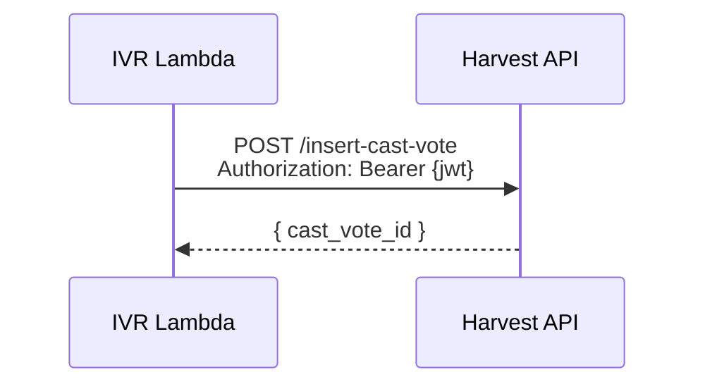

**Endpoint:** `POST https://\{HARVEST_DOMAIN\}/insert-cast-vote`

**Input Structure**:
```json
{
  "ballot_id": "...",
  "election_id": "...",
  "content": "{encrypted_ballot}"
}
```

**Headers:**
- `Authorization: Bearer \{jwt\}`
- JWT must have `azp: "ivr-voting"` to identify TELEPHONE channel
- Harvest extracts `area_id` from JWT claims

### 5.4 Backend Error Handling for Vote Submission

**Overview:**
Backend (Harvest) validates all vote submission rules — revote limits, channel enablement, ballot-hash integrity, area/election scoping. The IVR Lambda treats Harvest as the source of truth and maps its rejection variants to voter-facing prompts.

**Source of truth.** The authoritative error set lives in
[`CastVoteError`](../../../../packages/windmill/src/services/insert_cast_vote.rs)
and is surfaced over HTTP by
[`packages/harvest/src/routes/insert_cast_vote.rs`](../../../../packages/harvest/src/routes/insert_cast_vote.rs).
The IVR adapter classifies each variant into one of three adapter outcomes and
does not invent codes of its own.

| Adapter outcome | Domain mapping | Voter-facing effect |
|---|---|---|
| Per-election rejection (Harvest returned a `CastVoteError` variant whose meaning is scoped to this one election) | Record on `ElectionSubmissionResult`, play the matching prompt, **continue to next election** | Announce via prompt; do not disconnect |
| Network / read timeout before any response | Fatal system error | Play `system_error` prompt and disconnect |
| Other transport failure | Generic transport error (§8.2) | Play `system_error` prompt and disconnect |

**Relevant `CastVoteError` variants and their prompt keys.** Only the
variants reachable on the IVR submission path are listed; every other variant
(e.g. `DeserializeBallotFailed`, `BallotSignFailed`, `GetDbClientFailed`) is an
internal/infra failure that collapses to `vote_failed` plus a raw-code log
entry for ops.

| `CastVoteError` variant | Prompt key | Notes |
|---|---|---|
| `CheckRevotesFailed(_)` | `duplicate_vote` when the election runs with `max_revotes = 1` (the Canadian municipal default); `max_revotes_exceeded` otherwise | Today this is the *only* signal that a voter has already cast a ballot in this election — there is no dedicated `DuplicateVote` variant (see design note below). The adapter reads the election's `max_revotes` from the session-cached publication to decide which prompt to play |
| `InsertFailedExceedsAllowedRevotes` | same as `CheckRevotesFailed` | Race-condition surfacing of the same business rule at INSERT time. Mapped identically |
| `CheckVotesInOtherAreasFailed(_)` | `vote_failed` with a raw-code log entry | Means the voter has already voted for this election in a *different* area. Rare on IVR (area is derived from the voter's own identity, not caller input); treat as `vote_failed` until product decides whether a dedicated prompt is warranted |
| `VotingChannelNotEnabled(_)` | `election_closed` | The election's TELEPHONE channel flipped off between the `eligibility_check` and the ballot submission — the same prompt used for the pre-flight channel check in §5.2 applies |
| `BallotIdMismatch(_)` | `vote_failed` (fatal for this election) | Cannot recover by re-encrypting (would defeat the retry-idempotency invariant in §9.3). Log as a hard integrity failure |
| `CheckPreviousVotesFailed(_)` / `CheckStatusFailed(_)` / `CheckStatusInternalFailed(_)` / `CheckRevotesFailed` query-layer errors | `vote_failed` | These are database/query failures inside the pre-insert checks, not business-rule rejections. Per-election outcome, not fatal to the call |
| `AreaNotFound` / `ElectionEventNotFound(_)` / `ElectoralLogNotFound(_)` | `system_error` (disconnect) | Indicates a config/routing mismatch between the session and Harvest — nothing the voter can do about it, and the same mismatch will hit every subsequent election. Fail the call, alert ops |
| All other variants (`InsertFailed`, `CommitFailed`, `Deserialize*Failed`, `BallotSignFailed`, `UnknownError`, …) | `vote_failed` | Per-election fallback; raw variant name goes into the structured log |

Mapping is implemented as an exhaustive `match` in the adapter (not string
comparisons in domain code) so a new `CastVoteError` variant added upstream
surfaces as a compiler warning here.

> **Design note — first-class `DuplicateVote`.** Today, "voter already cast a
> ballot in this election" is not a dedicated `CastVoteError`; it is inferred
> from `CheckRevotesFailed` under `max_revotes = 1` (or from
> `InsertFailedExceedsAllowedRevotes` on the INSERT-time race). Every channel
> — portal, kiosk, IVR — has to duplicate the same "read `max_revotes`, decide
> which message to show" logic. A small, self-contained improvement worth
> doing alongside the IVR rollout is to add a `DuplicateVote` variant to
> `CastVoteError` in `windmill/src/services/insert_cast_vote.rs`, emitted when
> `max_revotes = 1` and a previous ballot exists. `CheckRevotesFailed` then
> genuinely means "the voter has exceeded the allowed number of revotes" in
> elections that permit more than one, which is what its name suggests. The
> IVR adapter table above collapses to one line per variant with no
> max-revotes conditional; the portal and kiosk benefit equally. Tracked
> as a follow-up — see `CastVoteRejection::DuplicateVote` below, which is
> already wired for that future variant.

```rust
/// IVR-adapter error. Distinct from the generic transport error
/// (§8.2) so per-election rejections are a first-class variant.
pub enum CastVoteAdapterError {
    /// Harvest returned a `CastVoteError` variant (see the mapping
    /// table above). The adapter has already collapsed it into the
    /// prompt-ready `CastVoteRejection`.
    Rejected(CastVoteRejection),
    /// Network / read timeout before any response from Harvest.
    Timeout,
    /// Other transport failure (DNS, TLS, unexpected 5xx, malformed body).
    Transport(String),
}

/// Prompt-ready classification of a per-election Harvest rejection.
/// Shapes match the i18n prompt keys in Appendix D, not the raw
/// `CastVoteError` variant names — the adapter bridges the two.
#[derive(Debug, PartialEq, Eq)]
pub enum CastVoteRejection {
    /// Voter has already cast a ballot in this election
    /// (today: `CheckRevotesFailed` / `InsertFailedExceedsAllowedRevotes`
    /// when `max_revotes = 1`; future: a dedicated `DuplicateVote`
    /// variant per the design note above).
    DuplicateVote,
    /// Voter has exhausted the configured revote budget
    /// (`max_revotes > 1` case).
    MaxRevotesExceeded,
    /// TELEPHONE channel was closed between eligibility check and submit.
    ChannelClosed,
    /// Ballot-hash integrity failure — cannot recover for this election.
    BallotIdMismatch,
    /// Any other `CastVoteError` variant not classified above. Played
    /// as `vote_failed`; the raw variant name is logged for ops.
    Other(String),
}
```

**Error Prompts:**

Backend errors use prompt keys from `i18n[lang]["ivr"]`. Per-election rejections are announced but do not end the call — the `ElectionSubmit` sub-phase reports the error and the ballot loop advances to the next election:
- `duplicate_vote`: "You have already voted in this election." (continue to next election)
- `max_revotes_exceeded`: "You have reached the maximum number of allowed votes for this election." (continue to next election)
- `election_closed`: "Telephone voting is not currently open for this election." (continue to next election)
- `vote_failed`: "We were unable to record your vote. Please try again later." (continue to next election)

Fatal errors (network timeout, session expired, Keycloak unavailable, area/election config mismatch) disconnect immediately since they affect all elections.

**Simplicity:**
- No frontend filtering needed
- Backend is source of truth — Harvest validates per-election
- IVR translates `CastVoteError` variants into user-friendly messages
- Each election is submitted independently; one failure does not block others

---

## 6. Multi-Tenancy & Municipality Discrimination

### 6.1 Phone Number to Election Event Mapping

Each election event gets its own dedicated Amazon Connect phone number. The Lambda looks up the dialled number in the phone-config file (§6.2) and resolves it directly to `(tenant_id, election_event_id)` — no IVR-level "which municipality?" menu, no shared numbers. A municipality running multiple concurrent elections therefore operates multiple numbers, one per event. This keeps the voter-facing experience as short as possible (the caller reaches the right ballot on connect, without an extra menu) and makes routing, blacklisting, and per-event metrics trivially scoped by the dialled number.

### 6.2 Phone Number Configuration File

**Location**: `s3://<ivr-routing-bucket>/ivr-phone-config.json` — a single JSON file in a **versioning-enabled** S3 bucket, authored through gitops (§16.2) and read by the Lambda. Not a DynamoDB table.

**Why S3 rather than DynamoDB.** This is static routing config, not runtime state: a small number of Sequent-owned DIDs mapping to tenants and cluster URLs, edited infrequently by operators, and never written by the Lambda. DynamoDB's point-read strengths (high-throughput keyed access, conditional writes, TTL) buy nothing for this access pattern — the Lambda loads the whole file once per cold start and caches it in-process — while S3 gives, for free, the properties that actually matter here: native object versioning (every prior revision retained indefinitely, not just a 35-day PITR window), CloudTrail `PutObject` audit trail naming the principal and version, atomic whole-file writes (no torn multi-row updates), and the same 11-nines durability plus bucket-level lifecycle tooling we already use for the published ballot publication (§5.1.8). It is also the pattern the Lambda already knows: "fetch versioned static JSON from S3, cache in-process." Adding another DynamoDB table is new machinery; adding another S3 path is a trivial extension of an existing one.

```rust
/// One entry in the routing file. The file itself is a JSON array of
/// these (wrapped in `{ "entries": [...] }` for future-compatibility).
#[derive(Serialize, Deserialize)]
pub struct PhoneConfig {
    /// Lookup key — E.164 format, e.g. "+14165551234".
    pub phone_number: String,

    // What this number resolves to
    pub tenant_id: Uuid,
    pub election_event_id: Uuid,

    // Cluster + region routing (see "Multi-cluster / multi-region" below)
    pub cluster_id: String,          // e.g. "prod1-euw1", "googleinfra-euw4"
    pub region: String,              // AWS region hosting the cluster, e.g. "eu-west-1"
    pub environment: String,         // e.g. "qa", "staging", "cixug"

    // Full set of per-cluster URLs — snapshot into IvrSession at session init
    pub keycloak_url: String,        // https://keycloak.{env}.{cluster}.sequentech.io
    pub harvest_url: String,         // https://harvest.{env}.{cluster}.sequentech.io
    pub hasura_url: String,          // https://hasura.{env}.{cluster}.sequentech.io
    pub s3_public_base_url: String,  // https://{public-bucket}.s3.amazonaws.com

    /// First-turn language before `LanguageSelect` runs.
    pub default_language: Language,

    /// Allowlist flag. Disabled or missing entries are rejected at session init.
    pub enabled: bool,
}
```

**Bucket configuration — non-negotiable.**

- **Versioning: enabled.** Every `PutObject` preserves the prior version; accidental deletes are recoverable with `s3api restore-object` / console. This is the backup story — no separate PITR decision needed.
- **Deletion protection: enabled** via bucket policy denying `s3:DeleteBucket` to every principal except a break-glass admin role. Bucket-level deletion-protection Terraform flag (`force_destroy = false`) on the resource.
- **Block public access: all four settings on.** The routing file carries cluster URLs but is not voter data; still, public access has no legitimate use.
- **Server-side encryption**: SSE-S3 (default) is sufficient — the file has no secrets, just URLs and IDs.
- **CloudTrail data events**: enabled for this bucket so every `PutObject` and `GetObject` is audit-logged with principal, version, and timestamp. This is the audit trail that DynamoDB only provides via the expensive data-plane-CloudTrail path.

**Lambda IAM — strictly read-only.** The IVR Lambda execution role has exactly one action on this bucket: `s3:GetObject` on `ivr-phone-config.json`. No `PutObject`, no `DeleteObject`, no `ListBucket`. Separating the read-only routing bucket from the read-write sessions table under distinct IAM statements means that a Lambda compromise cannot rewrite phone-number routing (cf. §4.8 of the review). Writes come from one place only: the gitops CI role, used by Atlantis when applying `phone-map.yaml`.

**Cache TTL.** Cold Lambda containers fetch the file on first use and cache it in-process for **`IVR_PHONE_CONFIG_CACHE_TTL_SECONDS`** (default `300`, i.e. 5 minutes — matching the pattern established by `IVR_CONFIG_CACHE_TTL_SECONDS` in §5.1). Setting it to `0` forces every cold-start to re-fetch. Warm containers refresh the cache lazily on the next lookup after the TTL elapses; the lookup itself continues to serve the cached copy during the refresh so a slow S3 request never stalls a call. **Propagation window.** A routing-config edit takes full effect within one TTL plus any warm-container lifetime — typically well under 10 minutes. For an urgent change (wrong DID mapped to wrong tenant), ops can drop the TTL to 0 and cycle Lambda aliases to force a full refresh. Document this propagation window to operators explicitly so manual edits don't come with "but I just uploaded the file, why isn't it live?" surprise.

**Edit workflow.** The authoritative copy lives in gitops (§16.2); Atlantis's apply uploads it to S3 and bumps the S3 object version. Direct S3 console edits are permitted as a break-glass mechanism but go through CloudTrail, and the gitops repo file is the canonical source — any direct edit must be reconciled into gitops before the next apply, or it will be overwritten on the next reconcile. Concurrent editors are not a failure mode in practice (edits go through PR review), but if two uploads race, S3 object versioning keeps both; the loser can be restored.

**Multi-cluster / multi-region support.**

A single IVR Lambda deployment serves every cluster and every region that hosts a Sequent environment. Each entry in `ivr-phone-config.json` carries the full set of per-cluster routing URLs (Keycloak, Harvest, Hasura, public S3) plus `cluster_id` and `region` labels, so the Lambda looks up the dialled number and dispatches every downstream call to the cluster that owns that election event — whether that cluster is in `prod1-euw1`, `prod2-use1`, `googleinfra-euw4`, or anywhere else. Clusters are infrastructure groups (e.g. `prod1-euw1`, `prod2-use1`, `testing-euw1`); environments are tenants/deployments within a cluster (`qa`, `dev`, `staging`, `cixug`). Both dimensions are carried in the phone-config entry.

In practice we may start with a single cluster hosting all IVR-enabled events, but the configuration schema and the Lambda dispatch must support the multi-cluster / multi-region case from day one — we do not want to retrofit routing when a second cluster is added mid-election-season.

**Isolation.**
- **Cluster-level** — the phone-config entry is the only place that binds a dialled number to a cluster's URLs; a misconfigured entry cannot leak calls to the wrong cluster because Keycloak/Hasura/Harvest tokens are cluster-scoped.
- **Environment-level** — Keycloak realms (`tenant-{id}-event-{id}`) provide tenant isolation; URLs are environment-scoped.
- **Phone-level** — only entries with `enabled: true` are accepted at session init; a missing or disabled entry rejects the call before any authentication is attempted.

### 6.3 Phone Blacklist (Hasura-Backed)

The `blacklist_check` phase consults a **Hasura table**, not DynamoDB. The blacklist is domain data — it is managed alongside the rest of the election event by the same admin users who manage voters, and it benefits from Hasura's row-level authorization, audit trails, and migration tooling rather than being a sidecar AWS table owned by the IVR.

**What needs to be built:**

1. **Hasura table** `sequent_backend.ivr_phone_blacklist` with columns:
   - `phone_number` (E.164, primary key or unique per tenant)
   - `tenant_id` (FK)
   - `election_event_id` (nullable — blacklist can be scoped to an event or tenant-wide)
   - `reason` (optional free text)
   - `created_at`, `created_by`
2. **Hasura permissions** — a new permission (e.g. `can_manage_phone_blacklist`) granted to admin roles that should be able to CRUD blacklist entries. Scoped to their tenant.
3. **Harvest endpoints** to create, list, and delete blacklist entries (these wrap the Hasura mutations with the existing permission-check middleware). The IVR Lambda reads the blacklist with a **service-account JWT** obtained via Keycloak's **`client_credentials`** grant — the Lambda authenticates as a dedicated **platform IVR service client** (`ivr-service`, distinct from the voter-facing `ivr-voting` client; see §C.8.b) that is installed identically (same `client_id`, same `client_secret`) in every IVR-enabled realm. The client secret lives in AWS Secrets Manager (rotatable without Lambda redeploy); the Lambda reads it once at cold start. Because Keycloak realms are trust boundaries, each realm still signs its own access token — but the *credential material* is uniform across realms, so the Lambda's service-auth path has **one** grant flow, **one** set of credentials, and a token cache keyed by realm (not by `(tenant, realm, credentials)`). A new Hasura permission `can_read_phone_blacklist` is granted only to this service client's service-account role mapping (see §C.8.b); `can_manage_phone_blacklist` continues to gate CRUD from the admin portal. The same service-account role also gates the Lambda's `/ivr-config` auth-discovery read at session init (§5.1.2) — one principal, one role, one token cache, two pre-auth reads. This avoids exposing an anonymous blacklist oracle (which would leak moderation decisions, conflict with PIPEDA, and create a harassment vector).

   **Why `client_credentials`, not `password` grant.** Both are realistic designs — a shared service *user* with ROPC would also work — but `client_credentials` has no user account to rotate, no voter-grade ROPC code path carrying service credentials (keeping voter auth and IVR-internal auth in strictly separate code paths, with no accidental cross-wiring), and no refresh-token lifecycle: `client_credentials` has no refresh token, so the service-auth path just re-requests a fresh access token when the cached one's `exp` is within the safety margin. Blast radius is identical in the two designs (one stolen secret compromises blacklist-read across every IVR-enabled realm), so there is no security regression from the simpler shape.

   **TokenManager port signature — service-auth path.** The existing `TokenManager` (§5.1.9) handles voter tokens via ROPC + refresh. The service-auth path is a distinct concern and is modelled as a separate trait method (or a second `TokenManager` flavour — an implementation decision, not a contract one) with a narrower signature: `get_service_token(realm) -> Result<AccessToken, IvrError>`. The implementation fetches `client_credentials` against the named realm using the shared client secret, caches the resulting token keyed by realm until `exp - safety_margin`, and re-fetches on expiry. No refresh-token bookkeeping. Error classification reuses the voter-auth `TokenManager`'s three-category map (transient / auth / config) so the handler has one error-taxonomy, not two.

   **Cold-start latency.** The reviewer correctly flagged that the first call into a freshly-scaled-out Lambda container pays one round-trip to Keycloak for the service token. Quantify before treating this as a problem: a single `client_credentials` POST to Keycloak in-region is typically well under 100 ms, and it happens once per cold container per realm. For the provisioned-concurrency tier the Lambda uses during an election event, cold starts are bounded. If benchmarks on representative hardware show the hop dominates first-call latency, the fallback is to move the blacklist query off Keycloak entirely — sign a short-lived service JWT in-Lambda with a private key held in Secrets Manager and have Hasura verify it directly. That eliminates the Keycloak round-trip at the cost of introducing a JWT-signing mechanism that does not exist elsewhere in Sequent today; treat it as a Phase-2 optimization contingent on measured latency, not a default.
4. **Admin-portal UI** — a "Phone Blacklist" management view under the Election Event settings, with list + add + remove actions, tied to the new Hasura permission.

**Why not DynamoDB?** Same reason auth config went to Keycloak: it belongs to the domain. Putting it in DynamoDB would duplicate responsibilities, bypass Hasura's permission/migration/audit pipeline, and force the admin portal to talk to two different backends for data that is logically part of the election event. One source of truth wins.

**Why not part of the published ballot publication (S3)?** Because blacklists change more often than ballots are published, and an admin needs to be able to block a phone mid-election without re-running the ballot publication pipeline. Keep the publication immutable and artifact-like; keep the blacklist mutable and operational.

---

## 7. Internationalization (i18n) & IVR Prompts

### 7.1 Leveraging Existing Infrastructure

The platform already supports:
- **`telephone` channel** in `VotingChannels` struct (`packages/sequent-core/src/types/hasura/core.rs`, `pub struct VotingChannels`)
- **i18n pattern** via `presentation.i18n` with nested structure `\{lang: \{key: value\}\}`
- **Per-election presentation** via `ElectionPresentation` (`packages/sequent-core/src/ballot.rs`, `pub struct ElectionPresentation`)
- **Per-event presentation** via `ElectionEventPresentation` (`packages/sequent-core/src/ballot.rs`, `pub struct ElectionEventPresentation`)
- **Channel-based authorization** via the JWT `azp` claim, mapped into `VotingStatusChannel` by `authorize_voter_election` and the `AzpClient::to_voting_channel` resolver — portal clients fan out into ONLINE vs EARLY_VOTING via the area's early-voting window (`packages/sequent-core/src/services/authorization.rs`; see Appendix C.7 for the exhaustive match)

### 7.2 IVR Prompt Storage - Inside Existing i18n Structure

**Key Decision:** IVR prompts and IVR-only spoken-text overrides are stored **inside** the existing `presentation.i18n` object under an `"ivr"` key. This keeps all translations in one place and follows Felix's recommendation.

#### Structure Overview

No changes are needed to the existing presentation structs. `ElectionEventPresentation`, `ElectionPresentation`, `ContestPresentation`, and `CandidatePresentation` already expose the nested `i18n` shape that IVR can reuse for both prompt keys and spoken-text overrides:
```rust
pub struct ElectionEventPresentation {
    pub i18n: Option<I18nContent<I18nContent<Option<String>>>>,
    // ... existing fields ...
    // NO separate ivr_prompts field needed
}
```

#### Storage Pattern

IVR strings are nested inside `i18n` under the `"ivr"` key:

```
presentation.i18n = {
  "en": {
    "name": "Election Name",
    "description": "Portal-facing description",
    "alias": "Election Alias",
    "ivr": {  // ← IVR prompts + IVR-only spoken-text overrides
      "name": "Election name optimized for telephone readback",
      "description": "Telephone version of the election description",
      "greeting": "Welcome...",
      "auth_enter_username": "Please enter your voter ID...",
      "auth_enter_password": "Please enter your PIN...",
      ...
    }
  },
  "fr": {
    "name": "Nom de l'élection",
    "ivr": {
      "greeting": "Bienvenue...",
      ...
    }
  }
}
```

At contest and candidate scope, the same pattern lives under `presentation.i18n[lang]["ivr"]`, leaving the existing `name_i18n` / `description_i18n` fields untouched for the voting portal while giving IVR an override path when the spoken version needs to differ.

#### IVR-Only Spoken Text Overrides

The `ivr` namespace is an **override system**, not a second full copy of the translation tree. If an IVR-only value is absent, the Lambda falls back to the normal portal text.

Typical keys:
- `name`
- `alias`
- `description`

Example candidate override:

```json
{
  "presentation": {
    "i18n": {
      "en": {
        "ivr": {
          "name": "<lang xml:lang=\"fr-CA\">Jean-François Côté</lang>"
        }
      }
    }
  }
}
```

In that example, the voting portal can continue showing the regular English or bilingual candidate name, while IVR gets a spoken-only override tailored for text-to-speech.

#### Mixed-Language Readback with SSML

Amazon Polly supports SSML `<lang xml:lang="...">` tags, and Amazon Connect supports passing SSML prompts through to Polly. That makes it reasonable to allow SSML fragments directly inside IVR overrides and prompt templates for short mixed-language phrases such as:

```xml
<speak>You selected <lang xml:lang="fr-CA">Jean-François Côté</lang> for Mayor.</speak>
```

Design note:
- IVR overrides and prompt templates may contain SSML fragments such as `<lang>`, `<phoneme>`, or `<say-as>`
- If any resolved string contains SSML markup, the final rendered prompt should be sent to Polly as SSML and wrapped once in `<speak>...</speak>`
- This is best suited to names and short phrases; Polly's `lang` tag changes pronunciation rules, but many voices will still sound accented rather than fully native unless a bilingual voice is used

##### SSML sanitizer & allowlist (required)

SSML in prompts is a trust boundary: i18n overrides are admin-editable, and raw SSML is effectively "arbitrary instructions to the TTS engine." An admin with prompt-edit permission could otherwise make Polly say fabricated candidate names, inject instructions that contradict the ballot, or insert `<break time="30s"/>` filibusters that stall a call. Plain-text portal values interpolated into an SSML template can also contain `<`, `&`, or `"` and silently break the whole prompt. Both problems are addressed by a single pipeline component — the **SSML renderer** — which every prompt sent to Polly MUST pass through. No code path should construct an SSML string and hand it to Polly without going through this renderer.

The renderer has three responsibilities, applied in order:

1. **Template interpolation with typed slots.** Templates distinguish two marker styles:
   - `{var}` — **escaped slot.** The substituted value is XML-escaped (`<`, `>`, `&`, `"`, `'` → entities) before insertion. This is the default and applies to all placeholder variables listed in Appendix D (`{candidate_name}`, `{election_name}`, `{contest_name}`, `{number}`, `{confirmation_number}`, etc.) — even when the resolved value happens to contain SSML-looking characters, they are treated as literal text.
   - `{{ssml:var}}` — **SSML include.** The substituted value is resolved from the same i18n scope chain as the template and is passed through without escaping, but still goes through the tag allowlist (step 2). This is the only path for mixed-language names such as `<lang xml:lang="fr-CA">Jean-François Côté</lang>` to reach Polly intact. Recursive resolution is bounded (max depth 3) to prevent cyclic overrides.

2. **Tag allowlist.** After interpolation, the renderer parses the resulting fragment as XML and strips any element not in the allowlist. Attributes are also allowlisted per tag. Anything outside the list is dropped (element removed, inner text preserved) rather than escaped — silent degradation to plain text is safer than surfacing broken markup to Polly at runtime.

   | Tag | Allowed attributes | Rationale |
   |---|---|---|
   | `speak` | — | Root wrapper; renderer always emits exactly one at the outermost level. |
   | `lang` | `xml:lang` (value matched against a static locale allowlist: `en-CA`, `en-US`, `fr-CA`, `fr-FR`) | Mixed-language name readback. |
   | `phoneme` | `alphabet` (`ipa` or `x-sampa`), `ph` | Pronunciation overrides for names. |
   | `say-as` | `interpret-as` (`characters`, `spell-out`, `digits`, `telephone`, `date`, `time`), `format` | Ballot-locator and date/number readback. |
   | `break` | `time` (capped at **2 s** by the renderer regardless of the input value), `strength` | Pacing. The time cap prevents long-pause filibuster; longer pauses must be composed of multiple shorter breaks, which show up clearly in the audit log. |
   | `sub` | `alias` | Abbreviation expansion. |
   | `p`, `s` | — | Paragraph / sentence pacing. |

   Every other SSML tag that Polly supports (`prosody`, `emphasis`, `voice`, `audio`, `mark`, `w`, etc.) is **stripped**. `voice` and `audio` in particular are explicitly out of scope — changing voice mid-prompt or injecting external audio would make voter-audit of prompts much harder and has no justified use in a ballot readback.

3. **Wrap and emit.** The sanitized fragment is wrapped once in `<speak>…</speak>` (the renderer strips any caller-supplied outer `<speak>` before wrapping, so double-wrapping is not possible). The final string is what is sent to Polly *and* what is recorded in the electoral audit log (§9.3) so post-election review can replay exactly what each voter heard.

**Fail-loud vs fail-soft.** Malformed XML in a template (unbalanced tags after interpolation) is a fail-loud error: the renderer returns a domain error, the prompt is not sent to Polly, and the handler falls back to `system_error`. Unknown tags and attributes are fail-soft (stripped with a WARN-level structured log recording the dropped tag name and the prompt key) — this keeps a single bad override from taking down a live call while still surfacing the misconfiguration for ops.

**Admin-portal editor requirement.** The prompt editor in the admin portal (§7.4) MUST invoke `validate_ivr_subtree` + the same sanitizer on save (and ideally on keystroke, for inline feedback), before the value can be persisted. The editor consumes and produces a `TypedIvrScope` (§7.2 Rust Type), not a raw `serde_json::Value`, so the sanitizer operates on validated `IvrTemplate` values rather than hunting through untyped JSON. Both the validator and the sanitizer live in `sequent-core`, where the Lambda and the admin portal (via its WASM build) share them — do not implement either twice.

**Sanitization is a pure function; audio preview is not part of it.** The sanitizer takes `(IvrTemplate, values, scope) → sanitized SSML String`. It is pure, WASM-compatible, and has no AWS dependency — which is exactly why it can live in `sequent-core`. Polly synthesis is an AWS adapter call; it cannot live in `sequent-core` (WASM toolchain, credential boundary, and the "`sequent-core` holds domain, not adapters" rule all forbid it). The admin portal therefore does **not** render a Polly audio preview in the initial release (§7.4): the editor's contract is "validated, sanitized text in, validated, sanitized text out." Listening to what a voter would hear is a separate concern — exercised via the `step-ivr` CLI (§15.2.1) or end-to-end test calls (§15.4), not through the admin portal.

**Testing.** The sanitizer gets its own unit-test suite (tag allowlist, attribute allowlist, locale allowlist for `xml:lang`, `break time` cap, depth bound on `{{ssml:…}}` recursion, escape correctness for every placeholder in Appendix D, malformed-XML handling). Record-and-replay fixtures (§15.2) assert the final sanitized SSML string, not just the prompt key, so regressions in the renderer surface immediately.

Track this as part of the IVR prompt editor work, not as a separate ticket — the editor, escaper, and allowlist are one unit.

Official references:
- [Amazon Polly: Using the `lang` tag](https://docs.aws.amazon.com/polly/latest/dg/lang-tag.html)
- [Amazon Connect: Supported SSML tags](https://docs.aws.amazon.com/connect/latest/adminguide/supported-ssml-tags.html)

#### Rust Type: Validated IVR Sub-Tree

Storage stays compatible with the existing `I18nContent<I18nContent<Option<String>>>` shape (the sub-tree under `"ivr"` is carried as `serde_json::Value` on the wire), but **every consumer — Lambda, admin editor, SSML sanitizer — reads the sub-tree through a single validator that produces a strongly-typed intermediate**. The untyped value never reaches domain code; it is an implementation detail of the serialization boundary.

```rust
/// Typed view of presentation.i18n[lang]["ivr"] for one scope
/// (event / election / contest / candidate). Produced by
/// `validate_ivr_subtree` — no code path constructs one directly.
pub struct TypedIvrScope {
    /// Prompt overrides recognised by this Lambda version, keyed
    /// by the prompt-key enum. Absence means "fall back to the
    /// next scope up, or the built-in default".
    pub prompts: BTreeMap<IvrPromptKey, IvrTemplate>,
    /// Spoken-text overrides for this entity (`name`, `alias`,
    /// `description`). Meaningful only on entity scopes.
    pub overrides: IvrSpokenOverrides,
    /// Keys we did not recognise — preserved verbatim so an older
    /// admin-portal build cannot drop keys introduced by a newer
    /// Lambda. Not rendered by this Lambda version; logged once
    /// per publication load at INFO with the full key list.
    pub unknown: BTreeMap<String, String>,
}

/// Validated prompt template — still a `String`, but the
/// placeholder set (`{var}`) and SSML allowlist have already been
/// checked. `contains_ssml` lets the renderer skip the XML parse
/// on pure-text prompts.
pub struct IvrTemplate {
    pub raw: String,
    pub contains_ssml: bool,
}

pub struct IvrSpokenOverrides {
    pub name: Option<IvrTemplate>,
    pub alias: Option<IvrTemplate>,
    pub description: Option<IvrTemplate>,
}

/// The validator boundary. Called at **admin-save time** by the
/// prompt editor (so malformed input fails loudly before it ever
/// reaches the publication), and at **publication-load time** by
/// both the Lambda and the ballot-verifier as a defence-in-depth
/// parse (so a publication produced by an older admin-portal
/// cannot feed unsanitised markup to Polly). The two call sites
/// MUST produce identical output for identical input — enforced by
/// fixture tests that feed the same raw JSON through both paths
/// and assert the `TypedIvrScope` is equal.
pub fn validate_ivr_subtree(
    raw: &serde_json::Value,
    scope: IvrScope,
    lang: Language,
) -> Result<TypedIvrScope, IvrValidationError>;

/// Thin loader used by the Lambda at publication-load time.
fn load_ivr_scope(
    i18n: &serde_json::Map<String, serde_json::Value>,
    lang: &str,
    scope: IvrScope,
) -> Result<TypedIvrScope, IvrValidationError> {
    let raw = i18n.get(lang)
        .and_then(|lang_content| lang_content.get("ivr"))
        .cloned()
        .unwrap_or(serde_json::Value::Object(Default::default()));
    validate_ivr_subtree(&raw, scope, lang.parse()?)
}
```

Adding a new prompt key means adding a variant to `IvrPromptKey` — a one-line change in `sequent-core` that the compiler then propagates to every match site. The admin-portal editor and the Lambda resolver pick up the new key at the same time because they both consume `TypedIvrScope`; they never hand-parse `serde_json::Value`.

> **Type-system note — where the `I18nContent` shape starts and stops.** The
> published `I18nContent<T>` type alias in
> [`sequent-core::ballot.rs`](https://github.com/sequentech/step/blob/main/packages/sequent-core/src/ballot.rs)
> is `HashMap<String, T>` where `T` defaults to `Option<String>`, so the
> portal-facing presentation types use shapes like
> `Option<I18nContent<I18nContent<Option<String>>>>` (lang → key → leaf string).
> The IVR `"ivr"` value is a *nested object*, not a leaf string, so it does
> **not** fit that pre-existing shape. Three ways to reconcile this, in
> increasing blast-radius order:
>
> 1. **Leak `serde_json::Value` everywhere.** Have every IVR consumer — the
>    admin editor, the SSML sanitizer, the Lambda resolver — hand-parse
>    `i18n[lang]["ivr"]` as untyped JSON. Rejected: the "typed dispatch"
>    selling point of the i18n structure evaporates for the IVR sub-tree, the
>    published shape silently diverges from what the Rust types describe, and
>    every consumer re-implements the same schema with slightly different bugs.
> 2. **Validated boundary (chosen).** Keep the `serde_json::Value` *only* at
>    the serialization boundary and define a validator —
>    `validate_ivr_subtree` above — that every consumer calls. The Rust types
>    fully describe the sub-tree (`TypedIvrScope`, `IvrPromptKey`,
>    `IvrTemplate`, `IvrSpokenOverrides`); the untyped value is an
>    implementation detail of the two wire-boundary points (admin save and
>    publication load). Cost: one extra parse per save/load, plus keeping
>    the validator in lock-step with the prompt-key set — both small and
>    localised.
> 3. **Widen the leaf type** of `I18nContent<T>` (e.g. to an `untagged` enum
>    of `String | Map`), so the sub-tree fits natively under
>    `I18nContent<I18nContent<…>>`. The right answer in a greenfield codebase
>    but touches every existing consumer of `I18nContent<I18nContent<…>>` in
>    sequent-core, admin-portal, voting-portal, and ballot-verifier. Tracked
>    as a follow-up meta issue; option 2's validator is the exact migration
>    boundary that work would need, so option 2 is not throwaway scaffolding
>    — it is the seam. Not a blocker for the IVR MVP.
>
> The validator in option 2 is the single authoritative description of what
> `i18n[lang]["ivr"]` may contain; the Rust type aliases above are its codomain.
> No domain code should accept or produce a `serde_json::Value` for this
> sub-tree outside of that one function.

#### Benefits of This Approach

1. **All IVR strings in one place** - no separate `ivr_prompts` or `ivr_overrides` field
2. **Backward compatible** - missing `"ivr"` key means no IVR prompts (use defaults)
3. **Follows existing pattern** - same structure as `"name"`, `"alias"`, etc.
4. **Override-based** - only spoken differences need to be entered; everything else falls back to portal text
5. **Extensible with typed well-known keys** - adding a well-known prompt means one `IvrPromptKey` variant in `sequent-core`; deployment-specific custom keys ride the overflow `unknown` map with no code change (§7.2)
6. **Admin portal simplicity** - edit within existing i18n editor

### 7.3 Example: Barrie-Style Full Configuration

**ElectionEvent presentation (complex Barrie-style deployment with declaration, receipt, etc.):**
```json
{
  "presentation": {
    "ivr": {
      "flow": [
        { "phase": "blacklist_check" },
        { "phase": "language_select" },
        { "phase": "announcement", "name": "welcome", "prompt_key": "greeting" },
        { "phase": "auth" },
        { "phase": "eligibility_check" },
        { "phase": "announcement", "name": "declaration", "prompt_key": "declaration_text", "accept_key": "2" },
        { "phase": "announcement", "name": "pre_voting_statement", "prompt_key": "pre_voting_statement" },
        { "phase": "ballot_loop", "receipt_format": "phonetic_hex_4" },
        { "phase": "goodbye" }
      ],
      "retry_limits": { "auth": 3, "invalid_input": 3, "timeout": 3 },
      "assistance_phone": "1-800-555-0199"
    },
    "i18n": {
      "en": {
        "name": "City of Barrie 2025 Municipal Election",
        "ivr": {
          "greeting": "Welcome to the phone voting service for the City of Barrie 2025 Municipal Election.",
          "language_select": "For English, press 1. Pour le français, appuyez sur 2.",
          "auth_enter_username": "Using your touch-tone phone, please enter your voter ID followed by the number sign key.",
          "auth_enter_password": "Using your touch-tone phone, please enter your date of birth using two digits for the month and day, and four digits for the year. Please press the number sign key following your date of birth entry.",
          "auth_failed": "Your voting credentials are not valid. Please refer to your voting instructions for the correct voter credentials and try again.",
          "auth_max_attempts": "You seem to be having trouble. Please contact the Voter Assistance Line if you need assistance at {assistance_phone}.",
          "blacklist_message": "Your telephone number is blocked. For English, please contact the Voter Assistance Line. Pour le français, veuillez communiquer avec la ligne d'assistance aux électeurs. Goodbye.",
          "eligibility_check": "The system will now validate your eligibility to vote. One moment please.",
          "not_eligible": "You are not authorized to vote in this election. Please refer to your voting instructions and contact the Voter Assistance Line if you need assistance. Goodbye.",
          "not_active": "Your voting credentials have been deactivated. Please refer to your voting instructions and contact the Voter Assistance Line if you need assistance. Goodbye.",
          "declaration_text": "In accordance with the Municipal Elections Act you are eligible to vote... [full legal declaration text]. Please press 2 to agree with the terms.",
          "pre_voting_statement": "If you get disconnected or leave the phone voting process before you submit your ballot, you will need to hang up and call the phone voting system again. Your vote will only be cast once you confirmed all your selections AND submitted your ballot.",
          "already_selected": "You have already selected this option. Please enter your next selection now.",
          "blank_ballot_confirm": "You have not made a selection therefore your ballot will be cast as blank. To confirm your intent to cast a blank ballot, press the number sign key now. To repeat the list of options press the star key now.",
          "decline_confirm": "By selecting 'Decline to vote' you will not vote for any candidate in this election. To submit your declined ballot, press the number sign key now. To not decline and start your selection, press zero key now.",
          "summary_intro": "Here is a summary of your selections for {election_name}.",
          "summary_item": "For contest {contest_number}, {contest_name}: you selected {candidate_name}.",
          "summary_edit_prompt": "Press zero zero pound to submit, or press a contest number followed by pound to change your selection for that contest.",
          "summary_edit_restart": "Changing your selection for {contest_name}. Your previous selections for this contest have been cleared.",
          "receipt_info": "You are about to be given a 4-character ballot locator for each election. You may choose to write it down for your reference.",
          "receipt_number": "Your ballot locator for {election_name} is {confirmation_number}. To repeat, please press the star key.",
          "system_error": "We're experiencing technical difficulties. Please try your call again later.",
          "invalid_input": "That is an invalid input. Please re-enter your selection.",
          "timeout": "We have not detected any input or the number sign key.",
          "goodbye": "Thank you for your participation. Goodbye."
        }
      },
      "fr": {
        "name": "Élections municipales de Barrie 2025",
        "ivr": {
          "greeting": "Bienvenue au service de vote téléphonique des élections municipales 2025 de Barrie.",
          "auth_enter_username": "Veuillez entrer votre numéro d'électeur suivi de la touche carré.",
          "auth_enter_password": "Veuillez entrer votre date de naissance en utilisant deux chiffres pour le mois et le jour, et quatre chiffres pour l'année. Appuyez sur la touche carré après votre saisie.",
          "auth_failed": "Vos informations de vote ne sont pas valides. Veuillez vous référer à vos instructions de vote et réessayer.",
          "goodbye": "Merci de votre participation. Au revoir."
        }
      }
    },
    "language_conf": {
      "default_language_code": "en",
      "enabled_language_codes": ["en", "fr"]
    }
  }
}
```

**Simple deployment (voter ID + PIN, no declaration/receipt):**
```json
{
  "presentation": {
    "ivr": {
      "flow": [
        { "phase": "language_select" },
        { "phase": "announcement", "name": "welcome", "prompt_key": "greeting" },
        { "phase": "auth" },
        { "phase": "ballot_loop" },
        { "phase": "goodbye" }
      ]
    },
    "i18n": {
      "en": {
        "name": "City of Toronto 2025 Elections",
        "ivr": {
          "greeting": "Welcome to the City of Toronto telephone voting system.",
          "auth_enter_username": "Please enter your 8-digit voter ID followed by the pound key.",
          "auth_enter_password": "Please enter your 4-digit PIN followed by the pound key.",
          "auth_failed": "The voter ID or PIN you entered is incorrect.",
          "goodbye": "Thank you for using the telephone voting system. Goodbye."
        }
      }
    }
  }
}
```

Note that neither example contains an `ivr.auth` section — the auth step list is no longer part of S3 config. It is fetched at session init from Keycloak's `/realms/\{realm\}/ivr-config` endpoint (see §5.1). The only auth-related data in S3 is the i18n for the well-known prompt keys (`auth_enter_username`, `auth_enter_password`, `auth_enter_dob`, etc. — see §5.1.3).

Same Lambda code handles both configurations. The Barrie deployment has declaration, blacklist, eligibility check, and a 4-character phonetic ballot locator receipt — all through config. The per-election summary/confirm/submit/receipt cycle is always part of `ballot_loop` and runs for every election. Which credentials are collected (voter ID + DoB for Barrie, voter ID + PIN for Toronto) is determined entirely by each realm's Direct Grant flow in Keycloak — **not** by the S3 config.

### 7.4 Admin Portal Integration

**Scope of the admin portal for IVR.** The admin portal is a **text-only editor** for IVR configuration. Concretely, an admin can:

1. **Edit IVR translations** (prompt text and spoken-text overrides) per language, as plain text / SSML fragments — no audio playback, no synthesis, no listen button.
2. **Configure the flow** — reorder / add / remove the big flow blocks (phases) and fill in the subset of per-block fields that are surfaced as typed form inputs.
3. **Edit the raw IVR JSON** through the escape-hatch panel for anything not surfaced as a typed input.

**Explicitly out of scope for the initial release:** Polly audio preview, in-browser audio playback of prompts, in-browser flow dry-run / transcript preview, any other interaction that would require the admin-portal backend to call Polly or drive the Lambda's flow engine. These would each require a server-side adapter (Polly synthesis, a hosted `step-ivr` harness) that we are deliberately not building now. If any of these land later they are separate projects with their own design — not implied by this document.

What the admin hears the voter hear is verified through the **`step-ivr` CLI** (§15.2.1) and end-to-end test calls (§15.4), not through the admin portal.

When `telephone` channel is enabled in `voting_channels`:

**ElectionEvent settings** → new "IVR Prompts" tab:
- Text fields for event-level prompts and optional spoken-text overrides — including the well-known auth prompt keys (`auth_enter_username`, `auth_enter_password`, `auth_enter_dob`, etc. — see §5.1.3)
- Language tabs from `language_conf.enabled_language_codes`
- Editor state is a `TypedIvrScope` produced by `validate_ivr_subtree` on load and re-validated on save (§7.2). Malformed placeholders, stray SSML tags, and unknown prompt keys surface as inline field errors before the form can be persisted — the untyped `serde_json::Value` never reaches the UI layer. Validation is a **pure client-side check** (the validator and sanitizer compile to WASM via `sequent-core`, see §7.2) — no server round-trip, no AWS call

**ElectionEvent settings** → "IVR Flow" tab:
- **Flow pipeline editor (`presentation.ivr.flow`)** — an ordered list of flow steps with drag-to-reorder, add, and remove controls. Each step surfaces type-specific configuration inline:
  - **Announcement steps** (`announcement:welcome`, `announcement:declaration`, `announcement:pre_voting_statement`, …) — edited structurally: pick the announcement key from a dropdown (sourced from the prompt catalogue), tick whether `expect_input` is required, and link to the matching prompt in the **IVR Prompts** tab. No JSON required for the common case
  - **Other step types** (`auth`, `language_select`, `blacklist_check`, `eligibility_check`, `ballot_loop`, `goodbye`, …) — if a step type exposes typed fields today, they appear as form inputs; otherwise the UI falls through to a raw-JSON editor for the step (see below)
- **Raw-JSON editor (escape hatch).** A collapsible "Edit JSON" panel shows the underlying `presentation.ivr.flow` object. Saving runs the same `sequent-core` deserializer the Lambda uses, so any malformed or unknown-phase input fails loudly at save time rather than at runtime mid-call. This lets us support new phase types or unusual shapes immediately in `beyond`/Lambda without waiting on an admin-portal release
- **Retry limits** — three separate numeric inputs for `auth`, `invalid_input`, `timeout` (stored under `ivr.retry_limits`, see §8.1), applied per **election event** (uniform across all elections in the event)
- **Assistance phone number** and other non-auth settings

**Election settings** → new "IVR Prompts" section:
- Text fields for election-specific prompts and optional IVR-only `name` / `alias` / `description` overrides
- Inherits languages from parent event

**Contest and candidate editors**:
- Optional IVR-only `name` / `alias` / `description` override inputs beside the standard portal text
- Empty override fields mean "reuse the portal translation"

**Phone Blacklist management view** — separate admin portal section (not per-election-event) where operators with the `can_manage_phone_blacklist` Keycloak permission can add/remove/annotate blacklisted E.164 numbers backed by the `sequent_backend.ivr_phone_blacklist` Hasura table. See §6.3 for the full data model, Harvest endpoints, and rationale for why the blacklist lives in Hasura rather than in the frozen ballot publication.

**What is NOT configured in the admin portal — auth steps.** The authentication flow (which credentials to collect, in what order, validated against what) is configured in the **Keycloak admin UI** for the election event's realm, under *Authentication → Flows → IVR Direct Grant Flow*. The admin portal intentionally does not duplicate this — there is only one source of truth for auth, and it is Keycloak.

For the common case, the admin portal can link directly to the Keycloak admin URL for the realm's Direct Grant flow to simplify the workflow.

### 7.5 Lambda Prompt Resolution (Fallback Chain)

Since prompts and spoken-text overrides are flat key/value maps, resolution is a simple key lookup with fallback. The resolver takes a **prompt scope** — the set of `TypedIvrScope` views visible on the current turn (candidate / contest / election / event, each produced by `validate_ivr_subtree`, §7.2) — and walks it narrowest-first, ending at a built-in default bundle. Each caller passes only the scopes that apply on its turn: `ContestIntro` fills election + contest; `blacklist_check` fills only event.

Prompt/template fallback order (narrowest first):
- candidate `presentation.i18n[lang]["ivr"][key]` — only meaningful for
  candidate-scoped prompts (e.g. a phonetic pronunciation override for a single
  candidate's name)
- contest `presentation.i18n[lang]["ivr"][key]`
- election `presentation.i18n[lang]["ivr"][key]`
- event `presentation.i18n[lang]["ivr"][key]`
- built-in default prompt

A missing key returns a visible sentinel (e.g. `[missing prompt: <key>]`) rather than an empty string, so a translator forgetting a key shows up loudly in a test call instead of producing silent dead air.

**Template interpolation.** Resolved templates contain `{placeholder}` tokens (e.g. `{candidate_name}`, `{ballot_locator}`). Substitution happens after resolution, against a variables map supplied by the caller. See the design-review blockquote in §7.2 on SSML interpolation — placeholder content that may end up inside SSML must be escaped at the substitution point, not left to each prompt author.

Spoken dynamic-text fallback is:
- entity `presentation.i18n[lang]["ivr"][field]`
- normal portal translation for that field
- default-language translation
- base non-i18n field

If the resolved value contains SSML markup, the renderer should preserve it and emit the final prompt as SSML rather than escaping the tags.

### 7.6 Using Existing i18n for Dynamic Content

Election, contest, and candidate names already have translation helpers in [`sequent-core`](../../../../packages/sequent-core/src/services/translations.rs) that resolve from `presentation.i18n`. IVR reuses them directly: first check the optional IVR-only override at `presentation.i18n[lang]["ivr"].name` / `alias` / `description` on the relevant entity, then fall back to the standard portal helper. No new translation machinery.

Template variables and well-known prompt keys are listed in Appendix D.

---

## 8. Error Handling

### 8.1 Retry Logic

Retry budgets are configured **per election event** in
`presentation.ivr.retry_limits` (editable in the admin portal's **IVR Flow**
tab on the election event). The same budget applies to every election inside
the event — we explicitly do not expose per-election retry limits, because
retry semantics are voter-facing behaviour that should be uniform across the
ballot within a single call. Runtime counters are tracked in
`IvrSession.retries: RetryCounters` (see §4.1). Each class of retry has its
own counter and its own reset semantics.

| Error Class | Counter | Reset on | Default max | Action on exceed |
|---|---|---|---|---|
| Invalid DTMF input | `retries.invalid_input` | Any phase or sub-phase transition | 3 | Play `invalid_input_final` and disconnect |
| Input timeout | `retries.timeout` | Any successful DTMF capture | 3 | Play `timeout_final` and disconnect |
| Authentication failure | `retries.auth` | Successful authentication | 3 | Play `auth_max_attempts` and disconnect |
| API timeout (internal) | — | — | 2 retries | After retries, return `IvrError::ApiTimeout` → disconnect |
| API error (internal) | — | — | 1 retry | Return `IvrError::ApiError` → disconnect |

Keeping the counters separate means "3rd invalid DTMF while picking a
candidate" can never cross-contaminate "3rd auth attempt," and each sub-phase
gets its own fresh `invalid_input` budget. Timeout resets on *any* successful
DTMF (not just per-phase) so a voter who is pausing thoughtfully but still
pressing keys does not run down their timeout budget unfairly.

### 8.2 Error States

**Shape contract.** The domain error is an enum split into two groups, both exhaustively matched at the handler boundary:

1. **Presented-to-voter errors** — every variant carries the same pair: a static `prompt_key` (resolved to an i18n message at the adapter boundary) and a `should_disconnect` flag. This forces every voter-facing error through a uniform presentation contract: the domain never decides how to phrase something, and no variant carries a free-form string payload that could leak internal detail into a prompt. Variants needed today: authentication failed, voter not eligible, election closed, invalid input, max retries exceeded, session expired, vote rejected, API timeout, system temporarily unavailable (with a `is_critical` flag for alerting), system configuration error. **`SessionRaced` is deliberately not in this list** — per §4.1 it is handled internally via reload-and-decide and never surfaces as a voter-facing prompt; the only voter-visible fallout is the generic `system_error` disconnect on the degenerate double-failure arm, which is already covered by the internal-error group below.
2. **Internal / system errors** — unknown phone number, invalid state, invalid phase index, transport failures by backend (Keycloak / Hasura / Harvest / S3 / DynamoDB). These are logged verbatim, then mapped to a single generic `system_error` prompt at the handler boundary; the voter never hears the raw message.

Keep the backend-classified transport errors (`Keycloak` / `Hasura` / `Harvest` / `S3` / `Dynamo`) as enum variants, not strings — metrics and alerting rules key off the variant, not a parsed message. There is deliberately no `UnknownPhaseType` variant: with the typed `FlowPhase` enum (§4.1), unknown phase strings fail at JSON deserialization when the publication is loaded, never at runtime mid-call.

---

## 9. Security Considerations

### 9.1 Network Security
- Lambda deployed in VPC with access to Keycloak, Hasura, and Harvest API
- Lambda IP whitelisted in Keycloak, Hasura, and Harvest (as noted in CTO notes)
- All API calls over HTTPS
- No sensitive data in CloudWatch logs (PINs, full phone numbers)

### 9.2 Data Protection
- PIN never stored in DynamoDB session
- JWT access tokens have short TTL (determined from `exp` claim after login; configurable in Keycloak, default 5 min); proactive refresh via `TokenManager` (see 5.1.9)
- Session data TTL: 1 hour (auto-cleanup)
- Phone numbers hashed in logs (see §9.2.1 for the full retention / salt policy)

#### 9.2.1 PIPEDA-aligned phone-number retention

Caller phone numbers are personal information under PIPEDA. The IVR stack
handles them at three different tiers, each with its own rule:

| Tier | What is stored | Retention | Notes |
|---|---|---|---|
| **In-flight session** (DynamoDB `ivr-sessions`) | Raw E.164 number, only for the duration of the call (needed for blacklist check, Hasura queries, and admin dashboard) | **DynamoDB TTL = 1 h sliding** (see §9.2 TTL blockquote); record hard-deleted | The record is keyed by `contact_id`, not by phone, so it is not queryable by phone after the call ends |
| **Electoral audit log** (Harvest / ImmuDB, see §9.3) | **No phone number** — only voter attestations keyed by voter id + `ballot_id` | Follows Harvest's existing electoral retention policy | Channel is identified by `azp: ivr-voting` on the JWT; the phone number never reaches this tier |
| **Operational log** (CloudWatch) | **Salted SHA-256 hash** of the E.164 number — never the raw value | 90 days (log group retention) then auto-deleted | See below for salt handling |
| **Admin-portal dashboard** (see §14.2) | Raw E.164 at rest in Hasura (for `ivr_phone_blacklist` and live per-call rows); masked on display | Live-call rows expire when their DynamoDB session expires; blacklist rows are operator-managed | Display format masks all but the last four digits, e.g. `+1 ***-***-1234` |

**Salt for the CloudWatch hash — per-tenant, rotated on each tenant's own calendar.** The platform is shared across tenants, so on any given day *some* tenant is mid-election; a single global salt could never rotate without cutting some tenant's log timeline in half. The salt is therefore scoped **per tenant**, which is the smallest scope that makes "never rotate mid-election" enforceable (because "mid-election" is now something a tenant operator actually knows).

**Storage and access.**

- One Secrets Manager entry per `(env, tenant_id)`, e.g. `ivr/log-salt/prod/{tenant_id}`. AWS Secrets Manager's built-in versioning is the rotation mechanism: `AWSCURRENT` is the active salt, `AWSPREVIOUS` is the last-rotated salt (retained while old logs are still in the 90-day window), and older versions are deleted on schedule.
- Port signature: `PhoneHasher::hash(tenant_id, e164) -> (hash, salt_gen)`. The Lambda always has `tenant_id` before any log line that references the caller — phone-config resolution (§6.2) is the very first thing that runs. Hashing before `tenant_id` is known is not a case we need to support; operator-level CloudWatch entries about phone-config failures log the dialled DID, not the caller ANI.
- Per-container cache: `HashMap<TenantId, (Salt, SaltGen)>`, populated on first use per tenant, no TTL. A rotation only takes effect in containers that cold-start after it — which is exactly the drain behaviour we want (both generations coexist in logs for the drain window, both are tagged, and queries over that window must know to union the two generations; this is a feature, not a bug).

**Rotation policy (per tenant).**

- **Cadence.** Quarterly by default, and immediately on any suspected leak. A tenant with no natural dead zones can defer rotation — the 90-day CloudWatch retention still ages everything out on its own, so rotation is a privacy *hardening* on top of the retention floor, not the mechanism itself. A skipped rotation is not a compliance failure.
- **Window.** Rotation runs in a tenant-local dead zone (between that tenant's own elections), making "never rotate mid-election" a real rule rather than aspirational.
- **Mechanics.** A gitops IaC job (`rotate-ivr-salt --tenant X`) generates 32 random bytes, writes them to that tenant's SM entry (AWS automatically promotes the new value to `AWSCURRENT` and demotes the old to `AWSPREVIOUS`), and tags the new version with an ISO month stamp. No human sees the raw salt.
- **Forgetting.** A scheduled job deletes SM versions older than 90 days — i.e. older than the CloudWatch retention window they could be used to reverse. Until that step runs, an insider with SM read access could in principle brute-force old hashes; after it runs, the old hashes are irreversible even to the operator. This is the step that achieves PIPEDA "right to forget" semantics on the operational log tier.
- **Compromise response.** A salt leak at one tenant triggers immediate rotation **for that tenant only** — the blast radius of a leaked per-tenant salt is contained to that tenant's logs, not the platform, which is another reason per-tenant beats global here.

**What this does not break.**

- **Cross-call correlation within a tenant + generation** (the `IvrRepeatedCallsSameNumber` 30-minute window alert, §10.3) is preserved because the alert fires inside a single tenant's stream and the salt is stable across that 30-minute window in all realistic rotation cadences.
- **Cross-tenant correlation** was never a supported query — the platform already partitions operational data by tenant, and logs were already filtered by `tenant_id` for any meaningful search.

**Cost sanity.** Per-tenant Secrets Manager entries are ~$0.05/secret/month; at O(100) tenants that is ~$5/month baseline. Read cost is `O(cold-containers × tenants-seen-per-container)` — a handful of reads per container lifetime, negligibly small under SM's $0.05 / 10k-calls pricing. The Lambda already performs per-tenant bootstrap I/O (phone-config resolution, Keycloak realm discovery) so an additional per-tenant SM lookup fits the existing cold-start shape rather than adding a new I/O class.

**What this gives us.**

- A full phone number is reversible for at most 1 h after hang-up
  (DynamoDB session) plus the voter's own right to access under PIPEDA
  (the blacklist table, explicitly operator-managed).
- Operational analytics over CloudWatch logs work within a single
  retention window (same hash identifies the same caller across calls
  within the window), but cease to correlate across rotations — which is
  the right trade-off: brute-force / abuse investigation is a short-window
  concern, longitudinal tracking is not a legitimate use case.
- Electoral audit remains intact because it never stored the phone
  number in the first place.

**Implementation notes.** The hashing helper lives in `sequent-core` so the
Lambda and any batch export script use the same canonicalisation (E.164
normalisation before hashing) and the same per-tenant salt-lookup path. Log lines tag the current salt's
generation id as `salt_gen: "{tenant_id}-{yyyymm}"` (e.g. `tenant-acme-202604`) so dashboards can correctly group
within a tenant and a generation without needing to decrypt anything, and cross-generation queries are explicit about which salts they are unioning.

**Sliding TTL with a hard ceiling.** The `IvrSession` row's DynamoDB TTL is refreshed on every `save_session` so long calls don't lapse mid-flight, but it is **capped at an absolute ceiling** so a misbehaving contact flow or hostile client cannot keep a row alive forever by poking it every \<1 h. The adapter computes:

```
ttl = min(
    now + IDLE_WINDOW,                         // sliding component
    session_started_at + SSO_MAX_LIFESPAN,     // hard ceiling
)
```

- `IDLE_WINDOW` — 1 hour by default. A voter turn that takes longer than this is already well outside the intended UX envelope, and the next Lambda invocation will fail cleanly with `SessionExpired`.
- `SSO_MAX_LIFESPAN` — matches the Keycloak realm's `ssoSessionMaxLifespan` (10 h by default). Past this, the refresh token is dead and the Lambda cannot do anything useful anyway, so the row should evaporate with it.

Written on every `PutItem` under the same `ConditionExpression: version = :expected` guard from §4.1. This closes both failure modes: the row vanishing mid-call while the refresh token is still valid (original bug), and a row living beyond its own authenticated lifespan (the "calls forever" hole a pure sliding TTL would open).

### 9.3 Vote Integrity

- Votes only submitted after explicit confirmation (§3.3 `VoteConfirm`).
- Duplicate vote prevention via Harvest — today surfaced through `CheckRevotesFailed` / `InsertFailedExceedsAllowedRevotes` when `max_revotes = 1` (see §5.4 for the full adapter mapping and the proposed dedicated `DuplicateVote` variant).
- Retry idempotency on vote submission (§4.1 concurrency): the Lambda encrypts the ballot **once per `(session, election)`**, caches the resulting encrypted payload and its content hash (`ballot_id`) in the session, and reuses that exact payload on retry. Because `ballot_id` is the SHA-256 hash of the encrypted ballot content — validated by Harvest (`computed_hash != input.ballot_id → BallotIdMismatch` at `packages/windmill/src/services/insert_cast_vote.rs`) — an identical resubmission hashes to the same `ballot_id` and hits Harvest's existing duplicate check. Re-encrypting on retry would produce a new `ballot_id` (new ElGamal randomness → different ciphertext) and defeat the de-dup, so "encrypt once, store, resubmit" is a load-bearing invariant, not an optimization.

**Re-entrant voting across dropped calls.** The ballot loop can submit to multiple elections in one call (Mayor, Council, School Board…). A dropped call after one ballot commits but before the next means the voter has partially voted. On redial the Lambda gets a fresh `contact_id` with no memory of what already succeeded, so the handler must reconstruct progress from Harvest:

1. At `ballot_loop` entry, the election-selection sub-phase reads through the `CastVoteHistoryPort` (§3.5.2). The Hasura adapter behind that port runs the same queries the voting portal runs — `sequent_backend_cast_vote` ([`GetCastVotes`](../../../../packages/voting-portal/src/queries/GetCastVotes.ts)) to enumerate ballots already cast by this voter, and `sequent_backend_election` ([`GetElections`](../../../../packages/voting-portal/src/queries/GetElections.ts)) for per-election metadata like `num_allowed_revotes`. Hasura's row-level permissions scope `sequent_backend_cast_vote` to the authenticated voter via the JWT's voter claims, so the Lambda sees exactly the same already-voted set the portal would show the same voter. No new Harvest endpoint is introduced; the Lambda reuses the platform's existing read surface. The selection UI renders the authoritative state: elections already submitted are marked "already voted" (and, if `num_allowed_revotes = 0`, not selectable); eligible elections are selectable as normal. This is the summary surface — voters don't need a separate end-of-call roll-up because the selection screen always reflects Hasura's truth, which is the same source `check_previous_votes` / `check_revotes` consult at insert time (the ones that raise `CheckRevotesFailed` / `InsertFailedExceedsAllowedRevotes`).

   **Exit path — `0` at `ElectionSelect`.** If every election is already voted (or none are currently selectable for any other reason), the voter presses `0` to exit the ballot loop and advance to the next outer phase (typically `goodbye`). This is the escape hatch for the dead-state case that would otherwise arise when `skip_election_list=true`, exactly one election is configured, and the voter already cast it on a prior call: without the exit path the voter would be dropped straight into `LanguageSwitch → ElectionIntro → ContestLoop → …` for an election they can no longer vote in. The `skip_election_list` shortcut in §3.3.1 is therefore **gated on selectability** — the skip only fires if the single election is still selectable at entry; otherwise `ElectionSelect` runs normally and the `0`-to-exit path is available. See §3.3.3 `ElectionSelect` and §3.4 for the reserved-key semantics.
2. Where max-revotes is disabled (one ballot per voter per election — the default for Canadian municipal ballots), this re-entrant path is the voter's only recovery route after a dropped call. Without it, a dropped call mid-ballot-loop means permanent disenfranchisement for the remaining elections.

**Electoral audit log — existing pipeline, no new components.** Sequent already has a tamper-evident audit pipeline for vote events: Harvest's [`/insert-cast-vote`](../../../../packages/harvest/src/routes/insert_cast_vote.rs) calls [`windmill::services::insert_cast_vote::try_insert_cast_vote`](../../../../packages/windmill/src/services/insert_cast_vote.rs), which invokes [`ElectoralLog::post_cast_vote`](../../../../packages/windmill/src/services/electoral_log.rs) → enqueues an `ElectoralLogMessage` via Celery/RabbitMQ → Windmill workers drain the queue → the message is written to ImmuDB. The IVR inherits this end-to-end: vote attempts, successes, and Harvest-rule rejections are written exactly as for portal votes, differentiated only by the `azp: ivr-voting` JWT claim and the `VotingStatusChannel::TELEPHONE` value already propagated through `try_insert_cast_vote` (see `voting_channel: VotingStatusChannel` at `packages/windmill/src/services/insert_cast_vote.rs`). **No new Lambda → ImmuDB integration is needed** — giving the Lambda direct ImmuDB write access would expand attack surface for no gain.

Call-lifecycle events (call started, auth attempted, abandoned) go to CloudWatch structured logs (§10.2) — those are operational, not auditable, and belong outside the tamper-evident ledger. If a future requirement surfaces that demands IVR-specific events in the electoral log (e.g. "voter began a session via TELEPHONE channel at T"), the clean extension is a new Harvest write endpoint that reuses the same Windmill/Celery/RabbitMQ/ImmuDB pipeline — not a parallel path from the Lambda.

**Brute-force protection against hang-up-and-redial.** The per-call `retries.auth` counter (§8.1) resets on every new `contact_id`, so without additional controls an attacker could redial to reset their attempt budget. Defense in depth:

1. **Keycloak user-level brute-force detection (primary).** Set `bruteforceProtected=true` on the tenant realm with `failureFactor`, `maxFailureWaitSeconds`, and `waitIncrementSeconds` tuned for voice latency (the defaults assume sub-second web retries and are too aggressive for IVR). Keycloak locks the voter account after N failed attempts across *all* calls and all channels, so the portal and the IVR share a single lockout policy. When Keycloak returns `user_disabled` / `account_temporarily_disabled`, the Lambda plays a dedicated `auth_locked` prompt ("this account is temporarily locked; please contact support") and disconnects — never looping on "incorrect PIN."
2. **Phone blacklist (already in place, §6.3).** Operators can hard-block a number via the `ivr_phone_blacklist` Hasura table. This is the right tool for known-abusive callers, not for automated rate-limiting.
3. **Alert on repeated calls from the same number.** The CloudWatch operational log already records a salted SHA-256 of the caller phone (§9.2.1). A Prometheus rule on the `salted_phone_hash` dimension — e.g. "more than 5 calls from the same hash within 30 minutes" — fires a medium-severity Alertmanager alert to the same receiver tree as the rest of the IVR alerts (§10.3). Operators decide whether the pattern is a legitimate accessibility use case (a supporter calling on behalf of multiple voters) or abuse that warrants adding the number to the blacklist. This is detection-and-respond, not automated throttling — the cost of a false positive on the detection path is an ops page, not a disenfranchised voter.

A per-call DTMF cooldown is explicitly **not** added: it would punish voters with dexterity or accessibility challenges, and the controls above already close the bulk-guessing attack.

---

## 10. Monitoring & Logging

### 10.1 CloudWatch Metrics

| Metric | Description |
|--------|-------------|
| `ivr.calls.total` | Total calls received |
| `ivr.calls.completed` | Calls that completed voting |
| `ivr.calls.abandoned` | Calls dropped before completion |
| `ivr.auth.success` | Successful authentications |
| `ivr.auth.failure` | Failed authentications |
| `ivr.votes.cast` | Votes successfully cast |
| `ivr.votes.duplicate` | Duplicate vote attempts |
| `ivr.errors.api` | API errors |
| `ivr.latency.auth` | Authentication latency |
| `ivr.latency.vote` | Vote submission latency |

### 10.2 Structured Logging

Each log line is a single structured JSON object. The required fields are:

- **Timing / correlation** — ISO-8601 timestamp, `contact_id` (for correlating a whole call across invocations), latency in ms for this turn.
- **Who / where (privacy-aware)** — a **salted SHA-256 hash** of the caller phone (never the raw number — see §9.1), `tenant_id`, and where applicable `election_event_id` / `election_id`. Nothing that could identify the voter on its own.
- **What happened** — an event discriminator (typed enum, not a free string). The set needed today: `CallStarted`, `LanguageSelected`, `AuthAttempt` / `AuthSuccess` / `AuthFailed`, `ElectionSelected`, `VoteRecorded`, `VoteSubmitted`, `VoteRejected`, `CallCompleted`, `CallAbandoned`, `Error`. Extend at the enum when a new operational question can't be answered by existing variants.
- **Flow position** — current phase and phase-internal state (for debugging stuck calls via CloudWatch Insights).
- **Error detail** — only on error events; never contains credentials, token values, or raw DTMF bytes.

Do **not** log: PINs, DOBs, any auth-step credential value, access/refresh tokens, raw phone numbers, ballot contents. Anything that would be considered voter-identifying or credential-adjacent must either be hashed with a rotated salt or dropped. See the electoral audit-log design-review blockquote in §9.3 — the **operational** log here is distinct from the **electoral** audit log, which has different retention and tamper-evidence requirements.

### 10.3 Alerting

Alerts are configured to flow into the **same Alertmanager + Slack + PagerDuty
pipeline** that `gitops` already wires up for every cluster (see
`gitops/unified/cluster-apps/<cluster>/prometheus/values.yaml` —
`slack-notifications`, `slack-warning`, `slack-medium-critical`,
`slack-pagerduty-critical` receivers). We do not introduce a new alerting
channel for IVR.

**Metric source.** CloudWatch alarms by themselves do not reach the
cluster Alertmanager. Two viable integrations — pick one and standardise:

1. **CloudWatch → SNS → Alertmanager webhook.** A lightweight receiver in
   the infra cluster converts SNS messages into Alertmanager alerts.
   Simplest path and closest to existing beyond patterns.
2. **CloudWatch exporter → Prometheus scrape → PrometheusRule.** Run
   `cloudwatch-exporter` (or `YACE`) as a scraped target in the infra
   cluster and write IVR alert rules as `PrometheusRule` CRDs alongside
   the existing rules for RabbitMQ / ImmuDB. Richer expression language,
   aligns IVR alerts with the rest of the stack.

Option 2 is the recommended direction because it lets alert severity,
routing, and silencing reuse the existing labels and receiver tree
(`severity: critical` → `slack-pagerduty-critical`, `severity: warning` →
`slack-warning`).

**Alert catalogue (initial).**

| Alert | Condition | Severity / Receiver |
|---|---|---|
| `IvrLambdaErrorRateHigh` | Lambda error rate > 2 % over 5 min | warning → `slack-warning` |
| `IvrLambdaErrorRateCritical` | Lambda error rate > 10 % over 5 min, during an active election window | critical → `slack-pagerduty-critical` |
| `IvrLambdaLatencyHigh` | p99 invocation latency > 5 s over 10 min | warning → `slack-warning` |
| `IvrAuthFailureSpike` | `ivr.auth.failure` rate > 3× baseline over 10 min | medium → `slack-medium-critical` (brute-force signal, §9.3) |
| `IvrRepeatedCallsSameNumber` | > 5 calls with the same `salted_phone_hash` within 30 min | medium → `slack-medium-critical` (possible abuse, §9.3 — operator decides whether to blacklist) |
| `IvrAbandonmentRateHigh` | `ivr.calls.abandoned` / `ivr.calls.total` > 20 % over 15 min during election window | medium → `slack-medium-critical` (Polly outage, broken prompt, or bad flow) |
| `IvrPartialSubmitRatio` | completed elections / attempted elections per call < 0.9 rolling 30 min | medium → `slack-medium-critical` (multi-election partial-submit, §9.3) |
| `IvrKeycloakUnreachable` | sustained `ivr.errors.api{backend="keycloak"}` > 1/min for 5 min | critical → `slack-pagerduty-critical` |
| `IvrHarvestUnreachable` | sustained `ivr.errors.api{backend="harvest"}` > 1/min for 5 min | critical → `slack-pagerduty-critical` |
| `IvrHasuraUnreachable` | sustained `ivr.errors.api{backend="hasura"}` > 1/min for 5 min | critical → `slack-pagerduty-critical` |
| `IvrDynamoSessionWriteErrors` | DynamoDB conditional-write failure rate > 0.5 % over 10 min | warning → `slack-warning` (concurrency violation signal) |
| `IvrNatGatewayErrorPortAllocation` | `ErrorPortAllocation > 0` for 5 min | critical → `slack-pagerduty-critical` (imminent NAT exhaustion) |
| `IvrConnectConcurrentCallsNearQuota` | active calls > 80 % of Connect service quota | warning → `slack-warning` |
| `IvrNoCallsDuringElection` | `ivr.calls.total` == 0 for 30 min while `telephone_voting_status` is OPEN | critical → `slack-pagerduty-critical` (dead-air canary) |

**Election-window gating.** Alerts tagged "during an active election window"
use a recording rule derived from Hasura's `telephone_voting_status` (scraped
via the same cloudwatch/harvest exporter path) so severity can escalate
only when an election is actually open — off-hours noise goes to `warning`
instead of paging oncall.

**Silencing.** Maintenance windows (Keycloak upgrades, contact-flow
redeploys) are silenced via the normal Alertmanager silence flow —
no IVR-specific tooling needed.

**Definitions live in gitops.** All `PrometheusRule` definitions ship in
`gitops/unified/cluster-apps/<cluster>/prometheus/resources/ivr-alerts.yaml`
so severity/threshold changes go through the same PR/Atlantis flow as any
other alert change.

---

## 11. AWS Infrastructure

### 11.1 Required Resources

| Resource | Purpose |
|----------|---------|
| **Amazon Connect Instance** | IVR platform |
| **Connect Contact Flow** | Call routing and DTMF capture |
| **Connect Phone Number(s)** | Inbound calling |
| **Lambda Function** | IVR logic (Rust) |
| **DynamoDB Table** | Session state (ephemeral, per-call) |
| **S3 Bucket (versioned)** | Phone number → cluster/environment/tenant/event routing file (§6.2) — read-only from the Lambda |
| **IAM Role** | Lambda execution role |
| **VPC** | Network isolation |
| **NAT Gateway** | Outbound API access (multi-AZ — see note below) |
| **CloudWatch Log Group** | Lambda logs |
| **CloudWatch Alarms** | Error alerting |
| **Secrets Manager** | API credentials |

> **Multi-AZ NAT for reliability.** A single NAT Gateway is a single-AZ SPOF:
> if the AZ hosting it degrades, every outbound Lambda call (Keycloak, Hasura,
> Harvest) fails and the IVR is offline for the duration. On an election day
> that is unacceptable. Explore deploying **one NAT Gateway per AZ** that the
> Lambda's VPC subnets span (typically two or three AZs in the chosen region),
> with the Lambda attached to private subnets in each AZ so AWS routes
> outbound traffic through the local-AZ NAT. Cost impact is roughly 2–3× the
> single-NAT cost (~$32/mo per NAT plus data-transfer) but removes the AZ
> SPOF. Decide before Phase 3 (Production Pilot) and reflect the decision in
> the cost model (§17).

### 11.2 Lambda Configuration

```yaml
Runtime: provided.al2023 (custom runtime for Rust)
Architecture: arm64
Memory: 256 MB
Timeout: 30 seconds
VPC: Yes (for API access)
Environment Variables:
  - DYNAMODB_SESSION_TABLE
  - DYNAMODB_PHONE_CONFIG_TABLE
  - IVR_CONFIG_CACHE_TTL_SECONDS  # default 300; 0 disables the cache (§5.1.7)
  - LOG_LEVEL
```

**Lambda region vs target cluster.** The Lambda is deployed in a single AWS
region (chosen for Amazon Connect availability and proximity to the target
voter base — for Canadian deployments, `ca-central-1` or `us-east-1`). It is
*not* co-located with any particular Sequent cluster. The per-phone-number
config record (§6.2) carries the cluster's Keycloak / Hasura / Harvest base
URLs, so a single Lambda deployment routes each call to whichever cluster
owns the dialled number — including clusters in other regions or clouds
(e.g. `prod1-euw1`, `googleinfra-euw4`). This keeps Amazon Connect + Lambda
as a single shared telephony-edge tier and avoids duplicating the IVR
stack per cluster. Cross-region egress cost is covered in §17.

---

## 12. Amazon Connect Contact Flow Design

### 12.1 Flow Structure

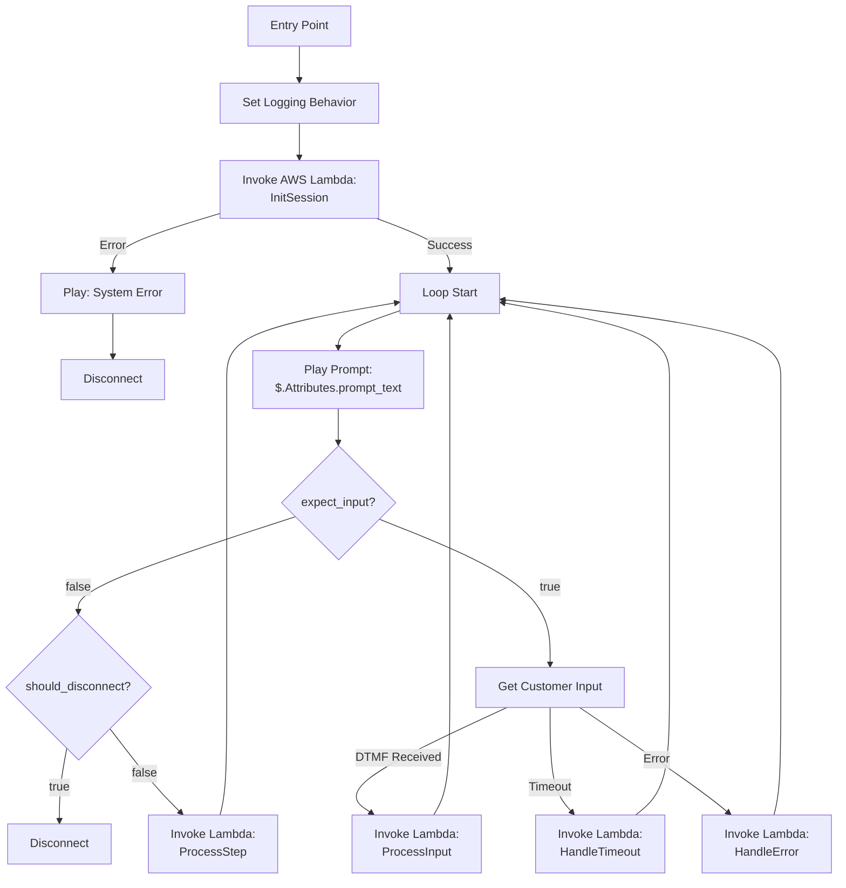

**Reading the diagram if you're new to Amazon Connect.** A Connect *contact
flow* is an authored graph of *blocks* — each block performs a fixed
operation (play a prompt, capture DTMF, branch on a condition, invoke a
Lambda, etc.) and has a fixed set of output branches wired to whatever
follows. The graph is the entire runtime: there is no scripting language,
no shared in-memory state between blocks, and no way to do arithmetic or
data transformation outside an "Invoke Lambda" block. Data flows block-to-block
through *contact attributes* — a flat key/value map that persists for the
duration of the call and is the only thing Connect can pass into a
"Play Prompt" or "Invoke Lambda" block (hence the `$.Attributes.prompt_text`
reference on the Play node). Every one of this design's five Invoke-Lambda
calls returns its response as a set of attributes that the subsequent
Connect blocks read.

**Why there are four invoke blocks inside the loop, not one.** Connect's
"Get customer input" block has three hardwired output branches — `DTMF
Received`, `Timeout`, `Error` — and you cannot merge them inside Connect
before calling Lambda, nor can you pass "which branch fired" as an attribute
to a single common invoke block. So each branch must terminate in its own
Invoke-Lambda node, and the Connect flow ends up with `ProcessInput`,
`HandleTimeout`, and `HandleError` as three separate nodes even though, from
the Lambda's point of view, each one is the same kind of event: *one turn
of the phase engine, triggered by one input variant*. `ProcessStep` is the
fourth — the no-input-expected case that still needs to advance the state
machine after an announcement-style prompt. From inside the handler, all
four (plus `InitSession`) are a single dispatch on `enum LambdaInput { Init,
NoInput, Dtmf(String), Timeout, Error }`; the one-phase-per-invocation
contract in §3.5.3 still holds. The multiplication in the diagram is a
Connect-side authoring artifact, not five different handlers.

**Other Connect-side constraints to know.** `Set Logging Behavior` at the
entry point is contact-flow-level config (log retention, redaction policy)
that fires once per call and has no per-turn state. "Play Prompt" with
`$.Attributes.prompt_text` renders through Amazon Polly TTS — meaning the
Lambda can return SSML in that attribute and Polly will interpret it, which
is how this design supports phonetic ballot-ID readback and paced
announcements (§7). An "Invoke Lambda" block has an 8-second hard total
synchronous timeout — anything slower must either be chunked across turns
or pre-fetched into the session on a fast turn; the session model in §4.1
is deliberately shaped around that ceiling. And the contact-flow JSON is
treated as code in this design (§16.2), not as something to be hand-edited
in the Connect console, because the graph structure *is* the control flow
and a console edit is equivalent to an unreviewed source-code change.

### 12.2 Contact Flow Attributes

| Attribute | Description |
|-----------|-------------|
| `prompt_text` | Text-to-speech content |
| `expect_input` | Whether to capture DTMF |
| `valid_inputs` | Valid DTMF digits — **advisory**; see note below |
| `input_timeout` | Seconds to wait |
| `should_disconnect` | End call flag |
| `user_input` | Captured DTMF input (inbound, set by Connect) |

> **`valid_inputs` is enforced in the Lambda, not by Connect.** Amazon Connect's
> "Get customer input" block does not accept a per-invocation whitelist of
> allowed digits from contact attributes — its `InputType=DTMF` just captures
> whatever the caller presses (bounded by the static block configuration such
> as max digits and terminator). The IVR Lambda therefore validates
> `user_input` against `valid_inputs` on the *next* turn, and if the press is
> outside the set it returns a "Sorry, please try again" prompt with
> `expect_input=true` and the same phase state — i.e. retries are driven from
> the domain layer, not the contact flow. Treat `valid_inputs` as documentation
> of what the Lambda accepts, not as a Connect-level guard.

---

## 13. Ballot Encryption

**Design Decision**: The IVR Lambda behaves as a voter from the platform's perspective.

The IVR will:
1. Construct the ballot from voter selections (DTMF input)
2. Encrypt the ballot using existing `sequent-core` encryption logic (same as voting-portal)
3. Submit encrypted ballot via the existing `/insert-cast-vote` API endpoint
4. Include JWT with `azp: "ivr-voting"` to identify the channel as TELEPHONE

**Implementation**:
- Lambda includes `sequent-core` as dependency (already written in Rust)
- Use election's public key from election data (fetched during setup)
- Ballot construction follows same structure as online voting
- Encryption is identical to voting-portal - no special handling needed

**Security Benefits**:
- Vote secrecy maintained end-to-end
- No plaintext votes in API calls
- Consistent security model across all voting channels
- Existing audit mechanisms work unchanged

---

## 14. Admin Portal Integration

### 14.1 New Election Event Configuration

Add to Election Event settings:
- **Phone Voting Enabled**: Boolean toggle
- **Phone Numbers**: List of assigned phone numbers
- **Phone Voting Start/End**: Optional separate voting period
- **Default Language**: For greeting before language selection

### 14.2 New Admin Views

- **Phone Voting Dashboard**: Real-time call statistics
- **Call Logs**: Searchable call history (without PINs)
- **Phone Number Management**: Assign/unassign numbers
- **IVR Flow / IVR Prompts tabs** (per election event): flow pipeline editing plus `ivr.retry_limits` (`auth`, `invalid_input`, `timeout`) configuration — see §7.4
- **Phone Blacklist**: manage the Hasura-backed `sequent_backend.ivr_phone_blacklist` table (add/remove/annotate E.164 numbers, optionally scoped to a specific election event). Gated by the `can_manage_phone_blacklist` Keycloak permission. See §6.3 for the data model and Harvest endpoints

#### Per-election-event and per-election dashboards

Both the **Election Event dashboard** and the **Election dashboard** in the
admin portal gain two new widgets when the telephone channel is enabled.
They parallel the existing IP-address view (see
[ListIpAddress.tsx](../../../../packages/admin-portal/src/resources/ElectionEvent/ListIpAddress.tsx))
and reuse the same patterns (react-admin `List`, filters, polling via
`QUERY_POLL_INTERVAL_MS`, configurable columns).

**1. Voters by channel, over time.** A time-series chart of ballots cast,
grouped by `VotingStatusChannel` (`ONLINE`, `KIOSK`, `EARLY_VOTING`,
`TELEPHONE`). Controls:

- Time window filter (last hour / last 24 h / custom range), defaulting to
  "since voting opened on this channel"
- Granularity bucket (1 min / 15 min / 1 h) — auto-selected from the window
- Cumulative toggle (stacked area = cumulative count per channel; line =
  rate per bucket)
- Channel toggle (show/hide each channel legend entry)

Data source: existing `cast_vote` records in Hasura, grouped by the
`channel` column (populated by Harvest via `AzpClient::to_voting_channel`
— straight from the JWT `azp` claim for kiosk and IVR, and from `azp`
combined with the area's early-voting window for portal clients; see
Appendix C.7 — no new pipeline). The telephone series starts populating as soon as the
`TELEPHONE` variant lands (see Appendix C). Available at both **Election
Event** scope (all elections within the event) and **Election** scope
(single election), same as the existing IP view.

**2. Phone-number activity list (obfuscated).** A list view of phone
numbers that have placed calls, modelled on
[ListIpAddress.tsx](../../../../packages/admin-portal/src/resources/ElectionEvent/ListIpAddress.tsx).
Columns:

| Column | Source | Notes |
|---|---|---|
| Phone (masked) | `ivr_call_log.phone_e164` | **Display-masked**: `+1 ***-***-1234` — only the country code and last four digits are shown in the UI. The raw number never leaves the server except inside blacklist actions |
| Country | Derived from E.164 country code | For Canadian deployments typically a single value; kept for consistency with the IP view |
| Call count | Aggregate | Total completed + abandoned calls from this number within the filter window |
| Vote count | Aggregate | Ballots cast from this number (joined via the voter id recorded on success) |
| Last call at | Max timestamp | |
| Election | `election_presentation` | Mirrors the IP view |
| Voter id | Aggregate | Present only where authentication succeeded; omitted by default in the `DatagridConfigurable` (same pattern as `voters_id` is omitted in the IP view) |

Filters: masked-phone substring search (matches only against the visible
last-four suffix server-side, to avoid exposing raw numbers through the
filter input), country, election. Actions: **Add to blacklist** (one-click
from a row, gated by `can_manage_phone_blacklist`) and **Export** (CSV
export carries the masked form, not the raw number — an explicit "Export
raw (privileged)" action requires a separate permission and produces an
audit entry).

Data source: a new Hasura view `sequent_backend.ivr_call_log` populated by
the Lambda at call end. Row TTL follows §9.2.1 — live rows expire when
their DynamoDB session does; aggregate totals persist for the election
event's normal reporting window. Raw phone numbers are stored in Hasura
server-side but row-level security denies `SELECT phone_e164` to all
roles; only a masked computed column and aggregate counts are selectable.
The "Add to blacklist" action calls a Hasura action that reads the raw
value inside Harvest and inserts into `ivr_phone_blacklist` without
surfacing the raw number to the client.

---

## 15. Testing Strategy

### 15.1 Unit Tests
- Each phase and sub-phase engine tested in isolation with mock ports (see §3.5.6)
- Every `FlowPhase` / `BallotSubPhase` transition covered, including error paths
- Prompt resolution / i18n fallback chain
- Input validation per phase
- `RetryCounters` reset semantics per phase transition

### 15.2 Record-and-Replay Session Tests
Since the engine is a pure function of `(session state, input) → (session state, response)`, the most valuable integration layer is a record-and-replay harness: a test file is a sequence of `(input, expected_prompt_key, expected_expect_input, expected_disconnect)` tuples driven through a fake `PhasePorts` implementation. Client IVR specs (e.g. Barrie) are encoded directly as replay fixtures, so regressions against a known-good script fail loudly at CI time.

### 15.2.1 Text-In / Text-Out Harness

Because the flow engine is a pure function of `(session state, input) → (session state, response)` and Amazon Connect only ever sees `prompt_text` + `valid_inputs` + `user_input` (§4.2), the entire voter-facing flow can be exercised **without Amazon Connect at all**. A text harness substitutes the Connect adapter with a pair of streams: stdin/stdout (CLI), a file (replay fixture), or an HTTP endpoint (admin portal). The Lambda's domain logic, flow engine, phase engines, port adapters for Keycloak/Hasura/Harvest, prompt resolution, SSML rendering, retry counters, and ballot construction all run unchanged — only the Connect adapter is swapped.

**Initial deliverables.**

- **Automated-test harness** — a Rust module in the IVR Lambda crate that drives the engine from a fixture describing `(input, expected prompt_key, expected_expect_input, expected_disconnect)` tuples, exactly as §15.2. The same harness also supports free-form scripting (send arbitrary input, assert on the rendered prompt text or the final session state) so scenarios that are not keyed off prompt keys (e.g. "after 3 invalid inputs the call ends") can be expressed naturally
- **`step-ivr` command-line tool** — a small binary that boots the engine, points it at any environment's Keycloak/Hasura/Harvest (via the same config the Lambda consumes), and exposes an interactive REPL: the tool prints the rendered prompt text (optionally with SSML expanded, optionally with a Polly-synth preview), waits for a DTMF line on stdin, and loops. Non-interactive mode reads inputs from a fixture file and writes a transcript. Useful for: manual UX walkthroughs, reproducing production issues from a captured session, and local development when Connect is not available. Lives under `beyond/packages/ivr-lambda/src/bin/step-ivr.rs` (same crate as the Lambda itself — see §16.2)

**Port substitutions.** The harness runs in two modes:

| Mode | Session port | Keycloak / Hasura / Harvest ports |
|---|---|---|
| **Hermetic** (unit / CI) | In-memory `HashMap<contact_id, IvrSession>` | Recorded fixtures — deterministic, no network |
| **Live** (manual dev / ops dry-run) | In-memory or real DynamoDB (configurable) | Real endpoints with a real JWT — exercises the actual auth and Harvest path end-to-end |

Hermetic mode is what CI runs on every PR; live mode is what a developer or on-call engineer uses to dry-run a real election event's flow against real Keycloak without placing a phone call. The admin portal is **not** a consumer of the live mode (see §7.4) — it is a text-only editor in the initial release.

**What this harness is not.** It does not exercise Amazon Connect itself (the contact flow JSON, DTMF collection block behaviour, Polly voice synthesis quality, telephony jitter). Those remain the job of §15.4 end-to-end tests. The harness covers everything on the Lambda side of the Connect boundary, which is where essentially all of the risk lives.

### 15.3 Integration Tests
- Keycloak authentication via ROPC against a test realm
- **Contract test** between the `ivr-config-resource` Keycloak extension and the Lambda: spin up Keycloak with a representative Direct Grant flow configuration and assert the `/ivr-config` response shape matches what the Lambda expects. The test covers both the authenticated happy path (request carries the `ivr-service` service-account token with the `can_read_phone_blacklist` role, see §C.8.b) **and** the negative cases (no token → 401; wrong-audience/voter token → 401/403; missing role → 403) so auth-shape drift between the two sides is caught alongside response-shape drift
- Harvest API `/insert-cast-vote`
- DynamoDB session round-trip

### 15.4 End-to-End Tests
- Full voting flow simulation via Amazon Connect test calls
- Multi-language paths
- Error scenarios
- Timeout handling

### 15.5 Load Testing
- Concurrent call simulation — must actually drive **concurrent telephone calls** into the Connect instance, not just parallel Lambda invocations; only the former exercises the Connect per-instance concurrent-calls quota (§17.4). Run this **after** the quota increase AWS ticket is granted, so the test verifies the raised quota rather than the default of 10
- API latency under load
- DynamoDB throughput

---

## 16. Deployment Strategy

### 16.1 Phased Rollout

**Phase 1: Development**
- Local testing with mocked Amazon Connect
- Integration with dev Keycloak/Harvest

**Phase 2: Staging**
- Full Amazon Connect setup in staging
- Test phone number provisioned
- End-to-end testing

**Phase 3: Production Pilot**
- Single municipality deployment
- Limited voter pool
- Close monitoring
- **AWS Connect concurrent-calls-per-instance quota raised** via Service Quotas / AWS support ticket before the pilot's voting window opens — the default of 10 is insufficient for any real election (§17.4). Budget several business days of AWS lead time

**Phase 4: Full Rollout**
- All municipalities enabled
- Automated provisioning
- Operational runbooks
- Connect quota reviewed per municipality ahead of each election; a single shared Connect instance accumulates concurrent load across simultaneous elections, so the raised quota must cover the **combined** peak, not the largest single event

### 16.2 Repository Layout & GitOps

**All paths in this section are proposed, not existing.** The long-term IVR
stack is deliberately split across three repositories so that code lives
near its domain and instantiation lives in GitOps, matching how every other
Sequent service is shipped. The initial MVP that exists today lives in
`playground/ivr/`, where the Rust Lambda, Terraform, and Amazon Connect
contact-flow prototype are kept together for fast iteration. The repository
split below describes the *target* steady-state layout once that MVP is
promoted into the main Sequent repos — none of the target paths exist yet.

**Current state of the target locations (2026-04):**

- `beyond/packages/` today contains only `ballot-audit/`. There is no
  `keycloak-extensions/` tree in `beyond`, no `ivr-lambda/`, and no
  `ivr-contact-flows/`. Every existing Keycloak extension
  (`conditional-authenticators`, `message-otp-authenticator`,
  `voter-enrollment`, `sequent-theme`, `custom-event-listener`,
  `url-truststore-provider`, `aws-ses-email-sender-provider`,
  `security-question-authenticator`, `dummy-email-sender-provider`) lives
  in `step/packages/keycloak-extensions/`, not in `beyond`. The table below
  puts IVR extensions under `beyond/packages/keycloak-extensions/` on the
  working assumption that newly-added, non-core Sequent extensions belong
  in `beyond` — but **that split is an unmade design decision**. A
  reasonable alternative is to keep `ivr-config-resource` and
  `IvrDobAuthenticator` in `step/packages/keycloak-extensions/` next to
  the existing extensions and defer the `beyond` split to a broader
  reorganisation. Pick one consciously in the promotion ticket.
- `gitops/iac-aws/` today contains `cluster/`, `rds/`, `vpc/`,
  `vpc-peering/`, `client-apps-setup/`, `client-apps-setup-infra-cluster/`,
  `client-postgres-init/`, `tf-modules/`. The `ivr/<env>/` layout below is
  proposed as parallel to those — it does not exist.
- `gitops/unified/global-config-apps/` today holds one directory per Argo
  app (admin-portal, harvest, keycloakx, hasura, windmill, voting-portal,
  etc.). No `ivr/` subdir exists; the `phone-map.yaml` file below is new.

| Artifact | Repo | Path (proposed — none exist today) | Why |
|---|---|---|---|
| IVR Lambda (Rust) source | **`beyond`** (or `step` — see note above) | `beyond/packages/ivr-lambda/` | Source of truth for the Lambda code. If placed in `beyond`, the crate is pulled into `step`'s Cargo workspace as a workspace member (via a path reference from the `beyond` checkout, or a vendored/submoduled include) so it compiles against the exact same `sequent-core` revision that produces the portal WASM — ballot construction and encryption therefore cannot drift between channels. `step` owns the compilation and release artifact; `beyond` owns the code. If placed in `step`, the workspace reference is direct |
| `ivr-config-resource` Keycloak extension (Java) | **`beyond`** (or `step` — see note above) | `beyond/packages/keycloak-extensions/ivr-config-resource/` *or* `step/packages/keycloak-extensions/ivr-config-resource/` | If `beyond`: forms a new `keycloak-extensions/` tree there, pulled into the Keycloak image build (see §16.3.2). If `step`: sits alongside existing extensions with no cross-repo build plumbing needed |
| `IvrDobAuthenticator` (if needed) | same as above | `beyond/packages/keycloak-extensions/ivr-dob-authenticator/` | Same placement decision as `ivr-config-resource` |
| Amazon Connect contact-flow JSON (source of truth) | **`beyond`** | `beyond/packages/ivr-contact-flows/<flow-name>.json` | Treated as code: PR-reviewed, versioned, diffed. Each flow is referenced by a stable name from IaC. New directory |
| IaC to *instantiate* Connect instance, flows, phone numbers, Lambda alias, DynamoDB session table, S3 routing bucket, NAT, CloudWatch alarms | **`gitops`** | `gitops/iac-aws/ivr/<env>/` | GitOps owns per-environment parameters (which region, which phone numbers, which cluster endpoints). Proposed as a new peer of `iac-aws/rds/`, `iac-aws/vpc/` |
| Per-phone-number routing records (source of truth) | **`gitops`** | `gitops/unified/global-config-apps/ivr/phone-map.yaml` | Each record maps a DID to (cluster, tenant, event). Change = PR in gitops; Atlantis apply renders the YAML to `ivr-phone-config.json` and uploads it to the routing bucket (§6.2) with S3 versioning preserving every prior revision. YAML is the authored format, JSON in S3 is the deployed artifact. New directory + file |

**Lambda deployment boundary.** The Lambda is deployed once per region that
hosts an Amazon Connect instance (today: one region, covering all
deployments). It is decoupled from Sequent clusters — a single Lambda
deployment can dispatch calls to any cluster in any region by reading the
cluster endpoints from the phone-config file in S3 (§6.2). This keeps the
IVR telephony edge as a shared tier, the way the Sequent CDN / edge
services already work.

**Contact-flow versioning discipline.** The contact-flow JSON in `beyond`
is the source of truth. The `gitops` IaC reads the JSON at apply time
(e.g. via Terraform `file()` or a released `beyond` artifact version) and
calls `aws_connect_contact_flow` to create/update the flow in the target
Connect instance. If an operator edits a flow in the Connect console for
debugging, the ritual is: export the JSON, PR it into `beyond`, and
re-apply from `gitops`. The console is never the source of truth.

**Promotion flow.** A change that touches all three layers promotes in
order: `beyond` merges the IVR-lambda source / Keycloak extension / contact-flow JSON change → `step` pulls the updated `beyond` revision into its workspace, builds the Lambda artifact, and releases it → `gitops` PR bumps the referenced Lambda version and (where relevant) the contact-flow or Keycloak-extension version, then applies via Atlantis. This matches the existing release cadence for the admin-portal / voting-portal stack.

### 16.3 Build & Packaging

`step`'s release pipeline (`.github/workflows/release.yml` → `reusable_build_push.yml`) builds every shipped service as a Docker image and pushes it to the shared ECR registry (`AWS_ECR_REGISTRY_GLOBALDOT`) tagged with `SHORT_SHA` + the release tag. The IVR introduces two deltas on that pipeline.

#### 16.3.1 IVR Lambda — new ECR image

**Yes — add a new ECR package.** The Lambda is a net-new deployable and must ship the same way every other service does, so it plugs directly into the existing matrix in [`reusable_build_push.yml`](../../../../.github/workflows/reusable_build_push.yml).

| Field | Value |
|---|---|
| `service` | `ivr-lambda` |
| `context` | `packages` |
| `file` | `packages/ivr-lambda/Dockerfile.prod` (Dockerfile lives in `step`, sources pulled from the `beyond`-owned crate — see §16.2) |
| Base image | `public.ecr.aws/lambda/provided:al2023` (Lambda custom-runtime base) |
| Architecture | `linux/arm64` (matches §11.2) |
| Registry | `${AWS_ECR_REGISTRY_GLOBALDOT}/ivr-lambda:<SHORT_SHA>` + `:<release-tag>` |

The Lambda is deployed as a **container image** rather than a ZIP artifact because (a) it reuses the existing ECR + `docker/build-push-action` plumbing with zero new secrets or runners, (b) container-based Lambda publishes are idempotent and version-pinnable from gitops (`aws_lambda_function.image_uri = "${ecr}/ivr-lambda:<tag>"`), and (c) the existing `buildcache`-backed layer caching in `reusable_build_push.yml` applies to it without modification.

Dockerfile outline: multi-stage — stage 1 uses `cargo-lambda` (or `cargo build --release --target aarch64-unknown-linux-gnu` with a `bootstrap` entrypoint) against the `step` Cargo workspace, which transitively compiles the `beyond`-hosted `ivr-lambda` crate against the workspace's pinned `sequent-core`. Stage 2 copies the `bootstrap` binary into `/var/task/` on the Lambda base image.

Gitops deployment reads the tag from the same version-bump PR described in the promotion flow above and applies `aws_lambda_function` pointing to `image_uri = ...:<tag>`.

#### 16.3.2 Keycloak image — pulling extensions from beyond

Today [`packages/Dockerfile.keycloak`](../../../../packages/Dockerfile.keycloak) builds the Keycloak image by copying a local `./keycloak-extensions/` tree into a Maven build stage and then copying the resulting JARs (one per extension: `voter-enrollment`, `message-otp-authenticator`, `conditional-authenticators`, `sequent-theme`, `custom-event-listener`, `url-truststore-provider`, `aws-ses-email-sender-provider`, `security-question-authenticator`, `dummy-email-sender-provider`) into `/opt/keycloak/providers/`.

This subsection only matters *if* the §16.2 placement decision puts the new `ivr-config-resource` extension (and optionally `ivr-dob-authenticator`) in `beyond` rather than next to the existing extensions in `step/packages/keycloak-extensions/`. If they stay in `step`, the existing build picks them up with no changes — add the new module directories, extend the JAR-copy list, done. The rest of this subsection covers the `beyond`-placement case, where the Keycloak image build must reach into a new (to-be-created) `beyond/packages/keycloak-extensions/` tree to pick them up.

Pick one of two integration patterns — they are equivalent for correctness, so the choice is about how `beyond` integrates into `step`'s build more broadly:

1. **Source-level include (submodule / workspace pull).** `beyond`'s `keycloak-extensions/` subtree is made available inside the `step` checkout at build time (git submodule, sparse clone, or whatever mechanism `step` adopts for pulling in the `beyond`-owned Rust IVR crate — they should use the same mechanism). `Dockerfile.keycloak`'s first stage adds `COPY ./beyond/keycloak-extensions/ivr-config-resource/ /build/keycloak-extensions/ivr-config-resource/` (plus `ivr-dob-authenticator` if present) and extends the JAR-copy list in the second stage:
   ```dockerfile
   COPY --from=spis-build \
     /build/keycloak-extensions/ivr-config-resource/target/sequent.ivr-config-resource.jar \
     /build/keycloak-extensions/ivr-dob-authenticator/target/sequent.ivr-dob-authenticator.jar \
     /opt/keycloak/providers/
   ```
2. **Pre-built JAR artifact from `beyond`.** `beyond` has its own release pipeline that builds the Keycloak extensions and publishes them as a versioned OCI artifact (or Maven package). `Dockerfile.keycloak` `COPY --from=<pinned-beyond-image>` pulls in the JARs directly. Promotion order becomes `beyond` publishes artifact version → `step` bumps the pinned artifact version in `Dockerfile.keycloak` (or an ARG) → `step` releases a new Keycloak image.

Pattern 1 is simpler and matches today's monorepo feel; pattern 2 is more rigorous in isolating the build graphs and maps 1:1 onto how the Rust IVR crate could also be pulled in. Use the same pattern for both Rust and Java to keep the two pipelines symmetric.

Either way, the `java_test.yml` workflow that currently runs `mvn verify` on `packages/keycloak-extensions/pom.xml` must also verify the `beyond`-hosted extensions (or be reorganised so those tests run in `beyond`'s own CI and `step` consumes a tested artifact). Don't let the `ivr-config-resource` JAR ship untested through the integration.

**Nothing else in the Keycloak image changes.** The realm-template changes (new `ivr-voting` client, new `ivr-service` client with its service-account role mapping for `can_read_phone_blacklist`, and the Direct Grant flow override — see Appendix C.8) are data, not code; they flow through the existing realm-bootstrap mechanism the same way any other Keycloak realm change does. The `ivr-service` `client_secret` is provisioned the same way other shared secrets are: the bootstrap writes the realm with a placeholder, the operator seeds AWS Secrets Manager once per environment, and each realm's `ivr-service` secret is reset to match via a scripted admin-API call — no secret ever committed to git.

#### 16.3.3 Summary

- **IVR Lambda**: new ECR package (`ivr-lambda`), new row in the `reusable_build_push.yml` matrix, new Dockerfile in `packages/ivr-lambda/`. Released on the same cadence and tag as the rest of step.
- **Keycloak image**: no new image — the existing `keycloak` ECR package continues to be the sole Keycloak artifact. What changes is its build input: the `Dockerfile.keycloak` build stage picks up the new `ivr-config-resource` extension (and optional `ivr-dob-authenticator`) from whichever repo §16.2 places them in (`step/packages/keycloak-extensions/` requires no new plumbing; `beyond/packages/keycloak-extensions/` requires the cross-repo integration in §16.3.2). Same image, expanded set of bundled JARs.
- **gitops**: references both the new `ivr-lambda` ECR tag and the existing `keycloak` ECR tag (the latter is already in gitops — only the tag bump is new).

---

## 17. Cost Considerations

All numbers below are list-price AWS as of the most recent published rates
for `ca-central-1`; FX, private pricing, and committed-use discounts are
ignored. Rates change — treat this model as a sanity-check, not a quote.

### 17.1 Per-Call Assumptions

Realistic reference call for a Canadian municipal ballot (Mayor + Council +
School Board, ~15 contests total, English/French readback, one re-listen):

| Parameter | Value | Rationale |
|---|---|---|
| Call duration | **9 min** | 1 min auth + greeting, 7 min ballot readback + selection, 1 min summary + submit + receipt |
| Lambda invocations | **~60** | one per DTMF press / timeout / announcement transition |
| Avg Lambda duration | **400 ms** | cold-start ≤2%; most invocations are pure-compute + 1 DynamoDB read/write |
| DynamoDB requests | **~120** | 2 per Lambda invocation (read + conditional write) |
| S3 publication fetch | **1** | once per call, cached in-process thereafter |
| Polly characters | **~12 000** | mixed English/French readback, with ~15% re-listens |
| CloudWatch log volume | **~50 KB** | structured JSON, one line per Lambda turn + error detail |

### 17.2 Per-Call Cost Breakdown (`ca-central-1`, list price)

| Line item | Unit rate | Quantity | Cost |
|---|---|---|---|
| Amazon Connect voice (inbound) | $0.018/min | 9 min | **$0.162** |
| Amazon Connect DID usage (per-minute) | $0.004/min (toll) | 9 min | **$0.036** |
| Lambda invocations | $0.20 / 1M | 60 | ~$0.000012 |
| Lambda compute (256 MB, arm64) | $0.0000133/GB·s | 60 × 0.4 s × 0.25 GB = 6 GB·s | ~$0.00008 |
| DynamoDB on-demand (read + write avg) | ~$0.625 / 1M req (blended) | 120 | ~$0.000075 |
| S3 GET | $0.0004 / 1 000 | 1 | negligible |
| Polly Neural TTS | $16 / 1M chars | 12 000 | **$0.192** |
| CloudWatch Logs ingestion | $0.76 / GB | 50 KB | ~$0.000038 |
| Cross-region egress (Lambda → cluster in another region) | $0.02 / GB | ~0.5 MB per call | ~$0.00001 |
| **Total per 9-min call** | | | **~$0.39** |

Polly Standard TTS (not Neural) is ~$4 / 1M chars and drops the Polly line
item to ~$0.05, bringing the total to ~$0.25 — but Neural voices are
materially more intelligible for older voters and worth the premium for a
public-election channel. A re-listen-heavy call (voter re-listens to every
contest) pushes Polly characters to ~20 000 and the total to ~$0.50.

### 17.3 Fixed Monthly Costs

| Line item | Rate | Notes |
|---|---|---|
| Canadian DID phone number (toll) | $1.00/mo per number | per Connect pricing |
| Canadian toll-free number | $2.00/mo per number | optional |
| NAT Gateway (single-AZ, baseline) | $32/mo + $0.045/GB data | see §11.1 |
| NAT Gateway (multi-AZ, recommended) | ~$96/mo + data | 3 × single-AZ; removes SPOF |
| Amazon Connect instance | $0 | no per-instance charge; pay per usage |
| DynamoDB storage (sessions, 1 h TTL) | negligible | < 1 GB at any point in time |
| CloudWatch Logs retention (90 days) | $0.03/GB-mo | ~$3/mo at 100 GB stored |

Phone-blacklist table (Hasura row in existing PostgreSQL, §6.3) and phone-config S3 object (§6.2, a few KB, one file, versioning-enabled) are both trivial (< $1/mo combined).

### 17.4 Election-Day Capacity Example

For a **50 000-voter municipality** with an expected **5 % telephone-channel
turnout** (2 500 voters) concentrated into a 12-hour voting window:

- Calls: 2 500 × ~1.1 (some retries / dropped calls) ≈ 2 750 calls
- Variable cost: 2 750 × $0.39 ≈ **$1 070**
- Peak concurrency: rough Erlang estimate at peak hour assuming 10 % of
  daily calls in peak hour → ~275 calls/hour × 9 min / 60 min ≈ **~42
  concurrent calls**. Fine on the Lambda side (default account-level
  reserved-concurrency headroom is 1 000), but **not fine on Amazon
  Connect's default concurrent-calls-per-instance quota**, which is **10
  for a fresh Connect instance** and must be raised via an AWS support
  ticket. First election-day spike against the default quota would trip
  it and drop calls.

  **Go-live action item (must happen weeks before each election, not the
  day before).** Open a Service Quotas / AWS support case to raise
  **"Concurrent active calls per instance"** on the IVR's Connect instance
  to a value comfortably above the peak projection — recommend **2×** the
  Erlang estimate as a rule of thumb to absorb retry bursts and the long
  tail of the call-duration distribution (for the 50 K-voter example:
  request ≥ 100). AWS typically processes these in a few business days;
  build the lead time into the election timeline. Validate the raised
  quota with a pre-election load test (§15.5) that actually drives
  concurrent calls, not just Lambda invocations — Lambda-side load tests
  will not exercise the Connect-instance quota.

  Quota dimensions worth checking alongside "concurrent active calls"
  (each is per-instance and may also need raising for larger deployments):
  **concurrent calls per flow**, **concurrent API requests per instance**,
  and any Polly request-rate limits relevant to the chosen region. The
  existing `IvrConnectConcurrentCallsNearQuota` alert (§10.3) is the
  runtime guard; the quota increase is the prerequisite.

Add monthly fixed costs (multi-AZ NAT + DIDs + logs retention) for a rough
**~$1 200 all-in for a one-day election** at this size. Scale is roughly
linear in voters once fixed costs are amortised across multiple
municipalities sharing the same Lambda + Connect instance.

### 17.5 Cost Optimization

- **Publication cache.** The in-process publication cache (§3.5.2) avoids
  paying the S3 GET and JSON parse on every Lambda invocation — critical
  because without it a 60-turn call pays 60× S3 GETs.
- **Polly voice selection.** Standard voices are 4× cheaper than Neural;
  Long-form is the most expensive tier and should not be used for IVR.
  Cache Polly output for static prompts (greeting, goodbye, `invalid_input`)
  in S3 and reference as pre-synthesised audio from the contact flow —
  these prompts account for a large share of characters across all calls.
- **DynamoDB.** On-demand is correct for bursty election-day traffic; only
  switch to provisioned + autoscaling if running continuous high-volume
  elections. Use short TTLs to keep storage cost near zero.
- **Keep prompts concise.** Polly cost is the largest variable line item
  after Connect voice; shaving 20 % off prompt length shaves ~$0.04 off
  per-call cost.
- **Share NAT across tenants.** The Lambda is one deployment serving many
  clusters (§11.2), so the multi-AZ NAT cost amortises across every
  tenant using the IVR channel.

---

## 18. Open Questions / Decisions Needed

1. **Scheduled Opening/Closing**: Telephone voting opens and closes independently of the ONLINE and KIOSK channels, following the same model KIOSK already uses in [sequent-core/src/ballot.rs](/packages/sequent-core/src/ballot.rs): a dedicated status + period_dates pair, set via `ElectionEventStatus::set_status_by_channel(VotingStatusChannel::TELEPHONE, …)`. The only auto-coupling in the codebase is `close_early_voting_if_online_status_change` (EARLY_VOTING ↔ ONLINE); TELEPHONE stays decoupled.

   Scheduled transitions reuse the existing infrastructure with no new machinery:
   - **Data model**: `ScheduledEvent` rows in Hasura with `event_processor ∈ {START_VOTING_PERIOD, END_VOTING_PERIOD}` and a `CronConfig { cron, scheduled_date }` ([sequent-core/src/types/scheduled_event.rs](/packages/sequent-core/src/types/scheduled_event.rs)).
   - **Execution**: Windmill's `manage_election_dates` / `manage_election_event_date` tasks ([packages/windmill/src/tasks/manage_election_dates.rs](/packages/windmill/src/tasks/manage_election_dates.rs)) fire on cron, map the event processor to a `VotingStatus`, and call `voting_status::update_election_status` with a `Vec<VotingStatusChannel>`. The channel list is already the extension point — today it hard-codes `[ONLINE, KIOSK]` for START and `[ONLINE]` for END; extending to TELEPHONE means either (a) adding TELEPHONE to those lists when the event event has a telephone channel configured, or (b) carrying the target channel set on the `ScheduledEvent` payload so admins can schedule per-channel transitions.
   - **Admin Portal**: the scheduled-event editor that today produces `START_VOTING_PERIOD` / `END_VOTING_PERIOD` rows gains a per-channel selector so operators can schedule "open TELEPHONE on 2026-05-01 09:00, close 2026-05-03 20:00" independently from ONLINE/KIOSK.

   **Possible breaking refactor (tracked separately, not a blocker for IVR MVP)**: the three parallel fields on `ElectionEventStatus` (`voting_status` / `kiosk_voting_status` / `early_voting_status` + their `*_period_dates`) should be collapsed into a single `BTreeMap<VotingStatusChannel, ChannelStatus>`. See [Appendix C.7](#c7-possible-refactor-generalize-voting-status-per-channel).

2. **Audio File Support**: Should the IVR support pre-recorded audio files in addition to TTS?
   - Barrie specs reference `.mp3`/`.wav` files for all prompts
   - Amazon Connect supports both Polly TTS and S3-hosted audio
   - Could extend prompt values to support `{"type": "audio", "url": "s3://..."}` vs `{"type": "tts", "text": "..."}`

---

## 19. Implementation Plan — Ticket Breakdown

Survey of existing code vs. design:
- `playground/ivr/` — throwaway number-collection demo (~300 lines), not a base
- `ivr-lambdas/` — older parallel attempt, not promoted
- `step/packages/keycloak-extensions/` — conditional-authenticators, message-otp-authenticator exist; IVR extensions do not
- `step/packages/sequent-core/` — `VotingChannels.telephone` flag exists; `VotingStatusChannel::TELEPHONE` + status fields do not
- `step/packages/harvest/` — `/insert-cast-vote` exists; blacklist endpoints do not
- `beyond/packages/` — only `ballot-audit/`; no `ivr-lambda/`, `ivr-contact-flows/`, `keycloak-extensions/`
- `gitops/iac-aws/`, `gitops/unified/` — no `ivr/` tree, no `phone-map.yaml`

Every ticket below is TDD: write failing tests → implement → make green. Listed small enough to ship in a day or two each.

### 19.1 Epic 0 — Placement & scaffolding

1. **ADR: `beyond` vs `step` placement** for `ivr-lambda` crate, `ivr-config-resource` Keycloak extension, and contact-flow JSON (§16.2). Decision doc, no code.
2. **Scaffold `ivr-lambda` crate** in chosen repo — empty binary, `cargo-lambda` build, `Dockerfile.prod`, wire into step's Cargo workspace.
3. **Add `ivr-lambda` to `reusable_build_push.yml`** matrix + create ECR repo.

### 19.2 Epic 1 — `sequent-core` TELEPHONE channel (Appendix C.1–C.9)

4. **Add `VotingStatusChannel::TELEPHONE`** variant + `channel_from()` mapping.
5. **Add `telephone_voting_status` + `telephone_voting_period_dates`** to `ElectionEventStatus` + `ElectionStatus` + `Default` impls + helper methods.
6. **Wire `AzpClient::ivr-voting`** → `VotingStatusChannel::TELEPHONE` in `authorize_voter_election` (Appendix C.7).

### 19.3 Epic 2 — Keycloak extensions

7. **`ivr-config-resource` extension** — walk Direct Grant flow, stock-authenticator lookup, custom-authenticator config read, unknown-authenticator → 500.
8. **Bearer-token gate on `ivr-config-resource`** — require `ivr-service` token with `can_read_phone_blacklist` role; 401/403 negatives covered (§5.1.2).
9. **Realm-bootstrap additions** — `ivr-voting` client (ROPC), `ivr-service` client (client_credentials), Direct Grant flow override, service-account role mapping (Appendix C.8.a/b).
10. **(Conditional) `IvrDobAuthenticator`** — only if first deployment needs DoB auth (Appendix C.8.1).

### 19.4 Epic 3 — Blacklist backend

11. **Hasura migration** — `sequent_backend.ivr_phone_blacklist` table + indexes + FKs.
12. **Hasura permissions** — `can_read_phone_blacklist` (service role), `can_manage_phone_blacklist` (admin role).
13. **Harvest CRUD endpoints** for blacklist entries, reusing existing permission middleware.
14. **`TokenManager::get_service_token(realm)`** — per-realm token cache, Secrets Manager lookup, `AuthError` taxonomy reuse (§5.1.9).

### 19.5 Epic 4 — Lambda ports & adapters

15. **Port trait definitions** — all 9 ports (Session, Auth, ElectionConfig, ElectionStatus, CastVoteHistory, VoteCasting, PhoneConfig, Blacklist, PhoneHasher); object-safety enforced; in-memory fakes.
16. **Shared `HasuraClient`** — one `reqwest::Client`, one retry/backoff/circuit-breaker, `Arc`-shared across Hasura-backed adapters (§3.5.2).
17. **DynamoDB `Session` adapter** — conditional writes (`attribute_not_exists` + version CAS), round-trip against local DynamoDB.
18. **S3 `ElectionConfig` adapter** — process cache keyed by `(tenant_id, event_id, publication_id)`.
19. **S3 `PhoneConfig` adapter** — read-only, narrow IAM, process-cached (§6.2).
20. **Keycloak `Auth` adapter** — ROPC, refresh, absolute expiry, 3-category error classifier (§5.1.9).
21. **Hasura `Blacklist` adapter** using service token.
22. **Hasura `ElectionStatus` + `CastVoteHistory` adapters** using voter JWT.
23. **Harvest `VoteCasting` adapter** with deterministic idempotency key.
24. **`PhoneHasher` adapter** — per-tenant salt in Secrets Manager, per-container cache, `(hash, salt_gen)` output (§9.2.1).

### 19.6 Epic 5 — Domain & flow engine

25. **`IvrSession` model** — full struct per §4.1 with version field + DynamoDB serde.
26. **`FlowPhase` enum + `PhaseState` variants + `FlowPosition`** — invariant-enforced via `FlowPhase::initial_state()`, `FlowPosition::new`/`advance`, exhaustiveness unit test (§3.5.3).
27. **Outer dispatcher** — `*` reserved-key interception, `last_response` cache, phase lookup.
28. **`PhaseCtx<'a>`** struct of `&'a dyn Port` refs + `async_trait` (§3.5.3).
29. **Phase: `announcement`** — one executor covering welcome / declaration / pre-voting / …
30. **Phase: `language_select`**.
31. **Phase: `blacklist_check`** (pre-auth, PhoneHasher + Blacklist).
32. **Phase: `auth`** — iterates `auth_steps` from `/ivr-config`, ROPC submission.
33. **Phase: `eligibility_check`**.
34. **Phase: `goodbye`**.
35. **`ballot_loop` shell + sub-phase dispatcher** (§3.5.4).
36. **Sub-phase: `ElectionSelect`** (+`CastVoteHistoryPort` annotation, `skip_election_list` logic).
37. **Sub-phases: `LanguageSwitch` + `ElectionIntro`**.
38. **Sub-phases: `ContestLoop` + `ContestIntro`**.
39. **Sub-phases: `CandidateSelect` + `SelectionCheck`** + multi-digit DTMF handling (§3.4).
40. **Sub-phase: `VoteConfirm`** + edit mode.
41. **Sub-phase: `ElectionSummary`** (edit-contest targeting, `enter_contest_edit` helper).
42. **Sub-phase: `ElectionSubmit`** — pre-submit refresh, encrypt, POST, §5.4 error taxonomy.
43. **Sub-phase: `ElectionReceipt`** — phonetic hex spelling + `*` repeat.

### 19.7 Epic 6 — i18n, prompts, SSML

44. **`validate_ivr_subtree` validator** in `sequent-core` → `TypedIvrScope` (WASM-compatible, §7.2).
45. **Prompt fallback resolver** — candidate → contest → election → event → default with sentinel on miss (§7.5).
46. **SSML placeholder interpolation** — structurally-safe vs user-supplied classes, `escape(x) == x` invariant on safe inputs (§7.2).
47. **Default EN/FR bundle** for well-known prompt keys (Appendix D).

### 19.8 Epic 7 — Connect & Lambda edge

48. **Contact-flow JSON authoring** — `GetCallerPhoneNumber` → Lambda loop → Play/GetDigits → Disconnect (§12.1).
49. **Lambda input/output types** — `ConnectEvent` / `ConnectResponse` serde round-trip tests (§4.2).

### 19.9 Epic 8 — Security & PIPEDA

50. **Per-tenant salt rotation** — AWSCURRENT/AWSPREVIOUS cycle, 90-day cleanup script (§9.2.1).
51. **CloudWatch log redaction** — raw E.164 filter, hash-only emission.
52. **Session TTL + post-call phone wipe** on DynamoDB (§9.2.1).

### 19.10 Epic 9 — Monitoring

53. **CloudWatch metrics + structured logging** (§10.1, §10.2).
54. **Alerts** — token-error, vote-submission failure, backlog, blacklist spikes (§10.3, §5.1.9).

### 19.11 Epic 10 — Admin portal

55. **"IVR Prompts" tab** — text inputs per language, `TypedIvrScope` WASM validator inline errors (§7.4).
56. **"IVR Flow" tab** — typed editor for announcement blocks + raw-JSON escape hatch using `sequent-core` deserializer (§7.4).
57. **"Phone Blacklist" view** — list/add/remove/annotate gated by `can_manage_phone_blacklist` (§14.2, §6.3).
58. **Per-election/contest/candidate IVR overrides** — optional `name`/`alias`/`description` inputs (§14.2).

### 19.12 Epic 11 — GitOps / IaC

59. **TF module: IVR Lambda** — function, alias, IAM role, log group (`gitops/iac-aws/ivr/<env>/`).
60. **TF: DynamoDB session table** + TTL + autoscaling.
61. **TF: S3 routing bucket** (versioned) + narrow IAM.
62. **TF: Amazon Connect instance** + DIDs + contact-flow import.
63. **phone-map YAML → JSON renderer** + Atlantis apply → S3 upload (§16.2).
64. **Connect concurrent-calls quota raise** — AWS Support ticket template + runbook (§17.4, §16.1 Phase 3).

### 19.13 Epic 12 — Cross-layer tests

65. **Contract test** — `ivr-config-resource` ↔ Lambda parser, happy + auth negatives (§15.3).
66. **Record-and-replay harness + `step-ivr` CLI** — text-in/text-out (§15.2.1).
67. **E2E test** — scripted DTMF against dev Connect + real Keycloak + Hasura (§15.4).
68. **Load test** — concurrent real telephony calls after quota raise (§15.5).

### 19.14 Epic 13 — Docs & runbooks

69. **Keycloak realm-bootstrap runbook** for IVR clients + secret provisioning.
70. **Operator runbook** — blacklist ops, quota escalation, salt rotation.

### 19.15 Dependencies & Parallelization

**Critical path:** 2 → 15 → 25/26 → 27/28 → phase tickets 29–43 → 49 → 48 → 65 → 67 → 68.

**Parallelizable once scaffolded:** Epic 1 (sequent-core), Epic 2 (Java/Keycloak), Epic 3 (Hasura/Harvest), Epic 6 (i18n in sequent-core), Epic 10 (admin portal), Epic 11 (gitops) — each team can pick up independently after Epic 0 lands.

---

## Appendix A: Sequence Diagrams

### A.1 Complete Voting Flow

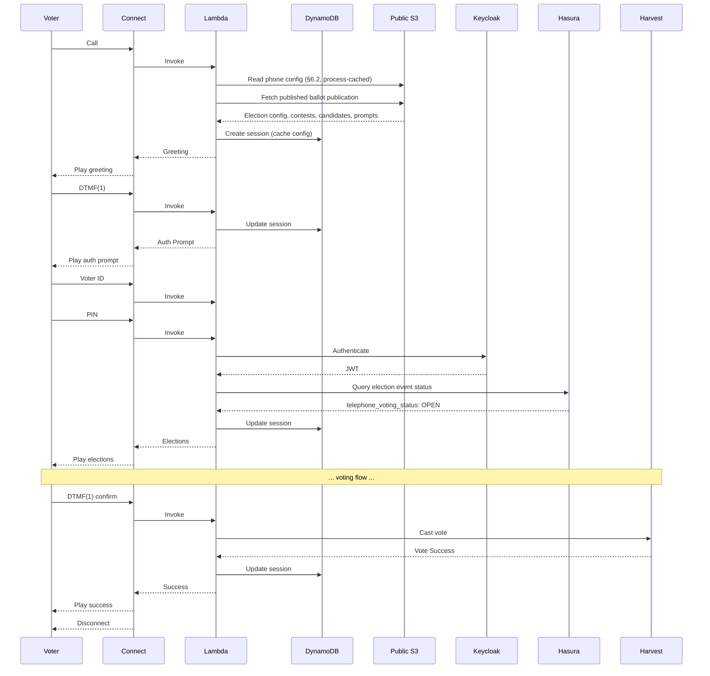

---

## Appendix B: Glossary

| Term | Definition |
|------|------------|
| **DTMF** | Dual-Tone Multi-Frequency - touch-tone phone signals |
| **IVR** | Interactive Voice Response |
| **Contact Flow** | Amazon Connect's visual call routing builder |
| **Polly** | AWS text-to-speech service |
| **EML** | Election Markup Language - ballot definition format |
| **Hasura** | GraphQL engine over PostgreSQL |
| **Harvest** | Backend API for vote casting |
| **Keycloak** | Identity and access management platform |

---

## Appendix C: Required Code Changes for TELEPHONE Channel

To support scheduled phone voting with independent start/stop times, the following code changes are required.

**What already exists (no code change needed).** The per-event channel-enablement flag `telephone: Option<bool>` is already present on `VotingChannels` in [`packages/sequent-core/src/types/hasura/core.rs`](../../../../packages/sequent-core/src/types/hasura/core.rs) alongside `online`, `kiosk`, `early_voting`, and `paper`. Admin-portal UI and Hasura schema already let operators toggle it. The changes in C.1 and C.2 below wire a matching `VotingStatusChannel::TELEPHONE` enum variant to that pre-existing data — they do not add the flag itself.

### C.1 Add TELEPHONE to VotingStatusChannel Enum

**File:** `packages/sequent-core/src/ballot.rs` (`pub enum VotingStatusChannel`)

```rust
#[allow(non_camel_case_types)]
#[derive(
    Serialize,
    Deserialize,
    Debug,
    PartialEq,
    Eq,
    Clone,
    Copy,
    EnumString,
    JsonSchema,
    IntoStaticStr,
)]
pub enum VotingStatusChannel {
    ONLINE,
    KIOSK,
    EARLY_VOTING,
    TELEPHONE,  // ADD THIS
}
```

### C.2 Update channel_from() Method

**File:** `packages/sequent-core/src/ballot.rs` (`impl VotingStatusChannel::channel_from`)

One new match arm reads the pre-existing `VotingChannels.telephone` field:

```rust
impl VotingStatusChannel {
    pub fn channel_from(
        &self,
        channels: &core::VotingChannels,
    ) -> Option<bool> {
        match self {
            &VotingStatusChannel::ONLINE => channels.online.clone(),
            &VotingStatusChannel::KIOSK => channels.kiosk.clone(),
            &VotingStatusChannel::EARLY_VOTING => channels.early_voting.clone(),
            // Reads the existing `telephone: Option<bool>` flag on
            // `VotingChannels` (core.rs). No struct change needed.
            &VotingStatusChannel::TELEPHONE => channels.telephone.clone(),
        }
    }
}
```

### C.3 Add telephone_voting_status to ElectionEventStatus

**File:** `packages/sequent-core/src/ballot.rs` (`pub struct ElectionEventStatus`)

```rust
#[derive(
    BorshSerialize,
    BorshDeserialize,
    Serialize,
    Deserialize,
    JsonSchema,
    PartialEq,
    Eq,
    Debug,
    Clone,
    Default,
)]
pub struct ElectionEventStatus {
    pub voting_status: VotingStatus,
    pub kiosk_voting_status: VotingStatus,
    pub early_voting_status: VotingStatus,
    pub telephone_voting_status: VotingStatus,  // ADD THIS

    pub voting_period_dates: PeriodDates,
    pub kiosk_voting_period_dates: PeriodDates,
    pub early_voting_period_dates: PeriodDates,
    pub telephone_voting_period_dates: PeriodDates,  // ADD THIS
}
```

### C.4 Update ElectionEventStatus Methods

**File:** `packages/sequent-core/src/ballot.rs`

Update `status_by_channel()`:
```rust
impl ElectionEventStatus {
    pub fn status_by_channel(
        &self,
        channel: VotingStatusChannel,
    ) -> VotingStatus {
        match channel {
            VotingStatusChannel::ONLINE => self.voting_status.clone(),
            VotingStatusChannel::KIOSK => self.kiosk_voting_status.clone(),
            VotingStatusChannel::EARLY_VOTING => self.early_voting_status.clone(),
            VotingStatusChannel::TELEPHONE => self.telephone_voting_status.clone(),  // ADD THIS
        }
    }
}
```

Update `set_status_by_channel()`:
```rust
impl ElectionEventStatus {
    pub fn set_status_by_channel(
        &mut self,
        channel: VotingStatusChannel,
        new_status: VotingStatus,
    ) {
        let mut period_dates = match channel {
            VotingStatusChannel::ONLINE => {
                self.voting_status = new_status.clone();
                &mut self.voting_period_dates
            }
            VotingStatusChannel::KIOSK => {
                self.kiosk_voting_status = new_status.clone();
                &mut self.kiosk_voting_period_dates
            }
            VotingStatusChannel::EARLY_VOTING => {
                self.early_voting_status = new_status.clone();
                &mut self.early_voting_period_dates
            }
            VotingStatusChannel::TELEPHONE => {  // ADD THIS
                self.telephone_voting_status = new_status.clone();
                &mut self.telephone_voting_period_dates
            }
        };
        period_dates.update_period_dates(&new_status);
    }
}
```

### C.5 Add telephone_voting_status to ElectionStatus

**File:** `packages/sequent-core/src/ballot.rs` (`pub struct ElectionStatus`)

```rust
#[derive(
    BorshSerialize,
    BorshDeserialize,
    Serialize,
    Deserialize,
    JsonSchema,
    PartialEq,
    Eq,
    Debug,
    Clone,
)]
pub struct ElectionStatus {
    pub voting_status: VotingStatus,
    pub kiosk_voting_status: VotingStatus,
    pub early_voting_status: VotingStatus,
    pub telephone_voting_status: VotingStatus,  // ADD THIS

    pub voting_period_dates: PeriodDates,
    pub kiosk_voting_period_dates: PeriodDates,
    pub early_voting_period_dates: PeriodDates,
    pub telephone_voting_period_dates: PeriodDates,  // ADD THIS
    pub allow_tally: Option<bool>,
}
```

### C.6 Update ElectionStatus Methods

Similar to ElectionEventStatus, update:
- `status_by_channel()`
- `dates_by_channel()`
- `set_status_by_channel()`

To include `VotingStatusChannel::TELEPHONE` cases.

### C.7 Update Authorization for IVR Client

**File:** `packages/sequent-core/src/services/authorization.rs` (the `azp` match inside `authorize_voter_election`)

Per CLAUDE.md ("policies use enums, not magic strings") the `azp` match should not be keyed off ad-hoc string literals. Introduce an `AzpClient` enum in `sequent-core` that owns the canonical set of Keycloak client ids, annotated with the same `strum` derives already used elsewhere in `sequent-core` (see `VotingStatusChannel` in `ballot.rs` for the reference pattern: `EnumString`, `IntoStaticStr`, etc.). `FromStr` parses the string claim; the match on the enum is then exhaustive and compiler-checked.

```rust
// packages/sequent-core/src/types/auth.rs (new)
#[derive(
    Serialize,
    Deserialize,
    Debug,
    PartialEq,
    Eq,
    Clone,
    Copy,
    EnumString,
    IntoStaticStr,
    Display,
)]
pub enum AzpClient {
    #[strum(serialize = "voting-portal")]
    VotingPortal,
    #[strum(serialize = "voting-portal-kiosk")]
    VotingPortalKiosk,
    #[strum(serialize = "ivr-voting")]
    IvrVoting,
}
```

`AzpClient` is 1:1 with the Keycloak client ID Keycloak emits in `azp` **for voter-issued tokens** and intentionally has three variants, not four — the ONLINE and EARLY_VOTING channels share the `voting-portal` client. Early voting is a per-area policy (`AreaPresentation.allow_early_voting`) evaluated against the election event's `early_voting_period_dates`, not a distinct identity. The enum therefore models *who authenticated*; a second step resolves *which `VotingStatusChannel` this submission belongs to*, where the portal case fans out into ONLINE vs EARLY_VOTING:

The `ivr-service` client (Appendix C.8.b) is deliberately **not** an `AzpClient` variant. Its tokens are obtained via `client_credentials` — they carry no voter identity, are never submitted as ballot-casting credentials, and are never resolved into a `VotingStatusChannel`. `AzpClient` is specifically the "voter-facing client that represents a channel" enum; service clients sit outside it on purpose, so `authorize_voter_election` cannot accidentally accept a service-auth token as if it were a voter token.

```rust
/// Whether a portal-client submission falls inside the voter's
/// early-voting window. Computed at the call site from the area's
/// `allow_early_voting` presentation policy and the election event's
/// `early_voting_period_dates`; ignored for kiosk and IVR.
#[derive(Debug, Clone, Copy, PartialEq, Eq)]
pub enum PortalTimeWindow {
    Online,
    EarlyVoting,
}

impl AzpClient {
    /// Resolve the Keycloak client ID to the `VotingStatusChannel`
    /// the submission will be tagged with. The match is exhaustive
    /// on `VotingStatusChannel`, so adding a new client **or** a new
    /// channel variant forces a compile error here.
    pub fn to_voting_channel(
        self,
        portal_window: PortalTimeWindow,
    ) -> VotingStatusChannel {
        match (self, portal_window) {
            (AzpClient::VotingPortal, PortalTimeWindow::Online)
                => VotingStatusChannel::ONLINE,
            (AzpClient::VotingPortal, PortalTimeWindow::EarlyVoting)
                => VotingStatusChannel::EARLY_VOTING,
            (AzpClient::VotingPortalKiosk, _)
                => VotingStatusChannel::KIOSK,
            (AzpClient::IvrVoting, _)
                => VotingStatusChannel::TELEPHONE,
        }
    }
}
```

`authorize_voter_election` parses the claim once and hands the authenticated client back to the caller, which already loads the area and election event while building the cast-vote and is the right place to evaluate the early-voting window:

```rust
pub fn authorize_voter_election(
    claims: &JwtClaims,
    permissions: Vec<VoterPermissions>,
    election_id: &String,
) -> Result<(String, AzpClient), (Status, String)> {
    // ... existing validation ...

    let client = AzpClient::from_str(claims.azp.as_str())
        .map_err(|_| (Status::Unauthorized, "Unknown Client".into()))?;
    Ok((area_id, client))
}
```

The `insert-cast-vote` route then composes the two:

```rust
let (area_id, client) = authorize_voter_election(&claims, …, &election_id)?;
// area + election event are already loaded further down the cast-vote
// pipeline; `PortalTimeWindow` is a one-liner against
// `area.presentation.allow_early_voting` and
// `election_event.early_voting_period_dates`.
let portal_window = portal_time_window_for(&area, &election_event, now);
let voting_channel = client.to_voting_channel(portal_window);
```

Callers that do not care about the resulting channel (e.g. `voter_electoral_log.rs`, which discards `_voting_channel` today) can skip the resolution step entirely and match on `AzpClient` directly.

All four `VotingStatusChannel` variants are now reachable through a single compile-checked match: ONLINE and EARLY_VOTING via `AzpClient::VotingPortal`, KIOSK via `AzpClient::VotingPortalKiosk`, TELEPHONE via `AzpClient::IvrVoting`. The previous runtime-only "unknown client" branch is gone, and the EARLY_VOTING gap that existed on `main` — `authorization.rs` had no arm for it — is closed as part of this refactor rather than deferred.

Any other call site that currently compares `claims.azp == "voting-portal"` should be migrated to the enum at the same time. One of those sites deserves special attention because it has a wire-level consequence that cannot be hand-waved.

**Kiosk client-ID migration: `voting-portal-kiosk` wins.** `authorization.rs` accepts the kiosk `azp` as `"voting-portal-kiosk"`, but `packages/sequent-core/src/services/keycloak/realm.rs` (line 625) also special-cases a second string — `"onsite-voting-portal"` — when it rewrites redirect URLs at realm-bootstrap time. That second string is a separate client in the COMELEC realm template, which shipped both `onsite-voting-portal` and `voting-portal-kiosk` as distinct clients (the template lived at `packages/windmill/external-bin/janitor/templates/COMELEC/keycloak.hbs` until the old janitor was removed in [meta#12744](https://github.com/sequentech/meta/issues/12744); see the history of that path). Some fielded realms historically ship only one of the two as the polling-station client. Any realm whose polling stations authenticate through `onsite-voting-portal` emits `azp: "onsite-voting-portal"` on cast-vote, which `authorization.rs` today rejects as "Unknown Client" — a latent pre-existing bug, not just a cosmetic drift.

The enum refactor forces the decision. Pick `voting-portal-kiosk` as the canonical kiosk client:

- it is the name `authorization.rs` already accepts in production, so realms already standardised on it keep working with zero wire churn;
- it matches the naming convention the rest of the realm uses (`voting-portal`, `voting-portal-kiosk`, `ivr-voting`) — the `-kiosk` suffix is semantically parallel to the `VotingStatusChannel::KIOSK` variant;
- `onsite-voting-portal` in the COMELEC template is in fact a second, separately-deployed portal web app (different `rootUrl`/`baseUrl`, port 3003 in the template) whose purpose overlaps but is not identical to the kiosk auth client. Collapsing both names into one enum variant without picking a winner would silently paper over that deployment distinction.

Migration for realms currently shipping `onsite-voting-portal` as the kiosk client (wire-level, non-cosmetic):

1. **Realm templates and realm-bootstrap code** — rename `onsite-voting-portal` → `voting-portal-kiosk` in the COMELEC template and any tenant realm templates, and update the `realm.rs` URL-override arm at line 625 to match only the canonical string. (If an existing deployment genuinely needs two separate polling-station clients, that is a design decision worth its own ticket — not a reason to preserve the drift here.)
2. **Transitional compatibility shim** in `AzpClient::FromStr` for the duration of the deployment rollout:
   ```rust
   impl FromStr for AzpClient {
       type Err = strum::ParseError;
       fn from_str(s: &str) -> Result<Self, Self::Err> {
           match s {
               // Canonical names — `#[strum(serialize = …)]` already
               // generates these; listed here for clarity.
               "voting-portal"       => Ok(AzpClient::VotingPortal),
               "voting-portal-kiosk" => Ok(AzpClient::VotingPortalKiosk),
               "ivr-voting"          => Ok(AzpClient::IvrVoting),
               // Deprecated legacy kiosk name — some realms still ship
               // this as their polling-station client. Accept it so the
               // enum refactor does not become a breaking change for
               // those deployments. Remove once every realm has been
               // migrated (tracked on the rollout checklist below).
               "onsite-voting-portal" => Ok(AzpClient::VotingPortalKiosk),
               _ => Err(strum::ParseError::VariantNotFound),
           }
       }
   }
   ```
   The shim is narrow by construction: one extra string, one extra arm, explicitly marked for removal. It stays out of the `Display` / `IntoStaticStr` direction — serialization always emits the canonical name, so no new clients start being issued under the legacy string.
3. **Rollout checklist**: (a) merge enum + compat shim + realm-template rename; (b) per-deployment: re-run the realm-bootstrap so clients are renamed in each Keycloak realm, verify polling stations issue `azp: "voting-portal-kiosk"` after the re-import, update any integration test fixtures that hard-code the legacy string; (c) once every deployment reports the legacy string as unused (a Prometheus counter on the compat arm, incremented once per legacy-string parse, is the cheapest way to tell — the counter at zero across all prod realms for a full election cycle is the go-ahead), delete the compat arm and the `realm.rs` URL-override branch. Track as a single meta issue so the compat-shim removal is not forgotten.

This migration is in scope for the IVR change because the refactor is the point where the drift becomes a compile-time invariant rather than a runtime surprise — deferring it would mean re-opening `authorization.rs` a second time for the same enum, which the refactor exists to avoid.

### C.8 Create Keycloak IVR Clients

The IVR uses **two** Keycloak clients per realm, each a single-purpose credential. Both are installed by the realm-bootstrap (data, not code — see §13).

#### C.8.a `ivr-voting` — voter authentication (ROPC)

The client the Lambda uses to exchange voter-entered credentials (voter ID + PIN or DoB, optionally OTP) for a voter access token. One instance per realm; its `azp` is what identifies the TELEPHONE channel downstream (§C.7, §3.5.2).

- **Client ID:** `ivr-voting`
- **Access Type:** Confidential
- **Direct Access Grants:** **Enabled** (this is the ROPC voter path)
- **Service Accounts Enabled:** **Disabled** — this client must never hold a service identity. Service-auth lives on the separate `ivr-service` client (C.8.b) so that voter credentials and service credentials can never be confused in code or in logs
- **Valid Redirect URIs:** N/A (no browser flow)
- **Direct Grant Flow Override:** Set to a custom flow that uses `ConditionalClientAuthenticator` to branch IVR-specific authentication (e.g. DoB validation) away from the standard password flow used by web clients

#### C.8.b `ivr-service` — platform IVR service client (client_credentials)

The client the Lambda uses for **non-voter** calls — today that means the blacklist read that runs **before** voter authentication (§6.3) and the `/ivr-config` auth-discovery read at session init (§5.1.2). One logical client installed **identically** in every IVR-enabled realm (same `client_id: ivr-service`, same `client_secret`), because Keycloak realms are trust boundaries and the Lambda needs a credential shape that does not depend on a caller identity.

- **Client ID:** `ivr-service`
- **Access Type:** Confidential
- **Direct Access Grants:** **Disabled** — no ROPC on this client, ever. It is not a user-login path
- **Service Accounts Enabled:** **Required** — this is the whole point of the client. The Lambda calls `POST /realms/{realm}/protocol/openid-connect/token` with `grant_type=client_credentials` and receives a service-account access token scoped to the two pre-auth reads the Lambda performs against the realm: the Hasura blacklist read (§6.3) and `/ivr-config` auth discovery (§5.1.2)
- **Valid Redirect URIs:** N/A
- **Service-account role mapping:** grant the service account the Hasura role that carries `can_read_phone_blacklist` (and **only** that — never `can_manage_phone_blacklist`, never voter roles, never admin roles). This is the token-level enforcement that pairs with the Hasura permission in §6.3. The same role also gates `/ivr-config` reads (§5.1.2, §C.8.2) — one role for both pre-auth Lambda reads, so there is still exactly one principal, one audit footprint, one rotation story
- **Secret storage:** the `client_secret` lives in **AWS Secrets Manager** (one secret, reused across realms because the credential material is uniform), read once by the Lambda at cold start. Rotation is a Secrets Manager update + a per-realm `ivr-service` secret-reset in Keycloak, scripted through the same realm-bootstrap pipeline — no Lambda redeploy
- **Token caching (Lambda side):** keyed by realm, refreshed when `exp - safety_margin` is reached; no refresh token (client_credentials has none). See `TokenManager::get_service_token(realm)` in §5.1.9 / §6.3

**Why two clients and not one with both grants enabled.** Keycloak lets a single client enable both Direct Access Grants and Service Accounts, but doing so would mean a compromise of `ivr-voting`'s secret also exposes a service identity capable of reading the blacklist (and vice versa). Splitting gives each client exactly one grant flow, exactly one role-mapping concern, and exactly one audit trail — consistent with the "policies use enums, not booleans; credentials serve one purpose" rule the rest of the design follows.

### C.8.1 Custom Keycloak Authenticators for IVR

The following authenticators may be needed depending on the election event's authentication requirements:

**`IvrDobAuthenticator`** (optional — only if DoB is NOT stored as the password):
- Implements `Authenticator` for the Direct Grant flow
- Reads `dob` from `context.getHttpRequest().getDecodedFormParameters().getFirst("dob")`
- Validates against the user's `date_of_birth` attribute
- `getConfigProperties()` returns the IVR metadata properties (`field_name`, `max_digits`, `terminator`, `maps_to`, optional `prompt_key`) so the `ivr-config-resource` endpoint can read them back
- ~80 lines of Java, following the same pattern as existing authenticators in `packages/keycloak-extensions/`

**`IvrOtpDirectGrantAuthenticator`** — **deferred, not in initial scope.** OTP over IVR is a possible future extension (see §5.1.4) and does not need to be built now. If ever added, it would implement `Authenticator` for the Direct Grant flow, check for an `otp` form param, generate/send/validate the code via the existing infrastructure in [`message-otp-authenticator`](../../../../packages/keycloak-extensions/message-otp-authenticator/), and surface `otp_required` to the IVR Lambda through the standard Direct Grant error channel. No Rust, Keycloak, admin-portal, or i18n work for OTP should land in the initial IVR release.

**Direct Grant Flow configuration per realm:**


This ensures web portal authentication (via `voting-portal` client) is unaffected.

### C.8.2 `ivr-config-resource` Keycloak Extension (required)

**Location (proposed):** `<repo>/packages/keycloak-extensions/ivr-config-resource/` — see §16.2 for the unmade `beyond` vs `step` placement decision. The directory does not exist yet in either repo; the snippet below is the extension to be written.

This is a **new, always-required** Keycloak extension. It exposes a single REST endpoint that the IVR Lambda calls at session init to discover the auth step list for the realm, replacing the old `presentation.ivr.auth` S3 config.

**Endpoint:**
```
GET /realms/{realm}/ivr-config
```

**Response:**
```json
{
  "steps": [
    { "field": "voter_id", "max_digits": 8, "terminator": "#", "maps_to": "username" },
    { "field": "pin",      "max_digits": 4, "terminator": "#", "maps_to": "password" }
  ]
}
```

**Implementation** (~100 lines of Java):

```java
public class IvrConfigResourceProvider implements RealmResourceProvider {
    private final KeycloakSession session;

    // Well-known mapping for stock Keycloak authenticators
    private static final Map<String, AuthStep> STOCK_AUTHENTICATORS = Map.of(
        "direct-grant-validate-username",
            new AuthStep("voter_id", 8, "#", "username", null),
        "direct-grant-validate-password",
            new AuthStep("pin",      8, "#", "password", null)
    );

    // Authenticators that are present in the Direct Grant flow but should not
    // surface as an IVR-collected step. Empty today; see §5.1.4 for why OTP is
    // not listed here yet (it would be added if OTP-over-IVR is ever built).
    private static final Set<String> SKIPPED_AUTHENTICATORS = Set.of();

    @GET
    @Path("/")
    @Produces(MediaType.APPLICATION_JSON)
    public Response getIvrConfig() {
        RealmModel realm = session.getContext().getRealm();

        // 1. Find effective Direct Grant flow for ivr-voting client
        ClientModel ivrClient = realm.getClientByClientId("ivr-voting");
        AuthenticationFlowModel flow = (ivrClient != null && ivrClient.getAuthenticationFlowBindingOverride("direct_grant") != null)
            ? realm.getAuthenticationFlowById(ivrClient.getAuthenticationFlowBindingOverride("direct_grant"))
            : realm.getDirectGrantFlow();

        // 2. Walk executions in order, filter to ENABLED/REQUIRED
        List<AuthStep> steps = new ArrayList<>();
        realm.getAuthenticationExecutionsStream(flow.getId())
            .filter(e -> e.getRequirement() == REQUIRED || e.getRequirement() == CONDITIONAL)
            .filter(e -> !SKIPPED_AUTHENTICATORS.contains(e.getAuthenticator()))
            .forEachOrdered(e -> steps.add(buildStep(realm, e)));

        return Response.ok(Map.of("steps", steps)).build();
    }

    private AuthStep buildStep(RealmModel realm, AuthenticationExecutionModel exec) {
        // 3a. Stock authenticator — use static lookup
        if (STOCK_AUTHENTICATORS.containsKey(exec.getAuthenticator())) {
            return STOCK_AUTHENTICATORS.get(exec.getAuthenticator());
        }
        // 3b. Custom authenticator — read AuthenticatorConfig
        AuthenticatorConfigModel cfg = realm.getAuthenticatorConfigById(exec.getAuthenticatorConfig());
        if (cfg == null) {
            throw new WebApplicationException(
                "Unknown IVR authenticator '" + exec.getAuthenticator() +
                "' has no AuthenticatorConfig — cannot derive IVR auth step",
                Response.Status.INTERNAL_SERVER_ERROR);
        }
        Map<String, String> c = cfg.getConfig();
        return new AuthStep(
            c.get("field_name"),
            Integer.parseInt(c.getOrDefault("max_digits", "10")),
            c.getOrDefault("terminator", "#"),
            c.get("maps_to"),
            c.get("prompt_key")  // optional override
        );
    }

    @Override public void close() {}
}
```

**Factory** (`IvrConfigResourceProviderFactory implements RealmResourceProviderFactory`, ~20 lines) registers the provider under `/realms/{realm}/ivr-config`.

**Key design points:**
- **Authentication required** — the endpoint validates a bearer token issued by the same realm under the `ivr-service` client (§C.8.b) and verifies the token carries the `can_read_phone_blacklist` service-account role (the role that already gates the Lambda's pre-auth Hasura read is widened to cover this endpoint — one role, two reads, same principal). An unauthenticated or wrong-audience request returns `401`. The Lambda's actual call path uses `TokenManager::get_service_token(realm)` (§5.1.9) and reuses the cached token from the blacklist call earlier in the same turn. Rationale: see §5.1.2 — the shape of the step list is a per-realm auth fingerprint, not something to expose anonymously.
- **Stock authenticator lookup is hardcoded** in the extension. If Keycloak renames `direct-grant-validate-username` in a major upgrade, the extension must be updated — covered by a startup integration test that calls the endpoint against a well-known realm configuration.
- **Skipped authenticators list** is a seam for authenticators that should not surface as an IVR-collected step — currently empty. If OTP-over-IVR is ever added (§5.1.4), its authenticator id would go here so it is reached reactively through the `otp_required` error response rather than declared up front.
- **Unknown authenticators fail loudly** with HTTP 500 — misconfigurations surface at deployment time (first call after deploy) instead of silently producing a broken auth flow mid-election.
- **Custom authenticator config properties** (`field_name`, `max_digits`, `terminator`, `maps_to`, `prompt_key`) are declared by each custom authenticator's `getConfigProperties()` — Keycloak renders them as fields in the admin UI.

**Build integration (proposed):** create a new Maven module at the location chosen in §16.2 and include it in the Keycloak image alongside `conditional-authenticators`. If the module lands in `step/packages/keycloak-extensions/`, it slots into the existing `pom.xml` aggregator and `Dockerfile.keycloak` build stage with no cross-repo plumbing. If it lands in `beyond/packages/keycloak-extensions/` (a tree that does not yet exist), the Keycloak image build must additionally reach into `beyond` to pick up the JAR — see §16.3.2 for the two integration patterns.

### C.9 Update Default Values

**File:** `packages/sequent-core/src/ballot.rs`

Update `Default` implementations:
```rust
impl Default for ElectionEventStatus {
    fn default() -> Self {
        Self {
            voting_status: Default::default(),
            kiosk_voting_status: Default::default(),
            early_voting_status: Default::default(),
            telephone_voting_status: Default::default(),  // ADD THIS
            voting_period_dates: Default::default(),
            kiosk_voting_period_dates: Default::default(),
            early_voting_period_dates: Default::default(),
            telephone_voting_period_dates: Default::default(),  // ADD THIS
        }
    }
}
```

### C.7 Possible Refactor: Generalize Voting Status Per Channel

The per-channel fan-out in C.3–C.6 (adding a fourth parallel `telephone_voting_status` + `telephone_voting_period_dates` pair) is structurally identical to what already happened for KIOSK and EARLY_VOTING. Each new channel doubles a pair of fields and adds a match arm everywhere. This doesn't compose — per [CLAUDE.md](/CLAUDE.md) "Product Design Philosophy," channels should scale as data, not as struct fields.

The refactor collapses the parallel fields into a single map keyed by channel:

```rust
pub struct ElectionEventStatus {
    pub is_published: Option<bool>,
    pub channels: BTreeMap<VotingStatusChannel, ChannelStatus>,
}

#[derive(Default, Serialize, Deserialize, …)]
pub struct ChannelStatus {
    pub status: VotingStatus,
    pub period_dates: PeriodDates,
}

impl ElectionEventStatus {
    pub fn status_by_channel(&self, channel: VotingStatusChannel) -> VotingStatus {
        self.channels.get(&channel).map(|c| c.status.clone()).unwrap_or(VotingStatus::NOT_STARTED)
    }

    pub fn set_status_by_channel(&mut self, channel: VotingStatusChannel, new_status: VotingStatus) {
        let entry = self.channels.entry(channel).or_default();
        entry.status = new_status.clone();
        entry.period_dates.update_period_dates(&new_status);
    }
}
```

With this shape, adding TELEPHONE (or any future channel) is a single enum variant — no struct changes, no new match arms in `status_by_channel` / `set_status_by_channel`, no new GraphQL columns or Hasura permissions per channel.

**Why this is classified as "possible" and not a prerequisite for the IVR MVP:** `ElectionEventStatus` is serialized on the wire in many places — it is persisted in Hasura, exported/imported as part of election bundles, referenced by `close_early_voting_if_online_status_change`, read by admin-portal and voting-portal TypeScript, and signed as part of the bulletin board state. A refactor touches:

- **sequent-core**: struct + `status_by_channel` / `set_status_by_channel` / `close_early_voting_if_online_status_change` + every match arm that pattern-matches on the flat fields.
- **Hasura**: the PostgreSQL column (JSONB) is shape-compatible, but any computed fields, permissions, or subscriptions that project specific sub-fields (`voting_status`, `kiosk_voting_status`, …) need to be rewritten to index into `channels`.
- **windmill**: `manage_election_dates` / `manage_election_event_date` / `voting_status::update_election_status`, plus import/export in [packages/windmill/src/services/import/import_election_event.rs](/packages/windmill/src/services/import/import_election_event.rs) and export counterpart. The scheduled-event pipeline already accepts `Vec<VotingStatusChannel>`, so the map shape is a natural fit.
- **harvest**: any REST handlers returning or accepting `ElectionEventStatus`.
- **admin-portal**: the election-status UI, the scheduled-event editor, and anything that reads `election_event.status.voting_status` directly. After the refactor, these all go through `channels[CHANNEL]`.
- **voting-portal**: any gating UI that checks `voting_status` to decide whether the "Vote" button is active.
- **GraphQL codegen**: `yarn generate:voting-portal` / `yarn generate:admin-portal` must be re-run.
- **Migration**: a one-shot data migration reads the three-field shape and writes the map shape. Export bundles need a version bump so older bundles can still be imported (read old shape → write new). This is the same backwards-compatibility concern called out in [CLAUDE.md](/CLAUDE.md) "Code Quality Standards."

**Recommended sequencing**: ship TELEPHONE using the C.3–C.6 parallel-field pattern (adds exactly one more channel to a pattern the codebase already tolerates), then do the map refactor as its own meta-issue. The IVR MVP does not block on it, but the refactor is worth doing before a *fifth* channel is ever added.

---

## Appendix D: IVR Prompt Keys Reference

The `ivr` namespace is **strongly typed at the boundary** (see §7.2 "Rust Type: Validated IVR Sub-Tree"): every well-known prompt or spoken-text override is a variant of the `IvrPromptKey` enum and is consumed via `TypedIvrScope`, while deployment-specific custom keys are preserved on the overflow `unknown` map. Adding a new well-known key means adding an `IvrPromptKey` variant in `sequent-core`; adding a custom key for one deployment is a data-only change that flows through the overflow path. The tables below list the **well-known keys** that the built-in phase engines reference.

### Event-Level Prompts

Stored in `ElectionEvent.presentation.i18n[lang]["ivr"]`

**Core prompts (used by most deployments):**

| Key | Phase | Description |
|-----|-------|-------------|
| `greeting` | `announcement: welcome` | Welcome message |
| `language_select` | `language_select` | Language menu |
| `auth_enter_username` | `auth` | Played for the step whose `maps_to` is `username` (typically voter ID) |
| `auth_enter_password` | `auth` | Played for the step whose `maps_to` is `password` (typically PIN or DoB) |
| `auth_enter_dob` | `auth` | Played for custom DoB step (`maps_to: dob`) if `IvrDobAuthenticator` is in the flow |
| `auth_failed` | `auth` | Authentication failed |
| `auth_max_attempts` | `auth` | Max auth retries exceeded |
| `system_error` | (any) | System error |
| `invalid_input` | (any) | Invalid DTMF input |
| `timeout` | (any) | Input timeout |
| `repeat_instruction` | (any) | Reminder that pressing `*` repeats the current prompt. Typically included once in the `greeting` and on long prompts where re-listening is likely |
| `goodbye` | `goodbye` | Farewell message |

**Extended prompts (Barrie-style deployments):**

| Key | Phase | Description |
|-----|-------|-------------|
| `blacklist_message` | `blacklist_check` | Phone number blocked. Since blacklist runs before language selection, this prompt should work before the caller has chosen a language |
| `eligibility_check` | `eligibility_check` | Eligibility validation in progress |
| `not_eligible` | `eligibility_check` | Not authorized to vote |
| `not_active` | `eligibility_check` | Credentials deactivated |
| `election_closed` | `ballot_loop` | Telephone voting not open (played when `telephone_voting_status` is not `OPEN`) |
| `declaration_text` | `announcement: declaration` | Legal declaration text |
| `pre_voting_statement` | `announcement: pre_voting_statement` | Disconnect warning / info |
| `receipt_info` | `ballot_loop` (`ElectionReceipt`) | About to read the ballot locator for this election |
| `receipt_number` | `ballot_loop` (`ElectionReceipt`) | Per-election ballot locator readback — first 4 hex characters of `ballot_id`, spoken phonetically (uses `\{confirmation_number\}`, `\{election_name\}`) |
| `session_expired` | (any) | Session timeout |

### IVR-Only Spoken Text Overrides

Stored in `*.presentation.i18n[lang]["ivr"]` at event, election, contest, and candidate scope

| Key | Typical Scope | Fallback |
|-----|---------------|----------|
| `name` | Event, election, contest, candidate | Portal `name` / `name_i18n` |
| `alias` | Event, election, contest, candidate | Portal `alias` / `alias_i18n` |
| `description` | Event, election, contest, candidate | Portal `description` / `description_i18n` |

### Election-Level Prompts

Stored in `Election.presentation.i18n[lang]["ivr"]`

| Key | Phase | Template Variables | Description |
|-----|-------|-------------------|-------------|
| `election_intro` | `ballot_loop` | `\{election_name\}` | Election introduction |
| `contest_intro` | `ballot_loop` | `\{contest_name\}`, `\{max_votes\}` | Contest introduction |
| `candidate_option` | `ballot_loop` | `\{number\}`, `\{candidate_name\}` | Candidate option |
| `vote_confirm` | `ballot_loop` | `\{candidate_name\}`, `\{contest_name\}` | Vote confirmation |
| `already_selected` | `ballot_loop` | - | Duplicate selection (only reachable via race condition; normally unselected candidates are omitted from list) |
| `blank_ballot_confirm` | `ballot_loop` | - | Blank ballot confirmation |
| `decline_confirm` | `ballot_loop` | - | Decline-to-vote confirmation |
| `summary_intro` | `ballot_loop` (`ElectionSummary`) | - | Per-election summary introduction |
| `summary_item` | `ballot_loop` (`ElectionSummary`) | `\{contest_name\}`, `\{candidate_name\}`, `\{contest_number\}` | Summary line item per contest — includes contest number for edit selection |
| `summary_edit_prompt` | `ballot_loop` (`ElectionSummary`) | - | "Press `00#` to submit, or press a contest number followed by `#` to change your selection for that contest" |
| `summary_edit_restart` | `ballot_loop` (`ElectionSummary`) | `\{contest_name\}` | "Changing your selection for \{contest_name\}. Your previous selections for this contest have been cleared." |
| `vote_success` | `ballot_loop` (`ElectionSubmit`) | `\{election_name\}` | Ballot submitted for this election |
| `vote_failed` | `ballot_loop` (`ElectionSubmit`) | - | Vote submission failed |
| `duplicate_vote` | `ballot_loop` (`ElectionSubmit`) | - | Already voted in this election |
| `max_revotes_exceeded` | `ballot_loop` (`ElectionSubmit`) | - | Max revotes exceeded for this election |

### Template Variables

| Variable | Source | Example |
|----------|--------|---------|
| `\{election_name\}` | IVR `name` override if present, else `election.get_name(lang)` | "Municipal Council" |
| `\{contest_name\}` | IVR `name` override if present, else `contest.get_name(lang)` | "Mayor" |
| `\{candidate_name\}` | IVR `name` override if present, else candidate `name` / `name_i18n` | `<lang xml:lang="fr-CA">Jean-François Côté</lang>` |
| `\{number\}` | DTMF mapping | "1" |
| `\{max_votes\}` | contest.max_votes | "3" |
| `\{min_votes\}` | contest.min_votes | "1" |
| `\{confirmation_number\}` | First 4 hex characters of `ballot_id`, formatted phonetically per `ballot_loop.config.receipt_format` | "alpha three foxtrot two" |
| `\{assistance_phone\}` | `ivr.assistance_phone` config | "1-800-555-0199" |
