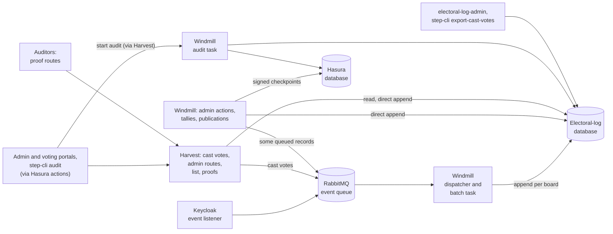
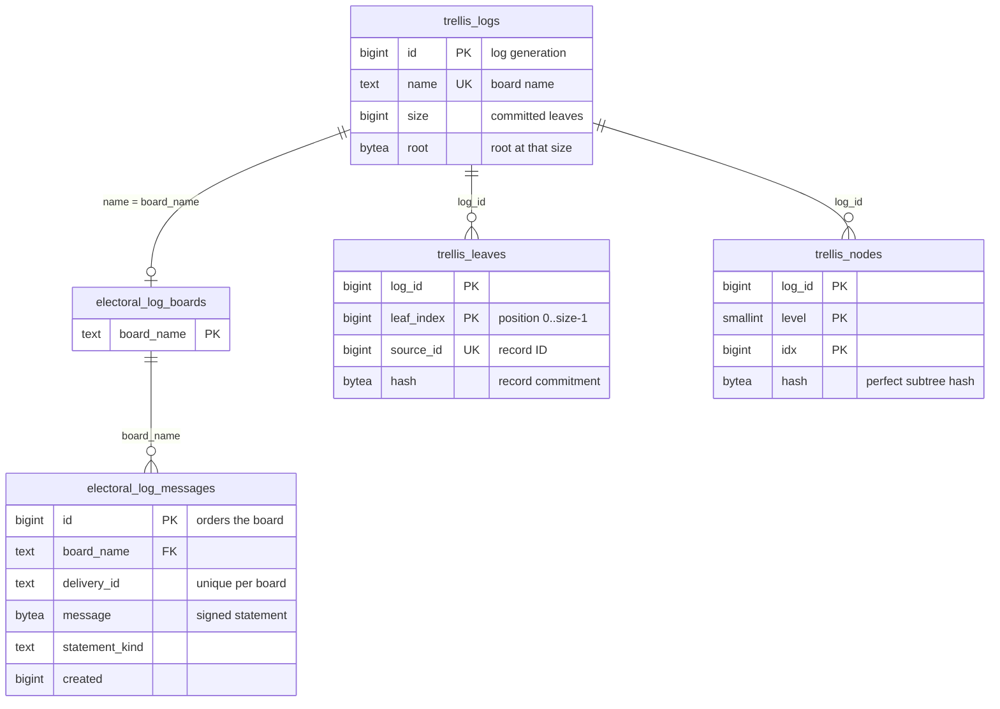
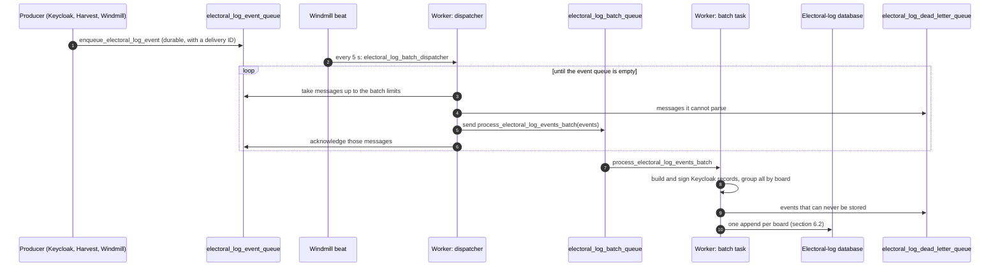
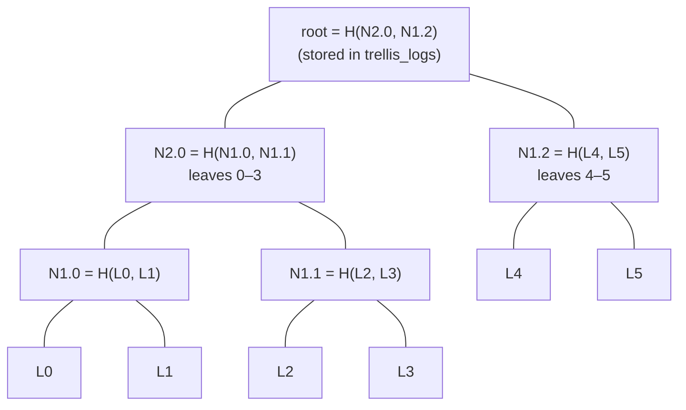
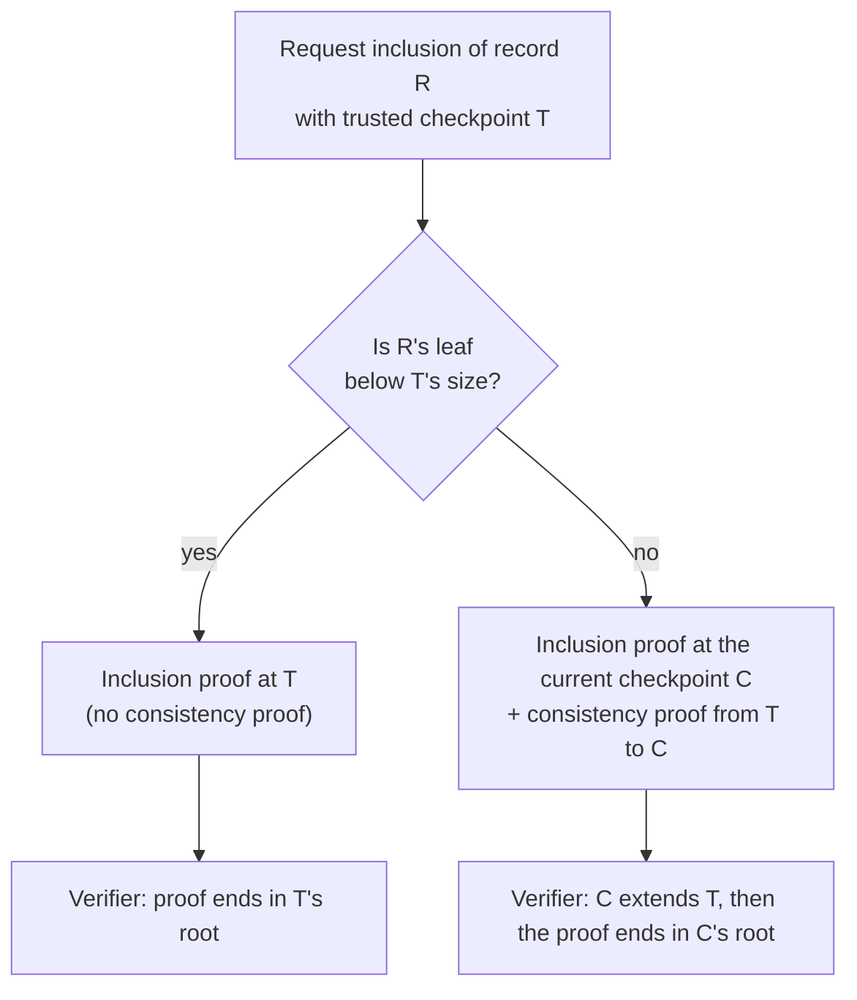
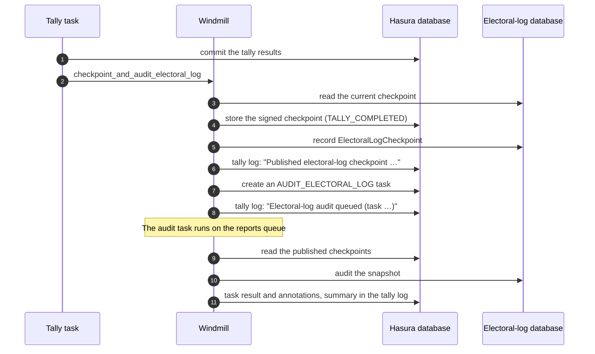

<!--
SPDX-FileCopyrightText: 2026 Sequent Tech Inc <legal@sequentech.io>
SPDX-License-Identifier: AGPL-3.0-only
-->

# Electoral log design

The electoral log is the record of what happened during an election event: voters logging in, ballots being cast, keys being generated, the election being published, voting periods opening and closing, tallies running. Administrators browse it in the admin portal and export it in reports. Voters find their cast ballot in it through the ballot locator, and auditors use it to check that nothing was changed after the fact.

This document explains how the log works and why it is built that way. It covers the whole PostgreSQL and Trellis implementation:

- how records are stored and appended;
- the Merkle tree that makes changes detectable;
- signed checkpoints, proofs and audits;
- the security model, capacity and operation.

Sections 1 to 4 give the overall picture. Sections 5 to 11 explain each mechanism in turn, and sections 12 to 18 cover security, capacity, operation, testing and the reasoning behind the design.

## 1. What the log must guarantee

Every record is a *signed statement*: a structured description of one event. Step's backend builds and signs it with keys held on the server (section 5.3). In this document, *the backend* means Windmill's workers and Harvest, which runs Windmill's library code in-process. Signatures alone do not stop someone with database access from deleting, reordering or editing stored rows, or from quietly rewriting the whole history. The design adds a Merkle tree, checkpoints and audits on top of them:

| Guarantee | How it is provided | Scope |
| --- | --- | --- |
| A record carries the signatures the backend made when it built it | Each message carries a sender signature and a system signature (section 5.3) | Step does not verify them when it reads; they can be verified offline |
| A delivery is stored once, even when queues and tasks retry it | Every record has a delivery ID that is unique per board (section 6.4) | Most direct appends get a new delivery ID when the task or request that posts them is retried, and can then be stored twice (section 6.4) |
| Records of one event have a stable order that only grows | Appends to a board are serialized, and record IDs are allocated in commit order (section 6.3) | |
| A holder of a trusted checkpoint can check that a record is in the log | Inclusion proofs against the Merkle root (section 7.6) | Proofs need `logs-read` or database access (section 9.4) |
| A holder of an earlier checkpoint can check that the log only grew since | Consistency proofs between two roots (section 7.7) | Same |
| Changes to history covered by a checkpoint kept outside the log's database are detected | Signed checkpoints are published to the Hasura database when voting closes and when a results tally completes, and auditors can keep their own copies (section 8) | Until voting closes, nothing outside the log's database covers the history, unless an auditor saved a checkpoint |
| Damage is found by audits and proofs | Audits recompute everything (section 10); checkpoint, proof and append operations check the tree's right edge (section 7.5) | Lists, counts and exports do not check, so they serve edited rows until an audit or a proof runs |

Non-goals:

- **Preventing rewrites:** the design does not *prevent* whoever controls the database from rewriting the log. It makes a rewrite *detectable*, but only against checkpoints kept elsewhere, and only for the history those checkpoints cover (section 12).
- **Completeness:** an event that was never delivered, or whose delivery failed, is not in the log, and nothing in the log shows that it is missing (sections 6.5 and 12.3).
- **ImmuDB history:** the history kept by the earlier ImmuDB store is not migrated (section 2).
- **Distributed transactions:** appends are not distributed transactions with Hasura, Keycloak or RabbitMQ (section 6.5).

## 2. Background

Election logs used to live in ImmuDB, one database per board. On `main` they now live in a dedicated PostgreSQL database on the existing PostgreSQL server, and every board is backed by a Trellis Merkle log in the same database.

- **Trellis:** a Certificate-Transparency-style Merkle log library. It was imported into `packages/trellis` from the `trellis` branch of `ruescasd/mrkl`; its provenance is in `packages/trellis/UPSTREAM.md`.
- **What did not change:** the RabbitMQ queue topology, and the signed message format apart from one new statement type, `ElectoralLogCheckpoint`.
- **What was removed:** the ImmuDB services, crates and images, the hidden pgAudit log reader and the unused `logEvent` action.
- **Breaking change:** new installations start with empty logs, and old ImmuDB boards are not imported.
- **Not used by Step:** Trellis's upstream HTTP server and source-table polling tools remain in the package behind the `upstream-service` feature, but Step does not run them.
- **Unrelated:** PostgreSQL's pgAudit session logging is independent of the electoral log and stays configured in development.

## 3. Architecture at a glance



| Component | Role |
| --- | --- |
| `packages/electoral-log` | Domain types (`ElectoralLogMessage`, `LogEntry`, `LogQuery`), the `ElectoralLogStore` port, the `BoardClient` service, the PostgreSQL adapter (`PostgresStore`), record commitments and signed-checkpoint formats (`proofs.rs`), the signed message types, the `electoral-log-admin` CLI and the `load_test` example. |
| `packages/trellis` | RFC 6962 tree arithmetic (`rfc6962.rs`) and the transactional journal (`journal.rs`) that stores leaves and subtrees and answers proofs. |
| Windmill | The library code that builds, signs and posts records (`services/electoral_log.rs`), and the workers that run the queue dispatcher and batch task, checkpoint publication, audits, reports and exports. |
| Harvest | The HTTP API. It runs Windmill's library code in-process: casting a vote builds, signs and queues its record, and administrative routes such as user management, the phone blacklist, reports and exports sign and append records directly. It also lists records, lists cast votes for the ballot locator, serves checkpoints and proofs, and starts audits. |
| Hasura | The `listElectoralLog`, `list_cast_vote_messages` and `audit_electoral_log` actions, and the `electoral_log_checkpoint` table. |
| Admin portal | The election event's Logs tab, the per-user logs dialog and the Audit button. |
| step-cli | `step-cli step audit-electoral-log` to run an audit through Hasura, and `step-cli step export-cast-votes`. |

## 4. Concepts in five minutes

- **Board:** the log of one election event. Its name is derived from the environment slug, the tenant and the event, for example `devtenant90505c8a23a94cdfaeventfdd21db2dd68497490eb7f2750b2b5df`. The backend creates it when the election event is created or imported (`upsert_b3_and_elog`), together with the event's bulletin board and protocol-manager key.
- **Record:** one row of `electoral_log_messages`. It holds the signed message bytes and copies of the metadata used to search: who, which election and area, which ballot, and when. Its database ID orders the board.
- **Delivery ID:** the identity of one delivery of an event, unique within a board. Delivering it again stores nothing new.
- **Record commitment:** a SHA-256 hash of the exact stored record, including its ID and delivery ID. It is what the Merkle tree commits to.
- **Leaf:** a record commitment placed at the next position (0, 1, 2, …) of the board's Merkle tree.
- **Merkle root:** one 32-byte hash that depends on every leaf and its position. Changing, removing or reordering any leaf changes the root.
- **Checkpoint:** a board name, a log generation, a size and the root at that size. It is a compact fingerprint of the whole history up to that size.
- **Log generation (`log_id`):** deleting and recreating a board starts a new Merkle log with a new ID. Checkpoints of the old generation never verify against the new one.
- **Inclusion proof:** a few hashes showing that a given record is leaf `i` of the tree with a given root.
- **Consistency proof:** a few hashes showing that the tree at a later checkpoint extends the tree at an earlier checkpoint without changing it.
- **Protocol-manager key:** the election event's signing key, loaded by the backend from its secret store (section 5.3). It also signs the event's bulletin-board messages. In the log it makes every record's system signature and signs published checkpoints.
- **Published checkpoint:** a checkpoint signed with the event's protocol-manager key and stored in the Hasura database, outside the log's database.
- **Audit:** a task that recomputes every commitment, the whole tree and every published checkpoint's root, and reports any difference.

## 5. Data model

### 5.1 Two databases

| Database | Holds | Owner |
| --- | --- | --- |
| Electoral log (`<client>_electoral_log` in the cloud, `electoral_log` in development) | Boards, records, leaves, subtrees, the size and root of each log | The dedicated electoral-log role |
| Hasura's database, schema `sequent_backend` | `electoral_log_checkpoint`: published checkpoints | Hasura's database role |

Keeping published checkpoints in a different database, owned by a different role, means that someone who can change only the electoral-log database cannot rewrite history that a published checkpoint covers without the audit noticing. It does not help against the backend itself, which has credentials for both databases and the key that signs checkpoints (section 12.3).

### 5.2 Tables

The schema is `packages/electoral-log/schema.sql`. It embeds the Trellis schema from `packages/trellis/schema.sql`, and a test keeps the two copies identical.



- **`trellis_logs`:** one row per log generation, with the committed size and the root at that size. Each append updates it in the same transaction as the records.
- **`electoral_log_boards`:** one row per board. Appends lock this row (section 6.3). Its foreign key to `trellis_logs` cascades, so deleting the log deletes the board.
- **`electoral_log_messages`:** the records. Every read, count, append and delete is scoped by `board_name`.
- **`trellis_leaves`:** the record commitments in position order. Positions are dense from 0, and each record appears once per log (`UNIQUE (log_id, source_id)`).
- **`trellis_nodes`:** the hashes of the tree's complete *perfect subtrees* (section 7.3), written once by the append that completes them.

### 5.3 What a record contains

| Column | Content |
| --- | --- |
| `id` | Generated by PostgreSQL; increases with commit order within a board. |
| `board_name` | The board. |
| `delivery_id` | The delivery identity (section 6.4). |
| `created` | Seconds since the epoch at which the backend built the record. For Keycloak events that is when the batch task ran, which can be seconds or more after the login or registration itself. |
| `sender_pk` | The public key of the statement's sender (see `message`). |
| `statement_timestamp` | The statement's own timestamp, set when the statement was built: for Keycloak events, also when the batch task ran. |
| `statement_kind` | The statement type, for example `CastVote`, `KeycloakUserEvent`, `ElectionPublish`, `KeyGeneration`, `TallyClose` or `ElectoralLogCheckpoint`. |
| `message` | The signed message: a borsh-encoded `Message` with the statement, the sender's signature and the system signature. It is stored byte for byte. |
| `version` | The message format version. |
| `user_id`, `username`, `election_id`, `area_id`, `ballot_id` | Optional metadata used for filtering and visibility. |

Who signs a message:

- **System signature:** the election event's protocol-manager key. Imported records keep the source event's signatures, which match the new event's key only if its keys were imported too.
- **Sender signature:** many records of an administrator's action are signed with that administrator's signing key, which the backend keeps in its secret store (`ElectoralLog::for_admin_user`). The other records, including cast votes and Keycloak events, are signed with the protocol-manager key again. A cast vote records the voter's user ID but carries no key of the voter's.
- **Where the keys are:** in the Hasura database's `sequent_backend.secret` table, encrypted with a master secret. `SECRETS_BACKEND` selects where the master secret comes from: an environment variable by default, or HashiCorp Vault or AWS Secrets Manager. Whoever has the Hasura database and the master secret can sign as any of these keys.
- **Where signing happens:** in the backend, with those keys. Harvest signs cast votes while inserting the vote, and Windmill's batch task signs Keycloak events (section 6.1); Keycloak signs nothing.
- **What is signed:** the statement only. The message's user ID, username, election, area, ballot ID, artifact and sender name are not covered by the signatures; the record commitment of section 7.2 covers them.
- **Who verifies:** nothing in Step. No component verifies message signatures when it reads, audits or proves, `electoral-log-admin` has no command for it, and only tests call `Message::verify`. An auditor who wants to verify them needs their own tooling and the protocol-manager public key, which also comes from Step.

### 5.4 Indexes

| Index | Columns | Used for |
| --- | --- | --- |
| Primary key | `id` | Lookups by ID and cursor pages |
| Unique | `board_name, delivery_id` | Idempotent appends |
| `electoral_log_board_cursor` | `board_name, id` | Pages in ID order, counts of a board |
| `electoral_log_cast_vote` | `board_name, statement_kind, election_id, id` | Ballot locator, kind filters |
| `electoral_log_voter` | `board_name, user_id, ballot_id, id` | A user's records, a voter's ballot |
| `electoral_log_created` | `board_name, created, id` | Sorting and filtering by creation time |
| `trellis_leaves` primary key / unique | `log_id, leaf_index` / `log_id, source_id` | Tree walks / finding a record's leaf |
| `trellis_nodes` primary key | `log_id, level, idx` | Proof and right-edge lookups |

Section 13 lists the queries these indexes do not cover.

### 5.5 Deleting an event

Deleting an election event deletes its board's Trellis log. The delete cascades to the board row, the records, the leaves and the subtrees. Later deliveries to that board fail instead of silently recreating it. Published checkpoints are deleted with the event in the Hasura database.

## 6. Writing: how a record is appended

### 6.1 Two ways in



- **Queued events:** these are the high-volume ones: Keycloak user events (logins, registrations, and so on) and cast votes, plus cast-vote errors and external API requests.
  - **Producers** publish them as `enqueue_electoral_log_event` messages to the durable `electoral_log_event_queue`. Windmill prefixes every queue name with `ENV_SLUG` and `_`. Keycloak's event listener publishes the raw event; it adds the same prefix only when `ENV_SLUG` is set in Keycloak's environment, and `ELECTORAL_LOG_QUEUE` and `ELECTORAL_LOG_TASK` can override its queue and task names. If they do not match Windmill's, Keycloak publishes to a queue that nothing reads. The backend publishes the other kinds as records it has already built and signed; for cast votes that happens in Harvest, after the vote is stored.
  - **Nothing consumes the event queue as a task queue.** `enqueue_electoral_log_event` does nothing when run, so a worker that consumed `electoral_log_event_queue` would acknowledge and discard every event. Only the dispatcher reads it.
  - **Dispatcher:** Windmill beat only *schedules* `electoral_log_batch_dispatcher`, every 5 seconds (`--electoral-log-interval`), on `electoral_log_beat_queue`. A worker runs it, with a 30-second time limit and no retries. It repeatedly takes messages, one `basic_get` each, until the batch holds `ELECTORAL_LOG_BATCH_SIZE` events (default 1,000) or `ELECTORAL_LOG_BATCH_MAX_BYTES` bytes of payload (default 16 MiB), sends them as one `process_electoral_log_events_batch` task to the durable `electoral_log_batch_queue`, and only then acknowledges them, until the event queue is empty. A message it cannot parse, including one without a delivery ID, goes to the dead-letter queue instead (section 6.5).
  - **Acknowledging after sending:** the events leave the event queue only after their batch task was sent. If the dispatcher stops between sending and acknowledging, the messages are delivered again and sent in a second batch, and their delivery IDs make the second append store nothing new. The batch task is sent without publisher confirms, so a broker failure at that moment can still lose a batch.
  - **The 30-second limit:** when a run reaches it, the run is cancelled and the batch it was collecting returns to the event queue unsent. A run that cannot fetch and send one batch within 30 seconds therefore never dispatches anything. With the default of 1,000 events per batch a run fetches at most 1,000 messages before sending, so this only becomes a risk with a much larger batch size or a very slow broker; it was not measured.
  - **Batch message size:** the batch travels as one RabbitMQ message. A queued cast vote takes about 3 KB in it, because its message bytes are encoded as a JSON array of numbers. The byte limit keeps a batch at about 16 MiB by default, well below the 128 MiB that RabbitMQ 3.12, used in development, accepts by default (`max_message_size`). A batch above `max_message_size` would be lost silently: the batch is sent without publisher confirms, so the dispatcher acknowledges the events without seeing the rejection, and RabbitMQ closes the worker's channel for sending tasks, so that worker cannot send any task until it restarts. This follows from the code and RabbitMQ's documented behaviour and was not reproduced. Keep `ELECTORAL_LOG_BATCH_MAX_BYTES` well below `max_message_size` (section 14.1).
  - **Batch task:** it looks up each election event and its board in Hasura, once per election event in the batch. For Keycloak events it also looks up the user's area in Keycloak, loads the protocol-manager key, also once per election event, and builds and signs the record. Events that can never be stored go to the dead-letter queue; the rest are grouped by board, and each group is appended. It acknowledges late and retries failures up to ten times (section 6.5).
- **Direct appends:** administrative events are appended directly by the backend code that performs the action, with retries and exponential backoff. These include publications, voting-period changes, key ceremonies, tally steps, password changes, secret-attribute access and checkpoint publications. Each is a single-record append, and the action waits for it (section 6.5).

### 6.2 Inside one append

`PostgresStore::append` runs one PostgreSQL transaction per board:

1. **Lock the board.** `SELECT … FROM electoral_log_boards … FOR UPDATE`. A second append to the same board waits here; appends to other boards proceed in parallel.
2. **Store records in chunks.** Up to 5,000 records at a time are inserted with one `INSERT … SELECT … FROM UNNEST(…) ORDER BY position`.
   - IDs are assigned in input order.
   - A delivery ID repeated within the chunk keeps its first copy.
   - A delivery ID already stored is skipped (`ON CONFLICT (board_name, delivery_id) DO NOTHING`).
3. **Commit to the records.** For each newly stored record, in ID order, compute its record commitment (section 7.2).
4. **Append the leaves** (`Journal::append_batch`):
   1. Lock the board's `trellis_logs` row.
   2. Read the tree's right edge and check that it produces the stored root (section 7.5).
   3. Insert the new leaves and every perfect subtree they complete.
   4. Store the new size and root.
5. **Commit.** Records, leaves, subtrees, size and root become visible together, or not at all.

Steps 2 to 4 repeat for each chunk of a large append, all within the same transaction.

### 6.3 Why appends to a board are serialized

Record IDs come from one sequence. Without the board lock, a transaction that took ID 101 could commit before one that took ID 100. An export that pages by "IDs after 101" would then never see record 100. Locking the board before allocating IDs makes commit order equal ID order within a board. Cursor-based exports and the record order in the Merkle tree can then rely on it.

The cost is that one board accepts one append at a time. Batching amortizes this: one append stores thousands of records (section 13).

### 6.4 Idempotency: delivery IDs

| Source | Delivery ID |
| --- | --- |
| Queued events | The event's delivery ID with an `:event` suffix, or `:communication` for the extra record of a send-template event. For Keycloak events the delivery ID is the original Celery message ID, which the dispatcher keeps across task retries; for Windmill's queued records, such as cast votes, it is a UUID created before queueing. |
| Direct appends | A UUID created before the first attempt, so the retries of that call reuse it. If the whole task or request is retried, it creates a new UUID, and the record can be stored twice. |
| Password changes | For voter-information letters, stored in the task execution's annotations, so a retried task reuses it; password changes made in the admin portal create a new UUID per call, like other direct appends |
| Checkpoint publications | `electoral-log-checkpoint:<log_id>:<size>`, so a size is recorded once |
| CSV imports | A new UUID per imported row |

Two different events with identical contents have different delivery IDs, so both are stored.

### 6.5 Failures and retries

What happens when something fails, from the database outwards:

- **One append is atomic.** If anything fails, including a later chunk or a malformed row in a streamed import, nothing from that append is stored.
- **Append failures in a batch are isolated per board.** A batch spanning several boards commits each board separately. When one board's append fails, the others are still appended, and the task fails so that it is retried. Retrying an already stored board stores nothing new.
- **An event that can never be stored is set aside, not its batch.** The batch task dead-letters an event whose delivery ID is missing or empty, whose tenant or election event ID is not a UUID, whose election event does not exist or has no board, whose body is malformed, whose election event has no protocol-manager key, or whose record cannot be built. It publishes the event to the durable `electoral_log_dead_letter_queue`, waits for RabbitMQ to confirm it, and stores the rest of the batch. The dispatcher does the same with a message it cannot parse, so such a message does not block the event queue. Dead-lettered messages keep the event queue's format, with the reason in a header, so they can be inspected and replayed (section 14.7).
- **A lookup failure fails the whole batch, for every board.** If looking up an election event or a user's area fails, or the protocol-manager key cannot be read or decoded, the task fails before appending anything, so that it is retried. These failures are treated as temporary; a key that can never be decoded is only set aside after the last retry.
- **A failing batch is retried for about five minutes.** The task retries up to ten times, after 1, 2, 4, 8, 16 and 32 seconds and then every 60 seconds. On the last attempt it dead-letters every event of the batch, with the error, instead of failing. Events of boards whose append succeeded are dead-lettered too; replaying them stores nothing new. Only if RabbitMQ does not confirm the dead-lettered messages either are the batch's events lost.
- **An event can be dead-lettered twice.** Dead-lettering happens before the appends, so a batch that is retried after an append failure dead-letters its bad events again. Replaying both copies stores the event at most once.
- **No transaction spans the log and Hasura, Keycloak or RabbitMQ.** A log record that fails after its action committed elsewhere does not roll the action back.
- **Queued producers do not wait for the log.** Cast votes are queued after the vote is stored, on a best-effort basis, and Keycloak's listener only logs an event it could not publish to RabbitMQ (section 12.3).
- **Direct appends do wait, and many block their action.** A failed direct append fails the action that posts it, when the action posts before it finishes. That includes opening, pausing and closing voting, scheduled changes too, and secret-attribute actions, which deliberately record the access before handing out or storing a value. So while the electoral-log database is unreachable, or a board refuses appends (section 14.6), those actions fail for that event.

## 7. Trellis: the Merkle tree

### 7.1 Why a Merkle tree

Signatures prove who said something, but they cannot reveal a deleted record or an older record that was swapped with a newer one. A Merkle tree compresses the whole ordered history into one root hash.

- **Saving a root** is enough to detect later changes to anything before it.
- **Proofs are small:** proving that one record is in a tree of 50 million leaves takes 26 hashes.
- **Growth is checkable:** proving that the tree only grew between two roots takes about as many.

### 7.2 What is hashed

Trellis follows RFC 6962, the Certificate Transparency format, byte for byte as the `ct-merkle` crate does:

```text
record commitment = SHA-256( JSON ["sequent-electoral-log-v1", board, entry] )
leaf hash         = SHA-256( 0x00 || record commitment )
node hash         = SHA-256( 0x01 || left || right )
empty tree root   = SHA-256( "" )
```

- **Record commitment:** `entry` is the record as `{"delivery_id": …, "message": {"id": …, "created": …, …}}`, with fields in declaration order and the message bytes as a JSON array of numbers. The `sequent-electoral-log-v1` tag versions this encoding: changing it requires a new tag. A golden test vector pins it.
- **What the commitment binds:** it includes the record's ID, delivery ID and board. Moving a record to another board, or swapping two records with the same content, therefore changes the tree.
- **Hash prefixes:** the `0x00` and `0x01` prefixes keep a leaf from being mistaken for an internal node.

### 7.3 A worked example: six records

Take a board with six records, whose leaf hashes are `L0` … `L5`. RFC 6962 splits `n` leaves at the largest power of two below `n`, so six leaves form a block of four and a block of two:



- **Perfect subtrees:** each `N<level>.<index>` is a perfect subtree covering leaves `[index·2^level, (index+1)·2^level)`. Once all its leaves exist it can never change, so its hash is stored once in `trellis_nodes` as `(level, idx, hash)`.
- **What is stored:** for six leaves that means `N1.0`, `N1.1`, `N1.2` and `N2.0`. In general there are `n − popcount(n)` stored subtrees, about one per leaf.
- **Right edge (decomposition):** the perfect subtrees whose concatenation is the whole tree, largest first, one per 1-bit of the size. For 6 = 4 + 2 they are `N2.0` and `N1.2`. A one-leaf part of the edge, such as `L6` in a seven-leaf tree, is read from `trellis_leaves`; larger parts are read from `trellis_nodes`.
- **Root:** the right edge folded from the right, `H(N2.0, N1.2)`, and kept in `trellis_logs.root`. When the size is a power of two the edge is a single subtree and the root is that stored node, as for eight leaves below.

### 7.4 What an append adds

Appending updates the right edge and writes only the subtrees that become complete:

| Append | New stored subtrees | Right edge afterwards | Root |
| --- | --- | --- | --- |
| Leaf 6 (7 leaves) | none | `N2.0`, `N1.2`, `L6` | `H(N2.0, H(N1.2, L6))` |
| Leaf 7 (8 leaves) | `N1.3`, `N2.1`, `N3.0` | `N3.0` | `N3.0` |

Each subtree hash is written once and never updated. The tree therefore needs no rebuilding and no in-memory state, and any number of Harvest instances read the same tree.

### 7.5 The right-edge check

Before serving a checkpoint or a proof, and before every append, the journal:

1. reads `size` and `root` from `trellis_logs`;
2. fetches the right-edge subtrees for that size;
3. folds them and checks that the result equals the stored root.

A missing or altered right-edge subtree is reported as stored data that is inconsistent (section 11), instead of being served or extended. Proof readers use one `REPEATABLE READ READ ONLY` snapshot per request, so the size, root and subtrees they see belong together.

What this check does not do:

- **It reads only the right edge**, a few rows: subtrees and, for an odd size, the last leaf. It does not read records or the other leaves, so an edited record, an edited leaf or an altered subtree away from the edge passes it. The server verifies each proof before returning it, so a proof that would use an altered subtree fails with `Corrupt` (HTTP 500) instead; the audit finds all of them.
- **Lists, counts, exports and the ballot locator do not run it.** They read `electoral_log_messages` directly and serve whatever is stored, including edited rows, until an audit or a proof shows the difference.

Proofs are read from the primary database. A lagging replica would answer for an older size.

### 7.6 Inclusion proofs

To prove that record 2 (leaf `L2`) is in the six-leaf tree, the proof lists the sibling hashes on the way from the leaf to the root, `[L3, N1.0, N1.2]`. A verifier who knows the record and the root checks:

```text
x    = H(L2, L3)        -- rebuilds N1.1
y    = H(N1.0, x)       -- rebuilds N2.0
root = H(y, N1.2)       -- must equal the trusted root
```

- **Verifier inputs:** the verifier recomputes `L2` from the record itself, using the commitment of section 7.2, so a changed record fails.
- **Proof size:** about `log₂ n` hashes. The journal first works out which subtrees the proof needs, then fetches only those, in one snapshot.
- **Historical sizes:** a proof can be produced at any earlier size, because the subtrees of an earlier tree are a subset of the stored ones.

### 7.7 Consistency proofs

To prove that the six-leaf tree extends an earlier four-leaf tree whose root `R4` was saved, the proof is `[N1.2]`. Four is a power of two, so the old tree is exactly the new tree's left block `N2.0`. The verifier uses its saved `R4` as that block and checks:

```text
R6 == H(R4, N1.2)     -- the new root is built on top of the old one
```

If any of the first four leaves had changed, the new tree's left block would not equal `R4`, and no value of `N1.2` could make the check pass without a SHA-256 collision. The general case follows RFC 6962, where the proof also lets the verifier rebuild the old root. Like an inclusion proof, it has about `log₂ n` hashes.

### 7.8 Proving against a checkpoint you trust

A proof is only as good as the root it ends in. A root that comes with the proof itself proves nothing on its own; it must be compared with a checkpoint obtained independently, such as a published checkpoint (section 8) or one an auditor saved earlier. Since the board keeps growing after a checkpoint is saved, an inclusion request can carry a `trusted_checkpoint`:



- **The trust anchor stays the same:** after verifying the second case, the verifier can keep `C` as its new trusted checkpoint.
- **Divergent checkpoints:** a `T` that is not part of the board's history is refused as divergent (HTTP 409). This covers another generation, a different root at that size, or more leaves than were ever committed.

### 7.9 Log generations

Each board maps to one row of `trellis_logs`, whose `id` is the log generation. Deleting an event deletes the generation. If the board name were used again, it would get a new `id`, and checkpoints carry `log_id`, so an old checkpoint can never be confused with the new log.

### 7.10 Logs written before subtrees were stored

Earlier builds of this feature stored leaves but not subtrees. Those logs are marked by a nonzero size with the empty-tree root. Checkpoints, proofs and appends refuse them with a "must be rebuilt" error until `electoral-log-admin backfill-nodes` recomputes their subtrees and root from the leaves. Run without `--board`, it rebuilds every such log, accepting whatever leaves are stored.

On a log that already has a root, a rebuild repairs missing or damaged subtrees, but only when the stored root is the root of the leaves or of some prefix of them. Otherwise it refuses. This guards against repairing accidental damage into a new history. It is not a defence against tampering: someone who can write the database can set the stored root to the empty-tree root, or to the root of an unchanged prefix, and the rebuild then accepts changed leaves. A "must be rebuilt" error on a log written by the current build is therefore a warning sign; audit it against published and saved checkpoints before any rebuild (section 14.6).

## 8. Checkpoints and publication

### 8.1 Checkpoint format

```text
{
  "log_name": "devtenant90505c8a23a94cdfaeventfdd21db2dd68497490eb7f2750b2b5df",
  "log_id": 7,
  "tree_size": 1234,
  "root": [159, 44, 3, …]          (32 byte values)
}
```

The JSON form, used by the API and the CLI, carries `root` as an array of byte values. The Hasura table stores it as 64 lowercase hex characters.

### 8.2 When Windmill publishes

| Moment | Reason | How |
| --- | --- | --- |
| Voting closes, once per closure that changed some channel | `VOTING_CLOSED` | Queued as the `publish_electoral_log_checkpoint` task after the closure is logged, so closing never waits for it |
| A results tally session completes and commits | `TALLY_COMPLETED` | Right after the tally's commit, followed by an audit (section 10.3) |

- **Not a seal of the voting period:** the `VOTING_CLOSED` checkpoint covers the records committed when it was taken. Cast votes and Keycloak events that were still queued at closure are appended after it. The `TALLY_COMPLETED` checkpoint covers those that were appended before the tally completed, which in practice means all of them.
- **Nothing is published before voting closes.** Until then, no checkpoint outside the electoral-log database covers the board, unless an auditor saves one (section 8.4).
- **Best effort:** a failed publication fails neither the closure nor the tally. It is logged, and for a tally it is also written to the tally session's logs.
- **No rollback:** like the closure's own log records, a publication is not undone if the closure's transaction later rolls back.
- **Initialization reports** publish nothing.

### 8.3 Signing, storing and recording a publication

1. **Read** the board's current checkpoint.
2. **Sign** the compact JSON array below with the event's protocol-manager key:

   ```text
   ["sequent-electoral-log-checkpoint-v1", log_name, log_id, tree_size, hex(root), reason]
   ```

3. **Store** it in `sequent_backend.electoral_log_checkpoint` with `tenant_id`, `election_event_id`, `board_name`, `log_id`, `tree_size`, `root`, `reason`, `signer_pk`, `signature` and `created_at`.
   - The row is unique per event, generation and size. Publishing the same size again keeps the first row.
   - If a different root was already published at that size, publication fails with "the log may have been rolled back or forked".
4. **Record** the publication in the log itself as an `ElectoralLogCheckpoint` statement, under the delivery ID `electoral-log-checkpoint:<log_id>:<size>`, so each size is recorded once.

The application only inserts into this table. Through GraphQL, the `logs-read` and `admin-user` roles can read the rows of their own tenant, and `service-account` can read every row.

### 8.4 Keeping your own copy

Published checkpoints protect against changes made only in the electoral-log database. They do not protect against someone who can also change the Hasura database or who controls the backend (section 12.3), and they cover nothing before voting closes. An auditor who wants protection that does not depend on Step's databases should copy checkpoints to storage they control, starting before or during voting if that period matters to them:

- **What to save:** the checkpoint JSON (section 8.1) and, for published ones, the signature and signer key from the table. The signer key is a base64 DER public key and the signature is base64, over the signing bytes of section 8.3. No Step tool verifies these signatures offline; the audit verifies them against the protocol-manager key.
- **How to get it:** read the table through GraphQL, call the checkpoint API (section 9.4) or run `electoral-log-admin checkpoint`. To use a table row with `electoral-log-admin`, convert it to the JSON of section 8.1: `board_name` becomes `log_name`, and the 64-character hex `root` becomes an array of 32 byte values.
- **How to use it:** later, verify records and growth against those copies (sections 7.8 and 9.5). A copy saved at a given time covers the history up to its size, so saving regularly narrows the window in which an undetected rewrite is possible.

## 9. Reading the log

### 9.1 Listing and filtering

The admin portal's Logs tab, and the logs dialog of a user, call the Hasura action `listElectoralLog`. Its Harvest route (`POST /electoral-log`) requires `logs-read`, and each page load runs the list query and a count.

- **Filters in the portal:** user ID, username, statement kind, and created and statement timestamp. A timestamp filter matches the 60 seconds starting at the entered time. The portal drops any other filter before sending the request.
  - Text filters use `LIKE` with the value as given, so a value without `%` or `_` matches exactly.
  - The Harvest route also accepts ID, sender key, ballot ID and version filters.
- **Sorting:** by ID (the default, newest first), creation time, statement timestamp, statement kind or user ID in the portal; the route also accepts username, ballot ID, sender key, version and message, and answers 500 for a field it cannot sort by. A sort always ends with the ID, so pages are stable.
- **Visibility:** the Harvest route accepts an election and areas, which limit the result to records of that election, of those areas, and to general records that have neither, and `only_with_user`, which limits it to records with a user. The `listElectoralLog` action forwards only the tenant, event, limit, offset, filter and sort, so the admin portal always sees the whole board.
- **Counts:** a count with no filter reads the board's committed size from `trellis_logs`, because each record commits with exactly one leaf. Other counts run `COUNT(*)`.
- **No integrity check:** listing and counting read the stored rows as they are (section 7.5).

### 9.2 Ballot locator

The voting portal's ballot locator calls `list_cast_vote_messages` (Harvest `POST /list-cast-vote-messages`).

- **Who can use it:** a voter with the `cast-vote` permission for the election, and only when the election event's `show_cast_vote_logs` presentation setting is `show-logs-tab`. The default is `hide-logs-tab`, and then the route answers 403. A request for a tenant other than the voter's own gets 401.
- **Without a ballot ID**, it pages through the election's `CastVote` records and counts them.
- **With a ballot ID**, it looks among the requesting voter's own cast votes for one matching it. It queries pages of 2,500 records at increasing offsets and stops at the first match, so a ballot ID that matches nothing runs one query per 2,500 cast votes of the election.
- **What it returns:** each entry has only the statement timestamp, the statement kind and the ballot ID. Harvest builds the entries from those columns without decoding the message, so the response carries no username, user ID, area, IP address, country or signed message, for the voter's own ballot or for anyone else's.
- **Sorting:** by record ID (the default, newest first), statement timestamp, statement kind or ballot ID. Harvest answers 400 to any other field, such as the username. Only the record ID order uses an index (section 13).

### 9.3 Exports and imports

| Operation | How it reads or writes |
| --- | --- |
| Activity-log CSV report | Pages of 2,500 records after the last ID seen |
| Activity-log PDF report | Batches fetched by offset, rendered in parallel |
| `step export-cast-votes` | `CastVote` records in pages of 1,000 after the last ID seen |
| `generate-logs` (Windmill tool) | Pages of 1,000 after the last ID seen |
| Election event import | Streams the CSV through one append, all or nothing, preserving the raw signed bytes |

- **Exports page in ascending ID order.** They see records committed while they run, so they are not a historical snapshot, and an event must not be deleted while its log is being exported.
- **Errors:** read or decoding errors fail the activity-log reports instead of returning partial results. `generate-logs` and `step-cli step export-cast-votes` exit with a non-zero status on any error. Both write each CSV file as `<name>.partial` and rename it only once it is complete, so a failed run removes its partial files and leaves any earlier export untouched.
- **Imports start a new history.** Imported rows get new record IDs, new delivery IDs and new leaves in the new event's board, so the source event's checkpoints and proofs do not apply to the imported board. The signed message bytes and the `created` value are taken from the CSV as given.

### 9.4 Proof API

These Harvest routes use the same JWT and `logs-read` authorization as listing; users of the super-admin tenant can name any tenant. Harvest decodes the token's claims without verifying its signature or expiry, so these checks hold only for requests that reach Harvest through a component that verifies the token (section 12.3). They are not exposed through Hasura, and no portal screen calls them, so voters cannot request proofs. An auditor with a `logs-read` token calls them over HTTP, and an operator with database access uses `electoral-log-admin` (section 9.5).

| Route (`POST`) | JSON body | Response |
| --- | --- | --- |
| `/electoral-log/checkpoint` | `tenant_id`, `election_event_id` | `{ "checkpoint": … }` |
| `/electoral-log/inclusion` | the above, `record_id`, optional `trusted_checkpoint` | The stored record (`entry`), `inclusion` and, when needed, `consistency` (section 7.8) |
| `/electoral-log/consistency` | the above, `checkpoint` | `old`, `new` and the consistency `proof` |

```text
{
  "tenant_id": "90505c8a-23a9-4cdf-a26b-4e19f6a097d5",
  "election_event_id": "fdd21db2-dd68-4974-90eb-7f2750b2b5df",
  "record_id": 42,
  "trusted_checkpoint": { "log_name": "…", "log_id": 7, "tree_size": 1234, "root": [ … ] }
}
```

| Status | Meaning | What to do |
| --- | --- | --- |
| 200 | Evidence returned | Verify it against your trusted checkpoint |
| 400 | The checkpoint names another board, or the JSON body is malformed (Rocket may answer 422 for a body that does not match) | Fix the request |
| 401 | Missing or undecodable token, missing permission, or wrong tenant | Use a token with `logs-read` for that tenant |
| 404 | Unknown board or record | Fix the request |
| 409 | The checkpoint is not in this board's history | Treat it as a possible fork or rollback; keep the checkpoint and investigate |
| 500 | Database failure, or stored data that is inconsistent | Alert operators and run an audit |

### 9.5 Command-line tools

`electoral-log-admin` (in `packages/electoral-log`) works directly on the database, using the `ELECTORAL_LOG_PG_*` variables. Its verification commands run offline.

A typical audit saves a checkpoint early, keeps it outside Step, and later checks the board against it:

```sh
# Day 1: save a checkpoint and keep it somewhere Step cannot change
electoral-log-admin checkpoint --board BOARD > saved-checkpoint.json

# Later: fetch evidence anchored in the saved checkpoint
electoral-log-admin consistency --board BOARD --checkpoint saved-checkpoint.json > consistency.json
electoral-log-admin inclusion   --board BOARD --record-id 42 --checkpoint saved-checkpoint.json > inclusion.json

# Verify offline, against the saved checkpoint; no database needed
electoral-log-admin verify-consistency --checkpoint saved-checkpoint.json --proof consistency.json
electoral-log-admin verify-inclusion   --checkpoint saved-checkpoint.json --proof inclusion.json
```

The saved checkpoint can also come from the published table (section 8.3). Verifying against a checkpoint fetched moments earlier from the same database proves only that the database is internally consistent, not that its history was kept. Likewise, an inclusion bundle fetched without `--checkpoint` verifies only against the checkpoint it carries.

Administration:

```sh
electoral-log-admin init                       # apply the schema
electoral-log-admin create-board --board BOARD
electoral-log-admin delete-board --board BOARD
electoral-log-admin audit --board BOARD [--checkpoint saved-checkpoint.json]
electoral-log-admin backfill-nodes [--board BOARD]
```

Run them from `packages/` with `cargo run -p electoral-log --bin electoral-log-admin -- <command>`.

## 10. Audits

### 10.1 What an audit checks

An audit reads one consistent snapshot of the board and checks:

1. **Records and leaves match one to one.** Every record has exactly one leaf and every leaf a record. The counts of records, leaves and the committed size are equal, and leaf positions run from 0 without gaps.
2. **Leaf order follows record order.** A leaf whose record ID is lower than the previous leaf's was moved.
3. **Every record's commitment matches its leaf.** Recomputing it from the stored row catches any edited column.
4. **The stored tree is the tree of the leaves.** Every stored subtree is recomputed and compared, the number of stored subtrees is checked, and the stored root is compared with the recomputed root.
5. **Every published checkpoint is genuine and in the history.**
   - It must name the event's board.
   - Its signer must be the event's protocol-manager key, and its signature must be valid.
   - It must belong to this log generation, and the root recomputed from the leaves at its size must equal its root.

An audit reports findings and never repairs anything. It does not verify message signatures (section 5.3), and it can only compare the published checkpoints that still exist: a deleted checkpoint row goes unnoticed (section 12.2).

### 10.2 How it runs

- **Pages, not one huge read:** records are compared with their leaves in pages of 1,000 records, and the tree is recomputed from the leaves in batches of 1,000. Each page reads only the rows after its cursor, so a full audit is linear in the board size.
- **One audit per board at a time:**
  - An audit takes a PostgreSQL advisory lock named after the board before it takes its snapshot.
  - A second audit of the same board retries every 2 seconds for up to 10 minutes, without holding a connection or a snapshot, and then fails.
- **Snapshot cost:** the audit's `REPEATABLE READ` snapshot stays open for its whole run. While it is open, PostgreSQL cannot remove superseded versions of the board's `trellis_logs` row, which every append updates. Appends running during a long audit therefore slow down gradually (section 13).

### 10.3 When audits run

| Trigger | Who | Scope |
| --- | --- | --- |
| A results tally session completes | Windmill, automatically, after publishing a `TALLY_COMPLETED` checkpoint | Database checks and every published checkpoint |
| Audit button in the event's Logs tab | Users with `electoral-log-audit` | Same |
| Hasura action `audit_electoral_log(election_event_id)` | Roles `electoral-log-audit` and `admin-user`; Harvest checks the `electoral-log-audit` permission | Same |
| `step-cli step audit-electoral-log --election-event-id ID` | A CLI user with that permission; waits for the task and prints its logs | Same |
| `electoral-log-admin audit --board BOARD` | Operators with database access | Database checks and, optionally, one checkpoint file. Signatures are not checked. |



### 10.4 Results

The audit runs as an `AUDIT_ELECTORAL_LOG` task execution.

- **Status:** a clean audit succeeds; findings or errors fail the task.
- **Task logs:** a summary line with the board, size, root and number of published checkpoints, then up to 100 findings with their total count.
- **Annotations:** `outcome` (`clean`, `findings` or `error`), `board`, `tree_size`, `root`, `findings` and `published_checkpoints`.
- **Tally logs:** for audits started by a tally, the summary also goes to the tally session's logs. The admin portal shows the task in its task widget and on the Tasks screen.

### 10.5 Cost

An audit reads the whole board: 6.3 minutes at 20 million records on the test server, roughly linear in size. It is meant for milestones and on demand, not for every request. The post-tally audit runs after voting has closed, when the board is quiet.

## 11. Errors

Journal operations distinguish four kinds of failure, so callers do not mix up "you asked for something that does not exist" with "the stored data is broken":

| Error | Meaning | Proof API | Typical cause |
| --- | --- | --- | --- |
| `NotFound` | Unknown board or record | 404 | Wrong event or record ID |
| `Diverged` | A supplied checkpoint is not in this log's history | 409 | A fork, a rollback or a restored backup, or a checkpoint of another generation |
| `Corrupt` | Stored Merkle data is inconsistent, or the log must be rebuilt | 500 | Missing or altered subtrees, a record without a leaf, or a log from an earlier build (section 7.10) |
| `Failed` | Database or other operational failure | 500 | Connectivity, timeouts |

A wrong root at the size of a supplied checkpoint is reported as `Diverged` only if the stored tree is itself consistent. If the stored subtrees do not agree with the stored root, it is `Corrupt`, because the fault is in this log.

## 12. Security model

### 12.1 Who can do what

| Actor | Can |
| --- | --- |
| Voters with `cast-vote`, when the event's `show_cast_vote_logs` is `show-logs-tab` | List the ballot IDs, timestamps and kinds of their election's cast votes, and find their own through the ballot locator (section 9.2) |
| Users with `logs-read` | List records, read their tenant's published checkpoints, request checkpoints and proofs |
| Users of the super-admin tenant with `logs-read` | Through Harvest directly, list records and request checkpoints and proofs of any tenant |
| Hasura's `admin-user` role | Read its tenant's published checkpoints |
| Users with `electoral-log-audit` | Start audits |
| Hasura's `service-account` role | Read every tenant's published checkpoints |
| Windmill | Append and read through the electoral-log role, read and write the Hasura database, load the protocol-manager and administrator signing keys from the secret store, and sign and store checkpoints |
| Harvest | The same, except that it does not publish checkpoints: it appends and reads, reads and writes the Hasura database, and loads the same keys to sign cast votes and administrative records |
| The electoral-log database role | Everything in that database, because it owns it |

`electoral-log-audit` is in the `/admin` group of the default tenant template and of the COMELEC template. Existing realms need the role added.

### 12.2 What each kind of tampering runs into

The table assumes the change is made directly in the electoral-log database, unless it says otherwise. Until an audit or a proof runs, lists, counts and exports serve the changed data (section 7.5).

| Change | Detected by |
| --- | --- |
| Editing a stored record's content or metadata | The audit's commitment check; inclusion proofs of that record fail |
| Inserting a record around the journal | The audit (record without a leaf) |
| Deleting a record | The audit (leaf without record, counts) |
| Reordering records | The audit's leaf-order check, and changed roots |
| Altering stored subtrees or the root | The right-edge check (`Corrupt`) if the change touches the edge or the root; otherwise proofs that use the subtree, and the audit |
| Rewriting records, leaves, subtrees and root consistently | Nothing inside the electoral-log database. Detected for history covered by a checkpoint kept elsewhere: the audit compares the published checkpoints in the Hasura database, and anyone verifying against a checkpoint they saved gets `Diverged`. Until such a checkpoint exists, which for published ones means until voting closes, and for history newer than the newest one, a rewrite goes undetected. |
| Rolling back or restoring an older backup | Consistency against a newer saved checkpoint fails (`Diverged`), and publishing a different root at an already published size fails |
| Appending a statement with forged content through the backend | Nothing in Step: no component verifies message signatures, and anyone with the protocol-manager key produces valid ones (section 5.3) |
| Altering a published checkpoint row in the Hasura database | The audit's signature and signer checks, unless the row is re-signed with the protocol-manager key |
| Deleting published checkpoint rows in the Hasura database | Nothing in Step. The audit checks only the rows that exist, and does not compare them with the `ElectoralLogCheckpoint` records in the log. Deleting the rows and then rewriting the log is not detected. |

### 12.3 Limits

- **The backend controls both anchors.** Windmill and Harvest each hold credentials for the electoral-log and Hasura databases and load the protocol-manager key. Whoever controls either of them, or both databases and the master secret, can rewrite the log, the published checkpoints and their signatures. Harvest is the HTTP API. Only checkpoints kept outside Step detect such a rewrite (section 8.4).
- **Harvest trusts token claims.** It decodes JWTs without verifying their signature or expiry. The permissions in section 12.1 therefore hold only when every path to Harvest verifies tokens first, as Hasura does for its actions. The proof routes are not Hasura actions, so reach them only through a gateway that verifies tokens.
- **The history before voting closes has no outside anchor** unless an auditor saved a checkpoint. The first published checkpoint is taken at voting close, so whoever controls the electoral-log database can change records of the voting period, including cast votes, consistently before then.
- **Audits and proofs show integrity, not completeness at the source.** An event that a producer never delivered is not in the log. Known gaps: Keycloak's listener logs a failed RabbitMQ publish and moves on, without retrying or using publisher confirms; cast votes are queued after the vote commits, on a best-effort basis; and dead-lettered events stay out of the log until someone replays them (section 14.7).
- **Signatures are server signatures.** They show that the backend built a statement, not that a voter or Keycloak produced it, and Step does not verify them.
- **The log holds personal data.** Records carry user IDs and usernames, and cast-vote records also the voter's area, IP address and country. Voters never receive any of it (section 9.2); section 12.1 lists who can read records.
- **The application role** is not a cryptographically enforced append-only principal. Do not grant it access to other databases.

## 13. Capacity and performance

A load test filled one board to 20 million records on a PostgreSQL server with 12 GB of memory and extrapolated to 50 million. The [load test page](02-electoral-log-load-test.md) has the method and every measurement.

- **Storage:** about 2 KB per record including indexes, about 100 GB for 50 million records.
- **Appends:** a board accepts one append at a time, so throughput per board depends on batching and on memory.
  - Batch appends ran at about 9,000 records/s at 1 million records and 1,500 records/s at 20 million. Those rates were measured inserting one record per statement; the current bulk insert was 20 to 60 % faster, and twice as fast with 0.5 ms of network latency.
  - With memory reduced to match 50 million records on that server, bulk appends ran at 1,000 to 1,800 records/s.
  - Single-record appends make about 20 round trips each, about 400 per second locally and about 90 per second with 0.5 ms of latency.
  - Keeping the message indexes (about 800 bytes per record) in memory keeps appends fast.
  - These figures cover the append only. The test called `PostgresStore` directly and did not run the batch task, which also does per-event work before appending: for each Keycloak event, a Hasura lookup, a Keycloak lookup, a protocol-manager key load and two signatures. That work was not measured, so the end-to-end rate for Keycloak events may be lower.
- **Index-backed reads stay in milliseconds:** proofs, checkpoints, the newest records, sorting by ID, creation time or user, user filters, ballot-locator pages in the default order, a voter's own-ballot lookup and cursor exports.
- **Some queries read the whole board** and take minutes at tens of millions of records:
  - sorting by statement timestamp or kind;
  - filtering by username, statement timestamp or ballot ID;
  - filtering by creation time while sorted by ID;
  - pages deep into the log;
  - counts of filtered views;
  - the PDF activity report's offset batches.
- **Not measured:** ballot-locator pages sorted by ballot ID, statement kind or statement timestamp, which sort all of the election's cast votes; own-ballot lookups for a ballot ID that matches nothing, which run one query per 2,500 cast votes (section 9.2); and ballot-locator requests with a large `limit`, which is not capped, so one request can return every cast vote of the election.
- **Audits** are linear: about 6 minutes at 20 million records. An open audit slowed concurrent single appends by about 23 % over its run.

## 14. Operating the log

### 14.1 Configuration

| Variable | Meaning |
| --- | --- |
| `ELECTORAL_LOG_PG_HOST`, `ELECTORAL_LOG_PG_PORT` | PostgreSQL server |
| `ELECTORAL_LOG_PG_USER`, `ELECTORAL_LOG_PG_PASSWORD` | The dedicated role |
| `ELECTORAL_LOG_PG_DATABASE` | The dedicated database |
| `ELECTORAL_LOG_PG_SSLMODE` | `disable`, `require` (default) or `verify-full` |
| `ELECTORAL_LOG_PG_SSLROOTCERT` | Optional CA file for `verify-full` |
| `ELECTORAL_LOG_BATCH_SIZE` | Maximum events per dispatcher batch; 1,000 when unset or empty |
| `ELECTORAL_LOG_BATCH_MAX_BYTES` | Maximum payload bytes per dispatcher batch; 16,777,216 (16 MiB) when unset or empty |
| `--electoral-log-interval` (Windmill beat flag) | Seconds between dispatcher runs; 5 by default |

- **Who reads them:** Windmill, Harvest, `electoral-log-admin`, `step export-cast-votes` and Windmill's `generate-logs` tool, which also needs `ENV_SLUG`. Harvest refuses to start without the `ELECTORAL_LOG_PG_*` variables.
- **Sizing the dispatcher batch:** a batch closes at whichever limit it reaches first; a single message larger than the byte limit still goes out as a batch of one. Any value other than a positive integer stops the worker that runs the dispatcher at startup, naming the variable. The log no longer reads the shared `DEFAULT_SQL_BATCH_SIZE`, which still sizes user exports, send-template and the cast-vote review.
  - keep `ELECTORAL_LOG_BATCH_MAX_BYTES` well below RabbitMQ's `max_message_size` (128 MiB by default in RabbitMQ 3.12), or a larger batch is lost and the worker cannot send tasks until it restarts (section 6.1);
  - a smaller `ELECTORAL_LOG_BATCH_SIZE` shortens how long one append holds a board and limits how many events one failing batch delays (section 6.5), and keeps each dispatcher run well within its 30 seconds;
  - a larger one makes fewer, bigger appends.
- **Queues:** some worker must consume `electoral_log_beat_queue` (the dispatcher) and `electoral_log_batch_queue` (batch tasks). In development one Windmill worker consumes both, together with the other queues. Audits run on `reports_queue` and voting-closed publications on `short_queue`. No worker may consume `electoral_log_event_queue`, because it would discard every event (section 6.1), or `electoral_log_dead_letter_queue`, which holds set-aside events (section 14.7); Windmill refuses to start a worker configured to consume either. All names carry the `ENV_SLUG` prefix.
- **TLS modes:** `require` encrypts without verifying the server, and `verify-full` also verifies its certificate and hostname. Mount the CA file when its issuer is not in the image's trust store. `disable` is meant for the internal development connection.
- **Connections:** each connection pool has at most eight connections and a ten-second connection timeout. Windmill uses one pool for appends, reads and audits; Harvest opens two, one for proofs and one for everything else, so up to 16 connections per Harvest instance.
- **Secrets:** no connection string or password is logged.

### 14.2 Provisioning and schema

- **Development (Compose):** on an empty data directory, the `postgres` service creates the role and database and applies the schema with `.devcontainer/postgresql/init-electoral-log.sh`. On an existing volume, refresh the service's environment and mounts, then run `docker exec postgres sh /docker-entrypoint-initdb.d/20-electoral-log.sh`. The script creates what is missing and does not rotate an existing password.
- **Cloud:** companion changes in the `gitops` repository create the password, role, database and backup grants on AWS and GCP. Apply its `client-secrets` module before `client-postgres-init`, then apply the schema as the database owner (`electoral-log-admin init`). The new-environment templates in the `beyond` repository provide the endpoint, database, role and the `electoral-log-db-credentials` ExternalSecret mapping.
- **Schema upgrades:** `init` is idempotent, so apply it with each upgrade. After upgrading a database written by an earlier build, run `backfill-nodes` before starting producers (section 7.10).

### 14.3 Backups

Back up `trellis_logs`, `trellis_leaves` and `trellis_nodes` together with the records; a backup of only some of them fails the right-edge check or the audit. Published checkpoints live in the Hasura database's backups. Restoring an older backup of the log makes it diverge from newer published checkpoints. That is expected; it is exactly what checkpoints detect.

### 14.4 Rollout from ImmuDB

This is a breaking change for deployments of `main`:

1. Stop the old log producers and drain pending tasks.
2. Deploy all producers and consumers together.
3. Create fresh election events.

Old ImmuDB boards are not imported. Keep old storage and backups until retention rules allow removing them. Switching back to an old image after new writes does not copy PostgreSQL records to ImmuDB, so that needs an explicit operational decision. Instances older than the checkpoint statements cannot decode them; do not run them against a log that has one.

### 14.5 Monitoring

| Signal | Where | Meaning |
| --- | --- | --- |
| Audit outcome `findings` or `error` | Task executions and annotations, tally logs | The board differs from its leaves, tree or published checkpoints; see section 14.6 |
| 409 or 500 from the proof API | Responses; Harvest logs only the 500s, as `Electoral-log proof operation failed` | A diverged checkpoint, or stored Merkle data that is inconsistent |
| `process_electoral_log_events_batch` errors | Windmill worker logs | A batch is failing and being retried (section 6.5) |
| `Dead-lettering an electoral-log event` or `Dead-lettering an electoral-log message` | Windmill worker logs | An event or message was set aside, with the reason (section 6.5) |
| `Dead-lettering … electoral-log events after the last retry` | Windmill worker logs | A batch failed every retry; its events are in the dead-letter queue |
| `Task process_electoral_log_events_batch[…] retries exceeded` | Windmill worker logs | A batch failed every retry and could not be dead-lettered. Its events are lost, except those of boards whose append succeeded |
| `electoral_log_dead_letter_queue` is not empty | RabbitMQ | Events wait to be inspected and replayed (section 14.7) |
| `Error appending electoral-log batch for board …` | Windmill worker logs | An append to that board failed; the other boards of the batch were appended |
| `electoral_log_event_queue` keeps growing | RabbitMQ | The dispatcher is not running or has no worker, every run reaches its 30-second limit, or it cannot publish to the dead-letter queue |
| `PRECONDITION_FAILED` and a message size error | RabbitMQ logs | A batch was larger than `max_message_size`, which the default byte limit prevents: it was lost, and the sending worker must be restarted (section 6.1) |
| `Audit event was not delivered to RabbitMQ` | Keycloak logs | A Keycloak event that will never be in the log |
| `Cannot append to Trellis log '…'` | Windmill and Harvest logs | The board's tree fails the right-edge check, or the log must be rebuilt (section 7.10). Every append to that board fails until it is repaired (section 14.6). |
| `Stored Merkle data is inconsistent` without the line above | Harvest logs, proof responses | A proof hit damaged data, such as an altered interior subtree or a record without a leaf. Appends still work; run an audit. |

### 14.6 When the log is damaged

A board whose stored tree fails the right-edge check refuses every append (section 7.5). Its direct appends fail, which also blocks actions such as opening and closing voting for that event (section 6.5). Its queued events fail too: a failing batch is retried for about five minutes and then dead-lettered (section 6.5), so they wait in the dead-letter queue until the board is repaired and they are replayed.

1. **Stop the dispatcher** to keep queued events in the durable event queue: stop Windmill beat, or the workers that consume `electoral_log_beat_queue`. That also stops the other scheduled tasks or queues those processes handle, and a batch already sent is still processed.
2. **Preserve the evidence.** Take a snapshot or backup of the electoral-log database and of the `electoral_log_checkpoint` table before changing anything. Do not run `backfill-nodes` or edit rows yet.
3. **Read the findings.** Run `electoral-log-admin audit --board BOARD --checkpoint saved-checkpoint.json`, with a checkpoint saved outside Step, and read every finding in its output. The Audit button and `step-cli step audit-electoral-log` also work, if a worker still consumes `reports_queue` after step 1; they also check the published checkpoints' signatures.
4. **Decide by what is damaged:**
   - **Only subtrees, while records, leaves and root agree with the checkpoints:** `electoral-log-admin backfill-nodes --board BOARD` recomputes the subtrees from the leaves. Run an audit afterwards.
   - **The stored root:** `backfill-nodes` refuses unless the stored root is the root of some prefix of the leaves. If the leaves agree with every published and saved checkpoint, the leaves are the evidence, and restoring the root from them is a deliberate decision; otherwise treat it as below.
   - **Records, leaves or their order, a "must be rebuilt" log written by the current build, or `backfill-nodes` refuses:** treat it as a security incident, because the stored history itself may have been changed (section 7.10). The original content can come only from a backup, and checkpoints saved outside Step show which backup still matches.
   - **A published checkpoint does not match:** compare it with checkpoints saved outside Step. A restored backup older than a published checkpoint also produces this finding (section 14.3).
5. **Account for the events.** Events of batches that failed are in the dead-letter queue (section 14.7). For events lost elsewhere, the worker logs name only the board and the error, not the events. Keycloak logs each event's details (`logEvent: details …`) and, on a separate line, the correlation ID it was published with; the stored delivery ID is that ID with `:event` or `:communication` appended. Cast votes are in Hasura's cast-vote table.
6. **Run a clean audit**, then restart the dispatcher and replay the dead-lettered events (section 14.7).

### 14.7 The dead-letter queue

`electoral_log_dead_letter_queue`, with the `ENV_SLUG` prefix, is a durable queue that no worker consumes. Each message has the format of the event queue, plus two headers:

| Header | Content |
| --- | --- |
| `x-electoral-log-stage` | `dispatcher` for a message the dispatcher could not parse, `batch` for an event the batch task set aside |
| `x-electoral-log-error` | The reason, up to 2,000 characters |

1. **Inspect.** In the RabbitMQ management UI, open the queue and use *Get messages* with *Nack message requeue true*, which leaves the messages in the queue. The body holds the event and the headers say why it was set aside.
2. **Fix the cause.** For example, restore a deleted election event, provision its protocol-manager key, or repair its board (section 14.6). Messages that can never be stored, such as malformed bodies, cannot be fixed by a replay.
3. **Replay.** Move the messages back to `electoral_log_event_queue`, for example with *Move messages* in the management UI, which needs the `rabbitmq_shovel` and `rabbitmq_shovel_management` plugins. The dispatcher picks them up on its next run. Delivery IDs make an event that was already stored store nothing new, and an event that still cannot be stored returns to the dead-letter queue.
4. **Discard** only what you have recorded and decided not to store, by purging or getting the messages with an acknowledging mode.

## 15. Testing

| What | Where | How to run |
| --- | --- | --- |
| Tree arithmetic: every root, inclusion proof and consistency proof compared byte for byte with `ct-merkle` | `packages/trellis` | `cargo test -p trellis --lib` |
| Record encoding golden vector, checkpoint signing, audit findings and annotations | `packages/electoral-log` unit tests | `cargo test -p electoral-log` |
| PostgreSQL contract tests | `packages/electoral-log/tests/postgres.rs` and the plan test in `src/adapters/postgres.rs` | `ELECTORAL_LOG_TEST_DATABASE_URL=… cargo test -p electoral-log --lib --test postgres -- --ignored --test-threads=1` |
| Windmill wiring: records written through Windmill pass an audit | Windmill `postgres_wiring_tests` | `cargo test -p windmill postgres_wiring_tests --lib -- --ignored --test-threads=1` |
| Queued events: batch limits, delivery IDs, which events are set aside, one lookup per election event, the dead-letter message format | Windmill unit tests in `tasks::electoral_log` and `services::electoral_log_dead_letter` | `cargo test -p windmill --lib -- tasks::electoral_log electoral_log_dead_letter` |
| Load and query plans at scale | `packages/electoral-log/examples/load_test.rs` | See the [load test page](02-electoral-log-load-test.md) |

The PostgreSQL contract tests cover:

- **Appends:** atomicity, including a failure after the first chunk; repeated and concurrent deliveries; a single append larger than one chunk; dense positions under 32 concurrent appends.
- **Proofs:** historical and anchored proofs; forged, future, other-generation and other-board checkpoints.
- **Integrity faults:** tampered subtrees, roots, records and leaf order; legacy logs and refused and accepted rebuilds.
- **Audits:** audits that wait for each other, and a check of the audit page's query plan that fails if one page rescans the log.
- **Queries:** isolation between boards, raw-row fidelity, visibility rules, counts and pagination.

CI runs them on PostgreSQL 16.

The voting-closed and tally-completed publications are covered by unit tests and by hand-run SQL, not by an end-to-end election run.

## 16. Design decisions

| Decision | Alternative | Consequence |
| --- | --- | --- |
| PostgreSQL instead of ImmuDB | Keep ImmuDB | The log runs on the PostgreSQL server the platform already uses, and records and their Merkle leaves commit in one transaction. |
| Store every perfect subtree | Rebuild the tree in memory in each Harvest instance, as an earlier iteration did | That iteration's review found that instances could serve different checkpoints and that lagging and diverged checkpoints were hard to tell apart. With stored subtrees, every instance serves the same checkpoint immediately, with no warm-up, background processing or state to lose, and proofs read `O(log n)` rows. |
| Check the right edge before checkpoints, proofs and appends | Trust the stored root | Damage at the edge is reported instead of being served as a proof or extended. The check reads a few rows; lists and exports skip it, and audits check everything. |
| Commit to the whole stored record, including ID and delivery ID | Commit only to the signed message | Moving, swapping or re-labelling rows also changes the tree. |
| Serialize appends per board | Allow concurrent appends | Commit order equals ID order, so cursors and the tree order are reliable. Batching recovers throughput. |
| Publish signed checkpoints to the Hasura database | Keep checkpoints only in the log database | An outside anchor that a consistent rewrite of the log database alone cannot match. It covers the history from voting close on, and it does not protect against the backend, which can write both databases. |
| Audits as task executions | A synchronous API | Audits read the whole board. Tasks report progress, survive the request and record results in one place. |
| Delivery IDs for idempotency | Content hashing | Two real events can have identical content. |

## 17. Known limitations

Security and completeness (section 12.3):

- No checkpoint outside the electoral-log database covers the board before voting closes, and deleting published checkpoint rows is not detected.
- Message signatures are made by the backend with server-held keys, and no Step component verifies them.
- Lists, counts, exports and the ballot locator serve stored rows without any integrity check.
- Keycloak events whose publish to RabbitMQ fails are only logged. Dead-lettered events stay out of the log until someone replays them, and nothing alerts on the dead-letter queue by itself.

Performance and operation:

- Several admin portal sorts, filters, counts and deep pages read the whole board; section 13 lists them, and the load test page measures the fixes that were tried.
- Appends to a board are serialized, and a large dispatcher batch holds the board for its whole transaction.
- A dispatcher run that cannot finish one batch within 30 seconds stops the event queue from draining. If `ELECTORAL_LOG_BATCH_MAX_BYTES` is set above what RabbitMQ accepts, a larger batch is lost and its worker cannot send tasks until restarted.
- Harvest does not verify JWT signatures; it relies on Hasura or a gateway to do so.
- Direct appends block their actions while the log is unavailable or a board refuses appends.
- Windmill shares one pool of eight electoral-log connections, without a wait timeout, between appends and audits.
- A long audit holds a snapshot that slows concurrent appends.
- An automatic recount that starts while an audit runs can drop the audit's summary line from the latest tally execution; the result remains on the audit task.
- The `sequent-core` WebAssembly package was not rebuilt for the new permission; the admin portal uses its own permission list.

## 18. Code map

| Path | Responsibility |
| --- | --- |
| `packages/electoral-log/src/domain.rs` | Records, queries, filters and visibility |
| `packages/electoral-log/src/ports.rs`, `service.rs` | The storage port and `BoardClient` |
| `packages/electoral-log/src/adapters/postgres.rs` | PostgreSQL store: appends, queries, counts, record proofs, audits |
| `packages/electoral-log/src/proofs.rs` | Record commitments, checkpoint signing and verification, `RecordProof` |
| `packages/electoral-log/src/messages/` | Signed message and statement types |
| `packages/electoral-log/src/bin/electoral-log-admin.rs` | Administration and offline verification CLI |
| `packages/electoral-log/examples/load_test.rs` | Load-test tool |
| `packages/electoral-log/schema.sql`, `packages/trellis/schema.sql` | Schema |
| `packages/trellis/src/rfc6962.rs` | Subtree arithmetic, roots, inclusion and consistency paths |
| `packages/trellis/src/journal.rs` | Transactional journal: appends, checks, proofs, tree audit, rebuild |
| `packages/windmill/src/tasks/electoral_log.rs` | Queue dispatcher and batch task |
| `packages/windmill/src/services/electoral_log.rs` | Producers, listing, checkpoint signing and publication |
| `packages/windmill/src/services/electoral_log_audit.rs`, `tasks/audit_electoral_log.rs`, `tasks/publish_electoral_log_checkpoint.rs` | Audits and publications |
| `packages/harvest/src/routes/electoral_log*.rs`, `voter_electoral_log.rs` | HTTP routes |
| `hasura/metadata/actions.*`, `hasura/migrations/backend-db/*electoral_log_checkpoint*` | Actions and the checkpoint table |
| `packages/admin-portal/src/components/ElectoralLogList.tsx` | Logs tab and Audit button |
| `packages/step-cli/src/commands/audit_electoral_log.rs`, `export_cast_votes.rs` | CLI commands |
