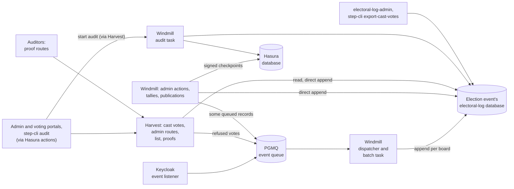
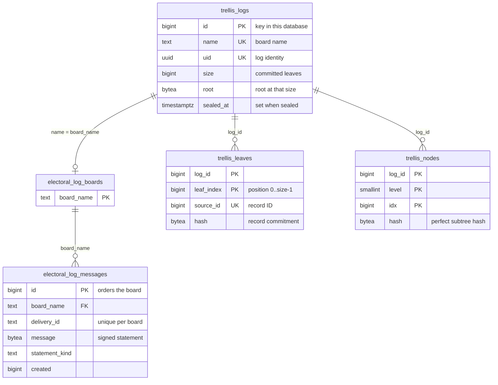
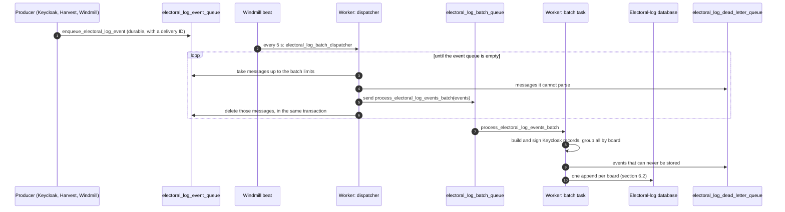
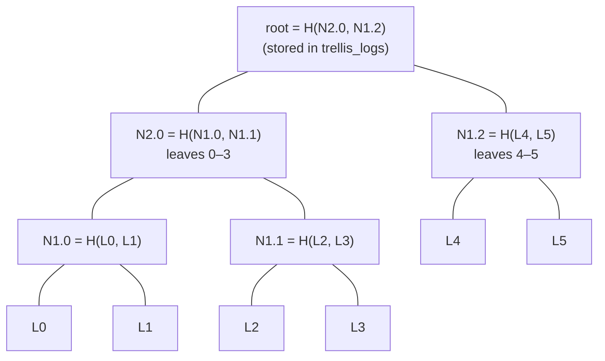
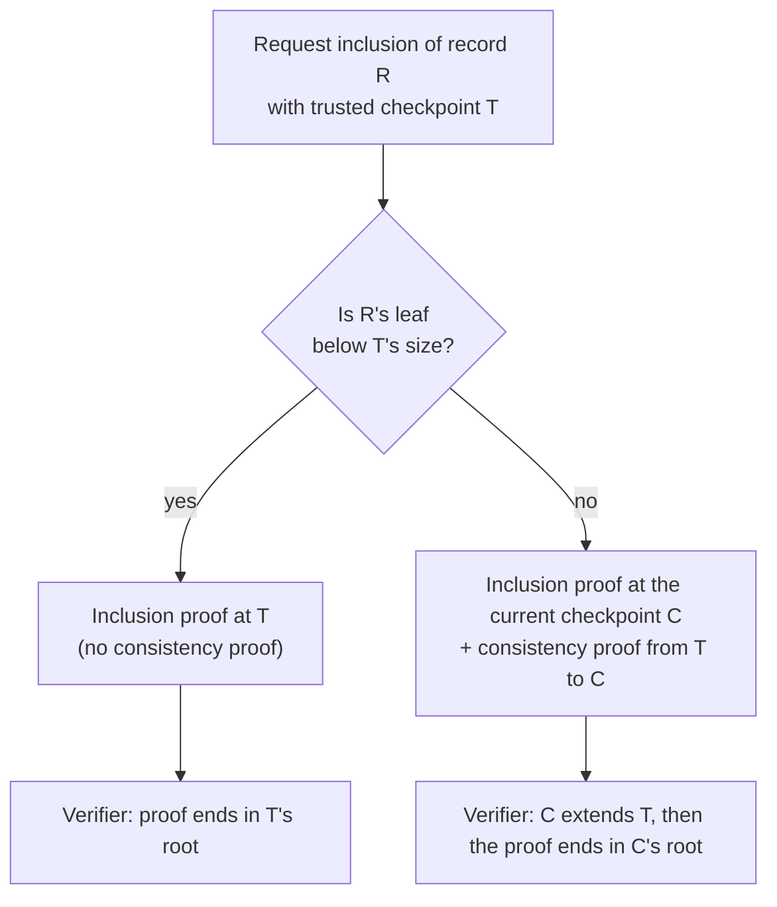
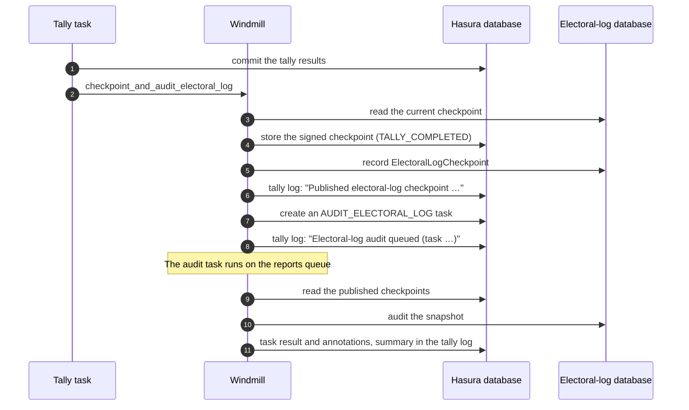

<!--
SPDX-FileCopyrightText: 2026 Sequent Tech Inc <legal@sequentech.io>
SPDX-License-Identifier: AGPL-3.0-only
-->

# Electoral log design

The electoral log is the record of what happened during an election event: voters logging in, ballots being cast, keys being generated, the election being published, voting periods opening and closing, tallies running. Administrators browse it in the admin portal and export it in reports. Voters find their cast ballot in it through the ballot locator, and auditors use it to check that nothing was changed after the fact.

This document explains how the log works and why it is built that way. It covers the whole PostgreSQL and Trellis implementation:

- how records are stored and appended;
- the Merkle tree that makes changes detectable;
- signed checkpoints, proofs and audits;
- the security model, capacity and operation.

Sections 1 to 4 give the overall picture. Sections 5 to 11 explain each mechanism in turn, and sections 12 to 18 cover security, capacity, operation, testing and the reasoning behind the design.

## 1. What the log must guarantee

Every record is a *signed statement*: a structured description of one event. Step's backend builds and signs it with keys held on the server (section 5.3). In this document, *the backend* means Windmill's workers and Harvest, which runs Windmill's library code in-process. Signatures alone do not stop someone with database access from deleting, reordering or editing stored rows, or from quietly rewriting the whole history. The design adds a Merkle tree, checkpoints and audits on top of them:

| Guarantee | How it is provided | Scope |
| --- | --- | --- |
| A record carries the signatures the backend made when it built it | Each message carries a sender signature and a system signature (section 5.3) | Step does not verify them when it reads; they can be verified offline |
| A delivery is stored once, even when queues and tasks retry it | Every record has a delivery ID that is unique per board (section 6.4) | Most direct appends get a new delivery ID when the task or request that posts them is retried, and can then be stored twice (section 6.4) |
| Records of one event have a stable order that only grows | Appends to a board are serialized, and record IDs are allocated in commit order (section 6.3) | |
| A holder of a trusted checkpoint can check that a record is in the log | Inclusion proofs against the Merkle root (section 7.6) | Proofs need `logs-read` or database access (section 9.4) |
| A holder of an earlier checkpoint can check that the log only grew since | Consistency proofs between two roots (section 7.7) | Same |
| Changes to history covered by a checkpoint kept outside the log's database are detected | Signed checkpoints are published to the Hasura database when voting opens, every few minutes while it is open, when it closes and when a results tally completes, and auditors can keep their own copies (section 8) | Records newer than the latest checkpoint, at most one interval old while voting is open, are covered by nothing outside the log's database |
| Damage is found by audits and proofs | Audits recompute everything (section 10); checkpoint, proof and append operations check the tree's right edge (section 7.5) | Lists, counts and exports do not check, so they serve edited rows until an audit or a proof runs |

Non-goals:

- **Preventing rewrites:** the design does not *prevent* whoever controls the database from rewriting the log. It makes a rewrite *detectable*, but only against checkpoints kept elsewhere, and only for the history those checkpoints cover (section 12).
- **Completeness:** an event that was never delivered, or whose delivery failed, is not in the log, and nothing in the log shows that it is missing (sections 6.5 and 12.3).
- **ImmuDB history:** the history kept by the earlier ImmuDB store is not migrated (section 2).
- **Distributed transactions:** appends are not distributed transactions with Hasura, Keycloak or the PGMQ task queues (section 6.5).

## 2. Background

Election logs used to live in ImmuDB, one database per board. They now live in PostgreSQL on the existing server, in a database per election event, and every board is backed by a Trellis Merkle log in its event's database.

- **Trellis:** a Certificate-Transparency-style Merkle log library. It was imported into `packages/trellis` from the `trellis` branch of `ruescasd/mrkl`; its provenance is in `packages/trellis/UPSTREAM.md`.
- **What did not change:** the task queues and their names, and the signed message format apart from the new statements `ElectoralLogCheckpoint` and `ElectoralLogContinuation`.
- **What was removed:** the ImmuDB services, crates and images, the hidden pgAudit log reader and the unused `logEvent` action.
- **Breaking change:** new installations start with empty logs, and old ImmuDB boards are not imported.
- **Not used by Step:** Trellis's upstream HTTP server and source-table polling tools remain in the package behind the `upstream-service` feature, but Step does not run them.
- **Unrelated:** PostgreSQL's pgAudit session logging is independent of the electoral log and stays configured in development.

## 3. Architecture at a glance



| Component | Role |
| --- | --- |
| `packages/electoral-log` | Domain types (`ElectoralLogMessage`, `LogEntry`, `LogQuery`), the `ElectoralLogStore` port, the `BoardClient` service, the PostgreSQL adapter (`PostgresStore`) and the databases of the election events (`EventDatabases`, `adapters/events.rs`), exports and imports with their roots (`adapters/transfer.rs`), record commitments and signed-checkpoint formats (`proofs.rs`), the signed message types, the `electoral-log-admin` CLI and the `load_test` example. |
| `packages/trellis` | RFC 6962 tree arithmetic (`rfc6962.rs`) and the transactional journal (`journal.rs`) that stores leaves and subtrees and answers proofs. |
| Windmill | The library code that builds, signs and posts records (`services/electoral_log.rs`), and the workers that run the queue dispatcher and batch task, checkpoint publication, audits, reports and exports. |
| Harvest | The HTTP API. It runs Windmill's library code in-process: casting a vote stores the ballot in the event's ballot box, whose sequencer appends its record later ([ballot box](03-electoral-log-ballot-box.md)), and a refused vote's record is queued. Administrative routes such as user management, the phone blacklist, reports and exports sign and append records directly. It also lists records, lists cast votes for the ballot locator, serves checkpoints and proofs, and starts audits. |
| Hasura | The `listElectoralLog`, `list_cast_vote_messages` and `audit_electoral_log` actions, and the `electoral_log_checkpoint` table. |
| Admin portal | The election event's Logs tab, the per-user logs dialog and the Audit button. |
| step-cli | `step-cli step audit-electoral-log` to run an audit through Hasura, and `step-cli step export-cast-votes`. |

## 4. Concepts in five minutes

- **Event database:** each election event's records, Merkle logs and ballot box live in a PostgreSQL database of their own, named after the event (section 5.1).
- **Board:** the log of one election event. Its name is derived from the environment slug, the tenant and the event, for example `devtenant90505c8a23a94cdfaeventfdd21db2dd68497490eb7f2750b2b5df`. The backend creates it when the election event is created or imported (`upsert_b3_and_elog`), together with the event's database, bulletin board and protocol-manager key.
- **Record:** one row of `electoral_log_messages`. It holds the signed message bytes and copies of the metadata used to search: who, which election and area, which ballot, and when. Its database ID orders the board.
- **Delivery ID:** the identity of one delivery of an event, unique within a board. Delivering it again stores nothing new.
- **Record commitment:** a SHA-256 hash of the record's log, its delivery ID and its fields, but not of where a database stores it. It is what the Merkle tree commits to.
- **Leaf:** a record commitment placed at the next position (0, 1, 2, …) of the board's Merkle tree.
- **Merkle root:** one 32-byte hash that depends on every leaf and its position. Changing, removing or reordering any leaf changes the root.
- **Checkpoint:** a board name, a log identity, a size and the root at that size. It is a compact fingerprint of the whole history up to that size.
- **Log identity (`log_uid`):** a UUID created with a board's Merkle log. A copy of the log keeps it, and deleting and recreating a board starts a new log with a new identity. Checkpoints of another log never verify against it.
- **Sealed log and continuation:** importing an election event stores the exported event's logs under their identities, with their roots, and seals them against appends. The new event's board starts with a record that commits to the exported size and root of the board it continues (section 9.3).
- **Inclusion proof:** a few hashes showing that a given record is leaf `i` of the tree with a given root.
- **Consistency proof:** a few hashes showing that the tree at a later checkpoint extends the tree at an earlier checkpoint without changing it.
- **Protocol-manager key:** the election event's signing key, loaded by the backend from its secret store (section 5.3). It also signs the event's bulletin-board messages. In the log it makes every record's system signature and signs published checkpoints.
- **Published checkpoint:** a checkpoint signed with the event's protocol-manager key and stored in the Hasura database, outside the log's database.
- **Audit:** a task that recomputes every commitment, the whole tree and every published checkpoint's root, and reports any difference.

## 5. Data model

### 5.1 Databases

| Database | Holds | Owner |
| --- | --- | --- |
| An election event's database, `<base>_<event ID as 32 hexadecimal digits>` | The event's board, the sealed logs it continues, their records, leaves and subtrees, the size and root of each log, and the event's ballot box | The dedicated electoral-log role. The provisioning role creates it |
| The base database, `ELECTORAL_LOG_PG_DATABASE` (`<client>_electoral_log` in the cloud, `electoral_log` in development) | `electoral_log_events`: the catalog of the event databases, with each event's tenant and the mark of events whose ballot boxes have work for background tasks ([ballot box](03-electoral-log-ballot-box.md), section 5) | The dedicated electoral-log role |
| Hasura's database, schema `sequent_backend` | `electoral_log_checkpoint`: published checkpoints | Hasura's database role |

- **Why a database per event:** everything a checkpoint of an event commits to is in one database, which is backed up, restored, copied and dropped with the event. An event's queries, locks, vacuum and statistics do not touch other events' data, and a console query reads one event (section 9.6).
- **Names:** an event's database is named after the base database and the event, so the base name has at most 30 bytes of lowercase letters, digits and underscores (PostgreSQL names have at most 63). The reader and backup roles are granted by name, so Windmill and Harvest refuse names that are not lowercase letters, digits and underscores before creating any database. The provisioning role creates the database, owned by the application role, which revokes `CONNECT` from `PUBLIC`, applies the schema and lets the reader role connect and read (section 14.2).
- **Separate checkpoints:** keeping published checkpoints in a different database, owned by a different role, means that someone who can change only the electoral-log databases cannot rewrite history that a published checkpoint covers without the audit noticing. It does not help against the backend itself, which has credentials for both databases and the key that signs checkpoints (section 12.3).

### 5.2 Tables

Each event's database has the schema of `packages/electoral-log/schema.sql`, which the backend applies when it creates the database. It embeds the Trellis schema from `packages/trellis/schema.sql`, and a test keeps the two copies identical. The base database's catalog is `packages/electoral-log/catalog.sql`.



- **`trellis_logs`:** one row per log, with its identity, the committed size and the root at that size. Each append updates it in the same transaction as the records. A sealed log refuses appends.
- **`electoral_log_boards`:** one row per board, sealed logs included. Appends lock this row (section 6.3). Its foreign key to `trellis_logs` cascades, so deleting the log deletes the board.
- **`electoral_log_messages`:** the records. Appends and proofs are scoped by `board_name`; lists, counts and exports of an event read every log of its database, so an imported event shows the records it continues (section 9.1).
- **`trellis_leaves`:** the record commitments in position order. Positions are dense from 0, and each record appears once per log (`UNIQUE (log_id, source_id)`).
- **`trellis_nodes`:** the hashes of the tree's complete *perfect subtrees* (section 7.3), written once by the append that completes them.

### 5.3 What a record contains

| Column | Content |
| --- | --- |
| `id` | Generated by PostgreSQL; increases with commit order within a board. |
| `board_name` | The board. |
| `delivery_id` | The delivery identity (section 6.4). |
| `created` | Seconds since the epoch at which the backend built the record. For Keycloak events that is when the batch task ran, which can be seconds or more after the login or registration itself. |
| `sender_pk` | The public key of the statement's sender (see `message`). |
| `statement_timestamp` | The statement's own timestamp, set when the statement was built: for Keycloak events, also when the batch task ran. |
| `statement_kind` | The statement type, for example `CastVote`, `KeycloakUserEvent`, `ElectionPublish`, `KeyGeneration`, `TallyClose`, `ElectoralLogCheckpoint` or `ElectoralLogContinuation`. |
| `message` | The signed message: a borsh-encoded `Message` with the statement, the sender's signature and the system signature. It is stored byte for byte. |
| `version` | The message format version. |
| `user_id`, `username`, `election_id`, `area_id`, `ballot_id` | Optional metadata used for filtering and visibility. |

Who signs a message:

- **System signature:** the election event's protocol-manager key. Imported records keep the source event's signatures, which match the new event's key only if its keys were imported too.
- **Sender signature:** many records of an administrator's action are signed with that administrator's signing key, which the backend keeps in its secret store (`ElectoralLog::for_admin_user`). The other records, including cast votes and Keycloak events, are signed with the protocol-manager key again. A cast vote records the voter's user ID but carries no key of the voter's.
- **Where the keys are:** in the Hasura database's `sequent_backend.secret` table, encrypted with a master secret. `SECRETS_BACKEND` selects where the master secret comes from: an environment variable by default, or HashiCorp Vault or AWS Secrets Manager. Whoever has the Hasura database and the master secret can sign as any of these keys.
- **Where signing happens:** in the backend, with those keys. Harvest signs cast votes while inserting the vote, and Windmill's batch task signs Keycloak events (section 6.1); Keycloak signs nothing.
- **What is signed:** the statement only. The message's user ID, username, election, area, ballot ID, artifact and sender name are not covered by the signatures; the record commitment of section 7.2 covers them.
- **Who verifies:** nothing in Step. No component verifies message signatures when it reads, audits or proves, `electoral-log-admin` has no command for it, and only tests call `Message::verify`. An auditor who wants to verify them needs their own tooling and the protocol-manager public key, which also comes from Step.

### 5.4 Indexes

| Index | Columns | Used for |
| --- | --- | --- |
| Primary key | `id` | Lookups by ID and cursor pages |
| Unique | `board_name, delivery_id` | Idempotent appends |
| `electoral_log_board_cursor` | `board_name, id` | Pages in ID order, counts of a board |
| `electoral_log_cast_vote` | `board_name, statement_kind, election_id, id` | Ballot locator, kind filters |
| `electoral_log_voter` | `board_name, user_id, ballot_id, id` | A user's records, a voter's ballot |
| `electoral_log_created` | `board_name, created, id` | Sorting and filtering by creation time |
| `trellis_leaves` primary key / unique | `log_id, leaf_index` / `log_id, source_id` | Tree walks / finding a record's leaf |
| `trellis_nodes` primary key | `log_id, level, idx` | Proof and right-edge lookups |

Section 13 lists the queries these indexes do not cover.

### 5.5 Deleting an event

Deleting an election event drops its database, with its board, the logs it continues, the records, leaves and subtrees, and its ballot box with its ballots ([ballot box](03-electoral-log-ballot-box.md), section 3.1), and removes it from the catalog. `DROP DATABASE … WITH (FORCE)` closes the connections other processes still have to it. The drop runs only once the event's deletion is committed in the Hasura database, because it cannot be rolled back: if the deletion fails, the database is kept, and if the drop fails, `electoral-log-admin drop-event-database` runs it again. When creating or importing an event fails, the database created for it is dropped, also when the failure came before it was registered in the catalog. Later deliveries to that board fail instead of silently recreating it. Published checkpoints are deleted with the event in the Hasura database.

## 6. Writing: how a record is appended

### 6.1 Two ways in



- **Queued events:** these are the high-volume ones: Keycloak user events (logins, registrations, and so on), plus voters' public keys, cast-vote errors and external API requests. Accepted ballots are not queued: the ballot box's sequencer appends their records ([ballot box](03-electoral-log-ballot-box.md)).
  - **Producers** publish them as `enqueue_electoral_log_event` messages to `electoral_log_event_queue`, in the environment's task-queue database ([Task queues](../03-development-environment/task-queues-pgmq.md)). Keycloak's event listener publishes the raw event over its own connection to that database, when Keycloak commits the request (section 12.3). `ELECTORAL_LOG_TASK` can override the task name it uses; if it does not match Windmill's, the dispatcher dead-letters its events. The backend publishes the other kinds as records it has already built and signed.
  - **Nothing consumes the event queue as a task queue.** `enqueue_electoral_log_event` does nothing when run, so a worker that consumed `electoral_log_event_queue` would acknowledge and discard every event. Only the dispatcher reads it.
  - **Dispatcher:** Windmill beat only *schedules* `electoral_log_batch_dispatcher`, every 5 seconds (`--electoral-log-interval`), on `electoral_log_beat_queue`. A worker runs it, with a 30-second time limit and no retries. It repeatedly reads messages with `pgmq.read` until the batch holds `ELECTORAL_LOG_BATCH_SIZE` events (default 1,000) or `ELECTORAL_LOG_BATCH_MAX_BYTES` bytes of payload (default 16 MiB), sends them as one `process_electoral_log_events_batch` task to `electoral_log_batch_queue` and deletes them, in one transaction, until the event queue is empty. Messages it read beyond the byte limit become visible again for the next batch. A message it cannot parse, including one without a delivery ID, goes to the dead-letter queue instead (section 6.5).
  - **One transaction per handoff:** the dispatcher reads the events with `pgmq.read`, which locks them, then enqueues the batch task, dead-letters the messages it cannot parse and deletes the events, all in one transaction of the task-queue database, whose statements time out after 10 seconds. If the run stops or any step fails, the transaction rolls back and every event stays in the event queue, so a batch is neither lost nor sent twice. The batch task's delivery IDs still make a retried append store nothing new.
  - **The 30-second limit:** when a run reaches it, the run is cancelled and the transaction of the batch it was building rolls back, so its events stay in the event queue. A run that cannot fetch and send one batch within 30 seconds therefore never dispatches anything. With the default of 1,000 events per batch a run fetches at most 1,000 messages before sending, so this only becomes a risk with a much larger batch size or a very slow task-queue database; it was not measured.
  - **Batch message size:** the batch travels as one PGMQ message, a row in the task-queue database written by the handoff transaction. A record queued by the backend takes several times its message's size in the batch's body, because its message bytes are encoded as a JSON array of numbers, and the message envelope base64-encodes that body. The byte limit keeps a batch at about 16 MiB by default. A larger limit makes each batch row and each handoff transaction bigger, but a batch that cannot be written is not lost: its transaction rolls back and its events stay in the event queue (section 14.1).
  - **Batch task:** it looks up each election event and its board in Hasura, once per election event in the batch. For Keycloak events it also looks up the user's area in Keycloak, loads the protocol-manager key, also once per election event, and builds and signs the record. Events that can never be stored go to the dead-letter queue; the rest are grouped by board, and each group is appended. It acknowledges late and retries failures up to ten times (section 6.5).
- **Direct appends:** administrative events are appended directly by the backend code that performs the action, with retries and exponential backoff. These include publications, voting-period changes, key ceremonies, tally steps, password changes, secret-attribute access and checkpoint publications. Each is a single-record append, and the action waits for it (section 6.5).

### 6.2 Inside one append

`PostgresStore::append` runs one PostgreSQL transaction per board:

1. **Lock the board.** `SELECT … FROM electoral_log_boards … FOR UPDATE`. A second append to the same board waits here; appends to other boards proceed in parallel.
2. **Store records in chunks.** Up to 5,000 records at a time are inserted with one `INSERT … SELECT … FROM UNNEST(…) ORDER BY position`.
   - IDs are assigned in input order.
   - A delivery ID repeated within the chunk keeps its first copy.
   - A delivery ID already stored is skipped (`ON CONFLICT (board_name, delivery_id) DO NOTHING`).
3. **Commit to the records.** For each newly stored record, in ID order, compute its record commitment (section 7.2).
4. **Append the leaves** (`Journal::append_batch`):
   1. Lock the board's `trellis_logs` row.
   2. Read the tree's right edge and check that it produces the stored root (section 7.5).
   3. Insert the new leaves and every perfect subtree they complete.
   4. Store the new size and root.
5. **Commit.** Records, leaves, subtrees, size and root become visible together, or not at all.

Steps 2 to 4 repeat for each chunk of a large append, all within the same transaction.

### 6.3 Why appends to a board are serialized

Record IDs come from one sequence. Without the board lock, a transaction that took ID 101 could commit before one that took ID 100. An export that pages by "IDs after 101" would then never see record 100. Locking the board before allocating IDs makes commit order equal ID order within a board. Cursor-based exports and the record order in the Merkle tree can then rely on it.

The cost is that one board accepts one append at a time. Batching amortizes this: one append stores thousands of records (section 13).

### 6.4 Idempotency: delivery IDs

| Source | Delivery ID |
| --- | --- |
| Queued events | The event's delivery ID with an `:event` suffix, or `:communication` for the extra record of a send-template event. For Keycloak events the delivery ID is the original Celery message ID, which the dispatcher keeps across task retries; for Windmill's queued records, such as cast-vote errors, it is a UUID created before queueing. |
| Direct appends | A UUID created before the first attempt, so the retries of that call reuse it. If the whole task or request is retried, it creates a new UUID, and the record can be stored twice. |
| Password changes | For voter-information letters, stored in the task execution's annotations, so a retried task reuses it; password changes made in the admin portal create a new UUID per call, like other direct appends |
| Checkpoint publications | `electoral-log-checkpoint:<log_uid>:<size>`, so a size is recorded once |
| Continuations | `electoral-log-continuation:<log_uid of the continued log>`, so an import records it once |
| Imported logs | The exported delivery IDs, which the record commitments include |
| CSV imports of older exports | A new UUID per imported row |

Two different events with identical contents have different delivery IDs, so both are stored.

### 6.5 Failures and retries

What happens when something fails, from the database outwards:

- **One append is atomic.** If anything fails, including a later chunk or a malformed row in a streamed import, nothing from that append is stored.
- **Append failures in a batch are isolated per board.** A batch spanning several boards commits each board separately. When one board's append fails, the others are still appended, and the task fails so that it is retried. Retrying an already stored board stores nothing new.
- **An event that can never be stored is set aside, not its batch.** The batch task dead-letters an event whose delivery ID is missing or empty, whose tenant or election event ID is not a UUID, whose election event does not exist or has no board, whose body is malformed, whose election event has no protocol-manager key, or whose record cannot be built. It writes the events it sets aside to `electoral_log_dead_letter_queue`, a PGMQ queue, in one transaction, and stores the rest of the batch. The dispatcher does the same with a message it cannot parse, in its handoff transaction, so such a message does not block the event queue. Dead-lettered messages keep the event queue's format, with the reason in the PGMQ message headers, so they can be inspected and replayed (section 14.7).
- **A lookup failure fails the whole batch, for every board.** If looking up an election event or a user's area fails, or the protocol-manager key cannot be read or decoded, the task fails before appending anything, so that it is retried. These failures are treated as temporary; a key that can never be decoded is only set aside after the last retry.
- **A failing batch is retried for about five minutes.** The task retries up to ten times, after 1, 2, 4, 8, 16 and 32 seconds and then every 60 seconds. On the last attempt it dead-letters every event of the batch, with the error, instead of failing. Events of boards whose append succeeded are dead-lettered too; replaying them stores nothing new. If writing them to the dead-letter queue fails too, or the batch's workers crashed or lost its lease five times, the batch's message stays in the batch queue's archive until the archive purge and can be sent again (section 14.5).
- **An event can be dead-lettered more than once.** Dead-lettering happens before the appends, so each retry of a batch after an append failure dead-letters its bad events again, and the last attempt dead-letters the whole batch. Replaying every copy stores the event at most once.
- **No transaction spans the log and Hasura, Keycloak or the task queues.** A log record that fails after its action committed elsewhere does not roll the action back.
- **Queued producers do not wait for the log.** A refused vote's record is queued after the refusal, on a best-effort basis. Keycloak's listener enqueues each event when Keycloak commits the request; with the default `fail-request` policy, an event it cannot enqueue fails the request instead of being dropped (section 12.3).
- **Direct appends do wait, and many block their action.** A failed direct append fails the action that posts it, when the action posts before it finishes. That includes opening, pausing and closing voting, scheduled changes too, and secret-attribute actions, which deliberately record the access before handing out or storing a value. So while the electoral-log database is unreachable, or a board refuses appends (section 14.6), those actions fail for that event.

## 7. Trellis: the Merkle tree

### 7.1 Why a Merkle tree

Signatures prove who said something, but they cannot reveal a deleted record or an older record that was swapped with a newer one. A Merkle tree compresses the whole ordered history into one root hash.

- **Saving a root** is enough to detect later changes to anything before it.
- **Proofs are small:** proving that one record is in a tree of 50 million leaves takes 26 hashes.
- **Growth is checkable:** proving that the tree only grew between two roots takes about as many.

### 7.2 What is hashed

Trellis follows RFC 6962, the Certificate Transparency format, byte for byte as the `ct-merkle` crate does:

```text
record commitment = SHA-256( JSON ["sequent-electoral-log-v2", board, log_uid, delivery_id,
                                   created, sender_pk, statement_timestamp, statement_kind,
                                   base64(message), version, user_id, username,
                                   election_id, area_id, ballot_id] )
leaf hash         = SHA-256( 0x00 || record commitment )
node hash         = SHA-256( 0x01 || left || right )
empty tree root   = SHA-256( "" )
```

- **Record commitment:** a compact JSON array, with the log identity as a lowercase hyphenated UUID, the message bytes in base64 with padding and absent values as `null`. The `sequent-electoral-log-v2` tag versions this encoding: changing it requires a new tag. A golden test vector pins it.
- **What the commitment binds:** the log's name and identity, the delivery ID and every field of the record. Moving a record to another log changes it, and so does any edit. Swapping two records changes the tree, since leaves are hashed with their positions.
- **What it leaves out:** the record's database ID and position. A copy of a log, with the same records in the same order under the same identity, has the same roots in any database, which is how an imported log keeps its checkpoints (section 9.3). The first format, `sequent-electoral-log-v1`, committed to the database ID and was replaced before release.
- **Hash prefixes:** the `0x00` and `0x01` prefixes keep a leaf from being mistaken for an internal node.

### 7.3 A worked example: six records

Take a board with six records, whose leaf hashes are `L0` … `L5`. RFC 6962 splits `n` leaves at the largest power of two below `n`, so six leaves form a block of four and a block of two:



- **Perfect subtrees:** each `N<level>.<index>` is a perfect subtree covering leaves `[index·2^level, (index+1)·2^level)`. Once all its leaves exist it can never change, so its hash is stored once in `trellis_nodes` as `(level, idx, hash)`.
- **What is stored:** for six leaves that means `N1.0`, `N1.1`, `N1.2` and `N2.0`. In general there are `n − popcount(n)` stored subtrees, about one per leaf.
- **Right edge (decomposition):** the perfect subtrees whose concatenation is the whole tree, largest first, one per 1-bit of the size. For 6 = 4 + 2 they are `N2.0` and `N1.2`. A one-leaf part of the edge, such as `L6` in a seven-leaf tree, is read from `trellis_leaves`; larger parts are read from `trellis_nodes`.
- **Root:** the right edge folded from the right, `H(N2.0, N1.2)`, and kept in `trellis_logs.root`. When the size is a power of two the edge is a single subtree and the root is that stored node, as for eight leaves below.

### 7.4 What an append adds

Appending updates the right edge and writes only the subtrees that become complete:

| Append | New stored subtrees | Right edge afterwards | Root |
| --- | --- | --- | --- |
| Leaf 6 (7 leaves) | none | `N2.0`, `N1.2`, `L6` | `H(N2.0, H(N1.2, L6))` |
| Leaf 7 (8 leaves) | `N1.3`, `N2.1`, `N3.0` | `N3.0` | `N3.0` |

Each subtree hash is written once and never updated. The tree therefore needs no rebuilding and no in-memory state, and any number of Harvest instances read the same tree.

### 7.5 The right-edge check

Before serving a checkpoint or a proof, and before every append, the journal:

1. reads `size` and `root` from `trellis_logs`;
2. fetches the right-edge subtrees for that size;
3. folds them and checks that the result equals the stored root.

A missing or altered right-edge subtree is reported as stored data that is inconsistent (section 11), instead of being served or extended. Proof readers use one `REPEATABLE READ READ ONLY` snapshot per request, so the size, root and subtrees they see belong together.

What this check does not do:

- **It reads only the right edge**, a few rows: subtrees and, for an odd size, the last leaf. It does not read records or the other leaves, so an edited record, an edited leaf or an altered subtree away from the edge passes it. The server verifies each proof before returning it, so a proof that would use an altered subtree fails with `Corrupt` (HTTP 500) instead; the audit finds all of them.
- **Lists, counts, exports and the ballot locator do not run it.** They read `electoral_log_messages` directly and serve whatever is stored, including edited rows, until an audit or a proof shows the difference.

Proofs are read from the primary database. A lagging replica would answer for an older size.

### 7.6 Inclusion proofs

To prove that record 2 (leaf `L2`) is in the six-leaf tree, the proof lists the sibling hashes on the way from the leaf to the root, `[L3, N1.0, N1.2]`. A verifier who knows the record and the root checks:

```text
x    = H(L2, L3)        -- rebuilds N1.1
y    = H(N1.0, x)       -- rebuilds N2.0
root = H(y, N1.2)       -- must equal the trusted root
```

- **Verifier inputs:** the verifier recomputes `L2` from the record itself, using the commitment of section 7.2, so a changed record fails.
- **Proof size:** about `log₂ n` hashes. The journal first works out which subtrees the proof needs, then fetches only those, in one snapshot.
- **Historical sizes:** a proof can be produced at any earlier size, because the subtrees of an earlier tree are a subset of the stored ones.

### 7.7 Consistency proofs

To prove that the six-leaf tree extends an earlier four-leaf tree whose root `R4` was saved, the proof is `[N1.2]`. Four is a power of two, so the old tree is exactly the new tree's left block `N2.0`. The verifier uses its saved `R4` as that block and checks:

```text
R6 == H(R4, N1.2)     -- the new root is built on top of the old one
```

If any of the first four leaves had changed, the new tree's left block would not equal `R4`, and no value of `N1.2` could make the check pass without a SHA-256 collision. The general case follows RFC 6962, where the proof also lets the verifier rebuild the old root. Like an inclusion proof, it has about `log₂ n` hashes.

### 7.8 Proving against a checkpoint you trust

A proof is only as good as the root it ends in. A root that comes with the proof itself proves nothing on its own; it must be compared with a checkpoint obtained independently, such as a published checkpoint (section 8) or one an auditor saved earlier. Since the board keeps growing after a checkpoint is saved, an inclusion request can carry a `trusted_checkpoint`:



- **The trust anchor stays the same:** after verifying the second case, the verifier can keep `C` as its new trusted checkpoint.
- **Divergent checkpoints:** a `T` that is not part of the board's history is refused as divergent (HTTP 409). This covers another log, a different root at that size, or more leaves than were ever committed.

### 7.9 Log identities

Each board maps to one row of `trellis_logs`, whose `uid` identifies the log. Deleting an event deletes the log. If the board name were used again, it would get a new identity, and checkpoints carry `log_uid`, so an old checkpoint can never be confused with the new log.

The `id` column only keys the log's leaves and subtrees in its database. Checkpoints and record commitments do not use it, so a log copied to another database under its identity, as an import does, keeps its checkpoints (section 9.3).

### 7.10 Logs written before subtrees were stored

Earlier builds of this feature stored leaves but not subtrees. Those logs are marked by a nonzero size with the empty-tree root. Checkpoints, proofs and appends refuse them with a "must be rebuilt" error until `electoral-log-admin backfill-nodes` recomputes their subtrees and root from the leaves. Run with `--election-event-id` and without `--board`, it rebuilds every such log of the event's database, accepting whatever leaves are stored.

On a log that already has a root, a rebuild repairs missing or damaged subtrees, but only when the stored root is the root of the leaves or of some prefix of them. Otherwise it refuses. This guards against repairing accidental damage into a new history. It is not a defence against tampering: someone who can write the database can set the stored root to the empty-tree root, or to the root of an unchanged prefix, and the rebuild then accepts changed leaves. A "must be rebuilt" error on a log written by the current build is therefore a warning sign; audit it against published and saved checkpoints before any rebuild (section 14.6).

## 8. Checkpoints and publication

### 8.1 Checkpoint format

```text
{
  "log_name": "devtenant90505c8a23a94cdfaeventfdd21db2dd68497490eb7f2750b2b5df",
  "log_uid": "0b6f1c7e-2a3d-4e5f-8a9b-0c1d2e3f4a5b",
  "tree_size": 1234,
  "root": [159, 44, 3, …]          (32 byte values)
}
```

The JSON form, used by the API and the CLI, carries `root` as an array of byte values. The Hasura table stores it as 64 lowercase hex characters.

### 8.2 When Windmill publishes

| Moment | Reason | How |
| --- | --- | --- |
| Voting opens, once per opening that changed some channel | `VOTING_OPENED` | Queued as the `publish_electoral_log_checkpoint` task after the opening is logged, so opening never waits for it |
| Every `ELECTORAL_LOG_CHECKPOINT_INTERVAL_SECS` seconds (300 by default) while voting is open | `PERIODIC` | The `publish_periodic_electoral_log_checkpoints` task, scheduled by Windmill beat, for each election event with voting open on any channel, for the event or one of its elections |
| Voting closes, once per closure that changed some channel | `VOTING_CLOSED` | Queued like the opening one |
| A results tally session completes and commits | `TALLY_COMPLETED` | Right after the tally's commit, followed by an audit (section 10.3) |

- **Not a seal of the voting period:** the `VOTING_CLOSED` checkpoint covers the records committed when it was taken. Ballots still waiting for the sequencer and Keycloak events still queued at closure are appended after it. The `TALLY_COMPLETED` checkpoint covers those that were appended before the tally completed, which in practice means all of them.
- **Periodic checkpoints only when the log grew.** A run skips a board with no new record since its latest checkpoint, and one whose only new record is the record of that checkpoint itself, so an idle board does not grow by one checkpoint record per interval. It compares sizes within the board's current log, and reports a board smaller than its latest checkpoint as a failure instead of publishing. A failure for one event is logged and the run continues with the others, then fails so that it shows in the worker logs.
- **The window that no checkpoint covers** is the time since the latest checkpoint: up to one interval while voting is open, plus however long the publication takes. A shorter interval narrows it at the cost of one more checkpoint record and one more Hasura row per interval for every event with open voting.
- **Best effort:** a failed publication fails neither the voting change nor the tally. It is logged, and for a tally it is also written to the tally session's logs.
- **No rollback:** like the voting change's own log records, a publication is not undone if the change's transaction later rolls back.
- **Initialization reports** publish nothing.

### 8.3 Signing, storing and recording a publication

1. **Read** the board's current checkpoint.
2. **Sign** the compact JSON array below with the event's protocol-manager key:

   ```text
   ["sequent-electoral-log-checkpoint-v2", log_name, log_uid, tree_size, hex(root), reason]
   ```

   The log identity is a lowercase hyphenated UUID. The first format, `sequent-electoral-log-checkpoint-v1`, signed the log's key in the single electoral-log database and was replaced before release.

3. **Copy** it to the write-once bucket, when copies are on (section 8.5). With the `required` policy, a failed copy fails the publication before anything is stored.
4. **Store** it in `sequent_backend.electoral_log_checkpoint` with `tenant_id`, `election_event_id`, `board_name`, `log_uid`, `tree_size`, `root`, `reason`, `signer_pk`, `signature` and `created_at`.
   - The row is unique per event, log and size. Publishing the same size again keeps the first row.
   - If a different root was already published at that size, publication fails with "the log may have been rolled back or forked".
5. **Record** the publication in the log itself as an `ElectoralLogCheckpoint` statement, whose body names the log by its identity, under the delivery ID `electoral-log-checkpoint:<log_uid>:<size>`, so each size is recorded once.

An imported event's table also holds the checkpoints published of the logs it continues, with the source event's signatures (section 9.3).

The application only inserts into this table. Through GraphQL, the `logs-read` and `admin-user` roles can read the rows of their own tenant, and `service-account` can read every row.

### 8.4 Keeping your own copy

Published checkpoints protect against changes made only in the electoral-log database. They do not protect against someone who can also change the Hasura database or who controls the backend (section 12.3), and they cover nothing newer than the latest one. An auditor who wants protection that does not depend on Step's databases should copy checkpoints to storage they control, starting before or during voting if that period matters to them:

- **What to save:** the checkpoint JSON (section 8.1) and, for published ones, the signature and signer key from the table. The signer key is a base64 DER public key and the signature is base64, over the signing bytes of section 8.3. No Step tool verifies these signatures offline. The audit verifies those of the event's own logs against its protocol-manager key, and those of the logs an imported event continues against the key they name (section 11).
- **How to get it:** read the table through GraphQL, call the checkpoint API (section 9.4) or run `electoral-log-admin checkpoint`. To use a table row with `electoral-log-admin`, convert it to the JSON of section 8.1: `board_name` becomes `log_name`, and the 64-character hex `root` becomes an array of 32 byte values.
- **How to use it:** later, verify records and growth against those copies (sections 7.8 and 9.5). A copy saved at a given time covers the history up to its size, so saving regularly narrows the window in which an undetected rewrite is possible.

### 8.5 Write-once copies

Windmill can also write every publication to an S3 bucket with Object Lock, where no one, the backend included, can change or delete it until its retention ends. The audit compares those copies with the table, so deleting or changing a published row is detected.

- **Object:** `tenant-<tenant>/event-<event>/log-<log_uid>/size-<tree_size, 20 digits>.json`, holding the published row as JSON: `board_name`, `log_uid`, `tree_size`, `root`, `reason`, `signer_pk` and `signature`. It is written with the configured lock mode and a retention of `ELECTORAL_LOG_CHECKPOINT_RETENTION_DAYS` from the moment of writing.
- **Policy** (`ELECTORAL_LOG_CHECKPOINT_COPY`):

  | Value | Publication | Audit |
  | --- | --- | --- |
  | `off` (default) | No copy | Does not look for copies |
  | `best-effort` | A failed copy is logged and the publication goes ahead | Reports the checkpoint without a copy |
  | `required` | A failed copy fails the publication; nothing is stored | Same checks |

- **Lock mode** (`ELECTORAL_LOG_CHECKPOINT_LOCK_MODE`): `compliance` (default) lets no one delete a copy or shorten its retention, not even the account's root user. `governance` lets users allowed to bypass governance retention delete copies; it is meant for development, whose configuration uses it with a one-day retention.
- **The bucket:** `ELECTORAL_LOG_CHECKPOINT_BUCKET`, `electoral-log-checkpoints` by default, at the S3 endpoint Windmill uses for documents. Windmill creates it with Object Lock if it does not exist, and refuses to copy into a bucket without Object Lock. In production, create it beforehand. Windmill needs to put objects with retention, read objects and their versions, list object versions and read the bucket's Object Lock configuration.
- **What the audit checks** (section 10.1): it reads every version of every copy of the event, not only the latest. It reports:
  - a delete marker, left by an attempt to delete a copy;
  - a copy overwritten with a different root;
  - a copy without a published row, because the row was deleted;
  - a row that differs from its copy;
  - a row without a copy;
  - a copy that is malformed or stored under another size's key.

  Every copy then goes through the same signature, signer and history checks as the rows. If the bucket cannot be read, the audit reports that as a finding.
- **What it does not cover:** a backend that stops writing copies leaves new checkpoints without them, which the audit reports while their rows exist. History newer than the latest copy has no write-once anchor. The audit itself runs in the backend, so to rely on the copies without trusting it, give auditors read access to the bucket and compare them with the log yourself (section 8.4).

## 9. Reading the log

### 9.1 Listing and filtering

The admin portal's Logs tab, and the logs dialog of a user, call the Hasura action `listElectoralLog`. Its Harvest route (`POST /electoral-log`) requires `logs-read`, and each page load runs the list query and a count.

- **Filters in the portal:** user ID, username, statement kind, and created and statement timestamp. A timestamp filter matches the 60 seconds starting at the entered time. The portal drops any other filter before sending the request.
  - Text filters use `LIKE` with the value as given, so a value without `%` or `_` matches exactly.
  - The Harvest route also accepts ID, sender key, ballot ID and version filters.
- **Sorting:** by ID (the default, newest first), creation time, statement timestamp, statement kind or user ID in the portal; the route also accepts username, ballot ID, sender key, version and message, and answers 500 for a field it cannot sort by. A sort always ends with the ID, so pages are stable.
- **Visibility:** the Harvest route accepts an election and areas, which limit the result to records of that election, of those areas, and to general records that have neither, and `only_with_user`, which limits it to records with a user. The `listElectoralLog` action forwards only the tenant, event, limit, offset, filter and sort, so the admin portal always sees the whole board.
- **Which logs:** an event's list and count cover every log of its database: its board and, after an import, the sealed logs the board continues, so the Logs tab shows an imported event's whole history. A board name that is not in the event's database, such as another tenant's name for the same event, reads nothing.
- **Counts:** a count with no filter adds the committed sizes of the logs from `trellis_logs`, because each record commits with exactly one leaf. Other counts run `COUNT(*)`.
- **No integrity check:** listing and counting read the stored rows as they are (section 7.5).

### 9.2 Ballot locator

The voting portal's ballot locator calls `list_cast_vote_messages` (Harvest `POST /list-cast-vote-messages`).

- **Who can use it:** a voter with the `cast-vote` permission for the election, and only when the election event's `show_cast_vote_logs` presentation setting is `show-logs-tab`. The default is `hide-logs-tab`, and then the route answers 403. A request for a tenant other than the voter's own gets 401.
- **Without a ballot ID**, it pages through the election's `CastVote` records and counts them.
- **With a ballot ID**, it looks among the requesting voter's own cast votes for one matching it. It queries pages of 2,500 records at increasing offsets and stops at the first match, so a ballot ID that matches nothing runs one query per 2,500 cast votes of the election.
- **What it returns:** each entry has only the statement timestamp, the statement kind and the ballot ID. Harvest builds the entries from those columns without decoding the message, so the response carries no username, user ID, area, IP address, country or signed message, for the voter's own ballot or for anyone else's.
- **Sorting:** by record ID (the default, newest first), statement timestamp, statement kind or ballot ID. Harvest answers 400 to any other field, such as the username. Only the record ID order uses an index (section 13).

### 9.3 Exports and imports

| Operation | How it reads or writes |
| --- | --- |
| Activity-log CSV report | Pages of 2,500 records after the last ID seen |
| Activity-log PDF report | Batches fetched by offset, rendered in parallel |
| `step export-cast-votes` | `CastVote` records in pages of 1,000 after the last ID seen |
| `generate-logs` (Windmill tool) | Pages of 1,000 after the last ID seen |
| Election event export, with activity logs | The CSV report, and the logs with their roots: `electoral_log_records-<event>.jsonl` and `electoral_log_manifest-<event>.json` |
| Election event import | Stores the exported logs with their roots, sealed, and continues them with the new event's board; an export without the logs' files is streamed from the CSV through one append to the new board |

- **Exports page in ascending ID order.** They see records committed while they run, so they are not a historical snapshot, and an event must not be deleted while its log is being exported. The logs' records, sizes and roots are the exception: they come from one `REPEATABLE READ` snapshot of the event's database. The published checkpoints are read from the Hasura database afterwards, and those beyond a log's exported size are left out.
- **Errors:** read or decoding errors fail the activity-log reports instead of returning partial results. `generate-logs` and `step-cli step export-cast-votes` exit with a non-zero status on any error. Both write each CSV file as `<name>.partial` and rename it only once it is complete, so a failed run removes its partial files and leaves any earlier export untouched.

**Moving an event with its roots.** An election event's export carries what its checkpoints commit to:

- **Records file:** one JSON object per line, for every log of the event's database in log order, sealed logs first: the log's name and identity, the delivery ID and every field of the record, with the signed message in base64.
- **Manifest:** the format (`sequent-electoral-log-export-v1`), the event, and each log's checkpoint when exported, its state and the checkpoints published of it, with their signatures.

The import stores each log under its name and identity in the new event's database, in one transaction:

1. It refuses a log already in the database and a published checkpoint whose signature does not verify with the key it names.
2. It appends the records in order. The record commitments do not depend on the database (section 7.2), so the leaves are those of the export.
3. It refuses the export if it leaves out what the records commit to: every `ElectoralLogCheckpointV2` record of a log about itself must be among the log's published checkpoints, with the same root, and every log after the first must hold an `ElectoralLogContinuation` record committing to the name, identity, size and root of the log before it.
4. It recomputes the tree and refuses the logs unless the root at the exported size, at the size of every published checkpoint, and at the size of every checkpoint this environment published of the log itself (its *anchors*: rows of `electoral_log_checkpoint` of the event the log is the board of, up to the exported size) equals theirs. A changed, missing, repeated or reordered record therefore stores nothing.
5. It seals the logs, so they take no more records.

The import then stores the published checkpoints for the new event, with the source event's signatures, and starts the new event's board with an `ElectoralLogContinuation` record that commits to the name, identity, size and root of the board it continues, as exported. A proof of an imported record verifies against a checkpoint published or saved before the export, and the new event's checkpoints cover the continuation. Exporting the new event carries its board and every log it continues, so a chain of imports keeps the whole history.

- **What it does not prove:** the source checkpoints' signatures are checked against the keys they name, not against a key the importer trusts, which only the source environment or a copy kept by an auditor can provide (section 8.4). An export from another environment can therefore be rewritten consistently, records, roots, checkpoints and signatures together, and only the anchors of an import in the source environment, or checkpoints held outside it, show it. Records exported after the board's last published checkpoint are covered by the exported root alone, which the import recomputes but no source signature vouches for.
- **Older exports** without the logs' files are imported from the activity-log CSV: the rows get new record IDs, delivery IDs and leaves in the new event's board, so the source event's checkpoints and proofs do not apply to them. The signed message bytes and the `created` value are taken from the CSV as given.

### 9.4 Proof API

These Harvest routes use the same JWT and `logs-read` authorization as listing; users of the super-admin tenant can name any tenant. Harvest decodes the token's claims without verifying its signature or expiry, so these checks hold only for requests that reach Harvest through a component that verifies the token (section 12.3). They are not exposed through Hasura, and no portal screen calls them, so voters cannot request proofs. An auditor with a `logs-read` token calls them over HTTP, and an operator with database access uses `electoral-log-admin` (section 9.5).

| Route (`POST`) | JSON body | Response |
| --- | --- | --- |
| `/electoral-log/checkpoint` | `tenant_id`, `election_event_id`, optional `log_name` | `{ "checkpoint": … }` |
| `/electoral-log/inclusion` | the above, `record_id`, optional `trusted_checkpoint` | The stored record (`entry`), `inclusion` and, when needed, `consistency` (section 7.8) |
| `/electoral-log/consistency` | the above, `checkpoint` | `old`, `new` and the consistency `proof` |

```text
{
  "tenant_id": "90505c8a-23a9-4cdf-a26b-4e19f6a097d5",
  "election_event_id": "fdd21db2-dd68-4974-90eb-7f2750b2b5df",
  "record_id": 42,
  "trusted_checkpoint": { "log_name": "…", "log_uid": "0b6f1c7e-…", "tree_size": 1234, "root": [ … ] }
}
```

The routes read the event's board unless `log_name` names another log of the event's database: after an import, a sealed log that the board continues. Either way the event's board must be in the database, named after the requesting tenant.

| Status | Meaning | What to do |
| --- | --- | --- |
| 200 | Evidence returned | Verify it against your trusted checkpoint |
| 400 | The checkpoint names another board, or the JSON body is malformed (Rocket may answer 422 for a body that does not match) | Fix the request |
| 401 | Missing or undecodable token, missing permission, or wrong tenant | Use a token with `logs-read` for that tenant |
| 404 | Unknown board or record | Fix the request |
| 409 | The checkpoint is not in this board's history | Treat it as a possible fork or rollback; keep the checkpoint and investigate |
| 500 | Database failure, or stored data that is inconsistent | Alert operators and run an audit |

### 9.5 Command-line tools

`electoral-log-admin` (in `packages/electoral-log`) works directly on the databases, using the `ELECTORAL_LOG_PG_*` variables. A board's commands read the database of the election event its name ends with, or of `--election-event-id`, which a sealed log of an imported event needs. Its verification commands run offline.

A typical audit saves a checkpoint early, keeps it outside Step, and later checks the board against it:

```sh
# Day 1: save a checkpoint and keep it somewhere Step cannot change
electoral-log-admin checkpoint --board BOARD > saved-checkpoint.json

# Later: fetch evidence anchored in the saved checkpoint
electoral-log-admin consistency --board BOARD --checkpoint saved-checkpoint.json > consistency.json
electoral-log-admin inclusion   --board BOARD --record-id 42 --checkpoint saved-checkpoint.json > inclusion.json

# Verify offline, against the saved checkpoint; no database needed
electoral-log-admin verify-consistency --checkpoint saved-checkpoint.json --proof consistency.json
electoral-log-admin verify-inclusion   --checkpoint saved-checkpoint.json --proof inclusion.json
```

The saved checkpoint can also come from the published table (section 8.3). Verifying against a checkpoint fetched moments earlier from the same database proves only that the database is internally consistent, not that its history was kept. Likewise, an inclusion bundle fetched without `--checkpoint` verifies only against the checkpoint it carries.

Administration:

```sh
electoral-log-admin init                       # create the catalog in the base database
electoral-log-admin create-event-database --tenant-id TENANT --election-event-id EVENT
electoral-log-admin drop-event-database --tenant-id TENANT --election-event-id EVENT
electoral-log-admin upgrade-event-databases [--election-event-id EVENT]
electoral-log-admin list-event-databases
electoral-log-admin logs --election-event-id EVENT
electoral-log-admin create-board --board BOARD
electoral-log-admin delete-board --board BOARD
electoral-log-admin audit --board BOARD [--checkpoint saved-checkpoint.json]
electoral-log-admin backfill-nodes --election-event-id EVENT [--board BOARD]
```

Run them from `packages/` with `cargo run -p electoral-log --bin electoral-log-admin -- <command>`.

### 9.6 Console

The admin portal's **Electoral Log** page (`/electoral-log-console`) lets administrators browse an election event's records and ballot box and open a record. Nothing in the console writes. Administrators browse their own tenant's events; users of the super-admin tenant choose the tenant, and they alone run SQL queries on an election event's database.

| Action (Harvest route) | Permissions | Returns |
| --- | --- | --- |
| `electoral_log_console_page` (`POST /electoral-log-console/page`) | `electoral-log-console-read` | A page of a table |
| `electoral_log_console_record` (`POST /electoral-log-console/record`) | `electoral-log-console-read` | One record with its message decoded |
| `electoral_log_console_tenants` (`POST /electoral-log-console/tenants`) | `electoral-log-console-read`, in the super-admin tenant | Every tenant with its election events and their elections |
| `electoral_log_console_query` (`POST /electoral-log-console/query`) | `electoral-log-console-query` and `electoral-log-personal-data-read`, in the super-admin tenant | Up to 1,000 rows, and 10 MiB, of a read-only query on the database of the `election_event_id` of `tenant_id`, or the server's error |

- **Tenants:** pages and records read the user's own tenant unless the request names another with `tenant_id`, which only users of the super-admin tenant (`SUPER_ADMIN_TENANT_ID`) may do. Harvest checks that the election event belongs to that tenant. The super-admin tenant cannot list other tenants' events through Hasura, so the portal reads them from `electoral_log_console_tenants`.

- **Tables:** `records` (the event's `electoral_log_messages`, with the board name of each record's log in `log`), `ballots` (the event's `ballot_box_ballot` rows, with the content's size instead of the content), `voters` (`ballot_box_voter`) and `queue` (the ballots in `ballot_box_pending`, with their election, area and acceptance time). Events that keep the `cast_vote` table have empty `ballots`, `voters` and `queue` tables.
- **Paging by key:** a page has at most 200 rows, newest or oldest first by the table's key: `id` for records, `seq` for ballots and the queue, election and voter for voters. It answers with the key of its last row as `next`, and the next page starts after it, so no page reads the rows before it. The portal moves forward one page at a time and back through the pages it has read; it cannot jump to a page number.
- **Filters:** kind, election, user, ballot ID and creation time for records; election, area, voter, ballot ID, status and acceptance time for ballots; election, area and voter for voters; election and area for the queue. Harvest ignores the filters a table does not have. A filter that matches few rows can make a page read many rows in key order before it fills.
- **Row counts:** each page reports the table's rows for the event before filters: the committed sizes of its logs for records, and for the ballot box the planner's estimate of the event's partition (`pg_class.reltuples`), or a count while the partition has never been analyzed.
- **Records:** the record dialog decodes the signed message into JSON, as the Logs tab does, except that the artifact shows as its size in bytes, and hashes and other byte arrays of 16 bytes or more as hexadecimal.
- **Personal data:** usernames and voters' IP addresses and countries. Without `electoral-log-personal-data-read`, pages show `hidden` in the `username`, `voter_ip` and `voter_country` columns, and records show `hidden` for every `username` and for the cast votes' `ip: …` and `country: …` values.
- **Queries** read one election event's database, chosen with its tenant on the Query tab, so a query cannot join several events. Only users of the super-admin tenant run them; Harvest checks that the event belongs to the tenant. Without the reader role, the console answers that queries are not available.
  - Harvest connects to the event's database as `ELECTORAL_LOG_PG_READER_USER`, a role with `CONNECT` and `SELECT` on each event's database and nothing else, on a connection of its own that closes after the query. The query runs in a `READ ONLY` transaction with a 30-second `statement_timeout`, which Harvest rolls back.
  - Harvest wraps the query as `SELECT left(row_to_json(q)::text, …) FROM (…) q LIMIT 1001`, so only a statement that can be a subquery runs: `SELECT`, `VALUES`, `TABLE`, or `WITH` without data-modifying statements. It accepts up to 20,000 characters and fetches the rows through a cursor, 100 at a time, up to 1,000 rows or 10 MiB of JSON, saying when there were more.
  - A query reads personal data as stored, which is why it also needs `electoral-log-personal-data-read`.
  - Harvest logs each query with the user, their tenant and the queried tenant and event at INFO level. Queries are not recorded in the electoral log.
- **Export:** the portal writes CSV in the browser: the current page of a table, or all the rows a query returned.

## 10. Audits

### 10.1 What an audit checks

An audit reads one consistent snapshot of the board and checks:

1. **Records and leaves match one to one.** Every record has exactly one leaf and every leaf a record. The counts of records, leaves and the committed size are equal, and leaf positions run from 0 without gaps.
2. **Leaf order follows record order.** A leaf whose record ID is lower than the previous leaf's was moved.
3. **Every record's commitment matches its leaf.** Recomputing it from the stored row catches any edited column.
4. **The stored tree is the tree of the leaves.** Every stored subtree is recomputed and compared, the number of stored subtrees is checked, and the stored root is compared with the recomputed root.
5. **Every published checkpoint is genuine and in the history.**
   - It must name the event's board.
   - Its signer must be the event's protocol-manager key, and its signature must be valid.
   - It must belong to this log, and the root recomputed from the leaves at its size must equal its root.
6. **Write-once copies match the published checkpoints**, when copies are on (section 8.5). Every version of every copy also goes through the checks of item 5.
7. **The logs an imported board continues** go through checks 1 to 5 too, each against the checkpoints published of it before the export, whose signatures must verify with the key they name: the source event's key, which this environment cannot vouch for. They must be sealed, and a published checkpoint that names a log the event's database does not hold is a finding.

An audit reports findings and never repairs anything. It does not verify message signatures (section 5.3). Without write-once copies it can only compare the published checkpoints that still exist, so a deleted checkpoint row goes unnoticed (section 12.2).

### 10.2 How it runs

- **Pages, not one huge read:** records are compared with their leaves in pages of 1,000 records, and the tree is recomputed from the leaves in batches of 1,000. Each page reads only the rows after its cursor, so a full audit is linear in the board size.
- **One audit per board at a time:**
  - An audit takes a PostgreSQL advisory lock named after the board before it takes its snapshot.
  - A second audit of the same board retries every 2 seconds for up to 10 minutes, without holding a connection or a snapshot, and then fails.
- **Snapshot cost:** the audit's `REPEATABLE READ` snapshot stays open for its whole run. While it is open, PostgreSQL cannot remove superseded versions of the board's `trellis_logs` row, which every append updates. Appends running during a long audit therefore slow down gradually (section 13).

### 10.3 When audits run

| Trigger | Who | Scope |
| --- | --- | --- |
| A results tally session completes | Windmill, automatically, after publishing a `TALLY_COMPLETED` checkpoint | Database checks and every published checkpoint |
| Audit button in the event's Logs tab | Users with `electoral-log-audit` | Same |
| Hasura action `audit_electoral_log(election_event_id)` | Roles `electoral-log-audit` and `admin-user`; Harvest checks the `electoral-log-audit` permission | Same |
| `step-cli step audit-electoral-log --election-event-id ID` | A CLI user with that permission; waits for the task and prints its logs | Same |
| `electoral-log-admin audit --board BOARD` | Operators with database access | Database checks and, optionally, one checkpoint file. Signatures are not checked. |



### 10.4 Results

The audit runs as an `AUDIT_ELECTORAL_LOG` task execution.

- **Status:** a clean audit succeeds; findings or errors fail the task.
- **Task logs:** a summary line with the board, size, root and number of published checkpoints, then up to 100 findings with their total count.
- **Annotations:** `outcome` (`clean`, `findings` or `error`), `board`, `tree_size`, `root`, `findings` and `published_checkpoints`.
- **Tally logs:** for audits started by a tally, the summary also goes to the tally session's logs. The admin portal shows the task in its task widget and on the Tasks screen.

### 10.5 Cost

An audit reads the whole board: 6.3 minutes at 20 million records on the test server, roughly linear in size. It is meant for milestones and on demand, not for every request. The post-tally audit runs after voting has closed, when the board is quiet.

## 11. Errors

Journal operations distinguish four kinds of failure, so callers do not mix up "you asked for something that does not exist" with "the stored data is broken":

| Error | Meaning | Proof API | Typical cause |
| --- | --- | --- | --- |
| `NotFound` | Unknown board or record | 404 | Wrong event or record ID |
| `Diverged` | A supplied checkpoint is not in this log's history | 409 | A fork, a rollback or a restored backup, or a checkpoint of another log |
| `Corrupt` | Stored Merkle data is inconsistent, or the log must be rebuilt | 500 | Missing or altered subtrees, a record without a leaf, or a log from an earlier build (section 7.10) |
| `Failed` | Database or other operational failure | 500 | Connectivity, timeouts |

A wrong root at the size of a supplied checkpoint is reported as `Diverged` only if the stored tree is itself consistent. If the stored subtrees do not agree with the stored root, it is `Corrupt`, because the fault is in this log.

## 12. Security model

### 12.1 Who can do what

| Actor | Can |
| --- | --- |
| Voters with `cast-vote`, when the event's `show_cast_vote_logs` is `show-logs-tab` | List the ballot IDs, timestamps and kinds of their election's cast votes, and find their own through the ballot locator (section 9.2) |
| Users with `logs-read` | List records, read their tenant's published checkpoints, request checkpoints and proofs |
| Users of the super-admin tenant with `logs-read` | Through Harvest directly, list records and request checkpoints and proofs of any tenant |
| Hasura's `admin-user` role | Read its tenant's published checkpoints |
| Users with `electoral-log-audit` | Start audits |
| Users with `electoral-log-console-read` | Browse their tenant's records and ballot boxes in the console, without personal data (section 9.6); in the super-admin tenant, any tenant's |
| Users with `electoral-log-personal-data-read` | See usernames, IP addresses and countries in the console |
| Users of the super-admin tenant with `electoral-log-console-query` and `electoral-log-personal-data-read` | Run read-only SQL queries on any tenant's election event's database |
| The reader role (`ELECTORAL_LOG_PG_READER_USER`) | Connect to every election event's database and read every table |
| Hasura's `service-account` role | Read every tenant's published checkpoints |
| Windmill | Append and read through the electoral-log role, read and write the Hasura database, load the protocol-manager and administrator signing keys from the secret store, and sign and store checkpoints |
| Harvest | The same, except that it does not publish checkpoints: it appends and reads, reads and writes the Hasura database, and loads the same keys to sign cast votes and administrative records |
| The electoral-log database role | Everything in the base database and the event databases, because it owns them, and creating databases |

`electoral-log-audit`, `electoral-log-console-read`, `electoral-log-console-query` and `electoral-log-personal-data-read` are in the `/admin` group of the default tenant template and of the COMELEC template. Existing realms need the roles added.

### 12.2 What each kind of tampering runs into

The table assumes the change is made directly in an election event's database, unless it says otherwise. Until an audit or a proof runs, lists, counts and exports serve the changed data (section 7.5).

| Change | Detected by |
| --- | --- |
| Editing a stored record's content or metadata | The audit's commitment check; inclusion proofs of that record fail |
| Inserting a record around the journal | The audit (record without a leaf) |
| Deleting a record | The audit (leaf without record, counts) |
| Reordering records | The audit's leaf-order check, and changed roots |
| Altering stored subtrees or the root | The right-edge check (`Corrupt`) if the change touches the edge or the root; otherwise proofs that use the subtree, and the audit |
| Rewriting records, leaves, subtrees and root consistently | Nothing inside the event's database. Detected for history covered by a checkpoint kept elsewhere: the audit compares the published checkpoints in the Hasura database, and anyone verifying against a checkpoint they saved gets `Diverged`. For history newer than the newest such checkpoint, a rewrite goes undetected; while voting is open, published ones are at most one checkpoint interval old. |
| Rolling back or restoring an older backup | Consistency against a newer saved checkpoint fails (`Diverged`), and publishing a different root at an already published size fails |
| Appending a statement with forged content through the backend | Nothing in Step: no component verifies message signatures, and anyone with the protocol-manager key produces valid ones (section 5.3) |
| Altering a published checkpoint row in the Hasura database | The audit's signature and signer checks, unless the row is re-signed with the protocol-manager key; with write-once copies, also the comparison with the row's copy |
| Deleting published checkpoint rows in the Hasura database | With write-once copies, the audit reports each copy whose row is missing (section 8.5). Without them, nothing in Step: the audit checks only the rows that exist and does not compare them with the `ElectoralLogCheckpoint` records in the log, so deleting the rows and then rewriting the log is not detected. |
| Changing or deleting a write-once copy | Object Lock refuses it until the retention ends. A new version or a delete marker can still be written; the audit reports both. |
| Changing an export's records or reordering them before an import | The import recomputes the roots and refuses the logs unless they match every exported checkpoint (section 9.3) |
| Replacing an export's records and checkpoints consistently | Nothing in the importing environment: the checkpoints' signatures verify with the keys they name. Compare them with the source environment's published checkpoints or an auditor's copies. |

### 12.3 Limits

- **The backend controls both anchors.** Windmill and Harvest each hold credentials for the electoral-log and Hasura databases and load the protocol-manager key. Whoever controls either of them, or both databases and the master secret, can rewrite the log, the published checkpoints and their signatures. Harvest is the HTTP API. Only checkpoints kept outside Step's databases detect such a rewrite: auditors' own copies (section 8.4) and, for the history they cover, write-once copies in compliance mode, which the backend can add to but not change or delete (section 8.5).
- **Harvest trusts token claims.** It decodes JWTs without verifying their signature or expiry. The permissions in section 12.1 therefore hold only when every path to Harvest verifies tokens first, as Hasura does for its actions. The proof routes are not Hasura actions, so reach them only through a gateway that verifies tokens.
- **The newest records have no outside anchor.** Records appended after the latest published checkpoint, at most one checkpoint interval of them while voting is open, can be changed consistently by whoever controls the electoral-log database, until the next checkpoint covers them.
- **Audits and proofs show integrity, not completeness at the source.** An event that a producer never delivered is not in the log. Known gaps: a Keycloak event whose request rolls back is not in the log. With `ELECTORAL_LOG_PUBLISH_FAILURE_POLICY=fail-request`, the default, a failed enqueue fails its request, and if Keycloak's own commit fails after the event was enqueued, the log holds the event of a request that did not complete; with `log-and-continue`, a failed enqueue loses the event; refused votes' records are queued on a best-effort basis; and dead-lettered events stay out of the log until someone replays them (section 14.7).
- **Signatures are server signatures.** They show that the backend built a statement, not that a voter or Keycloak produced it, and Step does not verify them.
- **The log holds personal data.** Records carry user IDs and usernames, and cast-vote records also the voter's area, IP address and country. Voters never receive any of it (section 9.2); section 12.1 lists who can read records.
- **The application role** is not a cryptographically enforced append-only principal, and it owns every event database, so it can drop one. It cannot create databases when a provisioning role creates them: Harvest, which faces the internet, connects only as the application role. Do not grant it access to other databases.

## 13. Capacity and performance

A load test filled one board to 20 million records on a PostgreSQL server with 12 GB of memory and extrapolated to 50 million. The [load test page](02-electoral-log-load-test.md) has the method and every measurement.

- **Storage:** about 2 KB per record including indexes, about 100 GB for 50 million records.
- **Appends:** a board accepts one append at a time, so throughput per board depends on batching and on memory.
  - Batch appends ran at about 9,000 records/s at 1 million records and 1,500 records/s at 20 million. Those rates were measured inserting one record per statement; the current bulk insert was 20 to 60 % faster, and twice as fast with 0.5 ms of network latency.
  - With memory reduced to match 50 million records on that server, bulk appends ran at 1,000 to 1,800 records/s.
  - Single-record appends make about 20 round trips each, about 400 per second locally and about 90 per second with 0.5 ms of latency.
  - Keeping the message indexes (about 800 bytes per record) in memory keeps appends fast.
  - These figures cover the append only. The test called `PostgresStore` directly and did not run the batch task, which also does per-event work before appending: for each Keycloak event, a Hasura lookup, a Keycloak lookup, a protocol-manager key load and two signatures. That work was not measured, so the end-to-end rate for Keycloak events may be lower.
- **Index-backed reads stay in milliseconds:** proofs, checkpoints, the newest records, sorting by ID, creation time or user, user filters, ballot-locator pages in the default order, a voter's own-ballot lookup and cursor exports.
- **Some queries read the whole board** and take minutes at tens of millions of records:
  - sorting by statement timestamp or kind;
  - filtering by username, statement timestamp or ballot ID;
  - filtering by creation time while sorted by ID;
  - pages deep into the log;
  - counts of filtered views;
  - the PDF activity report's offset batches.
- **Not measured:** ballot-locator pages sorted by ballot ID, statement kind or statement timestamp, which sort all of the election's cast votes; own-ballot lookups for a ballot ID that matches nothing, which run one query per 2,500 cast votes (section 9.2); and ballot-locator requests with a large `limit`, which is not capped, so one request can return every cast vote of the election.
- **Audits** are linear: about 6 minutes at 20 million records. An open audit slowed concurrent single appends by about 23 % over its run.

## 14. Operating the log

### 14.1 Configuration

| Variable | Meaning |
| --- | --- |
| `ELECTORAL_LOG_PG_HOST`, `ELECTORAL_LOG_PG_PORT` | PostgreSQL server |
| `ELECTORAL_LOG_PG_USER`, `ELECTORAL_LOG_PG_PASSWORD` | The dedicated role |
| `ELECTORAL_LOG_PG_PROVISIONING_USER`, `ELECTORAL_LOG_PG_PROVISIONING_PASSWORD` | Windmill and `electoral-log-admin`: the role that creates and drops event databases, with `CREATEDB` and membership in the dedicated role (section 14.2). Unset, the dedicated role does it and needs `CREATEDB` |
| `ELECTORAL_LOG_PG_DATABASE` | The base database: it holds the catalog, and names the event databases, `<base>_<event ID>`. At most 30 bytes of lowercase letters, digits and underscores |
| `ELECTORAL_LOG_PG_EVENT_POOL_SIZE` | Connections of each election event's pool; 4 when unset |
| `ELECTORAL_LOG_PG_OPEN_EVENTS` | Event databases a process keeps pools of; 16 when unset. Opening another drops the pool used least recently |
| `ELECTORAL_LOG_PG_READER_USER` | The role of console queries (section 9.6). Windmill and Harvest let it connect to and read each event database they create, and Harvest connects as it. Unset, queries are not available |
| `ELECTORAL_LOG_PG_READER_PASSWORD` | Harvest only: the reader role's password |
| `ELECTORAL_LOG_PG_BACKUP_USER` | Optional role of the backups (section 14.3). Windmill and Harvest let it connect to and read each event database they create |
| `ELECTORAL_LOG_PG_SSLMODE` | `disable`, `require` (default) or `verify-full` |
| `ELECTORAL_LOG_PG_SSLROOTCERT` | Optional CA file for `verify-full` |
| `ELECTORAL_LOG_BATCH_SIZE` | Maximum events per dispatcher batch; 1,000 when unset or empty |
| `ELECTORAL_LOG_BATCH_MAX_BYTES` | Maximum payload bytes per dispatcher batch; 16,777,216 (16 MiB) when unset or empty |
| `--electoral-log-interval` (Windmill beat flag) | Seconds between dispatcher runs; 5 by default |
| `ELECTORAL_LOG_CHECKPOINT_COPY` | Write-once copies of checkpoints: `off` (default), `best-effort` or `required` (section 8.5) |
| `ELECTORAL_LOG_CHECKPOINT_BUCKET` | Bucket of the copies; `electoral-log-checkpoints` by default |
| `ELECTORAL_LOG_CHECKPOINT_LOCK_MODE` | `compliance` (default) or `governance` |
| `ELECTORAL_LOG_CHECKPOINT_RETENTION_DAYS` | Days each copy is locked; 3,650 by default |
| `ELECTORAL_LOG_CHECKPOINT_INTERVAL_SECS` (Windmill beat) | Seconds between periodic checkpoints while voting is open; 300 when unset or empty. Any other value than a positive integer stops beat at startup, naming the variable. |

- **Who reads them:** Windmill, Harvest, `electoral-log-admin`, `step export-cast-votes` and Windmill's `generate-logs` tool, which also needs `ENV_SLUG`. Harvest refuses to start without the `ELECTORAL_LOG_PG_*` variables.
- **Sizing the dispatcher batch:** a batch closes at whichever limit it reaches first; a single message larger than the byte limit still goes out as a batch of one. Any value other than a positive integer stops the worker that runs the dispatcher at startup, naming the variable. The log no longer reads the shared `DEFAULT_SQL_BATCH_SIZE`, which still sizes user exports, send-template and the cast-vote review.
  - a larger `ELECTORAL_LOG_BATCH_MAX_BYTES` makes each batch a bigger row in the task-queue database and each handoff transaction longer; its statements time out after 10 seconds and the run after 30, and a batch that times out stays in the event queue (section 6.1);
  - a smaller `ELECTORAL_LOG_BATCH_SIZE` shortens how long one append holds a board and limits how many events one failing batch delays (section 6.5), and keeps each dispatcher run well within its 30 seconds;
  - a larger one makes fewer, bigger appends.
- **Queues:** some worker must consume `electoral_log_beat_queue` (the dispatcher) and `electoral_log_batch_queue` (batch tasks). In development one Windmill worker consumes both, together with the other queues. Audits run on `reports_queue` and voting-closed publications on `short_queue`. No worker may consume `electoral_log_event_queue`, because it would discard every event (section 6.1), or `electoral_log_dead_letter_queue`, which holds set-aside events (section 14.7); Windmill refuses to start a worker configured to consume either. Queue names are the same in every environment, because each has its own task-queue database.
- **TLS modes:** `require` encrypts without verifying the server, and `verify-full` also verifies its certificate and hostname. Mount the CA file when its issuer is not in the image's trust store. `disable` is meant for the internal development connection.
- **Connections:** each process opens a pool per election event it uses, of `ELECTORAL_LOG_PG_EVENT_POOL_SIZE` connections with a ten-second connection timeout, and a pool of four to the base database, plus one connection while it creates or drops an event database. It keeps pools of the `ELECTORAL_LOG_PG_OPEN_EVENTS` events used most recently and closes connections idle for a minute, so a set of pools holds at most `ELECTORAL_LOG_PG_EVENT_POOL_SIZE` × `ELECTORAL_LOG_PG_OPEN_EVENTS` + 5 connections: 69 by default. Requests that started on a pool dropped for a newer one finish on it, so a busy process can briefly hold more. Harvest keeps two sets, one for proofs and one for everything else. Size `max_connections`, or a pooler in front of the server, for every process. Console queries open a connection of their own as the reader role.
- **Secrets:** no connection string or password is logged.

### 14.2 Provisioning and schema

- **A database per election event:** Windmill creates an event's database with its board when the event is created or imported (section 5.1), and drops it when the event is deleted, as the provisioning role `ELECTORAL_LOG_PG_PROVISIONING_USER`. That role has `CREATEDB` and is a member of the application role: it runs `CREATE DATABASE … OWNER <application role>`, then acts as the application role for the rest. Only Windmill and `electoral-log-admin` get its password. Without a provisioning role, the application role creates the databases and needs `CREATEDB` itself, as in CI. Creations and drops take turns on a session advisory lock in the base database, held by a connection of their own, waiting at most two minutes for it. Creating an event that is already registered to the tenant returns its database without running DDL on it. The base database holds only the catalog.
- **Development (Compose):** on an empty data directory, the `postgres` service creates the application role, the provisioning role `electoral_log_provisioner` with `CREATEDB`, the base database with its catalog and the console's reader role `electoral_log_reader` (read-only by default, with a 30-second statement timeout), with `.devcontainer/postgresql/init-electoral-log.sh`. On an existing volume, refresh the service's environment and mounts, then run `docker exec postgres sh /docker-entrypoint-initdb.d/20-electoral-log.sh`. The script creates what is missing and does not rotate an existing password.
- **Cloud:** companion changes in the `gitops` repository create the passwords, the application role, the provisioning role with `CREATEDB`, the base database, the reader role, and backups of every event database. Apply its `client-secrets` module before `client-postgres-init`, then create the catalog as the database owner (`electoral-log-admin init`). The new-environment templates in the `beyond` repository provide the endpoint, database, role, pool settings and the `electoral-log-db-credentials` ExternalSecret mapping, the reader role to Windmill and Harvest, and the provisioning role to the `windmill` worker alone, which runs event creation, import and deletion.
- **Schema upgrades:** `init` is idempotent, and the backend applies an event database's schema when it creates it. After deploying a build that changes the schema, run `upgrade-event-databases` to apply it to every existing event's database, or to one with `--election-event-id`. It goes on past an event that fails, and reports how many it upgraded and which failed. After upgrading a database written by an earlier build, run `backfill-nodes` before starting producers (section 7.10).

### 14.3 Backups

Back up every event database, and the base database with its catalog, as the owner or as the role of `ELECTORAL_LOG_PG_BACKUP_USER`, because event databases revoke `CONNECT` from `PUBLIC`; a backup must take each event's `trellis_logs`, `trellis_leaves` and `trellis_nodes` together with its records, or it fails the right-edge check or the audit. Event databases are created while the system runs, so the backup job must list them rather than name them: `electoral-log-admin list-event-databases`, or the databases named `<base>_` followed by 32 hexadecimal digits. Published checkpoints live in the Hasura database's backups. Restoring an older backup of the log makes it diverge from newer published checkpoints. That is expected; it is exactly what checkpoints detect.

### 14.4 Rollout from ImmuDB

This is a breaking change for deployments of `main`:

1. Stop the old log producers and drain pending tasks.
2. Deploy all producers and consumers together.
3. Create fresh election events.

Old ImmuDB boards are not imported. Keep old storage and backups until retention rules allow removing them. Switching back to an old image after new writes does not copy PostgreSQL records to ImmuDB, so that needs an explicit operational decision. Instances older than the checkpoint statements cannot decode them; do not run them against a log that has one.

### 14.5 Monitoring

| Signal | Where | Meaning |
| --- | --- | --- |
| Audit outcome `findings` or `error` | Task executions and annotations, tally logs | The board differs from its leaves, tree or published checkpoints; see section 14.6 |
| 409 or 500 from the proof API | Responses; Harvest logs only the 500s, as `Electoral-log proof operation failed` | A diverged checkpoint, or stored Merkle data that is inconsistent |
| `process_electoral_log_events_batch` errors | Windmill worker logs | A batch is failing and being retried (section 6.5) |
| `Dead-lettering an electoral-log event` or `Dead-lettering an electoral-log message` | Windmill worker logs | An event or message was set aside, with the reason (section 6.5) |
| `Dead-lettering … electoral-log events after the last retry` | Windmill worker logs | A batch failed every retry; its events are in the dead-letter queue |
| `Task process_electoral_log_events_batch[…] retries exceeded` | Windmill worker logs | A batch failed every retry and could not be dead-lettered. Its message stays in `pgmq.a_electoral_log_batch_queue` until the archive purge; to run it again, `pgmq.send` it back to `electoral_log_batch_queue`, which stores nothing twice |
| `PGMQ message was abandoned by 5 deliveries` for `electoral_log_batch_queue` | Windmill worker logs | Workers crashed or lost the lease while processing a batch, five times. Its message is archived as `failed`; send it back as in the row above |
| `electoral_log_dead_letter_queue` is not empty | `pgmq.metrics` in the task-queue database | Events wait to be inspected and replayed (section 14.7) |
| `Error appending electoral-log batch for board …` | Windmill worker logs | An append to that board failed; the other boards of the batch were appended |
| `electoral_log_event_queue` keeps growing | `pgmq.metrics` in the task-queue database | The dispatcher is not running or has no worker, every run reaches its 30-second limit, or its handoff transaction keeps failing |
| `Could not write the write-once copy of the electoral-log checkpoint` | Windmill worker logs | A copy failed under `best-effort`; the next audit reports the checkpoint without a copy (section 8.5) |
| `Unable to enqueue electoral audit event` | Keycloak logs | With `fail-request`, the Keycloak request failed and was rolled back, so its event is not in the log; with `log-and-continue`, the request succeeded and its event is lost |
| `Cannot append to Trellis log '…'` | Windmill and Harvest logs | The board's tree fails the right-edge check, or the log must be rebuilt (section 7.10). Every append to that board fails until it is repaired (section 14.6). |
| `Stored Merkle data is inconsistent` without the line above | Harvest logs, proof responses | A proof hit damaged data, such as an altered interior subtree or a record without a leaf. Appends still work; run an audit. |

### 14.6 When the log is damaged

A board whose stored tree fails the right-edge check refuses every append (section 7.5). Its direct appends fail, which also blocks actions such as opening and closing voting for that event (section 6.5). Its queued events fail too: a failing batch is retried for about five minutes and then dead-lettered (section 6.5), so they wait in the dead-letter queue until the board is repaired and they are replayed.

1. **Stop the dispatcher** to keep queued events in the durable event queue: stop Windmill beat, or the workers that consume `electoral_log_beat_queue`. That also stops the other scheduled tasks or queues those processes handle, and a batch already sent is still processed.
2. **Preserve the evidence.** Take a snapshot or backup of the event's database and of the `electoral_log_checkpoint` table before changing anything. Do not run `backfill-nodes` or edit rows yet.
3. **Read the findings.** Run `electoral-log-admin audit --board BOARD --checkpoint saved-checkpoint.json`, with a checkpoint saved outside Step, and read every finding in its output. The Audit button and `step-cli step audit-electoral-log` also work, if a worker still consumes `reports_queue` after step 1; they also check the published checkpoints' signatures.
4. **Decide by what is damaged:**
   - **Only subtrees, while records, leaves and root agree with the checkpoints:** `electoral-log-admin backfill-nodes --board BOARD` recomputes the subtrees from the leaves. Run an audit afterwards.
   - **The stored root:** `backfill-nodes` refuses unless the stored root is the root of some prefix of the leaves. If the leaves agree with every published and saved checkpoint, the leaves are the evidence, and restoring the root from them is a deliberate decision; otherwise treat it as below.
   - **Records, leaves or their order, a "must be rebuilt" log written by the current build, or `backfill-nodes` refuses:** treat it as a security incident, because the stored history itself may have been changed (section 7.10). The original content can come only from a backup, and checkpoints saved outside Step show which backup still matches.
   - **A published checkpoint does not match:** compare it with checkpoints saved outside Step. A restored backup older than a published checkpoint also produces this finding (section 14.3).
5. **Account for the events.** Events of batches that failed are in the dead-letter queue (section 14.7), or in the batch queue's archive if they could not be dead-lettered (section 14.5). For events lost elsewhere, the worker logs name only the board and the error, not the events. With `log-and-continue`, Keycloak logs each event it could not enqueue (`Unable to enqueue electoral audit event`) with its message, which can be sent to `electoral_log_event_queue` as it is; the stored delivery ID is the event's correlation ID with `:event` or `:communication` appended. Accepted ballots are in the event's ballot box ([ballot box](03-electoral-log-ballot-box.md)).
6. **Run a clean audit**, then restart the dispatcher and replay the dead-lettered events (section 14.7).

### 14.7 The dead-letter queue

`electoral_log_dead_letter_queue` is a PGMQ queue in the task-queue database that no worker consumes, created with the other queues when the database is set up ([Task queues](../03-development-environment/task-queues-pgmq.md)). Its table is `pgmq.q_electoral_log_dead_letter_queue`, and the archive purge never deletes its archive. Each message has the format of the event queue, and two PGMQ message headers:

| Header | Content |
| --- | --- |
| `x-electoral-log-stage` | `dispatcher` for a message the dispatcher could not parse, `batch` for an event the batch task set aside |
| `x-electoral-log-error` | The reason, up to 2,000 characters |

1. **Inspect.** Read the queue's table, which leaves the messages in place: `SELECT msg_id, enqueued_at, headers, message FROM pgmq.q_electoral_log_dead_letter_queue`. The message is the Celery envelope of the event, with its body base64-encoded; the headers say why it was set aside.
2. **Fix the cause.** For example, restore a deleted election event, provision its protocol-manager key, or repair its board (section 14.6). Messages that can never be stored, such as malformed bodies, cannot be fixed by a replay.
3. **Replay.** In one transaction, send the messages back to `electoral_log_event_queue` and delete them from the dead-letter queue: `SELECT pgmq.send('electoral_log_event_queue', message) FROM pgmq.q_electoral_log_dead_letter_queue WHERE msg_id = ANY('{…}')`, then `SELECT pgmq.delete('electoral_log_dead_letter_queue', '{…}'::bigint[])`. The dispatcher picks them up on its next run. Delivery IDs make an event that was already stored store nothing new, and an event that still cannot be stored returns to the dead-letter queue.
4. **Discard** only what you have recorded and decided not to store, with `pgmq.delete`, or with `pgmq.archive`, which keeps a copy in the queue's archive table.

## 15. Testing

| What | Where | How to run |
| --- | --- | --- |
| Tree arithmetic: every root, inclusion proof and consistency proof compared byte for byte with `ct-merkle` | `packages/trellis` | `cargo test -p trellis --lib` |
| Record encoding golden vector, checkpoint signing, audit findings and annotations | `packages/electoral-log` unit tests | `cargo test -p electoral-log` |
| PostgreSQL contract tests | `packages/electoral-log/tests/postgres.rs` and the plan test in `src/adapters/postgres.rs` | `ELECTORAL_LOG_TEST_DATABASE_URL=… cargo test -p electoral-log --lib --test postgres -- --ignored --test-threads=1` |
| Event databases: creation, routing, tenant isolation, ballot activity marks, exports and imports with their roots, refused tampering | `packages/electoral-log/tests/events.rs` | `ELECTORAL_LOG_PG_*=… cargo test -p electoral-log --test events -- --ignored --test-threads=1`, with a role that may create databases |
| Windmill wiring: records written through Windmill pass an audit | Windmill `postgres_wiring_tests` | `cargo test -p windmill postgres_wiring_tests --lib -- --ignored --test-threads=1` |
| Queued events: batch limits, delivery IDs, which events are set aside, one lookup per election event, the dead-letter message format | Windmill unit tests in `tasks::electoral_log` and `services::electoral_log_dead_letter` | `cargo test -p windmill --lib -- tasks::electoral_log electoral_log_dead_letter` |
| Queue handoff on PGMQ: an atomic handoff, dead letters and their headers, batch limits | Windmill `tasks::electoral_log::pgmq_tests` | `PGMQ_TEST_DATABASE_URL=… cargo test -p windmill --lib tasks::electoral_log::pgmq_tests -- --ignored --test-threads=1` |
| Load and query plans at scale | `packages/electoral-log/examples/load_test.rs` | See the [load test page](02-electoral-log-load-test.md) |

The PostgreSQL contract tests cover:

- **Appends:** atomicity, including a failure after the first chunk; repeated and concurrent deliveries; a single append larger than one chunk; dense positions under 32 concurrent appends.
- **Proofs:** historical and anchored proofs; forged, future, other-log and other-board checkpoints.
- **Integrity faults:** tampered subtrees, roots, records and leaf order; legacy logs and refused and accepted rebuilds.
- **Audits:** audits that wait for each other, and a check of the audit page's query plan that fails if one page rescans the log.
- **Queries:** isolation between boards, raw-row fidelity, visibility rules, counts and pagination.

CI runs them on PostgreSQL 16.

The voting-closed and tally-completed publications are covered by unit tests and by hand-run SQL, not by an end-to-end election run.

## 16. Design decisions

| Decision | Alternative | Consequence |
| --- | --- | --- |
| PostgreSQL instead of ImmuDB | Keep ImmuDB | The log runs on the PostgreSQL server the platform already uses, and records and their Merkle leaves commit in one transaction. |
| Store every perfect subtree | Rebuild the tree in memory in each Harvest instance, as an earlier iteration did | That iteration's review found that instances could serve different checkpoints and that lagging and diverged checkpoints were hard to tell apart. With stored subtrees, every instance serves the same checkpoint immediately, with no warm-up, background processing or state to lose, and proofs read `O(log n)` rows. |
| Check the right edge before checkpoints, proofs and appends | Trust the stored root | Damage at the edge is reported instead of being served as a proof or extended. The check reads a few rows; lists and exports skip it, and audits check everything. |
| Commit to the log's identity, the delivery ID and every field, not the database ID | Commit only to the signed message; or to the database ID too, as the first format did | Moving, swapping or re-labelling rows also changes the tree, and a copy of the log in another database keeps its roots, so imports keep their checkpoints. |
| A database per election event | One database for every event, or one per tenant | An event's log, ballot box and Merkle data are backed up, copied and dropped together, and queries and locks stay within one event. Processes keep a pool per event in use, and backups must find databases created at run time. |
| Identify logs by a UUID kept with the log | The log's key in its database | A log copied to another database keeps its checkpoints. |
| Import into sealed logs and continue them | Append imported records to the new board | The imported history keeps its roots and published checkpoints, and the new board starts with a record committing to where it continues. |
| Serialize appends per board | Allow concurrent appends | Commit order equals ID order, so cursors and the tree order are reliable. Batching recovers throughput. |
| Publish signed checkpoints to the Hasura database | Keep checkpoints only in the log database | An outside anchor that a consistent rewrite of the log database alone cannot match. It covers the history up to the latest checkpoint, which while voting is open is at most one interval old, and it does not protect against the backend, which can write both databases. |
| Write-once copies in an S3 bucket with Object Lock | Rely on the Hasura table and auditors' own copies | Deleting or changing published rows is detected, and the backend cannot remove the copies. Off by default, because it needs a bucket with Object Lock. |
| Audits as task executions | A synchronous API | Audits read the whole board. Tasks report progress, survive the request and record results in one place. |
| Delivery IDs for idempotency | Content hashing | Two real events can have identical content. |

## 17. Known limitations

Security and completeness (section 12.3):

- No checkpoint outside the electoral-log database covers records newer than the latest one, and unless write-once copies are on, deleting published checkpoint rows is not detected.
- Message signatures are made by the backend with server-held keys, and no Step component verifies them.
- Lists, counts, exports and the ballot locator serve stored rows without any integrity check.
- With the default `fail-request` policy, a Keycloak request whose event cannot be enqueued fails, so a task-queue outage makes those requests fail instead of losing their events; `log-and-continue` keeps them working and loses their events. Dead-lettered events stay out of the log until someone replays them, and nothing alerts on the dead-letter queue by itself.

Performance and operation:

- Several admin portal sorts, filters, counts and deep pages read the whole board; section 13 lists them, and the load test page measures the fixes that were tried.
- Appends to a board are serialized, and a large dispatcher batch holds the board for its whole transaction.
- A dispatcher run that cannot finish one batch within 30 seconds stops the event queue from draining. A very large `ELECTORAL_LOG_BATCH_MAX_BYTES` makes the handoff transaction slow, and its statements time out after 10 seconds.
- Harvest does not verify JWT signatures; it relies on Hasura or a gateway to do so.
- Direct appends block their actions while the log is unavailable or a board refuses appends.
- Windmill shares each event's pool, without a wait timeout, between appends and audits.
- Every process keeps up to `ELECTORAL_LOG_PG_EVENT_POOL_SIZE` × `ELECTORAL_LOG_PG_OPEN_EVENTS` connections to event databases; many processes need `max_connections` or a pooler sized for them.
- A console query reads one election event's database: it cannot compare events.
- An import's checkpoints are signed by the source event's key, which the importing environment cannot vouch for, unless it published them itself (section 9.3).
- An import that fails drops the database it created for the new event; if dropping fails too, the database stays until `drop-event-database` removes it.
- A long audit holds a snapshot that slows concurrent appends.
- An automatic recount that starts while an audit runs can drop the audit's summary line from the latest tally execution; the result remains on the audit task.
- The `sequent-core` WebAssembly package was not rebuilt for the new permission; the admin portal uses its own permission list.

- Console queries are recorded in Harvest's logs, not in the electoral log, and the console's CSV export covers one page of a table at a time.
- Event databases created before `ELECTORAL_LOG_PG_READER_USER` was set let the reader role read them after `electoral-log-admin upgrade-event-databases` runs with it set.

## 18. Code map

| Path | Responsibility |
| --- | --- |
| `packages/electoral-log/src/domain.rs` | Records, queries, filters and visibility |
| `packages/electoral-log/src/ports.rs`, `service.rs` | The storage port and `BoardClient` |
| `packages/electoral-log/src/adapters/postgres.rs` | PostgreSQL store: appends, queries, counts, record proofs, audits |
| `packages/electoral-log/src/adapters/events.rs` | Election event databases: creation, catalog, pools, routing boards to their event, ballot activity marks |
| `packages/electoral-log/src/adapters/transfer.rs` | Exports and imports of an event's logs with their roots |
| `packages/electoral-log/src/adapters/migration.rs` | Moving events out of a database that holds several |
| `packages/electoral-log/src/adapters/console.rs` | Console pages, records and read-only queries |
| `packages/electoral-log/src/proofs.rs` | Record commitments, checkpoint signing and verification, `RecordProof` |
| `packages/electoral-log/src/messages/` | Signed message and statement types |
| `packages/electoral-log/src/bin/electoral-log-admin.rs` | Administration and offline verification CLI |
| `packages/electoral-log/examples/load_test.rs` | Load-test tool |
| `packages/electoral-log/examples/ballot_box_load.rs`, `bench/ballot-box/` | Ballot box load tests |
| `packages/electoral-log/schema.sql`, `packages/trellis/schema.sql`, `packages/electoral-log/catalog.sql` | Schema of event databases, and the base database's catalog |
| `packages/trellis/src/rfc6962.rs` | Subtree arithmetic, roots, inclusion and consistency paths |
| `packages/trellis/src/journal.rs` | Transactional journal: appends, checks, proofs, tree audit, rebuild |
| `packages/windmill/src/tasks/electoral_log.rs` | Queue dispatcher and batch task |
| `packages/windmill/src/services/electoral_log.rs` | Producers, listing, checkpoint signing and publication |
| `packages/windmill/src/services/electoral_log_audit.rs`, `tasks/audit_electoral_log.rs`, `tasks/publish_electoral_log_checkpoint.rs` | Audits and publications |
| `packages/windmill/src/services/electoral_log_transfer.rs` | The logs' files of election event exports and imports |
| `packages/harvest/src/routes/electoral_log*.rs`, `voter_electoral_log.rs` | HTTP routes |
| `hasura/metadata/actions.*`, `hasura/migrations/backend-db/*electoral_log_checkpoint*` | Actions and the checkpoint table |
| `packages/admin-portal/src/components/ElectoralLogList.tsx` | Logs tab and Audit button |
| `packages/admin-portal/src/screens/ElectoralLogConsole.tsx` | Electoral Log console |
| `packages/step-cli/src/commands/audit_electoral_log.rs`, `export_cast_votes.rs` | CLI commands |
