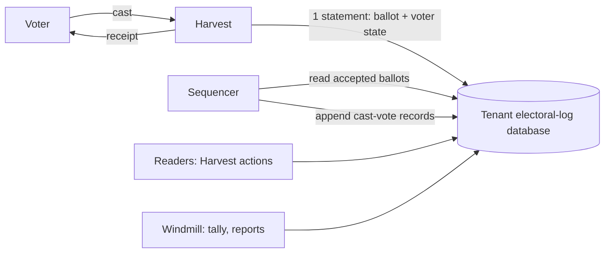

<!--
SPDX-FileCopyrightText: 2026 Sequent Tech Inc <legal@sequentech.io>
SPDX-License-Identifier: AGPL-3.0-only
-->

# Electoral log ballot box

This page describes the planned move of cast votes from Hasura's `cast_vote` table into the electoral log, and records what has been measured so far. The [design](01-electoral-log-design.md) describes the log as it is today. Everything below that is not marked as measured is a plan.

## 1. Goals

- **One store for cast votes.** The electoral log becomes the ballot box. Hasura's `cast_vote` table is no longer written, and the tally reads its ballots from the log.
- **Throughput.** One election event must accept about 20,000 votes per second during peaks of a few minutes, such as voting opening or closing. Ballots are at most about 5 KB.
- **Tenant isolation.** Each tenant has its own electoral-log database.
- **Compatibility with VoteSecure.** When VoteSecure lands, its ballots, receipts and tally inputs must fit without another change of store.
- **The log keeps its other records.** Keycloak events, administrative events, checkpoints and audits stay as they are.

## 2. Decisions

| Question | Decision |
| --- | --- |
| Where the throughput target applies | Per election event, for peaks of minutes. A tenant's other events and other tenants are additional load. |
| Ballot size | Up to about 5 KB |
| When the voter gets the answer | After durable acceptance: the vote and the voter's state are committed in the tenant's database. Adding the vote to the Merkle log follows asynchronously. |
| Datafix events | Datafix outcomes are records in the log. A vote starts as pending; the Datafix confirmation or rejection, and inbound "voted through another channel" marks and their reversal, are appended as their own records. |
| Who creates tenant databases | Windmill, when a tenant is created, with a provisioning role that can only create databases and roles. |
| Reads | From each tenant's primary. Read replicas are not planned. |

## 3. Architecture



- **Tenant database:** implemented as the `per-tenant` layout of the [design](01-electoral-log-design.md) (section 14.2). Windmill creates it when the tenant is created. It holds the Merkle log tables for the tenant's boards and the ballot box tables, partitioned by election event so that an event's data can be dropped, archived or moved on its own.
- **Accept path (implemented):** Harvest validates the ballot and checks the voting period and channel as today, then runs one SQL statement that counts the vote for the voter, stores the ballot and queues it for the sequencer. When it commits, Harvest answers with the receipt. No `cast_vote` row and no queued log event are written.
- **Sequencer (implemented):** one at a time per election event. It reads queued ballots in acceptance order, builds and signs their cast-vote records, which carry the ballot's hash rather than its content, and appends them to the event's board in batches. Checkpoints and proofs cover what it has appended.
- **Readers (planned):** the voting portal, admin portal and reports will read through Hasura actions backed by Harvest, which query the tenant database: has this voter voted, the voter's ballots, counts by election and area, and ballot lists for the tally.

### 3.1 Which events use the ballot box

Each election event has a ballot box policy, `ballot_box` in its `bulletin_board_reference`:

| Policy | Where cast votes go | Which events |
| --- | --- | --- |
| `cast-vote-table` (no value) | Hasura's `cast_vote` table, with the log record queued as before | Events created before the ballot box |
| `electoral-log` | The ballot box of the event's electoral-log database | Events created or imported from now on |

Windmill sets the policy and creates the event's partitions when it creates the event's board. Events created before keep `cast_vote` until they finish, so both paths exist until `cast_vote` is retired. Datafix events with the `electoral-log` policy refuse votes for now: their pending status, confirmation and rejection records are not implemented yet.

## 4. The accept path

Tables, in every electoral-log database (`packages/electoral-log/schema.sql`):

| Table | One row per | Key |
| --- | --- | --- |
| `ballot_box_ballot` | Accepted ballot: content, format, ballot and pseudonym hashes, voting channel, status, the voter's IP address, country and username, acceptance time | Event and sequence number; unique per event and ballot ID |
| `ballot_box_voter` | Voter and election: area, number of votes, last ballot ID | Event, election, voter |
| `ballot_box_pending` | Accepted ballot not yet appended to the board | Event and sequence number |
| `ballot_box_sequencer` | Event being sequenced: the run holding it and until when | Event |

The statement (`PostgresStore::accept_ballot`):

```sql
WITH voter AS (
    INSERT INTO ballot_box_voter AS v (..., area_id, votes, last_ballot_id, updated_at)
    VALUES (..., $area, 1, $ballot_id, now())
    ON CONFLICT (election_event_id, election_id, voter_id) DO UPDATE
        SET votes = v.votes + 1, last_ballot_id = EXCLUDED.last_ballot_id, updated_at = EXCLUDED.updated_at
        WHERE v.area_id = EXCLUDED.area_id AND ($allowed_votes = 0 OR v.votes < $allowed_votes)
    RETURNING election_event_id
), ballot AS (
    INSERT INTO ballot_box_ballot (...) SELECT ... FROM voter RETURNING election_event_id, seq, id
), queued AS (
    INSERT INTO ballot_box_pending (election_event_id, seq) SELECT election_event_id, seq FROM ballot
)
SELECT seq, id FROM ballot;
```

- **One statement, one round trip.** The upsert locks the voter's row, so concurrent votes of one voter are serialized without advisory locks. If the vote is over the election's limit, or the voter already voted in another area, the upsert changes nothing, nothing is inserted, and Windmill reads the voter's row to say which rule refused it. These are the rules of Hasura's `check_revote_limit` trigger: `num_allowed_revotes` counts all votes, unset means 1, 0 means unlimited, and votes in another area are refused.
- **Unique ballot IDs.** A ballot ID already used in the event fails the whole statement, so the voter's count does not change either.
- **Answers:** the same errors as for `cast_vote` (`insert_failed_exceeds_allowed_revotes`, `check_votes_in_other_areas_failed`, `insert_failed`), and on success a cast vote with the ballot's ID.
- **What is durable when the voter gets the receipt:** the ballot, the voter's count and the queue entry, in the tenant database, with synchronous commit. Until the sequencer appends the vote, no checkpoint covers it.
- **Schema upgrades:** the tables are part of `schema.sql`, so `electoral-log-admin init` creates them in existing databases. Run it before deploying a Windmill that creates ballot boxes: without the tables, creating an election event fails.

## 5. The sequencer

- **Scheduling:** Windmill beat runs `schedule_ballot_box_sequencers` every `--ballot-box-interval` seconds (2 by default) on `electoral_log_beat_queue`. It lists the events with queued ballots in every electoral-log database and queues one `sequence_ballot_box` task per event on `electoral_log_batch_queue`.
- **One at a time per event:** a run takes a 150-second lease on the event in `ballot_box_sequencer` and ends it when it finishes. A run that finds a running lease held by another run ends at once; a run that dies leaves the event to the next one when its lease runs out. A lease, rather than a lock held on a connection, leaves the database's connection pool to the work.
- **Batches:** a run reads up to 5,000 queued ballots in acceptance order, builds their records, appends them in one append, and removes them from the queue, until the queue is empty or 50 seconds have passed.
- **Exactly once in the log:** each record's delivery ID is `ballot-box:<event>:<sequence number>`. If a run stops after the append and before removing the ballots from the queue, the next run appends them again and the log stores nothing new.
- **Records:** the record is built as `post_cast_vote` builds it for `cast_vote`, signed with the event's protocol-manager key, with the ballot's hash, election, area, pseudonym, IP address, country and voting channel. Its statement timestamp is when the sequencer built it, a few seconds after acceptance; the acceptance time is in `ballot_box_ballot`.
- **Order:** ballots accepted in concurrent transactions can commit out of sequence order, so a ballot can be appended after one with a higher sequence number. The log's order is the sequencing order.
- **Lag:** the sequencer is slower than the accept path at the measured rates (section 8), so during a peak it falls behind and catches up afterwards. Its lag is the window in which accepted votes are not in the Merkle log. The number of queued ballots per event is the measure to monitor.

## 6. Reads and the tally

- **Has the voter voted:** a primary-key lookup in `ballot_box_voter`.
- **Lists and counts:** from `ballot_box_ballot` and `ballot_box_voter`, with indexes on election and area, served by Harvest-backed Hasura actions that replace today's queries on `cast_vote`.
- **Tally input:** at a checkpoint taken after voting closes, the valid ballots of an election, deduplicated to each voter's last valid ballot, read in sequence order. Extraction is deterministic: the same checkpoint always yields the same ballots in the same order.

## 7. VoteSecure compatibility

The store does not interpret ballot content. The points VoteSecure needs are explicit:

- a ballot format enum on each ballot, so that VoteSecure ballots and today's can coexist;
- a ballot verifier per format, called by Harvest before acceptance;
- unique trackers per event (the ballot ID);
- one ciphertext per contest where the format has several, with its contest ID;
- tally input delivered to a sink per format, from the deterministic extraction of section 6.

## 8. Prototype measurements

Measured on 5 October 2026 with `packages/electoral-log/bench/ballot-box/run.sh`, on the development VM (8 vCPU, 31 GiB, GCP persistent disk). PostgreSQL 18.6 ran in its own container limited to 4 CPUs and 6 GB, with synchronous commit. `pgbench` ran a simplified accept statement, without the area rule and the status of section 4, with prepared statements from another container, for one election event, 1,000,000 voters, 5 elections and up to 3 votes per voter. The ballot content was constant, built once per prepared statement and stored uncompressed, so that generating it did not count against the database. These runs measure the database side only: Harvest's validation and HTTP handling are not included, and scale with Harvest instances.

| Ballot | Clients | Votes/s (20 s runs) | Mean latency | Limit reached |
| ---: | ---: | ---: | ---: | --- |
| 2 KB | 16 | 10,655 | 1.5 ms | Commit latency |
| 2 KB | 32 | 18,875 | 1.7 ms | CPU, about 3 of 4 cores |
| 2 KB | 64 | 20,446 | 3.1 ms | CPU, 4 cores |
| 5 KB | 32 | 13,570 | 2.4 ms | Disk writes |
| 5 KB | 64 | 13,858 | 4.6 ms | Disk writes |

- **Accept and sequencer together:** with 32 clients accepting 2 KB ballots while the load-test client appended Merkle-log records in batches of 10,000, the database accepted 12,944 votes/s and appended 13,200 to 13,900 records/s, sharing the same 4 CPUs.
- **The sequencer alone** appended 17,000 to 20,000 records/s in batches of 10,000 to a new board. The load test page shows that this rate falls as a board grows beyond memory.
- **What this suggests, not measured:** the accept path alone reached 20,000 votes/s for 2 KB ballots with all 4 CPUs busy, so with the sequencer running it needs roughly twice that CPU. For 5 KB ballots the disk wrote about 210 MB/s at 13,900 votes/s, so 20,000 votes/s needs about 300 MB/s of sustained writes. The sequencer would lag during such a peak.
- **Not yet measured:** runs of several minutes, which include checkpoints and autovacuum; a board of millions of records; Harvest in the path; several events and tenants at once. The load tests of the implementation will cover them.
