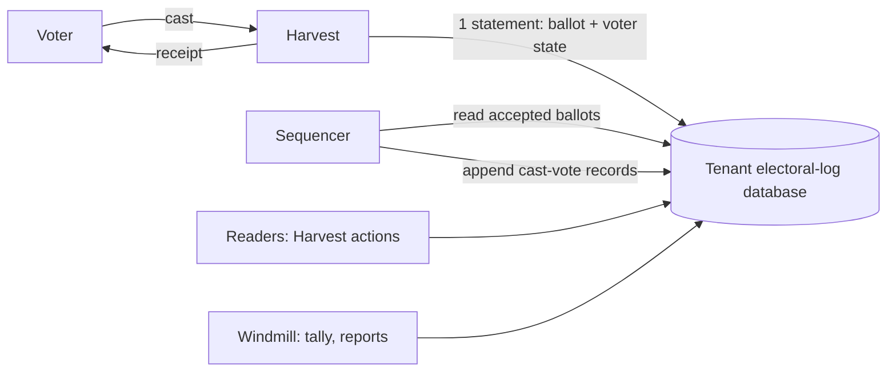

<!--
SPDX-FileCopyrightText: 2026 Sequent Tech Inc <legal@sequentech.io>
SPDX-License-Identifier: AGPL-3.0-only
-->

# Electoral log ballot box

This page describes the planned move of cast votes from Hasura's `cast_vote` table into the electoral log, and records what has been measured so far. The [design](01-electoral-log-design.md) describes the log as it is today. Everything below that is not marked as measured is a plan.

## 1. Goals

- **One store for cast votes.** The electoral log becomes the ballot box. Hasura's `cast_vote` table is no longer written, and the tally reads its ballots from the log.
- **Throughput.** One election event must accept about 20,000 votes per second during peaks of a few minutes, such as voting opening or closing. Ballots are at most about 5 KB.
- **Tenant isolation.** Each tenant has its own electoral-log database.
- **Compatibility with VoteSecure.** When VoteSecure lands, its ballots, receipts and tally inputs must fit without another change of store.
- **The log keeps its other records.** Keycloak events, administrative events, checkpoints and audits stay as they are.

## 2. Decisions

| Question | Decision |
| --- | --- |
| Where the throughput target applies | Per election event, for peaks of minutes. A tenant's other events and other tenants are additional load. |
| Ballot size | Up to about 5 KB |
| When the voter gets the answer | After durable acceptance: the vote and the voter's state are committed in the tenant's database. Adding the vote to the Merkle log follows asynchronously. |
| Datafix events | Datafix outcomes are records in the log. A vote starts as pending; the Datafix confirmation or rejection, and inbound "voted through another channel" marks and their reversal, are appended as their own records. |
| Who creates tenant databases | Windmill, when a tenant is created, with a provisioning role that can only create databases and roles. |
| Reads | From each tenant's primary. Read replicas are not planned. |

## 3. Architecture



- **Tenant database:** created by Windmill when the tenant is created. It holds the Merkle log tables of today's design, for all the tenant's boards, plus the ballot box tables, partitioned by election event so that an event's data can be dropped, archived or moved on its own.
- **Accept path:** Harvest validates the ballot as today and then runs one SQL statement that inserts the ballot and updates the voter's state. When it commits, Harvest answers with the receipt. No Hasura transaction and no queue is involved.
- **Sequencer:** one per election event. It reads accepted ballots in order, builds and signs their cast-vote records, which carry the ballot's hash rather than its content, and appends them to the event's board in large batches. Checkpoints and proofs cover what it has appended.
- **Readers:** the voting portal, admin portal and reports read through Hasura actions backed by Harvest, which query the tenant database: has this voter voted, the voter's ballots, counts by election and area, and ballot lists for the tally.

## 4. The accept path

```sql
WITH state AS (
    INSERT INTO voter_state AS s
        (election_event_id, election_id, voter, area_id, votes, last_ballot_id, updated_at)
    VALUES ($event, $election, $voter, $area, 1, $ballot_id, now())
    ON CONFLICT (election_event_id, election_id, voter) DO UPDATE
        SET votes = s.votes + 1, last_ballot_id = EXCLUDED.last_ballot_id, updated_at = now()
        WHERE (s.votes < $allowed_votes OR $allowed_votes = 0) AND s.area_id = EXCLUDED.area_id
    RETURNING last_ballot_id
)
INSERT INTO ballot (election_event_id, ballot_id, election_id, voter, area_id, content, status)
SELECT $event, $ballot_id, $election, $voter, $area, $content, $status FROM state;
```

- **One statement, one round trip.** The upsert locks the voter's state row, so concurrent votes of one voter are serialized without advisory locks. If the vote is over the election's limit, or the voter already voted in another area, the upsert changes nothing, nothing is inserted, and Harvest reads the voter's state to say which rule refused it. These are the rules that Hasura's `check_revote_limit` trigger enforces today: `num_allowed_revotes` counts all votes, 0 means unlimited, and votes in another area are refused.
- **Unique ballot IDs.** `ballot` is unique per event and ballot ID, as VoteSecure's trackers require.
- **Status.** Ordinary votes are accepted as valid. In Datafix events they are accepted as pending, and count as votes, as `in-progress` votes count today. A Datafix rejection is appended as a record, and the voter's count goes down in the same transaction.
- **What is durable when the voter gets the receipt:** the ballot and the voter's state, in the tenant database, with synchronous commit. Until the sequencer appends the vote, no checkpoint covers it.

## 5. The sequencer

- **Order:** it reads accepted ballots by their acceptance sequence number, after the last one it appended, and appends them in that order. A crash between the append and the update of its position appends nothing twice, because each record's delivery ID is derived from the event and the sequence number.
- **Records:** the cast-vote record carries the ballot's hash, election, area, the voter's pseudonym and the voting channel, like today's. The ballot's content stays in `ballot`; the record commits to it through the hash.
- **Lag:** the sequencer is slower than the accept path at the measured rates (section 8), so during a peak it falls behind and catches up afterwards. Its lag is the window in which accepted votes are not yet in the Merkle log; it must be monitored and is bounded by the peak's length.

## 6. Reads and the tally

- **Has the voter voted:** a primary-key lookup in `voter_state`.
- **Lists and counts:** from `ballot` and `voter_state`, with indexes on election and area, served by Harvest-backed Hasura actions that replace today's queries on `cast_vote`.
- **Tally input:** at a checkpoint taken after voting closes, the valid ballots of an election, deduplicated to each voter's last valid ballot, read in sequence order. Extraction is deterministic: the same checkpoint always yields the same ballots in the same order.

## 7. VoteSecure compatibility

The store does not interpret ballot content. The points VoteSecure needs are explicit:

- a ballot format enum on each ballot, so that VoteSecure ballots and today's can coexist;
- a ballot verifier per format, called by Harvest before acceptance;
- unique trackers per event (the ballot ID);
- one ciphertext per contest where the format has several, with its contest ID;
- tally input delivered to a sink per format, from the deterministic extraction of section 6.

## 8. Prototype measurements

Measured on 5 October 2026 with `packages/electoral-log/bench/ballot-box/run.sh`, on the development VM (8 vCPU, 31 GiB, GCP persistent disk). PostgreSQL 18.6 ran in its own container limited to 4 CPUs and 6 GB, with synchronous commit. `pgbench` ran a simplified accept statement, without the area rule and the status of section 4, with prepared statements from another container, for one election event, 1,000,000 voters, 5 elections and up to 3 votes per voter. The ballot content was constant, built once per prepared statement and stored uncompressed, so that generating it did not count against the database. These runs measure the database side only: Harvest's validation and HTTP handling are not included, and scale with Harvest instances.

| Ballot | Clients | Votes/s (20 s runs) | Mean latency | Limit reached |
| ---: | ---: | ---: | ---: | --- |
| 2 KB | 16 | 10,655 | 1.5 ms | Commit latency |
| 2 KB | 32 | 18,875 | 1.7 ms | CPU, about 3 of 4 cores |
| 2 KB | 64 | 20,446 | 3.1 ms | CPU, 4 cores |
| 5 KB | 32 | 13,570 | 2.4 ms | Disk writes |
| 5 KB | 64 | 13,858 | 4.6 ms | Disk writes |

- **Accept and sequencer together:** with 32 clients accepting 2 KB ballots while the load-test client appended Merkle-log records in batches of 10,000, the database accepted 12,944 votes/s and appended 13,200 to 13,900 records/s, sharing the same 4 CPUs.
- **The sequencer alone** appended 17,000 to 20,000 records/s in batches of 10,000 to a new board. The load test page shows that this rate falls as a board grows beyond memory.
- **What this suggests, not measured:** the accept path alone reached 20,000 votes/s for 2 KB ballots with all 4 CPUs busy, so with the sequencer running it needs roughly twice that CPU. For 5 KB ballots the disk wrote about 210 MB/s at 13,900 votes/s, so 20,000 votes/s needs about 300 MB/s of sustained writes. The sequencer would lag during such a peak.
- **Not yet measured:** runs of several minutes, which include checkpoints and autovacuum; a board of millions of records; Harvest in the path; several events and tenants at once. The load tests of the implementation will cover them.
