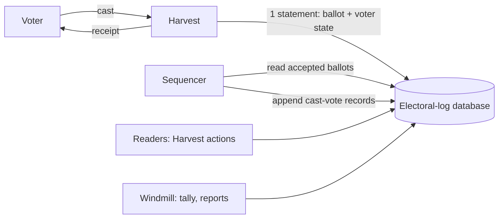

<!--
SPDX-FileCopyrightText: 2026 Sequent Tech Inc <legal@sequentech.io>
SPDX-License-Identifier: AGPL-3.0-only
-->

# Electoral log ballot box

This page describes the ballot box, which stores every election event's cast votes in the electoral log, and records what has been measured. Hasura's `cast_vote` table is gone: a migration drops it, so the ballot box is a breaking change for environments that have one, and is meant for new environments. The [design](01-electoral-log-design.md) describes the log itself. Section 7 is a plan; the rest is implemented.

## 1. Goals

- **One store for cast votes.** The electoral log is the ballot box, for every election event, Datafix events included. Hasura has no `cast_vote` table, and the tally reads its ballots from the log.
- **Throughput.** One election event must accept about 20,000 votes per second during peaks of a few minutes, such as voting opening or closing. Ballots are at most about 5 KB.
- **Tenant isolation.** Each tenant has its own electoral-log database.
- **Compatibility with VoteSecure.** When VoteSecure lands, its ballots, receipts and tally inputs must fit without another change of store.
- **The log keeps its other records.** Keycloak events, administrative events, checkpoints and audits stay as they are.

## 2. Decisions

| Question | Decision |
| --- | --- |
| Where the throughput target applies | Per election event, for peaks of minutes. A tenant's other events and other tenants are additional load. |
| Ballot size | Up to about 5 KB |
| When the voter gets the answer | After durable acceptance: the vote and the voter's state are committed in the electoral-log database. Adding the vote to the Merkle log follows asynchronously. |
| Datafix events | Datafix outcomes are records in the log. A vote starts as pending; the Datafix confirmation or rejection, and inbound "voted through another channel" marks and their reversal, are appended as their own records. |
| Reads | From the electoral-log database's primary. Read replicas are not planned. |

## 3. Architecture



- **Electoral-log database:** the one database of the [design](01-electoral-log-design.md) (section 14.2). It holds the Merkle log tables for every board and the ballot box tables, partitioned by election event so that an event's data can be dropped, archived or moved on its own.
- **Accept path:** Harvest validates the ballot and checks the voting period and channel, then runs one SQL statement that counts the vote for the voter, stores the ballot and queues it for the sequencer. When it commits, Harvest answers with the receipt.
- **Sequencer:** one at a time per election event. It reads queued ballots in acceptance order, builds and signs their cast-vote records, which carry the ballot's hash rather than its content, and appends them to the event's board in batches. Checkpoints and proofs cover what it has appended.
- **Readers and the tally:** every reader of cast votes, the tally included, reads the event's ballot box (section 6). The voting portal reads the voter's own votes through a Hasura action served by Harvest.

### 3.1 Each event's ballot box

Windmill creates an event's ballot box, its partitions of the ballot box tables, when it creates the event's board, for every event it creates or imports.

- **Creating an event's partitions** does not hold back the votes of other events. Each partition is created as a table of its own and then attached, which takes a `SHARE UPDATE EXCLUSIVE` lock on the partitioned table. `CREATE TABLE … PARTITION OF` would need an `ACCESS EXCLUSIVE` lock, which waits for every vote in progress in the database and holds back new ones until it gets it (section 9.2).
- **Deleting an election event drops its ballot box,** with its ballots, voter counts and queue. Each partition is detached with `DETACH PARTITION … CONCURRENTLY`, which needs PostgreSQL 14 or later, and then dropped. PostgreSQL detaches one partition of a table at a time, so deletions of several events take turns, each waiting up to two minutes.

### 3.2 Datafix events

The ballots of a Datafix event wait for Datafix to confirm that the voter may vote online:

- **Pending when accepted.** Under the voter's Datafix lock, the event's ballots are accepted as `pending`. A pending ballot counts toward the voter's votes and the area rule, as a valid one does.
- **Review.** Harvest queues `process_cast_vote` for each one. Every beat, `review_cast_votes` also lists the pending ballots older than 90 seconds in every electoral-log database, through the partial index `ballot_box_ballot_pending`, and queues them again. `process_cast_vote` sends Datafix's `SetVoted` and makes the ballot `valid`, or `rejected` when the voter is disabled or recorded as having voted through another channel. Each change compares and sets the status, so concurrent runs change a ballot once.
- **A rejected ballot gives the vote back.** It no longer counts toward the voter's votes; once none of the voter's ballots in an election counts, the voter may vote again, from any area. Disabling a Datafix voter rejects the voter's pending and valid ballots.
- **Records.** The sequencer appends a pending ballot's cast-vote record as it does any other's. Each Datafix operation, outbound and inbound, appends a record of its own with its outcome.
- **The tally** refuses an area with pending ballots (section 6.1).

## 4. The accept path

Tables, in every electoral-log database (`packages/electoral-log/schema.sql`):

| Table | One row per | Key |
| --- | --- | --- |
| `ballot_box_ballot` | Accepted ballot: content, format, ballot and pseudonym hashes, voting channel, status, the voter's IP address, country and username, acceptance time | Event and sequence number; unique per event and ballot ID |
| `ballot_box_voter` | Voter and election: area, number of votes, last ballot ID | Event, election, voter |
| `ballot_box_pending` | Accepted ballot not yet appended to the board | Event and sequence number |
| `ballot_box_sequencer` | Event being sequenced: the run holding it and until when | Event |

The statement (`PostgresStore::accept_ballot`):

```sql
WITH voter AS (
    INSERT INTO ballot_box_voter AS v (..., area_id, votes, last_ballot_id, updated_at)
    VALUES (..., $area, 1, $ballot_id, now())
    ON CONFLICT (election_event_id, election_id, voter_id) DO UPDATE
        SET votes = v.votes + 1, area_id = EXCLUDED.area_id, last_ballot_id = EXCLUDED.last_ballot_id,
            updated_at = EXCLUDED.updated_at
        WHERE (v.votes = 0 OR v.area_id = EXCLUDED.area_id) AND ($allowed_votes = 0 OR v.votes < $allowed_votes)
    RETURNING election_event_id
), ballot AS (
    INSERT INTO ballot_box_ballot (...) SELECT ... FROM voter RETURNING election_event_id, seq, id
), queued AS (
    INSERT INTO ballot_box_pending (election_event_id, seq) SELECT election_event_id, seq FROM ballot
)
SELECT seq, id FROM ballot;
```

- **One statement, one round trip.** The upsert locks the voter's row, so concurrent votes of one voter are serialized without advisory locks. If the vote is over the election's limit, or the voter already voted in another area, the upsert changes nothing, nothing is inserted, and Windmill reads the voter's row to say which rule refused it. The rules: `num_allowed_revotes` counts the voter's pending and valid ballots, unset means 1 and 0 means unlimited; while one of them counts, votes in another area are refused.
- **Prepared once per connection.** Each connection prepares the statement the first time it accepts a vote. Parsing and planning it for every vote halved the throughput (section 9.1).
- **Unique ballot IDs.** A ballot ID already used in the event fails the whole statement, so the voter's count does not change either.
- **Answers:** `insert_failed_exceeds_allowed_revotes`, `check_votes_in_other_areas_failed` or `insert_failed`, and on success a cast vote with the ballot's ID.
- **What is durable when the voter gets the receipt:** the ballot, the voter's count and the queue entry, in the electoral-log database, with synchronous commit. Until the sequencer appends the vote, no checkpoint covers it.
- **Schema upgrades:** the tables are part of `schema.sql`, so `electoral-log-admin init` creates them in existing databases. Run it before deploying a Windmill that creates ballot boxes: without the tables, creating an election event fails.

## 5. The sequencer

- **Scheduling:** Windmill beat runs `schedule_ballot_box_sequencers` every `--ballot-box-interval` seconds (2 by default) on `electoral_log_beat_queue`. It lists the events with queued ballots in every electoral-log database and queues one `sequence_ballot_box` task per event on `electoral_log_batch_queue`.
- **One at a time per event:** a run takes a 150-second lease on the event in `ballot_box_sequencer` and ends it when it finishes. A run that finds a running lease held by another run ends at once; a run that dies leaves the event to the next one when its lease runs out. A lease, rather than a lock held on a connection, leaves the database's connection pool to the work.
- **Batches:** a run reads up to 5,000 queued ballots in acceptance order, builds their records, appends them in one append, and removes them from the queue, until the queue is empty or 50 seconds have passed.
- **Exactly once in the log:** each record's delivery ID is `ballot-box:<event>:<sequence number>`. If a run stops after the append and before removing the ballots from the queue, the next run appends them again and the log stores nothing new.
- **Records:** a `CastVote` record, signed with the event's protocol-manager key, with the ballot's hash, election, area, pseudonym, IP address, country and voting channel. Its statement timestamp is when the sequencer built it, a few seconds after acceptance; the acceptance time is in `ballot_box_ballot`.
- **Order:** ballots accepted in concurrent transactions can commit out of sequence order, so a ballot can be appended after one with a higher sequence number. The log's order is the sequencing order.
- **Lag:** the sequencer is slower than the accept path at the measured rates (section 9.4), so during a peak it falls behind and catches up afterwards. Its lag is the window in which accepted votes are not in the Merkle log. The number of queued ballots per event is the measure to monitor.
- **When voting closes:** the checkpoint of the closure waits up to 60 seconds for the sequencer to append the event's queued ballots, so that it covers every ballot accepted before the closure. If ballots still wait after that, Windmill logs a warning and publishes it anyway; the checkpoint after the tally covers them.

## 6. Reads and the tally

Windmill finds an event's ballot box through the board in its `bulletin_board_reference` (`windmill/src/services/ballot_box_reads.rs`). The ballot box's queries are in `electoral-log/src/adapters/ballot_box_reads.rs`.

| Reader | Reads | From the ballot box |
| --- | --- | --- |
| Voting portal: the voter's status, the polling of unresolved votes, the ballot locator; IVR's `cast-votes` endpoint | The Hasura action `get_voter_cast_votes`, served by Harvest | The voter's ballots |
| Statistics of the admin portal's dashboards: voters by channel, ballots per time bucket, ballots by IP address | Harvest's statistics actions | Counted in the ballot box |
| Voter list: each voter's votes, the "has voted" filter, the edit form's check that a voter has voted | `get_users` | Counted in the ballot box |
| Participation report, ballot receipt | Windmill's report tasks | Counted and checked in the ballot box |
| Tally | Windmill's tally tasks | Each area's input from the ballot box (section 6.1) |

- **What a voter can read:** `get_voter_cast_votes` returns the voter's own votes, in the area and elections of their token. Without arguments it returns all of them without their content. With an election and a ballot ID, or the first characters of one, as telephone voters give it, it returns the matching ones with their content. Any other combination is refused.
- **Statuses:** a ballot's status reads as the cast-vote status the portals know: `valid` as `valid`, `pending` as `in-progress` and `rejected` as `discarded`. Statistics count valid ballots.
- **Indexes:** `ballot_box_ballot (election_event_id, voter_id)` serves the voter's lookups, and `(election_event_id, election_id, area_id, voter_id, seq DESC)` the tally input of each area (section 6.1). Each adds an entry for every accepted vote; section 9.1 measures what they cost. The partial index `ballot_box_ballot_pending (election_event_id, id)` holds only pending ballots, for the Datafix review (section 3.2).
- **Statistics scan the event's partition.** They read every valid ballot of the event. On events with millions of ballots, dashboards that refresh often put that load on the electoral-log database: at 1.3 million ballots each statistic took 1 to 5 seconds (section 9.3).

### 6.1 Tally input

For each election and area it tallies, the tally reads one row per voter with the content and voting channel of the voter's latest valid ballot, ordered by voter ID, which it then joins with the area's census.

- **One area at a time:** the area index gives the area's ballots in voter order without reading the rest of the event: 3 ms for an area of 250 voters among 1.3 million ballots, against 132 ms for a scan of the event (section 9.3).
- **Only ballots in the log:** the input takes ballots the sequencer has appended. Before reading it, the tally waits up to 60 seconds for the sequencer to append the area's queued ballots, then refuses the area if any still wait, so that a ballot accepted before the closure is not left out silently. Run the tally again once the sequencer has caught up.
- **Every ballot has its record:** the tally refuses the area if a valid ballot the sequencer appended has no cast-vote record on the board, because the record was deleted or never written.
- **Pending outcomes:** the tally refuses an area with ballots whose outcome is pending.
- **Deterministic once voting is closed:** with voting closed and the queue empty, the ballot box no longer changes, so reading an area again yields the same rows in the same order.
- **Not checked:** that a ballot's content still hashes to the hash in its signed record. Someone who can write the electoral-log database can change the content of a stored ballot without the tally noticing.

## 7. VoteSecure compatibility

The store does not interpret ballot content. The points VoteSecure needs are explicit:

- a ballot format enum on each ballot, so that VoteSecure ballots and today's can coexist;
- a ballot verifier per format, called by Harvest before acceptance;
- unique trackers per event (the ballot ID);
- one ciphertext per contest where the format has several, with its contest ID;
- tally input delivered to a sink per format, from the deterministic extraction of section 6.

## 8. Prototype measurements

Measured on 5 October 2026 with `packages/electoral-log/bench/ballot-box/run.sh`, on the development VM (8 vCPU, 31 GiB, GCP persistent disk). PostgreSQL 18.6 ran in its own container limited to 4 CPUs and 6 GB, with synchronous commit. `pgbench` ran a simplified accept statement, without the area rule and the status of section 4, with prepared statements from another container, for one election event, 1,000,000 voters, 5 elections and up to 3 votes per voter. The ballot content was constant, built once per prepared statement and stored uncompressed, so that generating it did not count against the database. These runs measure the database side only: Harvest's validation and HTTP handling are not included, and scale with Harvest instances.

| Ballot | Clients | Votes/s (20 s runs) | Mean latency | Limit reached |
| ---: | ---: | ---: | ---: | --- |
| 2 KB | 16 | 10,655 | 1.5 ms | Commit latency |
| 2 KB | 32 | 18,875 | 1.7 ms | CPU, about 3 of 4 cores |
| 2 KB | 64 | 20,446 | 3.1 ms | CPU, 4 cores |
| 5 KB | 32 | 13,570 | 2.4 ms | Disk writes |
| 5 KB | 64 | 13,858 | 4.6 ms | Disk writes |

- **Accept and sequencer together:** with 32 clients accepting 2 KB ballots while the load-test client appended Merkle-log records in batches of 10,000, the database accepted 12,944 votes/s and appended 13,200 to 13,900 records/s, sharing the same 4 CPUs.
- **The sequencer alone** appended 17,000 to 20,000 records/s in batches of 10,000 to a new board. The load test page shows that this rate falls as a board grows beyond memory.
- **What this suggests, not measured:** the accept path alone reached 20,000 votes/s for 2 KB ballots with all 4 CPUs busy, so with the sequencer running it needs roughly twice that CPU. For 5 KB ballots the disk wrote about 210 MB/s at 13,900 votes/s, so 20,000 votes/s needs about 300 MB/s of sustained writes. The sequencer would lag during such a peak.
- **Not measured here:** runs of several minutes, which include checkpoints and autovacuum; a board of millions of records; Harvest in the path; several events and tenants at once. Section 9 measures the implementation.

## 9. Load tests of the implementation

Measured on 6 October 2026 with `packages/electoral-log/bench/ballot-box/load.sh`, on the same development VM as section 8 (8 vCPU, 31 GiB, GCP persistent disk), against PostgreSQL 18.6 in its own container limited to 4 CPUs and 6 GB, tuned as in section 8 with `max_wal_size=4GB` and synchronous commit.

- **Client:** `packages/electoral-log/examples/ballot_box_load.rs`, a release build that calls `PostgresStore::accept_ballot`, the call Harvest makes for each vote, from 32 or 64 tasks with a connection each.
- **Data:** one election event with 5 elections, 1,000 areas and 1,000,000 voters. Each vote is for a random voter and election, in the voter's own area, with random text content of 2 or 5 KB; a voter may cast 3 votes per election.
- **What the runs include:** each run of 90 or 120 seconds went through 2 to 4 checkpoints and 9 to 26 runs of autovacuum or autoanalyze. They do not include Harvest, which section 9.5 measures separately.

### 9.1 Accept path

| Ballot | Clients | Run | Votes/s | p50 | p95 | p99 | Slowest |
| ---: | ---: | ---: | ---: | ---: | ---: | ---: | ---: |
| 2 KB | 32 | 120 s | 10,611 | 2.2 ms | 4.9 ms | 19 ms | 410 ms |
| 5 KB | 32 | 90 s | 9,884 | 2.6 ms | 4.4 ms | 11 ms | 205 ms |
| 2 KB | 64 | 90 s | 13,451 | 3.2 ms | 11 ms | 35 ms | 156 ms |
| 2 KB, at 5,000 votes/s | 32 | 90 s | 4,999 | 1.6 ms | 2.6 ms | 3.6 ms | 97 ms |

- **Where the limit is:** the database's 4 CPUs were busy in the runs at full speed. They started at about 15,000 votes/s with 2 KB ballots and settled 20 to 30 % lower once checkpoints and autovacuum ran.
- **Correctness:** after the 120-second runs, no voter had more votes than the election allows, every voter's count matched their stored ballots, and the stored ballots, the counted votes and the queued ballots were equal in number.
- **Prepared statement (fixed):** the first runs sent the statement unprepared, so PostgreSQL parsed and planned it for every vote. With 2 KB ballots and 32 clients they reached 6,463 votes/s, with a p95 of 18 ms and a p99 of 41 ms. Prepared once per connection, the same run reached 12,142 votes/s, with a p95 of 3.9 ms and a p99 of 16 ms. Harvest's votes use the same call.
- **Cost of the area index (section 9.3):** 2 KB ballots went from 12,142 to 10,611 votes/s and 5 KB ballots from 10,049 to 9,884. Back-to-back runs differ by up to about 10 %, so the index costs somewhere between nothing and 13 %.
- **Compared with the prototype (section 8):** the prototype's simplified statement reached 18,875 and 13,570 votes/s for 2 and 5 KB ballots with 32 clients over 20 seconds. The implementation also checks the area rule and maintains the voter and area indexes, and these runs include checkpoints and autovacuum.
- **20,000 votes/s** was not reached on 4 CPUs. The CPU each vote took suggests 7 to 8 CPUs for the accept path alone at that rate, plus the sequencer's share (section 9.4). This is an estimate; it was not measured.

### 9.2 Creating and dropping ballot boxes while votes go on

- **Before the fix:** with one vote's transaction open, `CREATE TABLE … PARTITION OF` waited until a 3-second `lock_timeout` cancelled it, and while it waited it held back every new vote in the database. `DROP TABLE` of a partition waited for the vote too. The integration tests, which create and drop ballot boxes while other tests vote, failed with deadlocks when run in parallel.
- **Now (section 3.1):** at 5,000 votes/s, with a ballot box created and dropped every 10 seconds, creating one took 8 to 20 ms and dropping one 16 to 24 ms. The votes' p50, p95 and p99 were 1.4, 2.3 and 3.3 ms, against 1.6, 2.6 and 3.6 ms in the same run without them.

### 9.3 Reads at 1.3 million ballots

An event with 1,273,818 ballots, 4.4 GB with indexes and 262 MB of voter rows, after `VACUUM ANALYZE`. Reads that use an index ran 20 times and scans 5 times.

| Read | Median | Slowest |
| --- | ---: | ---: |
| Voter status (`voter_ballots`) | 0.33 ms | 36 ms |
| Ballot locator (`voter_ballot_contents`) | 0.26 ms | 2 ms |
| Voter list page of 50 voters (`votes_of_voters`) | 1.3 ms | 4.8 ms |
| Console pages of ballots and voters | 0.8 to 1.0 ms | 14 ms |
| Console page filtered by a status no ballot has | 141 ms | 144 ms |
| Tally input of an area of about 250 voters | 2.8 to 3.0 ms | 204 ms |
| Unsequenced ballots of an area | 0.4 ms | 1.2 ms |
| Participation of the event / of an election | 1,677 / 1,063 ms | 4,886 / 1,230 ms |
| Voters by channel | 2,646 ms | 2,876 ms |
| Ballots per hour, last 24 hours | 959 ms | 1,086 ms |
| Ballots by IP address, first 50 | 4,232 ms | 5,188 ms |

- **Tally input (fixed):** without the area index, the input of an area took 132 ms, a parallel scan of the whole event for each area, so an event of 5 elections and 1,000 areas spent about 11 minutes scanning at this size, and more as either grows. With the index, it takes 3 ms per area once the area's ballots are in memory, and up to about 200 ms the first time, when their contents are read from disk.
- **Dashboard statistics scan the event (not fixed):** they took 1 to 5 seconds each and grow with the event's ballots; at 10 million ballots, 10 to 40 seconds can be expected, which was not measured. Dashboards that refresh often on large events would need cached or precomputed counts.

### 9.4 The sequencer

The load tool's `sequence` command does what Windmill's sequencer does, in a release build, against the same database: it reads queued ballots in batches of 5,000, builds and signs each cast-vote record as `ballot_record` does, appends them and removes them from the queue. Windmill's task also reads the event's signing key once per run.

| Situation | Records/s | Read, build and sign, append, remove |
| --- | ---: | --- |
| Alone, appending a queue of 418,043 ballots to a new board | 6,345 | 14, 27, 58, 1 % |
| While 32 clients accept 2 KB ballots at full speed (9,546 votes/s), then catching up; the board grew from 0.4 to 1.3 million records | 3,000 to 3,700 while votes arrived, 3,900 to 4,600 after; 3,875 over the run | 36, 19, 45, 1 % |
| While votes arrive at 5,000 per second | 4,132 | 17, 20, 62, 2 % |

- **The sequencer is slower than the accept path,** so during a peak the queue grows by the difference. At these rates, 5 minutes of 10,000 votes/s leave about 2 million queued ballots, which take about 7 more minutes to append. When voting closes in such a peak, the closing checkpoint waits 60 seconds and is published without the queued ballots, and the tally refuses the areas whose ballots are still queued until the sequencer catches up (section 5).
- **At 5,000 votes/s it kept up,** with a queue of up to about 86,000 ballots, about 17 seconds of votes, which emptied 16 seconds after the votes stopped. Sharing the 4 CPUs with it, the votes' p95 and p99 rose to 18 and 52 ms.
- **Reading the queue slows down** as removed entries accumulate in it, up to 36 % of the sequencer's time.
- **Development builds:** Windmill runs a debug build in development, whose sequencer appended 1,170 to 1,310 records/s, about a fifth of the release build. Lag measured in development does not predict production.
- **Possible improvements, not made:** signing records on several cores (19 to 27 % of the time), larger appends, and vacuuming the queue more often.

### 9.5 Through Harvest

- **Voters:** 300 voters of the voting load tool, 20 at a time, voted through the development stack, with debug builds of Harvest and Windmill: all 300 journeys passed, at 21.9 votes/s. Casting a vote took 93 ms at the median and 198 ms at p95, and a whole journey 840 ms at the median. All 300 receipts matched ballots of the event's ballot box: the load tool's database audit reads the ballot box when given the electoral-log database.
- **Census (fixed):** the event's election had no external ID, so its voters are authorized by the election's ID, as Keycloak's mapper reads it. The tally's census query found none of the 300 voters before the fix and all 300 after it.

### 9.6 Not measured

- 20,000 votes/s, which needs larger hardware than the test VM.
- Events with more than 1.5 million ballots, and boards with more than 1.7 million records.
- Several events and tenants voting on one server at once.
- Network latency between Harvest and the database, and failover.
