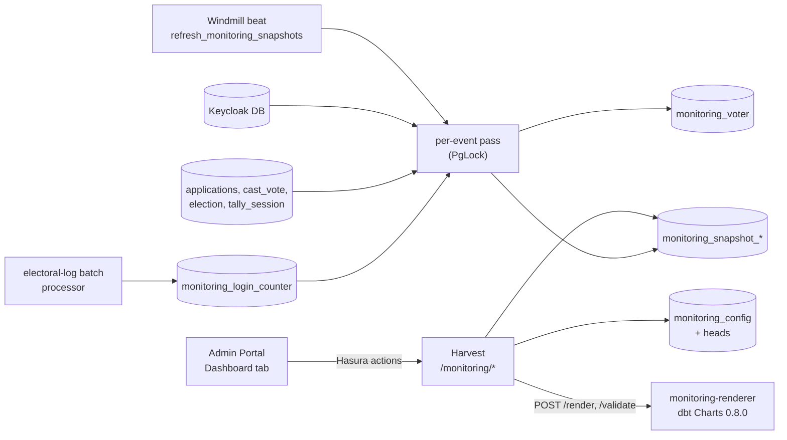

<!--
SPDX-FileCopyrightText: 2026 Sequent Tech Inc <legal@sequentech.io>
SPDX-License-Identifier: AGPL-3.0-only
-->

The configurable monitoring dashboards
([user guide](../../02-election_managers/02-reference/02-election-event/02-election_management_election-event_monitoring.md),
[configuration reference](../../02-election_managers/02-reference/12-monitoring-configuration.md))
split the work so that viewers never scan source data and configuration
never decides how anything is counted:

- **sequent-core** holds the pure rules: configuration types, the policy,
  the data sources, query evaluation and the board sent to the renderer. It
  also compiles to WASM, so the Admin Portal's editor reaches the same
  verdicts as the server.
- **Windmill** counts. A beat task refreshes a per-voter projection and
  writes content-addressed snapshots of every data source for every scope.
  The electoral-log batch processor counts sign-in attempts.
- **Harvest** serves. Its `/monitoring/*` routes check permissions and
  permission labels, read configuration and snapshots, and ask the renderer
  to draw.
- **monitoring-renderer** draws. A small internal Python service with a
  pinned dbt Charts 0.8.0 turns a board into SVG.
- **The Admin Portal** shows and edits, through Hasura actions.



## Code map

| Where | What |
|---|---|
| `packages/sequent-core/src/monitoring/` | Feature `monitoring`. `config.rs` (the four document kinds), `policy.rs` and `dbt_charts_keys.txt` (what is refused), `sources.rs` (data sources: the only place counting units, measures, templates and dimensions are stated), `resolve.rs` (selector values to concrete queries), `compute.rs` (a query over a payload to rows), `render_request.rs` (theme merge and inline queries), `scope.rs` (scope keys), `payload.rs`, `voter.rs`, `revision.rs` (what a save or reset may write), `presets/` and `presets.rs`, `sample.rs` (made-up payloads for previews and tests). |
| `packages/windmill/src/services/monitoring/` | `config_store.rs` and `audit.rs` (saving and the electoral-log entry), `projection.rs` (`monitoring_voter`), `producers.rs` (payloads per source and scope), `snapshot.rs` (passes, reads, pruning), `login_counter.rs`. |
| `packages/windmill/src/tasks/refresh_monitoring_snapshot.rs` | The beat task and the per-event pass. |
| `packages/windmill/src/postgres/monitoring_config.rs` | Queries of the configuration tables. |
| `hasura/migrations/backend-db/1790640000000_create_monitoring_tables/` | Every monitoring table, with triggers that hold the write protocols. |
| `packages/harvest/src/routes/monitoring*.rs`, `services/monitoring*.rs`, `ports/` and `adapters/` `monitoring_*` | The routes, render cache, SVG sanitizer, save checks, and the renderer and snapshot ports with in-memory fakes. |
| `packages/monitoring-renderer/` | The renderer service; its README documents the API. |
| `packages/admin-portal/src/components/monitoring/` | The Dashboard tab, widget cards, chart frame and editor. |

## Configuration store

Configuration is stored per tenant and election event:

| Table | Holds |
|---|---|
| `monitoring_event` | One row per event that has ever been configured: `dashboard_mode` (`LEGACY` or `CONFIGURED`), the preset last reset to, and `config_generation`. No row means the standard dashboard. |
| `monitoring_config` | Every revision of every document, append-only: `kind`, `key`, `revision`, `change` (`UPSERT` or `DELETE`), `yaml`, its `sha256`, `origin` (`PRESET` or `EDITOR`), `config_generation`, author and time. |
| `monitoring_config_head` | The live revision of each document, moved by compare-and-set. |

A change (a save, a reset or a mode switch) raises the event's generation
first, which queues changes of one event behind each other; then moves the
heads, writes the revisions and records the change in the electoral log
(`MonitoringConfigChanged`, signed for the author) before it commits.
Anything refused writes nothing.

A save is checked **before** its transaction, so a slow chart engine holds
no lock:

1. the sequent-core policy, for the document on its own;
2. the set-wide checks (`validate_set`) against the event's live documents;
3. the renderer's `/validate` (dbt Charts' schema) and a test render of each
   affected widget with the figures of `sample.rs`, so a save never depends on
   a snapshot.

The transaction then writes only if the generation it raises is the next
after the one the checks read; otherwise the save is checked again, up to
three times, before it reports busy. A head at another revision than the
editor's `expected_revision` is a conflict. Harvest maps the outcomes to
HTTP: conflict 409 (with the current revision and its author), invalid 422
(with the problems), checks unavailable or busy 503, and a locked-down event
403.

Resetting to a preset writes a `PRESET` revision for every document of the
preset and a `DELETE` revision for every document the event has that the
preset does not, sets the mode (configured by default) and records the
preset and version. This is also how an event opts in. Settings are
`PRESET_ONLY`: the editor cannot save them.

## Snapshot job

The beat task `refresh_monitoring_snapshots` runs once per snapshot interval
(`MONITORING_SNAPSHOT_INTERVAL_SECONDS`, default 30; see
[Snapshot cadence](#snapshot-cadence)) on the beat queue. It prunes old
login-counter receipts and sends one `refresh_monitoring_event_snapshot`
task per `CONFIGURED` event to its own `<slug>_monitoring_queue`
(`Queue::Monitoring`), so a long pass never delays reports. Both messages
expire after one interval: by then the next beat has asked again. The event
task takes `PgLock("monitoring_snapshot-<tenant>-<event>")` and skips the
pass if another holds it.

A pass of an event:

1. **Refreshes the projection** (`projection.rs`), in its own transaction.
   `monitoring_voter` has one row per voter and election they can vote in,
   holding only derived values: region, country, the configured dimensions
   (an age band, never a date of birth), enrollment state and reason, and
   when the voter pre-enrolled, received credentials, test-voted and first
   voted.
   - A **full pass** reads the event realm's voters (members of the
     `KEYCLOAK_VOTER_GROUP_NAME` group) from the Keycloak database in
     keyset pages of 2,000, with their areas, attributes and credentials. It
     runs when there is no projection yet, when the settings revision
     changed, and otherwise every `MONITORING_VOTER_FULL_PASS_SECONDS`
     (default 300). An unchanged voter (same attribute hash) is not
     rewritten; a voter who is gone is removed.
   - On **every pass**, each voter's latest application and first valid vote
     (`MIN(cast_vote.created_at)` over valid votes, so revotes do not count)
     are read from the backend tables, one statement each.
2. **Records a RUNNING run** in `monitoring_snapshot_run`, in its own
   transaction, after marking FAILED any run a crash left RUNNING.
3. **Counts** in one REPEATABLE READ transaction, which gives a coherent
   `as_of`. `load_facts` reads the projection, the elections (poll state from
   `election.status` and the initialization report), the tally sessions
   (counting and transmission state) and the login counters. `produce` then
   builds the payload of every source, for every scope, for every election
   set. The pass writes only the scopes whose figures changed, records per
   source whether it was counted (`monitoring_snapshot_source`: `CONNECTED`
   or `NOT_CONNECTED` with a reason), completes the run and makes it the live
   one. When nothing changed it deletes its run and only marks the live run
   checked (`checked_at`), so viewers keep the revision they have. On an
   error the run is FAILED and the live revision stays in service.
4. **Prunes** (`prune_snapshots`), in its own transaction: runs finished more
   than `EXPORT_WINDOW` (2 hours) ago, never the live one; then figures no
   remaining complete run holds; then payloads no figure names.

**Scopes.** Every figure is counted at its own scope, never added up from
narrower ones: the whole event, each region, Post and country, and each
country within a region or a Post. `sequent_core::monitoring::scope` builds
the canonical key (`event`, `region=…&country=…`) on both sides.

**Election sets.** A viewer restricted by permission labels may see only
some elections, and their figures must not include the rest. Harvest records
the viewer's set in `monitoring_election_set` (refreshing `requested_at` at
most every 5 minutes); the job counts the full set of the event plus every
set requested in the last 24 hours. A set not counted yet reads as
`SCOPE_PENDING`.

**Content addressing.** `monitoring_snapshot_payload` stores each scope's
payload once, keyed by the SHA-256 of its canonical JSON, and
`monitoring_snapshot_figure` records which payload a scope showed over a
range of revisions (`from_revision` up to, not including, `to_revision`). An
unchanged scope costs nothing new, and Harvest can cache by hash. The
figures of revision R are the rows whose range holds R, so an export of a
revision still within the window reads the figures that were shown, with
the configuration the dashboard drew them with (see
[render-widget](#harvest-routes) below); the export request names that
configuration's generation, so later saves do not change the file. A
revision below the live run that is no longer kept answers 410
`MONITORING_SNAPSHOT_PRUNED`. One that never was a snapshot answers 404
`MONITORING_NOT_FOUND`: 0 or below, after the live run, or a run still kept
that did not complete (running, failed or superseded). Pruning deletes a
run's row, so any other revision below the live run with no row is taken
as pruned. `render-widget` pinned to a revision answers the same.

**Buckets.** Series are hourly buckets in the settings' time zone, each
`[start, end)`; a day is the sum of its hours. Each voter has one first-vote
time, so buckets sum to the totals, including across DST changes.

## Login counters

Sign-in attempts are counted where the electoral log receives Keycloak
events: `persist_electoral_log_deliveries` in
`windmill/src/tasks/electoral_log.rs` calls `count_login_attempts_apart` in
its Hasura transaction, before the batch's messages are signed and written
to the board.

- `monitoring_login_counter` holds attempts per 15-minute UTC bucket, event
  type, registration (`REGISTERED` or `UNREGISTERED`) and area. Fifteen
  minutes rebuild exact hours in any time zone, including those a quarter or
  half hour off UTC.
- A delivery counts once: its `delivery_id` goes into
  `monitoring_login_counter_receipt` first (`ON CONFLICT DO NOTHING`), and
  only a new receipt adds to a counter. The beat task prunes receipts after
  7 days.
- The bucket comes from the event's own time, `event_time_ms`, which the
  Keycloak custom event listener sends; older messages without it use the
  time of receipt. A missing user id (the listener writes `"null"`) is
  `UNREGISTERED`.
- Counting runs in a savepoint: if it fails, it is undone and logged, and
  the electoral log carries on.
- Attempts are counted whether or not the event is configured, so a
  dashboard switched on during an election still has the history.

## Harvest routes

Every route runs in this order: authorize; load the event's monitoring row;
work out the elections the viewer may see from their permission labels (no
labels: every election; otherwise unlabeled elections and those whose label
the user has); reject a region, Post or country outside them with 403; only
then read configuration or snapshot rows. An `election_id` in the request
pins the Post.

| Route | Hasura action | Permission |
|---|---|---|
| `/monitoring/list-dashboards` | `monitoringListDashboards` | `monitoring-view` |
| `/monitoring/get-dashboard` | `monitoringGetDashboard` | `monitoring-view` |
| `/monitoring/render-widget` | `monitoringRenderWidget` | `monitoring-view`; a draft preview also needs `monitoring-configure` |
| `/monitoring/export` | `monitoringExport` | `monitoring-view` |
| `/monitoring/validate-config` | `monitoringValidateConfig` | `monitoring-configure` |
| `/monitoring/list-presets`, `/monitoring/list-config`, `/monitoring/get-config` | `monitoringListPresets`, `monitoringListConfig`, `monitoringGetConfig` | `monitoring-configure` |
| `/monitoring/save-config`, `/monitoring/reset-to-preset`, `/monitoring/set-mode` | `monitoringSaveConfig`, `monitoringResetToPreset`, `monitoringSetMode` | `monitoring-configure` and `election-event-write`; refused while the event is locked down |

Every refusal, from a route or from what fails before it runs, is JSON
Hasura passes on: `{message, extensions: {code, ...}}`. A body that is not
JSON answers 400 and one that lacks a field or has one of the wrong type
answers 422, both with `MONITORING_BAD_REQUEST` and a message naming what is
wrong; missing credentials answer 401 `Unauthorized`. A catcher registered
for `/monitoring` only keeps other Harvest routes' answers as they are.

`render-widget` answers a state: `RENDERED`, `NOT_CONNECTED` (the renderer is
not called), `NO_SNAPSHOT`, `SCOPE_PENDING`, `RENDER_FAILED` (the table is
still returned) or `INVALID`. Rendering resolves the selectors, evaluates
the queries with `compute::evaluate`, builds the board with
`render_request::build_board` and posts it to the renderer with the
`X-Renderer-Token` header, a 500 ms connect timeout and no retry.

A run counts every source at every scope from the settings and the event's
elections alone; widgets, dashboards and themes only read its figures. So
`render-widget` draws with the live configuration whenever the run was
counted with the live settings revision: a saved title, chart, query,
layout or theme shows at once, without waiting for the next run. When the
settings changed since the run, it draws with the configuration the run was
counted under until the next run (a count the new settings add is
`SCOPE_PENDING` with `SETTINGS_PENDING`); when that configuration is no
longer kept, or lacks the widget, it falls back to the live one with the
notice `CONFIG_AT_SNAPSHOT_UNAVAILABLE` or `CONFIG_NEWER_THAN_SNAPSHOT`. An
export chooses its configuration by the same rule, so a widget saved a
moment ago exports as it is drawn, and records the generation chosen in
the task's request, which the task reads (a request without it reads the
generation the run was counted under).

Drawn charts are cached in an LRU with single flight, so viewers asking for
the same chart at once wait on one draw. The key covers the tenant and
event, the revisions of the dashboard, widget, theme and settings, the
snapshot revision, the election set, the scope, the selector values, the
engine version, the locale, the width (in 40 px buckets) and the colour
scheme. Harvest then rebuilds the SVG from an allowlist of elements: no
scripts, foreign objects, images, links, event handlers, non-fragment
`href`s or external `url()`.

Exports run as a task (`EXPORT_MONITORING_DATA`) over the snapshot revision
the viewer saw: CSV in long format, or SQL as `CREATE TABLE` and `INSERT`
statements, with rows in `[from, to)`. The file is one long table: what
each row was read at (`snapshot_revision`, `as_of`, `scope`), `widget_id`,
`query`, `row`, every query's columns, then `range_from`, `range_to`,
`ignored_selectors` and `notice`. A query without rows still has one row,
with no `row` number and no figures, noticed `NO_ROWS_IN_RANGE` (a series
when a range is given) or `NO_ROWS`, so no widget drops out of the file; a
widget not connected has one noticed `NOT_CONNECTED: <reason>`.

## Renderer

`packages/monitoring-renderer` is a FastAPI service with `dbt-charts==0.8.0`
pinned by hash. It keeps one resident, warmed `ProjectSession`, so a draw
takes 20 to 200 ms instead of seconds. It re-checks every board with a port
of the sequent-core policy (a test keeps its copy of `dbt_charts_keys.txt`
in step), accepts only inline `values` queries, disables DuckDB external
access, refuses every outbound socket, checks the SVG it produced, and
bundles the map geometry and fonts for offline networks. In compose it sits
alone with Harvest on an `internal` network and publishes no ports. See its
README for the request and response bodies.

## Admin Portal

`MonitoringDashboardTab` wraps the standard dashboard in the election event
and election tabs. A user without `monitoring-view` gets the standard
dashboard and no monitoring request; a `LEGACY` event, or a failed request,
also shows it. `MonitoringGetDashboard` is polled every `refresh_seconds`,
the snapshot interval Harvest reports in `MonitoringListDashboards` and
`MonitoringGetDashboard` (30 seconds when a server does not report it, never
under 5), while the browser tab is visible and not in edit mode; the header
shows that interval. A widget re-renders only when the snapshot changes.

Charts are shown in an `iframe` with an empty `sandbox` attribute and a
content security policy that allows no network requests; the SVG is
sanitized again with DOMPurify before it is placed there. The editor
(CodeMirror 6 and `yaml`) is loaded only for users who may configure: the
YAML text is the single source of truth, the form tabs patch it keeping its
comments, and problems come from the browser's sequent-core checks while
typing and from the server on preview and Validate.

## Environment and settings

| Setting | Where | Default | Meaning |
|---|---|---|---|
| `MONITORING_SNAPSHOT_INTERVAL_SECONDS` | Windmill `beat` and workers, Harvest | `30`, within 5..=3600 | Seconds between snapshot passes; Harvest reports it as `refresh_seconds`. Beat's `-m`, `--monitoring-snapshot-interval` flag is the same setting. |
| `MONITORING_VOTER_FULL_PASS_SECONDS` | Windmill workers | `300`, within the snapshot interval..=86400 | Seconds between full passes over the Keycloak voters. |
| `KEYCLOAK_VOTER_GROUP_NAME` | Windmill | none; required | The Keycloak group whose members are voters. |
| `HARVEST_MONITORING_RENDERER_URL` | Harvest | compose: `http://monitoring-renderer:8080` | The renderer's base URL. |
| `HARVEST_MONITORING_RENDERER_TOKEN` | Harvest | none | Sent as `X-Renderer-Token`; must equal the renderer's `RENDERER_TOKEN`. Compose sets both from `MONITORING_RENDERER_TOKEN`. |
| `HARVEST_MONITORING_RENDERER_TIMEOUT_MS` | Harvest | `5000` | Per-request timeout, set above the renderer's own limit. |
| `HARVEST_MONITORING_CACHE_ENTRIES` | Harvest | `1024` | Drawn charts kept in the render cache. |
| `RENDERER_TOKEN` | renderer | none; required | The service will not start without it. |
| `RENDERER_CONCURRENCY` | renderer | `2` | Draws running at once. |
| `RENDERER_TIMEOUT_MS` | renderer | `4000` | Waiting plus drawing, after which a request gets 504. |
| `RENDERER_CACHE_BYTES` | renderer | `67108864` | Size of the renderer's SVG cache. |

### Snapshot cadence

`sequent_core::monitoring::cadence` parses both settings, so beat, the
workers and Harvest agree on them. Set them to the same values on the
`beat`, `windmill` and `harvest` services (the compose files pass both
through, defaulting to 30 and 300), otherwise the dashboards poll at a
different cadence than figures are made. A value outside its bounds is
clamped to the nearest bound, and a value that is not a whole number of
seconds is replaced by the default; in both cases the service starts and
logs a warning naming the variable and the value used. Every service logs
the cadence it runs with at startup (`Monitoring cadence: ...`).

The interval trades freshness against load on the sources. A pass reads the
projection sources once per event, however many people watch the
dashboards, so viewers add only cheap Harvest reads. What grows with the
event is the pass itself:

- Every pass reads each voter's latest application and first valid vote
  from the backend tables, and counts every scope.
- The **full voter pass** reads every voter of the event realm from the
  Keycloak database. It is the expensive part and grows with the number of
  voters; between full passes a voter change in Keycloak shows only at the
  next full pass (a settings change forces one at once).

A pass that takes longer than the interval is not stacked: the next beat
finds the event's lock held and skips it, so the effective cadence becomes
the pass duration. Watch the `Monitoring snapshot pass` log lines and keep
the interval above the usual pass duration.

| Event | `MONITORING_SNAPSHOT_INTERVAL_SECONDS` | `MONITORING_VOTER_FULL_PASS_SECONDS` |
|---|---|---|
| Small (up to about 10,000 voters) | `15`–`30` | `300` |
| Medium (about 10,000–100,000 voters) | `30`–`60` | `600` |
| Large (100,000 voters or more) | `60`–`120` | `1800`–`3600` |

Shorter intervals than `15` are rarely worth it: figures change in steps
of a pass anyway, and the portal never polls more often than every 5
seconds.

## Running the tests

Rust commands run in the devenv shell with this checkout's target
directory:

```sh
devenv shell -- bash -c 'cd packages && export CARGO_TARGET_DIR="$PWD/rust-local-target" && cargo test -p sequent-core --features monitoring --lib monitoring::'
```

- **sequent-core**: the unit tests under `src/monitoring/*_tests.rs` cover
  the policy (including every refused key and string in
  `fixtures/refused.yaml`), resolution, evaluation, the board builder and
  the presets. Every preset must load without errors and every widget in it
  must evaluate against the sample payloads; `fixtures/preset_versions.txt`
  fails the tests when a preset's documents change without a new `version`
  (`MONITORING_UPDATE_PRESET_VERSIONS=1` rewrites it after a raise).
- **Windmill**, pure logic: `cargo test -p windmill --lib monitoring`.
- **Windmill**, against PostgreSQL: the `postgres_monitoring_*` targets
  (`schema`, `config`, `projection`, `snapshot`, `login_counter`). Each test
  binary creates a private database with every backend migration applied, on
  the server `HASURA_DB__*` names, and works in transactions it rolls back:

  ```sh
  HASURA_DB__HOST=postgres HASURA_DB__PORT=5432 HASURA_DB__USER=postgres \
  HASURA_DB__PASSWORD=postgrespassword HASURA_DB__DBNAME=postgres \
  cargo test -p windmill --test postgres_monitoring_snapshot
  ```

- **Harvest**: `cargo test -p harvest monitoring`. Route permission cases
  are listed in `harvest/tests/fixtures/guarded-post-routes.txt` and
  `harvest/tests/support/route_permissions.rs`; the in-memory renderer and
  snapshot fakes let the route tests run without either.
- **Renderer**: from `packages/monitoring-renderer`, create a Python 3.12
  virtual environment, install `requirements.txt` and
  `requirements-dev.txt` with `--require-hashes`, and run `python -m pytest
  -q`. Sockets are disabled in every test.
- **Admin Portal**: `yarn jest src/components/monitoring` from
  `packages/admin-portal`, plus the stories checks.

`scripts/dev/step-dev test <package> [name]` picks the narrowest of these
commands for a package or file.
