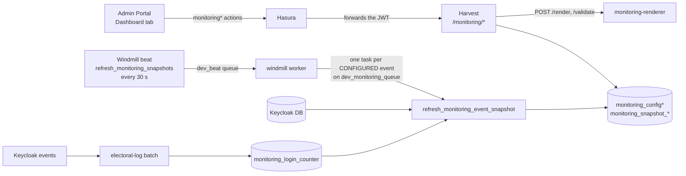

<!--
SPDX-FileCopyrightText: 2026 Sequent Tech Inc <legal@sequentech.io>
SPDX-License-Identifier: AGPL-3.0-only
-->

This page takes a developer or QA engineer with a dev container from an empty
stack to a verified monitoring feature: what to start, which automated tests
to run, and a live checklist with the result to expect at each step. The
[architecture](./01-monitoring-architecture.md) and
[data sources](./02-monitoring-data-sources.md) pages explain why things work
this way; the
[user guide](../../02-election_managers/02-reference/02-election-event/02-election_management_election-event_monitoring.md)
describes every screen.

Run commands from the repository root of your own checkout, inside the devenv
shell (`devenv shell`). `scripts/dev/step-dev` needs Python 3.11 or later, which the devenv shell has
and the dev container's system `python3` does not.

## 1. What you are testing



- **Configuration**: an event opts in by being reset to a preset (`comelec`
  or `campus`). Its YAML documents (settings, themes, widgets, dashboards)
  are then edited in the portal, each save a new revision.
- **Snapshots**: beat sends `refresh_monitoring_snapshots` every 30 seconds.
  For each event whose `dashboard_mode` is `CONFIGURED` it sends one
  `refresh_monitoring_event_snapshot` task to `<ENV_SLUG>_monitoring_queue`
  (`dev_monitoring_queue` in development). The pass refreshes
  `monitoring_voter` from Keycloak and the backend tables, counts every
  source for every scope and writes a new revision only when figures changed.
- **Login counters**: sign-in attempts are counted as the electoral log
  receives Keycloak events, whether or not the event is configured.
- **Viewing**: Harvest reads snapshots only; it never counts. The renderer
  draws SVG from inline data; Harvest sanitizes it and the portal shows it in
  a sandboxed `iframe`.

It is done when:

- every automated suite in [section 3](#3-automated-tests) passes;
- every step of [section 4](#4-live-verification) gives the expected result;
- the stack is left as found: OTP test mode off, the scenario event reset to
  the preset you want to keep.

## 2. Prerequisites

### Services

The `backend` and `full` [devcontainer modes](../03-development-environment/fast-feedback.md#devcontainer-modes)
start everything the feature needs (`.devcontainer/modes.json`):

| Service | Why | Check |
|---|---|---|
| `monitoring-renderer` | Draws charts and runs the dbt Charts checks of Validate and Save. Compose profiles `full` and `base`; internal network, no published port. | `docker inspect -f '{{.State.Health.Status}}' monitoring-renderer` is `healthy` |
| `harvest` | Serves `/monitoring/*`. Needs `HARVEST_MONITORING_RENDERER_TOKEN` equal to the renderer's `RENDERER_TOKEN`; compose sets both from `MONITORING_RENDERER_TOKEN` in `.devcontainer/.env.development`. | `docker inspect -f '{{.State.Health.Status}}' harvest` is `healthy` |
| `beat` | Runs `cargo run --bin beat`, which schedules the snapshot beat. | `docker logs --since 2m beat 2>&1 \| grep refresh_monitoring_snapshots` |
| `windmill` | Must consume `monitoring_queue` as well as `beat`: its compose command lists `... electoral_log_beat_queue monitoring_queue`. | `docker logs --since 2m windmill 2>&1 \| grep "Monitoring snapshot pass"` |
| `graphql-engine`, `keycloak`, `postgres`, `rabbitmq` | The usual backend. | `scripts/dev/step-dev mode status` |

Container names carry `DEVCONTAINER_NAME_PREFIX` when it is set. Start and
check the stack:

```sh
scripts/dev/step-dev mode status
scripts/dev/step-dev mode up backend      # or: full, which also starts the portal dev servers
```

The Admin Portal runs on http://127.0.0.1:3002 (`yarn start:admin-portal`
from `packages/`, unless the `full` mode already started it).

### Migrations and Hasura metadata

The `graphql-engine` image applies migrations and metadata when it starts.
After switching to a branch with new monitoring migrations or actions, apply
them and check consistency:

```sh
cd hasura
hasura migrate apply --database-name backend-db --endpoint http://graphql-engine:8080 --admin-secret admin --skip-update-check
hasura metadata apply --endpoint http://graphql-engine:8080 --admin-secret admin --skip-update-check
hasura metadata inconsistency list --endpoint http://graphql-engine:8080 --admin-secret admin --skip-update-check
hasura migrate status --database-name backend-db --endpoint http://graphql-engine:8080 --admin-secret admin --skip-update-check | grep monitoring
cd ..
```

Expect `metadata is consistent`, and `create_monitoring_tables` and
`monitoring_snapshot_indexes` `Present` in both columns. From the host, use
`http://127.0.0.1:8080` instead of `http://graphql-engine:8080`.

### Permissions

| Permission | Allows | Default tenant realm (`.devcontainer/keycloak/import/tenant-90505c8a-…json`) |
|---|---|---|
| `monitoring-view` | See the dashboards, View data, export. | `admin`, `admin-light` |
| `monitoring-configure` | Configure widget, Edit dashboard, theme, Duplicate, Reset to preset, set mode. Also needs `election-event-write`. | `admin` |

The event's Dashboard tab also needs `admin-dashboard-view`, and an
election's needs `election-dashboard-tab` (`admin` has both; `admin-light`
lacks `election-dashboard-tab`). Keycloak imports the realm only when it does
not exist yet: on an older dev volume, add the two roles to the groups by
hand in the Keycloak console (http://127.0.0.1:8090, `admin` / `admin`).

### A scenario event

```sh
scripts/dev/step-dev scenario list
scripts/dev/step-dev scenario up completed-ceremony
scripts/dev/step-dev scenario urls completed-ceremony
```

`completed-ceremony` imports a synthetic event with keys, published ballots
and online voting open. Its main election has areas A (4 voters) and B (2);
its grace election has area C (2). `urls` prints the voting and admin links,
the voter usernames and their shared password, and the administrator
(`admin` / `admin`). `scenario up` also enrols the administrator's email code
the first time; see [troubleshooting](#7-troubleshooting) for the portal's
code prompt.

Set up the shell variables the rest of this page uses:

```sh
TENANT=90505c8a-23a9-4cdf-a26b-4e19f6a097d5
EVENT=$(scripts/dev/step-dev scenario urls completed-ceremony --format json | jq -r .eventId)
SECRET=$(grep '^API_KEY_CLIENT_SECRET=' .devcontainer/.env.development | cut -d= -f2)
TOKEN=$(curl -s "http://keycloak:8090/realms/tenant-$TENANT/protocol/openid-connect/token" \
  -d grant_type=password -d client_id=api-key-client -d client_secret="$SECRET" \
  -d username=admin -d password=admin -d scope=openid | jq -r .access_token)
# gql QUERY [VARIABLES_JSON] [JQ_FILTER]
gql() {
  curl -s http://graphql-engine:8080/v1/graphql \
    -H "Authorization: Bearer $TOKEN" -H 'Content-Type: application/json' \
    -d "$(jq -n --arg q "$1" --argjson v "${2:-{\}}" '{query: $q, variables: $v}')" | jq "${3:-.}"
}
psql_dev() { PGPASSWORD=postgrespassword psql -h postgres -U postgres -d postgres -X -v event="$EVENT" "$@"; }
gql '{ monitoringListPresets { presets { id version title } } }'
```

The token's default role is `admin-user`, which the `monitoring*` actions
accept; it expires after a few minutes, so rerun the `TOKEN=` line when
Hasura answers `JWTExpired`. The last line lists `campus` and `comelec`.

## 3. Automated tests

Rust runs in the devenv shell with this checkout's target directory:

```sh
devenv shell -- bash -c 'cd packages && export CARGO_TARGET_DIR="$PWD/rust-local-target" && <command>'
```

| Layer | Command | What it proves |
|---|---|---|
| sequent-core | `cargo test -p sequent-core --features monitoring --lib monitoring::` | The policy refuses every forbidden key and string (`fixtures/refused.yaml`); resolution, evaluation, ratios and `—`, scopes, the board builder; every preset loads without a problem and every widget evaluates for every selector choice; the renderer's golden boards match; `fixtures/preset_versions.txt` fails on a changed preset without a new `version`. |
| Windmill, pure | `cargo test -p windmill --lib monitoring` | Producers and export formatting (CSV and SQL, the `[from, to)` range) without a database. |
| Windmill, PostgreSQL | `cargo test -p windmill --test <target>` for `postgres_monitoring_schema`, `postgres_monitoring_config`, `postgres_monitoring_projection`, `postgres_monitoring_snapshot`, `postgres_monitoring_login_counter`, `postgres_monitoring_export` | The migration's triggers and constraints, compare-and-set saves and the generation queue, the Keycloak projection, passes (unchanged pass writes nothing, pruning keeps the live run), counting a delivery once, exports reading the revision shown. |
| Harvest | `cargo test -p harvest monitoring` | Every route's permission, label and scope checks (with `tests/fixtures/guarded-post-routes.txt`), 409/422/503/403/410 answers, the render cache and single flight, the SVG sanitizer; in-memory renderer and snapshot fakes. |
| Harvest with the real engine (ignored by default) | `cargo test -p harvest monitoring -- --ignored` with `HARVEST_MONITORING_RENDERER_URL` and `HARVEST_MONITORING_RENDERER_TOKEN` set | Every shipped widget passes dbt Charts and the sanitizer; a widget is checked, saved and drawn through the real renderer. |
| Renderer | see below | The Python policy port, the API and token, the engine, SVG checks, no outbound sockets. |
| Admin Portal | `yarn --cwd packages/admin-portal test src/components/monitoring src/queries/Monitoring` | Polling, API mapping, editor state, local validator, duplicate, catalog and every component. |
| Admin Portal stories | `yarn --cwd packages/admin-portal typecheck:stories` and `yarn --cwd packages/admin-portal test:stories src/components/monitoring` | Stories compile and their play functions pass in the browser runner. |

Each PostgreSQL test binary creates a private `windmill_schema_*` database
with every migration on the server `HASURA_DB__*` names, and drops stale ones
from earlier runs. Point it at a throwaway server rather than the dev
database:

```sh
docker run -d --rm --name monitoring-test-pg --network container:devcontainer \
  -e POSTGRES_PASSWORD=postgres -e PGPORT=55432 postgres:18-bookworm
devenv shell -- bash -c 'cd packages && export CARGO_TARGET_DIR="$PWD/rust-local-target" \
  HASURA_DB__HOST=127.0.0.1 HASURA_DB__PORT=55432 HASURA_DB__USER=postgres \
  HASURA_DB__PASSWORD=postgres HASURA_DB__DBNAME=postgres && \
  for t in schema config projection snapshot login_counter export; do
    cargo test -p windmill --test postgres_monitoring_$t || exit 1
  done'
docker stop monitoring-test-pg
```

`--network container:devcontainer` (with your `DEVCONTAINER_NAME_PREFIX`)
puts the container in the dev container's network, so it is reached on
`127.0.0.1`. The same trick runs a renderer for the ignored Harvest test:

```sh
docker run -d --rm --name monitoring-test-renderer --network container:devcontainer \
  --read-only --tmpfs /tmp --cap-drop ALL --security-opt no-new-privileges:true \
  -e RENDERER_TOKEN=dev-local -e RENDERER_PORT=18080 sequentech.local/monitoring-renderer
curl -s http://127.0.0.1:18080/ready     # {"status":"ready","dbt_charts_version":"0.8.0"} after warm-up
devenv shell -- bash -c 'cd packages && export CARGO_TARGET_DIR="$PWD/rust-local-target" \
  HARVEST_MONITORING_RENDERER_URL=http://127.0.0.1:18080 HARVEST_MONITORING_RENDERER_TOKEN=dev-local && \
  cargo test -p harvest monitoring -- --ignored'
docker stop monitoring-test-renderer
```

The renderer's tests need Python 3.12, which the dev container does not
have; run them in the image its Dockerfile builds on, with the checkout
mounted read-only (pip downloads the pinned wheels):

```sh
docker run --rm --volumes-from devcontainer:ro -e PYTHONDONTWRITEBYTECODE=1 \
  -w "$PWD/packages/monitoring-renderer" python:3.12-slim sh -c '
    python -m venv /tmp/venv &&
    /tmp/venv/bin/pip install -q --no-deps --require-hashes -r requirements.txt -r requirements-dev.txt &&
    /tmp/venv/bin/python -m pytest -q -p no:cacheprovider'
```

Expect `253 passed`. `--volumes-from` mounts the checkout at the same path as
in the dev container, which a `-v "$PWD:..."` bind would not: the Docker
daemon resolves those paths on the host.

For the portal, install once from `packages/` with
`yarn install --frozen-lockfile`. To find and run one story:

```sh
yarn --cwd packages/admin-portal stories:inventory src/components/monitoring/MonitoringWidgetCard.tsx
scripts/dev/step-dev test admin-portal --story <story-id>
```

### Playwright journey

`packages/admin-portal/test/journeys/events/monitoring.spec.ts` drives the
Dashboard tab against invented Harvest answers (no services needed), once at
390 px and once at 1280 px wide. At each width it checks that:

- the configured dashboard's widgets are drawn in frames with an empty
  `sandbox` attribute, and nothing inside a chart can make a request (an
  `<image href>` to an outside host is never fetched);
- a form edit in the widget editor shows in the YAML tab, and Save sends the
  YAML with the revision it was loaded from;
- a save that finds a newer revision opens the conflict dialog;
- an election's Dashboard tab pins its Post and hides the Post selector.

`dashboard.spec.ts` stays the regression for the legacy dashboard. Build the
shared UI packages and the Admin Portal as in
[UI browser tests](../03-development-environment/testing/ui-browser-tests.md),
then run:

```sh
yarn --cwd packages/admin-portal test:types
yarn --cwd packages/admin-portal test:journeys test/journeys/events/monitoring.spec.ts test/journeys/events/dashboard.spec.ts
```

## 4. Live verification

Work in the Admin Portal as `admin` unless a step says otherwise, and keep
two SQL queries at hand:

```sh
# The latest runs and the one viewers are shown.
psql_dev -c "SELECT revision, status, as_of, checked_at, error
  FROM sequent_backend.monitoring_snapshot_run
  WHERE election_event_id = :'event' ORDER BY revision DESC LIMIT 5;" \
  -c "SELECT live_snapshot_revision, last_complete_revision, updated_at
  FROM sequent_backend.monitoring_snapshot_state WHERE election_event_id = :'event';"
# The event's mode, preset and configuration generation.
psql_dev -c "SELECT dashboard_mode, preset_id, preset_version, config_generation
  FROM sequent_backend.monitoring_event WHERE election_event_id = :'event';"
```

These only read. Do not write to these tables by hand: their triggers hold
the write protocols.

### Opt in and see figures

1. **Before opting in.** Open the event's **Dashboard** tab.
   *Expect* the standard dashboard, and no `monitoring*` request in the
   browser's network tab. `monitoring_event` has no row for the event.
2. **Opt in** by resetting to the `comelec` preset:
   ```sh
   gql 'mutation ($event: uuid!) { monitoringResetToPreset(election_event_id: $event, preset_id: "comelec") { generation warnings { code path message } } }' \
     "{\"event\": \"$EVENT\"}"
   ```
   *Expect* a `generation`, and `CONFIGURED`, `comelec`, version 2 in
   `monitoring_event`. On an event that already shows monitoring, **Edit
   dashboard → Reset to preset** does the same from the portal.
3. **First snapshot.** Within about 30 seconds a `COMPLETE` run appears and
   `live_snapshot_revision` points at it; the Windmill log shows
   `Monitoring snapshot pass, outcome=Completed { revision: …, figures_written: … }`.
   Reload the Dashboard tab. *Expect* the **Overview** dashboard, **Updated**
   and a time in Asia/Manila (the comelec time zone) in the header, and
   widgets drawn. Before the first run completes the header says **Not
   counted yet**.
4. **Unchanged passes.** Wait for two more beats without changing anything.
   *Expect* no new revision: the live run's `checked_at` moves forward
   instead, and the Windmill log shows `Unchanged`.
5. **Figures and ratios.** On **Voter turnout**, with no vote cast: Registered
   8, Pre-enrolled 0, Voted 0. The synthetic voters are not pre-enrolled
   (comelec reads `sequent.read-only.id-card-number-validated` = `VERIFIED`),
   so **Voted of pre-enrolled** and every ratio over pre-enrolled show **—**,
   never 0%; **Pre-enrolled of registered** shows 0.0%. The same through
   GraphQL:
   ```sh
   gql 'query ($event: uuid!) { monitoringRenderWidget(election_event_id: $event, dashboard_id: "overview", widget_id: "turnout-summary") { state snapshot_revision tables { query table } } }' \
     "{\"event\": \"$EVENT\"}" '.data.monitoringRenderWidget | {state, snapshot_revision, tables: [.tables[] | {query, rows: .table.rows}]}'
   ```
6. **Votes move the figures.** Sign in to the voting link from `scenario urls`
   as two voters of area A and one of area B and cast ballots. *Expect*,
   within one interval, a new revision and Voted 3, Voted of registered
   37.5%. A voter who votes again is still counted once.
7. **Sign-ins move the figures.** Sign in once with a wrong password and once
   correctly. *Expect* **Access and security** (and **Login outcomes** on its
   dashboard) to count attempts, not people, in `monitoring_login_counter`:
   ```sh
   psql_dev -c "SELECT bucket_start, event_type, registration, attempts
     FROM sequent_backend.monitoring_login_counter
     WHERE election_event_id = :'event' ORDER BY bucket_start DESC LIMIT 10;"
   ```
   An unknown username counts as `UNREGISTERED`, for the whole event only,
   and the widget says so.
8. **Not connected sources.** *Expect* **Helpdesk issues** on the Overview
   to show "Not connected · no helpdesk system is connected" and "Nothing is
   shown until it is.", never a zero; the same for test voting, voting
   credentials, final testing and lockdown and attack detections on their
   dashboards. `monitoring_snapshot_source` records them:
   ```sh
   psql_dev -c "SELECT s.source, s.election_set_key, s.producer_status, s.reason
     FROM sequent_backend.monitoring_snapshot_source s
     JOIN sequent_backend.monitoring_snapshot_state st USING (tenant_id, election_event_id)
     WHERE s.election_event_id = :'event' AND s.revision = st.live_snapshot_revision
     ORDER BY s.producer_status, s.source;"
   ```

### Scope and access

9. **Selectors.** Choose a Post, then a country. *Expect* every widget that
   follows the selector to narrow; widgets that cannot (sign-ins by country,
   attack detections) keep their own scope. Region and country values come
   from settings (`miru:geographical-region` election annotation, the voter's
   `country` attribute); the scenario sets neither, so they read as
   **Unknown**.
10. **Election page.** Open the main election and its **Dashboard** tab.
    *Expect* no Post selector, and figures for that election only: 6
    registered (areas A and B), not the event's 8.
11. **Label-restricted administrator.** Give the grace election a
    **Permission Label** (election **Data** tab, advanced settings), create a
    tenant user in the `admin` group whose **Permission Label** is a different
    label, and sign in as that user (they enrol their email code first).
    *Expect* the Post selector under **All authorized Posts** without the
    grace election, totals without its voters (6, not 8) and, the first time,
    **Counting this selection** until the next pass. A request for the
    grace election (`election_id` or a `scope` naming it) is refused with 403
    `MONITORING_FORBIDDEN_SCOPE`.
12. **Standard dashboard for non-viewers.** A user with the Dashboard tab but
    without `monitoring-view` gets the standard dashboard and sends no
    `monitoring*` request.

### Data and export

13. **View data.** Widget **⋯ → View data**. *Expect* a table per query with
    exact values (8, 3, 37.5%) matching the chart.
14. **Export.** Header **Export** (or **⋯ → Export CSV** for one widget).
    Choose **CSV**, a **From** and **To** around the votes of step 6, then
    **Export**. *Expect* an **Export Monitoring Data** task in the event's
    **Tasks** tab and a download. The file is one long table: each row names
    `snapshot_revision`, `as_of`, scope, widget and query; activity series
    rows fall in `[From, To)` and carry `range_from`/`range_to`; totals and
    statuses are as of the shown update. Repeat with **SQL** and load it into
    a scratch database: `CREATE TABLE` plus `INSERT`s in one transaction. A
    **To** before **From** shows "The end must be after the start." An export
    of a revision replaced more than two hours ago answers 410
    (`MONITORING_SNAPSHOT_PRUNED`).

### Configuration

15. **Configure widget → Validate → Save.** **⋯ → Configure widget** on Voter
    turnout. Change the title in **Data & query**. *Expect* the **YAML** tab
    to show the change with its comments kept, **Checks** to say "No problems
    found", the preview and **Query result · first rows** to update.
    **Validate** says "The widget is valid."; **Save widget** says "Widget
    saved as revision N", and the new title shows at once on every dashboard
    with the widget, drawn from the figures already counted: no snapshot
    pass is needed.
16. **Invalid save refused.** In the YAML tab add a top-level line
    `sql: SELECT 1`. *Expect* an error under **Checks** at `sql` ("unknown
    field `sql`, …"), **Save widget** refused with "The widget was not saved:
    fix the problems listed.", and the head revision unchanged
    (`monitoringGetConfig(... kind: "widget", key: "turnout-summary") { revision }`).
    Through GraphQL a refused save is an error with `extensions.code`
    `MONITORING_INVALID` and its `problems` (HTTP 422 from Harvest).
17. **409 conflict.** Open Configure widget on the same widget in two browser
    tabs. Save in the first, then in the second. *Expect* **Someone saved
    first** naming the author and revision, with **Reload**, **Copy my YAML**
    and **Keep editing**. Through GraphQL, a save with a stale
    `expected_revision` fails with `MONITORING_CONFLICT`, `current_revision`,
    `author` and `time`, and writes nothing. The text must differ from the
    head's: a save of the same text is a no-op whatever its revision.
    ```sh
    CONFIG='query ($event: uuid!) { monitoringGetConfig(election_event_id: $event, kind: "widget", key: "turnout-summary") { revision yaml } }'
    REV=$(gql "$CONFIG" "{\"event\": \"$EVENT\"}" '.data.monitoringGetConfig.revision')
    YAML=$(gql "$CONFIG" "{\"event\": \"$EVENT\"}" '.data.monitoringGetConfig.yaml' | jq -r . | sed 's/^title: .*/title: Conflict check/')
    gql 'mutation ($event: uuid!, $yaml: String!, $rev: Int) { monitoringSaveConfig(election_event_id: $event, kind: "widget", key: "turnout-summary", yaml: $yaml, expected_revision: $rev, change: "UPSERT") { revision } }' \
      "$(jq -n --arg e "$EVENT" --arg y "$YAML" --argjson r "$((REV - 1))" '{event: $e, yaml: $y, rev: $r}')" '.errors'
    ```
18. **Edit dashboard.** Header **Edit dashboard**. Change the **Title**, a
    widget's **Width** ("6 of 12"), order with **Move up**/**Move down** or
    dragging, **Remove** one and **Add widget** it back from the catalog.
    **Save dashboard** says "Dashboard saved as revision N"; **Cancel**
    discards. The dashboard does not refresh while editing.
19. **Theme.** In the editor, **Theme → Edit theme**. Change a palette colour.
    *Expect* the **Dashboard theme** preview to redraw real widgets and
    "applies to N widgets"; **Apply theme** saves it and every widget of the
    dashboard redraws.
20. **Duplicate.** **⋯ → Duplicate**. *Expect* "Added `<id>`, a copy of the
    widget, to the dashboard."; configuring the copy leaves the original
    unchanged.
21. **Reset to preset.** **Edit dashboard → Reset to preset**, choose
    `COMELEC overseas voting`, **Reset**. *Expect* "The event now uses
    COMELEC overseas voting." and the preset's dashboards back; the earlier
    revisions stay in the history (`monitoringGetConfig { history { revision origin } }`).
22. **Switch preset, no code change.** Reset to `Campus elections`. *Expect*
    the Participation and Operations dashboards, selectors named **Campus**,
    **Polling station** and **Nationality**, the Europe/Madrid time zone, and
    "Counting with the new settings…" until the next pass counts with the
    campus settings. Reset back to comelec afterwards.
23. **LEGACY fallback.** Switch the tab back to the standard dashboard:
    ```sh
    gql 'mutation ($event: uuid!, $mode: String!) { monitoringSetMode(election_event_id: $event, mode: $mode) { mode generation } }' \
      "{\"event\": \"$EVENT\", \"mode\": \"LEGACY\"}"
    ```
    *Expect* the standard dashboard on reload and no new runs (beat only
    counts `CONFIGURED` events). Set `"mode": "CONFIGURED"` again: *expect*
    the same dashboards and revisions as before.
24. **Locked down.** With the event's **Lockdown Status** enabled, saves and
    resets are refused with 403 `MONITORING_LOCKED_DOWN` and the editor says
    "The event is locked down; its monitoring configuration cannot change.";
    viewing still works. Only try this on a scenario event you can reset.
25. **Narrow layout.** Set the browser (or device emulation) to 390 px wide.
    *Expect* widgets stacked in one column, charts drawn at the 360 px render
    floor and scaled to fit, labels complete, menus reachable.

## 5. Tuning freshness against load

| Setting | Where | Default and bounds | Effect |
|---|---|---|---|
| `MONITORING_SNAPSHOT_INTERVAL_SECONDS` | `beat`, `windmill` and `harvest` services | `30`, within 5..=3600 | Seconds between snapshot passes. Beat schedules with it (its `-m`, `--monitoring-snapshot-interval` flag reads the same variable), both the beat message and the pass task expire after one interval, and Harvest reports it as `refresh_seconds`, which the portal polls with. |
| `MONITORING_VOTER_FULL_PASS_SECONDS` | `windmill` service | `300`, within the snapshot interval..=86400 | Seconds between full passes over the Keycloak voters. Votes and applications are read on every pass; voter attributes (region, country, dimensions, pre-enrolment) only on a full pass, when there is no projection yet, or when the settings changed. |

Compose passes both through from the shell or `.devcontainer/.env`
(`.env.development` and the airgap `.env` list them), in
`.devcontainer/docker-compose-base.yml`, `docker-compose-remote.yml`,
`docker-compose-airgap-preparation.yml` and
`scripts/airgap-files/docker-compose.yml`. A value out of bounds is clamped,
and one that is not a whole number of seconds is replaced by the default;
the service still starts and logs a warning. Each service logs
`Monitoring cadence: ...` at startup.

To try another cadence in the dev stack:

1. Set the variable for the three services and recreate them:

   ```sh
   export MONITORING_SNAPSHOT_INTERVAL_SECONDS=15
   cd "$LOCAL_WORKSPACE_FOLDER/.devcontainer" && docker compose up -d --no-deps --force-recreate beat windmill harvest
   docker logs beat 2>&1 | grep "Monitoring cadence"
   ```

2. Open the event's Dashboard tab: the header shows "every 15 s".
   The dashboard answer carries the value:

   ```sh
   gql 'query($e: uuid!){monitoringListDashboards(election_event_id:$e){refresh_seconds snapshot{revision as_of}}}' \
     "{\"e\":\"$EVENT\"}"
   ```

3. Cast a vote and watch `checked_at` of the latest run (the first SQL query
   of [Live verification](#4-live-verification)) move every 15 seconds.
4. Unset the variable and recreate the services to go back to 30.

A shorter interval gives fresher figures for one more pass per event per
interval. Viewers do not add passes: Harvest serves every viewer from the
same snapshot. A pass that finds the previous one still running skips, so
the effective cadence is never shorter than the pass itself; keep the
interval above the pass times in the `Monitoring snapshot pass` log lines.
A shorter full pass picks up voter edits sooner at the cost of reading every
voter from the Keycloak database in pages of 2,000. The architecture page
suggests values by event size in
[Snapshot cadence](./01-monitoring-architecture.md#snapshot-cadence).

## 6. Scale and load testing

:::note TODO(meta#13624): scale and load
Filled when the scale and bench branches merge
([issue 13624](https://github.com/sequentech/meta/issues/13624)):

- the Windmill scale test against PostgreSQL (thousands of voters: pass
  time, rows written, export size) and its command;
- the live seeding script: users tagged `mon-scale-`, its `--dry-run` and
  `--cleanup`, and what to watch while a pass counts them;
- the viewer load bench, `scripts/dev/step-dev bench ...`: viewers,
  latency percentiles, flat source reads, and how to read its results.
:::

## 7. Troubleshooting

| Symptom | Cause and fix |
|---|---|
| Keycloak or `scenario up` says "Account is not fully set up" | Tenant users must enrol an email code. `scenario up` enrols `admin` by switching the tenant's email OTP to test mode for one login. For another user, or to sign in to the portal without mail delivery, set `test-mode` to `true` on the **Email Message OTP Subflow** step's config of the tenant's browser flow in the Keycloak console, and use its `test-mode-code` (default `123456`). Switch test mode off when done. |
| Configure widget says "Checks in the browser are unavailable; problems appear after the preview or Validate." | The dev server serves a sequent-core WASM without `validateMonitoringConfig`, usually one it loaded before the branch's package was installed. Run `yarn --cwd packages install --frozen-lockfile`, then restart the admin-portal dev server: a running server keeps the module it loaded. With a development build (`scripts/dev/step-dev wasm`, checked by `--status`), restart after its first publish too. |
| A widget shows "The chart could not be drawn" with a table | `RENDER_FAILED`: the renderer is down (`RENDERER_UNAVAILABLE`), timed out (`RENDER_TIMEOUT`) or produced unsafe output. The figures still show as a table. Check `docker inspect -f '{{.State.Health.Status}}' monitoring-renderer`, `docker logs monitoring-renderer` and the Harvest log (`Monitoring renderer unavailable`). Charts already in Harvest's render cache keep showing until the snapshot or selection changes. Validate and Save answer 503 `MONITORING_CHECKS_UNAVAILABLE` meanwhile. |
| "Counting this selection" or "Counting with the new settings…" | `SCOPE_PENDING`. A new set of allowed elections (a label change) is counted from the next pass; after a reset that changed the settings, the figures wait for a pass under them. It clears within one interval; if not, check that beat and the `monitoring_queue` consumer run. |
| After a reset to a preset, the dashboards keep their old widgets for a while | A saved widget, dashboard or theme shows at once, drawn from the figures already counted. Only a settings change (a reset that changes the settings) waits: until a pass counts under the new settings, a dashboard is drawn with the configuration its snapshot was counted under, and a count only the new settings make shows "Counting with the new settings…" (`SCOPE_PENDING` with reason `SETTINGS_PENDING`). It clears within one interval. |
| "Not counted yet" stays | No run completed. Check `monitoring_event.dashboard_mode` is `CONFIGURED`, that beat sends `refresh_monitoring_snapshots` and that the Windmill log shows passes; a `FAILED` run has its `error` in `monitoring_snapshot_run`. A missing `KEYCLOAK_VOTER_GROUP_NAME` fails every pass. |
| Hasura answers `MONITORING_BAD_REQUEST` | Harvest could not read the request body: 400 when it is not JSON, 422 when it is JSON but a field is missing, of the wrong type or not one of its values. The message names what is wrong. The values are case sensitive: `kind` is `widget`, `dashboard`, `theme` or `settings`; `change` is `UPSERT` or `DELETE`; `mode` is `LEGACY` or `CONFIGURED`; `format` is `CSV` or `SQL`; `from`/`to` are RFC 3339 with an offset. |
| A chart's axis `ticks` is refused, or dbt Charts warns about it | The policy refuses `step` ("A tick step turns the data's range into any number of ticks; set `ticks.count` instead."), and on a measure axis dbt Charts accepts only `ticks.count`. |
| `JWTExpired` from the `gql` helper | Rerun the `TOKEN=` line. |
