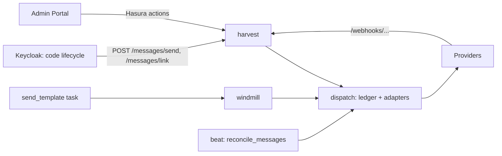

<!--
SPDX-FileCopyrightText: 2026 Sequent Tech Inc <legal@sequentech.io>
SPDX-License-Identifier: AGPL-3.0-only
-->

Codes, enrollment results, credentials and reminders reach voters by email,
SMS, WhatsApp, Viber or Messenger through one sending path shared by
Keycloak and bulk sends. The administrator's view is described in
[Messaging Channels](../../02-election_managers/02-reference/13-messaging-channels.md).

## Components

| Where | What |
|---|---|
| `sequent-core/src/types/messaging.rs` | Channels, purposes, providers and their capabilities, the attempt state machine, account readiness, the event configuration, its validation and its public projection, and the internal API payloads |
| `packages/messaging` | Provider adapters behind `ChannelSender`, `preflight`, attempt decisions, destination masking and keyed digests, Messenger link references, per-account rates, and webhook verification and parsing. No database access |
| `windmill/src/postgres/messaging.rs` | Accounts, the `message` ledger and `messenger_link` |
| `windmill/src/services/messaging` | Credentials, event configuration, `deliver`, webhooks, links and reconciliation |
| `harvest/src/routes/messaging.rs` | Internal, admin and webhook routes |
| `keycloak-extensions/message-otp-authenticator/.../messaging` | The `messageSender` SPI and its `harvest` implementation |

Keycloak stays the authority on codes: it generates, expires, counts
attempts and replaces them. Harvest only transports them; a delivery report
never authenticates a voter.

## Sending

`deliver` handles one logical message, identified by a `logical_key` that is
stable across retries (`send-template:<task id>:<voter>`, `keycloak:otp:<code
id>`):

1. Read the attempts recorded for the key and decide (`attempts::decide`):
   send on a channel, stop because one was accepted, wait for reconciliation
   because one is queued or unknown, retry later, or give up.
2. Choose the account: the event's, else the tenant default, else the
   environment transports for email and SMS.
3. Run `preflight`: recipient kind, purpose, approved template, conversation
   window, allowed calling codes, code expiry. A refusal is recorded as a
   failed attempt and never reaches the provider.
4. Insert the attempt as `QUEUED` and commit.
5. Wait for the account's rate (codes have reserved headroom), send, and
   record `ACCEPTED`, `FAILED` or `UNKNOWN`.

Timeouts, lost responses and 5xx answers are `UNKNOWN`. SDK retries are
disabled so that only the ledger decides. Notices fall back to the event's
order among the voter's verified, eligible channels after confirmed
failures; transient failures are retried up to three times with backoff by
re-enqueuing `send_template` for that voter with the same `send_id`. Codes
never retry or fall back.

States only move along `MessageAttemptState::can_transition_to`, enforced in
SQL, so late or repeated reports cannot regress a delivered message.

## Providers by configuration

A released version cannot change, while provider agreements arrive later,
so nothing about a provider is decided in code:

- `MessagingProvider::HTTP_API` (`providers/http_api.rs`) sends on any
  channel from an `HttpApiSender`: request templates with placeholders, an
  optional token exchange or minted JWT, a check, report mapping by JSON
  pointer and reconciliation. Its capabilities (template-required purposes,
  conversation window, delivery feedback) come from the account, through
  `AccountSender::capabilities`.
- `ReadinessPolicy::ADMIN_CONFIRMED` makes an account ready on the
  administrator's word when the provider's check cannot tell.
- `EventMessagingConfig::template_for(channel, purpose, key, language)`
  picks the provider template: the key in the language, then the key, then
  the purpose in the language, then the purpose. `SendMessageRequest.template_key` carries the key
  (`OTP_TEMPLATE_KEY` for codes, a template's alias for bulk sends), and the
  binding's `provider_language` is what the provider receives.
- `OutOfWindowPolicy::UTILITY_MESSAGES` lets `preflight` pass a bound
  template outside the conversation window; Messenger then sends it as a
  utility message.
- WhatsApp and Messenger accounts take `api_base_url`.

Add a built-in adapter only when a provider cannot be described this way.

## Webhooks

| Route | Verification |
|---|---|
| `GET /webhooks/meta/<key>` | Meta subscription handshake against the generated verify token |
| `POST /webhooks/meta/<key>` | `X-Hub-Signature-256` with the account's app secret |
| `POST /webhooks/viber/<key>` | Infobip does not sign reports: the unguessable key, and only attempts of that account change |
| `POST /webhooks/aws/<key>` | SNS signature with a certificate from an SNS endpoint, and the configured topic |
| `POST`, `GET /webhooks/http/<key>` | What the account's `reports.auth` says: URL key, header secret, HMAC-SHA256 or HS256 token. `GET` reports are read from the query string |

The account always comes from the key, never from the payload; entries for
another business account, number or Page are dropped. Inbound messages are
recorded as metadata only.

## Messenger links

`/messages/link` stores digests of a random reference, a link word, the
authentication session and the challenge, and the code encrypted with the
master key. The reference lives at most ten minutes and never longer than
the code. When the voter opens the Page with the reference (or types the
word), the webhook binds that conversation, sends the code and deletes it.
`/messages/link/confirm`, called by Keycloak after the code was accepted in
the original session, returns the Page-scoped ID to store on the voter. A
new link for the session replaces the previous one.

## Configuration

| Setting | Where | Purpose |
|---|---|---|
| `HARVEST_PUBLIC_URL` | harvest, windmill | Public base URL providers call back; per-request callbacks are omitted without it |
| `MESSAGE_SENDER_POLICY` or `--spi-message-sender-auto-policy` | Keycloak | `HARVEST_WHEN_CONFIGURED` (default) routes messaging-app channels through harvest when its address is known; `KEYCLOAK_ONLY` keeps email and SMS only. Read at run time by the `auto` sender, so the built image needs no rebuild. An unreadable value means `KEYCLOAK_ONLY` |
| `sequent.message-sender-policy` | Realm attribute | The same two values for one realm; it cannot undo the deployment's `KEYCLOAK_ONLY` |
| `--spi-message-sender-harvest-url` | Keycloak | Harvest base URL, `http://$HARVEST_DOMAIN` by default |
| `--spi-message-sender-harvest-channels` | Keycloak | Channels sent through harvest, `WHATSAPP,VIBER,MESSENGER` by default |
| `reconcile_messages_interval` | beat | Seconds between reconciliation passes, 300 by default |

Credentials live in `sequent_backend.secret` under
`messaging-account-<id>-<NAME>`; per-tenant digest keys under
`messaging-destination-key-<tenant>` and `messaging-link-key-<tenant>`.

## Tests

- `cargo test -p messaging`: adapters against a loopback HTTP peer, webhook
  verification, decisions and rates.
- `cargo test -p windmill --test postgres_messaging --test
  postgres_messaging_dispatch` against PostgreSQL (see the
  [windmill test guide](../08-windmill/test-coverage.md)): persistence,
  replays, fallback, lost answers, signed reports and Messenger links. Set
  `MASTER_SECRET` as well.
- `mvn -f packages/keycloak-extensions/pom.xml test`: the SPI, channel
  choice, attempts and Messenger linking.
