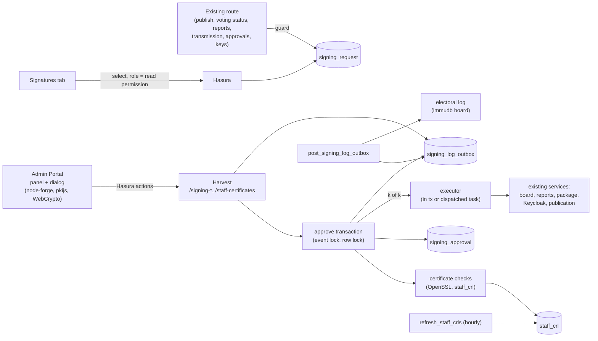
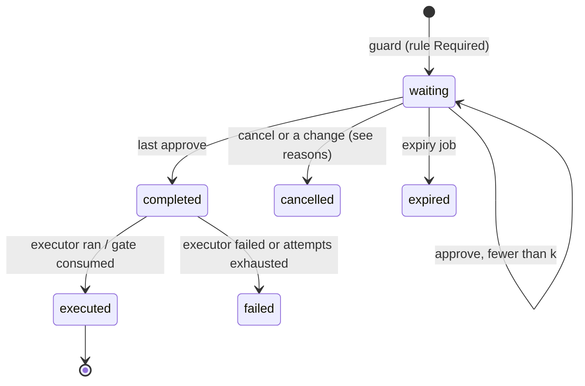

<!--
SPDX-FileCopyrightText: 2026 Sequent Tech Inc <legal@sequentech.io>
SPDX-License-Identifier: AGPL-3.0-only
-->

Protected actions run only after enough authorized people sign them with their digital
certificates ([user guide](../../02-election_managers/02-reference/02-election-event/16-signatures/01-election_management_election-event_signatures.md)).
The catalog of actions is product code; whether each needs signatures, how many and who may
sign is election event configuration. The rule `NotRequired`, the default for every action,
keeps each route's behaviour unchanged.

- **sequent-core** (`signing` module) holds the shared contract: the actions and their
  traits, the rule and check enums, the canonical payload and the signing code. It
  compiles to WASM too, so the portal and the server agree on names.
- **Windmill** does the work: the guard used by existing routes, the approve transaction,
  certificate verification and revocation lists, PDF signature revisions, one executor per
  action, the log outbox worker and the beat jobs.
- **Harvest** exposes the signing routes, checks permissions (403 on a missing one) and
  calls the Windmill services. Existing routes call the guard and answer an optional
  `signing_request`.
- **Hasura** gives the settings tab select-only access to the signing tables, filtered by
  the read permission and the user's permission labels; every write goes through Harvest
  actions.
- **The Admin Portal** signs in the browser: it opens the `.p12`, keeps the key
  non-extractable in WebCrypto and sends only signatures and the certificate chain.
- **Keycloak** holds the 21 permissions as realm roles; who can sign is a `sign-<action>`
  role on groups.
- **The electoral log** receives a USER and a SYSTEM entry for every step.

## Code map

| Where | What |
|---|---|
| `packages/sequent-core/src/signing/` | `types.rs` (`SigningAction` with `sign_permission`, `scope`, `mode`, `document`, `group`; `SigningRule`, `SigningChecks` and the policy enums), `canonical.rs` (canonical JSON, `SigningPayload`), `code.rs` (signing code, payload hash). |
| `packages/windmill/src/services/signing/` | `guard.rs`, `approve.rs`, `requests.rs` (panel, cancel, handover, open failures, expiry, export, sweeper, claims), `rules.rs`, `signers.rs` (eligible signers from the Keycloak database), `executors.rs`, `certificates.rs`, `crl.rs`, `issuers.rs`, `staff_certificates.rs`, `pades.rs` and `pdf.rs` (PDF revisions), `key_shares.rs` (trustee gates), `actions/` (executors of the voting, configuration, voter, transmission and report actions), `log.rs` (outbox staging), `permissions.rs` (`SigningPermissionChanged`), `configuration.rs` (export and import). |
| `packages/windmill/src/postgres/signing*.rs` | Queries and row types of the signing tables. |
| `packages/windmill/src/tasks/` | `signing_log_outbox.rs`, `signing_requests.rs` (expiry and sweeper), `refresh_staff_crls.rs`, `run_signed_action.rs`, `migrate_realm_permissions.rs`. |
| `packages/harvest/src/routes/signing.rs`, `signing_certificates.rs` | The routes; `services/signing_http.rs` holds the error body and `authorize_403`; `services/access.rs` the role-permission edit policy. |
| `hasura/migrations/backend-db/` | `1790640000003_create_signing_tables`, then additive migrations: `…0004_signing_log_outbox_last_attempt`, `…0005_signing_request_execution_claims`, `…0400_staff_crl_last_good_fetch`, `…0700_signing_document_revision_inputs`. |
| `packages/admin-portal/src/lib/signing/` | `certificate.ts` (open a `.p12`, sign), `cms.ts` (detached CMS for PDFs), `der.ts`, `api.ts` (typed calls), `types.ts` (mirror of the Rust types). |
| `packages/admin-portal/src/components/signing/` | `SigningProvider` and `useSigningRequest()`, `SigningRequestPanel`, `SigningDialog`, `SigningHandoverLauncher`, `useSigningPermissions()`. |
| `packages/admin-portal/src/resources/ElectionEvent/Signatures/` | The Signatures tab: `ProtectedActionsTab` and `RuleDrawer`, `CertificatesTab`, `RequestsTab`; `src/queries/SigningSettings.ts`. |
| `packages/windmill/external-bin/janitor/` | `templates/COMELEC/signing.json` and `signing_preset.py`: the sample tenant template's rules, checks and titles. |

The [API contract](./02-signing-api.md) describes the routes and the panel.

## Data model

Every table has `tenant_id`, `election_event_id` (cascading from the election event),
`created_at`, and enums stored as kebab-case text with CHECK constraints. Child rows
reference their parents with composite keys that include the tenant and the event, so a row
can't point across events. Timestamps written by the database use `clock_timestamp()`.

| Table | Holds |
|---|---|
| `signing_rule` | One row per (event, action): `requirement`, `signatures`, `requester_signing`, `expires_minutes` (null = no limit), `revision`. A missing row is `NotRequired`. |
| `signing_checks` | One row per event: `revocation_check`, `crl_unavailable`, `registration`, `post_binding`, `revision`. |
| `signing_request` | The action, Post (`election_id`), country (`area_id`), `trustee_id`, `scope_key`, `subject`, the exact `canonical_payload` and its SHA-256, the document and its SHA-256, `code`, configuration and rule revisions, `rule_snapshot`, `required`, `status`, cancel reason, requester, expiry, completion and execution times, `execution_result`, the task and its claim (`execution_started_at`, `execution_attempts`), `permission_label`. A partial unique index allows one `waiting` request per (event, action, `scope_key`). |
| `signing_approval` | One signature: user, certificate, chain, `fingerprint_sha256`, `spki_sha256`, `holder_sha256`, algorithm, `payload_signature`, `document_signature` or `pdf_cms`, `revocation_status`. Unique per request on each of user, fingerprint, key and holder. |
| `signing_document_revision` | PAdES revisions of a request's PDF: `base`, `prepared` and `signed` rows with the field, parent hash and digest. |
| `staff_certificate` | Registrations: person, Post, fingerprint, key, holder, serial, subject, issuer, validity, PEM, status, how and by whom registered or revoked, and `linked_to` for a second account of the same person. |
| `staff_crl` | Downloaded revision lists per staff issuer and URL, with their dates and status. |
| `signing_log_outbox` | Two rows per step (USER and SYSTEM) waiting to be posted to the electoral log. Not tracked in Hasura. |
| `certificate_authority.purpose` | `voter-sign-in` (default) or `staff-signatures`. Voter queries and roles filter `voter-sign-in`. |

The Post is an `election`, the country an `area`. `signing_rules` and `signing_checks` are
optional fields of the election event export and import bundle; staff issuers travel in
their own `export_staff_issuers-<event>.pem`.

## A request's life

### Guard

An existing route calls `guard` (usually through a small per-action helper) with the
caller, the action, the scope (Post, country, trustee, subject key), the subject and, for
documents, the document id and hash.

- `NotRequired`: `Proceed`; the route runs as before.
- `Required`: under an advisory lock on (event, action, scope key), it returns the same
  waiting request when nothing changed (subject, document, configuration and rule
  revisions), or cancels the old one (`payload-changed`, or `superseded`) and builds a new
  one from `SigningPayload`. It stages `SigningRequestCreated`. The route answers its usual
  output plus `signing_request {id, code, required, expires_at}`.

### Approve

`approve` runs in one transaction that the service owns, so a refusal commits its log:

1. The event's signing lock, then `SELECT … FOR UPDATE` on the request. It must be waiting
   and not overdue (an overdue request is expired and logged).
2. Authorization: the `sign-<action>` role, Post access (no labels, an unlabelled Post, or
   the Post's label), not already signed, the requester only if the rule snapshot allows
   it, and for trustee actions the request's trustee. Refusals are logged as ERROR.
3. Certificate checks ([below](#certificate-verification-and-revocation-lists)). A refusal
   stages `SigningSignatureRefused` and answers 422 with the check id.
4. First use registers the certificate (`SigningCertificateRegistered`).
5. The document signer (PDF or EML) verifies and embeds the document signature, and the
   approval is inserted, in one savepoint. `SigningRequestSigned` (k of n).
6. At k = n, it re-checks under `FOR SHARE` that every counted certificate is still
   active, sets `completed` and stages `SigningRequestCompleted`. For a `Deferred` action
   it calls the executor in a savepoint; for a `Gate` action (the trustee steps) it stops
   there.
7. Commit, run post-commit tasks, kick the outbox worker.

The request row lock serializes approvals, so two final signatures give one completion and
one execution; the unique constraints are the backstop.

### Executors, claims and the sweeper

A `SigningExecutor` either runs the action in the approve transaction (`Executed`) or, when
it reaches outside the database (the board, S3, Keycloak, e-mail), inserts a
`tasks_execution` row and answers `Dispatched` with a task that is sent after the commit.

The task (`run_signed_action`) first claims the execution in its own transaction
(`claim_dispatched`: a lease of 15 minutes, at most 3 claims). A copy that can't claim
does nothing. It then runs, in one transaction, the event's signing lock, the effect and
`finish_dispatched` (`executed` with its result and `SigningActionExecuted`), so the
effect and its record commit together. On an error it rolls back and records the failure.

`sweep_signing_executions` (beat, every 60 s) re-sends completed requests that are not
executed after 2 minutes and whose claim is missing, stale or failed; a request claimed 3
times fails. `expire_signing_requests` (beat, every 60 s) expires overdue waiting requests,
logging `SigningRequestExpired` with the requester as the USER.

Gate actions: the trustee route first answers `signing_request`; once it is completed the
portal calls the route again with `signing_request_id`, and the route calls `consume_gate`
(same caller, same subject) to mark it executed in the transaction that runs the step.

### Locking and ordering

- Every signing write transaction takes the per-event advisory lock (`lock_signing_event`)
  before any row lock. `stage()` and the outbox snapshot take it too, so the log order is
  the commit order and multi-request operations can't deadlock.
- Approve holds the staff certificate row `FOR SHARE`; revoke takes it `FOR UPDATE`.
- First-use registration takes advisory locks on (tenant, key) then (tenant, holder).

### One person, one slot

Each approval records four identities: the account, the certificate's fingerprint, the key
(SPKI hash) and the holder (hash of a canonical subject: trimmed, collapsed, case-folded,
RDN order kept). Per request each identity signs once (`already-signed`). A key or holder
belongs to one account across the tenant (`registered-to-other`), unless an officer links
a second account of the same person (`linked_to`); linked accounts still sign once per
request.

### Rule changes

`put_rule` checks lockdown, validates the rule, computes the capacity the role changes
would give, takes the event lock and checks `expected_revision`, writes the database, then
changes the Keycloak groups last (with a timeout, compensating on failure). It cancels
every waiting request of the action (`rule-changed`) and stages `SigningRuleChanged` and,
per role change, `SigningPermissionChanged` in every event with a rule for the action.

Signers (`signers.rs`) are read from the Keycloak database: users holding `sign-<action>`
directly or through a group, with their permission labels and a `title` attribute
(falling back to the group name).

## Log outbox and worker

`signing::log::stage(tx, LogStep)` writes two outbox rows with one `step_id` in the step's
transaction: USER (with `user_id` and `username`; for an expiry, the requester) and SYSTEM
(INFO, or ERROR for a refusal or failure). Each carries a short English description, the
scope, and details (`election_id`, `area_id`, `action`, `request_id`, `code`; signatures
add the certificate, the signature and the count). A committed step therefore always has
both entries.

`post_signing_log_outbox` (beat every 5 s, set with `--signing-log-interval`; also kicked
after each committing step) posts them per event: a short transaction under the event lock
takes a snapshot of the last unposted id; then, under a worker-only try-lock, rows up to it
are posted in id order with board delivery receipts
(`delivery_id = sha256("signing:{step_id}:{event_type}")`), so a lost answer never posts
twice. A failure stops that event's queue, to keep order, and retries with exponential
back-off (at most 10 minutes). USER entries are signed with the person's admin key
(`ElectoralLog::for_admin_user`), SYSTEM entries with the system key.

The 16 statement kinds are appended to `StatementType`, with one body variant
`StatementBody::Signing`. The Logs tab labels the USER/SYSTEM column **Event type**, and
its CSV export adds `event_type` and `log_type`.

## Certificate verification and revocation lists

`OpensslCertificateVerifier` (`certificates.rs`) returns every check from loaded data:

- **trusted-issuer**: an `X509Store` of the event's staff issuers as anchors (an imported
  intermediate is an anchor too), intermediates from the browser and from non-self-signed
  issuers, purpose ANY. Security level 2 (no SHA-1 or MD5), RSA leaves of at least 2048
  bits. A CA certificate never signs as a person.
- **valid-now**, **signing-key-usage** (digitalSignature or nonRepudiation must be
  present; an EKU, when present, must allow signing).
- **not-revoked**: every non-anchor certificate of the path needs a current list signed by
  its issuer. Without one, `Refuse` fails and `AcceptUnchecked` passes with
  `revocation_status = unchecked`.
- **registered**, **registered-to-other**, **already-signed**, **post-binding** (`OnePost`
  binds a key on its first Post-scoped signature in the event).
- **signature**: the payload signature (RSA PKCS#1 v1.5 or ECDSA P-256 DER, SHA-256) over the
  canonical payload, plus the EML signature for transmissions. The dry run
  (`check-certificate`) omits it.

Revocation is of the key, tenant-wide: every active registration with that SPKI is revoked
and logged in its event, every waiting request it signed is cancelled
(`certificate-revoked`), and a revoked fingerprint or key never signs or registers again.

Revocation lists (`crl.rs`): only the certificate's own distribution points; delta,
partitioned and indirect lists are ignored; a list never moves backwards (thisUpdate and
CRLNumber); lists without nextUpdate expire after 7 days. Downloads run outside
transactions, reach only public addresses (plus `SIGNING_CRL_ALLOWED_HOSTS`, a comma
separated list for on-premises deployments), follow no redirects and are capped in size
and time. `refresh_staff_crls` runs every `STAFF_CRL_INTERVAL` seconds (default 3600); the
dry run downloads missing or stale lists of the path first, with a 5-minute back-off after
a failure.

## PDF signatures (PAdES)

When an election returns or report action is `Required`, the report hook appends a
signature page with one empty signature field per required signature (lopdf, classic xref
table, `SigFlags 3`) and stores it as the request's **base** revision. The report is not
released, not password-encrypted and not mailed until the request is executed.

For each signer:

1. `pdf-prepare` builds an incremental update filling the next field: a `/Sig` dictionary
   (`/Adobe.PPKLite`, `/ETSI.CAdES.detached`, `/M`, a 16 KiB `/Contents` placeholder,
   `/ByteRange`) and an appearance ("Digitally signed by *CN*", the account's name when it
   differs, the signer's title, the time in the event's zone, the issuer's CN, the code and
   the SHA-256 of the base revision). It stores the appearance inputs and the digest, not
   the bytes, and answers `{revision, digest_b64, signing_time}`. A refusal is logged as
   approve logs it, including a request whose action signs no PDF (`document`).
2. The browser builds a detached CMS over the digest with pkijs (contentType,
   messageDigest, signingCertificateV2; no signingTime).
3. `approve` rebuilds the revision deterministically, checks it extends the latest signed
   revision (else 409 `stale-revision`, and the client prepares again), verifies the CMS
   with the `CMS_CADES` flag and a PAdES profile check, embeds it and stores the revision as
   `signed`.

The page and the appearances are printed in the election event's default language, else
the tenant's, else English. Their texts live in
`packages/windmill/src/services/signing/signature_page_texts.toml`, one table per language
code, not in the portal's translations.

On execution the latest signed revision is released as the report's document; its SHA-256
goes in `SigningActionExecuted`. A base PDF must have exactly `required` empty fields, and
documents with voter secrets or a password are refused as signing documents.

## Report storage and access

Report definitions configure generation and scheduling; they are not a history of outputs.
Every generation, including Preview, uploads a document and records its ID. Without signing,
that document is released immediately. With signing, the private base and accepted signed
revisions remain stored; prepared revisions store reconstruction metadata rather than PDF
bytes. Successful execution publishes a final copy at the output ID allocated for that run.
Configured encryption wraps that copy after signing, preserving the inner PDF signatures.

Regeneration does not delete earlier documents. Cancelling or expiring a request preserves
its documents and approvals without releasing the held report. Deleting a report definition
removes its configuration/schedule, not its generated files. There is no report-specific
age-based cleanup in this flow. Download-link expiry is not document expiry. Event cleanup
deletes the event storage prefix, but public document keys use a tenant/document prefix;
public report objects can therefore remain after event deletion.

The completed panel is available to any authorized request reader, not only its last signer.
Its download needs document access. The Requests tab can reopen executed requests; the
header list and `ReportRequestLinks` expose pending requests only. Reports has no generated
output history. A signer without Requests-tab access has no normal Reports/header route
back to an executed report. `useReportTaskSigningRequest` stops polling on a request ID or
SUCCESS/FAILED/CANCELLED, while retaining an annotation returned with the final response.
The header badge uses explicit reloads, with no subscription or periodic polling.

## Admin Portal widget

- `lib/signing/certificate.ts` opens the file with node-forge (PBES2/AES, 3DES, RC2;
  strict parsing so a truncated file isn't reported as a wrong password; UTF-8 passwords),
  parses certificates with pkijs (RSA and EC), imports the key into WebCrypto as
  non-extractable and signs. The crypto module is loaded with `import()` when the dialog
  opens.
- `SigningProvider` and `useSigningRequest().open(id, {sign?})` open the panel from
  anywhere; routes that answer `signing_request` call it.
- The panel validates the server's data against the canonical payload: what the dialog
  shows is read from the payload, and the document is downloaded and its hash compared.
- The dialog is a state machine: Check, Certificate (choose, open, dry-run checks), Signed.
  By document kind it signs the payload only, adds a CMS over the prepared PDF digest
  (re-preparing once on 409), or adds a signature over the EML bytes.
- Handover posts `handover`, stores `signing:resume` in `sessionStorage` and signs out
  with a redirect to the same URL; `SigningHandoverLauncher` reopens the panel and dialog
  after the next sign-in.
- Every text is a translation key under `signing.*`; action labels, descriptions and
  "Applies to" can be overridden per tenant, and messages that name the organization use
  the tenant's display name (Settings > Look & Feel).
