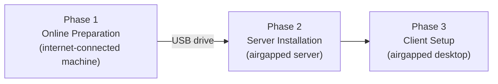
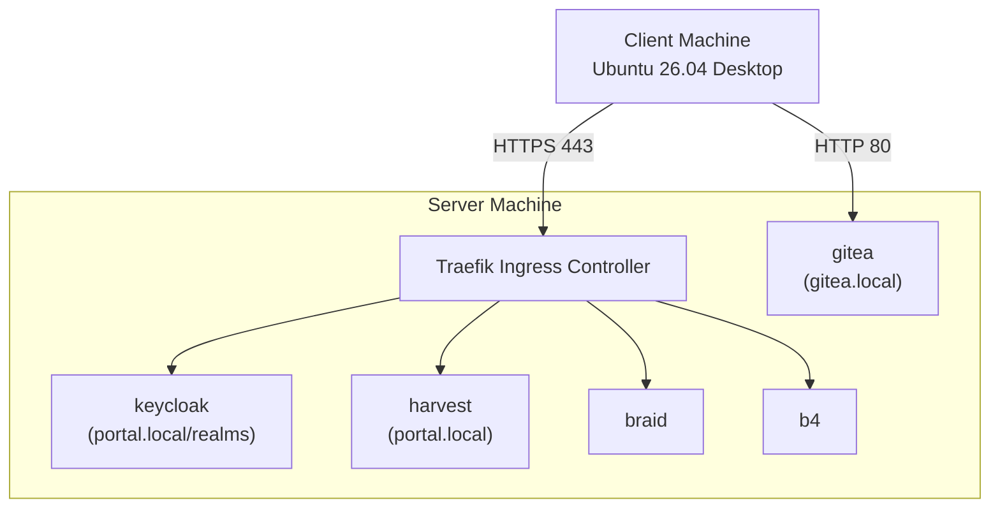

<!--
-- SPDX-FileCopyrightText: 2026 Sequent Tech Inc <legal@sequentech.io>
SPDX-License-Identifier: AGPL-3.0-only
-->

# Part 2: Preparative Procedures (AGD_PRE)

*Sequent Voting Platform – uniWAHL Version | User Manual*

## 2.1 Overview

This part describes how to install and configure the TOE in preparation for operation. The TOE is deployed in a **completely offline (airgapped) environment** — the server machine has no internet connection during or after installation. All required software is prepared in advance on a separate online machine and transferred via USB drive.

The deployment process has three phases:



**Three machines are involved:**

| Machine | OS | Role | Internet? |
|---|---|---|---|
| Online Preparation Machine | Ubuntu 26.04 LTS | Bundles all required software | Yes (before lab) |
| Server Machine | Ubuntu 26.04 LTS Server | Runs the TOE | **No** |
| Client Machine | Ubuntu 26.04 LTS Desktop | Accesses the TOE | **No** |

:::warning
The Server Machine must never have an active internet connection once the lab environment is established. All software, container images, and configuration is delivered via USB.
:::

## 2.2 Prerequisites

### 2.2.1 Hardware Requirements

| Component | Minimum |
|---|---|
| Server CPU | x86_64, 4 cores |
| Server RAM | 8 GB |
| Server Disk | 100 GB |
| USB Drive | 16 GB (for the ~3.5 GB image bundle + binaries) |

### 2.2.2 Software Requirements (Online Preparation Machine)

The following tools must be installed on the online preparation machine before running the bundle script:

| Tool | Version | Purpose |
|---|---|---|
| Bash | v5+ | Script execution |
| Coreutils | Any | Utility operations |
| Curl | Any | Downloading K3s, Kubectl, installation scripts |
| Docker CE | v25+ | Pulling and saving container images |
| Tar / Gzip | Any | Compressing the bundle |

Docker must be configured to run without `sudo` (user must be in the `docker` group).

### 2.2.3 Network Requirements

The Server Machine requires a **static IP address**. DHCP is not supported in the airgap environment. Choose a static IP appropriate for your lab network before beginning installation (e.g., `192.168.1.100`).

## 2.3 Phase 1: Online Preparation

Perform these steps on the **Online Preparation Machine**, before going to the offline lab.

### Step 1 — Clone the Repository

```bash
git clone https://github.com/sequentech/step.git
cd step
```

### Step 2 — Run the Preparation Script

```bash
./airgap/prepare.sh
```

This script downloads and bundles:
- K3s and Kubectl binaries
- Offline Debian packages (git, curl, jq, and dependencies)
- All required TOE container images, saved as a single tarball: `images/step-airgap-infra.tar` (~3.5 GB)

The output is written to an `airgap-output/` directory.

### Step 3 — Copy to USB Drive

```bash
cp -r airgap-output/ /media/$USER/<your-usb-drive-name>/
```

Verify the copy is complete before proceeding.

## 2.4 Phase 2: Server Machine Installation

Perform these steps on the **Server Machine** (offline).

### Step 1 — Configure a Static IP Address

Edit the Netplan configuration file:

```bash
sudo nano /etc/netplan/50-cloud-init.yaml
```

Set a static IP (replace `eth0` with your actual interface and `192.168.1.100` with your chosen IP):

```yaml
network:
  version: 2
  renderer: networkd
  ethernets:
    eth0:
      dhcp4: no
      addresses:
        - 192.168.1.100/24
      routes:
        - to: default
          via: 192.168.1.1
      nameservers:
        addresses:
          - 192.168.1.1
```

Apply:

```bash
sudo netplan apply
```

Note the static IP — you will need it in Phase 3.

### Step 2 — Copy Files from USB

```bash
cp -r /media/$USER/<your-usb-drive-name>/airgap-output/ ~/airgap-output/
cd ~/airgap-output
```

### Step 3 — Install the K3s Cluster

```bash
sudo ./manage.sh --setup-server
```

This installs K3s in single-node mode and configures the internal registry trust for the TOE's container images.

### Step 4 — Deploy TOE Components

```bash
sudo ./manage.sh --deploy
```

This loads all TOE container images and deploys the following components:

| Component | Role |
|---|---|
| `harvest` | Main backend — manages election data and API |
| `windmill` | Background worker — async processing |
| `keycloak` | Identity and access management |
| `ballot-verifier` | Individual ballot verification |
| `election-verifier` | Full election result verification |
| `braid` | Trustee cryptographic operations |
| `b4` | Immutable bulletin board |

Images are imported from `images/step-airgap-infra.tar` automatically — no internet pull occurs.

## 2.5 Phase 3: Client Machine Setup

### Step 1 — Install CLI Tools from USB

```bash
cd airgap-output
sudo ./manage.sh --setup-client
```

### Step 2 — Configure the Hosts File

```bash
sudo nano /etc/hosts
```

Add (replacing `192.168.1.100` with your server's actual IP):

```
192.168.1.100    portal.local gitea.local
```

## 2.6 Verifying Correct Installation

### 2.6.1 Service Access Map

| Service | URL | Protocol |
|---|---|---|
| Admin Portal | `https://portal.local` | HTTPS (port 443) |
| Keycloak (authentication) | `https://portal.local/realms/...` | HTTPS (port 443) |
| Gitea (source control + image registry) | `http://gitea.local` | HTTP (port 80) |

### 2.6.2 TLS Certificate

The deployment generates a self-signed TLS certificate for `portal.local` automatically. When accessing `https://portal.local` for the first time:

1. A privacy warning will appear — this is expected
2. Click **Advanced → Proceed to portal.local (unsafe)**
3. The browser will mark the session as Secure, enabling Keycloak authentication

:::note
The self-signed certificate is specific to the airgap lab environment. In production, a CA-issued certificate should be used.
:::

### 2.6.3 Deployment Architecture



## 2.7 Security Considerations

- The USB drive must be handled as a secure medium — restrict access to authorized personnel
- Physical access to the Server Machine must be restricted to authorized system operators during installation
- The default Gitea admin username (`admin`) and password (`admin123`) must both be changed immediately after first login
- Once the airgap environment is established, no internet-connected devices should be introduced to the server network
