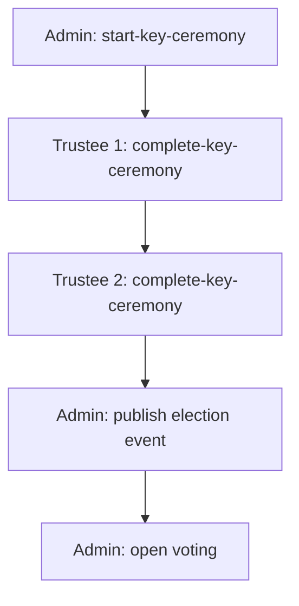
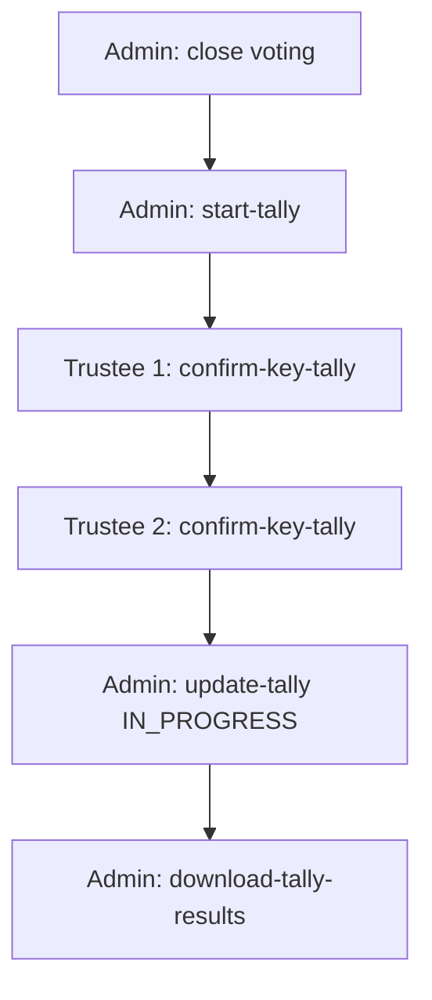

<!--
-- SPDX-FileCopyrightText: 2026 Sequent Tech Inc <legal@sequentech.io>
SPDX-License-Identifier: AGPL-3.0-only
-->

# Part 3: Operational User Guidance (AGD_OPE)

*Sequent Voting Platform – uniWAHL Version | User Manual*

## 3.1 Overview

This part describes how to operate the TOE securely. All operations are performed via the `step` CLI. No graphical interface is part of the TOE — the Admin Portal UI is out of scope.

The election lifecycle follows this sequence:


**Roles involved:**

| Role | Responsibility |
|---|---|
| **Admin** | Creates and manages the election event; starts and updates ceremonies |
| **Trustee** | Holds a cryptographic key share; must participate individually in both ceremonies |

---

## 3.2 Configuring the CLI

Before any operation, the CLI must be configured to point to the correct system and authenticate.

```bash
cli step config \
  --tenant-id <your-tenant-id> \
  --endpoint-url https://portal.local/hasura/v1/graphql \
  --keycloak-url https://portal.local/realms \
  --keycloak-user <username> \
  --keycloak-password <password> \
  --keycloak-client-id api-key-client \
  --keycloak-client-secret <client-secret>
```

This creates a local configuration file and stores authenticated credentials for subsequent commands.

:::note
Most commands require an admin user. Trustee operations require re-running this command with trustee credentials. Each user must authenticate individually — credentials must never be shared.
:::

---

## 3.3 Election Event Setup (Admin)

### Step 1 — Create an Election Event

An Election Event is the top-level container for the entire electoral process.

```bash
cli step create-election-event \
  --name "Works Council Election 2026" \
  --description "Annual works council election" \
  --encryption-protocol RSA256
```

Save the Election Event ID from the output — it is required in all subsequent steps.

### Step 2 — Create an Election

An Election is a specific voting activity within the Event.

```bash
cli step create-election \
  --name "Works Council Election" \
  --external-id "works-council-2026" \
  --description "Works council representative election" \
  --election-event-id <election-event-id>
```

### Step 3 — Create a Contest

A Contest is a specific race or ballot question within an Election.

```bash
cli step create-contest \
  --name "Works Council Representative" \
  --description "Select your representative" \
  --election-event-id <election-event-id> \
  --election-id <election-id>
```

### Step 4 — Add Candidates

Add each candidate or option to the contest. Repeat for each candidate.

```bash
cli step create-candidate \
  --name "Candidate Name" \
  --description "Candidate description" \
  --election-event-id <election-event-id> \
  --contest-id <contest-id>
```

### Step 5 — Create an Area

An Area defines the geographic or organizational scope of the election.

```bash
cli step create-area \
  --name "Company Name GmbH" \
  --election-event-id <election-event-id>
```

### Step 6 — Assign Contest to Area

```bash
cli step create-area-contest \
  --election-event-id <election-event-id> \
  --contest-id <contest-id> \
  --area-id <area-id>
```

### Alternative: Import from Configuration File

Instead of creating the event manually step-by-step, you may import from a pre-prepared JSON configuration:

```bash
cli step import-election \
  --file-path ./data/election-event-config.json \
  --is-local
```

### Export / Backup

Back up the election event configuration at any time:

```bash
cli step export-election-event \
  --election-event-id <election-event-id> \
  --include-voters \
  --bulletin-board \
  --encrypted
```

---

## 3.4 Keys Ceremony

The Keys Ceremony is a formal cryptographic procedure in which trustees jointly generate the public key used to encrypt votes. This ceremony must be completed before voting can open.



:::warning
Each trustee must participate individually. Trustees must never share credentials or complete each other's steps.
:::

### Step 1 — Admin: Start the Keys Ceremony

Authenticate as admin, then run:

```bash
cli step start-key-ceremony \
  --election-event-id <election-event-id> \
  --threshold <minimum-trustees-required>
```

The `--threshold` value sets the minimum number of trustees required to participate in the tally ceremony (default: 2). Save the Key Ceremony ID from the output.

### Step 2 — Each Trustee: Complete the Ceremony

Each trustee must re-configure the CLI with their own credentials, then run:

```bash
# Re-authenticate as this trustee
cli step config \
  --tenant-id <tenant-id> \
  --endpoint-url https://portal.local/hasura/v1/graphql \
  --keycloak-url https://portal.local/realms \
  --keycloak-user <trustee-username> \
  --keycloak-password <trustee-password> \
  --keycloak-client-id api-key-client \
  --keycloak-client-secret <client-secret>

# Complete the ceremony
cli step complete-key-ceremony \
  --election-event-id <election-event-id> \
  --key-ceremony-id <key-ceremony-id>
```

Repeat for each trustee.

### Step 3 — Admin: Publish the Election Event

Once all trustees have completed the ceremony, the admin publishes:

```bash
cli step publish \
  --election-event-id <election-event-id>
```

### Step 4 — Admin: Open Voting

```bash
cli step update-event-voting-status \
  --election-event-id <election-event-id> \
  --voting-status OPEN \
  --voting-channel ONLINE
```

---

## 3.5 Tally Ceremony

The Tally Ceremony is a formal cryptographic procedure in which trustees jointly decrypt and count the votes. This ceremony is performed after voting closes.



:::warning
As with the Keys Ceremony, each trustee must participate individually with their own credentials.
:::

### Step 1 — Admin: Close Voting

```bash
cli step update-event-voting-status \
  --election-event-id <election-event-id> \
  --voting-status CLOSE \
  --voting-channel ONLINE
```

### Step 2 — Admin: Start the Tally Ceremony

```bash
cli step start-tally \
  --election-event-id <election-event-id> \
  --tally-type ELECTORAL_RESULTS
```

To tally specific elections only (omit `--election-ids` to tally all):

```bash
cli step start-tally \
  --election-event-id <election-event-id> \
  --election-ids <election-id-1> \
  --election-ids <election-id-2> \
  --tally-type ELECTORAL_RESULTS
```

Save the Tally Ceremony ID from the output.

### Step 3 — Each Trustee: Confirm Key

Each trustee re-configures the CLI with their own credentials, then runs:

```bash
cli step confirm-key-tally \
  --election-event-id <election-event-id> \
  --tally-id <tally-ceremony-id>
```

Repeat for each trustee.

### Step 4 — Admin: Update Tally Status

Once all trustees have confirmed their keys:

```bash
cli step update-tally \
  --election-event-id <election-event-id> \
  --tally-id <tally-ceremony-id> \
  --status IN_PROGRESS
```

### Step 5 — Admin: Download Results

```bash
cli step download-tally-results \
  --election-event-id <election-event-id> \
  --tally-id <tally-ceremony-id>
```

Results are saved to `./data/election_event_export.ezip` (encrypted) in the current working directory.

---

## 3.6 Verification by Auditors

After the tally, the election results can be independently verified using the TOE's verification components. These tools do not require trustee credentials and can be run by any authorized auditor.

- **ballot-verifier** — verifies that an individual ballot was correctly recorded and included
- **election-verifier** — verifies that the full election result is correctly computed from all recorded ballots

Both tools operate on data published to the bulletin board (`b4`) and require no access to the private key material.

---

## 3.7 Security Requirements for Operations

The following security rules apply during all operational phases:

- All ceremony steps must be performed in the airgapped environment — no internet connection permitted
- Each participant (admin, trustee) must authenticate individually with their own credentials before every ceremony step
- The election must not be modified after the Keys Ceremony is complete
- All CLI sessions must be closed and credentials cleared after each ceremony
- Ceremony logs from the `step` CLI must be preserved as part of the election record
