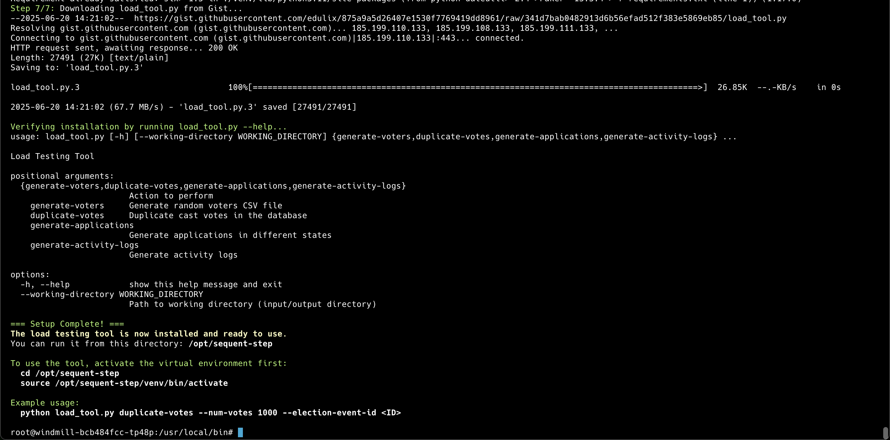

## Introduction

This tutorial will allow you to create an election with 1M voters, cast 1K votes
using a headless chrome web browser and then duplicate votes faster using the
step cli.

## Requirements

You need:
- Basic knowledge of command line terminal usage.
- [Kubectl installed][kubectl].
- A [kubeconfig file][kubeconfig] that gives access to the cluster. We'll assume
  it's in `~/.kube/prod1-euw1-kubeconfig.yml` throughout the tutorial.

## Duplicating votes

### 1. Access and Configuration

First we will set the path to the kubeconfig file so that we can use it for all
our `kubectl` plugins:

```bash
export KUBECONFIG=~/.kube/prod1-euw1-kubeconfig.yml
```

Let's review the windmill pods using the following command:

```bash
kubectl get pods -n dev-apps | grep "^windmill-[^-]*-[^-]*[[:space:]]"
```

The output should looks something like:

```bash
windmill-bcb484fcc-b9fs8                  1/1     Running   2 (8h ago)   14h
windmill-bcb484fcc-tp48p                  1/1     Running   1 (8h ago)   15h
windmill-bcb484fcc-wtntl                  1/1     Running   2 (8h ago)   13h
```

Please note that we are filtering for pods in `dev-apps` namespace. Change this
accordingly to the name of your environment. For example, the `ehu` environment
would require to use here the `ehu-apps`.

We can connect to any of these windmill pods using the following kind of
command. Please change the pod name and the namespace name accordingly:

```bash
kubectl exec -it windmill-bcb484fcc-tp48p -n dev-apps -- /bin/bash
```

This should give you a prompt very much like this:

```bash
root@windmill-bcb484fcc-tp48p:/usr/local/bin# 
```

Good! Now we are inside our windmill pod, let's install our load tool:

```bash
wget -qO- https://gist.githubusercontent.com/edulix/875a9a5d26407e1530f7769419dd8961/raw/ef164b724d8785d3aa2ef2b520faa9f5f66acb59/setup.sh | bash
```

The result of the installation should look like this:



Please notice that the instructions indicate that to use the load tool, anytime
we enter into a pod with this tool installed, we need to execute the following:

```bash
cd /opt/sequent-step
source /opt/sequent-step/venv/bin/activate
```

### 2. Executing the script

At this stage we are asuming we have:
1. The election event created.
2. The Keys ceremony has been executed.
3. The election event has been published.
4. The eligible voters have been loaded and there's enough voters to add more
   votes.
5. The voting period is open, so votes can be cast.
6. There's at least one vote cast.
7. The election allows revoting, because the votes are added randomly and
   otherwise in some cases more than 1 vote might be added for a single voter.

Given the above, we can just duplicate votes with a command like below, please
change the election event id accordingly:

```bash
cd /opt/sequent-step
source /opt/sequent-step/venv/bin/activate
python load_tool.py duplicate-votes \
  --num-votes 10 \
  --election-event-id 666ed45c-d35c-417c-a190-7e1ab41dd5d1
```

The election event id can be found in the admin portal in the URL of the
election event.

Please find below a short video that shows how we:
1. Enter the Dashboard of the Election Event, which currently has 400K voters
   and 12 votes cast today and 566 votes in total.
2. Copy the election event id from the Admin Portal URL.
3. Execute the `duplicate-votes` subcommand adding 10 votes.
4. Show in the Dashboard that 10 votes have been added, having now 22 votes
   cast today and 576 in total.

<video controls width="600">
  <source src="./assets/duplicate_votes_usage.mp4" type="video/mp4" />
  Your browser does not support the video tag.
</video>

[kubectl]: https://kubernetes.io/docs/tasks/tools/install-kubectl-linux/
[kubeconfig]: https://kubernetes.io/docs/concepts/configuration/organize-cluster-access-kubeconfig/
