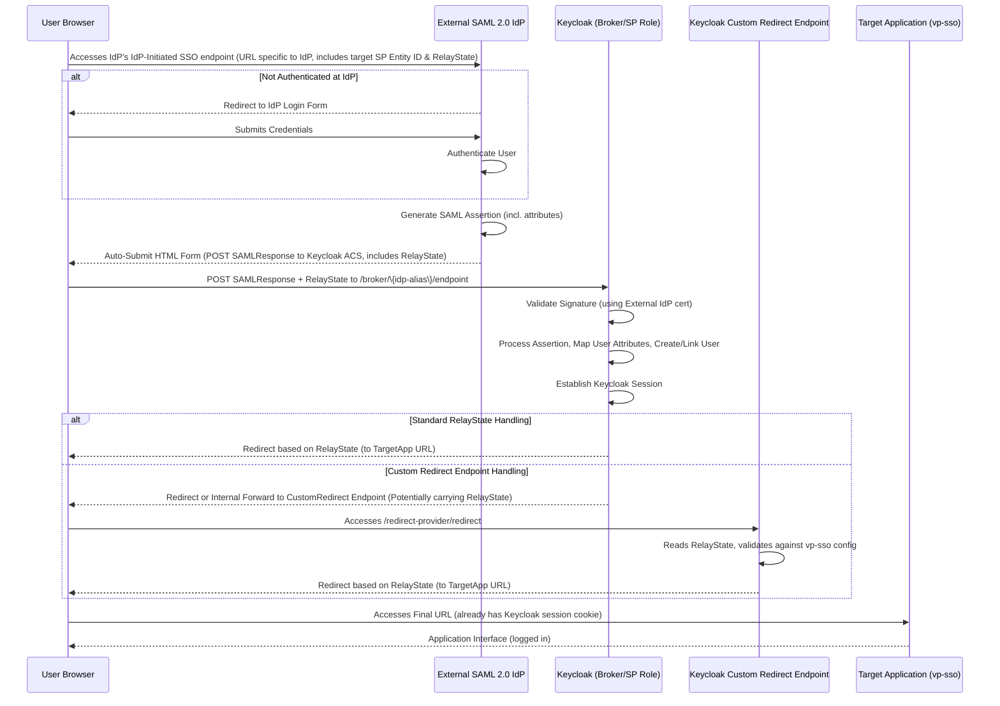

<!--
SPDX-FileCopyrightText: 2025 Sequent Tech <legal@sequentech.io>
SPDX-License-Identifier: AGPL-3.0-only
-->

# Generic IdP-Initiated SAML SSO with Keycloak as SP/Broker

## 1. Overview

This document outlines the design for implementing IdP-initiated Single Sign-On (SSO) where **Keycloak** acts as the Service Provider (SP) / Identity Broker, integrating with **any** external SAML 2.0 compliant **Identity Provider (IdP)**. The flow allows users to initiate login from the external IdP and be seamlessly logged into a target application configured within Keycloak (represented by the `vp-sso` client).

This design leverages Keycloak's robust identity brokering capabilities to establish trust with the external IdP based on SAML 2.0 standards. It also utilizes Keycloak's SAML client configuration to define the target application's parameters. A custom Keycloak provider (`SamlRedirectProvider`) is included to handle post-authentication redirection based on the `RelayState`.

## 2. Goals

* Enable users to initiate login from an external SAML 2.0 IdP.  
* Authenticate users against the external IdP's configured mechanisms.  
* Establish a session in Keycloak based on the successful authentication at the external IdP.  
* Map user attributes (defined by the SAML assertion) to the Keycloak user profile (e.g., email, username, groups).  
* Redirect the user to a predefined target application URL (`RelayState`) after successful brokered login via Keycloak.  
* Utilize specific SAML configurations (e.g., signing keys, endpoints) for the target `vp-sso` client within Keycloak.  
* Handle the final redirection using a custom Keycloak endpoint.

## 3. Non-Goals

* Implementation of SP-initiated SSO flow (where the user starts at the target application).  
* Detailed configuration steps for the **external IdP** (as this varies widely).  
* Complex attribute transformations beyond Keycloak's standard broker mappers.  
* High availability or clustering setup details for Keycloak or the external IdP.

## 4. Architecture and Components

1.  **User's Browser:** Initiates the request and handles redirects and POST/Redirect requests between the IdP and Keycloak.  
2.  **External SAML 2.0 IdP:**  
    * The primary **Identity Provider (IdP)** (e.g., ADFS, Okta, Shibboleth, another Keycloak instance, etc.).  
    * Handles user authentication according to its policies.  
    * Generates SAML 2.0 assertions containing user identity information.  
    * Signs SAML responses and/or assertions using its configured keypair.  
    * Must be configured to trust Keycloak as a Service Provider, knowing its Entity ID and Assertion Consumer Service (ACS) URL.  
    * Must support IdP-initiated SSO and allow sending unsolicited responses to Keycloak.  
3.  **Keycloak Instance:**  
    * Acts as a **Service Provider (SP) / Identity Broker** **for the external IdP**. It trusts the external IdP via a configured Identity Provider entry.  
    * Acts as an **Identity Provider (IdP)** **for the `vp-sso` client**.  
    * Receives and validates SAML assertions from the external IdP.  
    * Maps asserted user attributes to Keycloak user accounts (potentially creating users via the "First Broker Login" flow).  
    * Establishes a Keycloak user session.  
    * Contains the configuration for the target **`vp-sso` SAML Client**, defining its specific endpoints, signing keys, and IdP-initiated behaviour relative to Keycloak.  
    * Hosts the custom **`SamlRedirectProvider`** endpoint (`/redirect-provider/redirect`) for final redirection.  
4.  **Target Application (Represented by `vp-sso` client config):** The final destination service configured as a SAML client within Keycloak.

**Interaction Diagram:**

## 5. Flow Description (IdP-Initiated)

1. **Initiation:** The user accesses a specific URL provided by the **external IdP** designed for IdP-initiated SSO. This URL typically includes parameters identifying the target SP (Keycloak's Entity ID) and the desired final RelayState (target application URL).  
2. **Authentication at IdP:** The external IdP checks if the user has an active session.  
   * If not, it prompts the user to authenticate using its configured methods (e.g., username/password, MFA).  
   * The user authenticates.  
3. **Assertion Generation:** The external IdP generates a SAML 2.0 Response containing an Assertion with user identity attributes, audience restriction set to Keycloak's Entity ID, and signs it according to its configuration.  
4. **POST to Keycloak:** The IdP sends an auto-submitting HTML form to the user's browser, instructing it to HTTP POST the SAML Response and the RelayState value to Keycloak's Assertion Consumer Service (ACS) URL specific to the configured broker entry (e.g., /realms/\{realm\}/broker/\{idp-alias\}/endpoint).  
5. **Keycloak Processing (Broker Role):**  
   * Keycloak receives the POST request at its broker endpoint.  
   * It validates the SAML Response signature using the external IdP's public certificate (configured in Keycloak's Identity Provider settings).  
   * It parses the Assertion and extracts user attributes based on the configured Mappers.  
   * It processes the "First Broker Login" flow to find, create, or link the user in the Keycloak realm.  
   * It establishes an authenticated session for the user within Keycloak.  
6. **Final Redirection:**  
   * Keycloak handles the RelayState.  
   * **Scenario A (Standard):** Keycloak redirects the user's browser directly to the URL provided in the RelayState.  
   * **Scenario B (Custom Endpoint):** If Keycloak is configured (e.g., via the vp-sso client's ACS URL pointing internally, or post-login flows) to use the custom /redirect-provider/redirect endpoint, that endpoint handles validating the RelayState against the vp-sso client's allowed redirects and issues the final browser redirect.  
7. **Target Application Access:** The browser is redirected to the final RelayState URL. The user now has a Keycloak session cookie. If the target application (vp-sso) relies on Keycloak for authentication (either via SAML where Keycloak is IdP, or OIDC), it will recognize the session and grant access.

## 6. Key Configuration Details

### 6.1. External SAML 2.0 IdP

* **User Authentication:** Configured according to organizational requirements.  
* **SAML 2.0 Support:** Must support SAML 2.0 protocol.  
* **IdP-Initiated SSO:** Must have a mechanism/endpoint to initiate SSO, allowing specification of the target SP Entity ID and RelayState.  
* **Trust Configuration (SP Metadata):** Must be configured to trust Keycloak as an SP. This involves providing Keycloak's:  
  * Entity ID (e.g., http://keycloak-host/realms/\{realm\}).  
  * Assertion Consumer Service (ACS) URL (e.g., http://keycloak-host/realms/\{realm\}/broker/\{idp-alias\}/endpoint).  
  * Signing Certificate (Keycloak's realm certificate, if the IdP validates signed AuthnRequests).  
  * Required NameID format and attributes.  
* **Signing:** Must sign SAML Responses and/or Assertions using its private key.

### 6.2. Keycloak - Identity Provider (Broker Config)

* **Provider:** Add a new SAML v2.0 Identity Provider.  
* **Alias:** A unique name for this IdP configuration (e.g., external-idp).  
* **Endpoints:** Single Sign-On Service URL, Single Logout Service URL obtained from the external IdP's metadata.  
* **Entity ID:** The external IdP's SAML Entity ID.  
* **Signatures:** Want AuthnRequests Signed (optional, depends on IdP requirement), Validate Signatures=ON, external IdP's public signing certificate added to Validating X509 Certificates.  
* **Principal Identification:** Configure NameID Policy Format, Principal Type, and Principal Attribute based on what the IdP sends and how users should be identified in Keycloak.  
* **Mappers:** Create mappers (e.g., Attribute Importer, Username Template Importer) to map attributes from the IdP's assertion (SAML Attribute Name) to Keycloak user attributes (User Attribute Name).  
* **Flows:** Configure First Broker Login Flow.

### 6.3. Keycloak - Client (vp-sso)

* **Client ID:** vp-sso (Type: SAML).  
* **Role:** Acts as an SP *relative to Keycloak*.  
* **Endpoints:** Assertion Consumer Service POST Binding URL configured (potentially the custom redirect provider /redirect-provider/redirect). Root URL set.  
* **IdP-Initiated (Keycloak as IdP):** Enabled via IdP-initiated SSO URL Name (vp-sso) and IdP-initiated SSO RelayState (target application URL). *Note: This specific URL is for initiating login at Keycloak directly to access vp-sso, separate from the main external IdP-initiated flow.*  
* **Signatures:** Configured based on the target application's requirements (e.g., Client signature required, Sign Documents).  
* **Keys:** Can use realm keys or import client-specific signing keys.  
* **Client Scopes / Mappers:** Configured to include necessary information (like roles via role_list) in the SAML assertion Keycloak generates *for* the vp-sso application.

### 6.4. Custom Redirect Provider (SamlRedirectProvider)

* **Purpose:** Provides an explicit endpoint within Keycloak to handle the RelayState redirection, potentially adding validation logic tied to specific client configurations.  
* **Deployment:** Requires building a JAR and deploying to Keycloak.  
* **Integration:** Needs to be correctly invoked after the broker login flow, possibly by setting it as the ACS URL in the external IdP's configuration for Keycloak, or through custom authentication flows in Keycloak.

## 7. Security Considerations

* **Transport Security:** Use HTTPS for all endpoints (IdP, Keycloak, Target Application).  
* **Message Signing & Validation:** Ensure SAML messages (Assertions, Responses, Requests) are appropriately signed and validated by both the IdP and Keycloak broker using exchanged public certificates.  
* **Encryption:** Consider SAML assertion encryption if sensitive attributes are transmitted over untrusted networks.  
* **RelayState Validation:** Implement strict validation of the RelayState URL against an allowlist in Keycloak (either standard broker validation or within the custom provider) to prevent open redirect vulnerabilities.  
* **Certificate Management:** Securely manage private keys and monitor certificate validity periods.  
* **Audience Restriction:** Ensure the IdP correctly sets the Audience element in the SAML assertion to Keycloak's Entity ID, and Keycloak validates it.

## 8. Assumptions and Dependencies

* The external IdP is SAML 2.0 compliant and supports IdP-initiated SSO.  
* Metadata (or configuration parameters) can be exchanged between the external IdP and Keycloak administrators.  
* Network connectivity allows communication between all involved components.  
* If the custom redirect provider is used, it is correctly built and deployed.