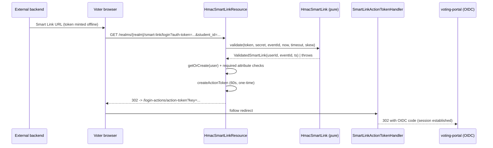

<!--
SPDX-FileCopyrightText: 2025 Sequent Tech <legal@sequentech.io>
SPDX-License-Identifier: AGPL-3.0-only
-->

# Smart Link (HMAC SSO) — Design & Implementation

## Document purpose

This document is for **Sequent developers**. It describes how the externally
generated, HMAC-based Smart Link is implemented as a Keycloak extension, why it
is separate from the existing email "magic link", and the security properties it
guarantees. For the integrator-facing contract, see the
[Smart Link SSO Integration](../../integrations/smart_link_integration_guide.md)
guide.

## 1. Overview

Smart Link lets an external application that already authenticated a voter send
them straight into an election. The external application's backend mints a
short-lived token, signed with a **symmetric secret** shared with Sequent, and
the voter follows a link carrying it. Keycloak verifies the token and
establishes the OIDC session.

This is the second-generation port of the first-generation IAM `smart-link`
auth method (`m_smart_link.py`). The **wire format is unchanged** so existing
generators keep working; what changes is where verification happens.

### Two different "Smart Links"

The codebase already contains a `smart_link` package implementing an **email
magic link**: Keycloak mints a signed _action token_, emails it, and the voter
clicks it. That token is **asymmetric** (realm keys) and **server-minted** — an
external app cannot produce it offline.

The feature in this document is the opposite trust model: a **symmetric**,
**client-minted** token verified with a shared secret. The two coexist; this one
is packaged as a separate Keycloak extension,
`smart-link-hmac-authenticator`, and reuses the existing action-token machinery
to finish the login (see §4).

## 2. Goals

- Verify an external `khmac:///sha-256;<hex>/<message>` token using a per-event
  shared secret, with the exact semantics of the first generation.
- Require, from the integrator, only a change of **host, election-event id and
  secret** — the token format is identical.
- Establish a normal Keycloak OIDC session for the `voting-portal` client.
- Be hardened: constant-time HMAC, reject expired **and** future-dated tokens,
  bind the token to one event, and never leak which check failed.

## 3. Non-goals

- No new token format or crypto — HMAC-SHA256 over the existing message only.
- No replacement of the email magic link or any other auth method.
- No census management — voters must already exist in the realm (authorization
  stays with Sequent, authentication with the external app).

## 4. Architecture and components

All Java lives in
`packages/keycloak-extensions/smart-link-hmac-authenticator/src/main/java/sequent/keycloak/authenticator/smart_link/hmac/`.

| Component | Responsibility |
| --- | --- |
| `HmacSmartLink` | Pure, JDK-only validation: parse the envelope, recompute the HMAC (constant-time), check structure, event binding and the time window. No Keycloak dependency, so it is exhaustively unit-tested. |
| `SmartLinkError` / `SmartLinkValidationException` | Typed rejection reasons, logged server-side only. |
| `HmacSmartLinkResource` | JAX-RS endpoint `GET /realms/{realm}/smart-link/login`. Reads realm-attribute config, validates the token, resolves the client and census user, then bridges to the action-token machinery. |
| `HmacSmartLinkProvider` | Extends `BaseRealmResourceProvider` (free CORS preflight) and returns the resource. |
| `HmacSmartLinkResourceProviderFactory` | `@AutoService(RealmResourceProviderFactory.class)`, `getId() = "smart-link"`, which yields the URL path. |

### The action-token bridge

The resource deliberately does **not** re-implement session creation. After the
token validates and the user is resolved, it reuses the existing, audited
helpers from the `smart_link` package:

1. `SmartLink.getOrCreate(...)` — resolve (or, if configured, create) the user.
2. `SmartLink.createActionToken(...)` — mint a **short-lived, non-persistent**
   internal action token for the `voting-portal` client.
3. `SmartLink.linkFromActionToken(...)` — build the `executeActionToken` URL.
4. Return a `302` to it; `SmartLinkActionTokenHandler` then creates the session
   and redirects to the portal with an OIDC code.

So the new code is a thin, security-critical translator: **external symmetric
token → validated → internal Keycloak action token → existing handler**. The
internal token is valid for 60 s and `persistent = false`, so it cannot be
replayed.

### Configuration (realm attributes)

Config is stored as realm attributes on the event realm, set through harvest's
`update-realm-attributes` route. Keys are defined once in
`packages/sequent-core/src/types/keycloak.rs` and mirrored in `HmacSmartLink`:

| Attribute (`REALM_ATTR_SMARTLINK_*`) | Default |
| --- | --- |
| `smart-link-enabled` | `false` |
| `smart-link-shared-secret` | unset |
| `smart-link-timeout-secs` | `90` |
| `smart-link-clock-skew-secs` | `5` |
| `smart-link-client-id` | `voting-portal` |
| `smart-link-force-create` | `false` |
| `smart-link-required-attributes` | empty |

`smart-link-enabled=true` is the feature switch. The shared secret is required
only once the feature is enabled. A realm with `smart-link-enabled` unset or
`false` returns `404` from the HMAC endpoint; a realm with Smart Link enabled
but no shared secret also returns `404` and logs a server-side misconfiguration
warning.

`update_realm_attributes` in
`packages/sequent-core/src/services/keycloak/realm_attributes.rs` validates each
value (boolean enable/force-create flags; non-blank bounded secret; integer
timeouts; comma-separated required attribute names) and drops anything malformed.

`smart-link-required-attributes` is the second-generation equivalent of the
first-generation Smart Link required extra-field check. It is intentionally
small: a comma-separated list of request parameter names. The external token
format is unchanged; these values are passed as ordinary query parameters on the
same endpoint after `auth-token`.

Supported checks:

| Required attribute | User-side value |
| --- | --- |
| `email` | `UserModel.getEmail()`, normalized case-insensitively. |
| `tlf` | Keycloak user attribute `sequent.read-only.mobile-number`. |
| any other name | Keycloak user attribute with the same name, exact string match. |

Unsupported first-generation field types (`password`, `otp-code`, `captcha`,
`image`, `dict`, etc.) are deliberately out of scope for this HMAC bridge.

## 5. Flow description

## 6. Realm ↔ event mapping

Event realms are named `tenant-<tenant_id>-event-<election_event_id>`
(`get_event_realm` in sequent-core). `HmacSmartLink.electionEventIdFromRealm`
re-implements `parse_realm` to recover the event id from the realm being
accessed, and the token's `election-event-id` field must equal it. This is what
prevents a token minted for one event from being replayed against another.

## 7. Security considerations

### Verification order

1. **Enabled and configured?** `smart-link-enabled` unset/false returns `404`.
   Enabled with no secret also returns `404` and logs a misconfiguration warning.
   Token validation only runs when the realm is explicitly enabled and has a
   secret.
2. **Structural** parse of envelope, digest (`sha-256` only), 64-hex hash and
   the message. The parser anchors on the last four fields, so `:` remains valid
   inside the user id and malformed short messages are rejected.
3. **Permission / event binding** — `AuthEvent`/`vote` and event id match.
4. **HMAC** — recomputed and compared in **constant time**
   (`MessageDigest.isEqual`) **before** any timing decision, so the time checks
   only ever run on authentic messages.
5. **Temporal window** — the token must have been **created in the past**
   (`timestamp <= now + skew`, rejecting future-dated tokens) **and still be
   valid** (`timestamp > now - timeout`, rejecting expired ones). The expiry rule
   matches the first generation; the future-dated rejection is an added defense.
6. **Required attributes** — if configured, request parameters must match the
   resolved census user before the internal action token is issued.

### Other properties

- **Bearer token, short-lived.** The default 90 s window limits the blast radius
  of a leaked link. The internal bridge token is 60 s and single-use.
- **Generic errors.** Disabled or misconfigured realms return `404`. Once a
  realm is enabled and configured, token and login failures return one vague
  `401` (`{"error":"authentication_failed"}`); the specific `SmartLinkError` is
  only written to the server log, denying an attacker an oracle.
- **No secret on the client.** Verification happens entirely server-side in
  Keycloak; the voting portal never receives the secret.
- **Secret at rest.** The shared secret is a realm attribute, readable by realm
  admins via the admin API — the same trust level as the first generation's
  config secret. Rotate per event as needed.

## 8. Testing

`HmacSmartLinkTest` covers the happy path plus every rejection: wrong secret,
tampered message, mismatched event, expired, future-dated, missing secret,
malformed envelope, unsupported digest, wrong permission, empty user id,
malformed short messages, and realm-name parsing. It also accepts user ids
containing `:`, `/`, and `;`, matching the first-generation parser behavior. The
"known vector" test asserts the Java HMAC equals the value produced by the
Python/Scala/Go generators, locking cross-generation compatibility.
`SmartLinkRequiredAttributesTest` covers comma-separated parsing and the
supported `email`, `tlf`, and generic text attribute checks.

Because `HmacSmartLink` is JDK-only it runs as a fast unit test
(`mvn -pl smart-link-hmac-authenticator -am test`). The resource/provider
wiring is covered by the e2e suite.

## 9. Related documentation

- [Smart Link SSO Integration](../../integrations/smart_link_integration_guide.md)
  — integrator contract.
- [IdP-Initiated SSO Design & Implementation](./idp_initiated_sso_design_implementation.md)
  — the other custom realm-resource login bridge, same wiring pattern.

## 10. Future considerations

- **Single-use external tokens.** Parity with the first generation keeps tokens
  replayable within their window; a short-lived nonce cache keyed by HMAC could
  enforce strict one-time use if a client requires it.
- **Admin-portal UI.** Surface the realm attributes in the event settings screen
  with a "rotate secret" action, rather than relying on the raw API.
