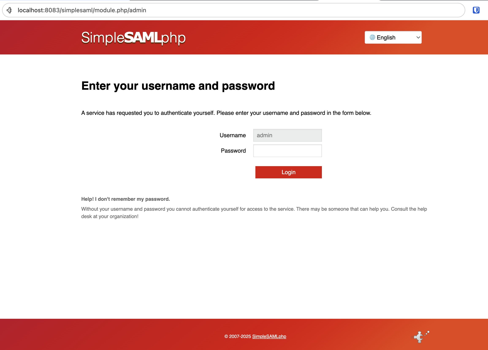

<!--
SPDX-FileCopyrightText: 2025 Sequent Tech <legal@sequentech.io>
SPDX-License-Identifier: AGPL-3.0-only
-->

## Overview

This guide is for **Sequent delivery team members** responsible for:
1. Configuring the Keycloak Service Provider (SP) for IdP-initiated SSO integrations
2. Testing the integration before client handoff
3. Handing off the integration to third-party clients

**Audience:** Sequent operations, delivery, and support teams

**For third-party integrators:** See the [IdP-Initiated SSO Integration Guide](../../integrations/idp_initiated_sso_integration_guide) instead.

**For internal developers:** See the [IdP-Initiated SSO Design & Implementation](../Keycloak/idp_initiated_sso_design_implementation) for technical details.

### What This Guide Covers

1. **Keycloak SP configuration** for a new tenant/event
2. **Testing with the SimpleSAMLphp reference implementation** before client handoff
3. **Information package** to provide to third-party integrators
4. **Handoff checklist** to ensure smooth client integration
5. **Troubleshooting** common issues during integration

### Architecture Overview

* **Third-Party IdP:** Client's identity provider (they control this)
* **Keycloak (SP/Broker):** Sequent-controlled authentication service that receives SAML assertions
* **Voting Portal:** Target application where users access voting functionality
* **SimpleSAMLphp Reference:** Testing tool to verify Keycloak configuration before client integration

## Prerequisites

Before starting a new IdP-initiated SSO integration:

1. **Tenant and Event Information:**
   - Tenant ID (UUID)
   - Event ID (UUID)
   - Client organization name (for IdP alias)

2. **Access to Keycloak Admin Console:**
   - Admin credentials for the Keycloak instance
   - Ability to create/modify realms, identity providers, and clients

3. **For Testing (Optional but Recommended):**
   - Local SimpleSAMLphp instance for pre-handoff testing
   - Access to the Step repository (`.devcontainer/simplesamlphp/`)

4. **Client Information (to be received from third-party):**
   - IdP Entity ID
   - IdP SSO Service URL
   - IdP public signing certificate (X.509 format)
   - IdP metadata URL (if available)

---

## Phase 1: Initial Keycloak Configuration

### Step 1.1: Create or Verify the Realm

The realm identifier follows the pattern:
```
tenant-{TENANT_ID}-event-{EVENT_ID}
```

**Example:**
```
tenant-90505c8a-23a9-4cdf-a26b-4e19f6a097d5-event-cd1397d3-d236-42b4-a019-49143b616e13
```

Typically, this is created automatically for every Election Event. For example,
when you import or create an election event, the url of the election event
contains the election event id, something like:

```
http://localhost:3002/sequent_backend_election_event/e3329c90-a238-4e45-b480-18a8b5ad64cf
```

And also the realm identifier appear in the login link for the election event,
that you can obtain at the bottom of the Admin Portal Dashboard under the Link
`Voter Login URL`, something like:

```
http://localhost:3000/tenant/90505c8a-23a9-4cdf-a26b-4e19f6a097d5/event/e3329c90-a238-4e45-b480-18a8b5ad64cf/login
```

Once you have obtained the realm identifier:

1. Log into Keycloak Admin Console
2. Find the realm in the sidebar under `Manage Realms` action

**To export the realm certificate:**
1. Go to **Realm Settings** → **Keys** tab
2. Find the `RSA` key
3. Click **Certificate** button
4. Copy the certificate (this will be provided to the client as `SP_CERT_DATA`)

### Step 1.2: Configure the vp-sso SAML Client

This client represents the voting portal application. The configuration below is
typically already automatically set up by the default keycloak realm
configuration in Sequent Voting Plataform. However, you can also use the
instructions below to verify everything is correctly configured, or in case the
realm template is misconfigured or old, to configure these settings manually.

1. **Navigate:** Go to **Clients** in the realm
2. **Create Client:** Click **Create client**
3. **General Settings:**
   * **Client type:** SAML
   * **Client ID:** `vp-sso`
   * Click **Next**

4. **Capability config:** Keep defaults, click **Next**

5. **Login settings:**
   * **Root URL:** `{VOTING_PORTAL_URL}` (e.g., `https://voting-{subdomain}.sequentech.io`)
   * **Valid redirect URIs:** `{VOTING_PORTAL_URL}/*`
   * **IdP-initiated SSO URL Name:** `vp-sso`
   * **IdP-initiated SSO RelayState:** `{VOTING_PORTAL_URL}/tenant/{TENANT_ID}/event/{EVENT_ID}/login`

6. **SAML Capabilities:**
   * **Name ID format:** `email`
   * **Force Name ID format:** **OFF**
   * **Force POST binding:** **ON**
   * **Include AuthnStatement:** **ON**

7. **Signature and Encryption:**
   * **Sign Documents:** **ON**
   * **Sign Assertions:** **ON**
   * **Signature Algorithm:** `RSA_SHA256`
   * **Client signature required:** **OFF** (the voting portal doesn't sign requests)
  
8. Click **`Save`**

9. **`Advanced` Tab:**
   * **Fine grain SAML endpoint configuration:**
     * **Assertion Consumer Service POST Binding URL:** `{KEYCLOAK_BASE_URL}/realms/{REALM_ID}/redirect-provider/redirect`

10. Click **`Save`**

### Step 1.3: Prepare Configuration for Client

At this point, you have the Keycloak configuration complete. Now prepare the information package for the client.

**Configuration values to provide to client:**

| Parameter | Value | Example |
|-----------|-------|---------|
| `TENANT_ID` | The tenant UUID | `abc12345-6789-...` |
| `EVENT_ID` | The event UUID | `def67890-1234-...` |
| `SP_BASE_URL` | Keycloak base URL | `https://login-example.sequent.vote` |
| `SP_IDP_ALIAS` | IdP alias (decided with client) | `clientname-idp` |
| `SP_CLIENT_ID` | SAML client ID | `vp-sso` |
| `SP_CERT_DATA` | Keycloak realm certificate | `MIIDOzCCAi...` |
| `VOTING_PORTAL_URL` | Voting portal URL | `https://voting-example.sequent.vote` |

---

## Phase 2: Test with SimpleSAMLphp Reference Implementation

Before handing off to the client, test the Keycloak configuration using the
SimpleSAMLphp reference implementation.

### Step 2.1: Set Up SimpleSAMLphp Locally

If you are testing this in step repository devcontainer environment, then you
need to edit the environment configuration variables in the `.devcontainer/.env`
file. Otherwise, you will have to replicate these variables used by the
`simplesamlphp` sample app, which you can find in
`.devcontainer/simplesamlphp/.env.example`.

We will asume you are using the step repository devcontainer environment.

1. **Edit `.devcontainer/.env` with your test configuration:**

   Please ensure you use the data relative to your specific environment. For
   example, `SP_CERT_DATA` was obtained in point 1.1. You will be editing the
   section titled `SimpleSAMLphp IdP Configuration` that starts as it is shown
   below:

   ```bash
   ################################################################################
   # SimpleSAMLphp IdP Configuration
   # These variables configure the SimpleSAMLphp instance as a reference IdP
   # implementation for third-party integrators.

   # =============================================================================
   # Simple SAML PHP General Configuration
   # =============================================================================
   ```

2. **Start SimpleSAMLphp** (using Docker or your preferred method). If you are
   testing this with devcontainers, you can run in VSCode the task
   `logs.restart.simplesamlphp`.

3. **Login into SimpleSAMLphp application**, it should be an URL like
   `http://localhost:8083/simplesaml/module.php/admin`, in general something
   like `{IDP_BASE_URL}/module.php/admin`. You should get a login page as below:

:::tip
The `admin` password is setup in the `.env` file mentioned earlier with the
variable `SSP_ADMIN_PASSWORD` and it's `admin` by default, but please remember
this is just a sample implementation, use secure passwords in production.
:::



After login in the SimpleSAMLphp Admin Portal, you should see something like:


### Step 2.2: Configure Keycloak to Trust SimpleSAMLphp

Now configure Keycloak to accept SAML assertions from your local SimpleSAMLphp instance.

1. **Navigate to Authentication** in your Keycloak realm
2. **In the flows tab** Click **Create flow**
   * **Name:** `saml first broker flow`
   * **Flow type:** Basic flow
3. Click **Create**
4. Click **Add execution**
5. Search for `Detect existing broker user` execution and then click **Add**
6. Set the execution to **Required**
7. Click **Add execution**
8. Search for `Automatically set existing user` execution and then click **Add**
9. Set the execution to **Required**
10. **Navigate to Identity Providers** in your Keycloak realm
8. **Add provider:** Click **Add provider** → **SAML v2.0**
9.  **Configure Identity Provider:**
   * **Alias:** `yourcompany-idp` (matches `SP_IDP_ALIAS` from `.env`)
   * **Display Name:** `SimpleSAMLphp IdP`
   * **Service provider entity ID:** `tenant-{TENANT_ID}-event-{EVENT_ID}`

10. **Import SimpleSAMLphp metadata (recommended):**
   * **Use Entity Descriptor**: **OFF**
   * Download `http://localhost:8083/simplesaml/saml2/idp/metadata.php`
   * Drag and drop the downloaded xml into **Import config from file**
   * **Principal Type:** Attribute Name
   * **Principal Attribute:** email
   * **Validate Signatures:** **ON**
   * **First login flow override:** saml first broker flow
   * Click **Add**

   **OR manually configure:**
   * **Use Entity Descriptor**: **OFF**
   * **Single Sign-On Service URL:** `http://localhost:8083/simplesaml/saml2/idp/SSOService.php`
   * **Single Logout Service URL:** `http://localhost:8083/simplesaml/saml2/idp/SingleLogoutService.php`
   * **NameID Policy Format:** Transient
   * **Principal Type:** Attribute Name
   * **Principal Attribute:** email
   * **HTTP-POST Binding Response:** **ON**
   * **HTTP-POST Binding AuthnRequest:** **ON**
   * **Want AuthnRequests Signed:** **OFF** (for testing; ON in production)
   * **Signature Algorithm:** RSA_SHA256
   * **Want Assertions Signed:** **ON**
   * **Validate Signatures:** **ON**
   * **Validating X509 Certificates:** Paste SimpleSAMLphp's public certificate (`server.crt` content, without BEGIN/END lines)
   * **First login flow override:** saml first broker flow

11. **Configure Attribute Mapper:**
   * Go to **Mappers** tab
   * Click **Create**
   * **Name:** `email-mapper`
   * **Mapper type:** Attribute Importer
   * **Attribute Name:** `email`
   * **Friendly Name:** Email
   * **Name Format:** ATTRIBUTE_FORMAT_BASIC
   * **User Attribute Name:** `email`
   * Click **Save**

### Step 2.3: (Optional) Enable Auto-Redirect to IdP

To skip the Keycloak login page and automatically redirect users to the external IdP:

1. **Navigate to Authentication** → **Flows** in your Keycloak realm
2. Select **Browser** flow (or your custom browser flow if you have one)
3. Find the **Identity Provider Redirector** execution
4. Click **Actions** → **Config**
5. Set **Alias:** `auto-redirect-idp`
6. Set **Default Identity Provider:** `yourcompany-idp` (must match your IdP alias exactly)
7. Click **Save**

**What this does:** Users accessing the voting portal will be immediately redirected to the external IdP without seeing the Keycloak login page.

**When to use:** Enable this when all voters must authenticate through the external IdP and you don't need local Keycloak accounts.

**Admin access:** You can still access Keycloak admin console directly at `{KEYCLOAK_URL}/admin/{realm}/console`

### Step 2.4: Run End-to-End Test

1. **Access the SimpleSAMLphp trigger page:**
   ```
   http://localhost:8083/simplesaml/idp-initiated-sso.php
   ```

2. **Click "Login to Voting Portal"**

3. **Authenticate** with test credentials (as configured in `SSP_EXAMPLE_USERS` env var):
   - Default: Username: `user1` / Password: `password`
   - Or: Username: `user2` / Password: `password`

   You can customize test users by editing the `SSP_EXAMPLE_USERS` environment
   variable in `.devcontainer/.env`. Format: `username1:password1:email1,username2:password2:email2,...`

4. **Authenticated:** You should get authenticated succesfully and redirected
   to the voting portal. The intermiate steps that happens quickly one after
   the other are:
   1. SimpleSAMLphp authenticates the user
   2. SAML assertion is generated and POSTed to Keycloak
   3. Keycloak validates the signature
   4. Keycloak creates/updates user based on email attribute
   5. Browser redirects to Voting Portal
   6. Voting Portal detects user is authenticated and it lists available ballots

### Step 2.5: Troubleshooting Test Issues

**Issue: Login timeout. Please sign in again**
- Verify `EVENT_ID` and `TENANT_ID` in `.env` are correct and that the Keycloak
  Service provider entity ID is equal to the realm's name, something like
  `tenant-{TENANT_ID}-event-{EVENT_ID}`

**Issue: "Identity Provider not found"**
- Verify `SP_IDP_ALIAS` in `.env` matches the Keycloak Identity Provider alias

**Issue: "Signature validation failed"**
- Ensure SimpleSAMLphp's `server.crt` certificate is correctly pasted in Keycloak
- Remove `-----BEGIN CERTIFICATE-----` and `-----END CERTIFICATE-----` lines
- Check that SimpleSAMLphp is signing assertions (check `saml20-idp-hosted.php`)

**Issue: "User not created"**
- Verify the `email` attribute mapper is configured in Keycloak
- Check SimpleSAMLphp's `authsources.php` includes `email` in user attributes
- Verify the `SSP_EXAMPLE_USERS` environment variable is correctly formatted with emails

**Issue: "Wrong redirect URL"**
- Verify the `RelayState` in SimpleSAMLphp's `idp-initiated-sso.php`
- Check it matches the expected voting portal login URL pattern

---

## Phase 3: Client Handoff

Once testing is successful, prepare the handoff package for the client.

### Step 3.1: Information Package for Client

Provide the client with:

1. **Configuration Values (from Step 1.3)**
2. **Integration Guide:** Link to `/docs/integrations/idp_initiated_sso_integration_guide`
3. **Reference Implementation:** Access to `.devcontainer/simplesamlphp/` in the Step repository
4. **Keycloak Metadata URL:**
   ```
   {SP_BASE_URL}/realms/tenant-{TENANT_ID}-event-{EVENT_ID}/broker/{SP_IDP_ALIAS}/endpoint/descriptor
   ```

### Step 3.2: Request from Client

Request the following from the client:

1. **IdP Metadata URL** (preferred) or:
2. **Manual configuration values:**
   - IdP Entity ID
   - IdP SSO Service URL
   - IdP Single Logout Service URL (optional)
   - IdP public signing certificate (X.509 PEM format)
3. **Test user credentials** for staging verification
4. **Expected production go-live date**

### Step 3.3: Configure Keycloak with Client IdP

Once you receive the client's IdP information:

1. **Delete or disable the SimpleSAMLphp test Identity Provider**
2. **Create new Identity Provider** for the client:
   * **Alias:** `{client-name}-idp` (use client organization name)
   * **Import client's IdP metadata** (preferred) or manually configure
   * **Configure same attribute mappers** as in testing
   * **Enable signature validation** (`Validate Signatures: ON`)
   * **Paste client's public certificate**

3. **Test with client:**
   * Client initiates SSO from their IdP
   * Verify user attributes are correctly mapped
   * Verify redirect to voting portal works

### Step 3.4: Production Handoff Checklist

Before going live, verify:

- [ ] Keycloak realm configuration complete
- [ ] Client's production IdP configured and trusted
- [ ] Production certificates exchanged
- [ ] Attribute mapping tested (email required)
- [ ] End-to-end test successful in staging environment
- [ ] Production URLs configured (no localhost references)
- [ ] HTTPS enabled on all endpoints
- [ ] Backup of Keycloak realm configuration taken
- [ ] Monitoring and logging enabled
- [ ] Client has integration guide documentation
- [ ] Go-live date coordinated with client

---

## Phase 4: Post-Handoff Support

### Common Client Issues

#### Issue 1: "SAML Response Signature Invalid"

**Client Side:**
- Their IdP isn't signing the response/assertion
- Wrong signing algorithm
- Certificate mismatch

**Sequent Side:**
- Verify we have their correct public certificate in Keycloak
- Check `Validate Signatures` is enabled
- Verify signing algorithm matches (RSA-SHA256 or stronger)

**Resolution:**
- Request updated certificate from client
- Have client verify their IdP signing configuration
- Use SAML tracer to inspect signature in assertion

#### Issue 2: "Invalid Audience Restriction"

**Cause:** Client's IdP is sending wrong audience value

**Resolution:**
- Client must set audience to: `tenant-{TENANT_ID}-event-{EVENT_ID}`
- Verify client has correct `SP_REALM` value
- Reference the SimpleSAMLphp SP remote metadata configuration

#### Issue 3: "User Not Created / Email Missing"

**Cause:** Email attribute not included in SAML assertion

**Resolution:**
- Verify Keycloak attribute mapper configuration
- Have client check their IdP includes `email` attribute
- Compare assertion structure with SimpleSAMLphp example

#### Issue 4: "RelayState Not Working"

**Cause:** RelayState not preserved through flow

**Resolution:**
- Verify client's IdP includes RelayState in SAML Response POST
- Check client is using correct RelayState URL format
- Test with SimpleSAMLphp to verify Keycloak side works

### Debugging Tools

1. **SAML Tracer Browser Extension:**
   - Firefox: SAML-tracer
   - Chrome: SAML Chrome Panel
   - Captures all SAML messages in flight

2. **Keycloak Logs:**
   - Enable DEBUG level logging for SAML broker
   - Check for signature validation errors
   - Look for attribute mapping issues

3. **Client Comparison:**
   - Compare client's SAML assertion with SimpleSAMLphp reference
   - Verify structure matches expected format

### Escalation Path

If issues persist:
1. **Review with internal dev team** (reference design documentation)
2. **Request SAML tracer logs** from client
3. **Compare assertions** side-by-side with working SimpleSAMLphp example
4. **Schedule debug session** with client technical team
5. **Check Keycloak version compatibility** if using newer SAML features

---

## Reference: Key URLs and Patterns

### Keycloak URLs

**Realm identifier:**
```
tenant-{TENANT_ID}-event-{EVENT_ID}
```

**IdP metadata endpoint:**
```
{SP_BASE_URL}/realms/{REALM_ID}/broker/{IDP_ALIAS}/endpoint/descriptor
```

**ACS URL:**
```
{SP_BASE_URL}/realms/{REALM_ID}/broker/{IDP_ALIAS}/endpoint/clients/{CLIENT_ID}
```

**Redirect provider endpoint:**
```
{SP_BASE_URL}/realms/{REALM_ID}/redirect-provider/redirect
```

### Voting Portal URLs

**Login page:**
```
{VOTING_PORTAL_URL}/tenant/{TENANT_ID}/event/{EVENT_ID}/login
```

### SimpleSAMLphp Reference Files

- **Configuration:** `.devcontainer/simplesamlphp/config.php`
- **Environment:** `.devcontainer/simplesamlphp/.env.example`
- **IdP Metadata:** `.devcontainer/simplesamlphp/metadata/saml20-idp-hosted.php`
- **SP Metadata:** `.devcontainer/simplesamlphp/metadata/saml20-sp-remote.php`
- **Trigger Page:** `.devcontainer/simplesamlphp/public/idp-initiated-sso.php`

---

## Additional Resources

- **Third-Party Integration Guide:** [IdP-Initiated SSO Integration Guide](../../integrations/idp_initiated_sso_integration_guide)
- **Internal Design Documentation:** [IdP-Initiated SSO Design & Implementation](../Keycloak/idp_initiated_sso_design_implementation)
- **SimpleSAMLphp Reference:** `.devcontainer/simplesamlphp/README.md`
- **Keycloak Documentation:** https://www.keycloak.org/docs/latest/server_admin/#_identity_broker
