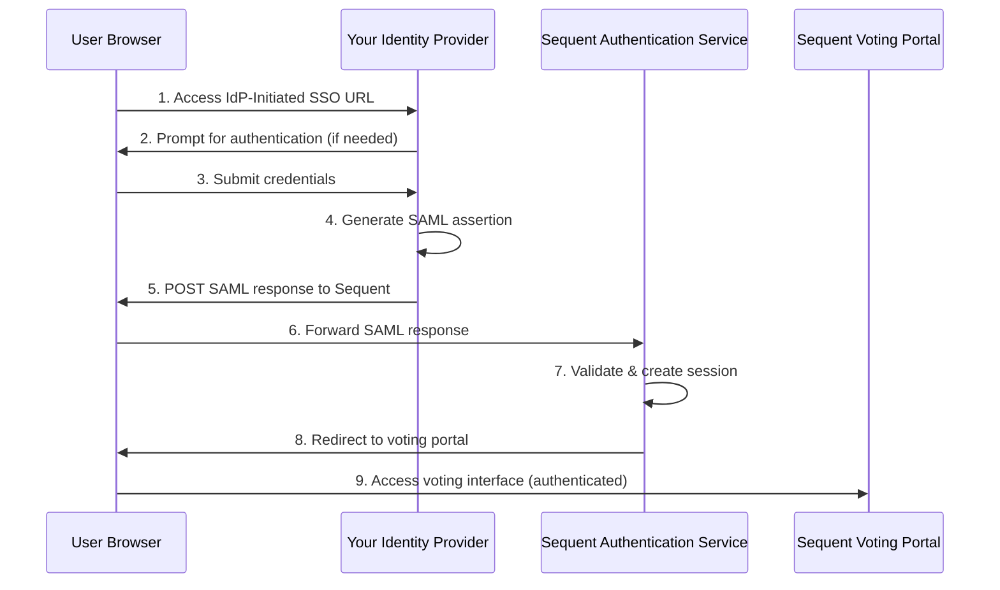

<!--
SPDX-FileCopyrightText: 2025 Sequent Tech <legal@sequentech.io>
SPDX-License-Identifier: AGPL-3.0-only
-->

# IdP-Initiated SAML SSO Integration Guide

## Overview

This guide is for **third-party organizations** integrating their Identity
Provider (IdP) with Sequent's voting platform using IdP-initiated SAML 2.0
Single Sign-On (SSO).

### What is IdP-Initiated SSO?

In IdP-initiated SSO, users begin their authentication journey at 
**your identity provider** and are then redirected to Sequent's voting platform
with an established authentication session. This allows your users to:

1. Start at your organization's portal or login page
2. Authenticate using your existing authentication system
3. Be automatically logged into Sequent's voting platform
4. Access the voting interface without additional login prompts

### Architecture Overview



---

## Integration Approach

This guide uses Sequent's **SimpleSAMLphp reference implementation** as the primary integration method. This implementation:

- Demonstrates all patterns and configurations needed
- Can be run locally to test against Sequent's staging
- Provides working code you can adapt to your platform
- Shows exactly how to construct URLs and metadata

**You will:**
1. Get the reference implementation working with Sequent staging
2. Understand how it works by reviewing the code
3. Adapt the patterns to your production IdP (ADFS, Okta, Shibboleth, etc.)

---

## Step 1: Get Configuration from Sequent

Contact Sequent technical support to request your integration parameters. You'll receive:

| Parameter | Description | Example |
|-----------|-------------|---------|
| `TENANT_ID` | Your organization's tenant UUID | `abc12345-6789-...` |
| `EVENT_ID` | Your voting event UUID | `def67890-1234-...` |
| `SP_BASE_URL` | Sequent's authentication service URL | `https://login-example.sequent.vote` |
| `VOTING_PORTAL_URL` | Voting portal base URL | `https://voting-example.sequent.vote` |
| `SP_IDP_ALIAS` | Your IdP identifier | `yourcompany-idp` |
| `SP_CLIENT_ID` | SAML client ID | `vp-sso` |
| `SP_CERT_DATA` | Sequent's public certificate | `MIIDOzCCAi...` (base64) |

**Save these values** - you'll use them in the next step.

---

## Step 2: Set Up the Reference Implementation

### 2.1 Clone and Navigate

```bash
# Clone the Step repository
git clone <step-repo-url>
cd step/.devcontainer/
```

### 2.2 Configure Environment

Copy the environment template and fill in your values:

```bash
cp .env.development .env
```

Edit `.devcontainer/.env` with the configuration from Step 1. Note that there
are more environment variables that can be edited, but the most important one
to make this work are the following:

```bash
# Your local IdP URLs (for development)
IDP_BASE_URL=http://localhost:8083/simplesaml
IDP_HOSTNAME=localhost:8083

# Example users for testing SimpleSAMLphp authentication
# Format: "username1:password1:email1,username2:password2:email2,..."
# You can customize these for your testing needs
SSP_EXAMPLE_USERS=user1:password:user1@example.com,user2:password:user2@example.com

# Sequent configuration (from Step 1)
TENANT_ID=<your-tenant-id>
EVENT_ID=<your-event-id>
SP_BASE_URL=https://login-example.sequent.vote
SP_IDP_ALIAS=yourcompany-idp
SP_CLIENT_ID=vp-sso
SP_CERT_DATA=<certificate-from-sequent>
VOTING_PORTAL_URL=https://voting-example.sequent.vote
```

:::note
The variables above appear in the `.devcontainer/.env` file under the section
titled `SimpleSAMLphp Id Configuration` that starts as it is shown below:

   ```bash
   ################################################################################
   # SimpleSAMLphp IdP Configuration
   # These variables configure the SimpleSAMLphp instance as a reference IdP
   # implementation for third-party integrators.

   # =============================================================================
   # Simple SAML PHP General Configuration
   # =============================================================================
   ```
:::

### 2.3 Start SimpleSAMLphp

Using Docker (recommended):

```bash
cd .devcontainer/
docker-compose up simplesamlphp
```

### 2.4 Set Up ngrok Tunnel (Required for Staging Testing)

**Why ngrok is needed:** Your SimpleSAMLphp runs locally on `localhost:8083`,
but Sequent's staging environment needs to reach your IdP to fetch metadata and
validate signatures. ngrok creates a public URL that tunnels to your local
instance.

**Install ngrok:**
```bash
# Download from https://ngrok.com/download
# Or install via package manager:
brew install ngrok  # macOS
snap install ngrok  # Linux
choco install ngrok # Windows
```

**Start ngrok tunnel:**
```bash
ngrok http 8083
```

**You'll see output like:**
```
Forwarding  https://abc123.ngrok.io -> http://localhost:8083
```

**Update your configuration** with the ngrok URL:

Edit `simplesamlphp/.env` and change:
```bash
# Before:
IDP_BASE_URL=http://localhost:8083/simplesaml
IDP_HOSTNAME=localhost:8083

# After (use your ngrok URL):
IDP_BASE_URL=https://abc123.ngrok.io/simplesaml
IDP_HOSTNAME=abc123.ngrok.io
```

**Restart SimpleSAMLphp** to pick up the new configuration:
```bash
docker-compose restart simplesamlphp
```

### 2.5 Access the Reference Implementation

Once running with ngrok, access:
- **Admin interface:** `https://abc123.ngrok.io/simplesaml/` (use your ngrok URL)
- **IdP metadata:** `https://abc123.ngrok.io/simplesaml/saml2/idp/metadata.php`
- **SSO trigger page:** `https://abc123.ngrok.io/simplesaml/idp-initiated-sso.php`

**Important:** Keep ngrok running throughout your testing session. If you restart ngrok, you'll get a new URL and need to update configuration again.

---

## Step 3: Provide Your Metadata to Sequent

Sequent needs your IdP metadata to configure trust. Provide:

1. **IdP Metadata URL:** `http://localhost:8083/simplesaml/saml2/idp/metadata.php`
   - Or download and send the XML file
2. **IdP Entity ID:** Found in the metadata (will be `http://localhost:8083/simplesaml/saml2/idp/metadata.php`)
3. **IdP SSO URL:** `http://localhost:8083/simplesaml/saml2/idp/SSOService.php`
4. **Public Certificate:** Found in `.devcontainer/simplesamlphp/cert/server.crt`

**For testing:** Sequent will configure their staging environment to accept assertions from your local SimpleSAMLphp instance.

---

## Step 4: Test the Integration

### 4.1 Test End-to-End Flow

1. Open browser to: `http://localhost:8083/simplesaml/idp-initiated-sso.php`
2. Click **"Login to Voting Portal"**
3. Authenticate with test credentials (as configured in `SSP_EXAMPLE_USERS`):
   - Default: Username: `user1` / Password: `password`
   - Or: Username: `user2` / Password: `password`
   - You can customize these users by editing the `SSP_EXAMPLE_USERS` environment variable
4. You should be redirected to Sequent's staging voting portal
5. Verify you're logged in

### 4.2 Verify the Flow

Use the [SAML-tracer Chrome extension](https://chromewebstore.google.com/detail/saml-tracer/mpdajninpobndbfcldcmbpnnbhibjmch) to inspect:
- SAML assertion is generated by SimpleSAMLphp
- Assertion includes `email` attribute
- Response/Assertion is signed
- POST goes to correct ACS URL
- RelayState is preserved
- Sequent validates and creates session

### 4.3 Common Test Issues

**Issue: "Identity Provider not found"**
- Verify Sequent has configured your `SP_IDP_ALIAS` correctly
- Check the metadata you provided matches

**Issue: "Signature validation failed"**
- Verify Sequent has your correct `server.crt` certificate
- Check SimpleSAMLphp is signing (see `metadata/saml20-idp-hosted.php`)

**Issue: "User not created"**
- Verify `email` attribute is in the assertion
- Check Sequent has configured email attribute mapping

---

## Step 5: Understand How It Works

Now that you have it working, understand the implementation so you can adapt it.

### 5.1 Centralized Configuration

**File:** `.devcontainer/simplesamlphp/config.php`

All configuration in one place, loaded from environment variables:

```php
<?php
return [
    // Your IdP configuration
    'idp_base_url' => getenv('IDP_BASE_URL') ?: 'http://localhost:8083/simplesaml',

    // Sequent provided values
    'tenant_id' => getenv('TENANT_ID') ?: '...',
    'event_id' => getenv('EVENT_ID') ?: '...',
    'sp_base_url' => getenv('SP_BASE_URL') ?: 'https://login-example.sequent.vote',
    'sp_idp_alias' => getenv('SP_IDP_ALIAS') ?: 'yourcompany-idp',
    'sp_client_id' => getenv('SP_CLIENT_ID') ?: 'vp-sso',
    'sp_cert_data' => getenv('SP_CERT_DATA') ?: 'MII...',
    'voting_portal_url' => getenv('VOTING_PORTAL_URL') ?: 'https://voting-example.sequent.vote',

    // Automatically computed
    'sp_realm' => 'tenant-' . (getenv('TENANT_ID') ?: '...') . '-event-' . (getenv('EVENT_ID') ?: '...'),
];
```

**Key takeaway:** All deployment-specific values come from environment variables. No hardcoding.

### 5.2 Service Provider Metadata

**File:** `.devcontainer/simplesamlphp/metadata/saml20-sp-remote.php`

Shows how to configure Sequent as a trusted Service Provider:

```php
<?php
$config = require __DIR__ . '/../config.php';

// Build the ACS URL where Sequent receives SAML responses
$acsUrl = sprintf(
    '%s/realms/%s/broker/%s/endpoint/clients/%s',
    $config['sp_base_url'],      // https://login-example.sequent.vote
    $config['sp_realm'],          // tenant-...-event-...
    $config['sp_idp_alias'],      // yourcompany-idp
    $config['sp_client_id']       // vp-sso
);

// The Entity ID is the realm identifier
$metadata[$config['sp_realm']] = [
    'AssertionConsumerService' => [
        [
            'Binding' => 'urn:oasis:names:tc:SAML:2.0:bindings:HTTP-POST',
            'Location' => $acsUrl
        ],
    ],
    'certData' => $config['sp_cert_data'],  // Sequent's public certificate
];
```

**Key takeaway:** The ACS URL follows a specific pattern. The SP Entity ID is the realm identifier (tenant-event combination).

### 5.3 IdP Metadata

**File:** `.devcontainer/simplesamlphp/metadata/saml20-idp-hosted.php`

Configures your IdP's behavior:

```php
<?php
$config = require __DIR__ . '/../config.php';

// Your IdP's Entity ID
$entityId = rtrim($config['idp_base_url'], '/') . '/saml2/idp/metadata.php';

$metadata[$entityId] = [
    'privatekey' => 'server.pem',           // For signing
    'certificate' => 'server.crt',          // Public certificate
    'auth' => 'example-userpass',           // How users authenticate
    'saml20.sign.response' => true,         // Sign SAML response
    'saml20.sign.assertion' => true,        // Sign assertion
];
```

**Key takeaway:** You must sign SAML responses/assertions. Your IdP needs a certificate.

### 5.4 SSO Trigger Page

**File:** `.devcontainer/simplesamlphp/public/idp-initiated-sso.php`

Shows how to initiate the SSO flow:

```php
<?php
$config = require __DIR__ . '/../config.php';

// The SP Entity ID to target
$spEntityId = $config['sp_realm'];

// Where to redirect after authentication
$finalRedirectUrl = sprintf(
    '%s/tenant/%s/event/%s/login',
    $config['voting_portal_url'],
    $config['tenant_id'],
    $config['event_id']
);

// Build SSO URL with parameters
$ssoUrl = "/simplesaml/saml2/idp/SSOService.php?" . http_build_query([
    'spentityid' => $spEntityId,        // Which SP to send to
    'RelayState' => $finalRedirectUrl,  // Where to go after auth
]);
?>

<a href="<?php echo htmlspecialchars($ssoUrl); ?>">Login to Voting Portal</a>
```

**Key takeaway:** You need two parameters: `spentityid` (the realm) and `RelayState` (voting portal URL).

### 5.5 User Authentication Configuration

**File:** `.devcontainer/simplesamlphp/config/authsources.php`

Shows how to configure test users (for the reference implementation only):

```php
// Parse SSP_EXAMPLE_USERS environment variable
// Format: "username1:password1:email1,username2:password2:email2,..."
$exampleUsersEnv = getenv('SSP_EXAMPLE_USERS') ?: 'user1:password:user1@example.com,user2:password:user2@example.com';
$exampleUsers = [];

foreach (explode(',', $exampleUsersEnv) as $userSpec) {
    $parts = explode(':', trim($userSpec), 3);
    if (count($parts) === 3) {
        $username = $parts[0];
        $password = $parts[1];
        $email = $parts[2];
        $exampleUsers["$username:$password"] = [
            'email' => $email,
        ];
    }
}
```

**Key takeaway:** Test users are configured via the `SSP_EXAMPLE_USERS` environment variable. In production, your IdP will use its own authentication mechanism.

### 5.6 SAML Assertion Requirements

Your IdP must generate assertions with:

**Subject:**
- `NameID`: User's email address
- `NameID Format`: `urn:oasis:names:tc:SAML:1.1:nameid-format:emailAddress`

**Conditions:**
- `AudienceRestriction`: Must be `tenant-{TENANT_ID}-event-{EVENT_ID}`
- `NotBefore` / `NotOnOrAfter`: 5-minute validity window

**Attributes:**
- `email`: User's email address (required)

**Signing:**
- Sign the Response and/or Assertion with RSA-SHA256 or stronger

SimpleSAMLphp handles this automatically when configured correctly.

---

## Step 6: Adapt to Your Production IdP

Now that you understand the reference implementation, adapt it to your production IdP.

### For ADFS

1. Create a **Relying Party Trust** in ADFS
2. **Entity ID:** `tenant-{TENANT_ID}-event-{EVENT_ID}`
3. **ACS URL:** `{SP_BASE_URL}/realms/{SP_REALM}/broker/{SP_IDP_ALIAS}/endpoint/clients/{SP_CLIENT_ID}`
4. **Claim Rules:** Map user email to SAML attribute named `email`
5. **Signing:** Enable signing with certificate
6. **IdP-Initiated SSO:** Configure endpoint URL with `spentityid` and `RelayState`

### For Okta

1. Create a **SAML 2.0 App Integration**
2. **Single Sign-On URL:** Use ACS URL from above
3. **Audience URI:** `tenant-{TENANT_ID}-event-{EVENT_ID}`
4. **Attribute Statements:** Map email to `email`
5. **Enable IdP-Initiated SSO:** In app settings
6. **Test:** Use Okta's IDP-initiated SSO URL with RelayState parameter

### For Shibboleth

1. Configure **`<RelyingParty>`** in `relying-party.xml`
2. Set **entityID** to the realm identifier
3. Configure **`<AttributeResolver>`** for email attribute
4. Set up **IdP-initiated SSO endpoint** with parameters
5. Configure **signing** in metadata

### For Custom IdP

Follow the patterns from the reference implementation:

1. **Configuration:** Centralize all values (tenant ID, event ID, URLs)
2. **Metadata:** Build ACS URL using the pattern shown
3. **Entity ID:** Use the realm identifier as SP Entity ID
4. **SSO URL:** Include `spentityid` and `RelayState` parameters
5. **Assertion:** Include email attribute, sign response/assertion
6. **POST:** Send to ACS URL with RelayState preserved

---

## Step 7: Production Checklist

- [ ] All URLs updated to production values
- [ ] HTTPS enabled on all endpoints
- [ ] Production certificates exchanged
- [ ] Integration tested in staging environment first
- [ ] Email attribute mapping verified
- [ ] Signing enabled and tested
- [ ] RelayState validation working
- [ ] Clock synchronization configured (NTP)
- [ ] Monitoring and logging enabled
- [ ] Go-live date coordinated with Sequent

---

## Troubleshooting

### Common Issues

**"SAML Response Signature Invalid"**
- Sequent doesn't have your correct public certificate
- You're not signing the response/assertion
- Signing algorithm mismatch
- **Fix:** Verify certificate exchange, check signing configuration

**"Invalid AudienceRestriction"**
- Assertion audience doesn't match realm identifier
- **Fix:** Ensure audience is exactly `tenant-{TENANT_ID}-event-{EVENT_ID}`

**"User Not Created / Email Missing"**
- Email attribute not included in assertion
- **Fix:** Verify email attribute is present and named `email`

**"RelayState Not Working"**
- RelayState not preserved through flow
- **Fix:** Ensure IdP passes RelayState in SAML Response POST

**"Clock Skew Error"**
- Time difference between servers
- **Fix:** Configure NTP on all servers

### Debug Tools

1. **SAML Tracer** (browser extension) - inspect SAML messages
2. **Sequent logs** - request from Sequent support
3. **Reference implementation** - compare with working SimpleSAMLphp

---

## Security Requirements

### Critical

- **HTTPS in production** (mandatory)
- **Sign all SAML messages** (response and/or assertion)
- **Validate signatures** (both sides)
- **Protect private keys** (never commit to git)
- **Certificate rotation** (monitor expiration)
- **Audience restriction** (include correct realm)
- **Time-based validation** (NotBefore/NotOnOrAfter)
- **Unique assertion IDs** (prevent replay)
- **NTP synchronization** (prevent clock skew)

---

## Support

**Technical Questions:** support@sequentech.io

**Reference Implementation:** `.devcontainer/simplesamlphp/` in Step repository

**Integration Coordination:** Contact Sequent to schedule staging/production setup

---

## Summary

### What You Did

1. Got configuration values from Sequent
2. Set up SimpleSAMLphp reference implementation
3. Provided your metadata to Sequent
4. Tested integration end-to-end
5. Understood how the implementation works
6. Adapted patterns to your production IdP
7. Deployed to production

### Key Files to Reference

- **`config.php`** - Centralized configuration pattern
- **`metadata/saml20-sp-remote.php`** - How to configure Sequent SP
- **`metadata/saml20-idp-hosted.php`** - How to configure your IdP
- **`public/idp-initiated-sso.php`** - How to initiate SSO

### Remember

You don't have to use SimpleSAMLphp in production. The reference implementation
shows you the **patterns and configuration** that work with any SAML 2.0 IdP
platform. Adapt them to your technology stack.
